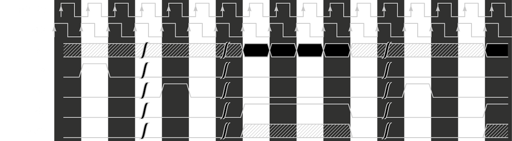
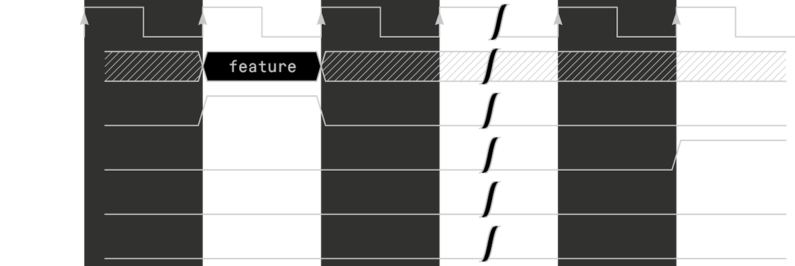
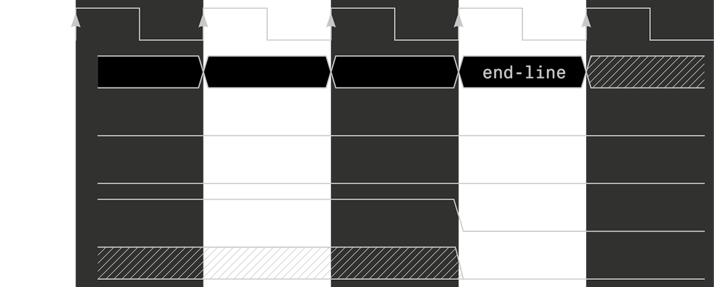
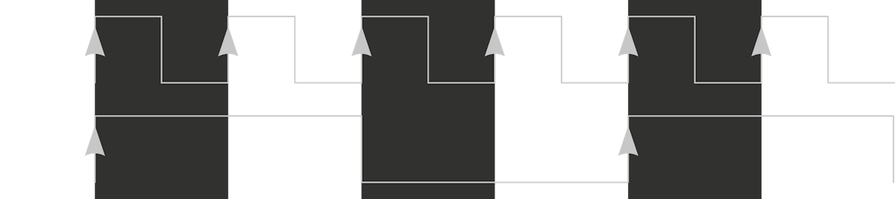
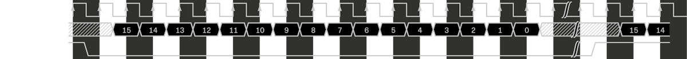

# Bus Communication

## Overview

From the FPGA point of view there are 4 busses connected. BRIDGE, PAD, VIDEO, AUDIO.

Analogue provides the integration code, as part of the APF, for both BRIDGE and PAD to completely abstract their use and be as simple as possible.

Example code for driving the VIDEO and AUDIO busses is provided.

## BRIDGE

* Framework/Pocket: Controller
* Core: Peripheral

All communication to the framework happens over this bus with a 32-bit address space. Assets are loaded/unloaded and Host/Target commands, along with all other things like custom UI settings, Chip32, and so on.

Memory mapping of any devices or interfaces in the core is completely implementation-specific. The only requirement is that 0xF8xxxxxx is reserved for framework communication, but all other addresses may be used. The load location of an asset is determined by the JSON core description.

Physical implementation is abstracted through the framework with an adapter module appearing to the core as a 32-bit address space with 32bit wide read/write bus. There is no bus arbitration. Reads ands writes are relatively slow at only a few megabytes per second.

All cores are required to implement a baseline set of Host/Target commands to boot. Example code for handling the 0xF8xxxxxx region is provided and can be extended in cores with additional requirements.

> Reads are buffered to maintain throughput and relax timing requirements. Upon receiving a read the core may not immediately provide the read data and has up until the next read strobe to drive bridge_rd_data.

Interface signals to toplevel:

```verilog
output  wire          bridge_endian_little,
input   wire  [31:0]  bridge_addr,
input   wire          bridge_rd,
output  reg   [31:0]  bridge_rd_data,
input   wire          bridge_wr,
input   wire  [31:0]  bridge_wr_data,
```

## PAD

* Framework/Pocket: Peripheral
* Core: Controller

Simple 1-wire bus host providing all controller data (internal to Pocket) or external 4 player data from Dock. Input switching is handled automatically.

Additionally, this bus sends a regular heartbeat signal to let APF know the core is still in operation. When a dev reloads core using JTAG, Pocket will detect the loss of signal and reload the core with the same start conditions for faster debugging.

Up to 4 controllers are supported. Controllers are read over the PAD bus automatically by the framework. A 4-bit "type" field tells which classification of input device is currently connected - zero means no device is connected, and any non-zero value means an input device is connected.

| Type Field (4 bits) | Description                                         |
| ------------------- | --------------------------------------------------- |
| 0x0                 | Nothing connected                                   |
| 0x1                 | Pocket built-in buttons (only possible on Player 1) |
| 0x2                 | Docked game controller, no analog support           |
| 0x3                 | Docked game controller, analog support              |
| 0x4                 | Docked keyboard                                     |
| 0x5                 | Docked mouse                                        |
| 0x7-0xF             | Reserved                                            |

Each controller has three signals:

```
[31:0]  key
[0]     dpad_up
[1]     dpad_down
[2]     dpad_left
[3]     dpad_right
[4]     face_a
[5]     face_b
[6]     face_x
[7]     face_y
[8]     trig_l1
[9]     trig_r1
[10]    trig_l2
[11]    trig_r2
[12]    trig_l3
[13]    trig_r3
[14]    face_select
[15]    face_start
[28:16] <unused>
[31:28] type

[31:0]  joy
[ 7: 0] lstick_x
[15: 8] lstick_y
[23:16] rstick_x
[31:24] rstick_y
 
[15:0]  trigger
[ 7: 0] ltrig
[15: 8] rtrig
```

> Joy and trigger use 8-bit unsigned analog values. Both are only applicable when docked with a compatible controller connected.

Interface signals to toplevel:

```verilog
input	wire	[31:0]	cont1_key,
input	wire	[31:0]	cont2_key,
input	wire	[31:0]	cont3_key,
input	wire	[31:0]	cont4_key,
input	wire	[31:0]	cont1_joy,
input	wire	[31:0]	cont2_joy,
input	wire	[31:0]	cont3_joy,
input	wire	[31:0]	cont4_joy,
input	wire	[15:0]	cont1_trig,
input	wire	[15:0]	cont2_trig,
input	wire	[15:0]	cont3_trig,
input	wire	[15:0]	cont4_trig,
```

### Special Controller Types

The keyboard/mouse controller types, when present, pack data into the existing pad registers:

### Keyboard

Up to six concurrent 8-bit keyboard scan codes, and up to 16 modifier keys (commonly used for Ctrl, Alt, Shift, etc). The scan codes comply the USB HID Keyboard specification. The order in which scan codes appear in the registers is implementation-dependent and may differ on the time in which the user pressed the keys.

| Register bit range | Function                                 |
| ------------------ | ---------------------------------------- |
| cont3_joy[31:24]   | Scan code 1                              |
| cont3_joy[23:16]   | Scan code 2                              |
| cont3_joy[15:8]    | Scan code 3                              |
| cont3_joy[7:0]     | Scan code 4                              |
| cont3_trig[15:8]   | Scan code 5                              |
| cont3_trig[7:0]    | Scan code 6                              |
| cont3_key[15:0]    | Modifier bits (little endian byte order) |

### Mouse

Because mouse input data is report/event based (using deltas instead of absolute coordinates), a 16-bit counter is used to identify each unique report, and incremented each time a new report is sent. A comparator can be used against the current and previous counter value to detect new events.

In the mouse data are X position delta, Y position delta, up to 8 buttons, and the report counter.

| Register bit range | Function                                                                       |
| ------------------ | ------------------------------------------------------------------------------ |
| cont4_joy[31:16]   | Buttons, starting at bit 0 with left button, right button, middle button, etc. |
| cont4_joy[15:0]    | Relative X movement (little endian byte order)                                 |
| cont4_key[15:0]    | Report counter (little endian byte order)                                      |
| cont4_trig[15:0]   | Relative Y movement (little endian byte order)                                 |

It’s important to check the upper type bits in each controller slot to make sure that keyboard/mouse data is not parsed as joystick data or vice versa.

## VIDEO

Cores may produce video with the following constraints:

* Resolution: 16x16 to 800x720 pixels
* Refresh rate: 47hz to ~61hz
* Color format: RGB 24-bit 888
* Pixel clock: 1mhz to ~50mhz

Analogue’s scaler provides display rotation in 90 degree increments and independent x/y axis mirroring.

> The maximum pre-scaled number of pixels in the Y direction on Pocket’s display is limited to 720. Thus, if you rotated a 800x720 image on its side, this limit would be exceeded. The image’s starting “width” should be 720 or less if you plan on rotating right or left by 90 degrees.

### Timing Information

The following signals are used for digital video:

```c
vid_rgb_clock       // Pixel clock
vid_rgb_clock_90    // Pixel clock with 90 degree phase shift
vid_rgb[23:0]       // Pixel color: [23:16] Red [15:8] Green [7:0] Blue
vid_de              // Data enable Active high
vid_skip            // Pixel skip Active high
vid_vs              // Frame Vsync Active high
vid_hs              // Frame Hsync Active high
```

All signals are synchronous to `vid_rgb_clock`.

A frame starts with a single cycle pulse on VS. Each line starts with a single cycle pulse on HS. Each active line area requires assertion of DE for the entire active number of pixels for that line. SKIP may be optionally asserted while DE is high to prevent latching the pixel for that cycle. A frame may have any amount of inactive screen area (pixels or entire lines where DE is not asserted).



Example of a frame start and first two lines.

Interlaced video is also supported - by using the below feature.

### Frame feature bits:

```c
feature[23:3]   // Reserved, must be zero
feature[3]      // Last field
feature[2]      // Even (0) or odd (1) field for interlaced
feature[1]      // Progressive (0) or interlaced (1)
feature[0]      // Rescan the previous frame instead of new data
```



Example of using the frame feature bits during the VS pulse.

Additionally, the core can request the scaler switch to a premade slot index (0-7) to take effect on the next frame. If multiple "Set Scaler Slot" commands are sent in a frame, only the last one will take effect.

### End-of-line bits:

```c
endline[23:13]      // Parameter
endline[12:3]       // Reserved, must be zero
endline[2:0]        // Function code:
3'b000:             // Set Scaler Slot to Data word [2:0] - Acceptable values are 0-7
                    // All other values: Reserved for future use
```



Example of using the end-of-line bits after the DE falling edge.

When driving the safe value of 24’h0 outside of visible display areas, the end-of-line function code Set Scaler Slot to parameter 0 is the default.

For example, to Set Scaler Slot to index 7, the bit assignments would be:

```c
endline[23:13] <= ‘d7; // slot index 7
endline[12:3] <= ‘d0;  // must be zero
endline[2:0] <= 3‘d0;  // Set Scaler Slot
```

### Notes:

* CLK is edge aligned with data signals.
* VS shall only pulse once per frame, and HS once per line.
* HS may not be immediately sent until 3 cycles after VS.
* DE should remain asserted during the active pixel area and only be asserted and deasserted once per line.
* Minimum of 1 clock gap between HS and DE assertion.
* Minimum of 1 clock gap between deassertion of DE and the next line's HS.
* SKIP may be used anytime DE is asserted but at no other time.
* RGB pixel value should remain all zero when DE is deasserted unless using the frame feature bits or end-of-line bits.
* The phase shifted clock is used by the framework HDL to convert the pixel data into 12-bit DDR for consumption by the System FPGA.

## AUDIO

Cores should produce I2S-compatible signed 16-bit stereo audio signals and must be 48kHz.

The following signals are used for digital audio:

```c
aud_mclk      // Master clock
aud_adc       // Data input from cartridge audio pin (line level, pin 31)
aud_dac       // Data output to speakers
aud_lrck      // Word select
```

* MCLK should always be 12.288MHz (256*Fs, where Fs = 48000).
* SCLK is re-created on the System FPGA and should be edge-synchronous with MCLK.
* The DAC on Pocket uses 64*Fs, so SCLK would be 3.072MHz, though it is not connected, it is advised to produce it anyway for debugging.
* Audio data is latched on the rising edge of SCLK.
* LRCK is low for left channel, and high for right channel.
* Each channel has 16 active bits and 16 spacer bits. With both left and right channels, combined, this results in 64 SCLK and 256 MCLK per sample.



MCLK relationship with SCLK (4x frequency). Edge aligned with SCLK.



Example waveforms.

> With I2S, the beginning sample of each left/right channel is delayed by 1 clock relative to LRCK. Output should always be 48KHz. Adjustment of the sample rate is not allowed.
