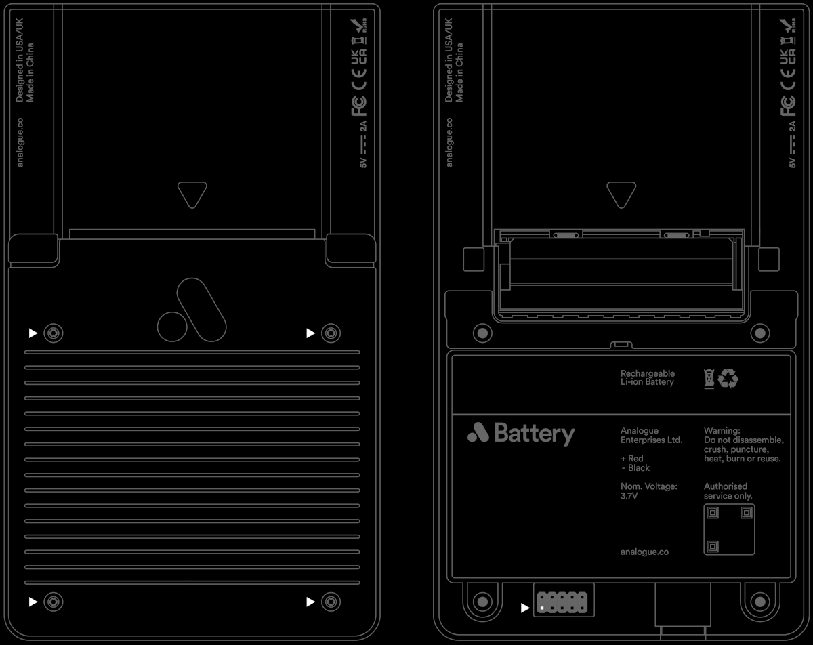

# Getting Started

## Requirements

### Software

* [Intel Quartus Lite](https://www.intel.com/content/www/us/en/products/details/fpga/development-tools/quartus-prime/resource.html) with device support for Cyclone V
* Text editor for creating JSON files

### Tools

* Pocket
  * Dock is optional
* Intel Approved USB or Ethernet Blaster JTAG cable
  * Intel/Altera or [Terasic](https://www.digikey.com/en/products/detail/terasic-inc/P0302/2003484) versions of this tool are supported. Clone tools are not suggested and may have unexpected behavior and/or cause hardware damage.
* [Torx T-6](https://www.digikey.com/en/products/detail/wiha/36266/510975) screwdriver for removing the rear cover to access the JTAG header
  * Not required on Pocket Developer Edition, which have a removable door on the rear cover.
* Micro SD card
  * Up to 1TB
  * FAT32 or exFAT supported
* Analogue Developer Key (optional)
  * For additional debugging features via the cartridge bus

## Get the Core Template

To get started quickly Analogue provides a [core template](https://github.com/open-fpga/core-template) with the appropriate JSON files and a sample core. You can download the [core template here](https://github.com/open-fpga/core-template/zipball/main).

## Design and Compile the Core

To begin, open the core template in your text editor of choice.

Configure your core by editing your JSON files as needed. For details view the [Documentation for JSON files](./core-definition-files.md).

Develop and compile your core with Quartus.

## Debug the Core on Pocket

To debug your core on Pocket it is necessary to package the core for development and involves a few simple steps:

1. Transfer your JSON files to the SD Card.
2. Copy any core assets to the SD Card.
3. Transfer the core binary files to the SD Card.

Place the files on an SD Card using USB-Link mode or a computer. For additional details please view [Packaging A Core](./packaging-a-core.md).

After populating your SD Card you will need to connect your computer to Pocket via JTAG located along the bottom edge. Depending on your model, this may require removing the rear cover with a T6 screwdriver.

*Left:* The four screw locations for removing the rear cover

*Right:* JTAG pin 01 location

> Do not remove the battery or disassemble Pocket.

> Only use Intel approved JTAG devices or cables to avoid damage. Observe ESD precautions handling static-sensitive devices when accessing the JTAG.

### Reloading the FPGA bitstream

After a core is running the developer can at any time reload the FPGA bitstream over JTAG. Pocket will automatically re-initialize the core with the exact same starting conditions. Any previously selected assets will be remembered and reloaded. All other stateful data is not transferred between reloads. JSON files will be reinitialized reflecting any changes made between reloads.

### USB Link Mode

Developers can optionally mount the SD card via the USB-C connection on Pocket. This is a convenient feature for iteration workflows such as quickly adjusting JSON files or replacing binary files. Transfer speeds are limited to < 1MBps and large file transfers are not recommended. This feature can be accessed in the Tools > Developer section of Analogue OS.

## Packaging Your Core

For additional details please view [Packaging A Core](./packaging-a-core.md).

### Steps for Packaging

* Copy the template project JSON to your `/Cores/AuthorName.CoreName` folder
* Append the version number and release timestamp to `core.json` file under `metadata`.
  * Update any other metadata such as author, shortname, URL, etc.
* Reverse the bitstream
  * Convert the compiled FPGA bitstream format for Pocket and copy it into your core folder
  * For details view the [Creating a reversed RBF](./packaging-a-core.md#creating-a-reversed-rbf).
* Add the relevant folders to a `.zip` file

### Specify Version Number and Date Released

Each core should be packaged with a version number. We encourage versioning to follow [SemVer](https://semver.org/). When a core is packaged check that `core.metadata.version` in `core.json` value is updated along with the `date_released` timestamp.

### Best Practices for Packaging

* Name your packaged `.zip` the same as `CoreAuthor.CoreName_Version_Date.zip`
* View the core_squares release example.
