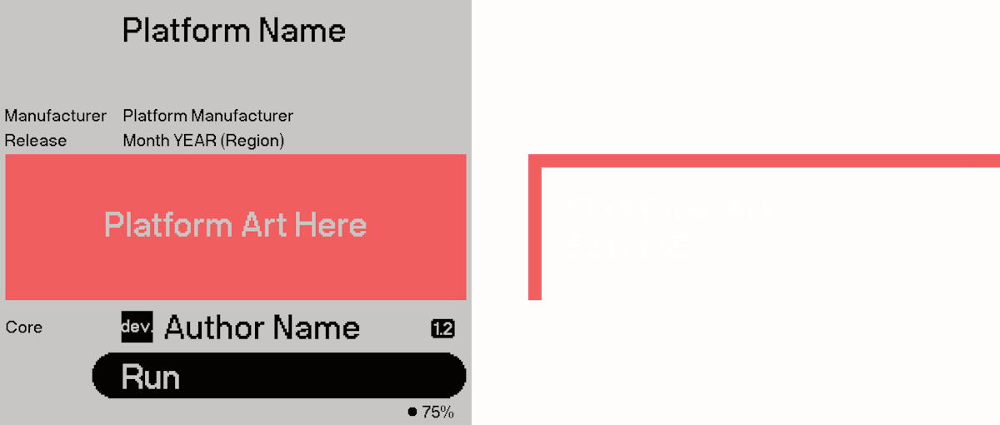
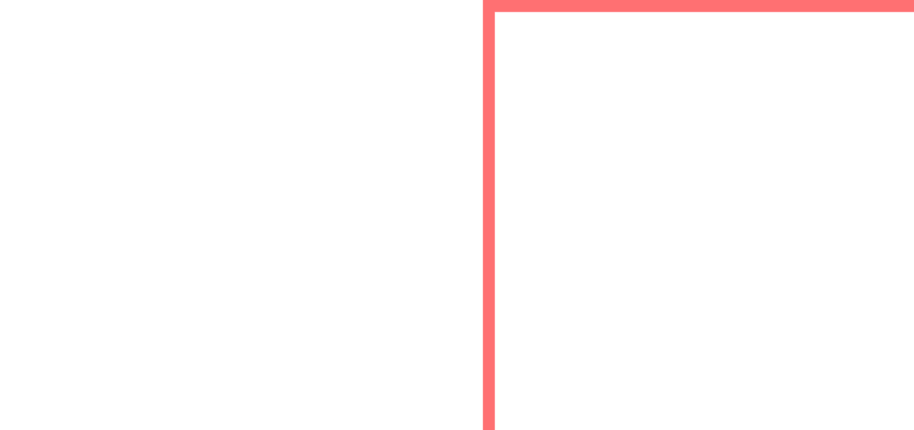
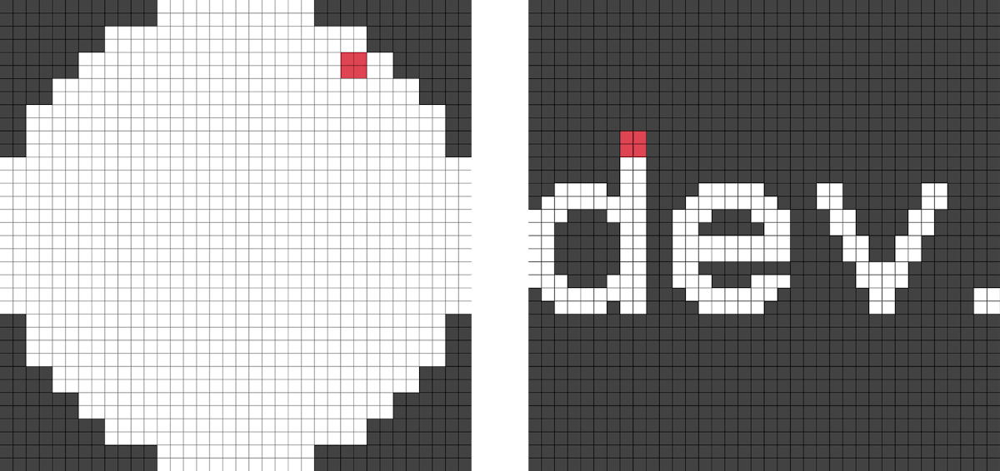
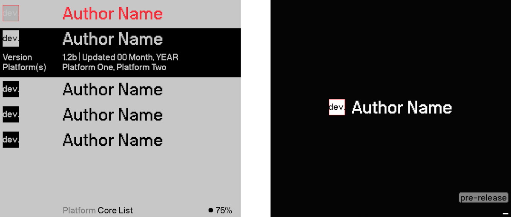

# Packaging a Core

Cores and all supporting dependencies can be packaged together in one .zip archive. Installation of a core is as simple as extracting the contents of the .zip onto the base folder of an SD card.

### Naming of the .zip file

Analogue recommends the file be named in the following format:

`<AuthorName>.<CoreName>_<Version>_<ReleaseDate>.zip`

As an example, `Analogue.PDP-1_1.0_2022-07-30.zip`

### Contents of the .zip file

Inside a core .zip file should be a snapshot of the relevant parts of the SD filesystem that the core adds files to. See the [Directories and SD Structure](./directories-and-sd-folder-structure.md) for an explanation of the folders Pocket uses.

> A .zip file may not contain any base folders besides the ones created by the Pocket itself.

An example of a simple core would contain the following file and folder structure:

```bash
/Cores/Analogue.PDP-1/audio.json
/Cores/Analogue.PDP-1/core.json
/Cores/Analogue.PDP-1/data.json
/Cores/Analogue.PDP-1/input.json
/Cores/Analogue.PDP-1/interact.json
/Cores/Analogue.PDP-1/variants.json
/Cores/Analogue.PDP-1/video.json
/Cores/Analogue.PDP-1/bitstream.rbf_r
/Cores/Analogue.PDP-1/icon.bin
/Platforms/pdp1.json
/Platforms/_images/pdp1.bin
```

In this example, it:

* Has no core-specific assets
* Defines a new custom “pdp1” platform
* Provides a customized graphic for the “pdp1” platform

### For development

To get started developing a core, create a folder in `/Cores/` following the naming convention in [Directories and SD Structure](./directories-and-sd-folder-structure.md), matching the `core.json` core author name and core shortname.

It is necessary to provide a minimally working bitstream to start a core. When beginning consider copying the `bitstream.rbf_r` from the template project. After that point, you can simply upload a new bitstream over JTAG and Pocket will re-initialize the entire core for you.

### For users to run

At minimum, all FPGA bitstreams must be converted from their original output format in Quartus to a reversed format and stored on the SD card. See [FPGA Bitstreams](./packaging-a-core.md#fpga-bitstream).

Developers can optionally provide the following extras along with the core:

* Core icon
* Platform definition / platform graphic

See the [Platform Metadata](./platform-metadata.md) and [Graphical Asset Formats](./packaging-a-core.md#graphical-asset-formats) sections.

## FPGA Bitstream

For Intel FPGA devices, the design software Quartus is used. A successful compilation process results in a bitstream to load into the device.

Quartus supports creation of several types of bitstream formats, but APF requires a modified form of RBF, which is called “RBF_R”, where each byte of the file is bit-reversed.

### Bitstream Formats

* **RBF** Raw Binary File. Generated by Quartus. Contains the actual bitstream data as clocked into the physical chip, except for an unknown reason (possibly legacy reasons), the bit ordering is backwards.
* **SOF** SRAM Object File. Generated by Quartus. Used to load the FPGA through the USB Blaster cable over JTAG during debugging. Not used for packaging.
* **RBF_R** Reversed Raw Binary File. Generated by custom tool. Used for core packaging, loaded by APF on Pocket.

### Creating a reversed RBF

Almost any programming language can be used to create a standalone tool to reverse the bitstream bits. The algorithm is:

```c
foreach byte in input
    swap bits[7:0] to bits[0:7]
    write byte to output
```

A generic C sample is provided below, and can be downloaded precompiled:

```c
//
// reverse_bits
// 2022 Developer
//
// LICENSE: This code is public domain.
//

#include <stdio.h>
#include <string.h>
#include <stdint.h>
#include <stdlib.h>

int main(int argc, char* argv[])
{
  uint8_t *buf;
  FILE *fp;
  if (argc != 3){
    printf("\nWrong parameters given\nUsage: reverse_bits [file_in] [file_out]\n");
    return -1;
  }
  fp = fopen(argv[1], "rb");
  if (fp == NULL) {
    printf("Couldn't open the file %s for input\n", argv[1]);
    return -1;
  }
  fseek(fp, 0L, SEEK_END);
  int size = ftell(fp);
  fseek(fp, 0L, SEEK_SET);
  
  buf = (uint8_t*)malloc(size);
  if (buf == NULL){
    printf("Couldn't malloc file\n");
    return -1;
  }
  
  uint8_t in;
  for (int i = 0; i < size; i++){
    fread(&in, 1, 1, fp);
    in = ((in & 1) << 7) | ((in & 2) << 5) | ((in & 4) << 3) | ((in & 8) << 1) |
      ((in & 16) >> 1) | ((in & 32) >> 3) | ((in & 64) >> 5) | ((in & 128) >> 7);
  
    buf[i] = in;
  }
  fclose(fp);
  
  printf("Reversed %d bytes\n", size);
  fp = fopen(argv[2], "wb");
  if (fp == NULL) {
    printf("Couldn't open the file %s for output\n", argv[2]);
    return -1;
  }
  fwrite(buf, 1, size, fp);
  fclose(fp);
  
  free(buf);
  printf("Done\n");
  
  return 0;
}
```

### Setting up RBF in projects created without an Analogue template

When using one of the sample projects or creating from the template, this output generation is already configured.

1. Ensure the project output directory in “Assignment > Settings” is set to “output_files”.
2. Ensure the “Programming Files” checkbox in “Assignments > Device > Device and Pin Options” has “Raw Binary File (.rbf)” checked.
3. Ensure “Generate compressed bitstreams” is checked on the Configuration tab, to reduce load times.

## Graphical Asset Formats

### Platform Image (WIP)



Platform pages support a graphic in the UI.

* 521x165

If used, the core icon should be converted to the Pocket-specific format and stored as `<platform name>.bin` in the `/Platforms/_images/` folder. See the [Platform Metadata](./platform-metadata.md) page.

### Core Author Graphic Icon

A graphic icon can be used to represent visually core authors, allowing a level of customization and standout within a list of cores.

This section details the icon generation process and some key considerations for when making your own Core Author Icon.

If used, the core icon should be converted to the Pocket-specific format and stored as `icon.bin` in the core folder.

### Image Format

* 16-bit monochrome
* Stored rotated 90 degrees counter-clockwise

Each pixel is 16 bits.

The brightness is stored in the upper 8 bits.

A fully on pixel value is 0xFF00. A fully off pixel value is 0x0000.

Keep in mind that the icon color may be inverted in the UI.

#### Icon Dimensions and Color



The icon size for Core Author Icons when used in Developer mode use a perfect square canvas of 36x36px. Icons can be created at any size within this canvas, but cannot exceed the width and height. Smaller Icons should still be drawn as part of the full canvas size.

Icons should be generated in black and white. When displayed throughout developer mode, they will be colored positive/negative depending on different contexts. The developer mode uses a palette of Black and Grey — these palette shifts are processed on the device.

#### Pixel Scale



Icons can be any collection of pixels that that fit within the canvas of 36x36px. However, for icons to fit aesthetically with developer mode, different pixel scales can be drawn inside the canvas. The example above shows how both iconography and typography are represented throughout Analogue OS, using a 2x2 pixel scale. Drawing iconography in this scale will ensure a consistent experience for users, and limit multiple pixel scales throughout.

#### Where Icons Appear



Core Author Icons appear in two key places.

1. Core List
2. Core Boot Screen

Icons are shown in both positive and negative versions, as shown above. As stated previously, all core author icons should be supplied in Black and White only — the OS will handle the respective palettes on the fly.

#### Icon Alignment with Author Name


Icons are vertically centered on the Cap height of the Author Name.

#### Icon Examples


These Icon examples show a range of pixel sizes and graphic shapes.

Consider the following when creating your Core Author Icons:

* The concept and message of the icon
* How positive and negative modes affect their appearance
* Be bold. Try iconic shapes, immediate graphics, impact
* Don’t use copyrighted materials

#### Templates

Basic templates for creating Core Author Icons have been created.

These files contain guides showing the x-height and cap-height of text to aid with any visual alignment.

When exporting your file, ensure all art is black and white only.

[`core-icon-template.fig`](https://assets.analogue.co/misc/38e0d1bdb5286ef3aed9622d5f6a33d3/core-icon-template.fig) (Figma)

[`core-icon-template.ai`](https://assets.analogue.co/misc/63f5dac740b1aa3eb56b22fb2b8cc93e/core-icon-template.ai) (Illustrator)

[`core-icon-template.psd`](https://assets.analogue.co/misc/0892e3e850942964bd611abde754c04d/core-icon-template.psd) (Photoshop)
