**V805TM**

**V810TM**

**V820TM**

**V821TM**

# **V810 FAMILYTM 32-BIT MICROPROCESSOR**

## **ARCHITECTURE**

## **NOTES FOR CMOS DEVICES**

## **1 PRECAUTION AGAINST ESD FOR SEMICONDUCTORS**

Note:

Strong electric field, when exposed to a MOS device, can cause destruction of the gate oxide and ultimately degrade the device operation. Steps must be taken to stop generation of static electricity as much as possible, and quickly dissipate it once it has occurred. Environmental control must be adequate. When it is dry, humidifier should be used. It is recommended to avoid using insulators that easily build static electricity. Semiconductor devices must be stored and transported in an antistatic container, static shielding bag or conductive material. All test and measurement tools including work bench and floor should be grounded. The operator should be grounded using wrist strap. Semiconductor devices must not be touched with bare hands. Similar precautions need to be taken for PW boards with semiconductor devices on it.

## **2 HANDLING OF UNUSED INPUT PINS FOR CMOS**

Note:

No connection for CMOS device inputs can be cause of malfunction. If no connection is provided to the input pins, it is possible that an internal input level may be generated due to noise, etc., hence causing malfunction. CMOS devices behave differently than Bipolar or NMOS devices. Input levels of CMOS devices must be fixed high or low by using a pull-up or pull-down circuitry. Each unused pin should be connected to VDD or GND with a resistor, if it is considered to have a possibility of being an output pin. All handling related to the unused pins must be judged device by device and related specifications governing the devices.

## **3 STATUS BEFORE INITIALIZATION OF MOS DEVICES**

Note:

Power-on does not necessarily define initial status of MOS device. Production process of MOS does not define the initial operation status of the device. Immediately after the power source is turned ON, the devices with reset function have not yet been initialized. Hence, power-on does not guarantee out-pin levels, I/O settings or contents of registers. Device is not initialized until the reset signal is received. Reset operation must be executed immediately after power-on for devices having reset function.

**V805, V810, V820, V821, V830, V851, V810 family, V850 family, and V800 series are trademarks of NEC Corporation.**

## **The information in this document is subject to change without notice.**

No part of this document may be copied or reproduced in any form or by any means without the prior written consent of NEC Corporation. NEC Corporation assumes no responsibility for any errors which may appear in this document.

NEC Corporation does not assume any liability for infringement of patents, copyrights or other intellectual property rights of third parties by or arising from use of a device described herein or any other liability arising from use of such device. No license, either express, implied or otherwise, is granted under any patents, copyrights or other intellectual property rights of NEC Corporation or others.

While NEC Corporation has been making continuous effort to enhance the reliability of its semiconductor devices, the possibility of defects cannot be eliminated entirely. To minimize risks of damage or injury to persons or property arising from a defect in an NEC semiconductor device, customer must incorporate sufficient safety measures in its design, such as redundancy, fire-containment, and anti-failure features.

NEC devices are classified into the following three quality grades:

"Standard", "Special", and "Specific". The Specific quality grade applies only to devices developed based on a customer designated "quality assurance program" for a specific application. The recommended applications of a device depend on its quality grade, as indicated below. Customers must check the quality grade of each device before using it in a particular application.

Standard:Computers, office equipment, communications equipment, test and measurement equipment, audio and visual equipment, home electronic appliances, machine tools, personal electronic equipment and industrial robots

Special: Transportation equipment (automobiles, trains, ships, etc.), traffic control systems, anti-disaster systems, anti-crime systems, safety equipment and medical equipment (not specifically designed for life support)

Specific: Aircrafts, aerospace equipment, submersible repeaters, nuclear reactor control systems, life support systems or medical equipment for life support, etc.

The quality grade of NEC devices in "Standard" unless otherwise specified in NEC's Data Sheets or Data Books. If customers intend to use NEC devices for applications other than those specified for Standard quality grade, they should contact NEC Sales Representative in advance.

Anti-radioactive design is not implemented in this product.

## **INTRODUCTION**

**Readers** This manual is intended for users who understand the functions of the V810 family and wish to design application systems using this microprocessor.

**Purpose** This manual introduces the architecture of the V810 family to users, following the organization described below.

**Organization** The V810 family User's manuals consist of the hardware and architecture (this manual) versions for each device.

## Hardware Architecture

### Pin functions Register set

## CPU functions Data type

## Internal peripheral functions Address space

### Instruction format and instruction set

## Interrupt and exception

## Reset

**How to read this manual** It is assumed that the reader of this manual has general knowledge in the fields of electric engineering, logic circuits, and microcomputers.

To learn about the functions of the hardware,

—> Read "USER'S MANUAL–HARDWARE" of each device.

To learn about the detailed function of a specific instruction,

—> Read chapter 5 "INSTRUCTION FORMAT AND INSTRUCTION SET."

To learn about electrical specifications,

—> Refer to data sheet of each device.

To learn about the overall architecture of the V810 family,

—> Read this manual in sequential order.

For the V810 family, data consisting of 2 bytes is called a halfword, and data consisting of 4 bytes is called a word.

**Legend** Data significance : Higher on left and lower on right Active low : xxx (top bar over pin and signal names) Memory map address : Top – high, bottom – low Note : Footnote Caution : Points to be noted Remark : Supplementary explanation for main text Numeric representation : binary ................. xxxx or xxxxB decimal .............. xxxx hexadecimal ...... xxxxH

**Related documents** Suffix representing an exponent of 2 (Address space, memory capacity):

K (Kilo) = 210 = 1024

M (Mega) = 220 = 10242

G (Giga) = 230 = 10243

The related documents indicated in this publication may include preliminary versions. However, preliminary versions are not marked as such.

| Part Number | Document Name           | Document No.    |
| ----------- | ----------------------- | --------------- |
| V805        | Data Sheet              | ID-3292         |
| V805        | User’s Manual           | IEU-1371        |
| V810        | Data Sheet              | ID-3293         |
| V810        | User’s Manual           | IEU-1370        |
| V805/V810   | User’s Manual Hardware  | To be published |
| V820        | Data Sheet              | ID-3301         |
|             | User’s Manual           | IEU-852*        |
| V821        | User’s Manual Hardware  | U10077J*        |
| CA732       | User’s Manual Operation | EEU-952*        |
| (C compiler | UNIXTM base             |                 |
| package)    | C language              | EEU-966*        |
|             | Assembly                | EEU-953*        |

**Remark** Asterisks in the table indicate the document numbers of the Japanese versions. Their English versions may not be prepared or will be prepared soon.

## **CONTENTS**

|       | CHAPTER 1 OVERVIEW                                                                                                                                   | 1   |
| ----- | ---------------------------------------------------------------------------------------------------------------------------------------------------- | --- |
| 1.1   | Features                                                                                                                                             | 2   |
| 1.2   | Products Development                                                                                                                                 | 3   |
|       | CHAPTER 2 REGISTER SET                                                                                                                               | 5   |
| 2.1   | Program Register Set                                                                                                                                 | 6   |
| 2.1.1 | General-purpose registers                                                                                                                            | 6   |
| 2.1.2 | Program counter                                                                                                                                      | 7   |
| 2.2   | System Register Set                                                                                                                                  | 8   |
| 2.2.1 | Exception/interrupt status saving registers (EIPC/EIPSW)                                                                                             | 8   |
| 2.2.2 | NMI/duplexed exception status saving register (FEPC/FEPSW)                                                                                           | 8   |
| 2.2.3 | Exception source register (ECR)                                                                                                                      | 9   |
| 2.2.4 | Program status word (PSW)....................................................................................................                        | 9   |
| 2.2.5 | Processor ID register (PIR)                                                                                                                          | 12  |
| 2.2.6 | Task control word (TKCW)                                                                                                                             | 13  |
| 2.2.7 | Cache control word (CHCW)                                                                                                                            | 14  |
| 2.2.8 | Address trap register (ADTRE)                                                                                                                        | 15  |
| 2.2.9 | System register number                                                                                                                               | 15  |
|       | CHAPTER 3 DATA TYPES..............................................................................................................                   | 17  |
| 3.1   | Data Types Supported                                                                                                                                 | 17  |
| 3.1.1 | Data type and addressing........................................................................................................                     | 18  |
| 3.1.2 | Integer........................................................................................................................................      | 19  |
| 3.1.3 | Unsigned integer                                                                                                                                     | 19  |
| 3.1.4 | Bit string                                                                                                                                           | 19  |
| 3.1.5 | Single-precision floating-point data                                                                                                                 | 20  |
| 3.2   | Data Alignment                                                                                                                                       | 20  |
|       | CHAPTER 4 ADDRESS SPACE                                                                                                                              | 21  |
| 4.1   | Memory and I/O Map                                                                                                                                   | 22  |
| 4.2   | Addressing Mode................................................................................................................................      | 24  |
| 4.2.1 | Instruction address                                                                                                                                  | 24  |
| 4.2.2 | Operand address                                                                                                                                      | 27  |
|       | CHAPTER 5 INSTRUCTION FORMAT AND INSTRUCTION SET                                                                                                     | 29  |
| 5.1   | Instruction Format..............................................................................................................................     | 29  |
| 5.2   | Instruction Outline                                                                                                                                  | 31  |
| 5.3   | Instruction Set..................................................................................................................................... | 39  |
| 5.4   | Instruction Execution Clock Cycles                                                                                                                   | 107 |
| 5.4.1 | Normal instruction                                                                                                                                   | 107 |
| 5.4.2 | Search bit string instructions                                                                                                                       | 110 |
| 5.4.3 | Arithmetic bit string instructions                                                                                                                   | 114 |

|            | CHAPTER 6 INTERRUPT AND EXCEPTION                                                                                                  | 117 |
| ---------- | ---------------------------------------------------------------------------------------------------------------------------------- | --- |
| 6.1        | Exception Processing                                                                                                               | 118 |
| 6.2        | Interrupt Processing                                                                                                               | 119 |
|            | 6.2.1 Maskable interrupt                                                                                                           | 119 |
|            | 6.2.2 Non-maskable interrupt                                                                                                       | 121 |
| 6.3        | Returning from Exception/Interrupt................................................................................................ | 122 |
| 6.4        | Priority                                                                                                                           | 123 |
|            | 6.4.1 Priorities of interrupts and exceptions                                                                                      | 123 |
|            | 6.4.2 Priorities of floating-point exceptions                                                                                      | 124 |
|            | 6.4.3 Interrupt execution timing                                                                                                   | 124 |
|            | CHAPTER 7 CACHE DUMP/RESTORE FUNCTIONS                                                                                             | 125 |
|            | CHAPTER 8 DEBUG SUPPORT FUNCTION                                                                                                   | 129 |
|            | CHAPTER 9 RESET                                                                                                                    | 131 |
| 9.1        | Initialization                                                                                                                     | 131 |
| 9.2        | Starting Up                                                                                                                        | 131 |
| APPENDIX A | INSTRUCTION MNEMONIC (alphabetical order)                                                                                          | 133 |
| APPENDIX B | INSTRUCTION LIST                                                                                                                   | 141 |
| APPENDIX C | OP CODE MAP                                                                                                                        | 143 |

## **LIST OF FIGURES**

| Fig. | Title                                                                                                                                    | Page |
| ---- | ---------------------------------------------------------------------------------------------------------------------------------------- | ---- |
| 2-1  | Program Registers                                                                                                                        | 6    |
| 2-2  | System Registers                                                                                                                         | 8    |
| 4-1  | Memory Map                                                                                                                               | 22   |
| 4-2  | I/O Map                                                                                                                                  | 23   |
| 4-3  | Relative Addressing (JR disp26/JAL disp26).......................................................................................        | 24   |
| 4-4  | Relative Addressing (Bcond disp9)                                                                                                        | 25   |
| 4-5  | Register Addressong (JMP [reg1])........................................................................................................ | 26   |
| 4-6  | Based Addressing                                                                                                                         | 27   |
| 7-1  | Cache Configuration                                                                                                                      | 125  |
| 7-2  | Cache Dump Format                                                                                                                        | 127  |

## **LIST OF TABLES**

| Table | Title                                                                                                                                                 | Page |
| ----- | ----------------------------------------------------------------------------------------------------------------------------------------------------- | ---- |
| 5-1   | Load/Store Instructions                                                                                                                               | 31   |
| 5-2   | Integer Arithmetic Operation Instructions                                                                                                             | 32   |
| 5-3   | Logical Operation Instructions                                                                                                                        | 33   |
| 5-4   | I/O Instructions                                                                                                                                      | 34   |
| 5-5   | Program Control Instructions                                                                                                                          | 35   |
| 5-6   | Bit String Instructions                                                                                                                               | 36   |
| 5-7   | Floating-Point Operation Instructions                                                                                                                 | 37   |
| 5-8   | Special Instructions                                                                                                                                  | 38   |
| 5-9   | Conditional Branch Instructions.............................................................................................................          | 50   |
| 5-10  | Condition Codes...................................................................................................................................... | 91   |
| 5-11  | Instruction Execution Clock Cycles                                                                                                                    | 107  |
| 5-12  | Execution Clock Cycles of Search Bit String Instructions                                                                                              | 110  |
| 5-13  | Execution Clock Cycles of Arithmetic Bit String Instructions                                                                                          | 114  |
| 5-14  | Boundary Condition of Arithmetic Bit String Instructions                                                                                              | 115  |
| 6-1   | Exception Codes                                                                                                                                       | 117  |
| 6-2   | Instructions Aborted by Interrupt                                                                                                                     | 117  |
| 6-3   | Priorities of Interrupts and Exceptions                                                                                                               | 123  |
| 6-4   | Priorities of Floating-Point Exceptions                                                                                                               | 124  |
| 9-1   | Register Status after Reset                                                                                                                           | 131  |
| A-1   | Instruction Mnemonics (alphabetical order)                                                                                                            | 134  |
| B-1   | Mnemonic List                                                                                                                                         | 141  |
| B-2   | Instruction Set                                                                                                                                       | 142  |

## **CHAPTER 1 OVERVIEW**

The V810 family consists of NEC's RISC microprocessors using the V810 as the CPU core and is designed for embedded control applications.

## **1.1 Features**

- High-performance 32-bit architecture for embedded control application
  - 1K-byte cache memory
  - Pipeline structure of 1 clock pitch
  - 16-bit instructions (with some exceptions)
  - Separate 32-bit address/data buses
  - 32-bit general-purpose registers: 32
  - 4G-byte linear address space
  - Register/flag hazard interlocked by hardware
- Instructions ideal for various application fields
  - Floating-point operation instructions (based upon IEEE754 data format)
  - Bit string instructions
- 16 levels of high-speed interrupt responses

## **1.2 Products Development**

The V810 family is one of the V800 seriesTM and a group of products which use the RISC microprocessor V810 as its CPU core.

The product development shown in the following diagram is performed for the V800 series, enabling it to be applied in various embedded control application fields. The V850 familyTM is a single-chip microprocessor for control purposes while the V810 family is a microprocessor for data processing purposes. The V830 family, an advanced high-speed version, is also available.

## **Products development**

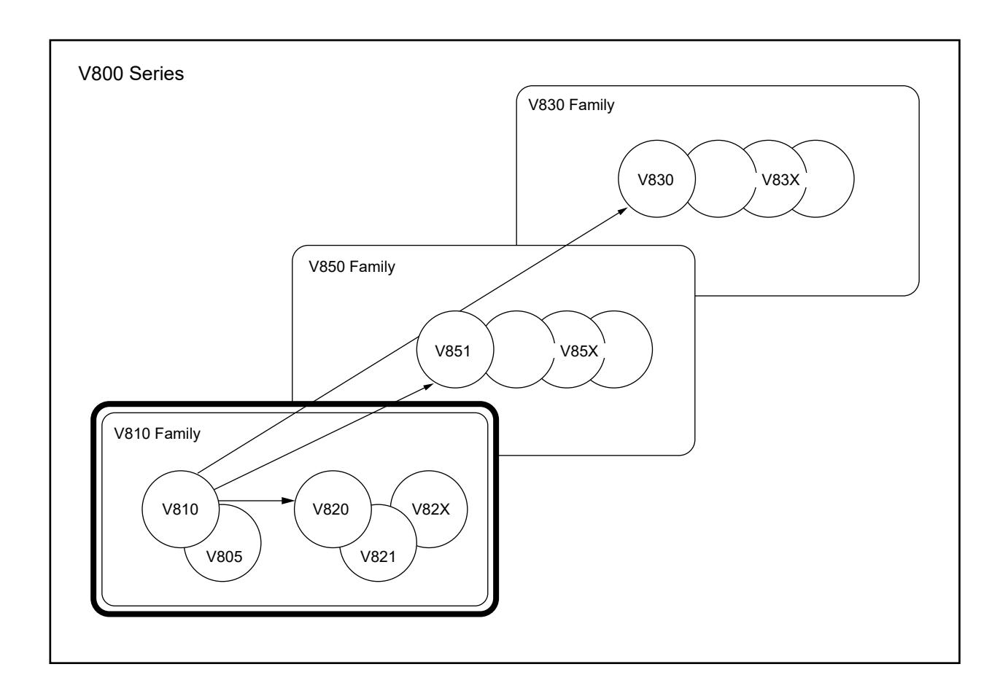

**[MEMO]**

## **CHAPTER 2 REGISTER SET**

The register set of the V810 family can be classified into two types: program register set that is generally used by the programmer, and system register set that is usually used by the OS (operating system). All registers are 32 bits wide.

## **2.1 Program Register Set**

## **2.1.1 General-purpose registers**

Thirty-two general-purpose registers, r0 to r31, are available. All these registers can be used as data registers or address registers.

Note, however, that r0 and r26 to r31 are implicitly used by instructions.

## **(1) Hardware-dependent registers**

These registers are fixed to a certain value by the hardware, or implicitly used by an instruction.

r0 : (zero register) This register always holds 0.

r26 : (string destination start bit offset) This register stores a bit offset in the word of the destination operand of a bit string instruction. Bits 31 through 5 of this register are automatically cleared before the instruction is executed. If interrupt processing is executed, this register stores the offset value in the resume word.

r27 : (string source start bit offset) This register stores the bit offset in the word of the source operand of a string instruction. Bits 31 through 5 of the register are automatically cleared before the instruction is executed. If interrupt processing is executed, the register stores the offset value in the resume word.

r28 : (string length register) This register stores the number of bits for string processing by a bit string instruction. If the processing of the instruction is aborted by an interrupt, the register holds the remaining length.

r29 : (string destination start address register) This register holds a destination operand start word address when a bit string transfer instruction is executed. Bits 1 and 0 of the register are automatically cleared to 0 before the instruction is executed. If the processing of the instruction is aborted by an interrupt, the register holds the resume start word address. When a search instruction is executed, this register holds the sum of the number of bits skipped. If the processing is aborted by an interrupt, the register holds the number of bits skipped before the processing is aborted.

**Fig. 2-1 Program Registers**

31 0

r0 Zero Register r1 Reserved for Address Generation r2 Handler Stack Pointer (hp) r3 Stack Pointer (sp) r4 Global Pointer (gp) r5 Text Pointer (tp)

r6

r7

r8

r9

r10

r11

r12

r13

r14

r15

r16

r17

r18

r19

r20

r21

r22

r23

r24

r25

r26 String Destination Bit Offset

r27 String Source Bit Offset

r28 String Length

r29 String Destination

r30 String Source

r31 Link Pointer (lp)

PC

r30 : (string start address register)

This register holds the source operand start word address of a bit string instruction. If the processing of the instruction is aborted by an interrupt, the register holds the resume word address. Bits 1 and 0 of the register are automatically cleared before the instruction is executed.

When the CAXI instruction is executed, this register holds the value to be set to the lock word.

When the MUL/MULU instruction is executed, the register holds the higher 32 bits of the result of multiplication.

When the DIV/DIVU instruction is executed, the register holds the remainder of the result of division.

r31 : (link pointer)

This register implicitly stores the return destination address of the JAL instruction.

## **(2) Software-reserved registers**

These registers are implicitly used by the assembler and compiler. When these registers are used as variable registers, save the contents of the registers so that they are not destroyed, and later restore the register contents.

For details, refer to the manual of the assembler/compiler.

r1 : (assembler-reserved register)

This is a working register for creating 32-bit immediate, and is implicitly used when the assembler calculates an effective address.

r2 : (handler stack pointer)

This register is reserved as the stack pointer of the handler.

r3 : (stack pointer)

This register is reserved for stack frame creation when a function is called.

r4 : (global pointer)

This register is used to access a global variable in the data area.

r5 : (text pointer)

This register points to the beginning of the text area.

### **2.1.2 Program counter**

The program counter (PC) indicates the address of the instruction currently executed by the program. Bit 0 of the PC is fixed to 0, and execution cannot branch to an odd address. The contents of the PC is initialized to FFFFFFF0H at reset.

## **2.2 System Register Set**

The system registers control the status of the processor, hold exception/interrupt information, and manage tasks. They are managed mainly by the OS.

**Fig. 2-2 System Registers**

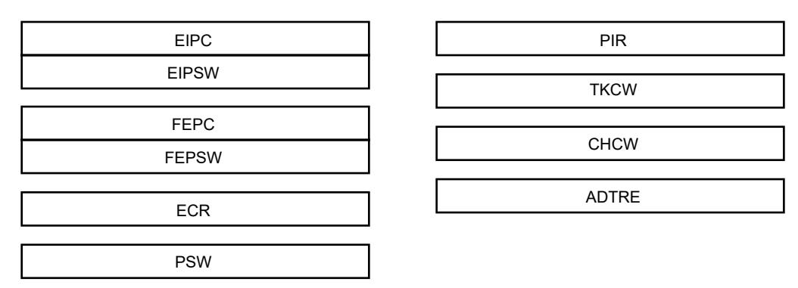

## **2.2.1 Exception/interrupt status saving registers (EIPC/EIPSW)**

EIPC and EIPSW are registers that save the current contents of the PC and PSW if an exception or interrupt occurs. The contents of the PC are saved to EIPC, while the contents of the PSW are saved to EIPSW. Since only one set each of EIPC and EIPSW are available, these registers must be saved by program if multiplexed exception or interrupt is enabled.

Bit 0 of EIPC and bits 31 through 20, 11, and 10 of EIPSW are fixed to 0. The contents of the PC and PSW are not saved to these EIPC and EIPSW, but to FEPC and FEPSW, if an exception occurs while the EP bit of the PSW is set (duplexed exception or fatal exception), or when NMI occurs.

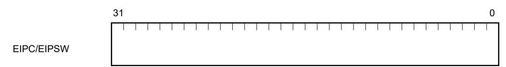

## **2.2.2 NMI/duplexed exception status saving register (FEPC/FEPSW)**

If NMI or duplexed exception (exception that occurs when EP = 1) occurs, the current contents of the PC and PSW are saved to FEPC and FEPSW, respectively. The PC and PSW contents are saved to these registers in case of an emergency. Therefore, if this happens, appropriate processing must be started immediately. Bits 0 of FEPC and bits 31 through 20, 11, and 10 of FEPSW are fixed to 0.

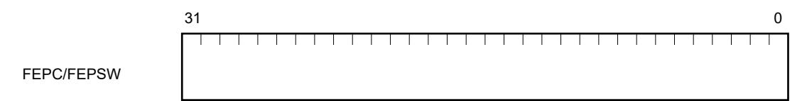

## **2.2.3 Exception source register (ECR)**

The ECR register holds the source of an exception, maskable interrupt, or NMI that has occurred. The value held by ECR is coded for each exception source (refer to **CHAPTER 6 INTERRUPT AND EXCEPTION**).

This register is a read-only register, and data cannot be written to it by using the LDSR instruction.

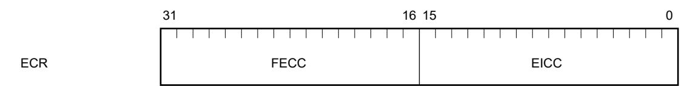

| Bit position | Field | Meaning                                          |
| ------------ | ----- | ------------------------------------------------ |
| 31-16        | FECC  | Exception code in case of NMI/duplexed exception |
| 15-0         | EICC  | Exception code in case of interrupt/exception    |

### **2.2.4 Program status word (PSW)**

The program status word (PSW) is a collection of flags that indicate the status of the program (result of instruction execution) and the status of the processor. If a field of this register is changed by using the LDSR instruction, the changed contents become valid immediately after execution of the LDSR instruction has been completed.

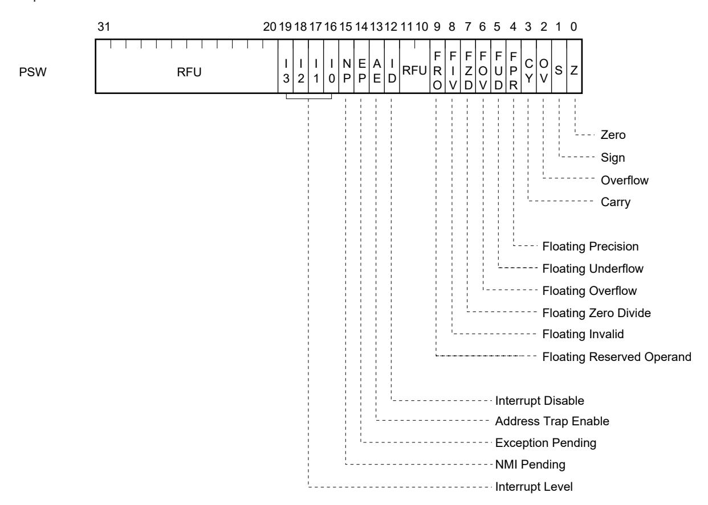

| Bit position | Flag  | Meaning                                                                                                                                                                                                                                                                                            |
| ------------ | ----- | -------------------------------------------------------------------------------------------------------------------------------------------------------------------------------------------------------------------------------------------------------------------------------------------------- |
| 31-20        | RFU   | Reserved field (fixed to 0)                                                                                                                                                                                                                                                                        |
| 19-16        | I3-I0 | Interrupt Level Maskable interrupt enable level                                                                                                                                                                                                                                                 |
| 15           | NP    | NMI Pending Indicates that NMI processing is in progress. This flag is set when NMI is accepted, and NMI is masked and multiplexed interrupt is disabled. NP = 0 : NMI processing is not in progress NP = 1 : NMI processing is in progress                                               |
| 14           | EP    | Exception Pending Indicates that exception, trap, or interrupt processing is in progress. This flag is set when exceptional event occurs and masks interrupt. EP = 0 : Exception/trap/interrupt processing is not in progress EP = 1 : Exception/trap/interrupt processing is in progress |
| 13           | AE    | Address Trap Enable Indicates whether address trap function is active AE = 0 : Address trap function is not active AE = 1 : Address trap function is active                                                                                                                               |
| 12           | ID    | Interrupt Disable Indicates whether external interrupt request can be accepted ID = 0 : Interrupt is enabled ID = 1 : Interrupt is disabled                                                                                                                                               |
| 11, 10       | RFU   | Reserved field (fixed to 0)                                                                                                                                                                                                                                                                        |
| 9            | FRO   | Floating Reserved Operand Indicates whether reserved operand exception occurs during floating-point operation FRO = 0: Reserved operand exception does not occur FRO = 1: Reserved operand exception occurs                                                                               |
| 8            | FIV   | Floating Invalid Indicates whether invalid operation occurs during floating-point operation FIV = 0 : Invalid operation does not occur FIV = 1 : Invalid operation occurs                                                                                                                 |
| 7            | FZD   | Floating Zero Divide Indicates whether zero division occurs during floating-point operation FZD = 0 : Zero division does not occur FZD = 1 : Zero division occurs                                                                                                                         |
| 6            | FOV   | Floating OverFlow Indicates whether overflow occurs during floating-point operation FOV = 0: Overflow does not occur FOV = 1: Overflow occurs                                                                                                                                             |
| 5            | FUD   | Floating UnderFlow Indicates whether underflow occurs during floating-point operation FUD = 0: Underflow does not occur FUD = 1: Underflow occurs                                                                                                                                         |

| Bit position Flag |                    | Meaning                                 |
| ----------------- | ------------------ | --------------------------------------- |
| 4 FPR             | Floating Precision |                                         |
| FPR = 0           | :                  | Precision does not degrade              |
| FPR = 1           | :                  | Precision degrades                      |
| 3 CY Carry        |                    |                                         |
| CY = 0            | :                  | Carry is not generated                  |
| CY = 1            | :                  | Carry is generated                      |
| 2 OV Overflow     |                    |                                         |
| OV = 0            | :                  | Overflow does not occur                 |
| OV = 1            | :                  | Overflow occurs                         |
| 1 S Sign          |                    |                                         |
| S = 0             | :                  | Result of operation is positive or zero |
| S = 1             | :                  | Result of operation is negative         |
| 0 Z Zero          |                    |                                         |
| Z = 0             | :                  | Result of operation is not zero         |
| Z = 1             | :                  | Result of operation is zero             |

## **2.2.5 Processor ID register (PIR)**

The processor ID register is provided to identify the CPU type number of the V810 family. This register is "0000810XH" in each device to indicate the V810 family.

No data can be written to this register by using the LDSR instruction.

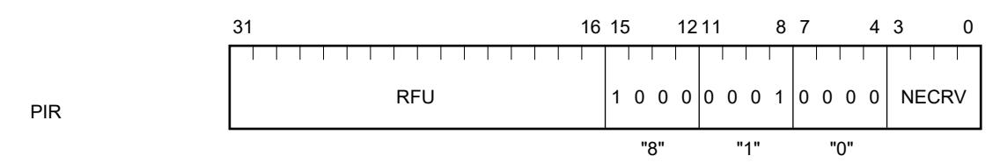

| Bit position | Field | Meaning                                             |
| ------------ | ----- | --------------------------------------------------- |
| 31-16        | RFU   | Reserved field (fixed to 0)                         |
| 15-4         | PT    | Processor Type: Field indicating type number of CPU |
| 3-0          | NECRV | NEC reserved: Reserved by NEC                       |

## **2.2.6 Task control word (TKCW)**

The task control word is a register that controls floating-point operations. This register is a read-only register. No data can be written to this register by using the LDSR instruction.

Provided for future interchangeability, this register is currently fixed.

| Bit position | Field | Meaning                                              |
| ------------ | ----- | ---------------------------------------------------- |
| 31-9         | RFU   | Reserved field (fixed to 0)                          |
| 8            | OTM   | Operand Trap Mask                                    |
| 7            | FIT   | Floating Invalid Operation Trap Enable               |
| 6            | FZT   | Floating-Zero Divide Trap Enable                     |
| 5            | FVT   | Floating-Overflow Trap Enable                        |
| 4            | FUT   | Floating-Underflow Trap Enable                       |
| 3            | FPT   | Floating-Precision Trap Enable                       |
| 2            | RDI   | Floating Rounding Control Bit for Integer Conversion |
| 1, 0         | RD    | Floating Rounding Control                            |

## **2.2.7 Cache control word (CHCW)**

This register controls the internal instruction cache (128 entries ✕ 8 bytes = 1K bytes). A cache memory becomes valid when an instruction next to the LDSR instruction has been fetched. ICR, ICD, ICE, and ICC must be exclusively set to 1.

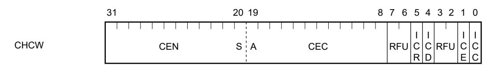

| Bit position | Field | Meaning                                                                                                     |
| ------------ | ----- | ----------------------------------------------------------------------------------------------------------- |
| 31-8         | SA    | Spill-Out Base Address                                                                                      |
| 31-20        | CEN   | Clear Entry Number                                                                                          |
| 19-8         | CEC   | Clear Entry Count                                                                                           |
| 7, 6         | RFU   | Reserved field (fixed to 0)                                                                                 |
| 5            | ICR   | Instruction Cache Restore                                                                                   |
|              |       | When this flag is set to 1, execution of restore is started Note 1 . This flag is always 0 when it is read. |
| 4            | ICD   | Instruction Cache Dump                                                                                      |
|              |       | When this flag is set to 1, execution of dump is started Note 1 . This flag is always 0 when it is read.    |
| 3, 2         | RFU   | Reserved field (fixed to 0)                                                                                 |
| 1            | ICE   | Instruction Cache Enable                                                                                    |
|              |       | Instruction cache is enabled when this flag is 1 Note 2 and disabled when it is 0. Contents are saved       |
| 0            | ICC   | Instruction Cache Clear                                                                                     |
|              |       | Instruction cache is cleared when this flag is set to 1 Note 1 . This flag is always 0 when it is read.     |

- **Notes 1.** An interrupt that occurs during restore/dump/clear operation is internally held and is accepted after the operation in progress is finished. The maskable interrupt is held internally only when the EP, NP, and ID flags of PSW are all 0.
  - **2.** To make the cache active, make the ICHEEN signal active, and set the ICE bit of the cache control word.

## **2.2.8 Address trap register (ADTRE)**

This 32-bit register holds a trap address (TA) that is used to detect address coincidence with the PC and to generate an address trap. Bit 0 of this register is fixed to 0.

## **2.2.9 System register number**

Data is input to or output from a system register by specifying the following system register number with the system register load/store instruction (LDSR or STSR):

|       |          |                                       |      | Operand specification |
| ----- | -------- | ------------------------------------- | ---- | --------------------- |
| No    |          | System register                       |      |                       |
|       |          |                                       | LDSR | STSR                  |
| 0     | EIPC     | : Exception/Interrupt PC              | ●    | ●                     |
| 1     | EIPSW    | : Exception/Interrupt PSW             | ●    | ●                     |
| 2     | FEPC     | : Fatal Error PC                      | ●    | ●                     |
| 3     | FEPSW    | : Fatal Error PSW                     | ●    | ●                     |
| 4     | ECR      | : Exception Cause Register            | —    | ●                     |
| 5     | PSW      | : Program Status Word                 | ●    | ●                     |
| 6     | PIR      | : Processor ID Register               | —    | ●                     |
| 7     | TKCW     | : TasK Control Word                   | —    | ●                     |
| 8-23  | Reserved |                                       |      |                       |
| 24    | CHCW     | : CacHe Control Word                  | ●    | ●                     |
| 25    | ADTRE    | : ADdress Trap Register for Execution | ●    | ●                     |
| 26-31 | Reserved |                                       |      |                       |

— : Access disabled

● : Access enabled (cannot be set in some cases)

Reserved : Operation is not guaranteed if this is accessed.

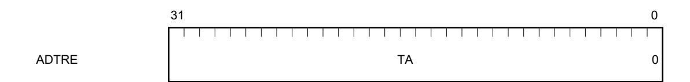

**[MEMO]**

## **CHAPTER 3 DATA TYPES**

## **3.1 Data Types Supported**

The data types supported by the V810 family are as follows:

- Integer (8, 16, 32 bits)
- Unsigned integer (8, 16, 32 bits)
- Bit string
- Single-precision floating-point data (32 bits)

## **3.1.1 Data type and addressing**

Addressing of the V810 family is of little endian type. The format when data of fixed length exists in memory is shown below.

### **(1) Byte**

A byte is a contiguous 8-bit data that starts from any byte boundary. Each bit is numbered from 0 to 7. Bit 0 is the LSB (Least Significant Bit), and bit 7 is the MSB (Most Significant Bit). A byte is specified by its address A.

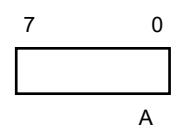

### **(2) Halfword**

A halfword is a unit of contiguous 2-byte (16-bit) data that starts from any halfword boundary. Each bit is numbered from 0 to 15. Bit 0 is the LSB (Least Significant Bit), and bit 15 is the MSB (Most Significant Bit). A halfword is specified by its address A (with the lowest bit being 0), and takes two bytes: A and A+1.

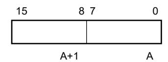

### **(3) Word/short real**

Word/short real is a unit of contiguous 4-byte (32-bit) data that starts from any word boundary. Each bit is numbered from 0 to 31. Bit 0 is the LSB (Least Significant Bit), and bit 31 is the MSB (Most Significant Bit). Word/short real is specified by its address A (with the lower 2 bits being 0), and takes 4 bytes: A, A+1, A+2, and A+3.

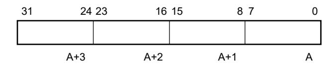

## **3.1.2 Integer**

With the V810 family, an integer is expressed as a binary number of 2's complement and can be 8, 16, or 32 bits long. The significance of each bit increases as the bit number increases, with bit 0 assigned with the least significance.

| Data length       |             | Range          |
| ----------------- | ----------- | -------------- |
| Byte, 8 bits      | –128        | to +127        |
| Halfword, 16 bits | –32768      | to +32767      |
| Word, 32 bits     | –2147483648 | to +2147483647 |

## **3.1.3 Unsigned integer**

The above integer is data that can take a positive or negative value. In contrast, an unsigned integer is an integer that is not negative. An unsigned integer is also expressed as a binary number and can be 8, 16, or 32 bits long. The significance of each bit increases as the bit number increases, with bit 0 assigned with the least significance, regardless of the length. Note, however, that no sign bit exists.

| Data length       | Range           |
| ----------------- | --------------- |
| Byte, 8 bits      | 0 to 255        |
| Halfword, 16 bits | 0 to 65535      |
| Word, 32 bits     | 0 to 4294967295 |

### **3.1.4 Bit string**

A bit string is a unit of data whose bit length is variable from 0 to 232–1. Bit string data is specified by the following three attributes:

- First word address A of string data (lower 2 bits are 0)
- Bit offset B in word of string data (0 to 31)
- Bit length M of string data (0 to 232–1)

With bit string data, the direction in which the address increases is called upward, and the direction in which the address decreases is called downward.

| Attribute                               | Upward manipulation | Downward manipulation |
| --------------------------------------- | ------------------- | --------------------- |
| First word address (bits 0 and 1 are 0) | A                   | A + 4                 |
| Bit offset in word (0 to 31)            | B                   | D                     |
| Bit length (from 0 to 232–1)            | M                   | M                     |

### **3.1.5 Single-precision floating-point data**

Data of this data type is 32 bits long and its representation format conforms to the single format of IEEE. Data of this type consists of 1 mantissa sign bit, 8 bits of exponent (offset representation from bias value - 127), and 23 bits of mantissa (binary representation with integer omitted).

## **3.2 Data Alignment**

With the V810 family, word data must be aligned at the word boundary (with the lower 2 bits of the address being 0), and half word data must be aligned at the halfword boundary (with the lower 1 bit of the address being 0). Unless aligned, the lower bit(s) (2 bits in the case of word data and 1 bit in the case of halfword data) is automatically masked 0 for access.

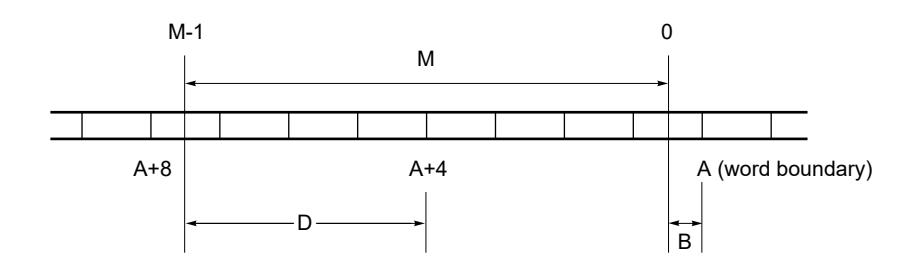

|   |   s                        |   30   |   23   22           |   0   |
| -------------- | ---------------------------------------------------- | -------------------------------- | ---------------------------------------------------------- | ------------------------------- |
|   |   exp   (8)   |                     |   mantissa   (23)   |                    |

## **CHAPTER 4 ADDRESS SPACE**

The V810 family supports 4G bytes of linear memory space and I/O space. The CPU outputs 32-bit addresses to the memory and I/Os; therefore, the addresses are from 0 to 232–1.

Bit number 0 of each byte data is defined as the LSB (Least Significant Bit), and bit number 7 is the MSB (Most Significant Bit). Unless otherwise specified, the byte data at the lower address side of data consisting of two or more bytes is the LSB, and the byte data at the higher address side is the MSB (little endian).

Data consisting of 2 bytes is called a halfword, and data consisting of 4 bytes is called a word. In this manual, the lower address of memory or I/O data of two or more bytes is shown on the right, and the higher address is shown on the left, as follows:

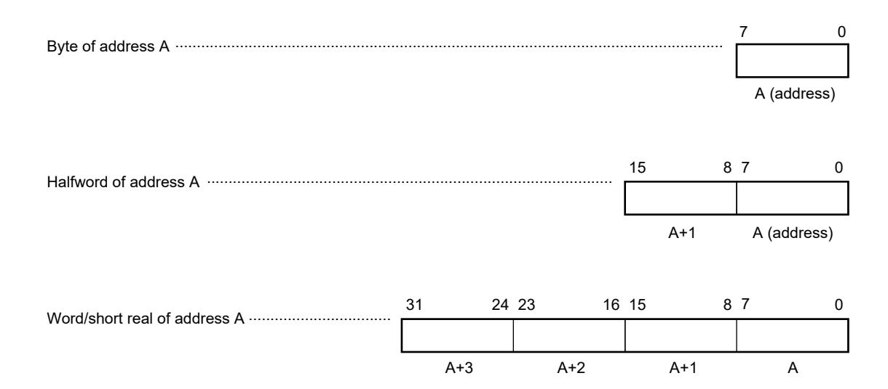

## **4.1 Memory and I/O Map**

Fig. 4-1 shows the memory map of the V810 family.

**Fig. 4-1 Memory Map**

**Note** For details, refer to Table 6-1 Exception Codes.

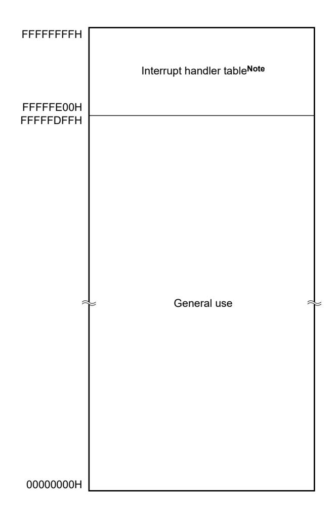

Fig. 4-2 shows the I/O map of the V810 family.

**Fig. 4-2 I/O Map**

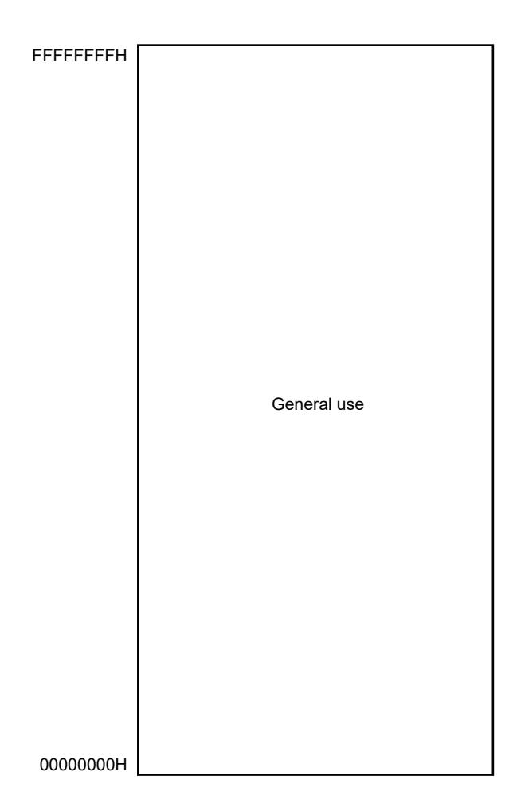

## **4.2 Addressing Mode**

Two types of addresses are generated for the V810 family – the instruction address used by instructions performing branching and the operand address using instructions accessing data.

### **4.2.1 Instruction address**

The instruction address is determined by the contents of the program counter (PC) and is automatically incremented (+2) according to the byte number of the instruction fetched each time instructions are executed. When branch instructions are executed, branch destination addresses are set in the PC by the following addressing:

### **(1) Relative addressing (PC relative)**

9 or 26 bit data (displacement: disp) encoded with instruction signs are added to the program counter (PC). At this time, the displacement is taken as 2's complement data, and bit 8 and bit 25 become sign bits.

The Bcond disp9, JR disp26, and JAL disp26 instructions are used in this addressing.

**Fig. 4-3 Relative Addressing (JR disp26/JAL disp26)**

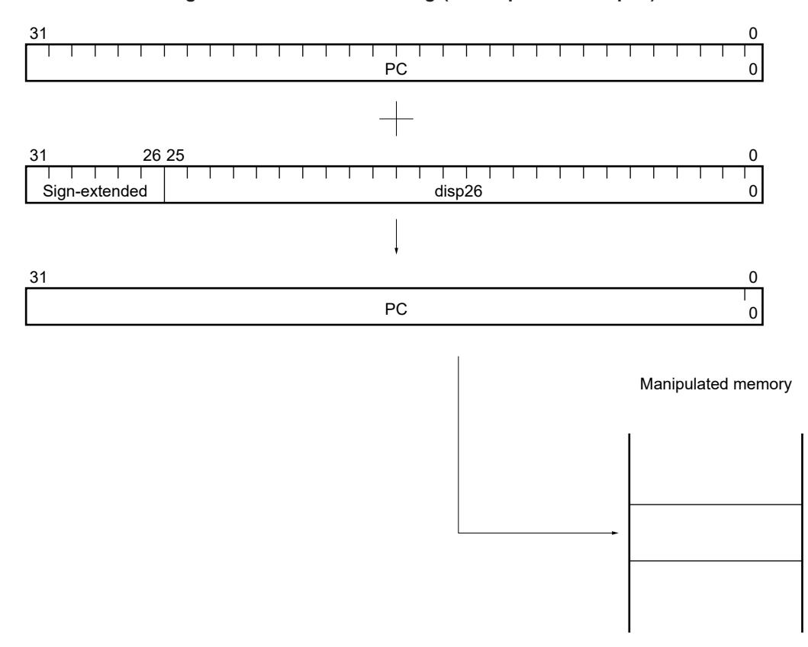

**Fig. 4-4 Relative Addressing (Bcond disp9)**

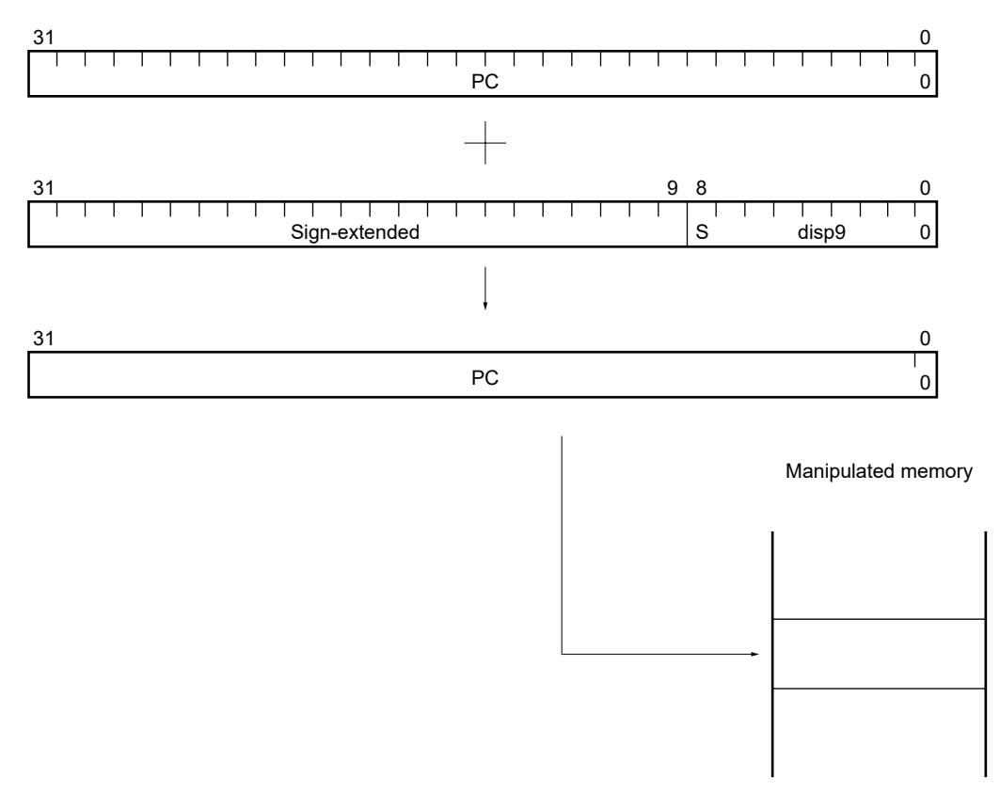

## **(2) Register addressing (Register indirect)**

Addressing which transfers the contents of the general registers (r0 to r31) specified by instructions to the program counter (PC).

The JMP [reg1] instruction is used in this addressing.

**Fig. 4-5 Register Addressing (JMP [reg1])**

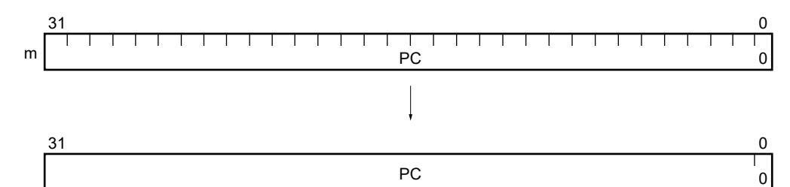

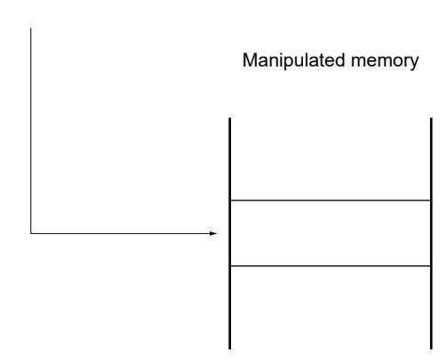

## **4.2.2 Operand address**

The following methods are available for accessing registers and memories used in the execution of instructions:

## **(1) Register addressing**

Addressing which accesses, as operands, general registers specified by the general register specification field. In this addressing, instructions with operand formats reg1 or reg2 are used.

### **(2) Immediate addressing**

Addressing which contains 5-bit data and 16-bit data for manipulation in their instruction codes. In this addressing, instructions with operand formats imm5 or imm16 are used.

### **(3) Based addressing**

Addressing in which the contents of the general registers specified by the addressing specification code in the instruction word and the 16-bit displacement add up to become the operand address in order to address the memory for manipulation. In this addressing, instructions with operand format disp16 [reg1] is used.

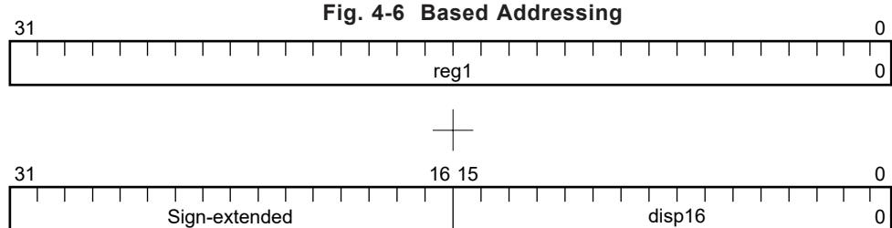

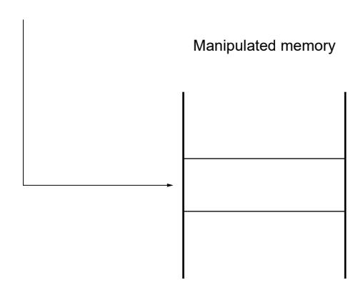

**[MEMO]**

## **CHAPTER 5 INSTRUCTION FORMAT AND INSTRUCTION SET**

## **5.1 Instruction Format**

The V810 family has two types of instruction formats: 16-bit and 32-bit formats. The 16-bit instructions are binary operation, control, and branch instructions, and the 32-bit instructions are load/store, I/O manipulation, 16-bit immediate, jump and link, and extended instructions.

Some instructions have an unused field, which is reserved for future expansion and must be fixed to 0.

An instruction is actually stored in memory as follows:

- Lower part of each instruction (including bit 0) -> lower address side
- Higher part of each instruction (including bit 15 or 32) -> higher address side

## **(1) reg-reg instruction format (Format I)**

An instruction in this format has a 6-bit op code field and two general-purpose register specification fields to specify an operand. This format applies to a 16-bit instruction.

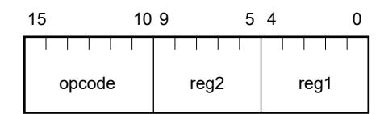

## **(2) imm-reg instruction format (Format II)**

An instruction in this format has a 6-bit op code field, a 5-bit immediate field, and a general-purpose register specification field. This format applies to a 16-bit instruction.

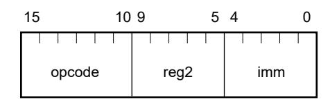

### **(3) Conditional branch instruction format (Format III)**

An instruction in this format has a 3-bit op code field, a 4-bit condition code, and a 9-bit branch displacement field (the least significant bit is 0, however). This format applies to a 16-bit instruction.

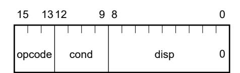

## **(4) Middle-distance jump instruction format (Format IV)**

An instruction in this format is a middle-distance 32-bit branch instruction that has a 6-bit op code field and a 26-bit displacement (the least significant bit is 0, however).

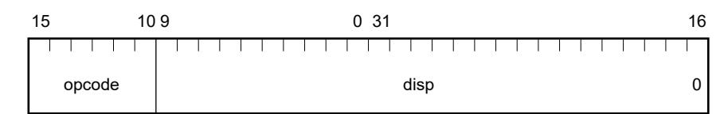

### **(5) 3-operand instruction format (Format V)**

An instruction in this format is a 32-bit instruction that has a 6-bit op code field, two general-purpose register specification fields, and a 16-bit immediate field.

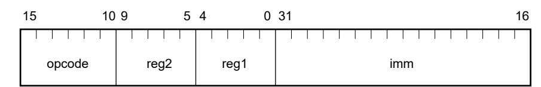

## **(6) Load/store instruction format (Format VI)**

An instruction in this format is a 32-bit instruction that has a 6-bit op code field, two general-purpose register specification fields, and a 16-bit displacement.

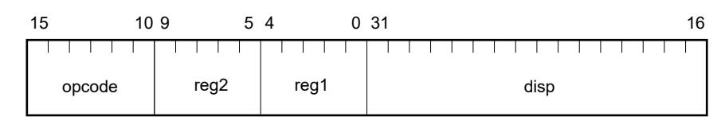

## **(7) Extended instruction format (Format VII)**

An instruction in this format is a 32-bit instruction that has a 6-bit op code field, two general-purpose register specification fields, and a 6-bit sub-op code field.

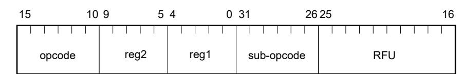

## **5.2 Instruction Outline**

## **(1) Load/store instructions**

The load/store instructions transfer data from the memory to the register.

**Table 5-1 Load/Store Instructions**

| Mnemonic | Function       |
| -------- | -------------- |
| LD.B     | Load Byte      |
| LD.H     | Load Halfword  |
| LD.W     | Load Word      |
| ST.B     | Store Byte     |
| ST.H     | Store Halfword |
| ST.W     | Store Word     |

## **(2) Integer arithmetic operation instructions**

The integer arithmetic operation instructions perform addition, subtraction, multiplication, and division, as well as data transfer, and data comparison between registers.

**Table 5-2 Integer Arithmetic Operation Instructions**

| Mnemonic | Function           |
| -------- | ------------------ |
| MOV      | Move               |
| MOVHI    | Add                |
| ADD      | Add                |
| ADDI     | Add                |
| MOVEA    | Add                |
| SUB      | Subtract           |
| MUL      | Multiply           |
| MULU     | Multiply Unsigned  |
| DIV      | Divide             |
| DIVU     | Divide Unsigned    |
| CMP      | Compare            |
| SETF     | Set Flag Condition |

## **(3) Logical operation instructions**

These instructions consist of the logical operation and shift instructions. The shift instructions consist of the arithmetic shift and logical shift.

Several bits can be shifted in one clock using the barrel shifter.

**Table 5-3 Logical Operation Instructions**

| Mnemonic | Function               |
| -------- | ---------------------- |
| OR       | OR                     |
| ORI      | OR                     |
| AND      | AND                    |
| ANDI     | AND                    |
| XOR      | Exclusive-OR           |
| XORI     | Exclusive-OR           |
| NOT      | NOT                    |
| SHL      | Shift Logical Left     |
| SHR      | Shift Logical Right    |
| SAR      | Shift Arithmetic Right |

## **(4) I/O instructions**

The I/O instructions perform data transfer between I/O and registers.

**Table 5-4 I/O Instructions**

| Mnemonic | Function        |
| -------- | --------------- |
| IN.B     | Input Byte      |
| IN.H     | Input Halfword  |
| IN.W     | Input Word      |
| OUT.B    | Output Byte     |
| OUT.H    | Output Halfword |
| OUT.W    | Output Word     |

## **(5) Program control instructions (branch instructions)**

The program control instructions consist of unconditional branch instructions and conditional branch instructions which change the control according to the condition of the flag. The control of the program can be shifted to an address specified by the program control instruction.

**Table 5-5 Program Control Instructions**

| Mnemonic | Function                               |
| -------- | -------------------------------------- |
| JMP      | Jump                                   |
| JR       | Jump Relative                          |
| JAL      | Jump and Link                          |
| BGT      | Branch on Greater than signed          |
| BGE      | Branch on Greater than or Equal signed |
| BLT      | Branch on Less than signed             |
| BLE      | Branch on Less than or Equal signed    |
| BH       | Branch on Higher                       |
| BNH      | Branch on Not Higher                   |
| BL       | Branch on Lower                        |
| BNL      | Branch on Not Lower                    |
| BE       | Branch on Equal                        |
| BNE      | Branch on Not Equal                    |
| BV       | Branch on Overflow                     |
| BNV      | Branch on No Overflow                  |
| BN       | Branch on Negative                     |
| BP       | Branch on Positive                     |
| BC       | Branch on Carry                        |
| BNC      | Branch on No Carry                     |
| BZ       | Branch on Zero                         |
| BNZ      | Branch on Not Zero                     |
| BR       | Branch Always                          |
| NOP      | No Branch (No Operation)               |

## **(6) Bit string instructions**

The bit string instructions perform bit search, transfer, and logical operation transfer for any bit length in the memory space.

**Table 5-6 Bit String Instructions**

| Mnemonic | Function                           |
| -------- | ---------------------------------- |
| SCH0BSU  | Search Bit 0 Upward                |
| SCH0BSD  | Search Bit 0 Downward              |
| SCH1BSU  | Search Bit 1 Upward                |
| SCH1BSD  | Search Bit 1 Downward              |
| MOVBSU   | Move Bit String Upward             |
| NOTBSU   | NOT Bit String Upward              |
| ANDBSU   | AND Bit String Upward              |
| ANDNBSU  | AND Not Bit String Upward          |
| ORBSU    | OR Bit String Upward               |
| ORNBSU   | OR Not Bit String Upward           |
| XORBSU   | Exclusive-OR Bit String Upward     |
| XORNBSU  | Exclusive-OR Not Bit String Upward |

## **(7) Floating-point operation instructions**

The floating-point operation instruction performs the addition, subtraction, multiplication, and division of single precision floating-point data (32 bits), comparisons, and mutual conversion of integer data and floating-point data.

**Table 5-7 Floating-Point Operation Instructions**

| Mnemonic | Function                                |
| -------- | --------------------------------------- |
| CMPF.S   | Compare Floating Short                  |
| CVT.WS   | Convert Word Integer to Short Floating  |
| CVT.SW   | Convert Short Floating to Word Integer  |
| ADDF.S   | Add Floating Short                      |
| SUBF.S   | Subtract Floating Short                 |
| MULF.S   | Multiply Floating Short                 |
| DIVF.S   | Divide Floating Short                   |
| TRNC.SW  | Truncate Short Floating to Word Integer |

## **(8) Special instructions**

This section lists the following special instructions, which are not included in the previous categories.

**Table 5-8 Special Instructions**

| Mnemonic | Function                         |
| -------- | -------------------------------- |
| LDSR     | Load System Register             |
| STSR     | Store System Register            |
| TRAP     | Trap                             |
| RETI     | Return from Trap or Interrupt    |
| CAXI     | Compare and Exchange Interlocked |
| HALT     | Halt                             |

## **5.3 Instruction Set**

## **Example of instruction description**

## Meaning of instruction **Mnemonic of instruction**

Instruction format Indicates format in which the instruction is to be described, and the operand of the instruction. The symbols used for operand description are as follows:

| Symbol     | Meaning                                                        |
| ---------- | -------------------------------------------------------------- |
| reg1       | General-purpose register (used as source register)             |
| reg2       | General-purpose register (mainly used as destination register. |
| imm5       | 5-bit immediate                                                |
| imm16      | 16-bit immediate                                               |
| disp9      | 9-bit displacement                                             |
| disp16     | 16-bit displacement                                            |
| disp26     | 26-bit displacement                                            |
| regID      | System register number                                         |
| vector adr | Trap: Trap handler address corresponding to vector             |

Operation Indicates the function of the instruction. The symbols used are as follows:

| Symbol                 | Meaning                                                       |
| ---------------------- | ------------------------------------------------------------- |
| <-                     | Substitution                                                  |
|                        | Bit connection                                                |
| GR [x]                 | General-purpose register x                                    |
| SR [x]                 | System register x                                             |
| sign-extend (x)        | Extends sign of value x to word length                        |
| zero-extend(x)         | Zero-extends value x to word length                           |
| converted (x)          | Converts type of value x (rounding direction depends on TKCW) |
| truncate (x)           | Converts type of value x (rounding direction is 0)            |
| Load-Memory (x, y)     | Reads data of size y from address x                           |
| Store-Memory (x, y, z) | Writes data y of size z to address x                          |
| Input-Port (x, y)      | Reads data of size y from port address x                      |
| Output-Port (x, y, z)  | Writes data y of size z to port address x                     |
| adr                    | 32-bit unsigned address                                       |

Format Indicates the symbol of the instruction format.

Op code Indicates the op code of the instruction in the bit field. If the instruction has two or more codes, part of the field may be described. "–" indicates a field other than the op code field.

Flag Indicates the operations of the flags.

CY – <- Not affected

OV 0 <- Affected to 0

S 1 <- Affected to 1

Z –

If the instruction is a floating-point instruction, the operations of the flags dedicated to floating-point data are also shown.

FRO –

FIV –

FZD –

FOV –

FUD –

FPR –

Instruction Indicates the function of the instruction.

Remarks Explains the operation of the instruction.

Supplement Provides supplemental information on the instruction.

Exception Explains exceptions that may occur as a result of executing the instruction.

Note Explains points to be noted on the V810 family.

## Add **ADD**

- Instruction format (1) ADD reg1, reg2
  - (2) ADD imm5, reg2

- Operation (1) GR [reg2] <- GR [reg2] + GR [reg1]
  - (2) GR [reg2] <- GR [reg2] + sign-extend (imm5)

- Format (1) Format I
  - (2) Format II

| Op code |     | 10     | 9    | 5    | 4   | 0   |
| ------- | --- | ------ | ---- | ---- | --- | --- |
|         | (1) | 000001 | reg2 | reg1 |     |     |

| (2) | 15     | 10   | 9    | 5   | 4   | 0   |
| --- | ------ | ---- | ---- | --- | --- | --- |
|     | 010001 | reg2 | imm5 |     |     |     |

Flag CY 1 if carry occurs from MSB; otherwise, 0 OV 1 if Integer-Overflow occurs; otherwise, 0 S 1 if GR [reg2] is negative; otherwise, 0 Z 1 if GR [reg2] is 0; otherwise; 0

- Instruction (1) ADD Add Register
  - (2) ADD Add Immediate (5-bit)

- Remarks (1) Adds the word data of general-purpose register reg1 and reg2, and stores the result in general-purpose register reg2. The contents of general-purpose register reg1 are not affected.
  - (2) Adds the value sign-extended to word length from 5-bit immediate data to the word data of general-purpose register reg2, and stores the result in general-purpose register reg2.

## Add Floating Short **ADDF.S**

Instruction format ADDF.S reg1, reg2

Operation GR [reg2] <- GR [reg2] + GR [reg1]

Format Format VII

Op code 15 10 9 5 4 0 31 26 25 16

| 111110 | reg2 | reg1 | 000100 | RFU |
| ------ | ---- | ---- | ------ | --- |
|        |      |      |        |     |

Flag CY 1 if GR [reg2] is negative; otherwise, 0 OV 0 S 1 if GR [reg2] is negative; otherwise, 0 Z 1 if GR [REG2] is 0; otherwise, 0 FRO 1 if operand is denormal number, non-number (NaN), and indefinite; otherwise, not affected FIV – FZD – FOV 1 if result of operation is greater than maximum normalized number that can be expressed; otherwise, not affected FUD 1 if result of operation is less than minimum (absolute value) normalized number that can be expressed; otherwise, not affected FPR 1 if degradation in precision is detected; otherwise, not affected

Instruction ADDF.S Add Floating Short

Remarks Adds the single-precision floating-point data of general-purpose registers reg1 and reg2, reflects the result on the flags, and stores the result into general-purpose register reg2. Of the flags, the statuses of CY, OV, S, and Z are directly determined by the execution result of this instruction. The other floating-point data flags are not affected unless a given condition is satisfied, and hold the values determined before this instruction has been executed.

The S flag has the same value as that of the CY flag.

If the single-precision floating-point data of general-purpose registers reg1 and reg2 are equal in absolute value but different in sign, the sign of the result (zero) is determined depending on the rounding mode. Because the rounding mode of the V810 family is "Toward nearest", the result is "positive zero".

Exception • Floating-point reserved operand exception • Floating-point overflow exception

Note If the specified single-precision floating-point data is a denormal number, non-number, or indefinite, a floating-point reserved operand exception occurs. As a result, the FRO flag is set, a trap occurs, and control is transferred to the exception processing handler. In this case, general-purpose register reg2 and the other flags are not affected. If the result of operation is greater than the maximum normalized number that can be expressed, the floating-point overflow exception occurs. As a result, the FOV flag is set, a trap occurs, and control is transferred to the exception processing handler. In this case, the result of operation having a corrected exponent is stored to general-purpose register reg2.

> If the result of operation is less than the minimum (absolute value) normalized number that is not zero and can be expressed, the FUD flag is set, but a trap does not occur and control is not transferred to the exception processing handler. In this case, zero is stored to general-purpose register reg2.

> If degradation in precision occurs as a result of rounding after conversion, the FPR flag is set, but control is not trapped to the exception processing handler. In this case, the result of operation having the rounded mantissa is stored to general-purpose register reg2.

## Add Immediate **ADDI**

Instruction format ADDI imm16, reg1, reg2

Operation GR [reg2] <- GR [reg1] + sign-extend (imm16)

Format Format V

Op code 15 10 9 5 4 0 31 16

| 101001 | reg2 | reg1 | imm16 |
| ------ | ---- | ---- | ----- |
|        |      |      |       |

Flag CY 1 if carry occurs from MSB; otherwise, 0 OV 1 if Integer-Overflow occurs; otherwise, 0 S 1 if GR [reg2] is negative; otherwise, 0 Z 1 if GR [reg2] is 0; otherwise; 0

Instruction ADDI Add Immediate (16-bit)

Remarks Adds the value sign-extended from 16-bit immediate data to word length and the word data of general-purpose register reg1, and stores the result in general-purpose register reg2. The contents of general-purpose register reg1 are not affected.

## And **AND**

Instruction format AND reg1, reg2

Operation GR [reg2] <- GR [reg2] AND GR [reg1]

Format Format I

| Op code | 15     | 10  | 9    | 5   | 4    | 0   |
| ------- | ------ | --- | ---- | --- | ---- | --- |
|         | 001101 |     | reg2 |     | reg1 |     |

Flag CY –

OV 0

S 1 if GR [reg2] is negative; otherwise, 0

Z 1 if GR [reg2] is 0; otherwise, 0

Instruction AND And

Remarks ANDs the word data of general-purpose register reg2 with the word data of generalpurpose register reg1, and stores the result in general-purpose register reg2. The contents of general-purpose register reg1 are not affected.

## And Bit String Upward **ANDBSU**

Instruction format ANDBSU

Operation destination <- destination AND source

Format Format II

Op code 15 10 9 5 4 0 011111 reg2 01001

Flag CY – OV – S– Z–

Instruction ANDBSU And Bit String Upward

Remarks ANDs the source bit string specified by general-purpose registers r30 (source word address), r27 (bit offset in source word), and r28 (string length) with the destination bit string specified by general-purpose registers r29 (destination word address) and r26 (bit offset in destination word), and transfers the result to the destination bit string. Transfer is carried out from the lower address (first address) toward the higher address (end address).

Supplement General-purpose registers r26 through r30 are assigned as the work registers of the bit string instruction and hold information necessary for aborting and resuming the instruction while the instruction is executed.

| General-purpose register | Use                            |
| ------------------------ | ------------------------------ |
| r26                      | Bit offset in destination word |
| r27                      | Bit offset in source word      |
| r28                      | String length                  |
| r29                      | Destination word address       |
| r30                      | Source word address            |

## And Immediate **ANDI**

Instruction format ANDI imm16, reg1, reg2

Operation GR [reg2] <- GR [reg1] AND zero-extend (imm16)

Format Format V

Op code 15 10 9 5 4 0 31 16

| 101101 | reg2 | reg1 | imm16 |
| ------ | ---- | ---- | ----- |
|        |      |      |       |

Flag CY – OV 0 S0 Z 1 if GR [reg2] is 0; otherwise, 0

Instruction ANDI And Immediate (16-bit)

Remarks ANDs the word data of general-purpose register reg1 with the value zero-extended from the 16-bit immediate data to word length, and stores the result in general-purpose register reg2. The contents of general-purpose register reg1 are not affected.

## And Not Bit String Upward **ANDNBSU**

Instruction format ANDNBSU

Operation destination <- destination AND (NOT source)

Format Format II

Op code 15 10 9 5 4 0 011111 reg2 01101

Flag CY – OV – S– Z–

Instruction ANDNBSU And Not Bit String Upward

Remarks NOTs the source bit string specified by general-purpose registers r30 (source word address), r27 (bit offset in source word), and r28 (string length), ANDs the result with the destination bit string specified by general-purpose registers r29 (destination word address) and r26 (bit offset in destination word), and transfers the result of the AND to the destination bit string. Transfer is carried out from the lower address (first address) toward the higher address (end address).

Supplement General-purpose registers r26 through r30 are assigned as the work registers of the bit string instruction and hold information necessary for aborting and resuming the instruction while the instruction is executed.

| General-purpose register | Use                            |
| ------------------------ | ------------------------------ |
| r26                      | Bit offset in destination word |
| r27                      | Bit offset in source word      |
| r28                      | String length                  |
| r29                      | Destination word address       |
| r30                      | Source word address            |

## Branch on Condition **Bcond**

Instruction format Bcond disp9

Operation if condition are satisfied

then PC <- PC + (sign-extend) disp9

Format Format III

Op code 15 9 8 0

| 100\$\$\$\$ | disp9 | 0   |
| ----------- | ----- | --- |
|             |       |     |

\$\$\$\$ field indicates a condition (refer to Table 5-9).

Flag CY –

OV –

S–

Z–

Instruction Bcond Branch on Condition Code with 9-bit displacement

Remarks Tests the condition flag specified by the instruction. If the condition is satisfied, sets the value resulting from adding the current PC contents and the value sign-extended from 9-bit displacement to word length to the PC and transfers control. Bit 0 of the 9 bit displacement is masked with 0. The current PC contents used for the calculation is the address of the first byte of the Bcond instruction itself; therefore, if the displacement value is 0, the branch destination is this instruction itself.

**Table 5-9 Conditional Branch Instructions**

| Instruction | Condition code | Condition flag status | Branch condition                  |
| ----------- | -------------- | --------------------- | --------------------------------- |
| Integer BGT | 1111           | ((S xor OV) or Z) = 0 | Greater than signed               |
| BGE         | 1110           | (S xor OV) = 0        | Greater than or equal signed      |
| BLT         | 0110           | (S xor OV) = 1        | Less than signed                  |
| BLE         | 0111           | ((S xor OV) or Z) = 1 | Less than or equal signed         |
| Unsigned BH | 1011           | (CY or Z) = 0         | Higher (Greater than)             |
| integer BNL | 1001           | CY = 0                | Not lower (Greater than or equal) |
| BL          | 0001           | CY = 1                | Lower (Less than)                 |
| BNH         | 0011           | (CY or Z) = 1         | Not higher (Less than or equal)   |
| Common BE   | 0010           | Z = 1                 | Equal                             |
| BNE         | 1010           | Z = 0                 | Not equal                         |
| Others BV   | 0000           | OV = 1                | Overflow                          |
| BNV         | 1000           | OV = 0                | No overflow                       |
| BN          | 0100           | S = 1                 | Negative                          |
| BP          | 1100           | S = 0                 | Positive                          |
| BC          | 0001           | CY = 1                | Carry                             |
| BNC         | 1001           | CY = 0                | No carry                          |
| BZ          | 0010           | Z = 1                 | Zero                              |
| BNZ         | 1010           | Z = 0                 | Not zero                          |
| BR          | 0101           | –                     | Always (unconditional)            |
| NOP         | 1101           | –                     | Not Always (does not branch)      |

Compare and Exchange Interlocked **CAXI**

Instruction format CAXI disp16 [reg1], reg2

Operation locked adr <- GR [reg1] + (sign-extend) disp16 tmp <- Load-Memory (adr, Word) if GR [reg2] = tmp (compare; result <- GR [reg2] – tmp) then Store-Memory (adr, GR [30], Word) GR [reg2] <- tmp else Store-Memory (adr, tmp, Word) GR [reg2] <- tmp unlocked

Format Format VI

Op code 15 10 9 5 4 0 31 16 111010 reg2 imm5 disp16

Flag CY 1 if borrow occurs from MSB as result of comparison; otherwise, 0 OV 1 if Integer-Overflow occurs as result of comparison; otherwise, 0 S 1 if result of comparison is negative; otherwise, 0 Z 1 if result of comparison is 0; otherwise, 0

Instruction CAXI Compare and Exchange Interlocked

Remarks This instruction is to synchronize processors in a multi-processor system, and the data specified by disp16 [reg1] is to establish synchronization (for example, lock word). The status before this instruction is executed is as follows:

| New lock word to be set   | GR [30]                                     |
| ------------------------- | ------------------------------------------- |
| Lock word previously read | GR [reg2]                                   |
| Lock word                 | Word data of address specified by GR [reg1] |

In this status, the CAXI instruction performs the following operations:

- (1) Locks the bus to prevent the other processor from accessing the bus.
- (2) Fetches the lock word.
- (3) Compares the value of the fetched lock word with the value of the previously read lock word, and reflects the result of comparison on flags.
- (4) If both the lock words coincide, it means that the status has not been changed from the status in which previous access was made (the program of the other processor is not locked for accessing). Since the status is changed as a result of executing this CAXI instruction, set a new lock word to be set (GR [30]).

- (5) If both the lock words do not coincide, it means that the status has been changed (the program of the other processor is locked for accessing). To check the status of the lock word, set that lock word to GR [reg2].
- (6) Releases the bus lock.

## Compare **CMP**

- Instruction format (1) CMP reg1, reg2
  - (2) CMP imm5, reg2

- Operation (1) result <- GR [reg2] GR [reg1]
  - (2) result <- GR [reg2] sign-extend (imm5)

- Format (1) Format I
  - (2) Format II

| Op code | 15  | 10     | 9    | 5    | 4   |
| ------- | --- | ------ | ---- | ---- | --- |
|         | (1) | 000011 | reg2 | reg1 |     |

| (2) | 15     | 10  | 9    | 5   | 4    | 0   |
| --- | ------ | --- | ---- | --- | ---- | --- |
|     | 010011 |     | reg2 |     | imm5 |     |

Flag CY 1 if borrow occurs from MSB; otherwise, 0 OV 1 if Integer-Overflow occurs; otherwise, 0 S 1 if result is negative; otherwise, 0 Z 1 if result is 0; otherwise, 0

- Instruction (1) CMP Compare Register
  - (2) CMP Compare Immediate (5-bit)

- Remarks (1) Compares the word data of general-purpose register reg2 with the word data of general-purpose register reg1, and indicates the result to the condition flag. The comparison is made by subtracting the contents of general-purpose register reg1 from the word data of general-purpose register reg2. The contents of generalpurpose registers reg1 and reg2 are not affected.
  - (2) Compares the word data of general-purpose register reg2 with the value signextended from the 5-bit immediate data to word length, and indicates the result to the condition flag. The comparison is made by subtracting the value sign-extended from the 5-bit immediate data to word length from the word data of general-purpose register reg2. The contents of general-purpose register reg2 are not affected.

## Compare Floating Short **CMPF.S**

Instruction format CMPF.S reg1, reg2

Operation result <- GR [reg2] –GR [reg1]

Format Format VII

Op code 15 10 9 5 4 0 31 26 25 16

| 111110 | reg2 | reg1 | 000000 | RFU |
| ------ | ---- | ---- | ------ | --- |
|        |      |      |        |     |

Flag CY 1 if result of operation is negative; otherwise, 0 OV 0 S 1 if result of operation is negative; otherwise, 0 Z 1 if result of operation is 0; otherwise, 0 FRO 1 if operand is denormal number, non-number (NaN), and indefinite; otherwise, not affected FIV – FZD – FOV – FUD – FPR –

Instruction CMPF.S Compare Floating Short

Remarks Compares the single-precision floating-point data of general-purpose registers reg1 and reg2, and indicates the result with the flags. The comparison is carried out by subtracting the floating-point data of general-purpose register reg1 from the floating-point data of general-purpose register reg2. The contents of both the general-purpose registers are not affected. Of the flags, the statuses of CY, OV, S, and Z are directly determined by the execution result of this instruction. The other floating-point data flags are not affected unless a given condition is satisfied, and hold the values determined before this instruction has been executed.

The S flag has the same value as the CY flag.

Exception • Floating-point reserved operand exception

Note If the specified single-precision floating-point data is a denormal number, non-number, or indefinite, a floating-point reserved operand exception occurs. As a result, the FRO flag is set, a trap occurs, and control is transferred to the exception processing handler. In this case, the other flags are not affected.

Convert Short Floating to Word Integer **CVT.SW**

Instruction format CVT.SW reg1, reg2

Operation GR [reg2] <- convert (GR [reg1])

Format Format VII

Op code 15 10 9 5 4 0 31 26 25 16

| 111110 | reg2 | reg1 | 000011 | RFU |
| ------ | ---- | ---- | ------ | --- |
|        |      |      |        |     |

Flag CY –

OV 0

S 1 if GR [reg2] is negative; otherwise, 0

Z 1 if GR [reg2] is 0; otherwise, 0

FRO 1 if GR [reg2] is denormal number, non-number (NaN), and indefinite; otherwise, not affected

FIV 1 if invalid operation occurs; otherwise, not affected

FZD –

FOV –

FUD –

FPR 1 if degradation in precision is detected; otherwise, not affected

Instruction CVT.SW Convert Short Floating to Word Integer

Remarks Converts the single-precision floating-point data of general-purpose register reg1 into integer data, indicates the result with the flags, and stores the result to general-purpose register reg2. Of the flags, the statuses of CY, OV, S, and Z are directly determined by the execution result of this instruction. The other floating-point data flags are not affected unless a given condition is satisfied, and hold the values determined before this instruction has been executed.

Exception • Floating-point reserved operand exception • Floating-point invalid operation exception

Note If the specified single-precision floating-point data is a denormal number, non-number, or indefinite, a floating-point reserved operand exception occurs. As a result, the FRO flag is set, a trap occurs, and control is transferred to the exception processing handler. In this case, general-purpose register reg2 and the other flags are not affected.

> If the result of operation is a word-length integer and cannot be expressed in a given range, the invalid floating-point operation exception occurs. As a result, the FIV flag is set, a trap occurs, and control is transferred to the exception processing handler. In this case, general-purpose register reg2 and the other flags are not affected.

> If degradation in precision occurs as a result of rounding after conversion, the FPR flag is set, but control is not trapped to the exception processing handler. In this case, the result of operation having the rounded mantissa is stored to general-purpose register reg2.

Convert Word Integer to Short Floating **CVT.WS**

Instruction format CVT.WS reg1, reg2

Operation GR [reg2] <- convert (GR [reg1])

Format Format VII

|     | <b>Operation code</b> | <b>15</b>   | <b>10</b>   | <b>9</b>      | <b>4</b>   | <b>0</b> | <b>31</b> | <b>16</b> |
| --- | --------------------- | ----------- | ----------- | ------------- | ---------- | -------- | --------- | --------- |
|     | <b>1111110</b>        | <b>reg2</b> | <b>reg1</b> | <b>000010</b> | <b>RFU</b> |          |           |           |

Flag CY 1 if GR [reg2] is negative; otherwise, 0

OV 0

S 1 if GR [reg2] is negative; otherwise, 0

Z 1 if GR [REG2] is 0; otherwise, 0

FRO –

FIV –

FZD –

FOV –

FUD –

FPR 1 if degradation in precision is detected; otherwise, not affected

Instruction CVT.WS Convert Word Integer to Short Floating

Remarks Converts the integer data of general-purpose register reg1 into single-precision floatingpoint data, indicates the result with the flags, and stores the result in general-purpose register reg2. Of the flags, the statuses of CY, OV, S, and Z are directly determined by the result of executing this instruction. The other floating-point data flags are not affected unless a given condition is satisfied, and hold the values determined before this instruction has been executed.

The S flag has the same value as the CY flag.

Exception None

Note If degradation in precision occurs as a result of rounding after conversion, the FPR flag is set, but control is not trapped to the exception processing handler. In this case, the result of operation having the rounded mantissa is stored to general-purpose register reg2.

## Divide **DIV**

Instruction format DIV reg1, reg2

Operation GR [30] <- GR [reg2] MOD GR [reg1] (signed) GR [reg2] <- GR [reg2] ÷ GR [reg1] (signed)

Format Format I

Op code 15 10 9 5 4 0 001001 reg2 reg1

Flag CY – OV 1 if Integer-Overflow occurs; otherwise, 0 S 1 if GR [reg2] is negative; otherwise, 0 Z 1 if GR [reg2] is 0; otherwise; 0

Instruction DIV Divide

Remarks Divides the word data of general-purpose register reg2 by the word data of generalpurpose register reg1 (signed), and stores the quotient in general-purpose register reg2 and the remainder in general-purpose register r30, respectively. Division is carried out so that the sign of the remainder matches the sign of the dividend. The contents of general-purpose register 1 are not affected. An overflow is set if the maximum value (80000000H) is divided by –1 (FFFFFFFFH). At this time, the negative maximum value is stored in general-purpose register reg2, and 0 is stored in general-purpose register r30.

Exception Zero division exception

Note If the word data of general-purpose register reg1 is zero, a zero division exception occurs, a trap occurs, and control is transferred to the exception processing handler. In this case, the contents of general-purpose register reg2, general-purpose register r30, and flags are not affected.

## Divide Floating Short **DIVF.S**

Instruction format DIVF.S reg1, reg2

Operation GR [reg2] <- GR [reg2] ÷ GR [reg1]

Format Format VII

Op code 15 10 9 5 4 0 31 26 25 16

| 111110 | reg2 | reg1 | 000111 | RFU |
| ------ | ---- | ---- | ------ | --- |
|        |      |      |        |     |

Flag CY 1 if GR [reg2] is negative; otherwise, 0

OV 0

S 1 if GR [reg2] is negative; otherwise, 0

Z 1 if GR [reg2] is 0; otherwise, 0

FRO 1 if operand is denormal number, non-number (NaN), and indefinite; otherwise, not affected

FIV 1 if invalid operation occurs; otherwise, not affected

FZD 1 if zero division occurs; otherwise, not affected

FOV 1 if result of operation is greater than maximum normalized number that can be expressed; otherwise, not affected

FUD 1 if result of operation is less than minimum (absolute value) normalized number that can be expressed; otherwise, not affected

FPR 1 if degradation in precision is detected; otherwise, not affected

Instruction DIVF.S Divide Floating Short

Remarks Divides the single-precision floating-point data of general-purpose register reg2 by the single-precision floating-point data of general-purpose register reg1, reflects the result on the flags, and stores the result to general-purpose register reg2. Of the flags, the statuses of CY, OV, S, and Z are directly determined by the result of executing this instruction. The other floating-point data flags are not affected unless a given condition is satisfied, and hold the values determined before this instruction has been executed.

The S flag has the same value as that of the CY flag.

If the single-precision floating-point data of general-purpose register reg2 is zero, and if the single-precision floating-point data of general-purpose register reg1 is not zero and denormalized number, the result of operation is zero.

The sign of the operation result is determined through exclusive OR between the sign fields of the single-precision floating-point data of general-purpose registers reg1 and reg2.

- Exception Floating-point reserved operand exception
  - Floating-point invalid operation exception
  - Floating-point zero division exception
  - Floating-point overflow exception

Note If the specified single-precision floating-point data is a denormal number, non-number, or indefinite, a floating-point reserved operand exception occurs. As a result, the FRO flag is set, a trap occurs, and control is transferred to the exception processing handler. In this case, general-purpose register reg2 and the other flags are not affected.

> If both the specified single-precision floating-point data are zero, the floating-point invalid operation exception occurs. As a result, the FIV flag is set, a trap occurs, and control is transferred to the exception processing handler. In this case, general-purpose register reg2 and the other flags are not affected.

> If the single-precision floating-point data of general-purpose register reg1 is zero and the single-precision floating-point data of general-purpose register reg2 is a normalized number, the floating-point zero division exception occurs. As a result, the FZD flag is set, a trap occurs, and control is transferred to the exception processing handler. In this case, general-purpose register reg2 and the other flags are not affected.

> If the result of operation is greater than the maximum normalized number that can be expressed, the floating-point overflow exception occurs. As a result, the FOV flag is set, a trap occurs, and control is transferred to the exception processing handler. In this case, the result of operation having a corrected exponent is stored to general-purpose register reg2.

> If the result of operation is less than the minimum (absolute value) normalized number that is not zero and can be expressed, the FUD flag is set, but a trap does not occur and control is not transferred to the exception processing handler. In this case, denormal number is stored to general-purpose register reg2.

> If degradation in precision occurs as a result of rounding after conversion, the FPR flag is set, but control is not trapped to the exception processing handler. In this case, the result of operation having the rounded mantissa is stored to general-purpose register reg2.

## Divide Unsigned **DIVU**

Instruction format DIVU reg1, reg2

Operation GR [30] <- GR [reg2] MOD GR [reg1] (unsigned) GR [reg2] <- GR [reg2] ÷ GR [reg1] (unsigned)

Format Format I

Op code 15 10 9 5 4 0 001011 reg2 reg1

Flag CY – OV 0 S 1 if GR [reg2] is negative; otherwise, 0 Z 1 if GR [reg2] is 0; otherwise, 0

Instruction DIVU Divide Unsigned

Remarks Divides the word data of general-purpose register reg2 by the word data of generalpurpose register reg1 (signed) as unsigned data, and stores the quotient in generalpurpose register reg2 and the remainder in general-purpose register r30, respectively. The contents of general-purpose register reg1 are not affected. If r30 is specified as general-purpose register reg2, the quotient is stored in general-purpose register r30. The flags are set as if the result were signed data.

Exception Zero division exception

Note If the word data of general-purpose register reg1 is zero, a zero division exception occurs, a trap occurs, and control is transferred to the exception processing handler. In this case, the contents of general-purpose register reg2, general-purpose register r30, and flags are not affected.

## Halt **HALT**

Instruction format HALT

Operation Halt

Format Format II

Op code 15 10 9 5 4 0 011010 reg2 imm5

Flag CY – OV – S– Z–

Instruction HALT Halt

Remarks Halts the processor.

Exception None

Supplement If an interrupt is accepted in the HALT status set by the HALT instruction, the address of the instruction next to the HALT instruction is stored in the EIPC or FEPC.

Input From Port **IN**

- Instruction format (1) IN.B disp16 [reg1], reg2
  - (2) IN.H disp16 [reg1], reg2
  - (3) IN.W disp16 [reg1], reg2

- Operation (1) adr <- GR [reg1] + (sign-extend) disp16 GR [reg2] Input-Port (adr, Byte)
  - (2) adr <- GR [reg1] + (sign-extend) disp16 GR [reg2] Input-Port (adr, Halfword)
  - (3) adr <- GR [reg1] + (sign-extend) disp16 GR [reg2] Input-Port (adr, Word) zero-extend zero-extend

Format (1) Format VI

| Op code | 15                                  | 10   | 9    | 5      | 4   | 0   | 31  |     |     |     |     |     |
| ------- | ----------------------------------- | ---- | ---- | ------ | --- | --- | --- | --- | --- | --- | --- | --- |
|         | 1110*\$                             | reg2 | reg1 | disp16 |     |     |     |     |     |     |     |     |
|         | (*\$: 00 = (1), 01 = (2), 11 = (3)) |      |      |        |     |     |     |     |     |     |     |     |

Flag CY – OV – S– Z–

- Instruction (1) IN.B Input Byte from Port
  - (2) IN.H Input Halfword from Port
  - (3) IN.W Input Word from Port

- Remarks (1) Adds the data of general-purpose register reg1 and the value sign-extended from the 16-bit displacement to word length to generate an unsigned 32-bit port address. From this port address, byte data is read, zero-extended to word length, and stored in general-purpose register reg2.
  - (2) Adds the data of general-purpose register reg1 and the 16-bit displacement signextended to word length to generate an unsigned 32-bit port address. From this port address, halfword data is read, zero-extended to word length, and stored in general-purpose register reg2. Bit 0 of the unsigned 32-bit address is masked with
    - 0.
  - (3) Adds the data of general-purpose register reg1 and the value sign-extended from the 16-bit displacement to word length to generate an unsigned 32-bit port address. From this port address, word data is read and stored in general-purpose register reg2. Bits 0 and 1 of the unsigned 32-bit address are masked with 0.

## Jump and Link **JAL**

Instruction format JAL disp26

Operation GR [31] <- PC + 4 PC <- PC + (sign-extend) disp26

Format Format IV

Op code 15 10 9 16 101011 disp26 0

Flag CY – OV – S– Z–

Instruction JAL Jump and Link

Remarks Saves the value resulting from adding 4 to the current PC contents into the generalpurpose register r31, sets the value resulting from adding the current PC contents to the value sign-extended from the 26-bit displacement to word length to the PC, and transfers control. Bit 0 of the 26-bit displacement is masked with 0. The current PC contents used for the calculation is the address of the first byte of the JAL instruction itself; therefore, if the displacement value is 0, the branch destination is this instruction itself.

## Jump register **JMP**

Instruction format JMP [reg1]

Operation PC <- GR [reg1]

Format Format I

Op code 15 10 9 5 4 0 000110 reg2 reg1

Flag CY – OV – S– Z–

Instruction JMP Jump register

Remarks Transfers control to the address specified by general-purpose register reg1. Bit 0 of the address is masked with 0.

Jump Relative **JR**

Instruction format JR disp26

Operation PC <- PC + (sign-extend) disp26

Format Format IV

Op code 15 10 9 16

| 101010 | disp26 | 0   |
| ------ | ------ | --- |
|        |        |     |

Flag CY –

OV –

S–

Z–

Instruction JR Jump Relative

Remarks Sets the value resulting from adding the current PC contents to the value sign-extended from the 26-bit displacement to word length to the PC and transfers control. Bit 0 of the 26-bit displacement is masked with 0.

> The current PC contents used for the calculation is the address of the first byte of the JMP instruction itself; therefore, if the displacement value is 0, the branch destination is this instruction itself.

## Load **LD**

- Instruction format (1) LD.B disp16[reg1], reg2
  - (2) LD.H disp16[reg1], reg2
  - (3) LD.W disp16[reg1], reg2

- Operation (1) addr <- GR [reg1] + (sign-extend) disp16 GR [reg2] Load-Memory (adr, Byte)
  - (2) adr <- GR [reg1] + (sign-extend) disp16 GR [reg2] Load-Memory (adr, Halfword)
  - (3) adr <- GR [reg1] + (sign-extend) disp16 GR [reg2] Load-Memory (adr, Word) sign extend sign extend

Format Format VI

| Op code | 15                                  | 10   | 9    | 5   | 4   | 0   | 31     |     |     |
| ------- | ----------------------------------- | ---- | ---- | --- | --- | --- | ------ | --- | --- |
|         | 1100*\$                             | reg2 | reg1 |     |     |     | disp16 |     |     |
|         | (*\$: 00 = (1), 01 = (2), 11 = (3)) |      |      |     |     |     |        |     |     |

Flag CY – OV – S – Z –

- Instruction (1) LD.B Load Byte
  - (2) LD.H Load Halfword
  - (3) LD.W Load Word

- Remarks (1) Adds the data of general-purpose register reg1 and the displacement sign-extended from 16 bits to word length to generate a 32-bit unsigned address. From the generated address, byte data is read, which is then sign-extended to word length and is stored in general-purpose register reg2.
  - (2) Adds the data of general-purpose register reg1 and the displacement sign-extended from 16 bits to word length to generate a 32-bit unsigned address. From the generated address, halfword data is read, which is then sign-extended to word length, and is stored in general-purpose register reg2. Bit 0 of the 32-bit unsigned address is masked with 0.
  - (3) Adds the data of general-purpose register reg1 and the displacement sign-extended from 16 bits to word length to generate a 32-bit unsigned address. From the generated address, word data is read, and stored in general-purpose register reg2. Bits 0 and 1 of the 32-bit unsigned address are masked with 0.

## Load to System Register **LDSR**

Instruction format LDSR reg2, regID

Operation SR [regID] <- GR [reg2]

Format Format II

Op code 15 10 9 5 4 0

| 011100 | reg2 | imm5 |
| ------ | ---- | ---- |
|        |      |      |

Flag CY – (Refer to Supplement below.)

OV – (Refer to Supplement below.)

S – (Refer to Supplement below.)

Z – (Refer to Supplement below.)

Instruction LDSR Load to System Register

Remarks Sets the word data of general-purpose register reg2 to a system register specified by the system register number (regID). The contents of general purpose register reg2 is not affected. The system register number is a number to identify a system register. If the LDSR instruction is executed to a reserved system register or write-disabled system register, the operation is not guaranteed.

Exception None

Note If the system register number (regID) is 5 (PSW), the value of the corresponding bit of general-purpose register reg2 is set to each flag of the PSW.

## Move **MOV**

- Instruction format (1) MOV reg1, reg2
  - (2) MOV imm5, reg2

- Operation (1) GR [reg2] <- GR [reg1]
  - (2) GR [reg2] <- sign-extend (imm5)

- Format (1) Format I
  - (2) Format II

| Op code | 15  | 10     | 9    | 5    | 4   | 0   |
| ------- | --- | ------ | ---- | ---- | --- | --- |
|         | (1) | 000000 | reg2 | reg1 |     |     |

| (2) | 15     | 10   | 9    | 5   | 4   | 0   |
| --- | ------ | ---- | ---- | --- | --- | --- |
|     | 010000 | reg2 | imm5 |     |     |     |

Flag CY – OV – S – Z –

- Instruction (1) MOV Move Register
  - (2) MOV Move Immediate (5-bit)

- Remarks (1) Copies and transfers the word data of general-purpose register reg1 to generalpurpose register reg2. The contents of general-purpose register reg1 are not affected.
  - (2) Copies and transfers the value sign-extended from 5-bit immediate data to word length to general-purpose register reg2.

## Move Bit String Upward **MOVBSU**

Instruction format MOVBSU

Operation destination <- source

Format Format II

Op code 15 10 9 5 4 0 011111 reg2 01011

Flag CY – OV – S– Z–

Instruction MOVBSU Move Bit String Upward

Remarks Transfers the source bit string specified by general-purpose registers r30 (source word address), r27 (bit offset in source word), and r28 (string length) to the position specified by general-purpose registers r29 (destination word address) and r26 (bit offset in destination word). Transfer is carried out from the lower address (first address) toward the higher address (end address).

Supplement General-purpose registers r26 through r30 are assigned as the work registers of the bit string instruction and hold information necessary for aborting and resuming the instruction while the instruction is executed.

| General-purpose register | Use                            |
| ------------------------ | ------------------------------ |
| r26                      | Bit offset in destination word |
| r27                      | Bit offset in source word      |
| r28                      | String length                  |
| r29                      | Destination word address       |
| r30                      | Source word address            |

## Add **MOVEA**

Instruction format MOVEA imm16, reg1, reg2

Operation GR [reg2] <- GR [reg1] + sign-extend (imm16)

Format Format V

Op code 15 10 9 5 4 0 31 16

| 101000 | reg2 | reg1 | imm16 |
| ------ | ---- | ---- | ----- |
|        |      |      |       |

Flag CY –

OV –

S–

Z–

Instruction MOVEA Add Immediate (16-bit)

Remarks Adds the value sign-extended from 16-bit immediate data to word length and the word data of general-purpose register reg1, and stores the result in general-purpose register reg2. The contents of general-purpose register reg1 are not affected. Neither are the flags affected.

## Add **MOVHI**

Instruction format MOVHI imm16, reg1, reg2

Operation GR [reg2] <- GR [reg1] + (imm16 || 016)

Format Format V

Op code 15 10 9 5 4 0 31 16

| 101111 | reg2 | reg1 | imm16 |
| ------ | ---- | ---- | ----- |
|        |      |      |       |

Flag CY –

OV –

S –

Z –

Instruction MOVHI Add

Remarks Adds word data whose higher 16 bits are immediate data and lower 16 bits are all 0 and the word data of general-purpose register reg1, and stores the result of the addition in general-purpose register reg2. The contents of general-purpose register reg1 are not affected. Neither are the flags affected.

## Multiply **MUL**

Instruction format MUL reg1, reg2

Operation result <- GR [reg2] ✕ GR [reg1] (signed) GR [30] <- result (higher 32 bits) GR [reg2] <- result (lower 32 bits)

Format Format I

Op code 15 10 9 5 4 0 001000 reg2 reg1

Flag CY – OV 1 if Integer-Overflow occurs; otherwise, 0 S 1 if GR [reg2] is negative; otherwise, 0 Z 1 if GR [reg2] is 0; otherwise; 0

Instruction MUL Multiply

Remarks Multiplies the word data of general-purpose register reg2 by the word data of generalpurpose register reg1 (signed), and stores the higher 32 bits of the result (double word length) in general-purpose register r30, and the lower 32 bits in general-purpose register reg1 are not affected. If r30 is specified as general-purpose register reg2, the lower 32 bits of the result are stored in r30. An overflow is set if the result of the doubleword length is not equal to the value sign-extended from the lower 32 bits to doubleword length.

## Multiply Floating Short **MULF.S**

Instruction format MULF.S reg1, reg2

Operation GR [reg2] <- GR [reg2] ✕ GR [reg1]

Format Format VII

Op code 15 10 9 5 4 0 31 26 25 16

| 111110 | reg2 | reg1 | 000110 | RFU |
| ------ | ---- | ---- | ------ | --- |
|        |      |      |        |     |

Flag CY 1 if GR [reg2] is negative; otherwise, 0 OV 0 S 1 if GR [reg2] is negative; otherwise, 0 Z 1 if GR [reg2] is 0; otherwise, 0 FRO 1 if operand is denormal number, non-number (NaN), and indefinite; otherwise, not affected FIV – FZD – FOV 1 if result of operation is greater than maximum normalized number that can be expressed; otherwise, not affected FUD 1 if result of operation is less than minimum (absolute value) normalized number that can be expressed; otherwise, not affected FPR 1 if degradation in precision is detected; otherwise, not affected

Instruction MULF.S Multiply Floating Short

Remarks Multiplies the single-precision floating-point data of general-purpose register reg1 by the single-precision floating-point data of general-purpose register reg2, reflects the result on the flags, and stores the result to general-purpose register reg2. Of the flags, the statuses of CY, OV, S, and Z are directly determined by the result of executing this instruction. The other floating-point data flags are not affected unless a given condition is satisfied, and hold the values determined before this instruction has been executed.

The S flag has the same value as that of the CY flag.

If one of the two single-precision floating-point data is zero and the other is zero or a normalized number, the result of operation is zero.

The sign of the operation result is determined through exclusive OR between the sign fields of the single-precision floating-point data of general-purpose registers reg1 and reg2.

Exception • Floating-point reserved operand exception • Floating-point overflow exception

Note If the specified single-precision floating-point data is a denormal number, non-number, or indefinite, a floating-point reserved operand exception occurs. As a result, the FRO flag is set, a trap occurs, and control is transferred to the exception processing handler. In this case, general-purpose register reg2 and the other flags are not affected.

> If the result operation is greater than the maximum normalized number that can be expressed, the floating-point overflow exception occurs. As a result, the FOV flag is set, a trap occurs, and control is transferred to the exception processing handler. In this case, the result of operation having a corrected exponent is stored to general-purpose register reg2.

> If the result of operation is less than the minimum (absolute value) normalized number that is not zero and can be expressed, the FUD flag is set, but a trap does not occur and control is not transferred to the exception processing handler. In this case, zero is stored to general-purpose register reg2.

> If degradation in precision occurs as a result of rounding after conversion, the FPR flag is set, but control is not trapped to the exception processing handler. In this case, the result of operation having the rounded mantissa is stored to general-purpose register reg2.

## Multiply Unsigned **MULU**

Instruction format MULU reg1, reg2

Operation result <- GR [reg2] ✕ GR [reg1] (unsigned) GR [30] <- result (higher 32 bits) GR [reg2] <- result (lower 32 bits)

Format Format I

Op code 15 10 9 5 4 0 001010 reg2 reg1

Flag CY – OV 1 if Integer-Overflow occurs; otherwise, 0 S 1 if GR [reg2] is negative; otherwise, 0 Z 1 if GR [reg2] is 0; otherwise; 0

Instruction MULU Multiply Unsigned

Remarks Multiplies the word data of general-purpose register reg2 by the word data of generalpurpose register reg1 as unsigned data, and stores the higher 32 bits of the result (doubleword length) in general-purpose register r30, and the lower 32 bits in generalpurpose register reg2, respectively. The contents of general-purpose register reg1 are not affected. If r30 is specified as general-purpose register reg2, the lower 32 bits of the result are stored in r30. An overflow is set if the result of the doubleword length is not equal to the value zero-extended from the lower 32 bits to doubleword length.

## Not **NOT**

Instruction format NOT reg1, reg2

Operation GR [reg2] <- NOT (GR [reg1])

Format Format I

Op code 15 10 9 5 4 0 001111 reg2 reg1

Flag CY – OV 0 S 1 if GR [reg2] is negative; otherwise, 0 Z 1 if GR [reg2] is 0; otherwise, 0

Instruction NOT Not

Remarks Negates (1's complement) the word data of general-purpose register reg1 and stores the result in general-purpose register reg2. The contents of general-purpose register reg1 are not affected.

## Not Bit String Upward **NOTBSU**

Instruction format NOTBSU

Operation destination <- NOT (source)

Format Format II

| Op code | 15     | 10  | 9    | 5      | 4   | 0   |
| ------- | ------ | --- | ---- | ------ | --- | --- |
|         | 011111 |     | reg2 | 011111 |     |     |

Flag CY – OV – S– Z–

Instruction NOTBSU Not Bit String Upward

Remarks Logically negates the source bit string specified by general-purpose registers r30 (source word address), r27 (bit offset in source word), and r28 (string length) (inverts 1s and 0s), and transfers the result to the position specified by general-purpose registers r29 (destination word address) and r26 (bit offset in destination word). Transfer is carried out from the lower address (first address) toward the higher address (end address).

Supplement General-purpose registers r26 through r30 are assigned as the work registers of the bit string instruction and hold information necessary for aborting and resuming the instruction while the instruction is executed.

| General-purpose register | Use                            |
| ------------------------ | ------------------------------ |
| r26                      | Bit offset in destination word |
| r27                      | Bit offset in source word      |
| r28                      | String length                  |
| r29                      | Destination word address       |
| r30                      | Source word address            |

Or **OR**

Instruction format OR reg1, reg2

Operation GR [reg2] <- GR [reg2] OR GR [reg1]

Format Format I

Op code 15 10 9 5 4 0

Flag CY – OV 0

Instruction OR Or

Remarks ORs the word data of general-purpose register reg2 with the word data of generalpurpose register reg1, and stores the result in general-purpose register reg2. The contents of general-purpose register reg1 are not affected.

## Or Bit String Upward **ORBSU**

Instruction format ORBSU

Operation destination <- destination OR source

Format Format II

Op code 15 10 9 5 4 0 011111 reg2 01000

Flag CY – OV – S– Z–

Instruction ORBSU Or Bit String Upward

Remarks ORs the source bit string specified by general-purpose registers r30 (source word address), r27 (bit offset in source word), and r28 (string length) with the destination bit string specified by general-purpose registers r29 (destination word address) and r26 (bit offset in destination word), and transfers the result to the destination bit string. Transfer is carried out from the lower address (first address) toward the higher address (end address).

Supplement General-purpose registers r26 through r30 are assigned as the work registers of the bit string instruction and hold information necessary for aborting and resuming the instruction while the instruction is executed.

| General-purpose register | Use                            |
| ------------------------ | ------------------------------ |
| r26                      | Bit offset in destination word |
| r27                      | Bit offset in source word      |
| r28                      | String length                  |
| r29                      | Destination word address       |
| r30                      | Source word address            |

## Or Immediate **ORI**

Instruction format ORI imm16, reg1, reg2

Operation GR [reg2] <- GR [reg1] OR zero-extend (imm16)

Format Format V

Op code 15 10 9 5 4 0 31 16

| 101100 | reg2 | reg1 | imm16 |
| ------ | ---- | ---- | ----- |
|        |      |      |       |

Flag CY –

OV 0

S 1 if GR [reg2] is negative; otherwise, 0

Z 1 if GR [reg2] is 0; otherwise, 0

Instruction ORI Or Immediate (16-bit)

Remarks ORs the word data of general-purpose register reg1 with the value zero-extended from the 16-bit immediate data to word length, and stores the result in general-purpose register reg2. The contents of general-purpose register reg1 are not affected.

## Or Not Bit String Upward **ORNBSU**

Instruction format ORNBSU

Operation destination <- destination OR (NOT source)

Format Format II

| Op code | 15     | 10  | 9    | 5     | 4   | 0   |
| ------- | ------ | --- | ---- | ----- | --- | --- |
|         | 011111 |     | reg2 | 01100 |     |     |

Flag CY – OV – S– Z–

Instruction ORNBSU Or Not Bit String Upward

Remarks NOTs the source bit string specified by general-purpose registers r30 (source word address), r27 (bit offset in source word), and r28 (string length), ORs the result with the destination bit string specified by general-purpose registers r29 (destination word address) and r26 (bit offset in destination word), and transfers the result of the OR to the destination bit string. Transfer is carried out from the lower address (first address) toward the higher address (end address).

Supplement General-purpose registers r26 through r30 are assigned as the work registers of the bit string instruction and hold information necessary for aborting and resuming the instruction while the instruction is executed.

| General-purpose register | Use                            |
| ------------------------ | ------------------------------ |
| r26                      | Bit offset in destination word |
| r27                      | Bit offset in source word      |
| r28                      | String length                  |
| r29                      | Destination word address       |
| r30                      | Source word address            |

## Output to Port **OUT**

- Instruction format (1) OUT.B reg2, disp16 [reg1]
  - (2) OUT.H reg2, disp16 [reg1]
  - (3) OUT.W reg2, disp16 [reg1]

- Operation (1) adr <- GR [reg1] + (sign-extend) disp16 Output-Port (adr, GR [reg2], Byte)
  - (2) adr <- GR [reg1] + (sign-extend) disp16 Output-Port (adr, GR [reg2], Halfword)
  - (3) adr <- GR [reg1] + (sign-extend) disp16 Output-Port (adr, GR [reg2], Word)

Format (1) Format VI

| Op code | 15                                  | 10   | 9    | 5   | 4   | 0      | 31  |     |     |     |     |     |
| ------- | ----------------------------------- | ---- | ---- | --- | --- | ------ | --- | --- | --- | --- | --- | --- |
|         | 1111*\$                             | reg2 | reg1 |     |     | disp16 |     |     |     |     |     |     |
|         | (*\$: 00 = (1), 01 = (2), 11 = (3)) |      |      |     |     |        |     |     |     |     |     |     |

Flag CY – OV – S– Z–

- Instruction (1) OUT.B Output Byte to Port
  - (2) OUT.H Output Halfword to Port
  - (3) OUT.W Output Word to Port

- Remarks (1) Adds the data of general-purpose register reg1 and the value sign-extended from the 16-bit displacement to word length to generate an unsigned 32-bit port address. To this port address, the lower 1 byte data of general-purpose register reg2 is output.
  - (2) Adds the data of general-purpose register reg1 and the value sign-extended from the 16-bit displacement to word length to generate an unsigned 32-bit port address. To this port address, the lower 2-byte data of general-purpose register reg2 is output. Bit 0 of the unsigned 32-bit address is masked with 0.
  - (3) Adds the data of general-purpose register reg1 and the value sign-extended from the 16-bit displacement to word length to generate an unsigned 32-bit port address. To this port address, the word data of general-purpose register reg2 is output. Bits 0 and 1 of the unsigned 32-bit address are masked with 0.

Return from Trap or Interrupt **RETI**

### Instruction format RETI

### Operation if PSW.NP = 1

then PC <- FEPC PSW <- FEPSW else PC <- EIPC PSW <- EIPSW

### Format Format II

| Op code | 15     | 10  | 9    | 5   | 4    | 0   |     |
| ------- | ------ | --- | ---- | --- | ---- | --- | --- |
|         | 011001 |     | reg2 |     | imm5 |     |     |

Flag CY Read value is set OV Read value is set S Read value is set Z Read value is set

### Instruction RETI Return from Trap or Interrupt

Remarks Restores the contents of the restore PC and PSW from the system register and returns execution from a trap or an interrupt routine. This instruction performs the following operation:

- (1) If the NP flag of the PSW is 1, the restore PC and PSW are restored from the FEPC and FEPSW, respectively; if the NP flag is 0, the PC and PSW are restored from the EIPC and EIPSW.
- (2) The restored contents of the restore PC and PSW are set to the PC and PSW, and execution jumps to the PC.

Shift Arithmetic Right **SAR**

- Instruction format (1) SAR reg1, reg2
  - (2) SAR imm5, reg2

- Operation (1) GR [reg2] <- GR [reg2] arithmetically shift right by GR [reg1]
  - (2) GR [reg2] <- GR [reg2] arithmetically shift right by zero-extend (imm5)

- Format (1) Format I
  - (2) Format II

- Op code 15 10 9 5 4 0
  - (1) 000111 reg2 reg1 15 10 9 5 4 0
  - (2) 010111 reg2 imm5

Flag CY 1 if bit shifted out last is 1; otherwise, 0. However, 0 if number of shifts is 0 OV 0 S 1 if GR [reg2] is negative; otherwise, 0 Z 1 if GR [reg2] is 0; otherwise, 0

- Instruction (1) SAR Shift Arithmetic Right by Register
  - (2) SAR Shift Arithmetic Right by Immediate (5-bit)

- Remarks (1) Arithmetically shifts the word data of general purpose register reg2 to the right by the number of bits specified by the lower 5 bits of general-purpose register reg1 (copies the value of the MSB sequentially to the MSB), and writes the result to general-purpose register reg2. If the number of shifts is 0, general-purpose register reg2 holds the same value before this instruction has been executed. The number of shifts can be specified in a range of 0 to +31 as it is 5-bit data.
  - (2) Arithmetically shifts the word data of general-purpose register reg2 to the right by the number indicated by the value zero-extended from the 5-bit immediate data to word length (copies the value of the MSB sequentially to the MSB), and writes the result to general-purpose register reg2. If the number of shifts is 0, general-purpose register reg2 holds the same value before this instruction has been executed. The number of shifts can be specified in a range of 0 to +31.

## Search Bit 0 **SCH0BS**

### Instruction format (1) SCH0BSU

- (2) SCH0BSD

Operation Finds the first 0 from a specified bit string

Format Format II

Op code 15 10 9 5 4 0

| 011111 | reg2 | 0000* |
| ------ | ---- | ----- |
|        |      |       |

(\*: 0 = (1), 1 = (2))

Flag CY – OV – S– Z 1 if bit is not found; otherwise, 0

- Instruction (1) SCH0BSU Search Bit 0 Upward
  - (2) SCH0BSD Search Bit 0 Downward

Remarks Searches a source bit string specified by general-purpose registers r30 (source word address), r27 (bit offset in source word), and r28 (string length), stores the bit address 1 bit before the 1 found first in general-purpose registers r30 and r27, and sets the value resulting from adding the number of bits skipped before the first 1 has been found to general-purpose register r29, and the value resulting from subtracting the number of bits searched to general-purpose register r28, respectively. At the same time, clears the Z flag to 0.

> If the bit is not found, stores the bit address 1 bit before the source bit string to generalpurpose registers r30 and r27, and adds the number of bits skipped to general-purpose register r29. The value of general-purpose register r28 is 0.

At the same time, sets the Z flag to 1.

If the value of general-purpose register r28 (string length) is 0, sets the Z flag to 1. The contents of general-purpose registers r27 through r30 are not affected.

The SCH1BSU instruction searches in the forward direction (upward), and search is started from the bit position of the address specified by general-purpose registers r30 and r27, and is carried out from the lower address (first address) toward the higher address (end address), for a bit string having a length specified by general-purpose register r28.

In contrast, the SCH1BSD instruction searches in the reverse direction (downward), and search is started from the bit position of the address specified by general-purpose registers r30 and r27, and is carried out from the higher address (end address) toward the lower address (first address), for a bit string having a length specified by generalpurpose register r28.

Consequently, the address to be set to general-purpose registers r30 and r27 when the instruction execution is started differs even if the bit string is the same, depending on the search direction.

Supplement General-purpose registers r27 through r30 are assigned as the work registers of the bit string instruction and hold information necessary for aborting and resuming the instruction while the instruction is executed.

| General-purpose register | Use                                    |
| ------------------------ | -------------------------------------- |
| r27                      | Bit offset in source word              |
| r28                      | String length                          |
| r29                      | Number of bits skipped until detection |
| r30                      | Source word address                    |

## Search Bit 1 **SCH1BS**

Instruction format (1) SCH1BSU (2) SCH1BSD

Operation Finds the first 1 from a specified bit string

Format Format II

Op code 15 10 9 5 4 0 011111 reg2 0001\* (\*: 0 = (1), 1 = (2))

Flag CY – OV – S– Z 1 if bit is not found; otherwise, 0

Instruction (1) SCH1BSU Search Bit 1 Upward (2) SCH1BSD Search Bit 1 Downward

Remarks Searches a source bit string specified by general-purpose registers r30 (source word address), r27 (bit offset in source word), and r28 (string length), stores the bit address 1 bit before the 1 found first in general-purpose registers r30 and r27, and sets the value resulting from adding the number of bits skipped before the first 1 has been found to general-purpose register r29, and the value resulting from subtracting the number of bits searched to general-purpose register r28, respectively. At the same time, clears the Z flag to 0.

> If the bit is not found, stores the bit address 1 bit before the source bit string to generalpurpose registers r30 and r27, and adds the number of bits skipped to general-purpose register r29. The value of general-purpose register r28 is 0.

At the same time, sets the Z flag to 1.

If the value of general-purpose register r28 (string length) is 0, sets the Z flag to 1. The contents of general-purpose registers r27 through r30 are not affected. The SCH1BSU instruction searches in the forward direction (upward), and search is started from the bit position of the address specified by general-purpose registers r30 and r27, and is carried out from the lower address (first address) toward the higher address (end address), for a bit string having a length specified by general-purpose register r28.

In contrast, the SCH1BSD instruction searches in the reverse direction (downward), and search is started from the bit position of the address specified by general-purpose registers r30 and r27, and is carried out from the higher address (end address) toward the lower address (first address), for a bit string having a length specified by generalpurpose register r28.

Consequently, the address to be set to general-purpose registers r30 and r27 when the instruction execution is started differs even if the bit string is the same, depending on the search direction.

Supplement General-purpose registers r27 through r30 are assigned as the work registers of the bit Exception None

string instruction and hold information necessary for aborting and resuming the instruction

while the instruction is executed.

| General-purpose register | Use                                    |
| ------------------------ | -------------------------------------- |
| r27                      | Bit offset in source word              |
| r28                      | String length                          |
| r29                      | Number of bits skipped until detection |
| r30                      | Source word address                    |

## Set Flag Condition **SETF**

Instruction format SETF imm5, reg2

Operation if conditions are satisfied then GR [reg2] <- 00000001H else GR [reg2] <- 00000000H

Format Format II

Op code 15 10 9 5 4 0 010010 reg2 imm5

Flag CY – OV – S– Z–

Instruction SETF Set Flag Condition

Remarks Stores 1 in general-purpose register reg2 if the condition indicated by the lower 4 bits of the 5-bit immediate is satisfied; otherwise, stores 0. Specify one of the condition codes shown in Table 5-10 as the lower 4 bits of the 5-bit immediate. The highest bit is ignored.

**Table 5-10 Condition Codes**

| Condition code | Event name | Conditional expression |
| -------------- | ---------- | ---------------------- |
| 0000           | V          | OV = 1                 |
| 1000           | NV         | OV = 0                 |
| 0001           | C/L        | CY = 1                 |
| 1001           | NC/NL      | CY = 0                 |
| 0010           | Z          | Z = 1                  |
| 1010           | NZ         | Z = 0                  |
| 0011           | NH         | (CY or Z) = 1          |
| 1011           | H          | (CY or Z) = 0          |
| 0100           | S/N        | S = 1                  |
| 1100           | NS/P       | S = 0                  |
| 0101           | T          | always 1               |
| 1101           | F          | always 0               |
| 0110           | LT         | (S xor OV) = 1         |
| 1110           | GE         | (S xor OV) = 0         |
| 0111           | LE         | ((S xor OV) or Z) = 1  |
| 1111           | GT         | ((S xor OV) or Z) = 0  |

## Shift Logical Left **SHL**

- Instruction format (1) SHL reg1, reg2
  - (2) SHL imm5, reg2

- Operation (1) GR [reg2] <- GR [reg2] logically shift left by GR [reg1]
  - (2) GR [reg2] <- GR [reg2] logically shift left by zero-extend (imm5)

- Format (1) Format I
  - (2) Format II

| Op code | 15  | 10     | 9    | 5    | 4   | 0   |
| ------- | --- | ------ | ---- | ---- | --- | --- |
|         | (1) | 000100 | reg2 | reg1 |     |     |

| (2) | 15     | 10  | 9    | 5   | 4    | 0   |
| --- | ------ | --- | ---- | --- | ---- | --- |
|     | 010100 |     | reg2 |     | imm5 |     |

Flag CY 1 if bit shifted out last is 1; otherwise, 0. However, 0 if number of shifts is 0 OV 0 S 1 if GR [reg2] is negative; otherwise, 0 Z 1 if GR [reg2] is 0; otherwise, 0

- Instruction (1) SHL Shift Logical Left by Register
  - (2) SHL Shift Logical Left by Immediate (5-bit)

- Remarks (1) Logically shifts the word data of general purpose register reg2 to the left by the number of bits specified by the lower 5 bits of general-purpose register reg1 (sends 0 to the LSB side), and writes the result to general-purpose register reg2. If the number of shifts is 0, general-purpose register reg2 holds the same value before this instruction has been executed. The number of shifts can be specified in a range of 0 to +31 as it is 5-bit data.
  - (2) Logically shifts the word data of general-purpose register reg2 to the left by the number indicated by the value zero-extended from the 5-bit immediate data to word length (sends 0 to the LSB side), and writes the result to general-purpose register reg2. If the number of shifts is 0, general-purpose register reg2 holds the same value before this instruction has been executed. The number of shifts can be specified in a range of 0 to +31.

## Shift Logical Right **SHR**

- Instruction format (1) SHR reg1, reg2
  - (2) SHR imm5, reg2

- Operation (1) GR [reg2] <- GR [reg2] logically shift right by GR [reg1]
  - (2) GR [reg2] <- GR [reg2] logically shift right by zero-extend (imm5)

- Format (1) Format I
  - (2) Format II

| Op code | 15  | 10     | 9    | 5    | 4   |
| ------- | --- | ------ | ---- | ---- | --- |
|         | (1) | 000101 | reg2 | reg1 |     |

| (2) | 15     | 10  | 9    | 5   | 4    | 0   |
| --- | ------ | --- | ---- | --- | ---- | --- |
|     | 010101 |     | reg2 |     | imm5 |     |

Flag CY 1 if bit shifted out last is 1; otherwise, 0. However, 0 if number of shifts is 0

OV 0

S 1 if GR [reg2] is negative; otherwise, 0

Z 1 if GR [reg2] is 0; otherwise, 0

- Instruction (1) SHR Shift Logical Right by Register
  - (2) SHR Shift Logical Right by Immediate (5-bit)

- Remarks (1) Logically shifts the word data of general purpose register reg2 to the right by the number of bits specified by the lower 5 bits of general-purpose register reg1 (sends 0 to the MSB side), and writes the result to general-purpose register reg2. If the number of shifts is 0, general-purpose register reg2 holds the same value before this instruction has been executed. The number of shifts can be specified in a range of 0 to +31 as it is 5-bit data.
  - (2) Logically shifts the word data of general-purpose register reg2 to the right by the number indicated by the value zero-extended from the 5-bit immediate data to word length (sends 0 to the MSB side), and writes the result to general-purpose register reg2. If the number of shifts is 0, general-purpose register reg2 holds the same value before this instruction has been executed. The number of shifts can be specified in a range of 0 to +31.

## Store **ST**

- Instruction format (1) ST.B reg2, disp16[reg1]
  - (2) ST.H reg2, disp16[reg1]
  - (3) ST.W reg2, disp16[reg1]

- Operation (1) adr <- GR [reg1] + (sign-extend) disp16 Store-Memory (adr, GR [reg2], Byte)
  - (2) adr <- GR [reg1] + (sign-extend) disp16 Store-Memory (adr, GR [reg2], Halfword)
  - (3) adr <- GR [reg1] + (sign-extend) disp16 Store-Memory (adr, GR [reg2], Word)

Format Format VI

| Op code | 15                                  | 10  | 9    | 5    | 4   | 0   | 31     |     |     |     |
| ------- | ----------------------------------- | --- | ---- | ---- | --- | --- | ------ | --- | --- | --- |
|         | 1101*\$                             |     | reg2 | reg1 |     |     | disp16 |     |     |     |
|         | (*\$: 00 = (1), 01 = (2), 11 = (3)) |     |      |      |     |     |        |     |     |     |

Flag CY – OV – S – Z –

- Instruction (1) ST.B Store Byte
  - (2) ST.H Store Halfword
  - (3) ST.W Store Word

- Remarks (1) Adds the data of general-purpose register reg1 and the displacement sign-extended from 16 bits to word length to generate a 32-bit unsigned address, and stores the lower 1 byte of general-purpose register reg2 in the generated address.
  - (2) Adds the data of general-purpose register reg1 and the displacement sign-extended from 16 bits to word length to generate a 32-bit unsigned address, and store the lower 2 bytes of general-purpose register 2 in the generated address. Bit 0 of the 32-bit unsigned address is masked with 0.
  - (3) Adds the data of general-purpose register reg1 and the displacement sign-extended from 16 bits to word length to generate a 32-bit unsigned address, and stores the word data of general-purpose register reg2 in the generated address. Bits 0 and 1 of the 32-bit unsigned address are masked with 0.

Store Contents of System Register **STSR**

Instruction format STSR regID, reg2

Operation GR [reg2] <- SR [regID]

Format Format II

Op code 15 10 9 5 4 0

| 011101 | reg2 | imm5 |
| ------ | ---- | ---- |
|        |      |      |

Flag CY –

OV –

S–

Z–

Instruction STSR Store Contents of System Register

Remarks Sets the contents of a system register specified by the system register number (reg ID) to general-purpose register reg2. The contents of the system register are not affected. The system register number is a number to identify a system register. If the STSR instruction is executed to a reserved system register, the operation is not guaranteed.

## Subtract **SUB**

Instruction format SUB reg1, reg2

Operation GR [reg2] <- GR [reg2] – GR [reg1]

Format Format I

Op code 15 10 9 5 4 0

| 000010 | reg2 | reg1 |
| ------ | ---- | ---- |
|        |      |      |

Flag CY 1 if borrow occurs from MSB; otherwise, 0

OV 1 if Integer-Overflow occurs; otherwise, 0

S 1 if GR [reg2] is negative; otherwise, 0

Z 1 if GR [reg2] is 0; otherwise; 0

Instruction SUB Subtract

Remarks Subtracts the word data of general-purpose register reg1 from the word data of generalpurpose register reg2, and stores the result in general-purpose register reg2. The contents of general-purpose register reg1 are not affected.

## Subtract Floating Short **SUBF.S**

Instruction format SUBF.S reg1, reg2

Operation GR [reg2] <- GR [reg2] – GR [reg1]

Format Format VII

| Op code | 15     | 10  | 9    | 5    | 4   | 0      | 31  | 26  | 25  | 16  |
| ------- | ------ | --- | ---- | ---- | --- | ------ | --- | --- | --- | --- |
|         | 111110 |     | reg2 | reg1 |     | 000101 |     |     | RFU |     |

Flag CY 1 if GR [reg2] is negative; otherwise, 0

OV 0

S 1 if GR [reg2] is negative; otherwise, 0

Z 1 if GR [reg2] is 0; otherwise, 0

FRO 1 if operand is denormal number, non-number (NaN), and indefinite; otherwise, not affected

FIV –

FZD –

FOV 1 if result of operation is greater than maximum normalized number that can be expressed; otherwise, not affected

FUD 1 if result of operation is less than minimum (absolute value) normalized number that can be expressed; otherwise, not affected

FPR 1 if degradation in precision is detected; otherwise, not affected

Instruction SUBF.S Subtract Floating Short

Remarks Subtracts the single-precision floating-point data of general-purpose register reg1 from the single-precision floating-point data of general-purpose register reg2, reflects the result on the flags, and stores the result to general-purpose register reg2. Of the flags, the statuses of CY, OV, S, and Z are directly determined by the execution result of this instruction. The other floating-point data flags are not affected unless a given condition is satisfied, and hold the values determined before this instruction has been executed.

The S flag has the same value as that of the CY flag.

If the single-precision floating-point data of general-purpose registers reg1 and reg2 are equal in both absolute value and sign, the sign of the result is determined depending on the rounding mode. Because the rounding mode of the V810 family is "Toward nearest", the result is "positive zero".

- Exception Floating-point reserved operand exception
  - Floating-point overflow exception

Note If the specified single-precision floating-point data is a denormal number, non-number, or indefinite, a floating-point reserved operand exception occurs. As a result, the FRO flag is set, a trap occurs, and control is transferred to the exception processing handler. In this case, general-purpose register reg2 and the other flags are not affected.

> If the result of operation is greater than the maximum normalized number that can be expressed, the floating-point overflow exception occurs. As a result, the FOV flag is set, a trap occurs, and control is transferred to the exception processing handler. In this case, the result of operation having a corrected exponent is stored to general-purpose register reg2.

> If the result of operation is less than the minimum (absolute value) normalized number that is not zero and can be expressed, the FUD flag is set, but a trap does not occur and control is not transferred to the exception processing handler. In this case, zero is stored to general-purpose register reg2.

> If degradation in precision occurs as a result of rounding after conversion, the FPR flag is set, but control is not trapped to the exception processing handler. In this case, the result of operation having the rounded mantissa is stored to general-purpose register reg2.

## Trap **TRAP**

## Instruction format TRAP vector

Operation if PSW.NP = 1

then fatal exception (MACHINE FAULT)

else if PSW.EP = 1

then FEPC <- restored PC

FEPSW <- PSW

ECR.FECC<- exception code

PSW.NP <- 1

PSW.ID <- 1

PSW.AE <- 0

PC <- <NMI handler address>

else EIPC <- restored PC

EIPSW <- PSW

ECR.EICC <- exception code

PSW.EP <- 1

PSW.ID <- 1

PSW.AE <- 0

PC <- <vector adr>

Format Format II

| Op code | 15     | 10  | 9    | 5   | 4    | 0   |
| ------- | ------ | --- | ---- | --- | ---- | --- |
|         | 011000 |     | reg2 |     | imm5 |     |

Flag CY –

OV –

S–

Z–

Instruction TRAP Trap

Remarks If the NP flag of the PSW is 1, a fatal exception occurs, and the processor performs fatal exception processing.

> The fatal exception processing indicates the machine fault status by using the ST1, ST0, and MRQ signals, starts the write cycle, sequentially outputs the source code (OR of FFFF0000H and the exception code) and the current contents of the PSW and PC to the data bus, and stops.

> If the NP flag of the PSW is 0 and the EP flag is 1, the duplexed exception occurs. In this case, the contents of the restore PC and PSW are saved to the FEPC and FEPSW, respectively, the exception code (FECC or ECR) is set, and the flags of the PSW are set (the NP and ID flags are set and the AE flag is cleared). Execution then jumps to the address of the NMI handler and exception processing is started. The condition flags are not affected.

If both the NP and EP flags of the PSW are 0, the restore PC and PSW are saved to the EIPC and EIPSW, respectively, the exception code (EICC of ECR) is set, and the flags of the PSW are set (the EP and ID flags are set and the AE flag is cleared). Execution then jumps to the address of a trap handler corresponding to a trap vector (0-31) specified by vector, and exception processing is started. The condition flags are not affected.

The restore PC is the address of the instruction next to the TRAP instruction.

Truncate Short Floating to Word Integer **TRNC.SW**

## Instruction format TRNC.SW reg1, reg2

### Operation GR [reg2] <- truncate (GR [reg1])

### Format Format VII

### Op code 15 10 9 5 4 0 31 26 25 16

| 111110 | reg2 | reg1 | 001011 | RFU |
| ------ | ---- | ---- | ------ | --- |
|        |      |      |        |     |

Flag CY –

OV 0

S 1 if GR [reg2] is negative; otherwise, 0

Z 1 if GR [reg2] is 0; otherwise, 0

FRO 1 if GR [reg1] is denormal number, non-number (NaN), and indefinite; otherwise, not affected

FIV 1 if invalid operation occurs; otherwise, not affected

FZD –

FOV –

FUD –

FPR 1 if degradation in precision is detected; otherwise, not affected

## Instruction TRNC.SW Truncate Short Floating to Word Integer

Remarks Converts the single-precision floating-point data of general-purpose register reg1 to integer data, reflects the result on the flags, and stores the result to general-purpose register reg2. Of the flags, the statuses of CY, OV, S, and Z are directly determined by the execution result of this instruction. The other floating-point data flags are not affected unless a given condition is satisfied, and hold the values determined before this instruction has been executed.

- Exception Floating-point reserved operand exception
  - Floating-point invalid operation exception

Note If the specified single-precision floating-point data is a denormal number, non-number, or indefinite, a floating-point reserved operand exception occurs. As a result, the FRO flag is set, a trap occurs, and control is transferred to the exception processing handler. In this case, general-purpose register reg2 and the other flags are not affected.

> If the operation result is not in a range in which a word-length integer cannot be expressed, the invalid floating-point operation exception occurs. As a result, the FIV flag is set, a trap occurs, and control is transferred to the exception processing handler. In this case, general-purpose register reg2 and the other flags are not affected.

If degradation in precision occurs as a result of rounding after conversion, the FPR flag is set, but control is not trapped to the exception processing handler. In this case, the result 0 operation having the rounded mantissa is stored to general-purpose register reg2.

## Exclusive Or **XOR**

Instruction format XOR reg1, reg2

Operation GR [reg2] <- GR [reg2] XOR GR [reg1]

Format Format I

Op code 15 10 9 5 4 0 001110 reg2 reg1

Flag CY – OV 0 S 1 if GR [reg2] is negative; otherwise, 0 Z 1 if GR [reg2] is 0; otherwise, 0

Instruction XOR Exclusive Or

Remarks Exclusive-ORs the word data of general-purpose register reg2 with the word data of general-purpose register reg1, and stores the result in general-purpose register reg2. The contents of general-purpose register reg1 are not affected.

## Exclusive Or Bit String Upward **XORBSU**

Instruction format XORBSU

Operation destination <- destination XOR source

Format Format II

Op code 15 10 9 5 4 0

011111 reg2 01010

Flag CY –

OV –

S–

Z–

Instruction XORBSU Exclusive Or Bit String Upward

Remarks Exclusively ORs the source bit string specified by general-purpose registers r30 (source word address), r27 (bit offset in source word), and r28 (string length) with the destination bit string specified by general-purpose registers r29 (destination word address) and r26 (bit offset in destination word), and transfers the result to the destination bit string. Transfer is carried out from the lower address (first address) toward the higher address (end address).

Supplement General-purpose registers r26 through r30 are assigned as the work registers of the bit string instruction and hold information necessary for aborting and resuming the instruction while the instruction is executed.

| General-purpose register | Use                            |
| ------------------------ | ------------------------------ |
| r26                      | Bit offset in destination word |
| r27                      | Bit offset in source word      |
| r28                      | String length                  |
| r29                      | Destination word address       |
| r30                      | Source word address            |

## Exclusive Or Immediate **XORI**

Instruction format XORI imm16, reg1, reg2

Operation GR [reg2] <- GR [reg1] XOR zero-extend (imm16)

Format Format V

Op code 15 10 9 5 4 0 31 16

| 101110 | reg2 | reg1 | imm16 |
| ------ | ---- | ---- | ----- |
|        |      |      |       |

Flag CY –

OV 0

S 1 if GR [reg2] is negative; otherwise, 0

Z 1 if GR [reg2] is 0; otherwise, 0

Instruction XORI Exclusive Or Immediate (16-bit)

Remarks Exclusive-ORs the word data of general-purpose register reg1 with the value zeroextended from the 16-bit immediate data to word length, and stores the result in generalpurpose register reg2. The contents of general-purpose register reg1 are not affected.

## Exclusive Or Not Bit String Upward **XORNBSU**

## Instruction format XORNBSU

### Operation destination <- destination XOR (NOT source)

### Format Format II

### Op code 15 10 9 5 4 0

| 011111 | reg2 | 01110 |
| ------ | ---- | ----- |
|        |      |       |

## Flag CY –

OV –

S–

Z–

### Instruction XORNBSU Exclusive Or Not Bit String Upward

## Remarks NOTs the source bit string specified by general-purpose registers r30 (source word address), r27 (bit offset in source word), and r28 (string length), exclusive–ORs the result with the destination bit string specified by general-purpose registers r29 (destination word address) and r26 (bit offset in destination word), and transfers the result of the exclusive OR to the destination bit string. Transfer is carried out from the lower address (first address) toward the higher address (end address).

## Supplement General-purpose registers r26 through r30 are assigned as the work registers of the bit string instruction and hold information necessary for aborting and resuming the instruction while the instruction is executed.

| General-purpose register | Use                            |
| ------------------------ | ------------------------------ |
| r26                      | Bit offset in destination word |
| r27                      | Bit offset in source word      |
| r28                      | String length                  |
| r29                      | Destination word address       |
| r30                      | Source word address            |

## **5.4 Instruction Execution Clock Cycles**

## **5.4.1 Normal instruction**

The V810 family instruction execution clock cycles (excluding bit string instruction) are shown in Table 5-11.

This data is the minimum execute clock cycles with cache hit, no hazard, and no wait.

For the LD.W, ST.W , IN.W, and OUT.W instructions, the execution clock cycles will differ according to the external bus width.

**Table 5-11 Instruction Execution Clock Cycles (1/3)**

| Instruction Group | Mnemonic | Operand           | Clock Cycles |
| ----------------- | -------- | ----------------- | ------------ |
| Integer           | MOV      | reg1, reg2        | 1            |
| Arithmetic        | ADD      |                   |              |
| Operation/        | SUB      |                   |              |
| Logical           | CMP      |                   |              |
| Operation         | SHL      |                   |              |
| Instructions      | SHR      |                   |              |
|                   | MUL      |                   | 13           |
|                   | DIV      |                   | 38           |
|                   | MULU     |                   | 13           |
|                   | DIVU     |                   | 36           |
|                   | OR       |                   | 1            |
|                   | MOV      | imm5, reg2        | 1            |
|                   | MOVEA    | imm16, reg1, reg2 | 1            |

**Table 5-11 Instruction Execution Clock Cycles (2/3)**

| Instruction Group | Mnemonic | Operand             | Clock Cycles             |
| ----------------- | -------- | ------------------- | ------------------------ |
| Special           | TRAP     | imm5                | 15                       |
| Instructions      | RETI     |                     | 10                       |
|                   | CAXI     | disp16 [reg1], reg2 | 32-bit bus: 22           |
| Program           | JMP      | [reg1]              | 3                        |
| Control           | JR       | (disp26) [PC]       | 3                        |
| Instructions      | JAL      |                     |                          |
|                   | Bcond    | (disp9) [PC]        | taken = 3                |
| Load/Store        | LD.B     | disp16 [reg1], reg2 | 1-3 Note 1               |
| Instructions      | LD.H     |                     |                          |
|                   | LD.W     |                     | 32-bit bus: 1-3 Note 1   |
|                   |          |                     | 16-bit bus: 1-5 Note 2   |
|                   | ST.B     | reg2, disp16 [reg1] | 1 (2) Note 3             |
|                   | ST.W     |                     | 32-bit bus: 1 (2) Note 3 |
|                   |          |                     | 16-bit bus: 1 (4) Note 3 |
| I/O Instructions  | IN.B     | disp16 [reg1], reg2 | 3                        |
|                   | IN.W     |                     | 32-bit bus: 3            |
|                   | OUT.B    | reg2, disp16 [reg1] | 1 (2) Note 3             |
|                   | OUT.W    |                     | 32-bit bus: 1 (2) Note 3 |
|                   |          |                     | 16-bit bus: 1 (4) Note 3 |

**Notes 1.** The number of execution clock cycles for the LD instructions (excluding LD.W in the 16-bit bus mode) differs depending on the preceding instruction as explained below:

3 cycles :when the LD instruction is executed alone

2 cycles :when an LD instruction precedes the LD instruction (for the latter one)

1 cycle : when the LD instruction follows an instruction which requires many execution clock cycles and does not perform any operations conflicting with the LD instructions

**2.** The number of execution clock cycles for the LD.W instruction in the 16-bit bus mode differs depending on the preceding instruction as explained below:

5 cycles : when the LD.W instruction is executed alone

4 cycles : when an LD instruction precedes the LD.W instruction (for the latter one)

1 cycle : when the LD.W instruction follows an instruction which requires many execution clock cycles and does not perform any operations conflicting with the LD instructions

**Table 5-11 Instruction Execution Clock Cycles (3/3)**

| Instruction Group | Mnemonic | Operand    | Clock Cycles |
| ----------------- | -------- | ---------- | ------------ |
| Floating-point    | CVT.WS   | reg1, reg2 | 5-16         |
| Operation         | CVT.SW   |            | 9-14         |
| Instructions      | TRNC.SW  |            | 8-14         |
|                   | CMPF.S   |            | 7-10         |
|                   | ADDF.S   |            | 9-28         |
|                   | SUBF.S   |            | 12-28        |
|                   | MULF.S   |            | 8-30         |
|                   | DIVF.S   |            | 44           |

| Instructions | Boundary Condition (Positions of start and end points) | Search Range (word length) (N • 3) Note | Clock Cycles by Pattern Detection Position |          |                          |          | When No Detection |         |         |
| ------------ | ------------------------------------------------------------ | -------------------------------------------------------- | ------------------------------------------ | -------- | ------------------------ | -------- | ----------------------- | ------- | ------- |
|              |                                                              |                                                          | 1st word                                   | 2nd word | pth word Note | Nth word |                         |         |         |
| SCH0BSU      | Bit string length = 0                                        |                                                          | 0                                          | —        | —                        | —        | —                       | 13      |         |
|              | 1                                                            | 2                                                        | N                                          | 29       | —                        | —        | —                       | 29      |         |
| SCH1BSU      | 1                                                            | 2                                                        | N                                          | 1        | 29                       | —        | —                       | 29      |         |
|              | 1                                                            | 2                                                        | N                                          | 1        | 29                       | —        | —                       | 29      |         |
|              | 1                                                            | 2                                                        | N                                          | 1        | 29                       | —        | —                       | 29      |         |
|              | 1                                                            | 2                                                        | N                                          | 1        | 29                       | —        | —                       | 29      |         |
|              | 1                                                            | 2                                                        | N                                          | 2        | 38                       | 39       | —                       | 40      |         |
|              | 1                                                            | 2                                                        | N                                          | 2        | 28                       | 47       | —                       | 47      |         |
| SCH2BSU      | 1                                                            | 2                                                        | N                                          | 2        | 28                       | 52       | —                       | 46      |         |
|              | 1                                                            | 2                                                        | N                                          | 2        | 38                       | 41       | —                       | 35      |         |
|              | 1                                                            | 2                                                        | N                                          | N        | 38                       | 41       | 3p + 35                 | 3N + 33 | 3N + 34 |
|              | 1                                                            | 2                                                        | N                                          | N        | 28                       | 52       | 3p + 46                 | 3N + 44 | 3N + 45 |
|              | 1                                                            | 2                                                        | N                                          | N        | 28                       | 52       | 3p + 46                 | 3N + 40 |         |
|              | 1                                                            | 2                                                        | N                                          | N        | 38                       | 41       | 3p + 35                 | 3N + 35 |         |
|              | 1                                                            | 2                                                        | N                                          | N        | 38                       | 41       | 3p + 36                 | 3N + 36 |         |

## **5.4.2 Search bit string instructions**

The execution clock cycles of the search bit string instructions (SCH0BSU, SCH1BSU, SCH0BSD, SCH1BSD) are shown in Table 5-12.

This data shows the minimum execution clock cycles with cache hit, no hazard, and no wait in the 32-/16-bit bus mode.

**Table 5-12 Execution Clock Cycles of Search Bit String Instructions (1/4)**

(a) 32-bit bus (1/2)

**Table 5-12 Execution Clock Cycles of Search Bit String Instructions (2/4)**

(a) 32-bit bus (2/2)

| Instructions | Boundary Condition (Positions of start and end points)                                      | Search Range (word length) (N • 3) Note | Clock Cycles by Pattern Detection Position |          |                          |          | When No Detection |
| ------------ | ------------------------------------------------------------------------------------------------- | -------------------------------------------------------- | ------------------------------------------ | -------- | ------------------------ | -------- | ----------------------- |
|              |                                                                                                   |                                                          | 1st word                                   | 2nd word | pth word Note | Nth word |                         |
| SCH0BSD      | Bit string length = 0                                                                             | 0                                                        | —                                          | —        | —                        | —        | 15                      |
| or           |  1      2      N | 1                                                        | 26                                         | —        | —                        | —        | 28                      |
| SCH1BSD      |  1      2      N | 1                                                        | 26                                         | —        | —                        | —        | 28                      |
|              |  1      2      N | 1                                                        | 26                                         | —        | —                        | —        | 28                      |
|              |  1      2      N | 1                                                        | 26                                         | —        | —                        | —        | 28                      |
|              |  1      2      N | 2                                                        | 31                                         | 48       | —                        | —        | 50                      |
|              |  1      2      N | 2                                                        | 31                                         | 48       | —                        | —        | 50                      |
|              |  1      2      N | 2                                                        | 43                                         | 48       | —                        | —        | 47                      |
|              |  1      2      N | 2                                                        | 43                                         | 46       | —                        | —        | 40                      |
|              |  1      2      N | N                                                        | 31                                         | 55       | 3p + 49                  | 3N + 49  | 3N + 43                 |
|              |  1      2      N | N                                                        | 31                                         | 55       | 3p + 49                  | 3N + 51  | 3N + 50                 |
|              |  1      2      N | N                                                        | 43                                         | 46       | 3p + 40                  | 3N + 42  | 3N + 41                 |
|              |  1      2      N | N                                                        | 43                                         | 46       | 3p + 40                  | 3N + 40  | 3N + 34                 |

**Table 5-12 Execution Clock Cycles of Search Bit String Instructions (3/4)**

(b) 16-bit bus (1/2)

| Instructions | Boundary Condition (Positions of start and end points) | Search Range (word length) (N • 3) Note | Clock Cycles by Pattern Detection Position |          |                          |          | When No Detection |
| ------------ | ------------------------------------------------------------ | -------------------------------------------------------- | ------------------------------------------ | -------- | ------------------------ | -------- | ----------------------- |
|              |                                                              |                                                          | 1st word                                   | 2nd word | pth word Note | Nth word |                         |
| SCH0BSU      | Bit string length = 0                                        | 0                                                        | —                                          | —        | —                        | —        | 13                      |
| or           | 1 2 N                                                        | 1                                                        | 31                                         | —        | —                        | —        | 31                      |
| SCH1BSU      | 1 2 N                                                        | 1                                                        | 31                                         | —        | —                        | —        | 31                      |
|              | 1 2 N                                                        | 1                                                        | 31                                         | —        | —                        | —        | 31                      |
|              | 1 2 N                                                        | 1                                                        | 31                                         | —        | —                        | —        | 31                      |
|              | 1 2 N                                                        | 1                                                        | 31                                         | —        | —                        | —        | 31                      |
|              | 1 2 N                                                        | 2                                                        | 40                                         | 43       | —                        | —        | 44                      |
|              | 1 2 N                                                        | 2                                                        | 30                                         | 51       | —                        | —        | 51                      |
|              | 1 2 N                                                        | 2                                                        | 30                                         | 56       | —                        | —        | 50                      |
|              | 1 2 N                                                        | 2                                                        | 40                                         | 45       | —                        | —        | 39                      |
|              | 1 2 N                                                        | N                                                        | 40                                         | 45       | 5p + 35                  | 5N + 33  | 5N + 34                 |
|              | 1 2 N                                                        | N                                                        | 30                                         | 56       | 5p + 46                  | 5N + 44  | 5N + 45                 |
|              | 1 2 N                                                        | N                                                        | 30                                         | 56       | 5p + 46                  | 5N + 46  | 5N + 40                 |
|              | 1 2 N                                                        | N                                                        | 40                                         | 45       | 5p + 35                  | 5N + 29  |                         |

**Table 5-12 Execution Clock Cycles of Search Bit String Instructions (4/4)**

(b) 16-bit bus (2/2)

| Instructions | Boundary Condition (Positions of start and end points)                                                                                                                                                                                                                                                     | Search Range (word length) (N • 3) Note | Clock Cycles by Pattern Detection Position |          |                          |          | When No Detection |
| ------------ | ---------------------------------------------------------------------------------------------------------------------------------------------------------------------------------------------------------------------------------------------------------------------------------------------------------------- | -------------------------------------------------------- | ------------------------------------------ | -------- | ------------------------ | -------- | ----------------------- |
|              |                                                                                                                                                                                                                                                                                                                  |                                                          | 1st word                                   | 2nd word | pth word Note | Nth word |                         |
| SCH0BSD      | Bit string length = 0                                                                                                                                                                                                                                                                                            | 0                                                        | —                                          | —        | —                        | —        | 15                      |
| or           | 
 ← 1 2 N 
 | 1                                                        | 28                                         | —        | —                        | —        | 30                      |
| SCH1BSD      | 
 ← 1 2 N 
 | 1                                                        | 28                                         | —        | —                        | —        | 30                      |
|              | 
 ← 1 2 N 
 | 1                                                        | 28                                         | —        | —                        | —        | 30                      |
|              | 
 ← 1 2 N 
 | 1                                                        | 28                                         | —        | —                        | —        | 30                      |
|              | 
 ← 1 2 N 
 | 1                                                        | 28                                         | —        | —                        | —        | 30                      |
|              | 
 ← 1 2 N 
 | 2                                                        | 33                                         | 52       | —                        | —        | 54                      |
|              | 
 ← 1 &lt;span style="border: 1px solid
                                                                                            |                                                          |                                            |          |                          |          |                         |

## **5.4.3 Arithmetic bit string instructions**

The execution clock cycles of the arithmetic bit string instructions (MOVBSU, NOTBSU, ANDBSU, ANDNBSU, ORBSU ORNBSU, XORBSU, XORNBSU) are shown in Table 5-13. The boundary conditions of the transfer types (TYPE1 to TYPE7) are shown in Table 5-14.

This data shows the minimum execution clock cycles without cache hit, no hazard, and no wait.

**Table 5-13 Execution Clock Cycles of Arithmetic Bit String Instructions**

| Types           |     |     |     |         | 1 word 32-bit bus | Note 16-bit bus | 32-bit bus | Clock Cycles 2 word Note 16-bit bus | Nth word (N • 3) Note 32-bit bus 16-bit bus |
| --------------- | --- | --- | --- | ------- | ----------------- | --------------- | ---------- | ----------------------------------- | ------------------------------------------- |
| TYPE1 src. dst. |     |     |     | ▲       | 32                | 38              | 41         | 53                                  | 6N + 30 12N + 30                            |
| TYPE2           |     |     |     |         | 32                | 38              | 42         | 54                                  | 6N + 31 12N + 31                            |
| TYPE3           |     |     |     |         | 37                | 43              | 48         | 60                                  | 6N + 35 12N + 35                            |
| TYPE4           |     |     |     |         | 43                | 49              | 49         | 61                                  | 6N + 36 6N + 36                             |
| TYPE5           |     |     |     |         | 32                | 38              | 43         | 55                                  | 6N + 31 12N + 31                            |
| TYPE6           |     |     |     |         | 14                | 20              |            | —                                   | —                                           |
| TYPE7           |     |     |     |         | 37                | 43              |            | —                                   | —                                           |
| src. dst.       | 1   | 2   | N   | N + 1 ▲ |                   |                 |            |                                     |                                             |
| src. dst.       | 1   | ▲ 2 | N   | N + 1 ▲ |                   |                 |            |                                     |                                             |
| src. dst.       | 1   | 2   | N   | N + 1 ▲ |                   |                 |            |                                     |                                             |
| src. dst.       | 1   | ▲ 2 | N   | N + 1 ▲ |                   |                 |            |                                     |                                             |
| src. dst.       | 1   | 2   | N   | N + 1   |                   |                 |            |                                     |                                             |
|                 | 1   | 2   | N   | N + 1   |                   |                 |            |                                     |                                             |
|                 | ▲   | ▲   |     |         |                   |                 |            |                                     |                                             |
| src. dst.       | 1   | 2   | N   | N + 1   |                   |                 |            |                                     |                                             |

**Note** Number of words of memory space occupied by source bit string. (N is the last word of the source bit string.)

**Remark** src.: Source bit string dst.: Destination bit string

**Table 5-14 Boundary Condition of Arithmetic Bit String Instructions**

| Condition                                                                               | Types |
| --------------------------------------------------------------------------------------- | ----- |
| length • 0 src. ofs = dst. ofs Is src. ofs + length a multiple of the word number? YES  | TYPE1 |
| NO                                                                                      | TYPE2 |
| Are the number of words of the YES dst. ofs = 0                                         | TYPE3 |
| bit string and that of the memory dst. ofs • 0                                          | TYPE5 |
| string the same? NO                                                                     | TYPE4 |
| length = 0                                                                              | TYPE6 |
| When the source and destination bit strings are in the same word and src. ofs>dst. ofs. | TYPE7 |

**Remark** length : Bit string length

src. ofs : Bit offset in word of source bit string

dst. ofs : Bit offset in word of destination bit string

**[MEMO]**

## **CHAPTER 6 INTERRUPT AND EXCEPTION**

Interrupts are events that take place independently of the program execution and can be classified into maskable interrupts and a non-maskable interrupt. An exception is an event that takes place depending upon the program execution. There is little difference between the interrupt and exception in terms of flow, but the interrupt takes precedence over the exception. The V810 family architecture is provided with the interrupts and exceptions listed in the table below. If a maskable interrupt or NMI occurs, control is transferred to a handler whose address is determined by the source of the interrupt or exception. The exception source can be checked by examining an exception code stored in the ECR (Exception Code Register). Each handler analyzes the contents of the ECR and performs appropriate exception/interrupt processing.

**Table 6-1 Exception Codes**

| Exception and interrupt                    | Classification   | Exception code | Handler address | Restore PC Note 1 |
| ------------------------------------------ | ---------------- | -------------- | --------------- | ----------------- |
| Reset                                      | Interrupt        | F F F 0        | F F F F F F F 0 | Note 2            |
| NMI                                        | Interrupt        | F F D 0        | F F F F F F D 0 | next PC Note 3    |
| Duplexed exception                         | Exception        | Note 4         | F F F F F F D 0 | current PC        |
| Address trap                               | Exception        | F F C 0        | F F F F F F C 0 | current PC        |
| Trap instruction (parameter is 0x1n)       | Exception        | F F B n        | F F F F F F B 0 | next PC           |
| Trap instruction (parameter is 0x0n)       | Exception        | F F A n        | F F F F F F A 0 | next PC           |
| Invalid instruction code                   | Exception        | F F 9 0        | F F F F F F 9 0 | current PC        |
| Zero division                              | Exception        | F F 8 0        | F F F F F F 8 0 | current PC        |
| FIV (floating-point invalid operation)     | Exception        | F F 7 0        | F F F F F F 6 0 | current PC        |
| FZD (floating-point zero division)         | Exception        | F F 6 8        | F F F F F F 6 0 | current PC        |
| FOV (floating-point overflow)              | Exception        | F F 6 4        | F F F F F F 6 0 | current PC        |
| FUD (floating-point underflow)             | Note 5 Exception | F F 6 2        | F F F F F F 6 0 | current PC        |
| FPR (floating-point precision degradation) | Note 5 Exception | F F 6 1        | F F F F F F 6 0 | current PC        |
| FRO (floating-point reserved operand)      | Exception        | F F 6 0        | F F F F F F 6 0 | current PC        |
| INT level n (n = 0-15)                     | Interrupt        | F E n 0        | F F F F F En 0  | next PC Note 3    |

- **Notes 1.** PC to be saved to EIPC or FEPC.
  - **2.** EIPC and FEPC are undefined.
  - **3.** While an instruction whose execution is aborted by an interrupt (refer to Table 6-2) is executed, restore PC = current PC.
  - **4.** The exception code of the exception that occurs for the first time is stored to the lower 16 bits of the ECR, and the exception code of the exception that occurs the second time is stored in the higher 16 bits.
  - **5.** In the V810 family, the floating-point underflow exception and floating-point precision degradation exception do not occur.

**Table 6-2 Instructions Aborted by Interrupt**

|     |     |     | <b>Instructions aborted by interrupt</b>     |     |     |
| --- | --- | --- | -------------------------------------------- | --- | --- |
|     |     |     |                                              |     |     |
|     |     |     | <b>DIV/DIVU instruction</b>                  |     |     |
|     |     |     | <b>Floating-point operation instructions</b> |     |     |
|     |     |     | <b>Bit string instructions</b>               |     |     |
|     |     |     |                                              |     |     |

## **6.1 Exception Processing**

If an exception occurs, the processor performs the following processing and transfers control to a handler routine:

- (1) If the NP of the PSW has been already set, proceeds to (8) Fatal exception processing.
- (2) If the EP of the PSW has been already set, proceeds to (9) Duplexed exception processing.
- (3) Saves the restore PC to the EIPC.
- (4) Saves the current PSW to the EIPSW.
- (5) Writes the exception code to the lower 16 bits of the ECR (EICC).
- (6) Sets the EP and ID bits of the PSW and clears the AE bit.
- (7) Jumps to the handler address.
- (8) Fatal exception processing
  - (a) Becomes the machine faults status, starts the write cycle, and sequentially outputs the source code (OR of FFFF0000H and exception code) of the fatal exception at address 00000000H, the current PSW at address 00000004H, and the current PC at address 00000008H to the data bus.
  - (b) Halts until reset.
- (9) Duplexed exception processing
  - (a) Saves the restore PC to the FEPC.
  - (b) Saves the current PSW to the FEPSW.
  - (c) Writes the exception code of the source that causes the duplexed exception to the higher 16 bits of the ECR (FECC).
  - (d) Sets the NP and ID bits of the PSW and clears the AE bit.
  - (e) Jumps to address FFFFFFD0H (NMI handler address).

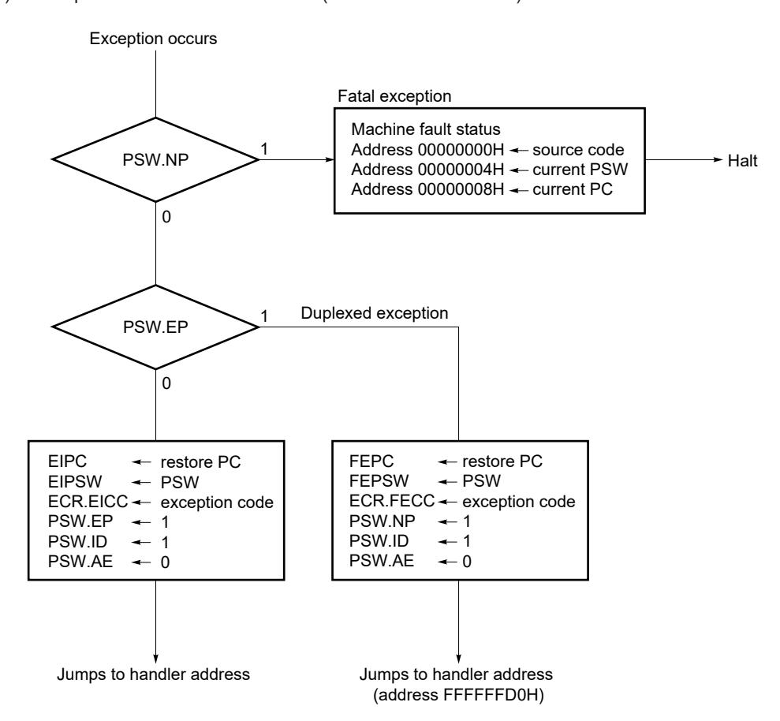

## **6.2 Interrupt Processing**

## **6.2.1 Maskable interrupt**

If a maskable interrupt is caused to occur by the INT input, the processor performs the processing described below, and transfers control to the handler routine. The EIPC and EIPSW are used to save the contents of the PC and PSW.

The maskable interrupt is masked by logical sum of the NP, EP, and ID of the PSW. Moreover, the interrupt is not accepted if the interrupt level n is lower than the interrupt enable level (I3-I0) of the PSW (n < I3-I0). Therefore, the interrupt of the highest level (n = 15) cannot be disabled by the interrupt enable level.

- (1) Saves the restore PC to the EIPC.
- (2) Saves the current PSW to the EIPSW.
- (3) Writes the exception code to the lower 16 bits of the ECR (EICC).
- (4) Sets the EP and ID bits of the PSW and clears the AE bit.
- (5) Sets a value resulting from adding 1 to the level n of the interrupt accepted (i.e., n+1) to the I (I3-I0) field of the PSW. However, sets 15 to the I field if the level of the accepted interrupt is the highest (n = 15).
- (6) Jumps to the handler address.

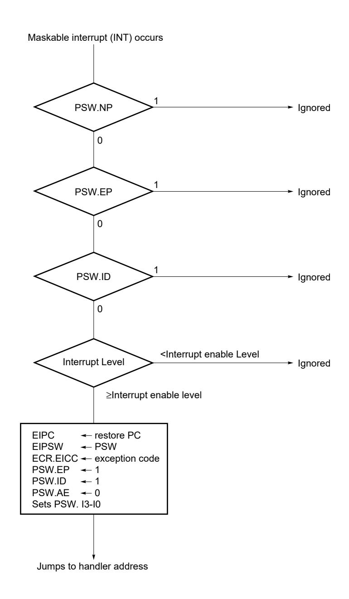

## **6.2.2 Non-maskable interrupt**

If the non-maskable interrupt is caused to occur by the NMI input, the processor performs the processing described below and transfers control to the handler routine. The FEPC and FEPSW are used to save the contents of the PC and PSW. If another non-maskable interrupt request occurs while a non-maskable interrupt is processed (the NP bit of the PSW is 1), the interrupt request is internally held by the processor (a non-maskable interrupt request that occurs during a period in which the latch is cleared by the internal processing immediately after the start of processing the first non-maskable interrupt is not held to the internal latch of the processor). At this time, if the NP bit of the PSW is cleared to 0 by using the RETI and LDSR instructions, new non-maskable interrupt processing is started by the non-maskable interrupt request internally held by the processor.

- (1) Saves the restore PC to the FEPC.
- (2) Saves the current PSW to the FEPSW.
- (3) Writes the exception code to the higher 16 bits of the ECR (FECC).
- (4) Sets the NP and ID bits of the PSW and clears the AE bit.
- (5) Jumps to address FFFFFFD0H (NMI handler address).

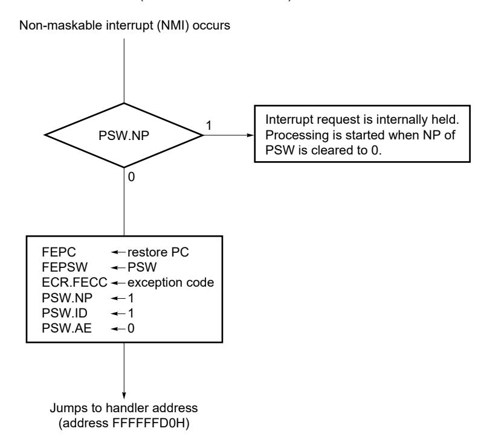

## **6.3 Returning from Exception/Interrupt**

To return execution from an exception event other than the fatal exception, the RETI instruction is used.

- (1) If NP of PSW = 1, the restore PC and PSW are restored from the FEPC and FEPSW; if NP = 0, the PC and PSW are restored from the EIPC and EIPSW.
- (2) Restores the restore PC and PSW, and jumps to the PC.

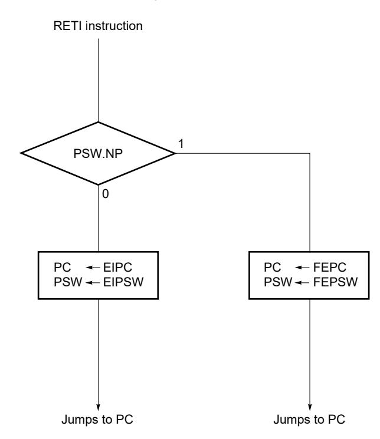

## **6.4 Priority**

## **6.4.1 Priorities of interrupts and exceptions**

The following table shows the priorities of the interrupts and exceptions. If two or more interrupts or exceptions occur simultaneously, they are processed according to their priorities.

**Table 6-3 Priorities of Interrupts and Exceptions**

|       | RESET NMI INT | AD-TR TRAP | I-OPC DIV0 | FLOAT |
| ----- | ------------- | ---------- | ---------- | ----- |
| RESET | * *           | * *        | * *        | *     |
| NMI   | ✕ <-          | <- <-      | <- <-      | <-    |
| INT   | ✕             | <- <-      | <- <-      | <-    |
| AD-TR | ✕             | <-         | <- <-      | <-    |
| TRAP  | ✕             |            | – –        | –     |
| I-OPC | ✕             | –          | –          | –     |
| DIV0  | ✕             | –          | –          | –     |
| FLOAT | ✕             | –          | – –        |       |

RESET : Reset

NMI : Non-maskable interrupt

INT : Maskable interrupt

AD-TR : Address trap

TRAP : Trap instruction

I-OPC : Illegal op code

DIV0 : Zero division

FLOAT : Floating-point exceptions (invalid operation, zero division, overflow, and reserved operand exceptions)

\* : Item shown on the left ignores the item above.

✕ : Item shown on the left is ignored by the item above.

– : Item shown on the left does not occur simultaneously with the item above.

<- : Item shown on the left has a higher priority than the item above.

↑ : Item shown above has a higher priority than the item shown on the left.

## **6.4.2 Priorities of floating-point exceptions**

Table 6-4 shows the priorities of the floating-point exceptions.

**Table 6-4 Priorities of Floating-Point Exceptions**

|     | FRO FIV | FZD FOV | FUD FPR |
| --- | ------- | ------- | ------- |
| FRO | *       | * *     | – –     |
| FTV | ✕       | * *     | – –     |
| FZD | ✕ ✕     | *       | – –     |
| FOV | ✕ ✕     | ✕       | – –     |
| FUD | – –     | – –     | –       |
| FPR | – –     | – –     | –       |

FRO : Floating-point reserved operand

FIV : Floating-point invalid operation

FZD : Floating-point zero division

FOV : Floating-point overflow

FUD : Floating-point underflow

FPR : Floating-point precision degradation

\* : Item shown on the left ignores the item above.

✕ : Item shown on the left is ignored by the item above.

– : Item shown on the left does not occur simultaneously with the item above.

**Remark** The FUD and FPR do not occur on V810 family.

### **6.4.3 Interrupt execution timing**

An interrupt is accepted when an instruction is executed. However, if the instruction takes 2 or more clocks to be executed, the interrupt is accepted during the period of the last 1 clock of the instruction. Therefore, if an interrupt request is issued while no instruction is executed (in wait or bus hold status), the interrupt is accepted when the next instruction is executed.

## **CHAPTER 7 CACHE DUMP/RESTORE FUNCTIONS**

These functions serve to inspect the contents of the internal instruction cache memory of the V810 family.

## **(1) Cache configuration**

Fig. 7-1 shows the configuration of the internal instruction cache of the V810 family.

**Fig. 7-1 Cache Configuration**

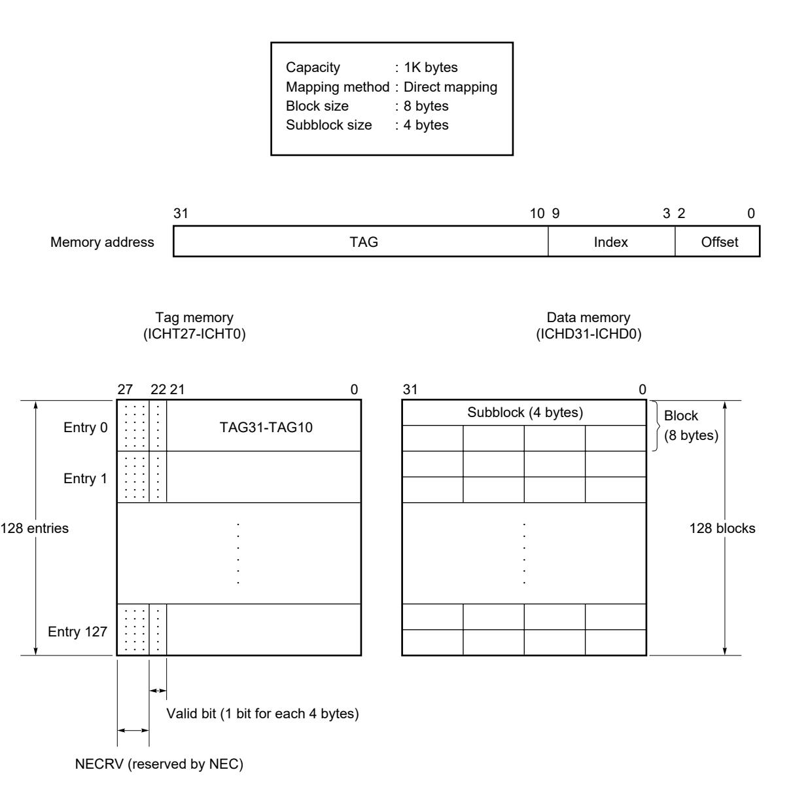

## **(2) Inspection method**

Control the cache control word in the following procedure by using the LDSR instruction:

<1> Prepare data to be restored to the cache. <2> Clear the ICE bit to "0" to disable the cache. <3> Set the first address of the restore data in the SA field, and at the same time, set the ICR bit to "1" to start executing restoring. <4> Set the first address of the dump area in the SA field, and at the same time, set the ICD bit to "1" to start dump execution. <5> Inspect the contents of the cache dumped to the dump area. <6> Set the start entry number that clears the cache and the number of entries to be cleared in the CEN and CEC fields, and at the same time, set the ICC bit to "1" to start execution of clearing (all the entries must be eventually cleared). <7> Set the ICE bit to "1" to enable the cache.

While the cache is dumped, restored, or cleared, interrupts are disabled. An interrupt request generated during this period is internally held until the processing ends. Therefore, start of the interrupt processing is delayed (a maskable interrupt is ignored unless all the NP, EP, and ID flags of the PSW are "0").

The interrupt disable period can be shortened by processing each entry by using the CEN and CEC fields. However, all the entries must be eventually cleared.

**Fig. 7-2 Cache Dump Format**

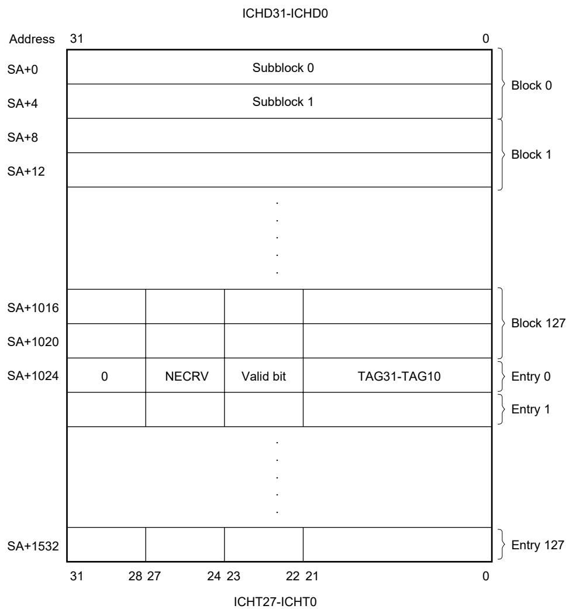

Address SA+0 SA+4 SA+8 SA+12 SA+1016 SA+1020 SA+1024 SA+1532

**[MEMO]**

## **CHAPTER 8 DEBUG SUPPORT FUNCTION**

The address trap function is made valid by setting an address (TA: Trap Address) at which a trap is to occur to the address trap register (ADTRE), and setting the AE bit of the PSW.

When the program is executed with the address trap function enabled, and if the current contents of the PC (= first address of an instruction) coincide with the trap address (TA), the V810 family performs exception processing and transfers control to an address trap handler routine (address FFFFFFC0H).

**[MEMO]**

## **CHAPTER 9 RESET**

When the RESET pin goes low, the system reset is triggered, and each on-chip hardware is initialized.

## **9.1 Initialization**

When the RESET pin goes low, the system reset is triggered, and each hardware register is initialized as shown in Table 9-1. When the RESET goes high, the device is released from the reset state and the program execution is started. Initialize the contents of each register as required in the program.

**Table 9-1 Register Status after Reset**

| Hardware Names and Symbols       |        | Status after Reset |
| -------------------------------- | ------ | ------------------ |
| Program counter                  | PC     | FFFFFFF0H          |
| Interrupt status saving register | EIPC   | Undefined          |
| NMI status saving register       | FEPC   | Undefined          |
| Interrupt source register (ECR)  | FECC   | 0000H              |
|                                  | EICC   | FFF0H              |
| Program status word              | PSW    | 00008000H          |
| General-purpose register         | r0     | 00000000H fixed    |
|                                  | r1-r31 | Undefined          |

## **9.2 Starting Up**

The V810 family starts the execution of the program from FFFFFFF0H when reset. Immediately after reset, the interrupt request is not acknowledged. To use interrupt for the program, set the NP bit of the program status word (PSW) to 0.

**[MEMO]**

## **APPENDIX A INSTRUCTION MNEMONIC (alphabetical order)**

This appendix lists the mnemonics of the instructions explained in this manual. In the table shown on the following pages, the instruction mnemonics are listed in alphabetical order, so that brief explanations for necessary instructions can be found in the same way as consulting a dictionary.

|     | Instruction mnemonic | Operand | Format | CY OV S Z | Instruction function |
| --- | -------------------- | ------- | ------ | --------- | -------------------- |
|     |                      |         |        |           |                      |

### **Legend**

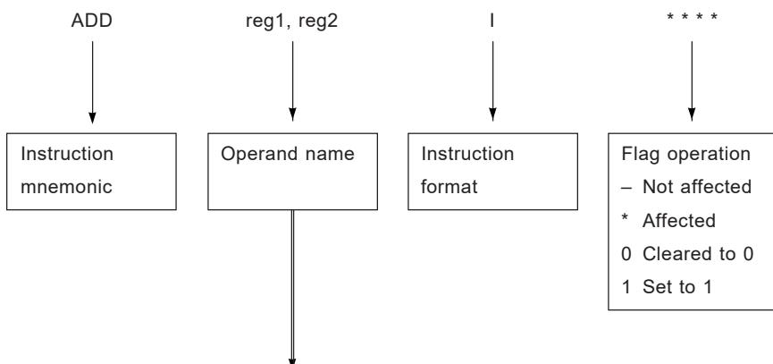

| Name       | Meaning                                                                                          |
| ---------- | ------------------------------------------------------------------------------------------------ |
| reg1       | General-purpose register (used as source register)                                               |
| reg2       | General-purpose register (mainly used as destination register. Some registers are used as source |
| imm5       | 5-bit immediate                                                                                  |
| imm16      | 16-bit immediate                                                                                 |
| disp9      | 9-bit displacement                                                                               |
| disp16     | 16-bit displacement                                                                              |
| disp26     | 26-bit displacement                                                                              |
| reqID      | System register number                                                                           |
| vector adr | Trap handler address corresponding to trap vector                                                |

**Table A-1 Instruction Mnemonics (alphabetical order) (1/7)**

| Instruction |                   |        |           |     |     |                                                                                      |      |
| ----------- | ----------------- | ------ | --------- | --- | --- | ------------------------------------------------------------------------------------ | ---- |
| mnemonic    | Operand           | Format | CY OV S Z |     |     | Instruction function                                                                 | Page |
| ADD         | reg1, reg2        | I      | *         | *   | *   | * Addition. Adds word data of reg1 to word data of                                   | 41   |
| ADD         | imm5, reg2        | II     | *         | *   | *   | * Addition. Adds value sign-extended from 5-bit                                      | 41   |
| ADDF.S      | reg1, reg2        | VII    | *         | 0   | *   | * Floating-point addition. Adds single-precision                                     | 42   |
| ADDI        | imm16, reg1, reg2 | V      | *         | *   | *   | * Addition. Adds value sign-extended from 16-bit                                     | 44   |
| AND         | reg1, reg2        | I      | –         | 0   | *   | * AND. ANDs word data of reg2 and reg1, and stores result to reg2.                   | 45   |
| ANDBSU      | –                 | II     | –         | –   | –   | – Transfer with AND of bit string. ANDs source bit result to destination bit string. | 46   |
| ANDI        | imm16, reg1, reg2 | V      | –         | 0   | 0   | * AND. ANDs word data of reg1 with value zero-                                       | 47   |
| ANDNBSU     | –                 | II     | –         | –   | –   | – Transfer with AND NOT of bit string. ANDs NOTed                                    | 48   |
| BC          | disp9             | III    | –         | –   | –   | – Conditional branch (if Carry). PC relative branch                                  | 50   |
| BE          | disp9             | III    | –         | –   | –   | – Conditional branch (if Equal). PC relative branch                                  | 50   |
| BGE         | disp9             | III    | –         | –   | –   | – Conditional branch (if Greater than or Equal). PC relative branch                  | 50   |
| BGT         | disp9             | III    | –         | –   | –   | – Conditional branch (if Greater than). PC relative branch                           | 50   |
| BH          | disp9             | III    | –         | –   | –   | – Conditional branch (if Higher). PC relative branch                                 | 50   |
| BL          | disp9             | III    | –         | –   | –   | – Conditional branch (if Lower). PC relative branch                                  | 50   |
| BLE         | disp9             | III    | –         | –   | –   | – Conditional branch (if Less than or Equal). PC relative branch                     | 50   |
| BLT         | disp9             | III    | –         | –   | –   | – Conditional branch (if Less than). PC relative branch                              | 50   |
| BN          | disp9             | III    | –         | –   | –   | – Conditional branch (if Negative). PC relative branch                               | 50   |
| BNC         | disp9             | III    | –         | –   | –   | – Conditional branch (if Not Carry). PC relative branch                              | 50   |
| BNE         | disp9             | III    | –         | –   | –   | – Conditional branch (if Not Equal). PC relative branch                              | 50   |
| BNH         | disp9             | III    | –         | –   | –   | – Conditional branch (if Not Higher). PC relative branch                             | 50   |
| BNL         | disp9             | III    | –         | –   | –   | – Conditional branch (if Not Lower). PC relative branch                              | 50   |
| BNV         | disp9             | III    | –         | –   | –   | – Conditional branch (if Not Overflow). PC relative branch                           | 50   |
| BNZ         | disp9             | III    | –         | –   | –   | – Conditional branch (if Not Zero). PC relative branch                               | 50   |
| BP          | disp9             | III    | –         | –   | –   | – Conditional branch (if Positive). PC relative branch                               | 50   |

**Table A-1 Instruction Mnemonics (alphabetical order) (2/7)**

| Instruction |                     |        |           |     |                                                                                   |      |
| ----------- | ------------------- | ------ | --------- | --- | --------------------------------------------------------------------------------- | ---- |
| mnemonic    | Operand             | Format | CY OV S Z |     | Instruction function                                                              | Page |
| BR          | disp9               | III    | – –       | – – | Unconditional branch. PC relative branch                                          | 50   |
| BV          | disp9               | III    | – –       | – – | Conditional branch (if Overflow). PC relative branch                              | 50   |
| BZ          | disp9               | III    | – –       | – – | Conditional branch (if Zero). PC relative branch                                  | 50   |
| CAXI        | disp16 [reg1], reg2 | VI     | * *       | * * | Inter-processor synchronization instruction for multi-processor system            | 51   |
| CMP         | reg1, reg2          | I      | * *       | * * | Compare. Compares word data of reg2 with word reg1 from word data of reg2.        | 53   |
| CMP         | imm5, reg2          | II     | * *       | * * | Compare. Compares word data of reg2 with value reg2.                              | 53   |
| CMPF.S      | reg1, reg2          | VII    | * 0       | * * | Floating-point compare. Compares single-precision                                 | 54   |
| CVT.SW      | reg1, reg2          | VII    | – 0       | * * | Type conversion of floating-point data to integer. to reg2.                       | 55   |
| CVT.WS      | reg1, reg2          | VII    | * 0       | * * | Type conversion of integer to floating-point data. stores result to reg2.         | 57   |
| DIV         | reg1, reg2          | I      | – *       | * * | Signed divide. Divides word data of reg2 by word                                  | 58   |
| DIVF.S      | reg1, reg2          | VII    | * 0       | * * | Floating-point divide. Divides single-precision flags, and stores result to reg2. | 59   |
| DIVU        | reg1, reg2          | I      | – 0       | * * | Unsigned divide. Divides word data of reg2 by                                     | 61   |
| HALT        | –                   | II     | – –       | – – | Processor halt.                                                                   | 62   |
| IN.B        | disp16 [reg1], reg2 | VI     | – –       | – – | Port input. Adds data of reg1 and data sign- word data, and stored to reg2.       | 63   |

| Instruction |                     |        |           |     |                                                                                                    |      |
| ----------- | ------------------- | ------ | --------- | --- | -------------------------------------------------------------------------------------------------- | ---- |
| IN.H        | disp16 [reg1], reg2 | VI     | –         | – – | – Port input. Adds data of reg1 and data sign-                                                     | 63   |
| IN.W        | disp16 [reg1], reg2 | VI     | –         | – – | – Port input. Adds data of reg1 and data sign-                                                     | 63   |
| JAL         | disp26              | IV     | –         | – – | – Jump and link. Saves value resulting from adding                                                 | 64   |
| JMP         | [reg1]              | I      | –         | – – | – Register indirect unconditional branch. Transfers                                                | 65   |
| JR          | disp26              | IV     | –         | – – | – Unconditional branch. Adds current PC to value                                                   | 66   |
| LD.B        | disp16 [reg1], reg2 | VI     | –         | – – | – Byte load. Adds data of reg1 and data sign-                                                      | 67   |
| LD.H        | disp16 [reg1], reg2 | VI     | –         | – – | – Halfword load. Adds data of reg1 and data sign-                                                  | 67   |
| LD.W        | disp16 [reg1], reg2 | VI     | –         | – – | – Word load. Adds data of reg1 and data sign-                                                      | 67   |
| LDSR        | reg2, regID         | II     | *         | * * | * Load to system register. Sets word data of reg2 to                                               | 68   |
| mnemonic    | Operand             | Format | CY OV S Z |     | Instruction function masked with 0. address is masked with 0. length, and stored to reg2. (regID). | Page |

**Table A-1 Instruction Mnemonics (alphabetical order) (3/7)**

| Instruction |                   |        |           |     |                                                                                                                                                                                                                                                                                                     |      |
| ----------- | ----------------- | ------ | --------- | --- | --------------------------------------------------------------------------------------------------------------------------------------------------------------------------------------------------------------------------------------------------------------------------------------------------- | ---- |
| MOV         | reg1, reg2        | I      | – –       | – – | Data transfer. Copies and transfers word data of                                                                                                                                                                                                                                                    | 69   |
| MOV         | imm5, reg2        | II     | – –       | – – | Data transfer. Copies and transfers value sign-                                                                                                                                                                                                                                                     | 69   |
| MOVBSU      | –                 | II     | – –       | – – | Bit string transfer. Transfers source bit string to                                                                                                                                                                                                                                                 | 70   |
| MOVEA       | imm16, reg1, reg2 | V      | – –       | – – | Add. Adds word data of reg1 and value sign-                                                                                                                                                                                                                                                         | 71   |
| MOVHI       | imm16, reg1, reg2 | V      | – –       | – – | Add. Adds word data of reg1 to word data                                                                                                                                                                                                                                                            | 72   |
| MUL         | reg1, reg2        | I      | – *       | * * | Signed multiply. Multiplies word data of reg2 by                                                                                                                                                                                                                                                    | 73   |
| MULF.S      | reg1, reg2        | VII    | * 0       | * * | Floating-point multiply. Multiplies single-precision                                                                                                                                                                                                                                                | 74   |
| MULU        | reg1, reg2        | I      | – *       | * * | Unsigned multiply. Multiplies word data of reg2                                                                                                                                                                                                                                                     | 76   |
| NOP         | –                 | III    | – –       | – – | No operation.                                                                                                                                                                                                                                                                                       | 89   |
| NOT         | reg1, reg2        | I      | – 0       | * * | NOT. NOTs word data of reg1 (1's complement)                                                                                                                                                                                                                                                        | 77   |
| NOTBSU      | –                 | II     | – –       | – – | Transfer with NOT of bit string. NOTs source bit                                                                                                                                                                                                                                                    | 78   |
| OR          | reg1, reg2        | I      | – 0       | * * | OR. ORs word data of reg2 with word data of reg1                                                                                                                                                                                                                                                    | 79   |
| ORBSU       | –                 | II     | – –       | – – | Transfer with OR of bit string. ORs source bit string                                                                                                                                                                                                                                               | 80   |
| ORI         | imm16, reg1, reg2 | V      | – 0       | * * | OR. ORs word data of reg1 with value zero-extended                                                                                                                                                                                                                                                  | 81   |
| ORNBSU      | –                 | II     | – –       | – – | Transfer with NOT OR of bit string. ORs NOTed                                                                                                                                                                                                                                                       | 82   |
| mnemonic    | Operand           | Format | CY OV S Z |     | Instruction function reg1 to reg2. to reg2. destination string. length, and stores result to reg2. bits to reg2. and stores result to reg2. and lower 32 bits to reg2. and stores result to reg2. destination bit string. and stores result to reg2. destination bit string. stores result to reg2. | Page |

**Table A-1 Instruction Mnemonics (alphabetical order) (4/7)**

| Instruction |                     |        |           |     |     |                                                                                                            |      |
| ----------- | ------------------- | ------ | --------- | --- | --- | ---------------------------------------------------------------------------------------------------------- | ---- |
| OUT.B       | reg2, disp16 [reg1] | VI     | –         | –   | – – | Port output. Adds data of reg1 and data sign-                                                              | 83   |
| OUT.H       | reg2, disp16 [reg1] | VI     | –         | –   | – – | Port output. Adds data of reg1 and data sign-                                                              | 83   |
| OUT.W       | reg2, disp16 [reg1] | VI     | –         | –   | – – | Port output. Adds data of reg1 and data sign-                                                              | 83   |
| RETI        | –                   | II     | *         | *   | * * | Return from trap or interrupt routine. Restores                                                            | 84   |
| SAR         | reg1, reg2          | I      | *         | 0   | * * | Arithmetic left shift. Arithmetically shifts to left                                                       | 85   |
| SAR         | imm5, reg2          | II     | *         | 0   | * * | Arithmetic right shift. Arithmetically shifts to right                                                     | 85   |
| SCH0BSU     | –                   | II     | –         | –   | – * | Bit string 0 search. Searches surce bit string, stores                                                     | 86   |
| SCH0BSD     | –                   | II     | –         | –   | – * | bit address 1 bit before 0 first found to r30 and r27,                                                     | 86   |
| SCH1BSU     | –                   | II     | –         | –   | – – | Bit string 1 search. Searches source bit string, stores                                                    | 88   |
| SCH1BSD     | –                   | II     | –         | –   | – – | bit address 1 bit before 1 first found to r30 and r27,                                                     | 88   |
| SETF        | imm5, reg2          | I      | –         | –   | – – | Set flag condition. Stores 1 to reg2 if condition                                                          | 90   |
| SHL         | reg1, reg2          | I      | *         | 0   | * * | Logical left shift. Logically shifts to left word data                                                     | 92   |
| mnemonic    | Operand             | Format | CY OV S Z |     |     | Instruction function port address. address is masked with 0. of skipped bit to r28. of skipped bit to r28. | Page |

**Table A-1 Instruction Mnemonics (alphabetical order) (5/7)**

**Table A-1 Instruction Mnemonics (alphabetical order) (6/7)**

| Instruction |                     |        |           |     |     |                                                                                  |      |
| ----------- | ------------------- | ------ | --------- | --- | --- | -------------------------------------------------------------------------------- | ---- |
| mnemonic    | Operand             | Format | CY OV S Z |     |     | Instruction function                                                             | Page |
| SHL         | imm5, reg2          | II     | *         | 0   | * * | Logical left shift. Logically shifts to left word data of writes result to reg2. | 92   |
| SHR         | reg2, reg2          | I      | *         | 0   | * * | Logical right shift. Logically shifts to right word data                         | 93   |
| SHR         | imm5, eg2           | II     | *         | 0   | * * | Logical right shift. Logically shifts to right word data writes result to reg2.  | 93   |
| ST.B        | reg2, disp16 [reg1] | VI     | –         | –   | – – | Byte store. Adds data of reg1 and data sign-                                     | 94   |
| ST.H        | reg2, disp16 [reg1] | VI     | –         | –   | – – | Halfword store. Adds data of reg1 and data sign-                                 | 94   |
| ST.W        | reg2, disp16[reg1]  | VI     | –         | –   | – – | Word store. Adds data of reg1 and data sign-                                     | 94   |
| STSR        | regID, reg2         | II     | –         | –   | – – | Store contents of system register. Sets contents of (regID) to reg2.             | 95   |
| SUB         | reg1, reg2          | I      | *         | *   | * * | Subtract. Subtracts word data of reg1 from word                                  | 96   |
| SUBF.S      | reg1, reg2          | VII    | *         | 0   | * * | Subtract. Subtracts single-precision floating-point reg2.                        | 97   |
| TRAP        | vector              | II     | –         | –   | – – | Software trap. Saves restore PC and PSW into                                     | 99   |

**Table A-1 Instruction Mnemonics (alphabetical order) (7/7)**

| Instruction |                   |        |           |     |     |                                                                     |      |
| ----------- | ----------------- | ------ | --------- | --- | --- | ------------------------------------------------------------------- | ---- |
| mnemonic    | Operand           | Format | CY OV S Z |     |     | Instruction function                                                | Page |
| TRNC.SW     | reg1, reg2        | VII    | –         | 0   | * * | Convert floating-point data to integer. Converts                    | 101  |
| XOR         | reg1, reg2        | I      | –         | 0   | * * | Exclusive OX. Exclusive-ORs word data of reg2                       | 103  |
| XORBSU      | –                 | II     | –         | –   | – – | Transfer with exclusive-OR of bit string. Exclusive-                | 104  |
| XORI        | imm16, reg1, reg2 | V      | –         | 0   | * * | Exclusive OR. Exclusive-ORs word data of reg1 with                  | 105  |
| XORNBSU     | –                 | II     | –         | –   | – – | Transfer of NOT exclusive OR of bit string. destination bit string. | 106  |

## **APPENDIX B INSTRUCTION LIST**

**Table B-1 Mnemonic List**

| LD.B    | Load Byte              |         |                                         |
| ------- | ---------------------- | ------- | --------------------------------------- |
| LD.H    | Load Halfword          |         |                                         |
| LD.W    | Load Word              |         |                                         |
| ST.B    | Store Byte             |         |                                         |
| ST.H    | Store Halfword         |         |                                         |
| ST.W    | Store Word             |         |                                         |
| MOV     | Move                   |         |                                         |
| SUB     | Subtract               |         |                                         |
| ADD     | Add                    |         |                                         |
| CMP     | Compare                |         |                                         |
| OR      | OR                     |         |                                         |
| AND     | AND                    |         |                                         |
| XOR     | Exclusive-OR           |         |                                         |
| NOT     | NOT                    |         |                                         |
| SHL     | Shift Logical Left     |         |                                         |
| SHR     | Shift Logical Right    |         |                                         |
| SAR     | Shift Arithmetic Right |         |                                         |
| MUL     | Multiply               |         |                                         |
| DIV     | Divide                 |         |                                         |
| MULU    | Multiply Unsigned      |         |                                         |
| DIVU    | Divide Unsigned        |         |                                         |
| MOV     | Move                   |         |                                         |
| ADD     | Add                    |         |                                         |
| CMP     | Compare                |         |                                         |
| SHL     | Shift Logical Left     |         |                                         |
| SHR     | Shift Logical Right    |         |                                         |
| SAR     | Shift Arithmetic Right |         |                                         |
| SETF    | Set Flag Condition     |         |                                         |
| ADDI    | Add                    |         |                                         |
| MOVEA   | Add                    |         |                                         |
| ORI     | OR                     |         |                                         |
| ANDI    | AND                    |         |                                         |
| XORI    | Exclusive-OR           |         |                                         |
| MOVHI   | Add                    |         |                                         |
| IN.B    | Input Byte             |         |                                         |
| IN.H    | Input Halfword         |         |                                         |
| IN.W    | Input Word             |         |                                         |
| OUT.B   | Output Byte            |         |                                         |
| OUT.H   | Output Halfword        |         |                                         |
| OUT.W   | Output Word            |         |                                         |
|         |                        | JMP     | Jump                                    |
|         |                        | JR      | Jump Relative                           |
|         |                        | JAL     | Jump end Link                           |
|         |                        | BGT     | Branch on Greater than signed           |
|         |                        | BGE     | Branch on Greater than or Equal signed  |
|         |                        | BLT     | Branch on Less than signed              |
|         |                        | BLE     | Branch on Less than or Equal signed     |
|         |                        | BH      | Branch on Higher                        |
|         |                        | BNH     | Branch on Not Higher                    |
|         |                        | BL      | Branch on Lower                         |
|         |                        | BNL     | Branch on Not Lower                     |
|         |                        | BE      | Branch on Equal                         |
|         |                        | BNE     | Branch on Not Equal                     |
|         |                        | BV      | Branch on Overflow                      |
|         |                        | BNV     | Branch on No Overflow                   |
|         |                        | BN      | Branch on Negative                      |
|         |                        | BP      | Branch on Positive                      |
|         |                        | BC      | Branch on Carry                         |
|         |                        | BNC     | Branch on No Carry                      |
|         |                        | BZ      | Branch on Zero                          |
|         |                        | BNZ     | Branch on Not Zero                      |
|         |                        | BR      | Branch Always                           |
|         |                        | NOP     | No Branch (No Operation)                |
|         |                        | SCH0BSU | Search Bit 0 Upward                     |
|         |                        | SCH0BSD | Search Bit 0 Downward                   |
|         |                        | SCH1BSU | Search Bit 1 Upward                     |
|         |                        | SCH1BSD | Search Bit 1 Downward                   |
|         |                        | MOVBSU  | Move Bit String Upward                  |
|         |                        | NOTBSU  | Not Bit String Upward                   |
|         |                        | ANDBSU  | AND Bit String Upward                   |
|         |                        | ANDNBSU | AND Not Bit String Upward               |
|         |                        | ORBSU   | OR Bit String Upward                    |
|         |                        | ORNBSU  | OR Not Bit String Upward                |
|         |                        | XORBSU  | Exclusive-OR Bit String Upward          |
|         |                        | XORNBSU | Exclusive-OR Not Bit String Upward      |
|         |                        | CMPF.S  | Compare Floating Short                  |
|         |                        | CVT.WS  | Convert Word Integer to Short Floating  |
|         |                        | CVT.SW  | Convert Short Floating to Word Integer  |
|         |                        | ADDF.S  | Add Floating Short                      |
|         |                        | SUBF.S  | Subtract Floating Short                 |
|         |                        | MULF.S  | Multiply Floating Short                 |
|         |                        | DIVF.S  | Divide Floating Short                   |
|         |                        | TRNC.SW | Truncate Short Floating to Word Integer |
|         |                        | LDSR    | Load System Register                    |
|         |                        | STSR    | Store System Register                   |
|         |                        | TRAP    | Trap                                    |
|         |                        | RETI    | Return from Trap or Interrupt           |
|         |                        | CAXI    | Compare and Exchange Interlocked        |
|         |                        | HALT    | Halt                                    |
| Op Code | Function               | Op Code | Function                                |

**Table B-2 Instruction Set**

| Op code     |             | Instruction format  | Format |
| ----------- | ----------- | ------------------- | ------ |
| 000000      | MOV         | reg1, reg2          | I      |
| 000001      | ADD         | reg1, reg2          | I      |
| 000010      | SUB         | reg1, reg2          | I      |
| 000011      | CMP         | reg1, reg2          | I      |
| 000100      | SHL         | reg1, reg2          | I      |
| 000101      | SHR         | reg1, reg2          | I      |
| 000110      | JMP         | [reg1]              | I      |
| 000111      | SAR         | reg1, reg2          | I      |
| 001000      | MUL         | reg1, reg2          | I      |
| 001001      | DIV         | reg1, reg2          | I      |
| 001010      | MULU        | reg1, reg2          | I      |
| 001011      | DIVU        | reg1, reg2          | I      |
| 001100      | OR          | reg1, reg2          | I      |
| 001101      | AND         | reg1, reg2          | I      |
| 001111      | NOT         | reg1, reg2          | I      |
| 010000      | MOV         | imm5, reg2          | II     |
| 010001      | ADD         | imm5, reg2          | II     |
| 010010      | SETF        | imm5, reg2          | II     |
| 010011      | CMP         | imm5, reg2          | II     |
| 010100      | SHL         | imm5, reg2          | II     |
| 010101      | SHR         | imm5, reg2          | II     |
| 010110      | –           |                     |        |
| 010111      | SAR         | imm5, reg2          | II     |
| 011000      | TRAP        | vector              | II     |
| 011001      | RETI        |                     | II     |
| 011010      | HALT        |                     | II     |
| 011011      | –           |                     |        |
| 011100      | LDSR        | reg2, regID         | II     |
| 011101      | STSR        | regID, reg2         | II     |
| 011110      | –           |                     |        |
| 011111      | Bstr        |                     | II     |
| 100\$\$\$\$ | Bcond disp9 |                     | III    |
| 101000      | MOVEA       | imm16, reg1, reg2   | V      |
| 101001      | ADDI        | imm16, reg1, reg2   | V      |
| 101010      | JR          | disp26              | IV     |
| 101011      | JAL         | disp26              | IV     |
| 101100      | ORI         | imm16, reg1, reg2   | V      |
| 101101      | ANDI        | imm16, reg1, reg2   | V      |
| 101110      | XORI        | imm16, reg1, reg2   | V      |
| 101111      | MOVHI       | imm16, reg1, reg2   | V      |
| 110000      | LD.B        | disp16 [reg1], reg2 | VI     |
| 110001      | LD.H        | disp16 [reg1], reg2 | VI     |
| 110010      | –           |                     |        |
| 110011      | LD.W        | disp16 [reg1], reg2 | VI     |
| 110100      | ST.B        | reg2, disp16 [reg1] | VI     |
| 110101      | ST.H        | reg2, disp16 [reg1] | VI     |
| 110110      | –           |                     |        |
| 110111      | ST.W        | reg2, disp16 [reg1] | VI     |
| 111000      | IN.B        | dips16 [reg1], reg2 | VI     |
| 111001      | IN.H        | disp16 [reg1], reg2 | VI     |
| 111010      | CAXI        | dipa16 [reg1], reg2 | VI     |
| 111011      | IN.W        | disp16 [reg1], reg2 | VI     |
| 111100      | OUT.B       | reg2, disp16 [reg1] | VI     |
| 111101      | OUT.H       | reg2, disp16 [reg1] | VI     |
| 111110      | Fpp         | reg1, reg2          | VII    |
| 111111      | OUT,W       | reg2, disp16 [reg1] | VI     |

## **APPENDIX C OP CODE MAP**

## **(a) Op code**

bit 12..10

| bit 15..13 | 0     | 1    | 2    | 3     | 4     | 5     | 6    | 7     | Format |
| ---------- | ----- | ---- | ---- | ----- | ----- | ----- | ---- | ----- | ------ |
| 0          | MOV   | ADD  | SUB  | CMP   | SHL   | SHR   | JMP  | SAR   | I      |
| 1          | MUL   | DIV  | MULU | DIVU  | OR    | AND   | XOR  | NOT   |        |
| 2          | MOV   | ADD  | SETF | CMP   | SHL   | SHR   |      | SAR   | II     |
| 3          | TRAP  | RETI | HALT |       | LDSR  | STSR  |      | Bstr  |        |
| 4          |       |      |      | Bcond |       |       |      |       | III    |
| 5          | MOVEA | ADDI | JR   | JAL   | ORI   | ANDI  | XORI | MOVHI | IV/V   |
| 6          | LD.B  | LD.H |      | LD.W  | ST.B  | ST.H  |      | ST.W  | VI     |
| 7          | IN.B  | IN.H | CAXI | IN.W  | OUT.B | OUT.H | Fpp  | OUT.W | VI/VII |

## **(b) Branch instruction (condition code)**

bit 11..9

| bit 12 | 0   | 1       | 2       | 3   | 4   | 5   | 6   | 7   |
| ------ | --- | ------- | ------- | --- | --- | --- | --- | --- |
| 0      | BV  | BC/BL   | BZ/BE   | BNH | BN  | BR  | BLT | BLE |
| 1      | BNV | BNC/BNL | BNZ/BNE | BH  | BP  | NOP | BGE | BGT |

## **(c) Bit string manipulation instruction (sub-op code)**

bit 2..0

| bit 4..3 | 0       | 1       | 2       | 3       | 4      | 5       | 6       | 7      |
| -------- | ------- | ------- | ------- | ------- | ------ | ------- | ------- | ------ |
| 0        | SCH0BSU | SCH0BSD | SCH1BSU | SCH1BSD |        |         |         |        |
| 1        | ORBSU   | ANDBSU  | XORBSU  | MOVBSU  | ORNBSU | ANDNBSU | XORNBSU | NOTBSU |

## **(d) Floating-point operation instruction (sub-op code)**

bit 28..26

bit 31..29 01234567

| 0   | CMPF.S |     | CVT.WS | CVT.SW  | ADDF.S | SUBF.S | MULF.S | DIVF.S |
| --- | ------ | --- | ------ | ------- | ------ | ------ | ------ | ------ |
| 1   |        |     |        | TRNC.SW |        |        |        |        |
| 2   |        |     |        |         |        |        |        |        |
| 3   |        |     |        |         |        |        |        |        |
| 4   |        |     |        |         |        |        |        |        |
| 5   |        |     |        |         |        |        |        |        |
| 6   |        |     |        |         |        |        |        |        |
| 7   |        |     |        |         |        |        |        |        |