**µPD70731**

**µPD70732**

# **V805TM, V810TM 32/16, 32-BIT MICROPROCESSOR**

**HARDWARE**

### **NOTES FOR CMOS DEVICES**

### **1 PRECAUTION AGAINST ESD FOR SEMICONDUCTORS**

Note:

Strong electric field, when exposed to a MOS device, can cause destruction of the gate oxide and ultimately degrade the device operation. Steps must be taken to stop generation of static electricity as much as possible, and quickly dissipate it once, when it has occurred. Environmental control must be adequate. When it is dry, humidifier should be used. It is recommended to avoid using insulators that easily build static electricity. Semiconductor devices must be stored and transported in an anti-static container, static shielding bag or conductive material. All test and measurement tools including work bench and floor should be grounded. The operator should be grounded using wrist strap. Semiconductor devices must not be touched with bare hands. Similar precautions need to be taken for PW boards with semiconductor devices on it.

### **2 HANDLING OF UNUSED INPUT PINS FOR CMOS**

Note:

No connection for CMOS device inputs can be cause of malfunction. If no connection is provided to the input pins, it is possible that an internal input level may be generated due to noise, etc., hence causing malfunction. CMOS devices behave differently than Bipolar or NMOS devices. Input levels of CMOS devices must be fixed high or low by using a pull-up or pull-down circuitry. Each unused pin should be connected to VDD or GND with a resistor, if it is considered to have a possibility of being an output pin. All handling related to the unused pins must be judged device by device and related specifications governing the devices.

### **3 STATUS BEFORE INITIALIZATION OF MOS DEVICES**

Note:

Power-on does not necessarily define initial status of MOS device. Production process of MOS does not define the initial operation status of the device. Immediately after the power source is turned ON, the devices with reset function have not yet been initialized. Hence, power-on does not guarantee out-pin levels, I/O settings or contents of registers. Device is not initialized until the reset signal is received. Reset operation must be executed immediately after power-on for devices having reset function.

### **The information in this document is subject to change without notice.**

No part of this document may be copied or reproduced in any form or by any means without the prior written consent of NEC Corporation. NEC Corporation assumes no responsibility for any errors which may appear in this document.

NEC Corporation does not assume any liability for infringement of patents, copyrights or other intellectual property rights of third parties by or arising from use of a device described herein or any other liability arising from use of such device. No license, either express, implied or otherwise, is granted under any patents, copyrights or other intellectual property rights of NEC Corporation or others.

While NEC Corporation has been making continuous effort to enhance the reliability of its semiconductor devices, the possibility of defects cannot be eliminated entirely. To minimize risks of damage or injury to persons or property arising from a defect in an NEC semiconductor device, customers must incorporate sufficient safety measures in its design, such as redundancy, fire-containment, and anti-failure features.

NEC devices are classified into the following three quality grades:

"Standard", "Special", and "Specific". The Specific quality grade applies only to devices developed based on a customer designated "quality assurance program" for a specific application. The recommended applications of a device depend on its quality grade, as indicated below. Customers must check the quality grade of each device before using it in a particular application.

Standard: Computers, office equipment, communications equipment, test and measurement equipment, audio and visual equipment, home electronic appliances, machine tools, personal electronic equipment and industrial robots

Special: Transportation equipment (automobiles, trains, ships, etc.), traffic control systems, anti-disaster systems, anti-crime systems, safety equipment and medical equipment (not specifically designed for life support)

Specific: Aircrafts, aerospace equipment, submersible repeaters, nuclear reactor control systems, life support systems or medical equipment for life support, etc.

The quality grade of NEC devices is "Standard" unless otherwise specified in NEC's Data Sheets or Data Books. If customers intend to use NEC devices for applications other than those specified for Standard quality grade, they should contact an NEC sales representative in advance.

Anti-radioactive design is not implemented in this product.

# **Major Revisions in This Edition**

| Page        |                          | Description                                        |
|-------------|--------------------------|----------------------------------------------------|
| p. 1        | 1.1 Features             | Addition of description of low voltage             |
| p. 2        | 1.2 Ordering Information | Addition of µ PD70732GC-25-9EV                     |
| p. 9        | 2.1 (2) V810             | Addition of 120-pin plastic TQFP                   |
| p. 20, 21   | Addition of              | 2.5 Pin I/O Circuits and Recommended Connection of |
| p. 73 to 75 | Addition of              | CHAPTER 5 RESET                                    |

The mark ★ shows major revised points.

### **NEC Electronics Inc. (U.S.)**

Mountain View, California

Tel: 800-366-9782

Fax: 800-729-9288

### **NEC Electronics (Germany) GmbH**

Duesseldorf, Germany

Tel: 0211-65 03 02

Fax: 0211-65 03 490

### **NEC Electronics (UK) Ltd.**

Milton Keynes, UK

Tel: 01908-691-133

Fax: 01908-670-290

### **NEC Electronics Italiana s.r.1.**

Milano, Italy

Tel: 02-66 75 41

Fax: 02-66 75 42 99

### **NEC Electronics Hong Kong Ltd.**

Hong Kong

Tel: 2886-9318

Fax: 2886-9022/9044

### **NEC Electronics Hong Kong Ltd.**

Seoul Branch

Seoul, Korea

Tel: 02-528-0303

Fax: 02-528-4411

### **NEC Electronics Singapore Pte. Ltd.**

United Square, Singapore 1130

Tel: 253-8311

Fax: 250-3583

### **NEC Electronics Taiwan Ltd.**

Taipei, Taiwan

Tel: 02-719-2377

Fax: 02-719-5951

### **NEC do Brasil S.A.**

Sao Paulo-SP, Brasil

Tel: 011-889-1680

Fax: 011-889-1689

# **Regional Information**

Some information contained in this document may vary from country to country. Before using any NEC product in your application, please contact the NEC office in your country to obtain a list of authorized representatives and distributors. They will verify:

- Device availability
- Ordering information
- Product release schedule
- Availability of related technical literature
- Development environment specifications (for example, specifications for third-party tools and components, host computers, power plugs, AC supply voltages, and so forth)
- Network requirements

In addition, trademarks, registered trademarks, export restrictions, and other legal issues may also vary from country to country.

### **NEC Electronics (Germany) GmbH**

Benelux Office

Eindhoven, The Netherlands

Tel: 040-2445845

Fax: 040-2444580

### **NEC Electronics (France) S.A.**

France

Tel: 01-30-67 58 00

Fax: 01-30-67 58 99

### **NEC Electronics (France) S.A.**

Spain Office

Madrid, Spain

Tel: 01-504-2787

Fax: 01-504-2860

### **NEC Electronics (Germany) GmbH**

Scandinavia Office

Taeby Sweden

Tel: 8-63 80 820

Fax: 8-63 80 388

### **INTRODUCTION**

**Readers** This manual is intended for users who understand the functions of the V805 (µPD70731) and V810 (µPD70732) and wish to design application systems using this microprocessor.

**Purpose** This manual introduces the hardware function of the V805 and V810 to users, following the organization described below.

**Organization** The User's Manuals of the V805 and V810 consist of 2 volumes– HARDWARE (this manual) and ARCHITECTURE (V810 FAMILY™ USER'S MANUAL ARCHITECTURE).

### **HARDWARE ARCHITECTURE**

- Overview Register set
- Pin functions Data type
- Bus inferface functions Address space

- Interrupt and exception Instruction format and instruction set
  - Interrupt and exception

**How to read this manual** It is assumed that the reader of this manual has general knowledge in the fields of electric engineering, logic circuits, and microprocessors.

To learn about the detail of instruction functions,

-> Refer to **V810 FAMILY USER'S MANUAL ARCHITECTURE** which is separately available.

To learn about electrical specifications,

-> Refer to each DATA SHEET.

To learn about the overall hardware functions of the V805 and V810,

-> Read this manual in sequential order.

In this manual, data consisting of 2 bytes is called a halfword, and data consisting of 4 bytes is called a word.

**Legend** Data significance : Higher on left and lower on right Active low : xxx (top bar over pin and signal names) Memory map address : Top – high, bottom – low Note : Footnote Caution : Points to be noted Remark : Supplementary explanation for main text Numeric representation : binary ................. xxxx or xxxxB decimal .............. xxxx hexadecimal ...... xxxxH

Suffix representing an exponent of 2 (address space, memory capacity)

K (Kilo) : 210 = 1024

M (Mega) : 220 = 10242

G (Giga) : 
$$2^{30} = 1024^3$$

### **Related documents**

The related documents indicated in this publication may include preliminary versions. However, preliminary versions are not marked as such.

### Documents related to the V805 and V810

| Product Name | Document Name              | Document No. |
|--------------|----------------------------|--------------|
| V805         | Data Sheet                 | U10917E      |
| V810         | Data Sheet                 | U10691E      |
| V805, V810   | User’s Manual Hardware     | This manual  |
| V810 family  | User’s Manual Architecture | U10082E      |

### Documents related to development tool

| Product Name        |               |               | Document Name               | Document No. |
|---------------------|---------------|---------------|-----------------------------|--------------|
| In-circuit emulator | IE-70732-BX-A | User’s Manual |                             | U10667E      |
|                     | IE-70732-MC   | User’s Manual |                             | EEU-5016     |
| C compiler          | CA732         | User’s Manual | Operation (DOS base)        | EEU-965      |
|                     |               |               | Operation (UNIXTM base)     | U11013E      |
|                     |               |               | Operation (WindowsTM base)  | U11068E      |
|                     |               |               | Assembly Language           | U11016E      |
|                     |               |               | C Language                  | U11010E      |
| Debugger            | ID732         | User’s Manual | Operation (UNIX base)       | EEU-5021     |
|                     |               |               | Operation (Windows base)    | Planned      |
|                     |               |               | Installation (UNIX base)    | EEU-5022     |
|                     |               |               | Installation (Windows base) | Planned      |
| Real-time OS        | RX732         | User’s Manual | Basic                       | U10346E      |
|                     |               |               | Installation                | U10347E      |
|                     |               |               | Technical                   | U10490E      |
| System performance  | AZ732         | User’s Manual | Operation                   | U10488E      |

# **TABLE OF CONTENTS**

| CHAPTER 1 OVERVIEW |                                                                                                                                 | 1  |
|--------------------|---------------------------------------------------------------------------------------------------------------------------------|----|
| 1.1                | Features                                                                                                                        | 1  |
| 1.2                | Ordering Information                                                                                                            | 2  |
| 1.3                | Address Space                                                                                                                   | 3  |
| 1.4                | Data Types                                                                                                                      | 4  |
| 1.5                | Register Set                                                                                                                    | 4  |
| 1.5.1              | Program register set                                                                                                            | 5  |
| 1.5.2              | System register set                                                                                                             | 6  |
|                    | CHAPTER 2 PIN FUNCTIONS                                                                                                         | 7  |
| 2.1                | Pin Configuration                                                                                                               | 7  |
| 2.2                | Pin Function List                                                                                                               | 12 |
| 2.3                | Pin Function Details                                                                                                            | 14 |
| 2.4                | Pin Status                                                                                                                      | 19 |
| 2.5                | Pin I/O Circuits and Recommended Connection of Unused Pins                                                                      | 20 |
|                    | CHAPTER 3 BUS INTERFACE FUNCTION..........................................................................................      | 23 |
| 3.1                | Bus Interface during 32-bit Bus Mode (V810)                                                                                     | 24 |
| 3.1.1              | Relationship between external access and byte enable signals (32-bit bus mode)................                                  | 27 |
| 3.1.2              | Operand read (32-bit bus mode)                                                                                                  | 28 |
| 3.1.3              | Operand write (32-bit bus mode)................................................................................................ | 30 |
| 3.1.4              | Bus state (32-bit bus mode)                                                                                                     | 32 |
| 3.1.5              | Memory and I/O access (32-bit bus mode)                                                                                         | 34 |
| 3.1.6              | Machine fault cycle (32-bit bus mode)                                                                                           | 41 |
| 3.1.7              | Halt acknowledge cycle (32-bit bus mode)                                                                                        | 43 |
| 3.2                | Bus Interface during 16-bit Bus Fixed Mode (V805 and V810)                                                                      | 44 |
| 3.2.1              | Relationship between external access and byte enable signals (16-bit bus fixed mode).......                                     | 47 |
| 3.2.2              | Operand read (16-bit bus fixed mode)                                                                                            | 48 |
| 3.2.3              | Operand write (16-bit bus fixed mode).......................................................................................    | 49 |
| 3.2.4              | Bus state (16-bit bus fixed mode)                                                                                               | 50 |
| 3.2.5              | Memory and I/O access (16-bit bus fixed mode)                                                                                   | 52 |
| 3.2.6              | Machine fault cycle (16-bit bus fixed mode)                                                                                     | 58 |
| 3.2.7              | Halt acknowledge cycle (16-bit bus fixed mode)                                                                                  | 60 |
| 3.3                | Timing of Control Signals                                                                                                       | 61 |
| 3.3.1              | Bus lock                                                                                                                        | 61 |
| 3.3.2              | Bus hold                                                                                                                        | 63 |
|                    | CHAPTER 4 INTERRUPT AND EXCEPTION                                                                                               | 65 |
| 4.1                | Exception Processing........................................................................................................... | 66 |
| 4.2                | Interrupt Servicing                                                                                                             | 67 |
| 4.2.1              | Maskable interrupt                                                                                                              | 67 |
| 4.2.2              | Non-maskable interrupt                                                                                                          | 69 |
| 4.3                | Returning from Exception/Interrupt....................................................................................          | 70 |

★

| 4.4 | Priority                                                | 71                                                                                                                                        |
|-----|---------------------------------------------------------|-------------------------------------------------------------------------------------------------------------------------------------------|
|     | 4.4.1 Priorities of interrupts and exceptions           | 71                                                                                                                                        |
|     | 4.4.2 Priorities of floating-point operation exceptions | 72                                                                                                                                        |
|     | 4.4.3                                                   | Interrupt execution timing............................................................................................................ 72 |
|     | CHAPTER 5 RESET                                         | 73                                                                                                                                        |
| 5.1 | Reset                                                   | 73                                                                                                                                        |
| 5.2 | Stopping Clock                                          | 75                                                                                                                                        |

# **LIST OF FIGURES**

| Figure No. | Title                                                                                                                          | Page |
|------------|--------------------------------------------------------------------------------------------------------------------------------|------|
| 1-1.       | Program Registers                                                                                                              | 5    |
| 2-1.       | Pin I/O Circuit                                                                                                                | 21   |
| 3-1.       | Word Data Access during Dynamic Bus Sizing........................................................................             | 24   |
| 3-2.       | Halfword/Byte Data Access during Dynamic Bus Sizing                                                                            | 25   |
| 3-3.       | Operand Read (data bus is 32-bit)............................................................................................  | 28   |
| 3-4.       | Operand Read (dynamic bus sizing).........................................................................................     | 29   |
| 3-5.       | Operand Write (32-bit bus mode)..............................................................................................  | 30   |
| 3-6.       | Operand Write of Bit String (32-bit bus mode)                                                                                  | 31   |
| 3-7.       | State Transition of Bus Cycle (32-bit bus mode)                                                                                | 33   |
| 3-8.       | Memory Read Cycle (32-bit bus mode)                                                                                            | 35   |
| 3-9.       | Memory Write Cycle (32-bit bus mode)                                                                                           | 36   |
| 3-10.      | I/O Read Cycle (32-bit bus mode)                                                                                               | 37   |
| 3-11.      | I/O Write Cycle (32-bit bus mode)............................................................................................. | 38   |
| 3-12.      | Timing during Dynamic Bus Sizing                                                                                               | 40   |
| 3-13.      | Machine Fault Cycle (32-bit bus mode)                                                                                          | 42   |
| 3-14.      | Halt Acknowledge Cycle (32-bit bus mode)..............................................................................         | 43   |
| 3-15.      | Word Data Access during 16-Bit Bus Fixed Mode                                                                                  | 44   |
| 3-16.      | Halfword/Byte Data Access during 16-Bit Bus Fixed Mode.....................................................                    | 45   |
| 3-17.      | Operand Read (16-bit bus fixed mode)                                                                                           | 48   |
| 3-18.      | Operand Write (16-bit bus fixed mode).....................................................................................     | 49   |
| 3-19.      | State Transition of Bus Cycle (16-bit bus fixed mode)                                                                          | 51   |
| 3-20.      | Memory Read Cycle (16-bit bus fixed mode)                                                                                      | 53   |
| 3-21.      | Memory Write Cycle (16-bit bus fixed mode)                                                                                     | 54   |
| 3-22.      | I/O Read Cycle (16-bit bus fixed mode)                                                                                         | 56   |
| 3-23.      | I/O Write Cycle (16-bit bus fixed mode)                                                                                        | 57   |
| 3-24.      | Machine Fault Cycle (16-bit bus fixed mode)                                                                                    | 59   |
| 3-25.      | Halt Acknowledge Cycle (16-bit bus fixed mode).....................................................................            | 60   |
| 3-26.      | Bus Lock (when the CAXI instruction is executed)                                                                               | 61   |
| 3-27.      | Bus Hold Timing of External Bus Master                                                                                         | 63   |
| 4-1.       | Maskable Interrupt Request Timing                                                                                              | 67   |
| 4-2.       | Non-maskable Interrupt Request Timing                                                                                          | 69   |
| 5-1.       | Reset Timing                                                                                                                   | 74   |

**[MEMO]**

# **LIST OF TABLES**

| Table No. | Title                                                                      | Page |
|-----------|----------------------------------------------------------------------------|------|
| 2-1.      | Status                                                                     | 15   |
| 2-2.      | Pin Status                                                                 | 19   |
| 2-3.      | Pin I/O Circuit Types and Recommended Connection Method of Unused Pins     | 20   |
| 3-1.      | Relationship among Address, Data Length, Byte Enable Signals and A1        |      |
|           | (32-bit bus mode)                                                          | 27   |
| 3-2.      | Correspondence between Address Bus and Data Bus during Machine Fault Cycle |      |
|           | (32-bit bus mode)                                                          | 41   |
| 3-3.      | Relationship among Address, Data Length, Byte Enable Signals and A1        |      |
|           | (16-bit bus fixed mode)                                                    | 47   |
| 3-4.      | Correspondence between Address Bus and Data Bus during Machine Fault Cycle | 58   |
| 4-1.      | Exception Codes                                                            | 65   |
| 4-2.      | Instructions Aborted by Interrupt                                          | 65   |
| 4-3.      | Priorities of Interrupts and Exceptions                                    | 71   |
| 4-4.      | Priorities of Floating-Point Operation Exceptions                          | 72   |
| 5-1.      | State of Each Output Pin after Reset                                       | 73   |
| 5-2.      | Initial Value of Each Register                                             | 74   |

**[MEMO]**

### **CHAPTER 1 OVERVIEW**

The V810 microprocessor is NEC's first microprocessor of the V810 family for embedded control applications. The V805 is a product in which the external data bus length is expanded to 16 bits. Therefore, modification from the existing 16-bit system is easy. In addition, adoption of a small package realizes a compact system.

The V805 and V810 employ a RISC architecture for embedded control applications. These products have highspeed real time response, high-speed integer operation instruction, bit string instruction, floating-point operation instruction, and significantly high cost performance is realized for applications such as facsimile, digital PPC, word processor, image processor, real time control device, etc.

### **1.1 Features**

- High-performance 32-bit architecture for embedded control application
- 1-Kbyte cache memory
- Pipeline structure of 1 clock pitch
- 16-bit fixed instructions (with some exceptions)
- Separate address/data buses V810 : Address bus 32 bits Data bus 32 bits V805 : Address bus 32 bits Data bus 16 bits
- 32-bit general-purpose registers: 32
- 4-Gbyte linear address space
- Register/flag hazard interlocked by hardware Dynamic bus sizing function (V810) 16-bit bus fixing function (V810)
- 16-bit bus system can be configured. Instructions ideal for various application fields
- Floating-point operation instructions (based upon IEEE754 data format)
- Bit string instructions 16 levels of high-speed interrupt responses CMOS technology Low voltage operation possible

| Part Number |            |                  | Operating Power Supply Voltage |                    |                    |
|-------------|------------|------------------|--------------------------------|--------------------|--------------------|
|             |            | VDD = +5 V ± 10% | VDD = 3.0 to 3.6 V             | VDD = 2.7 to 3.6 V | VDD = 2.2 to 3.6 V |
| V805 µ      | PD70731-16 | (Max. 16 MHz)    | —                              | —                  | —                  |
| µ           | PD70731-20 | (Max. 20 MHz)    | (Max. 16 MHz)                  | (Max. 12.5 MHz)    | (Max. 10 MHz)      |
| V810 µ      | PD70732-16 | (Max. 16 MHz)    | —                              | —                  | —                  |
| µ           | PD70732-20 | (Max. 20 MHz)    | —                              | —                  | —                  |
| µ           | PD70732-25 | (Max. 25 MHz)    | —                              | (Max. 16 MHz)      | (Max. 10 MHz)      |

★

# **1.2 Ordering Information**

**(1) V805**

| Part Number        | Package                                       | Max. operating freq. (MHz) |
|--------------------|-----------------------------------------------|----------------------------|
| µ PD70731GC-16-7EA | 100-pin plastic QFP (Fine pitch) (14 x 14 mm) | 16                         |
| µ PD70731GC-20-7EA | 100-pin plastic QFP (Fine pitch) (14 x 14 mm) | 20                         |

**(2) V810**

|   | Part Number      | Package                                        | Max. operating freq. (MHz) |
|---|------------------|------------------------------------------------|----------------------------|
| µ | PD70732GD-16-LBB | 120-pin plastic QFP (28 x 28 mm)               | 16                         |
| µ | PD70732GD-20-LBB | 120-pin plastic QFP (28 x 28 mm)               | 20                         |
| µ | PD70732GD-25-LBB | 120-pin plastic QFP (28 x 28 mm)               | 25                         |
| µ | PD70732GC-25-9EV | 120-pin plastic TQFP (Fine pitch) (14 x 14 mm) | 25                         |
| µ | PD70732R-25      | 176-pin ceramic PGA (Seam weld)                | 25                         |

★

# **1.3 Address Space**

The V805 and V810 support 4 Gbytes of linear memory space and I/O space. The V805 and V810 output 32 bit addresses to the memory and I/Os; therefore, the addresses are from 0 to 232 – 1.

Bit number 0 of each byte data is defined as the LSB (Least Significant Bit), and bit number 7 is the MSB (Most Significant Bit). Unless otherwise specified, the byte data at the lower address side of data consisting of two or more bytes is the LSB, and the byte data at the higher address side is the MSB.

Data consisting of 2 bytes is called a halfword, and data consisting of 4 bytes is called a word. In this document, the lower address of memory or I/O data of two or more bytes is shown on the right, and the higher address is shown on the left, as follows:

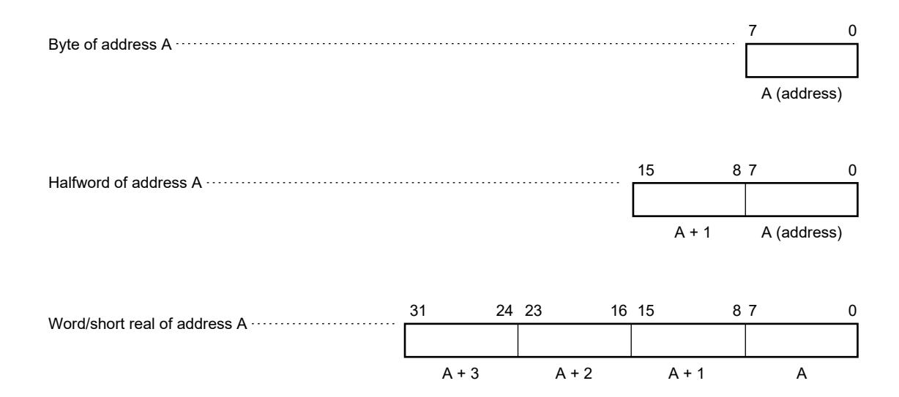

### **1.4 Data Types**

The data types supported by the V805 and V810 are as follows:

- Integer (8, 16, 32 bits)
- Unsigned integer (8, 16, 32 bits)
- Bit string
- Single-precision floating-point data (32 bits)

### **1.5 Register Set**

The register set of the V805 and V810 can be classified into two types: program register set that is generally used by the programmer and system register set that is usually used by the OS (operating system). All registers are 32 bits wide.

### **1.5.1 Program register set**

### **(1) General-purpose registers**

Thirty-two general-purpose registers, r0 to r31, are available. All these registers can be used as data registers or address registers.

However, r0 and r26 to r31 are implicitly used by instructions. r1 to r5 are used by C compiler and assembler.

**Figure 1-1. Program Registers**

### **(2) Program Counter**

The program counter (PC) indicates the address of the instruction currently executed by the program. Bit 0 of the PC is fixed to 0, and execution cannot branch to an odd address. The contents of the PC is initialized to FFFFFFF0H at reset.

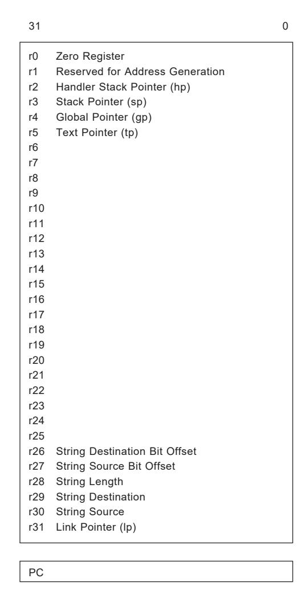

### **1.5.2 System register set**

The system register performs control of the processor state, exception/interrupt information processing, task management, etc.

Data is input to or output from a system register by specifying the following system register number with the system register load/store instruction (LDSR or STSR):

| No       |          | System register                       |
|----------|----------|---------------------------------------|
|          |          | LDSR STSR                             |
| 0        | EIPC     | : Exception/Interrupt PC              |
| 1        | EIPSW    | : Exception/Interrupt PSW             |
| 2        | FEPC     | : Fatal Error PC                      |
| 3        | FEPSW    | : Fatal Error PSW                     |
| 4        | ECR      | : Exception Cause Register —          |
| 5        | PSW      | : Program Status Word                 |
| 6        | PIR      | : Processor ID Register —             |
| 7        | TKCW     | : TasK Control Word —                 |
| 8 to 23  | Reserved |                                       |
| 24       | CHCW     | : CacHe Control Word                  |
| 25       | ADTRE    | : ADdress Trap Register for Execution |
| 26 to 31 | Reserved |                                       |

— : Write disabled

: Read/write enabled (cannot be set in some cases)

Reserved : Operation is not guaranteed if this is accessed.

# **CHAPTER 2 PIN FUNCTIONS**

### **2.1 Pin Configuration**

**(1) V805**

**• 100-pin plastic QFP (Fine pitch) (14 x 14 mm) (Top View)**

µPD70731GC-xx-7EA

**Cautions 1. Leave the IC1 pin open.**

**2. Connect the IC2 pin to GND.**

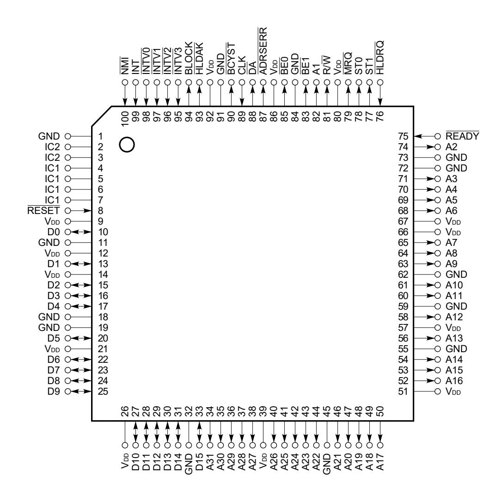

**(2) V810**

**• 120-pin plastic QFP (28 x 28 mm) (Top View)**

µPD70732GD-xx-LBB

**Cautions 1. Leave the IC1 pin open.**

**2. Connect the IC2 pin to GND.**

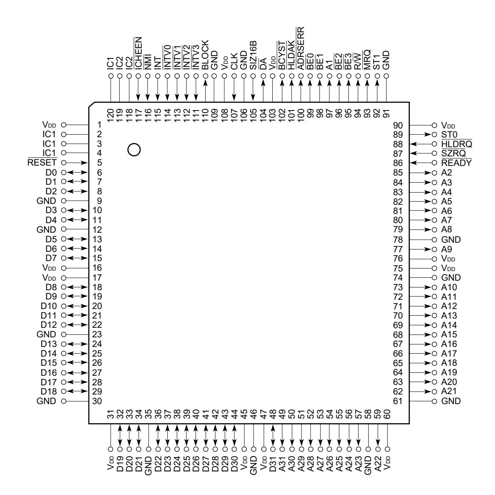

### **• 120-pin plastic TQFP (Fine pitch) (14 x 14 mm) (Top View)**

µPD70732GC-25-9EV

**Cautions 1. Leave the IC1 pin open.**

**2. Connect the IC2 pin to GND.**

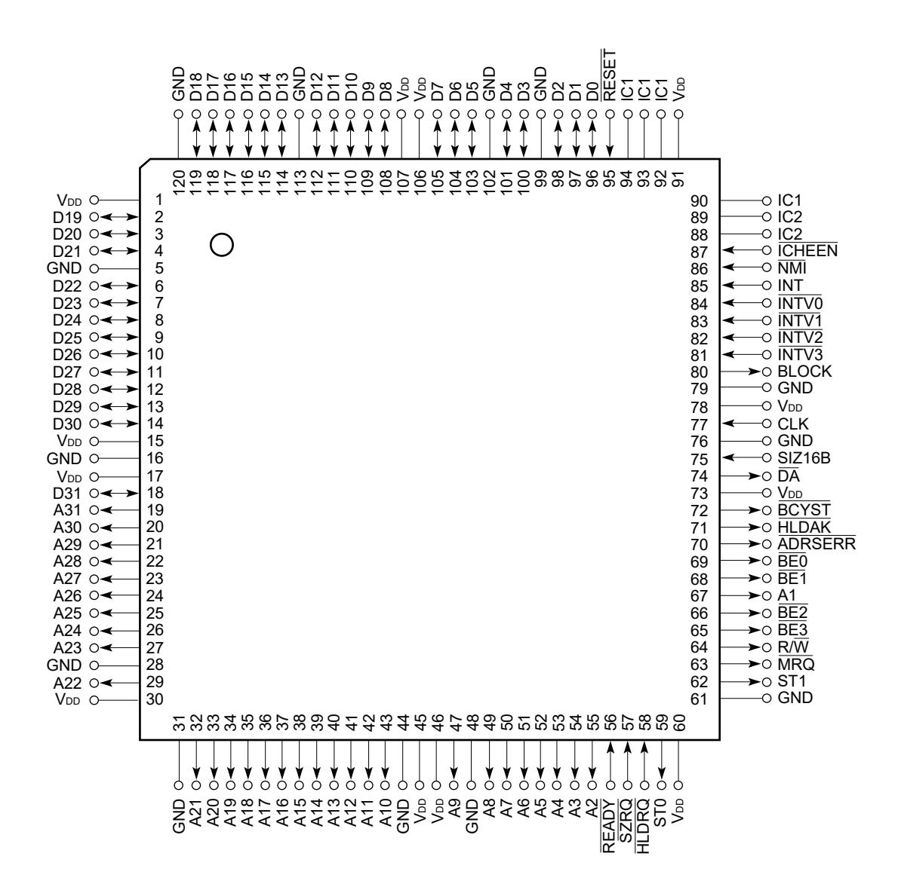

### **• 176-pin ceramic PGA (Seam weld)**

µPD70732R-25

**Remark** The insertion guide pin is not included in the number of pins.

| No. | Signal | No. | Signal | No. | Signal | No. | Signal |
|-----|--------|-----|--------|-----|--------|-----|--------|
| A1  | IC2    | B3  | GND    | C5  | VDD    | D7  | VDD    |
| A2  | D12    | B4  | D11    | C6  | D8     | D8  | VDD    |
| A3  | D13    | B5  | GND    | C7  | VDD    | D9  | GND    |
| A4  | D10    | B6  | D7     | C8  | D4     | D10 | IC3    |
| A5  | GND    | B7  | VDD    | C9  | D2     | D11 | IC2    |
| A6  | D6     | B8  | D3     | C10 | IC3    | D12 | GND    |
| A7  | IC2    | B9  | GND    | C11 | VDD    | D13 | INT    |
| A8  | D5     | B10 | D0     | C12 | IC1    | D14 | INTV1  |
| A9  | IC2    | B11 | GND    | C13 | IC2    | D15 | GND    |
| A10 | D1     | B12 | IC1    | C14 | VDD    | E1  | D27    |
| A11 | VDD    | B13 | GND    | C15 | NMI    | E2  | D25    |
| A12 | RESET  | B14 | IC1    | D1  | D23    | E3  | D21    |
| A13 | IC1    | B15 | ICHEEN | D2  | D22    | E4  | D19    |
| A14 | IC1    | C1  | VDD    | D3  | D20    | E12 | IC3    |
| A15 | IC2    | C2  | VDD    | D4  | GND    | E13 | INTV0  |
| B1  | D17    | C3  | D16    | D5  | D15    | E14 | IC3    |
| B2  | D18    | C4  | D14    | D6  | D9     | E15 | IC1    |

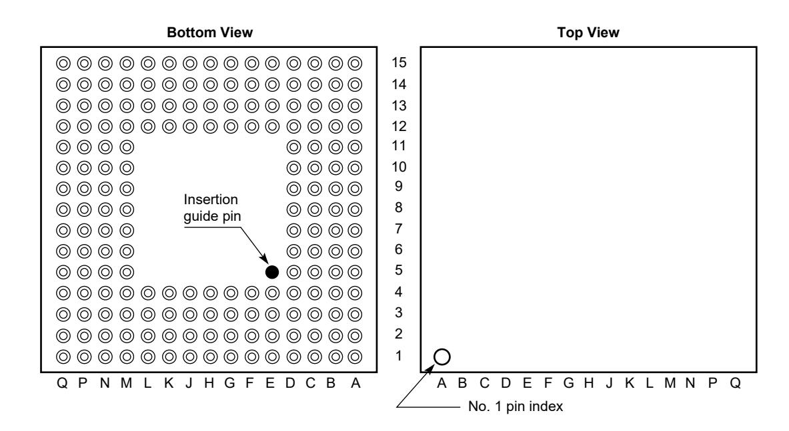

| No. | Signal | No. | Signal | No. | Signal | No. | Signal  |
|-----|--------|-----|--------|-----|--------|-----|---------|
| F1  | VDD    | J4  | VDD    | M7  | VDD    | P4  | A12     |
| F2  | D26    | J12 | IC2    | M8  | A5     | P5  | GND     |
| F3  | D24    | J13 | IC2    | M9  | VDD    | P6  | A8      |
| F4  | GND    | J14 | IC1    | M10 | ST1    | P7  | GND     |
| F12 | INTV2  | J15 | IC1    | M11 | A1     | P8  | A6      |
| F13 | INTV3  | K1  | IC2    | M12 | GND    | P9  | GND     |
| F14 | VDD    | K2  | A27    | M13 | BCYST  | P10 | SZRQ    |
| F15 | GND    | K3  | A25    | M14 | DA     | P11 | GND     |
| G1  | D29    | K4  | A24    | M15 | SIZ16B | P12 | MRQ     |
| G2  | D28    | K12 | GND    | N1  | VDD    | P13 | GND     |
| G3  | IC2    | K13 | BLOCK  | N2  | VDD    | P14 | ADRSERR |
| G4  | IC2    | K14 | VDD    | N3  | A17    | P15 | BE0     |
| G12 | VDD    | K15 | VDD    | N4  | A15    | Q1  | IC2     |
| G13 | IC2    | L1  | A28    | N5  | VDD    | Q2  | A13     |
| G14 | IC1    | L2  | A26    | N6  | A9     | Q3  | A14     |
| G15 | IC1    | L3  | A22    | N7  | VDD    | Q4  | A11     |
| H1  | A31    | L4  | A20    | N8  | VDD    | Q5  | GND     |
| H2  | D30    | L12 | HLDAK  | N9  | A3     | Q6  | A7      |
| H3  | GND    | L13 | VDD    | N10 | HLDRQ  | Q7  | IC2     |
| H4  | D31    | L14 | IC1    | N11 | VDD    | Q8  | A4      |
| H12 | GND    | L15 | IC1    | N12 | BE2    | Q9  | IC2     |
| H13 | CLK    | M1  | GND    | N13 | BE1    | Q10 | A2      |
| H14 | IC1    | M2  | A23    | N14 | VDD    | Q11 | READY   |
| H15 | IC2    | M3  | A21    | N15 | IC1    | Q12 | ST0     |
| J1  | A30    | M4  | GND    | P1  | A18    | Q13 | BE3     |
| J2  | A29    | M5  | A16    | P2  | A19    | Q14 | R/W     |
| J3  | IC2    | M6  | A10    | P3  | GND    | Q15 | IC2     |

- **Cautions 1. Leave the IC1 pin open.**
  - **2. Connect the IC2 pin to GND.**
  - **3. Connect the IC3 pin to VDD.**

|                                          |         |                                                    | Bus hold  |          |          |
|------------------------------------------|---------|----------------------------------------------------|-----------|----------|----------|
|                                          |         |                                                    | status    | Bus hold | Bus idle |
| Name                                     | I/O     | Function                                           | during    | status   | status   |
|                                          |         |                                                    | operation | at reset | at reset |
| A31 to A1                                | 3-state | Address bus                                        | Hi-Z      | Hi-Z     | H Note 1 |
| (Address Bus)                            | output  |                                                    |           |          |          |
| D15 to D0 Note 2                         | 3-state | Bidirectional data bus                             | Hi-Z      | Hi-Z     | Hi-Z     |
| (Data Bus)                               | I/O     |                                                    |           |          |          |
| D31 to D0 Note 3                         | 3-state | Bidirectional data bus                             | Hi-Z      | Hi-Z     | Hi-Z     |
| (Data Bus)                               | I/O     |                                                    |           |          |          |
| BE1, BE0 Note 2                          | 3-state | Indicates valid data bus when data is accessed     | Hi-Z      | HI-Z     | H        |
| (Byte Enable 1, 0)                       | output  |                                                    |           |          |          |
| BE3 to BE0 Note 3                        | 3-state | Indicates valid data bus when data is accessed     | Hi-Z      | Hi-Z     | H        |
| (Byte Enable 3 to 0)                     | output  |                                                    |           |          |          |
| ST1, ST0                                 | 3-state | Indicates type of bus cycle                        | Hi-Z      | Hi-Z     | H        |
| (Status 1, 0)                            | output  |                                                    |           |          |          |
| DA                                       | 3-state | Strobe signal for bus cycle                        | Hi-Z      | Hi-Z     | H        |
| (Data Access)                            | output  |                                                    |           |          |          |
| MRQ                                      | 3-state | Indicates memory access                            | Hi-Z      | Hi-Z     | H        |
| (Memory Request)                         | output  |                                                    |           |          |          |
| R/W                                      | 3-state | Distinguishes between read access and write access | Hi-Z      | Hi-Z     | H        |
| (Read/Write)                             | output  |                                                    |           |          |          |
| BCYST                                    | 3-state | Indicates start of bus cycle                       | Hi-Z      | Hi-Z     | H        |
| (Bus Cycle Start)                        | output  |                                                    |           |          |          |
| READY (Ready)                            | Input   | Extends bus cycle                                  | —         | —        | —        |
| HLDRQ (Hold Request)                     | Input   | Requests bus mastership                            | —         | —        | —        |
| HLDAK (Hold Acknowledge)                 | Output  | Acknowledges HLDRQ                                 | L         | L        | H        |
| SZRQ Note 3 (Bus Sizing Request)         | Input   | Requests bus sizing                                | —         | —        | —        |
| SIZ16B Note 3 (Bus Size 16Bit)           | Input   | Fixes external data bus width to 16 bits           | —         | —        | —        |
| BLOCK (Bus Lock)                         | Output  | Requests to inhibit use of bus                     | L         | L        | L        |
| ICHEEN Note 3 (Instruction Cache Enable) | Input   | Operates instruction cache                         | —         | —        | —        |
| INT (Maskable Interrupt)                 | Input   | Interrupt request                                  | —         | —        | —        |
| INTV3 to INTV0 (Interrupt Label 3 to 0)  | Input   | Interrupt level                                    | —         | —        | —        |

# **2.2 Pin Function List**

|                                     |        |                                                          | Bus hold  |          |          |
|-------------------------------------|--------|----------------------------------------------------------|-----------|----------|----------|
|                                     |        |                                                          | status    | Bus hold | Bus idle |
| Name                                | I/O    | Function                                                 | during    | status   | status   |
|                                     |        |                                                          | operation | at reset | at reset |
| NMI (Non-Maskable Interrupt)        | Input  | Non-maskable interrupt request                           | —         | —        | —        |
| CLK                                 | Input  | CPU clock input                                          | —         | —        | —        |
| RESET (Reset)                       | Input  | Resets internal status                                   | —         | —        | —        |
| ADRSERR                             | Output | Indicates that data alignment is illegal                 | Not       | H        | H        |
| (Address Error)                     |        |                                                          | affected  |          |          |
| VDD (Power Supply)                  | —      | +5-V power source                                        | —         | —        | —        |
| GND (Ground)                        | —      | Ground potential (0 V)                                   | —         | —        | —        |
| IC1 (Internally Connected 1)        | —      | Internally connected (Leave this pin open.)              | —         | —        | —        |
| IC2 (Internally Connected 2)        | —      | Internally connected (Ground this pin.)                  | —         | —        | —        |
| IC3 Note 3 (Internally Connected 3) | —      | Internally connected (Connect this pin to power supply.) | —         | —        | —        |

**Notes 1.** A1 is "H" in the 16-bit bus mode; otherwise, it is "L" (V810 only).

**2.** V805 only

**3.** V810 only

# **2.3 Pin Function Details**

This section describes the pin functions of the V805 and V810. In the following description, "L" denotes the low level, and "H" denotes the high level. For each state of a bus cycle, the period from the rising edge of the clock to the time just before the next rising edge is taken as a unit.

### **(1) A31 to A1 (Address Bus) ... 3-state output**

These pins constitute an address bus that outputs an address signal when the CPU accesses an external main memory or an I/O device. This address bus can access an address space of 232 bytes, and changes its status in synchronization with the rising edge of the clock of the T1 of the bus cycle. In the additional bus cycle, A1 changes its status in synchronization with the rising edge of the clock of the T1S state.

### **(2) D31 to D0 (Data Bus) ... 3-state I/O**

These pins constitute a data bus through which the CPU writes or reads data to or from an external main memory or an I/O device. The V805 does not have D31 to D16 pins.

In the write cycle, new data is output at the falling edge of the clock of the T1 and T1S states, and is held until the first TH state, or the falling edge of the clock of the T1 and T1S states.

In the read cycle, data is sampled at the rising edge of the clock next to the last T2 or T2S state.

### **(3) BE1, BE0 (Byte Enable) ... 3-state output (V805)**

These are byte enable signals output by the CPU when it accesses an external main memory or an I/O device, and indicate which byte of 16-bit data is to be accessed.

These signals change their statuses in synchronization with the rising edge of the clock of the T1 and T1S states of the bus cycle.

| Byte enable signal | Correspondence to data bus |
|--------------------|----------------------------|
| BE1                | D15 to D8                  |
| BE0                | D7 to D0                   |

### **(4) BE3 to BE0 (Byte Enable) ... 3-state output (V810)**

These are byte enable signals output by the CPU when it accesses an external main memory or an I/O device, and indicate which byte of 32-bit data is to be accessed.

These signals change their statuses in synchronization with the rising edge of the clock of the T1 and T1S states of the bus cycle.

| Byte enable signal | Correspondence to data bus |
|--------------------|----------------------------|
| BE3                | D31 to D24                 |
| BE2                | D23 to D16                 |
| BE1                | D15 to D8                  |
| BE0                | D7 to D0                   |

- **(5) ST1, ST0 (Status) ... 3-state output**

These pins indicate the status of the bus cycle under execution.

They change their statuses in synchronization with the rising edge of the clock of the T1 or T1S state of the bus cycle.

**Table 2-1. Status**

| MRQ | ST1 | ST0 | Type of bus cycle         |
|-----|-----|-----|---------------------------|
| L   | L   | L   | RFU (reserved area)       |
| L   | L   | H   | Fetch after branch Note   |
| L   | H   | L   | Data access               |
| L   | H   | H   | Instruction fetch         |
| H   | L   | L   | RFU (reserved area)       |
| H   | L   | H   | Machine fault acknowledge |
| H   | H   | L   | I/O access                |
| H   | H   | H   | Halt acknowledge          |

**Note** Does not output if cache is ON.

- **(6) DA (Data Access) ... 3-state output**

This is a strobe signal for data access and changes its status at the rising edge of the clock. It becomes active in the T2 and T2S states.

- **(7) MRQ (Memory Request) ... 3-state output**

This signal distinguishes between memory access and other instructions, and is valid during the period of the bus cycle.

When the memory is accessed, this signal goes "L"; otherwise, it is "H".

This signal changes its status in synchronization with the rising edge of the clock of the T1 and T1S states of the bus cycle.

- **(8) R/W (Read/Write) ... 3-state output**

This signal indicates whether the bus cycle under execution is a read cycle or a write cycle, and is valid during the period of the bus cycle. It goes "H" to indicate the read cycle, and "L" to indicate the write cycle. This signal changes its status in synchronization with the rising edge of the clock of the T1 and T1S states of the bus cycle.

- **(9) BCYST (Bus Cycle Start) ... 3-state output**

This signal indicates the start of the bus cycle, and changes its status at the rising edge of the clock. It becomes active during the T1 and T1S states.

- **(10) READY (Ready) ... input**

This signal extends the bus cycle and is sampled at the falling edge of the clock in the T2 and T2S states.

- **(11) HLDRQ (Hold Request) ... input**

This signal requests the CPU for the bus mastership and is sampled at the falling edge of the clock in the T2, T2S, TI, TIS, TH and THS states. If both this signal and the READY signal are active at the falling edge of the clock in the T2 and T2S states, and if this signal remains active at the falling edge of the clock in the transferred TI and TIS states, the TH and THS states start. At this time, the address bus, data bus, and control bus go into the high-impedance state, the HLDAK signal becomes active, and the bus mastership is relinquished.

However, if the BLOCK signal is active, the TH and THS states do not start.

- **(12) HLDAK (Hold Acknowledge) ... output**

This signal acknowledges the HLDRQ input and changes its status at the rising edge of the clock. The CPU makes this signal active after it has relinquished the bus mastership. When the HLDRQ input becomes inactive, the CPU makes the HLDAK signal active, and acquires the bus mastership.

- **(13) SZRQ (Bus Sizing Request) ... input (V810)**

This signal requests the bus cycle under execution to change the width of the external data bus. By making this signal active, the bus width can be specified to be 16 bits. The V810 regards the lower 16 bits of the data bus as the valid data bus. The bus cycle is automatically added as necessary. This signal is sampled at the falling edge of the T2 state at the end of the bus cycle.

- **(14) SIZ16B (Bus Size 16 Bit) ... input (V810)**

This signal fixes the external data bus width to 16 bits. By making this signal active, the CPU enters a mode in which BE1, BE0 and A1 corresponding to a 16-bit data bus system are output, and BE3, BE2 and D31 to D16 go into a high-impedance state. To make this signal active, SZRQ must also be made active. D31 to D16 need not to be connected.

Note that this input signal can be changed only at reset. If it is changed at other times, the operation of the CPU is not guaranteed.

- **(15) BLOCK (Bus Lock) ... output**

This signal inhibits bus masters other than the V805 and V810 from using the bus. It becomes active at the beginning of the first bus cycle (rising edge of the clock of the T1 state), and becomes inactive at the rising edge of the clock next to the last bus cycle (last T2 state, or last T2S state when there is an additional bus cycle).

- **(16) ICHEEN (Instruction Cache Enable) ... input (V810)**

This signal enables the operation of the instruction cache. This input signal can be changed only at reset. If it is changed at other times, the operation of the CPU is not guaranteed. Note that to energize the instruction cache, the ICE bit of the cache control word must be set.

- **(17) ADRSERR (Address Error) ... output**

This signal indicates that the address calculated by the load/store or the I/O instruction was not aligned and is aligned automatically by the V805 and V810. It changes its status at the same time as the address in synchronization with the bus cycle, and becomes active in association with the bus cycle for one operand access.

Note that this signal does not detect the branch address of a branch instruction, nor the illegal alignment of the address of the lock word of the CAXI instruction.

### **(18) INT (Interrupt) ... input**

This signal requests interrupt to the CPU. This signal is sampled at the rising edge of the clock and detects an interrupt request when the three conditions indicated below are satisfied. The detected interrupt request and interrupt level are internally held while condition (a) is satisfied.

- (a) If all the NP, EP and ID flags in the PSW are "0"
- (b) If the interrupt level of the INTV3 to INTV0 pins is higher than the interrupt enable level in the PSW
- (c) If the INT pin is active

The V805 and V810 check whether an interrupt request is issued at the end of an instruction, in the middle of an instruction if the instruction is aborted by the occurrence of an interrupt, or when no internal processing is executed. They accept an interrupt request if it is issued.

Note that this signal and INTV3 to INTV0 must be kept active from the time when the CPU has started interrupt servicing until the acceptance of the interrupt is notified to the external devices through software.

### **(19) INTV3 to INTV0 (Interrupt Level) ... input**

These signals indicate the level of an interrupt to the CPU. These are 16 interrupt levels available: 0 to 15. These signals are sampled at the rising edge of the clock.

Note that these signals and INT must be kept active from the time when the CPU has started interrupt servicing until the acceptance of the interrupt is notified to the external devices through software (though the interrupt level can be changed to a higher priority level).

### **(20) NMI (Non-maskable Interrupt) ... input**

This signal requests interrupt to the CPU, and is sampled at the falling edge of the clock. The interrupt request is detected when the sampled value changes from "H" to "L". The detected interrupt request is internally held until the CPU starts the interrupt servicing.

### **(21) CLK (Clock) ... input**

This pin inputs the system clock.

### **(22) RESET (Reset) ... input**

This signal initializes the V805 and V810 and is sampled at the falling edge of the clock. The active level of this signal must be held for the duration of 20 clocks or longer.

When the RESET input is accepted, the CPU initializes the pins and internal registers, and executes instructions starting from the address FFFFFFF0H.

### **(23) VDD (Power Supply)**

+5-V power supply pin.

### **(24) GND (Ground)**

Ground pin (0 V).

### **(25) IC1 (Internally Connected 1)**

Leave this pin open.

- **(26) IC2 (Internally Connected 2)**

Connect this pin to GND line.

- **(27) IC3 (Internally Connected 3) (V810)**

Connect this pin to VDD line.

# **2.4 Pin Status**

The following table shows the status of each pin:

**Table 2-2. Pin Status**

|                   |                      | Bus hold status  | Bus hold status | Bus idle status |
|-------------------|----------------------|------------------|-----------------|-----------------|
| Pin               | I/O                  |                  |                 |                 |
|                   |                      | during operation | at reset        | at reset        |
| A31 to A1         | 3-state output       | Hi-Z             | Hi-Z            | H Note 1        |
| D15 to D0 Note 2  | 3-state input/output | Hi-Z             | Hi-Z            | Hi-Z            |
| D31 to D0 Note 3  | 3-state input/output | Hi-Z             | Hi-Z            | Hi-Z            |
| BE1, BE0 Note 2   | 3-state input/output | Hi-Z             | Hi-Z            | H               |
| BE3 to BE0 Note 3 | 3-state output       | Hi-Z             | Hi-Z            | H               |
| ST1, ST0          | 3-state output       | Hi-Z             | Hi-Z            | H               |
| DA                | 3-state output       | Hi-Z             | Hi-Z            | H               |
| MRQ               | 3-state output       | Hi-Z             | Hi-Z            | H               |
| R/W               | 3-state output       | Hi-Z             | Hi-Z            | H               |
| BCYST             | 3-state output       | Hi-Z             | Hi-Z            | H               |
| READY             | Input                | —                | —               | —               |
| HLDRQ             | Input                | —                | —               | —               |
| HLDAK             | Output               | L                | L               | H               |
| SZRQ Note 3       | Input                | —                | —               | —               |
| SIZ16B Note 3     | Input                | —                | —               | —               |
| BLOCK             | Output               | L                | L               | L               |
| ICHEEN Note 3     | Input                | —                | —               | —               |
| ADRSERR           | Output               | Not affected     | H               | H               |
| INT               | Input                | —                | —               | —               |
| INTV3 to INTV0    | Input                | —                | —               | —               |
| NMI               | Input                | —                | —               | —               |
| CLK               | Input                | —                | —               | —               |

**Notes 1.** A1 is "H" in the 16-bit bus mode; otherwise, it is "L" (V810 only).

- **2.** V805 only
- **3.** V810 only

### **2.5 Pin I/O Circuits and Recommended Connection of Unused Pins** ★

The I/O circuit type of each pin and recommended connection of unused pins are shown in Table 2-3. Figure 2-1 shows the I/O circuit of each type.

**Table 2-3. Pin I/O Circuit Types and Recommended Connection Method of Unused Pins**

|            | Pin I/O Circuit Type Recommended Connection Method of Unused Pins |
|------------|-------------------------------------------------------------------|
| D15 to D0  | Note 1 5 Open                                                     |
| D31 to D0  | Note 2                                                            |
| A31 to A1  | 4                                                                 |
| BE1, BE0   | Note 1                                                            |
| BE3 to BE0 | Note 2                                                            |
| READY      | 1 Connect to GND via a resistor                                   |
| SIZ16B     | Note 2                                                            |
| HLDRQ      | Connect to VDD via a resistor                                     |
| SZRQ       | Note 2                                                            |
| ICHEEN     | Note 2                                                            |
| CLK        | —                                                                 |
| IC1        | — Open                                                            |
| IC2        | — Connect to GND                                                  |
| IC3 Note 2 | — Connect to VSS                                                  |

**Notes 1.** V805 only

**2.** V810 only

**Figure 2-1. Pin I/O Circuit**

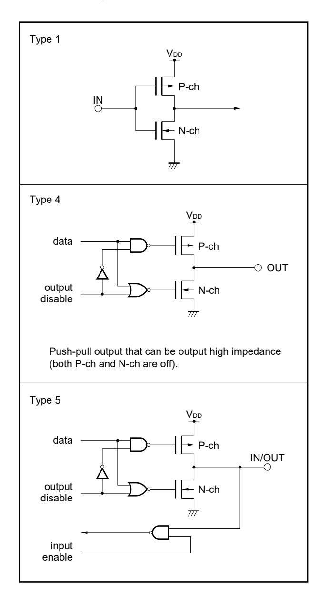

**[MEMO]**

# **CHAPTER 3 BUS INTERFACE FUNCTION**

The V805 is equipped with a 16-bit data bus and the V810 is equipped with a 32-bit data bus.

In the V810 bus interface, there are two modes–32-bit bus mode which uses the data bus in 32 bits and 16-bit bus fixed mode which fixes the bus in 16 bits. Modes can be switched only at reset using the SIZ16B signal.

The 32-bit bus mode has a dynamic bus sizing function which uses the data bus in 16-bit bus width to access the 16-bit peripherals. This function can be used by setting the SZRQ signal active. Access to word data (32-bit data) in the dynamic bus sizing is executed by loading/storing a 16-bit data twice.

In the 16-bit bus fixed mode, access to word data (32-bit data) is executed by activating a bus cycle twice.

 The control signal and the A1 signal output values according to the 16-bit system (Refer to **Table 3-3 Relationship among Address, Data Length, Byte Enable Signals and A1 (16-bit bus fixed mode)**).

For the V805 bus interface, refer to **3.2 Bus Interface during 16-bit Bus Fixed Mode (V805 and V810)**.

# **3.1 Bus Interface during 32-bit Bus Mode (V810)**

When the SIZ16B signal is fixed to inactive at reset, the bus interface is in the 32-bit bus mode. In this mode, when the peripherals of the 32-bit width bus are accessed, the word data can be processed in one bus cycle.

When the peripherals of the 16-bit width bus are accessed, the lower 16-bit data bus is used with the dynamic bus sizing function. This function can be used by setting the SZRQ signal active. In dynamic bus sizing, two bus cycles are started up during the access of the word data. The lower halfword data is loaded/stored in the first bus cycle, and the higher halfword data in the second bus cycle. The halfword/byte data can be accessed in one bus cycle.

Figure 3-1 and Figure 3-2 show the operations during dynamic bus sizing. In these figures, A indicates the lower 16 bits of data, and B indicates the higher 16 bits of data.

**Figure 3-1. Word Data Access during Dynamic Bus Sizing**

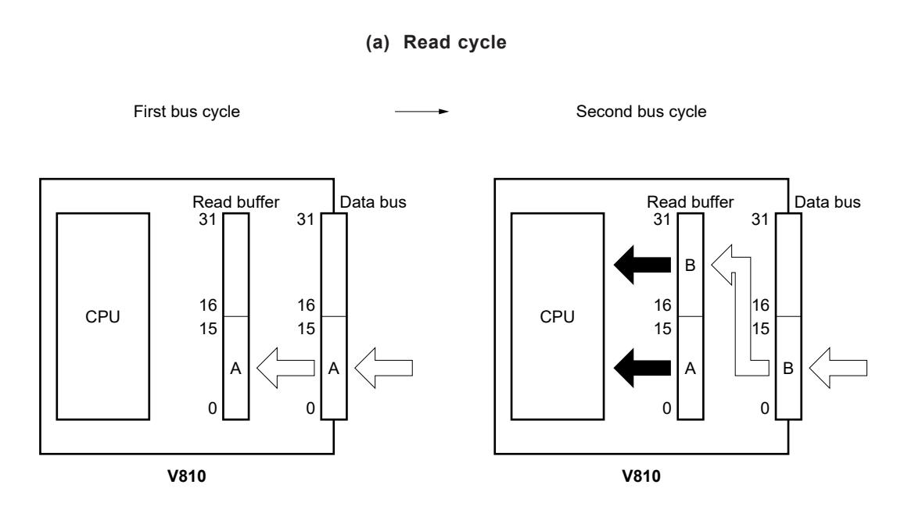

**(b) Write cycle**

**Remark** : Data input to CPU : Data written in 16-bit I/O

**Figure 3-2. Halfword/Byte Data Access during Dynamic Bus Sizing**

**(a) Higher halfword/byte data read cycle**

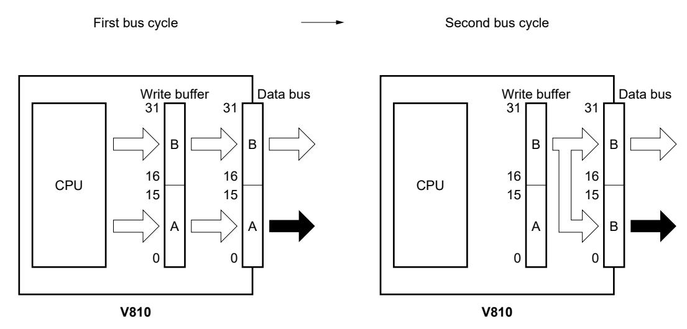

**(b) Higher halfword/byte data write cycle**

**(c) Lower halfword/byte data read cycle**

**(d) Lower halfword/byte data write cycle**

**Remark** : Data input to CPU

: Data written in 16-bit I/O

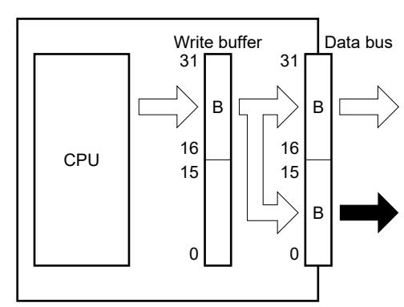

**V810**

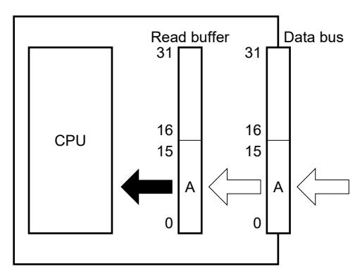

**V810**

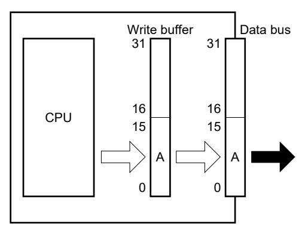

**V810**

The following items for setting the 32-bit bus mode are described below.

- (1) Relationship between external access and byte enable signals
- (2) Operand read
- (3) Operand write
- (4) Bus state
- (5) Memory and I/O access
- (6) Machine fault acknowledge
- (7) Halt acknowledge

### **3.1.1 Relationship between external access and byte enable signals (32-bit bus mode)**

The relationship between the external access and byte enable signals (BE3 to BE0) during the 32-bit bus mode is described below.

**Table 3-1. Relationship among Address, Data Length, Byte Enable Signals and A1 (32-bit bus mode)**

| Data length | Bit 1 | Operand address Bit 0 | BE3 | Byte enable BE2 | BE1 | BE0 | A1 | Bus cycle sequence |
|-------------|-------|-----------------------|-----|-----------------|-----|-----|----|--------------------|
| Byte        | 0     | 0                     | 1   | 1               | 1   | 0   | 0  | 1                  |
|             | 0     | 1                     | 1   | 1               | 0   | 1   | 0  | 1                  |
|             | 1     | 0                     | 1   | 0               | 1   | 1   | 0  | 1                  |
|             | 1     | 1                     | 0   | 1               | 1   | 1   | 0  | 1                  |
| Halfword    | 0     | 0                     | 1   | 1               | 0   | 0   | 0  | 1                  |
|             | 1     | 0                     | 0   | 0               | 1   | 1   | 0  | 1                  |
| Word        | 0     | 0                     | 0   | 0               | 0   | 0   | 0  | 1                  |
|             |       |                       | 0   | 0               | 1   | 1   | 1  | 2 Note             |

**Note** Bus cycle added by dynamic bus sizing

### **3.1.2 Operand read (32-bit bus mode)**

Figure 3-3 shows the relationship between external access and data sampling when an operand is read with the data bus width set to 32 bits. Figure 3-4 shows the read cycle when the dynamic bus sizing function is selected.

In these figures, "n ; Bm" of internal register indicates that the byte numbered m on the external data bus is sampled in the bus cycle numbered n. The relationship between Bm and the external data bus is as follows:

**Figure 3-3. Operand Read (data bus is 32-bit)**

### **(a) Data length: byte**

### **(b) Data length: halfword**

### **(c) Data length: word**

| External data bus | 31 | 24 | 23 | 16 | 17 |
|-------------------|----|----|----|----|----|
|                   | B4 |    | B3 | B2 | B1 |

|       | Operand address | Internal register |
|-------|-----------------|-------------------|
|       | 31 24 23        | 16 15 8 7 0       |
| 0     | 0               | 1 ; B1            |
| Bit 1 | Bit 0           |                   |
| 0     | 1               | 1 ; B2            |
| 1     | 0               | 1 ; B3            |
| 1     | 1               | 1 ; B4            |

| <b>Operand address</b> |              | <b>Internal register</b> |           |           |          |          |
|------------------------|--------------|--------------------------|-----------|-----------|----------|----------|
| <b>Bit 1</b>           | <b>Bit 0</b> | <b>31</b>                | <b>24</b> | <b>15</b> | <b>8</b> | <b>7</b> |
| 0                      | 0            |                          |           | 1; B2     | 1; B1    |          |
| 1                      | 0            |                          |           | 1; B4     | 1; B3    |          |

| Operand address |       | Internal register |       |       |       |   |
|-----------------|-------|-------------------|-------|-------|-------|---|
| Bit 1           | Bit 0 | 31                | 24    | 15    | 8     | 7 |
| 0               | 0     | 1; B4             | 1; B3 | 1; B2 | 1; B1 |   |

**Figure 3-4. Operand Read (dynamic bus sizing)**

**(a) Data length: byte**

**(b) Data length: halfword**

**(c) Data length: word**

**Note** Bus cycle added by dynamic bus sizing

|       | Operand address | Internal register |
|-------|-----------------|-------------------|
|       | 31 24 23        | 16 15 8 7 0       |
| 0     | 0               | 1 ; B1            |
| Bit 1 | Bit 0           |                   |
| 0     | 1               | 1 ; B2            |
| 1     | 0               | 1 ; B1            |
| 1     | 1               | 1 ; B2            |

| <b>Operand addres</b> |              | <b>Internal register</b> |           |           |                      |          |                      |          |
|-----------------------|--------------|--------------------------|-----------|-----------|----------------------|----------|----------------------|----------|
| <b>Bit 1</b>          | <b>Bit 0</b> | <b>31</b>                | <b>24</b> | <b>16</b> | <b>15</b>            | <b>8</b> | <b>7</b>             | <b>0</b> |
| <b>0</b>              | <b>0</b>     |                          |           |           | <b>1</b> ; <b>B2</b> |          | <b>1</b> ; <b>B1</b> |          |
| <b>1</b>              | <b>0</b>     |                          |           |           | <b>1</b> ; <b>B2</b> |          | <b>1</b> ; <b>B1</b> |          |

| Operand address | Internal register |                       |                       |       |       |   |
|-----------------|-------------------|-----------------------|-----------------------|-------|-------|---|
| Bit 1           | Bit 0             | 31                    | 24                    | 16    | 8     | 7 |
| 0               | 0                 | 2; B2 Note | 2; B1 Note | 1; B2 | 1; B1 |   |

### **3.1.3 Operand write (32-bit bus mode)**

Figure 3-5 shows the relationship between external access and data output when the data bus width is set to 32 bits to write an operand. During dynamic bus sizing, one bus cycle is added as shown in Figure 3-5 (c).

In these figures, OPm (m = 4 to 1) shows the byte position of an internal register.

The relationship between OPm and the internal register is as follows:

**Figure 3-5. Operand Write (32-bit bus mode)**

### **(a) Data length: byte**

### **(b) Data length: halfword**

### **(c) Data length: word**

**Note** Bus cycle added by dynamic bus sizing

| Internal register | 31  | 24 | 23  | 16  | 15  |
|-------------------|-----|----|-----|-----|-----|
|                   | OP4 |    | OP3 | OP2 | OP1 |

|       | Operand address External data bus |
|-------|-----------------------------------|
|       | 31 24 23 16 15 8 7 0              |
| 0     | 0 OP1                             |
| Bit 1 | Bit 0 Bus cycle sequence          |
| 0     | 1 OP1                             |
| 1     | 0 OP1 OP1                         |
| 1     | 1 OP1 OP1                         |

| Operand address |       | External data bus |            |    |            |    |            |            |   |                    |
|-----------------|-------|-------------------|------------|----|------------|----|------------|------------|---|--------------------|
| Bit 1           | Bit 0 | 31                | 24         | 23 | 16         | 15 | 8          | 7          | 0 | Bus cycle sequence |
| 0               | 0     |                   |            |    |            |    | <b>OP2</b> | <b>OP1</b> |   | 1                  |
| 1               | 0     |                   | <b>OP2</b> |    | <b>OP1</b> |    | <b>OP2</b> | <b>OP1</b> |   | 1                  |

| Operand address |       | External data bus |     |     |     |     |     | Bus cycle sequence |   |
|-----------------|-------|-------------------|-----|-----|-----|-----|-----|--------------------|---|
| Bit 1           | Bit 0 | 31                | 24  | 23  | 16  | 15  | 8   |                    | 7 |
| 0               | 0     | OP4               | OP3 | OP3 | OP2 | OP1 | OP1 | 1                  |   |
|                 |       | OP4               | OP3 | OP4 | OP3 | OP3 | OP3 | 2 Note  |   |

### **Caution Notes on bit string**

**A bit string processes data by word (4 bytes) to increase the processing speed. If the end of data written is not at the word boundary, i.e., if bits 1 and 0 of the last byte address which includes in the bit string at the destination side are not "11", 3 bytes maximum are excessively written as shown in Figure 3-6, but the data is not destroyed because the original value is written again as it is.**

**As for read, 3 words maximum may be excessively read in some read cycles from the last word at the source side and from that at the destination side where the data exists, but the excessively read data is discarded.**

**Figure 3-6. Operand Write of Bit String (32-bit bus mode)**

**Note** Byte excessively written.

BE3 to BE0 are always "0000".

|       | Operand address External data bus |
|-------|-----------------------------------|
|       | 31 24 23 16 15 8 7 0              |
| Bit 1 | Bit 0                             |
| 0     | 0 OP4 Note OP3 Note OP2 Note OP1  |
|       | OP4 Note OP3 Note OP2 OP1         |
|       | OP4 Note OP3 OP2 OP1              |
| 0     | 1                                 |
| 1     | 0                                 |

### **3.1.4 Bus state (32-bit bus mode)**

The bus cycle of the V810 consists of the following eight states:

### **(a) TI and TIS**

These states start when no access request is issued, or the TH or THS state (hold status) is over. In these states, the BCYST and DA outputs are inactive. The HLDRQ signal is sampled at the falling edge of the clock in these states.

### **(b) T1 and T1S**

These states start at the beginning of a bus cycle. In these states, the BCYST output becomes active. An address is output at the rising edge of the clock and valid data is output at the falling edge of the clock to the data bus. After the T1 and T1S states, the T2 and T2S states always start.

In the T1 state, the A1 signal becomes 0 and in the T1S state, the A1 signal becomes 1.

### **(c) T2 and T2S**

These states start at the end of a bus cycle or in the wait status. In these states, the DA output becomes active. The HLDRQ signal is sampled at the falling edge of the clock in these states. Read data is sampled at the rising edge of the clock next to the last T2 or T2S state.

In the T2 state, the A1 signal becomes 0 and in the T2S state, the A1 signal becomes 1.

### **(d) TH and THS**

These states start when the hold status is set by the HLDRQ input. In these states, the HLDRQ signal is sampled at the falling edge of the clock. When it is detected that the signal has become inactive, the TI and TIS states start.

**Remark** The TIS, T1S, T2S and THS states are bus cycles added only when a word is accessed with the bus sizing function enabled. These states respectively correspond to the TI, T1, T2 and TH states in the normal bus cycle.

**Figure 3-7. State Transition of Bus Cycle (32-bit bus mode)**

**Remark** When the RESET input becomes active, the TI or TH state starts depending on the status of the HLDRQ signal.

### **Bus cycle state transition condition**

<1> (HLDRQ = 1 or hold disable status) and access cause <2> READY = 0 and (SZRQ = 1 or (not word access)) and access cause and (HLDRQ = 1 or hold disable status) <3> READY = 1 <4> READY = 0 and (SZRQ = 1 or (not word access)) and (no access cause or (HLDRQ = 0 and hold enable status)) <5> (HLDRQ = 1 or hold disable status) and no access cause <6> HLDRQ = 0 and hold enable status <7> READY = 0 and (no access cause or (HLDRQ = 0 and hold enable status)) <8> HLDRQ = 0 <9> HLDRQ = 1 <10> READY = 1 <11> READY = 0 and access cause and (HLDRQ = 1 or hold disable status) <12> READY = 0 and SZRQ = 0 and word access and (HLDRQ = 1 or hold disable status) <13> READY = 0 and SZRQ = 0 and word access and HLDRQ = 0 and hold enable status <14> HLDRQ = 1 <15> HLDRQ = 0 <16> HLDRQ = 1 <17> HLDRQ = 0

**Remark** After the BLOCK signal has become active and immediately before the last bus cycle of the bus lock status (last T2 state, or last T2S state when the bus sizing function is enabled), the hold disable status is entered (the hold enable status is entered in the last bus cycle).

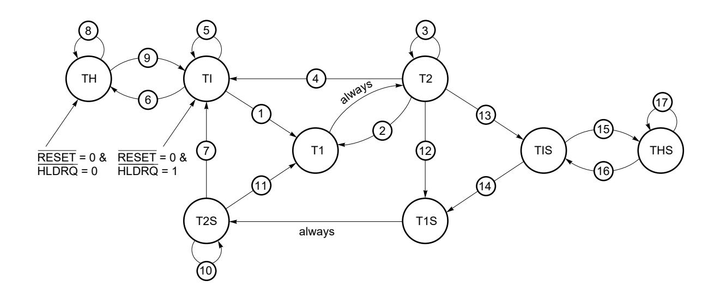

### **3.1.5 Memory and I/O access (32-bit bus mode)**

The memory read/write cycle and I/O read/write cycle are described below. The A1 signal in the 32-bit bus mode is fixed to 0. However, the A1 signal in dynamic bus sizing becomes 0 in the first access and 1 in the second access for word data access.

### **(1) Memory read cycle**

As soon as address output is started in the T1 state, the BCYST signal, which indicates the start of a bus cycle, becomes active. The T2 state starts next, in which the address continues to be output, the BCYST signal becomes inactive and the DA signal becomes active.

At the falling edge of the clock in the T2 state, the READY signal is sampled. If the READY signal is inactive, the T2 state (wait status) starts again. After that, the READY signal is sampled at each falling edge of the clock, and the T2 state is repeated while the READY signal is inactive.

When the READY signal becomes active, the T2 state ends, and data is sampled as soon as the DA signal is made inactive at the rising edge of the next clock.

Figure 3-8 shows the timing chart of the memory read cycle.

**Figure 3-8. Memory Read Cycle (32-bit bus mode)**

**Note** A31 to A1, BE3 to BE0, ST1, ST0, ADRSERR

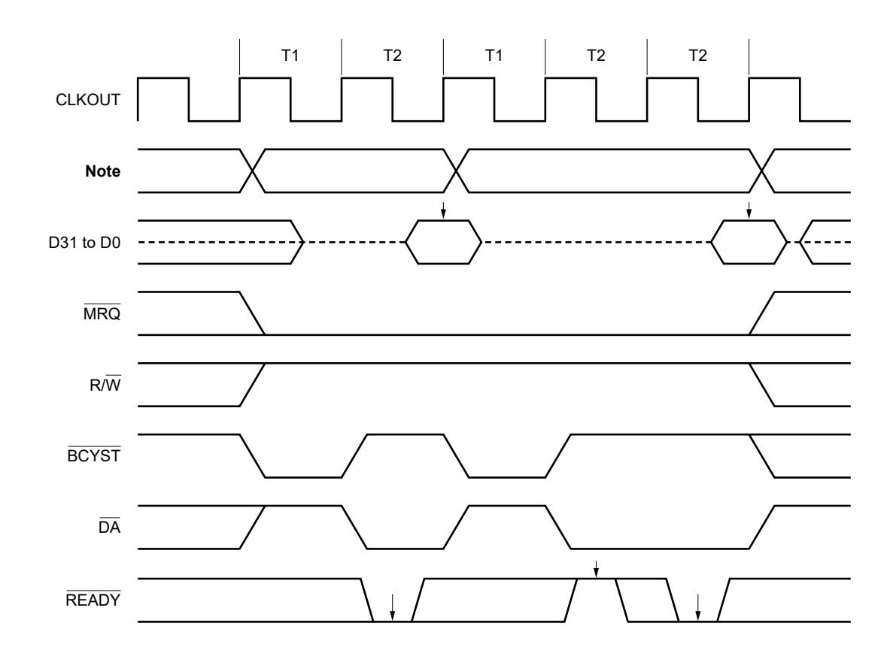

### **(2) Memory write cycle**

Output of write data is started at the falling edge of the clock in the T1 state. After that, output is held until the TH state starts or the clock in the T1 state of the next bus cycle falls. The statuses of all the pins except D31 to D0 and R/W are the same as those in the read cycle.

Figure 3-9 shows the timing chart of the memory write cycle.

**Figure 3-9. Memory Write Cycle (32-bit bus mode)**

**Note** A31 to A1, BE3 to BE0, ST1, ST0, ADRSERR

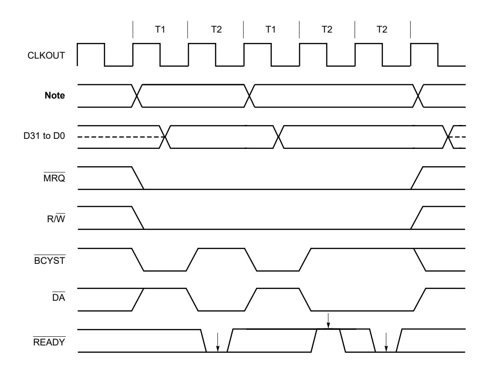

### **(3) I/O read cycle**

As soon as address output is started in the T1 state, the BCYST signal, which indicates the start of a bus cycle, becomes active. The T2 state starts next, in which the address continues to be output, the BCYST signal becomes inactive, and the DA signal becomes active.

At the falling edge of the clock in the T2 state, the READY signal is sampled. If the READY signal is inactive, the T2 state (wait status) starts again. After that, the READY signal is sampled at each falling edge of the clock, and the T2 state is repeated while the READY signal is inactive.

When the READY signal becomes active, the T2 state ends, and data is sampled as soon as the DA signal is made inactive at the rising edge of the next clock.

Figure 3-10 shows the timing chart of the I/O read cycle.

**Figure 3-10. I/O Read Cycle (32-bit bus mode)**

**Note** A31 to A1, BE3 to BE0, ST1, ST0, ADRSERR

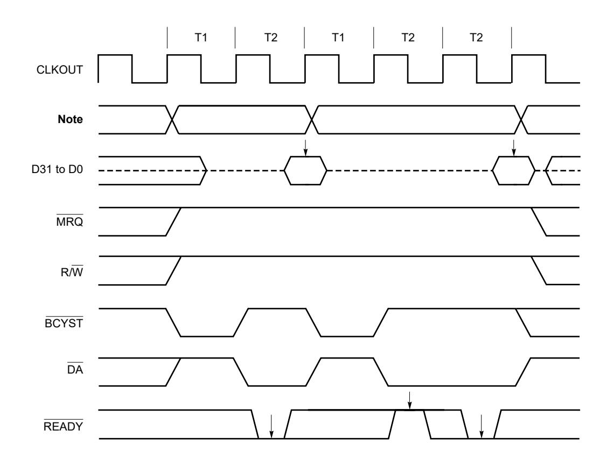

Output of write data is started at the falling edge of the clock in the T1 state. After that, output is held until the TH state starts or the clock in the T1 state of the next bus cycle falls. The statuses of all the pins except D31 to D0 and R/W are the same as those in the read cycle.

Figure 3-11 shows the timing chart of the I/O write cycle.

**Figure 3-11. I/O Write Cycle (32-bit bus mode)**

**Note** A31 to A1, BE3 to BE0, ST1, ST0, ADRSERR

**Remark** The dotted lines in the figure indicate the high-impedance state.

The down-arrows indicate the sampling timing.

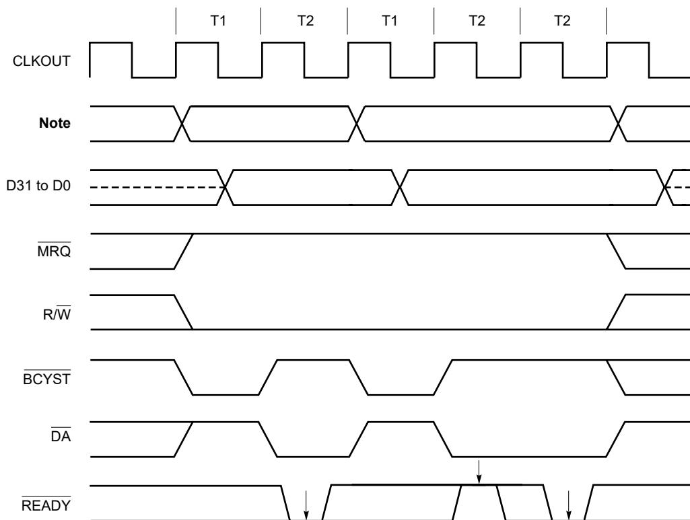

### **(5) Read/write during dynamic bus sizing**

In the read cycle, the read data is read from D15 to D0 in the first bus cycle (T1, T2). For word data access, the second bus cycle is started up. In the second bus cycle (T1S, T2S), BE1 and BE0 are made inactive at the rising edge of the T1S state clock, and the higher 16 bits of remaining data are read from D15 to D0.

In the write cycle, the write data is output to D31 to D0 at the falling edge of the T1 state clock in the first bus cycle. Like the read cycle, for word data access, the second bus cycle is added. In the second bus cycle, BE1 and BE0 are made inactive at the rising edge of the T1S state clock, and at the falling edge of the T1S state clock, the data output to D31 to D16 in the first write cycle is output to D15 to D0. This data is held until the falling edge of the T1 state clock on the next bus cycle.

Figure 3-12 shows the timing chart of the read/write during dynamic bus sizing.

**Figure 3-12. Timing during Dynamic Bus Sizing**

**Notes 1.** A31 to A2, ST1, ST0, MRQ

- **2.** Lower 16-bit data
- **3.** Higher 16-bit data
- **4.** Data on the data bus not assigned with the device to be accessed

**Caution The SIZ16B signal should be fixed to "L" during dynamic bus sizing.**

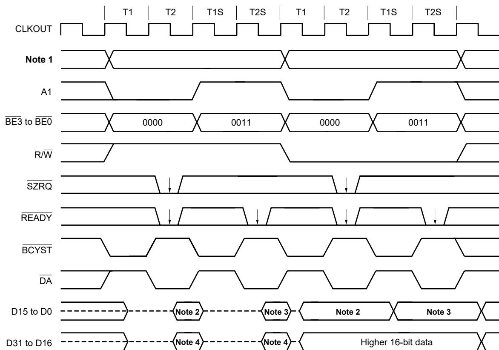

### **3.1.6 Machine fault cycle (32-bit bus mode)**

The MRQ, ST1 and ST0 signals are used to indicate the machine fault status (See **Table 2-1 Status**), and the cause code of a fatal exception (logical sum of FFFF0000H and an exception code), and the current contents of the PSW and PC are sequentially output in the write cycle to the data bus. Table 3-2 shows the correspondence between the data bus status and address bus status.

The wait, bus sizing and bus hold requests are valid in the above write cycle.

**Table 3-2. Correspondence between Address Bus and Data Bus during Machine Fault Cycle (32-bit bus mode)**

| Sequence | Address bus (A31 to A1) | Data bus (D31 to D0)                                                           |
|----------|-------------------------|--------------------------------------------------------------------------------|
| 1        | 00000000H               | Cause code of fatal exception (logical sum of FFFF0000H and an exception code) |
| 2        | 00000004H               | Current PSW value                                                              |
| 3        | 00000008H               | Current PC value                                                               |

Even after the machine fault cycle ends, the MRQ, ST1 and ST0 signals retain the bus status of the machine fault.

The machine fault status can be released only by reset input. The HLDRQ and READY signal requests are valid even in the machine fault cycle and in the subsequent TI state.

The following shows the timing of the machine fault cycle.

**Figure 3-13. Machine Fault Cycle (32-bit bus mode)**

**Notes 1.** ST1, ST0, BE3 to BE0

**2.** Cause code of fatal exception

**Remark** The dotted line in the figure indicates the high-impedance state.

The down-arrows indicate the sampling timing.

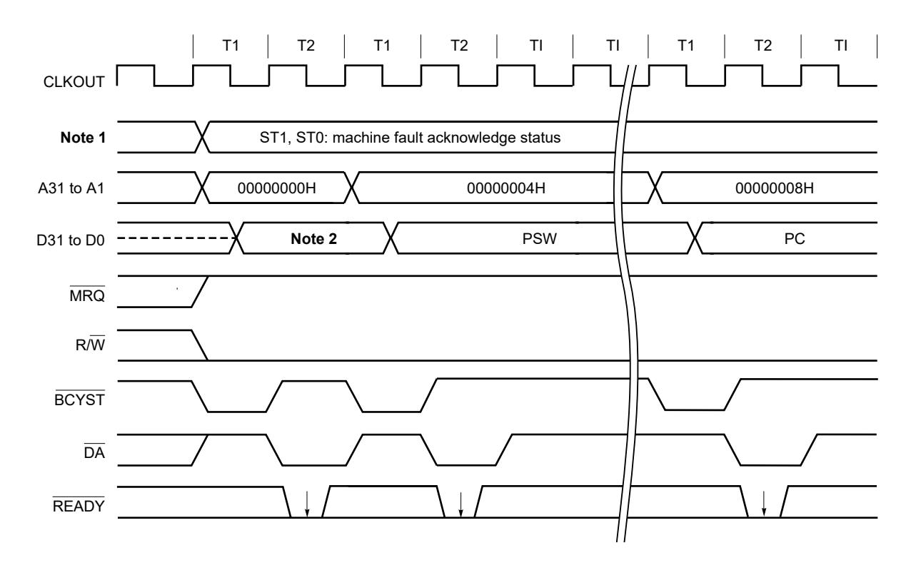

### **3.1.7 Halt acknowledge cycle (32-bit bus mode)**

The MRQ, ST1 and ST0 signals indicate the halt acknowledge cycle (See **Table 2-1 Status**), and the contents of the PC when the HALT instruction is executed are output in the write cycle to the address bus. The lower 16 bits of the PSW are output to the data bus by halfword.

The wait, bus sizing, and bus hold requests are valid in the above write cycle.

Figure 3-14 shows the timing of the halt acknowledge cycle.

**Figure 3-14. Halt Acknowledge Cycle (32-bit bus mode)**

**Note** ST1, ST0, BE3 to BE0

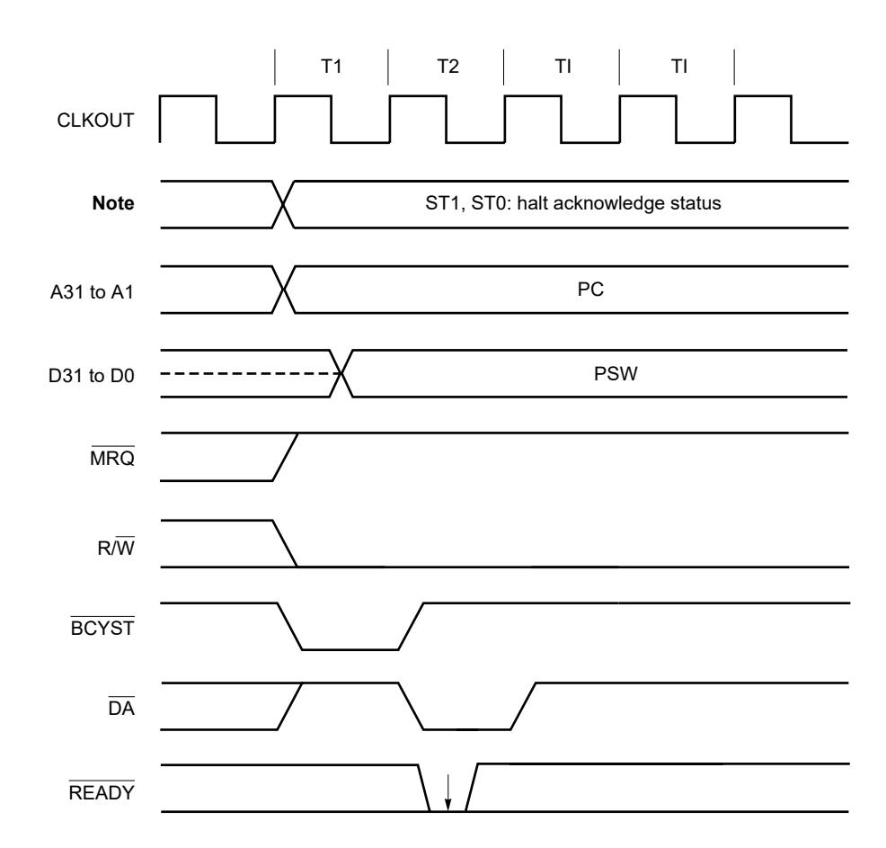

# **3.2 Bus Interface during 16-bit Bus Fixed Mode (V805 and V810)**

For the V810, when the SZRQ and SIZ16B signals are fixed to active at reset, the bus interface is in the 16 bit bus fixed mode. In this mode, the BE3, BE2 and D31 to D16 signals are in the high impedance state. The BE1, BE0 and A1 signals output appropriate values to the 16-bit data bus system. The SZRQ and SIZ16B signals can be changed only at reset.

For the V805, as the data bus is 16-bit, the SZRQ and SIZ16B signals are not present.

In the 16-bit bus fixed mode, two bus cycles are started up during the access of the word data. The lower halfword data is loaded/stored in the first bus cycle and the higher halfword data in the second bus cycle.

Figure 3-15 and Figure 3-16 show the operations performed in the 16-bit bus fixed mode. In these figures, A indicates the lower 16 bits of data, and B indicates the higher 16 bits of data. Figure 3-15 and Figure 3-16 show the operations of the V810. The operation of the V805 is the same as that of the V810 except that the data bus consists of 16 bits (0 to 15).

**Figure 3-15. Word Data Access during 16-Bit Bus Fixed Mode**

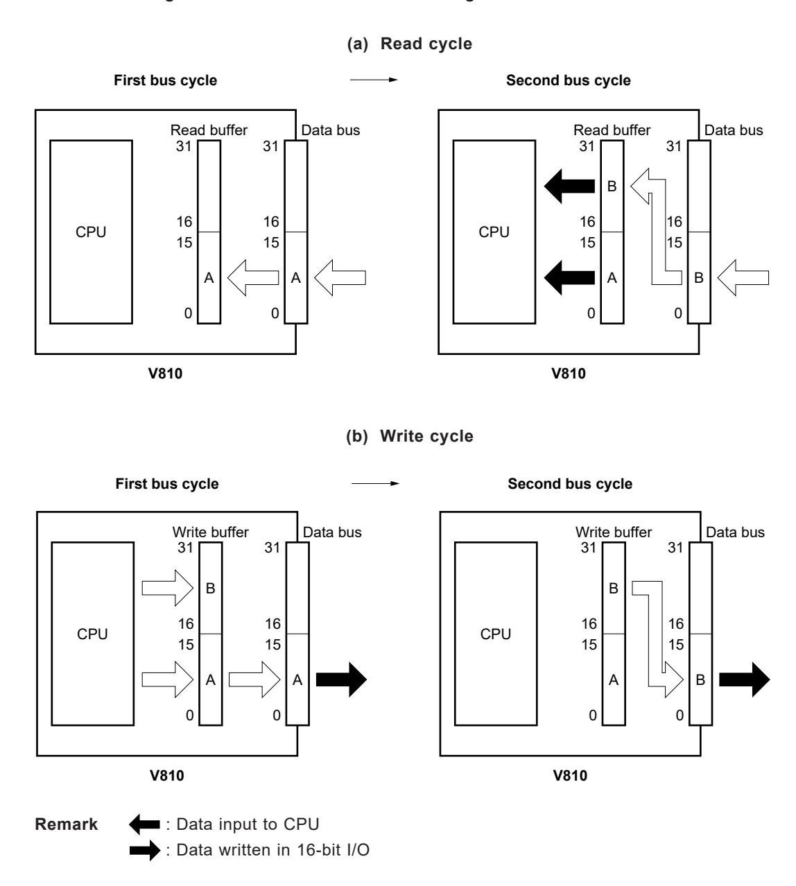

**Figure 3-16. Halfword/Byte Data Access during 16-Bit Bus Fixed Mode**

**(a) Higher halfword/byte data read cycle**

**(b) Higher halfword/byte data write cycle**

**Remark** : Data input to CPU : Data written in 16-bit I/O

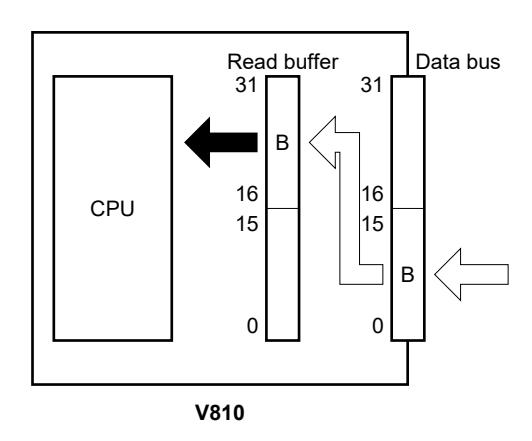

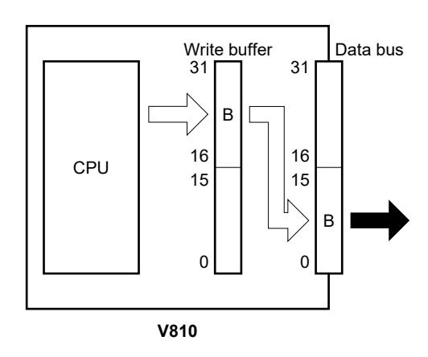

**(c) Lower halfword/byte data read cycle**

**(d) Lower halfword/byte data write cycle**

**Remark** : Data input to CPU : Data written in 16-bit I/O

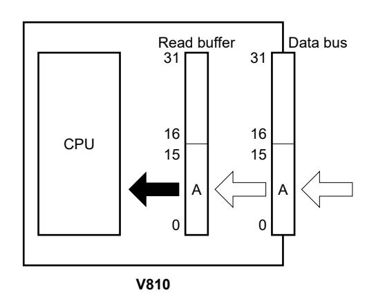

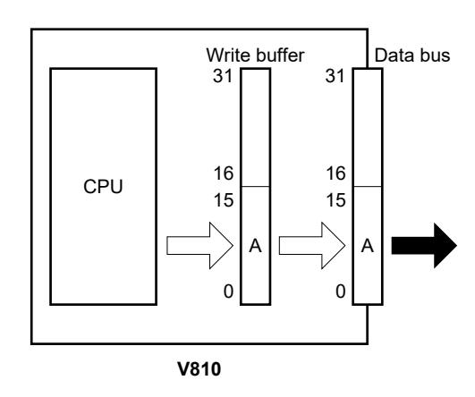

The following items for setting the 16-bit bus fixed mode are described below.

- (1) Relationship between external access and byte enable signals
- (2) Operand read
- (3) Operand write
- (4) Bus state
- (5) Memory and I/O access
- (6) Machine fault acknowledge
- (7) Halt acknowledge

### **3.2.1 Relationship between external access and byte enable signals (16-bit bus fixed mode)**

The relationship between the external access and byte enable signals (BE3 to BE0) during the 16-bit bus fixed mode is shown below.

**Table 3-3. Relationship among Address, Data Length, Byte Enable Signals and A1 (16-bit bus fixed mode)**

| Data length | Operand address Bit 1 | Bit 0 | BE3 Note 1 | Byte enable BE2 Note 1 | BE1 | BE0 | A1 | Bus cycle sequence |
|-------------|-----------------------|-------|------------|------------------------|-----|-----|----|--------------------|
| Byte        | 0                     | 0     | Hi-Z       | Hi-Z                   | 1   | 0   | 0  | 1                  |
|             | 0                     | 1     | Hi-Z       | Hi-Z                   | 0   | 1   | 0  | 1                  |
|             | 1                     | 0     | Hi-Z       | Hi-Z                   | 1   | 0   | 1  | 1                  |
|             | 1                     | 1     | Hi-Z       | Hi-Z                   | 0   | 1   | 1  | 1                  |
| Halfword    | 0                     | 0     | Hi-Z       | Hi-Z                   | 0   | 0   | 0  | 1                  |
|             | 1                     | 0     | Hi-Z       | Hi-Z                   | 0   | 0   | 1  | 1                  |
| Word        | 0                     | 0     | Hi-Z       | Hi-Z                   | 0   | 0   | 0  | 1                  |
|             |                       |       | Hi-Z       | Hi-Z                   | 0   | 0   | 1  | 2 Note 2           |

**Notes 1.** The V805 does not have these signals.

- **2.** Added bus cycle

### **3.2.2 Operand read (16-bit bus fixed mode)**

Figure 3-17 shows the relationship between external access and data sampling when an operand is read with the data bus width set to 16-bit bus fixed mode.

In these figures, "n ; Bm" of internal register indicates that the byte numbered m on the external data bus is sampled in the bus cycle numbered n. The relationship between Bm and the external data bus is as follows:

**Figure 3-17. Operand Read (16-bit bus fixed mode)**

**(a) Data length: byte**

**(b) Data length: halfword**

**(c) Data length: word**

**Note** Added bus cycle

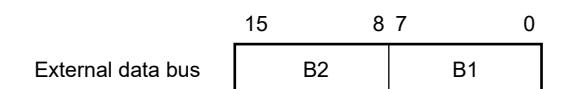

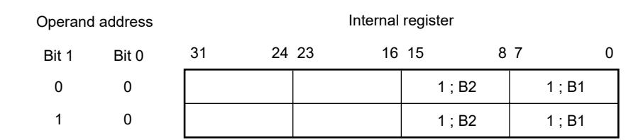

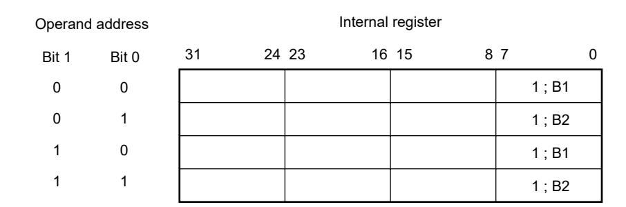

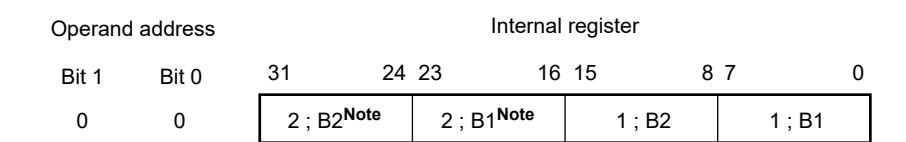

### **3.2.3 Operand write (16-bit bus fixed mode)**

Figure 3-18 shows the relationship between external access and data sampling when the data bus width is set to 16-bit bus fixed mode to write an operand. Figure 3-18 shows the operation of the V810. The operation of the V805 is the same as that of the V810 except that the external data bus consists of 16 bits (0 to 15).

In these figures, OPm (m = 1 to 4) shows the byte position of an internal register. The relationship between OPm and the internal register is as follows:

**Figure 3-18. Operand Write (16-bit bus fixed mode)**

**(a) Data length: byte**

**(b) Data length: halfword**

**(c) Data length: word**

| Internal register | 31  | 24 | 23  | 16  | 15  |
|-------------------|-----|----|-----|-----|-----|
|                   | OP4 |    | OP3 | OP2 | OP1 |

| Operand address |       | External data bus |    |    |    |     |   | Bus cycle sequence |                   |
|-----------------|-------|-------------------|----|----|----|-----|---|--------------------|-------------------|
| Bit 1           | Bit 0 | 31                | 24 | 23 | 16 | 15  | 8 |                    | 7                 |
| 0               | 0     |                   |    |    |    | OP2 |   | OP1                | 1                 |
|                 |       |                   |    |    |    | OP4 |   | OP3                | 2 Note |

| Operand address |       | External data bus |    |    |    |     |   | Bus cycle sequence |   |
|-----------------|-------|-------------------|----|----|----|-----|---|--------------------|---|
| Bit 1           | Bit 0 | 31                | 24 | 23 | 16 | 15  | 8 |                    | 7 |
| 0               | 0     |                   |    |    |    |     |   | OP1                | 1 |
| 0               | 1     |                   |    |    |    | OP1 |   |                    | 1 |
| 1               | 0     |                   |    |    |    |     |   | OP1                | 1 |
| 1               | 1     |                   |    |    |    | OP1 |   |                    | 1 |

| External data bus Operand address |                          |
|-----------------------------------|--------------------------|
| 31 24 23 16 15                    | 8 7 0 Bus cycle sequence |
| Bit 1 Bit 0                       |                          |
| OP2                               | OP1                      |
| OP2                               | OP1                      |

### **3.2.4 Bus state (16-bit bus fixed mode)**

The bus cycles of the V805 and V810 consist of the following eight states:

### **(1) TI and TIS**

These states start when no access request is issued, or the TH or THS state (hold status) is over. In these states, the BCYST and DA outputs are inactive. The HLDRQ signal is sampled at the falling edge of the clock in these states.

### **(2) T1 and T1S**

These states start at the beginning of a bus cycle. In these states, the BCYST output becomes active. An address is output at the rising edge of the clock and valid data is output at the falling edge of the clock to the data bus. After the T1 and T1S states, the T2 and T2S states always start.

### **(3) T2 and T2S**

These states start at the end of a bus cycle or in the wait status. In these states, the DA output becomes active. The HLDRQ signal is sampled at the falling edge of the clock in these states. Read data is sampled at the rising edge of the clock next to the last T2 or T2S state.

### **(4) TH and THS**

These states start when the hold status is set by the HLDRQ input. In these states, the HLDRQ signal is sampled at the falling edge of the clock. When it is detected that the signal has become inactive, the TI and TIS states start.

**Remark** The TIS, T1S, T2S and THS states are bus cycles added only when a word data is accessed. These states respectively correspond to the TI, T1, T2 and TH states in the normal bus cycle.

**Figure 3-19. State Transition of Bus Cycle (16-bit bus fixed mode)**

**Remark** When the RESET input becomes active, the TI or TH state starts depending on the status of the HLDRQ signal.

### **Bus cycle state transition condition**

<1> (HLDRQ = 1 or hold disable status) and access cause <2> READY = 0 and (not word access) and access cause and (HLDRQ = 1 or hold disable status) <3> READY = 1 <4> READY = 0 and (not word access) and (no access cause or (HLDRQ = 0 and hold enable status)) <5> (HLDRQ = 1 or hold disable status) and no access cause <6> HLDRQ = 0 and hold enable status <7> READY = 0 and (no access cause or (HLDRQ = 0 and hold enable status)) <8> HLDRQ = 0 <9> HLDRQ = 1 <10> READY = 1 <11> READY = 0 and access cause and (HLDRQ = 1 or hold disable status) <12> READY = 0 and word access and (HLDRQ = 1 or hold disable status) <13> READY = 0 and word access and HLDRQ = 0 and hold enable status <14> HLDRQ = 1 <15> HLDRQ = 0 <16> HLDRQ = 1 <17> HLDRQ = 0

**Remark** After the BLOCK signal has become active and immediately before the last bus cycle of the bus lock status (last T2 state, or last T2S state when the word data access function is enabled), the hold disable status is entered (the hold enable status is entered in the last bus cycle).

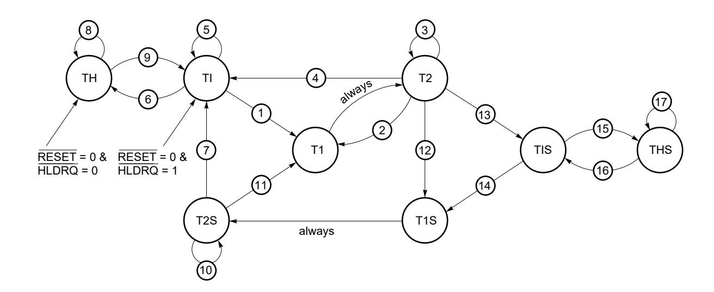

### **3.2.5 Memory and I/O access (16-bit bus fixed mode)**

The following describes the memory read/write cycle and I/O read/write cycle. In the 16-bit bus fixed mode, the A1 signal is valid for addresses.

### **(1) Memory read cycle**

Output of an address is started in the T1 state and, at the same time, the BCYST signal indicating the start of the bus cycle becomes active. When the space outputting the chip select signal is accessed, the chip select signal is output at the falling edge of the T1 state clock. The T2 state starts next, in which the address continues to be output, the BCYST signal becomes inactive, and the DA signal becomes active.

At the falling edge of the clock in the T2 state, the READY signal and the HLDRQ signal are sampled. The next state is set according to the states of these signals.

- When the READY signal is inactive

The T2 state is repeated again.

- When the READY signal is active and the HLDRQ signal is inactive at the same time

In halfword/byte data access, the data on the data bus is read at the rising edge of the clock and the T2 state ends.

In word data access, the data is read at the rising edge of the clock, the T1S state starts, and the bus cycle is added. In the T1S and T2S states, the timing is the same as the T1 and T2 states except that the A1 signal becomes high level.

- When both the READY signal and the HLDRQ signal are active

The state changes from the T2 state to the TI state.

Figure 3-20 shows the timing chart of the memory read cycle.

**Figure 3-20. Memory Read Cycle (16-bit bus fixed mode)**

**Note** A31 to A1, ST1, ST0, BE1, BE0, ADRSERR

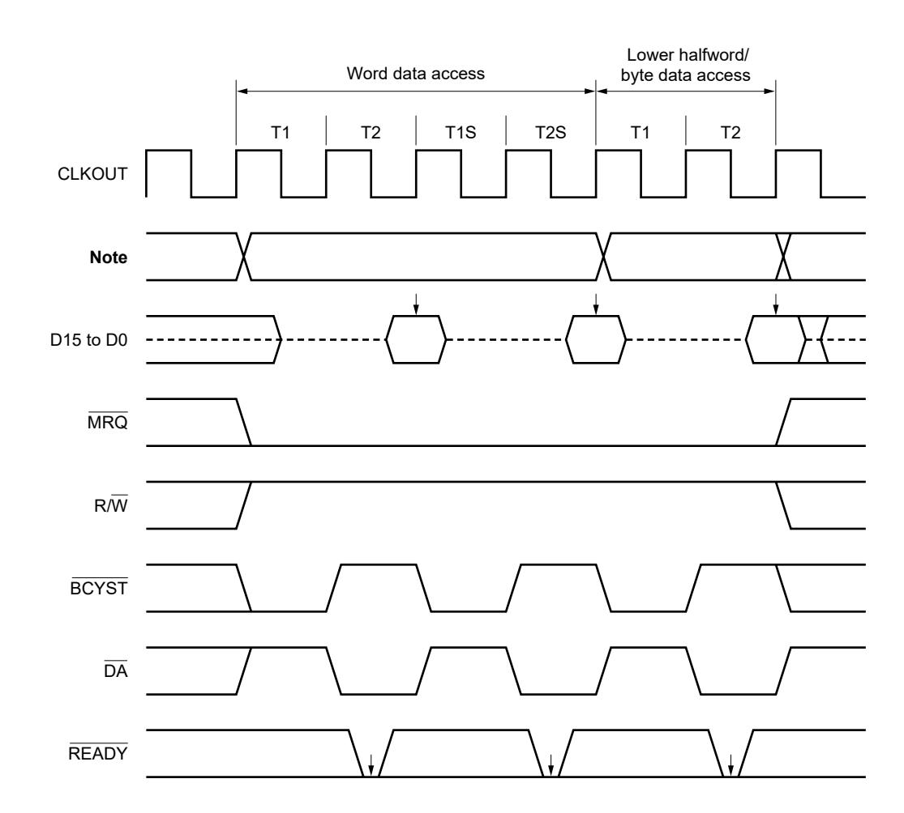

### **(2) Memory write cycle**

Output of write data is started at the falling edge of the clock in the T1 state. After that, output is held until the TH state starts or the clock in the T1 state (the T1S state during the word data access) of the next bus cycle falls. The statuses of the pins except D15 to D0 and R/W are the same as those in the read cycle.

Figure 3-21 shows the timing chart of the memory write cycle.

**Figure 3-21. Memory Write Cycle (16-bit bus fixed mode)**

**Note** A31 to A1, ST1, ST0, BE1, BE0, ADRSERR

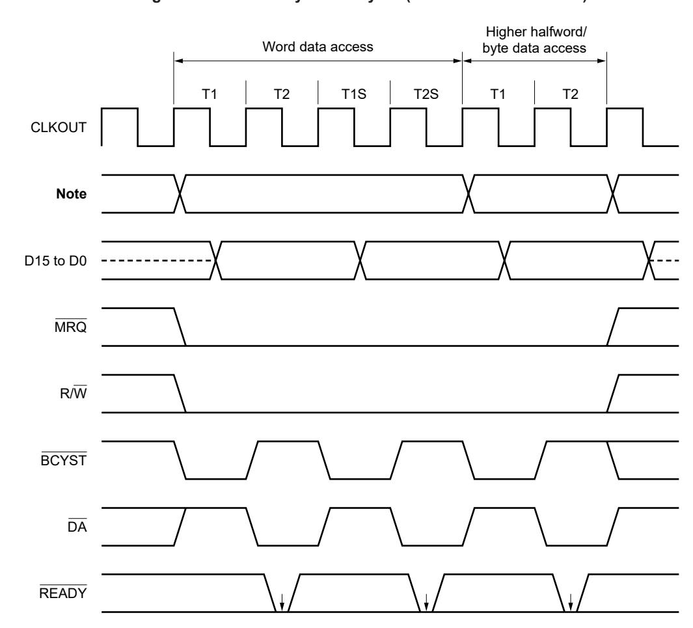

### **(3) I/O read cycle**

Output of an address is started in the T1 state and, at the same time, the BCYST signal indicating the start of the bus cycle becomes active.

When the space outputting the chip select signal is accessed, the chip select signal is output at the falling edge of the T1 state clock. The T2 state starts next, in which the address continues to be output, the BCYST signal becomes inactive, and the DA signal becomes active.

At the falling edge of the clock in the T2 state, the READY signal and the HLDRQ signal are sampled. The next state is set according to the states of these signals.

- When the READY signal is inactive

The T2 state is repeated again.

- When the READY signal is active and the HLDRQ signal is inactive at the same time

In halfword/byte data access, the data on the data bus is read at the rising edge of the clock and the T2 state ends.

In word data access, the data is read at the rising edge of the clock, the T1S state starts, and the bus cycle is added. In the T1S and T2S states, the timing is the same as the T1 and T2 states except that the A1 signal becomes high level.

- When both the READY signal and the HLDRQ signal are active

The state changes from the T2 state to the TI state.

Figure 3-22 shows the timing chart of the I/O read cycle.

**Figure 3-22. I/O Read Cycle (16-bit bus fixed mode)**

**Note** A31 to A1, ST1, ST0, BE1, BE0, ADRSERR

**Remark** The dotted lines in the figure indicate the high-impedance state.

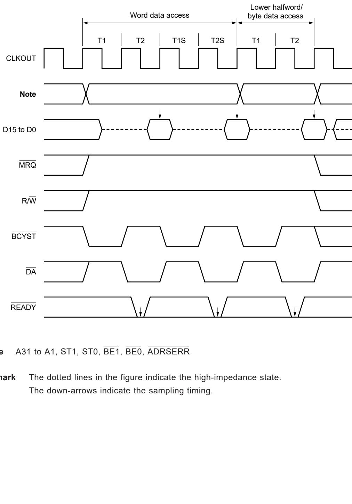

### **(4) I/O write cycle**

Output of write data is started at the falling edge of the clock in the T1 state. After that, output is held until the TH state starts or the clock in the T1 state (the T1S state during the word data access) of the next bus cycle falls. The statuses of the pins except D15 to D0 and R/W are the same as those in the read cycle.

Figure 3-23 shows the timing chart of the I/O write cycle.

**Figure 3-23. I/O Write Cycle (16-bit bus fixed mode)**

**Note** A31 to A1, ST1, ST0, BE1, BE0, ADRSERR

**Remark** The down-arrows indicate the sampling timing.

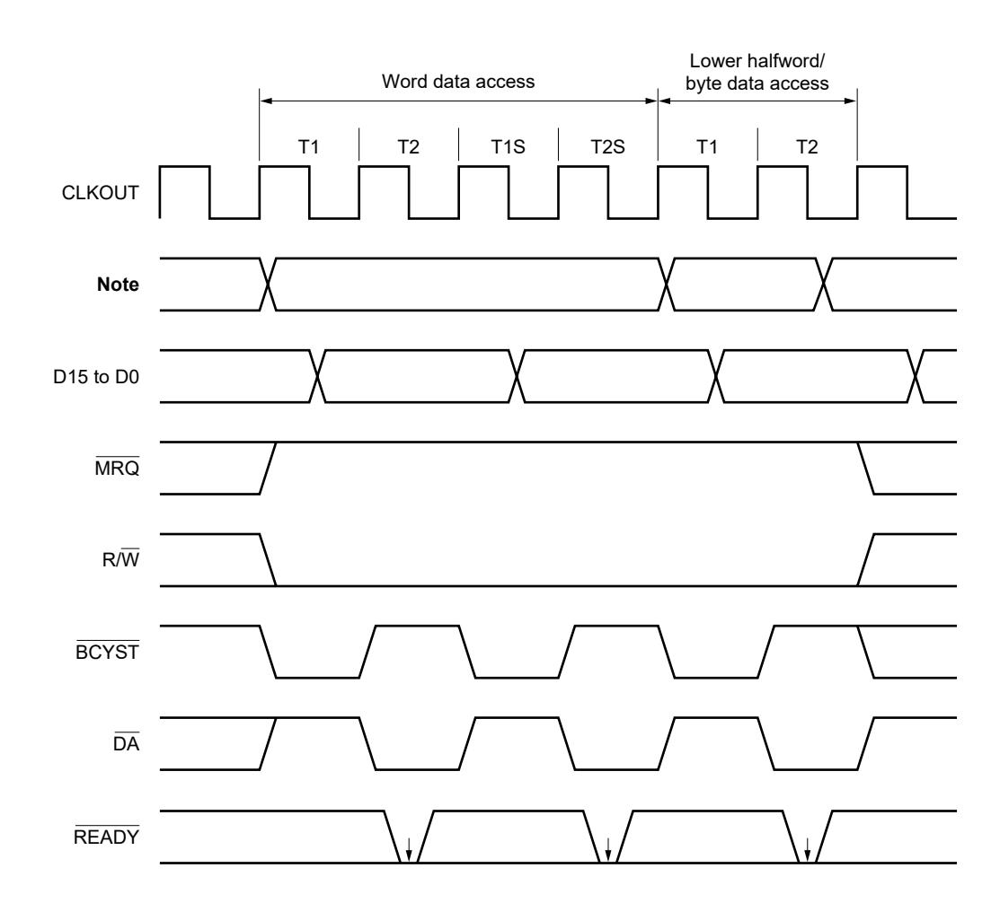

### **3.2.6 Machine fault cycle (16-bit bus fixed mode)**

The MRQ, ST1 and ST0 signals are used to indicate the machine fault status (see **Table 2-1 Status**), and the cause code of a fatal exception (logical sum of FFFF0000H and an exception code), and the current contents of the PSW and PC are sequentially output in the write cycle to the data bus. Table 3-4 shows the correspondence between the data bus status and address bus status.

The wait and bus hold requests are valid in the above write cycle.

**Table 3-4. Correspondence between Address Bus and Data Bus during Machine Fault Cycle (16-bit bus fixed mode)**

|   | Address bus | Data bus                                              |
|---|-------------|-------------------------------------------------------|
|   | (A31 to A1) | (D15 to D0)                                           |
| 1 | 00000000H   | Cause code of fatal exception (lower)                 |
| 2 | 00000002H   | Cause code of fatal exception (higher) (always FFFFH) |
| 3 | 00000004H   | Current PSW value (lower)                             |
| 4 | 00000006H   | Current PSW value (higher)                            |
| 5 | 00000008H   | Current PC value (lower)                              |
| 6 | 0000000AH   | Current PC value (higher)                             |

Even after the machine fault cycle ends, the MRQ, ST1 and ST0 signals retain the bus status of the machine fault.

The machine fault status can be released only by reset input. The HLDRQ and READY signal requests are valid even in the machine fault cycle and in the subsequent TI state.

The following shows the timing of the machine fault cycle.

**Figure 3-24. Machine Fault Cycle (16-bit bus fixed mode)**

**Notes 1.** ST1, ST0, BE1, BE0

**2.** Cause code of fatal exception

**Remark** The dotted lines in the figure indicate the high-impedance state.

The down-arrows indicate the sampling timing.

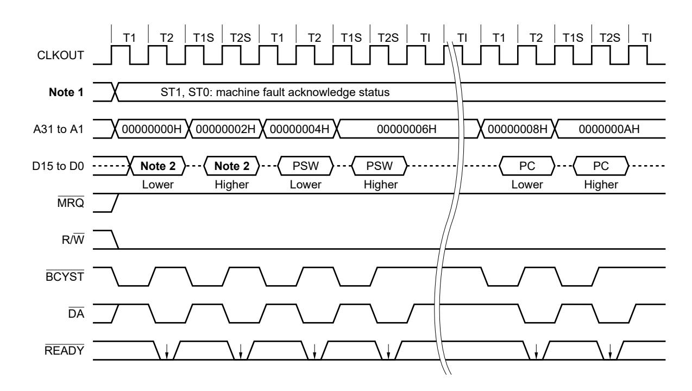

### **3.2.7 Halt acknowledge cycle (16-bit bus fixed mode)**

The MRQ, ST1 and ST0 signals indicate the halt acknowledge cycle (See **Table 2-1 Status**), and the contents of the PC when the HALT instruction is executed are output in the write cycle to the address bus. The lower 16 bits of the PSW are output to the data bus by halfword.

The wait and bus hold requests are valid in the above write cycle.

Figure 3-25 shows the timing of the halt acknowledge cycle.

**Figure 3-25. Halt Acknowledge Cycle (16-bit bus fixed mode)**

**Note** ST1, ST0, BE1, BE0

**Remark** The dotted line in the figure indicates the high-impedance state.

The down-arrow indicates the sampling timing.

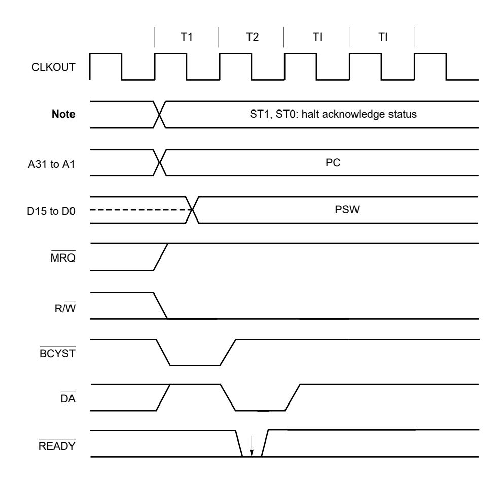

# **3.3 Timing of Control Signals**

### **3.3.1 Bus lock**

To disable the use of the bus mastership by bus masters other than the V805 and V810, set the bus lock state by making the BLOCK signal active. Bus lock takes place when the CAXI instruction is executed. When the lock word is accessed with the CAXI instruction, the BLOCK signal changes as follows:

- Turns active in synchronization with the start of the read cycle (the BCYST signal is active)
- Turns inactive in synchronization with the end of the last write cycle (the DA signal is inactive)

Figure 3-26 shows the bus lock timing chart (when the CAXI instruction is executed).

**Figure 3-26. Bus Lock (when the CAXI instruction is executed)**

**(1) 32-bit bus mode (V810)**

**Notes 1.** ST1, ST0, BE3 to BE0

- **2.** ST1, ST0 = "data access", BE3 to BE0 = "0000"
- **3.** Read data

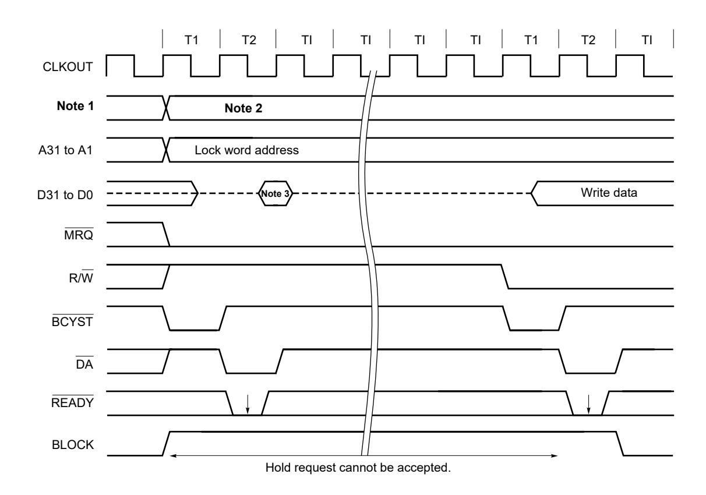

### **(2) 16-bit bus fixed mode (V805, V810)**

**Notes 1.** ST1, ST0, BE3 to BE0 (V810)

ST1, ST0, BE1, BE0 (V805)

**2.** ST1, ST0 = "data access", BE3 to BE0 = "0000" (V810)

ST1, ST0 = "data access", BE1, BE0 = "00" (V805)

**3.** Read data

**Remark** The dotted lines in the figure indicate the high-impedance state.

The down-arrows indicate the sampling timing.

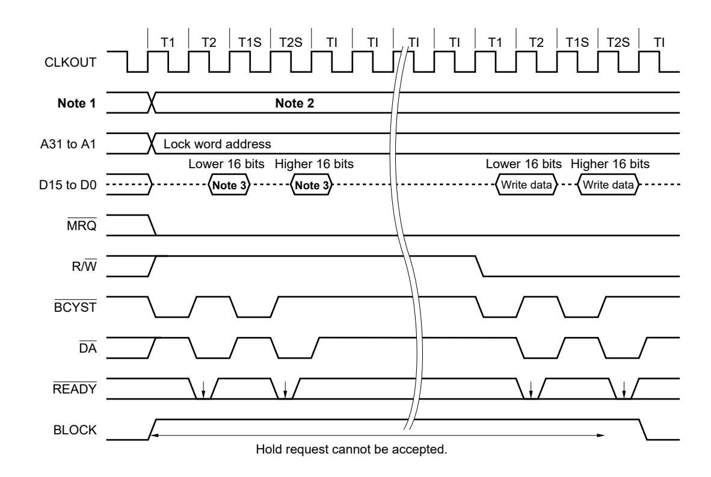

### **3.3.2 Bus hold**

When the external bus master requests the bus mastership to the V805 and V810, they float the bus to transfer it and set into the bus hold state.

Bus hold starts at the same time as the HLDAK signal becomes active. Bus hold ends half a clock after the high level of the HLDRQ signal is sampled.

However, bus hold requests are not accepted from when the BLOCK signal becomes active to immediately before the last bus cycle of the bus lock cycle (last T2, or last T2S for the bus sizing). In the last bus cycle, bus hold requests are accepted.

Figure 3-27 shows the timing when the bus hold state is set.

**Figure 3-27. Bus Hold Timing of External Bus Master**

**Notes 1.** A31 to A1, BE3 to BE0, ST1, ST0, R/W, MRQ (V810)

A31 to A1, BE1, BE0, ST1, ST0, R/W, MRQ (V805)

**2.** D31 to D0 (V810)

D15 to D0 (V805)

**3.** Read data

**Remark** The dotted lines in the figure indicate the high-impedance state.

The down-arrows indicate the sampling timing.

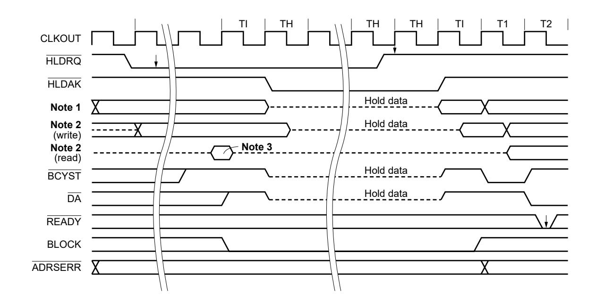

**[MEMO]**

# **CHAPTER 4 INTERRUPT AND EXCEPTION Table 4-1. Exception Codes Table 4-2. Instructions Aborted by Interrupt** Instructions aborted by interrupt DIV/DIVU instruction Floating-point operation instructions

Interrupts are events that take place independently of the program execution and can be classified into maskable interrupts and a non-maskable interrupt. An exception is an event that takes place depending upon the program execution. There is little difference between the interrupt and exception in terms of flow, but the interrupt takes precedence over the exception.

The V805 and V810 are provided with the interrupts and exceptions listed in the table below. If an exception, a maskable interrupt or NMI occurs, control is transferred to a handler whose address is determined by the source of the interrupt or exception. The exception source can be checked by examining an exception code stored in the ECR (Exception Code Register). Each handler analyzes the contents of the ECR and performs appropriate exception/interrupt servicing.

| Exception and interrupt                    | Classification   | Exception code | Handler address | Restore PC Note 1 |
|--------------------------------------------|------------------|----------------|-----------------|-------------------|
| Reset                                      | Interrupt        | F F F 0        | F F F F F F F 0 | Note 2            |
| NMI                                        | Interrupt        | F F D 0        | F F F F F F D 0 | next PC Note 3    |
| Duplexed exception                         | Exception        | Note 4         | F F F F F F D 0 | current PC        |
| Address trap                               | Exception        | F F C 0        | F F F F F F C 0 | current PC        |
| Trap instruction (parameter is 0x1n)       | Exception        | F F B n        | F F F F F F B 0 | next PC           |
| Trap instruction (parameter is 0x0n)       | Exception        | F F A n        | F F F F F F A 0 | next PC           |
| Invalid instruction code                   | Exception        | F F 9 0        | F F F F F F 9 0 | current PC        |
| Zero division                              | Exception        | F F 8 0        | F F F F F F 8 0 | current PC        |
| FIV (floating-point invalid operation)     | Exception        | F F 7 0        | F F F F F F 6 0 | current PC        |
| FZD (floating-point zero division)         | Exception        | F F 6 8        | F F F F F F 6 0 | current PC        |
| FOV (floating-point overflow)              | Exception        | F F 6 4        | F F F F F F 6 0 | current PC        |
| FUD (floating-point underflow)             | Note 5 Exception | F F 6 2        | F F F F F F 6 0 | current PC        |
| FPR (floating-point precision degradation) | Note 5 Exception | F F 6 1        | F F F F F F 6 0 | current PC        |
| FRO (floating-point reserved operand)      | Exception        | F F 6 0        | F F F F F F 6 0 | current PC        |
| INT level n (n = 0 to 15)                  | Interrupt        | F E n 0        | F F F F F E n 0 | next PC Note 3    |

**Notes 1.** PC to be saved to EIPC or FEPC.

- **2.** EIPC and FEPC are undefined.
- **3.** While an instruction whose execution is aborted by an interrupt (refer to **Table 4-2**) is executed, restore PC = current PC.
- **4.** The exception code of the exception that occurs for the first time is stored to the lower 16 bits of the ECR, and that of the second exception is stored in the higher 16 bits.
- **5.** In the V805 and V810, the floating-point underflow exception and floating-point precision degradation exception do not occur.

| Instructions aborted by interrupt                                                                       |
|---------------------------------------------------------------------------------------------------------|
| 
DIV/DIVU instruction
 
Floating-point operation instructions
 
Bit string instructions
 |

### **4.1 Exception Processing**

If an exception occurs, the processor performs the following processing and transfers control to a handler routine:

- (1) If the NP of the PSW has been already set, proceeds to (8) Fatal exception processing.
- (2) If the EP of the PSW has been already set, proceeds to (9) Duplexed exception processing.
- (3) Saves the restore PC to the EIPC.
- (4) Saves the current PSW to the EIPSW.
- (5) Writes the exception code to the lower 16 bits of the ECR (EICC).
- (6) Sets the EP and ID bits of the PSW and clears the AE bit.
- (7) Jumps to the handler address.
- (8) Fatal exception processing
  - (a) Indicates the machine fault status by using the ST1, ST0 and MRQ signals and starts the write cycle, and sequentially outputs the source code (OR of FFFF0000H and exception code) of the fatal exception at address 00000000H, the current PSW at address 00000004H, and the current PC at address 00000008H to the data bus.
  - (b) Halts until reset.
- (9) Duplexed exception processing
  - (a) Saves the restore PC to the FEPC.
  - (b) Saves the current PSW to the FEPSW.
  - (c) Writes the exception code of the source that causes the duplexed exception to the higher 16 bits of the ECR (FECC).
  - (d) Sets the NP and ID bits of the PSW and clears the AE bit.
  - (e) Jumps to address FFFFFFD0H (NMI handler address).

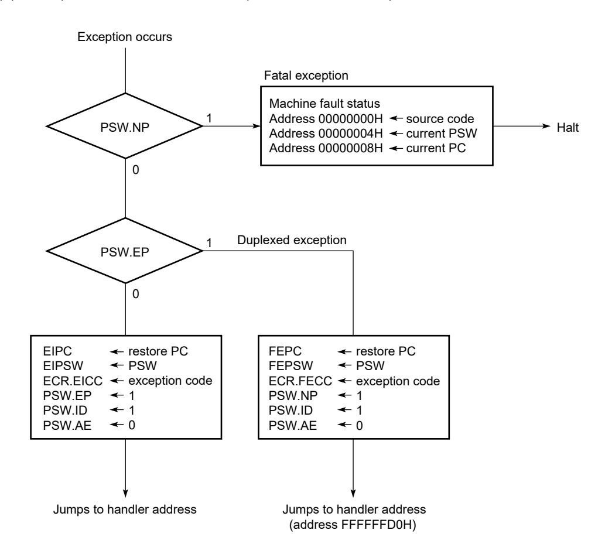

# **4.2 Interrupt Servicing**

### **4.2.1 Maskable interrupt**

A maskable interrupt occurs when a high level signal is input to the INT pin. An INT input signal is sampled at the rising edge of the clock. An interrupt request is detected when the following three conditions are satisfied. The detected interrupt request and interrupt level are internally held while (a) is satisfied.

- (a) When the NP flag, EP flag and ID flag in the PSW are all "0".
- (b) When the interrupt level of the INTV3 to the INTV0 pins are higher than the interrupt enable level in the PSW.
- (c) When the INT pin is active.

The V805 and V810 check for an interrupt request, and accept if there is a request.

- When an instruction ends.
- During the execution of an instruction that is interrupted with an interruption.
- When no internal servicing is executed at all.

The INTV3 to INTV0 are signals that represent interrupt levels for the CPU. There are 16 interrupt levels from 0 to 15. The signal is sampled at the rising edge of the clock.

The INT and INTV3 to INTV0 signals should hold the active level (changing to a higher priority interrupt level is possible) until the CPU starts an interrupt servicing and informs the peripherals using a software that the CPU accepted the interrupt.

**Figure 4-1. Maskable Interrupt Request Timing**

If a maskable interrupt is caused to occur by the INT input, the processor performs the servicing described below, and transfers control to the handler routine. The EIPC and EIPSW are used to save the contents of the PC and PSW.

The maskable interrupt is masked by logical sum of the NP, EP and ID of the PSW. Moreover, the interrupt is not accepted if the interrupt level n of INTV3 to INTV0 is lower than the interrupt enable level (I3 to I0) of the PSW (n < I3 to I0). Therefore, the interrupt of the highest level (n = 15) cannot be disabled by the interrupt enable level.

- (1) Saves the restore PC to the EIPC.
- (2) Saves the current PSW to the EIPSW.
- (3) Writes the exception code to the lower 16 bits of the ECR (EICC).
- (4) Sets the EP and ID bits of the PSW and clears the AE bit.
- (5) Sets a value resulting from adding 1 to the level n of the interrupt accepted (i.e., n + 1) to the I (I3 to I0) field of the PSW. However, sets 15 if the level of the accepted interrupt is the highest (n = 15).
- (6) Jumps to the handler address.

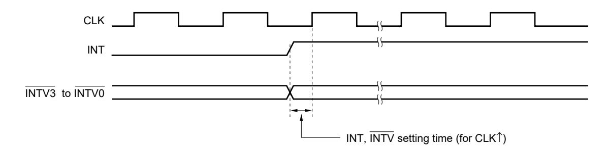

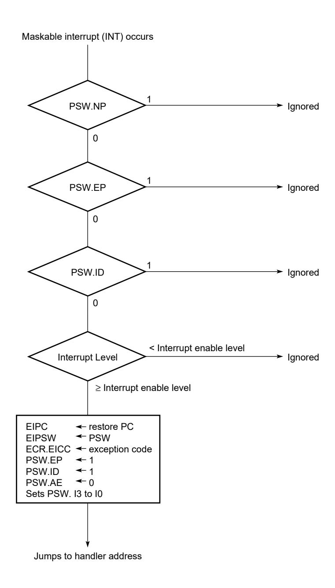

### **4.2.2 Non-maskable interrupt**

A non-maskable interrupt is sampled at the falling edge of the clock.

An interrupt request is detected when a sampled value is changed from "H" to "L". The detected interrupt request is internally held until the CPU starts the interrupt servicing.

**Figure 4-2. Non-maskable Interrupt Request Timing**

If the non-maskable interrupt is caused to occur by the NMI input, the processor performs the servicing described below and transfers control to the handler routine. The FEPC and FEPSW are used to save the contents of the PC and PSW. If another non-maskable interrupt request occurs while a non-maskable interrupt is serviced (the NP bit of the PSW is 1), the interrupt request is internally held by the processor (a non-maskable interrupt request that occurs during a period in which the latch is cleared by the internal servicing, immediately after the start of servicing the first non-maskable interrupt, is not held in the internal latch of the processor). At this time, if the NP bit of the PSW is cleared to 0 by using the RETI and LDSR instructions, the non-maskable interrupt request internally held by the processor starts new non-maskable interrupt servicing.

- (1) Saves the restore PC to the FEPC.
- (2) Saves the current PSW to the FEPSW.
- (3) Writes the exception code to the higher 16 bits of the ECR (FECC).
- (4) Sets the NP and ID bits of the PSW and clears the AE bit.
- (5) Jumps to address FFFFFFD0H (NMI handler address).

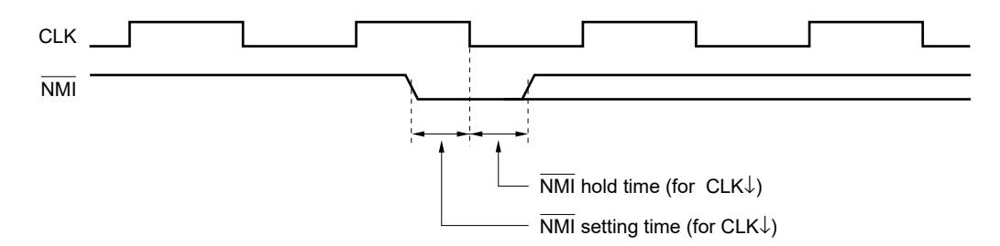

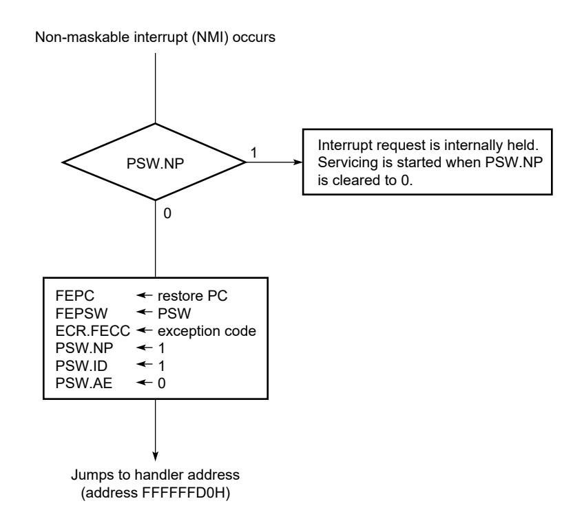

### **4.3 Returning from Exception/Interrupt**

To return from an exception event other than the fatal exception, the RETI instruction is used.

- (1) If NP of PSW = 1, the restore PC and PSW are restored from the FEPC and FEPSW; if NP = 0, the PC and PSW are restored from the EIPC and EIPSW.
- (2) Restores the restore PC and PSW, and jumps to the PC.

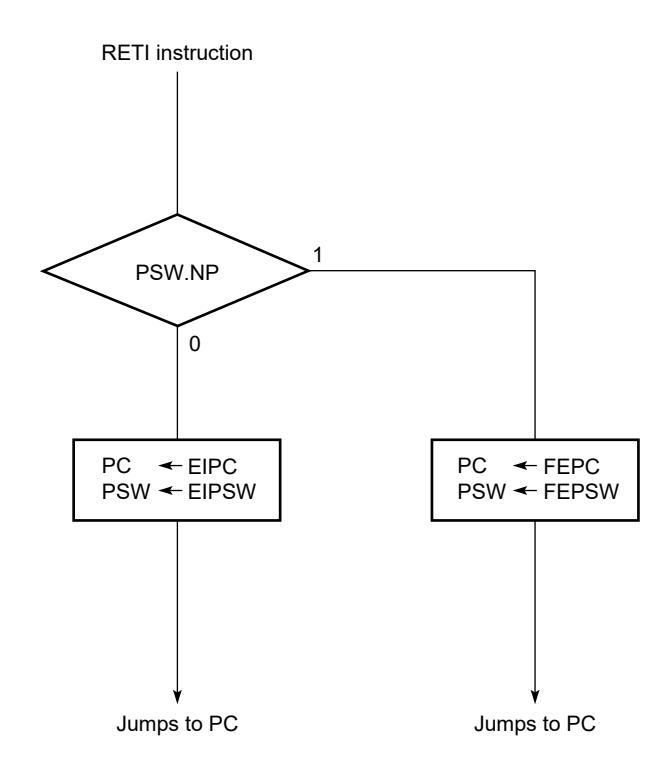

# **4.4 Priority**

### **4.4.1 Priorities of interrupts and exceptions**

The following table shows the priorities of the interrupts and exceptions. If two or more interrupts or exceptions occur simultaneously, they are processed or serviced according to their priorities.

**Table 4-3. Priorities of Interrupts and Exceptions**

|       | RESET | NMI | INT AD-TR | TRAP I-OPC | DIV0 FLOAT |
|-------|-------|-----|-----------|------------|------------|
| RESET |       | *   | * *       | * *        | * *        |
| NMI   | x     |     | ¨ ¨       | ¨ ¨        | ¨ ¨        |
| INT   | x     |     | ¨         | ¨ ¨        | ¨ ¨        |
| AD-TR | x     |     |           | ¨ ¨        | ¨ ¨        |
| TRAP  | x     |     |           | –          | – –        |
| I-OPC | x     |     |           | –          | – –        |
| DIV0  | x     |     |           | – –        | –          |
| FLOAT | x     |     |           | – –        | –          |

RESET : Reset

AD-TR : Address trap

TRAP : Trap instruction

I-OPC : Illegal op code

DIV0 : Zero division

FLOAT : Floating-point exceptions (invalid operation, zero division, overflow, and reserved operand exceptions)

\* : Item shown on the left ignores the item above.

x : Item shown on the left is ignored by the item above.

– : Item shown on the left does not occur simultaneously with the item above.

← : Item shown on the left has a higher priority than the item above.

↑ : Item shown above has a higher priority than the item shown on the left.

### **4.4.2 Priorities of floating-point operation exceptions**

Table 4-4 shows the priorities of the floating-point operation exceptions.

**Table 4-4. Priorities of Floating-Point Operation Exceptions**

|     | FRO | FIV | FZD | FOV FUD | FPR |
|-----|-----|-----|-----|---------|-----|
| FRO |     | *   | *   | * –     | –   |
| FIV | x   |     | *   | * –     | –   |
| FZD | x   | x   |     | * –     | –   |
| FOV | x   | x   | x   | –       | –   |
| FUD | –   | –   | –   | –       | –   |
| FPR | –   | –   | –   | – –     |     |

FRO : Floating-point reserved operand

FIV : Floating-point invalid operation

FZD : Floating-point zero division

FOV : Floating-point overflow

FUD : Floating-point underflow

FPR : Floating-point precision degradation

\* : Item shown on the left ignores the item above.

x : Item shown on the left is ignored by the item above.

– : Item shown on the left does not occur simultaneously with the item above.

### **4.4.3 Interrupt execution timing**

An interrupt is accepted when an instruction is executed. However, if the instruction takes two or more clocks to be executed, the interrupt is accepted during the period of the last one clock of the instruction. Therefore, if an interrupt request is issued while no instruction is executed (in wait or bus hold status), the interrupt is accepted when the next instruction is executed.

### **5.1 Reset**

The V805 and V810 can be reset by inputting low level to the RESET pin regardless of the state of the device. Each output pin enters the state shown in Table 5-1 at the rising edge of the clock 0.5 to 2.5 clocks after low level of the RESET pin is detected.

For the pin state in bus hold status during the reset period, refer to **2.4 Pin State**.

**Table 5-1. State of Each Output Pin after Reset**

|            | Output Pin                                                                | Pin State      |
|------------|---------------------------------------------------------------------------|----------------|
| V805       | A31 to A1, BE1, BE0, ST1, ST0, DA, MRQ, R/W, BCYST, ADRSERR, HLDAK Note   | High-level     |
| V810       | A31 to A2, BE3 to BE0, ST1, ST0, DA, MRQ, R/W, BCYST, ADRSERR, HLDAK Note |                |
|            | A1 16-bit bus mode                                                        |                |
|            | Except 16-bit bus mode                                                    | Low-level      |
| V805, V810 | BLOCK                                                                     |                |
| V805       | D15 to D0                                                                 | High-impedance |
| V810       | D31 to D0                                                                 |                |

**Note** High-level in the states other than bus hold status

Internal hardware is initialized if the RESET pin is returned to high level after held to low level for 20 clocks or more. If the HLDRQ pin is not active, a memory read cycle is started for instruction fetch.

**Table 5-2. Initial Value of Each Register**

| Register  | Initial Value |
|-----------|---------------|
| r0        | 00000000H     |
| r1 to r31 | Undefined     |
| PC        | FFFFFFFFH     |
| EIPC      | Undefined     |
| EIPSW     | Undefined     |
| FEPC      | Undefined     |
| FEPSW     | Undefined     |
| ECR       | 0000FFF0H     |
| PSW       | 00008000H     |
| TKCW      | 000000E0H     |
| CHCW      | 00000000H     |
| ADTRE     | Undefined     |

The 805 and V810 can be placed in the bus hold status even during the reset period (while the RESET pin is held to low level) by setting the HLDRQ pin to the active level. The reset timing is shown in Figure 5-1.

**Figure 5-1. Reset Timing**

- **Notes 1.** Rising synchronous signals of the clock such as A31 to A1, BE3 to BE0: V810 (BE1, BE0: V805), ST1, ST0, MRQ, R/W, BCYST, DA, ADRSERR, HLDAK, and BLOCK.
  - **2.** Undefined (during power on)

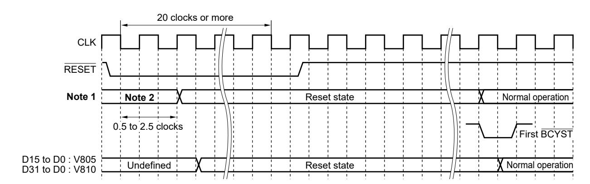

# **5.2 Stopping Clock**

The V805 and V810 can stop clock at any timings except during the clock stop exception period. The clock can be stopped either in "H" or "L" level.

The clock stop exception period means the reset period immediately after power on (the period when the low level of the RESET pin: 20 clocks or more). For details, refer to **5.1 Reset**.

**[MEMO]**

Although NEC has taken all possible steps to ensure that the documentation supplied to our customers is complete, bug free and up-to-date, we readily accept that errors may occur. Despite all the care and precautions we've taken, you may encounter problems in the documentation. Please complete this form whenever you'd like to report errors or suggest improvements to us.

### **Hong Kong, Philippines, Oceania**

NEC Electronics Hong Kong Ltd. Fax: +852-2886-9022/9044

### **Korea**

NEC Electronics Hong Kong Ltd. Seoul Branch Fax: 02-528-4411

### **Taiwan**

NEC Electronics Taiwan Ltd. Fax: 02-719-5951

Address

### **North America**

NEC Electronics Inc. Corporate Communications Dept. Fax: 1-800-729-9288

### **Europe**

NEC Electronics (Europe) GmbH Technical Documentation Dept. Fax: +49-211-6503-274

### **South America**

NEC do Brasil S.A. Fax: +55-11-889-1689

### **Asian Nations except Philippines**

NEC Electronics Singapore Pte. Ltd. Fax: +65-250-3583

### **Japan**

NEC Corporation Semiconductor Solution Engineering Division Technical Information Support Dept. Fax: 044-548-7900

I would like to report the following error/make the following suggestion:

Document title:

Document number: Page number:

Thank you for your kind support.

If possible, please fax the referenced page or drawing.

| Document Rating    | Excellent                | Good                     | Acceptable               | Poor                     |
|--------------------|--------------------------|--------------------------|--------------------------|--------------------------|
| Clarity            | <input type="checkbox"/> | <input type="checkbox"/> | <input type="checkbox"/> | <input type="checkbox"/> |
| Technical Accuracy | <input type="checkbox"/> | <input type="checkbox"/> | <input type="checkbox"/> | <input type="checkbox"/> |
| Organization       | <input type="checkbox"/> | <input type="checkbox"/> | <input type="checkbox"/> | <input type="checkbox"/> |

Name

Company

From:

Tel. FAX

# **Facsimile Message**