# **V810TM 32-BIT MICROPROCESSOR**

The µPD70732 (a.k.a. V810) microprocessor is NEC's first microprocessor of the V810 familyTM for embedded control applications.

The V810 employs a RISC architecture for embedded control applications. This product has high-speed real time response, high-speed integer operation instruction, bit string instruction, floating-point operation instruction, and significantly high cost performance is realized for applications such as facsimile, digital PPC, word processor, image processor, real time control device, etc.

**The functions are described in detail in the following User's Manuals, which should be read before starting design work.**

- **V805TM, V810 User's Manual Hardware : U10661E**
- **V810 Family User's Manual Architecture : U10082E**

#### **Features**

- High-performance 32-bit architecture for embedded control application
- 32-bit separate address/data bus
- 1-Kbyte cache memory
- Pipeline structure of 1 clock pitch
- 16-bit fixed instructions (with some exceptions)
- 32-bit general-purpose registers: 32
- 4-Gbyte linear address space
- Register/flag hazard interlocked by hardware Dynamic bus sizing function (16 bits) 16-bit bus fixing function 16-bit bus system can be configured. Instructions ideal for various application fields
- Floating-point operation instructions (based upon IEEE754 data format)
- Bit string instructions 16 levels of high-speed interrupt responses Clock can be stopped by internal static operation Maximum operating frequency: 16/20/25 MHz Low voltage: VDD = 2.7 to 3.6 V (Max. 16 MHz) VDD = 2.2 to 3.6 V (Max. 10 MHz) Small package versions available (14 x 14 mm fine-pitch TQFP) H

#### **Ordering Information**

|   | Part Number      | Package                                        | Max. operating freq. (MHz) |
|---|------------------|------------------------------------------------|----------------------------|
| µ | PD70732GD-16-LBB | 120-pin plastic QFP (28 x 28 mm)               | 16                         |
| µ | PD70732GD-20-LBB | 120-pin plastic QFP (28 x 28 mm)               | 20                         |
| µ | PD70732GD-25-LBB | 120-pin plastic QFP (28 x 28 mm)               | 25                         |
| µ | PD70732GC-25-9EV | 120-pin plastic TQFP (Fine pitch) (14 x 14 mm) | 25                         |
| µ | PD70732R-25      | 176-pin ceramic PGA (Seam weld)                | 25                         |

#### **Pin Outline**

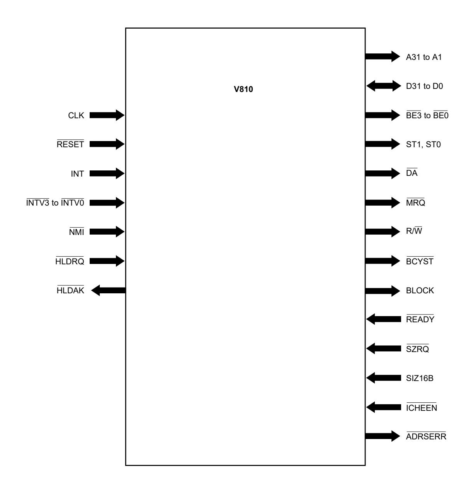

#### **Pin Configuration**

**• 120-pin plastic QFP (28 x 28 mm) (Top View)**

µPD70732GD-xx-LBB

**Cautions 1. Leave the IC1 pin open. 2. Connect the IC2 pin to GND.**

**Remark** IC: Internally Connected

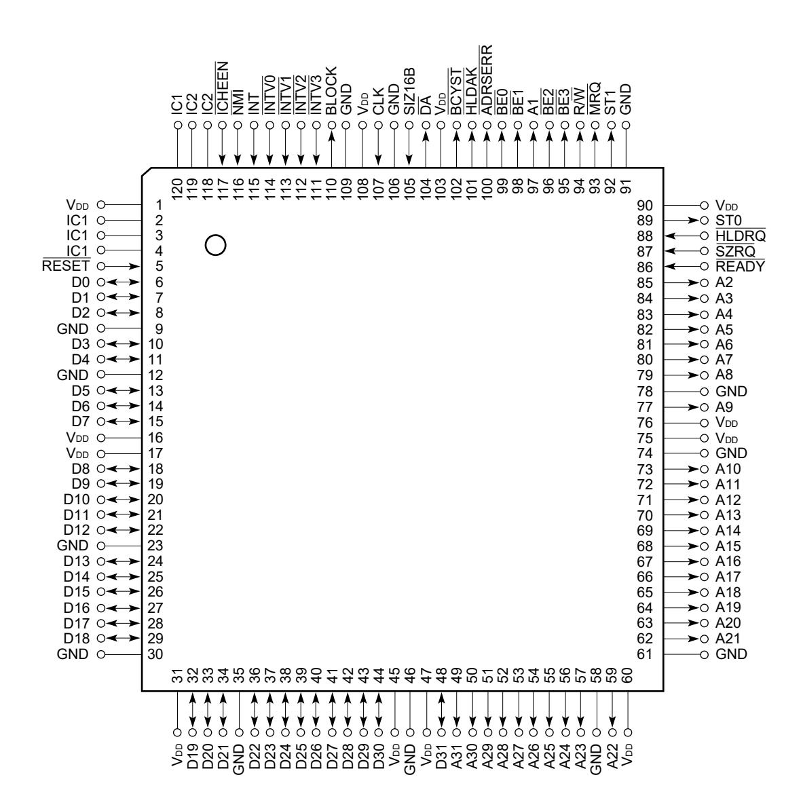

**• 120-pin plastic TQFP (Fine pitch) (14 x 14 mm) (Top View)** µPD70732GC-25-9EV H

> **Cautions 1. VDD is power supply pin. All VDD pins should be connected to a +5V power supply (the same power supply). 2. GND is ground pin. All GND pins should be connected to the same GND. 3. Leave the IC1 pin open. 4. Connect the IC2 pin to GND.**

**Remark** IC: Internally Connected

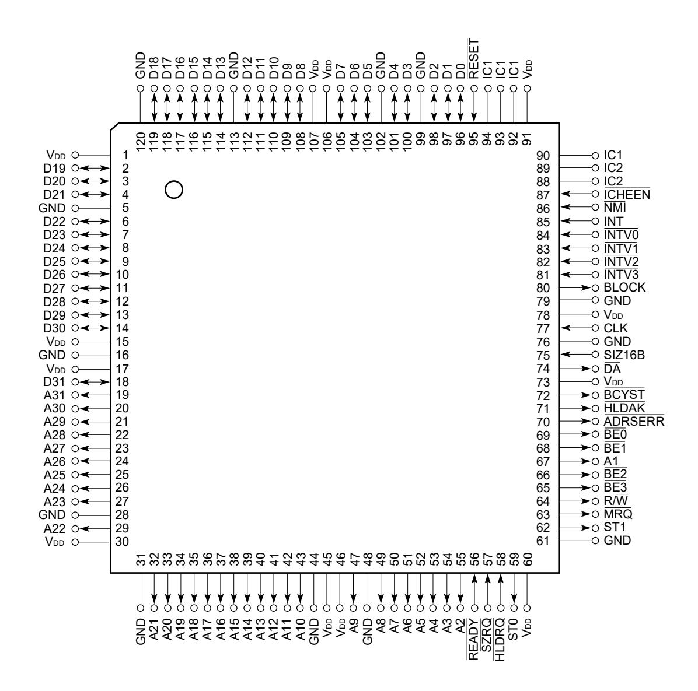

- **176-pin ceramic PGA (Seam weld)** µPD70732R-25

**Remark** The insertion guide pin is not included in the number of pins.

| No. | Signal | No. | Signal | No. | Signal | No. | Signal |
|-----|--------|-----|--------|-----|--------|-----|--------|
| A1  | IC2    | B3  | GND    | C5  | VDD    | D7  | VDD    |
| A2  | D12    | B4  | D11    | C6  | D8     | D8  | VDD    |
| A3  | D13    | B5  | GND    | C7  | VDD    | D9  | GND    |
| A4  | D10    | B6  | D7     | C8  | D4     | D10 | IC3    |
| A5  | GND    | B7  | VDD    | C9  | D2     | D11 | IC2    |
| A6  | D6     | B8  | D3     | C10 | IC3    | D12 | GND    |
| A7  | IC2    | B9  | GND    | C11 | VDD    | D13 | INT    |
| A8  | D5     | B10 | D0     | C12 | IC1    | D14 | INTV1  |
| A9  | IC2    | B11 | GND    | C13 | IC2    | D15 | GND    |
| A10 | D1     | B12 | IC1    | C14 | VDD    | E1  | D27    |
| A11 | VDD    | B13 | GND    | C15 | NMI    | E2  | D25    |
| A12 | RESET  | B14 | IC1    | D1  | D23    | E3  | D21    |
| A13 | IC1    | B15 | ICHEEN | D2  | D22    | E4  | D19    |
| A14 | IC1    | C1  | VDD    | D3  | D20    | E12 | IC3    |
| A15 | IC2    | C2  | VDD    | D4  | GND    | E13 | INTV0  |
| B1  | D17    | C3  | D16    | D5  | D15    | E14 | IC3    |
| B2  | D18    | C4  | D14    | D6  | D9     | E15 | IC1    |

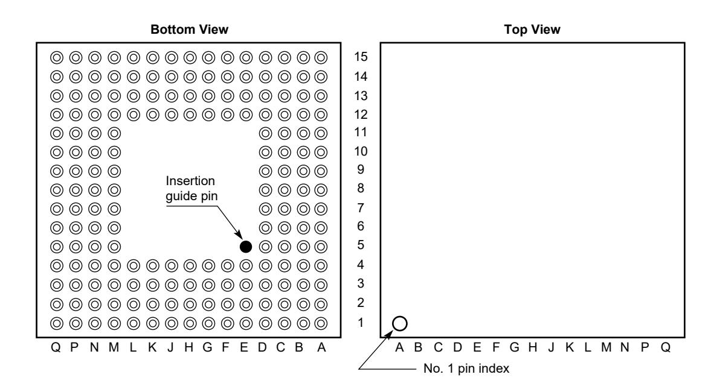

| No. | Signal | No. | Signal | No. | Signal | No. | Signal  |
|-----|--------|-----|--------|-----|--------|-----|---------|
| F1  | VDD    | J4  | VDD    | M7  | VDD    | P4  | A12     |
| F2  | D26    | J12 | IC2    | M8  | A5     | P5  | GND     |
| F3  | D24    | J13 | IC2    | M9  | VDD    | P6  | A8      |
| F4  | GND    | J14 | IC1    | M10 | ST1    | P7  | GND     |
| F12 | INTV2  | J15 | IC1    | M11 | A1     | P8  | A6      |
| F13 | INTV3  | K1  | IC2    | M12 | GND    | P9  | GND     |
| F14 | VDD    | K2  | A27    | M13 | BCYST  | P10 | SZRQ    |
| F15 | GND    | K3  | A25    | M14 | DA     | P11 | GND     |
| G1  | D29    | K4  | A24    | M15 | SIZ16B | P12 | MRQ     |
| G2  | D28    | K12 | GND    | N1  | VDD    | P13 | GND     |
| G3  | IC2    | K13 | BLOCK  | N2  | VDD    | P14 | ADRSERR |
| G4  | IC2    | K14 | VDD    | N3  | A17    | P15 | BE0     |
| G12 | VDD    | K15 | VDD    | N4  | A15    | Q1  | IC2     |
| G13 | IC2    | L1  | A28    | N5  | VDD    | Q2  | A13     |
| G14 | IC1    | L2  | A26    | N6  | A9     | Q3  | A14     |
| G15 | IC1    | L3  | A22    | N7  | VDD    | Q4  | A11     |
| H1  | A31    | L4  | A20    | N8  | VDD    | Q5  | GND     |
| H2  | D30    | L12 | HLDAK  | N9  | A3     | Q6  | A7      |
| H3  | GND    | L13 | VDD    | N10 | HLDRQ  | Q7  | IC2     |
| H4  | D31    | L14 | IC1    | N11 | VDD    | Q8  | A4      |
| H12 | GND    | L15 | IC1    | N12 | BE2    | Q9  | IC2     |
| H13 | CLK    | M1  | GND    | N13 | BE1    | Q10 | A2      |
| H14 | IC1    | M2  | A23    | N14 | VDD    | Q11 | READY   |
| H15 | IC2    | M3  | A21    | N15 | IC1    | Q12 | ST0     |
| J1  | A30    | M4  | GND    | P1  | A18    | Q13 | BE3     |
| J2  | A29    | M5  | A16    | P2  | A19    | Q14 | R/W     |
| J3  | IC2    | M6  | A10    | P3  | GND    | Q15 | IC2     |

**Cautions 1. Leave the IC1 pin open.**

- **2. Connect the IC2 pin to GND.**
- **3. Connect the IC3 pin to power supply.**

**Remark** IC: Internally Connected

| 1.   | PIN FUNCTIONS                                              | 8  |
|------|------------------------------------------------------------|----|
| 1.1  | Pin Function List                                          | 8  |
| 1.2  | Pin I/O Circuits and Recommended Connection of Unused Pins | 10 |
| 2.   | REGISTER SET                                               | 12 |
| 2.1  | Program Register Set                                       | 13 |
| 2.2  | System Register Set                                        | 14 |
| 3.   | DATA TYPES                                                 | 15 |
| 3.1  | Data Types                                                 | 15 |
|      | 3.1.1 Data type and addressing                             | 15 |
|      | 3.1.2 Integer                                              | 16 |
|      | 3.1.3 Unsigned integer                                     | 16 |
|      | 3.1.4 Bit string                                           | 16 |
|      | 3.1.5 Single-precision floating-point data                 | 17 |
| 3.2  | Data Alignment                                             | 17 |
| 4.   | ADDRESS SPACE                                              | 18 |
| 5.   | BUS INTERFACE FUNCTION                                     | 21 |
| 6.   | INTERRUPT AND EXCEPTION                                    | 22 |
| 7.   | CACHE                                                      | 23 |
| 8.   | RESET                                                      | 24 |
| 9.   | INSTRUCTION SET                                            | 25 |
| 9.1  | Instruction Format                                         | 25 |
| 9.2  | Instruction Mnemonic (in alphabetical order)               | 27 |
| 10.  | ELECTRICAL SPECIFICATIONS                                  | 37 |
| 10.1 | Specifications When VDD = +5 V ± 10%                       | 38 |
| 10.2 | Specifications When VDD = 2.7 to 3.6 V                     | 47 |
| 10.3 | Specifications When VDD = 2.2 to 3.6 V                     | 51 |
| 11.  | PACKAGE DRAWINGS                                           | 59 |
| 12.  | RECOMMENDED SOLDERING CONDITIONS                           | 62 |

## **CONTENTS**

## **1. PIN FUNCTIONS**

#### **1.1 Pin Function List**

|                                                                                                                                                               |         |                                                    | Bus hold  |          |          |
|---------------------------------------------------------------------------------------------------------------------------------------------------------------|---------|----------------------------------------------------|-----------|----------|----------|
| A31 to A1                                                                                                                                                     | 3-state | Address bus                                        | Hi-Z      | Hi-Z     | H Note   |
| (Address Bus)                                                                                                                                                 | output  |                                                    |           |          |          |
| D31 to D0                                                                                                                                                     | 3-state | Bidirectional data bus                             | Hi-Z      | Hi-Z     | Hi-Z     |
| (Data Bus)                                                                                                                                                    | I/O     |                                                    |           |          |          |
| BE3 to BE0                                                                                                                                                    | 3-state | Indicates valid data bus when data is accessed     | Hi-Z      | Hi-Z     | H        |
| (Byte Enable)                                                                                                                                                 | output  |                                                    |           |          |          |
| ST1, ST0                                                                                                                                                      | 3-state | Indicates type of bus cycle                        | Hi-Z      | Hi-Z     | H        |
| (Status)                                                                                                                                                      | output  |                                                    |           |          |          |
| DA                                                                                                                                                            | 3-state | Strobe signal for bus cycle                        | Hi-Z      | Hi-Z     | H        |
| (Data Access)                                                                                                                                                 | output  |                                                    |           |          |          |
| MRQ                                                                                                                                                           | 3-state | Indicates memory access                            | Hi-Z      | Hi-Z     | H        |
| (Memory Request)                                                                                                                                              | output  |                                                    |           |          |          |
| R/W                                                                                                                                                           | 3-state | Distinguishes between read access and write access | Hi-Z      | Hi-Z     | H        |
| (Read/Write)                                                                                                                                                  | output  |                                                    |           |          |          |
| BCYST                                                                                                                                                         | 3-state | Indicates start of bus cycle                       | Hi-Z      | Hi-Z     | H        |
| (Bus Cycle Start)                                                                                                                                             | output  |                                                    |           |          |          |
| READY                                                                                                                                                         | Input   | Extends bus cycle                                  | —         | —        | —        |
| HLDRQ                                                                                                                                                         | Input   | Requests bus mastership                            | —         | —        | —        |
| HLDAK                                                                                                                                                         | Output  | Acknowledges HLDRQ                                 | L         | L        | H        |
| SZRQ                                                                                                                                                          | Input   | Requests bus sizing                                | —         | —        | —        |
| SIZ16B                                                                                                                                                        | Input   | Fixes external data bus width to 16 bits           | —         | —        | —        |
| BLOCK                                                                                                                                                         | Output  | Requests to inhibit use of bus                     | L         | L        | L        |
| ICHEEN                                                                                                                                                        | Input   | Operates instruction cache                         | —         | —        | —        |
| INT                                                                                                                                                           | Input   | Interrupt request                                  | —         | —        | —        |
| INTV3 to INTV0                                                                                                                                                | Input   | Interrupt level                                    | —         | —        | —        |
|                                                                                                                                                               |         |                                                    | status    | Bus hold | Bus idle |
| Name                                                                                                                                                          | I/O     | Function                                           | during    | status   | status   |
| (Ready) (Hold Request) (Hold Acknowledge) (Bus Sizing Request) (Bus Size 16 Bit) (Bus Lock) (Instruction Cache Enable) (Maskable Interrupt) (Interrupt Level) |         |                                                    | operation | at reset | at reset |

|                                                                                                                                     |        |                                                          | Bus hold  |          |          |
|-------------------------------------------------------------------------------------------------------------------------------------|--------|----------------------------------------------------------|-----------|----------|----------|
| NMI                                                                                                                                 | Input  | Non-maskable interrupt request                           | —         | —        | —        |
| CLK                                                                                                                                 | Input  | CPU clock input                                          | —         | —        | —        |
| RESET                                                                                                                               | Input  | Resets internal status                                   | —         | —        | —        |
| ADRSERR                                                                                                                             | Output | Indicates that data alignment is illegal                 | Not       | H        | H        |
| (Address Error)                                                                                                                     |        |                                                          | affected  |          |          |
| VDD                                                                                                                                 | —      | Positive power supply                                    | —         | —        | —        |
| GND                                                                                                                                 | —      | Ground potential (0 V)                                   | —         | —        | —        |
| IC1                                                                                                                                 | —      | Internally connected (Leave this pin open.)              | —         | —        | —        |
| IC2                                                                                                                                 | —      | Internally connected (Ground this pin.)                  | —         | —        | —        |
| IC3                                                                                                                                 | —      | Internally connected (Connect this pin to power supply.) | —         | —        | —        |
|                                                                                                                                     |        |                                                          | status    | Bus hold | Bus idle |
| Name                                                                                                                                | I/O    | Function                                                 | during    | status   | status   |
| (Non-Maskable Interrupt) (Reset) (Power Supply) (Ground) (Internally Connected 1) (Internally Connected 2) (Internally Connected 3) |        |                                                          | operation | at reset | at reset |

#### **1.2 Pin I/O Circuits and Recommended Connection of Unused Pins** H

The I/O circuit type of each pin and recommended connection of unused pins are shown in Table 1-1. Figure 1-1 shows the I/O circuit of each type.

**Table 1-1. Pin I/O Circuit Types and Recommended Connection Method of Unused Pins**

| Pin            | I/O Circuit Type | Recommended Connection Method |
|----------------|------------------|-------------------------------|
| D31 to D0      | 5                | Open                          |
| A31 to A1      | 4                |                               |
| READY          | 1                | Connect to GND via resistor   |
| HLDRQ          |                  | Connect to VDD via resistor   |
| HLDAK          | 4                | Open                          |
| SZRQ           | 1                | Connect to VDD via resistor   |
| SIZ16B         |                  | Connect to GND via resistor   |
| BLOCK          | 4                | Open                          |
| ICHEEN         | 1                | Connect to VDD via resistor   |
| INT            |                  | Connect to GND via resistor   |
| INTV3 to INTV0 |                  | Connect to VDD via resistor   |
| CLK            |                  | —                             |
| ADRSERR        | 4                | Open                          |
| IC1            | —                |                               |
| IC2            | —                | Connect to GND                |
| IC3            | —                | Connect to VDD                |

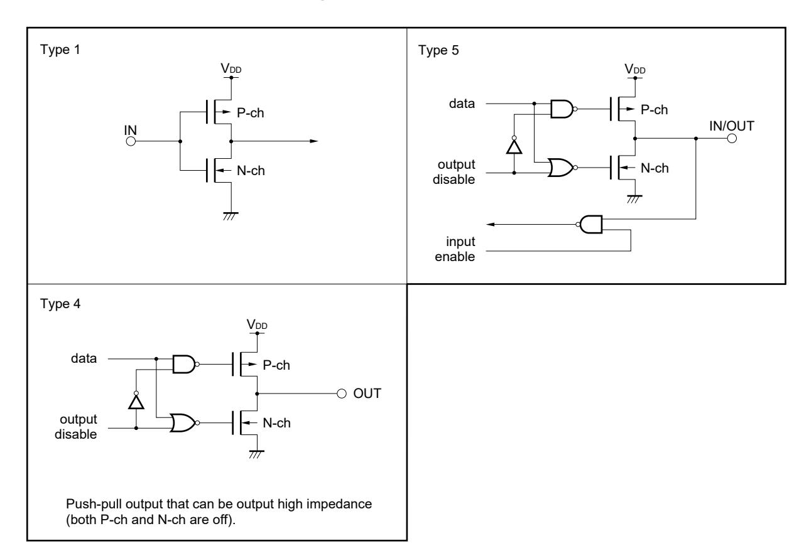

**Figure 1-1. Pin I/O Circuit**

#### **2. REGISTER SET** H

The registers of the V810 can be classified into two types: general-purpose program register set and dedicated system register set. All registers are 32 bits wide.

#### **Program register sets System register sets**

| 31      |                                 | 0 31  |                          | 0 |
|---------|---------------------------------|-------|--------------------------|---|
| r0      | Zero Register                   | EIPC  | Exception/Interrupt PC   |   |
| r1      | Reserved for Address Generation | EIPSW | Exception/Interrupt PSW  |   |
| r2      | Handler Stack Pointer (hp)      |       |                          |   |
| r3      | Stack Pointer (sp)              | 31    |                          | 0 |
| r4      | Global Pointer (gp)             | FEPC  | Fatal Error PC           |   |
| r5 r6   | Text Pointer (tp)               | FEPSW | Fatal Error PSW          |   |
| r7      |                                 | 31    |                          | 0 |
| r8 r9   |                                 | ECR   | Exception Cause Register |   |
| r10     |                                 | 31    |                          | 0 |
| r11 r12 |                                 | PSW   | Program Status Word      |   |
| r13     |                                 | 31    |                          | 0 |
| r14 r15 |                                 | PIR   | Processor ID Register    |   |
| r16     |                                 | 31    |                          | 0 |
| r17 r18 |                                 | TKCW  | Task Control Word        |   |
| r19     |                                 | 31    |                          | 0 |
| r20 r21 |                                 | CHCW  | Cache Control Word       |   |
| r22     |                                 | 31    |                          | 0 |
| r23     |                                 | ADTRE | Address Trap Register    |   |

| 31          |                                 | 0 31  |                          |
|-------------|---------------------------------|-------|--------------------------|
| r0          | Zero Register                   | EIPC  | Exception/Interrupt PC   |
| r1          | Reserved for Address Generation | EIPSW | Exception/Interrupt PSW  |
| r2          | Handler Stack Pointer (hp)      |       |                          |
| r3          | Stack Pointer (sp)              | 31    |                          |
| r4          | Global Pointer (gp)             | FEPC  | Fatal Error PC           |
| r5 r6       | Text Pointer (tp)               | FEPSW | Fatal Error PSW          |
| r7          |                                 | 31    |                          |
| r8 r9       |                                 | ECR   | Exception Cause Register |
| r10         |                                 | 31    |                          |
| r11 r12     |                                 | PSW   | Program Status Word      |
| r13         |                                 | 31    |                          |
| r14 r15     |                                 | PIR   | Processor ID Register    |
| r16         |                                 | 31    |                          |
| r17 r18     |                                 | TKCW  | Task Control Word        |
| r19         |                                 | 31    |                          |
| r20 r21     |                                 | CHCW  | Cache Control Word       |
| r22         |                                 | 31    |                          |
| r23 r24 r25 |                                 | ADTRE | Address Trap Register    |
| r26         | String Destination Bit Offset   |       |                          |
| r27         | String Source Bit Offset        |       |                          |
| r28         | String Length                   |       |                          |
| r29         | String Destination              |       |                          |
| r30         | String Source                   |       |                          |
| r31         | Link Pointer (lp)               |       |                          |

| 31 | 0               |
|----|-----------------|
| PC | Program Counter |

#### **2.1 Program Register Set**

The program register set is composed of general-purpose registers and a program counter.

#### **(1) General-purpose registers**

Thirty-two general-purpose registers, r0 to r31, are available. All these registers can be used as data registers or address registers.

Of these registers, r0 and r26 through r30 are implicitly used by some instructions, and r1 through r5 and r31 are implicitly used by the assembler and C compiler. Therefore, when using these registers, it is necessary to take special care such as saving these registers' contents to different areas before using these registers and restoring the contents after using them.

**Table 2-1. Program Registers**

| Register  | Application                         | Operation                                                       |
|-----------|-------------------------------------|-----------------------------------------------------------------|
| r0        | Zero register                       | Always holds zeros.                                             |
| r1        | Register reserved for assembler     | Used as a working register to generate a 32-bit immediate data. |
| r2        | Handler stack pointer               | Used as the stack pointer for the handler.                      |
| r3        | Stack pointer                       | Used to generate a stack frame at a function call.              |
| r4        | Global pointer                      | Used to access a global variable in the data area.              |
| r5        | Text pointer                        | Points the start address of the text area.                      |
| r6 to r25 | —                                   | Stores address or data variables.                               |
| r26       | String destination bit offset       | Used in a bit-string instruction execution.                     |
| r27       | String source bit offset            |                                                                 |
| r28       | String length register              |                                                                 |
| r29       | String destination address register |                                                                 |
| r30       | String address register             |                                                                 |
| r31       | Link pointer                        | Stores the return address at execution of a JAL instruction.    |

#### **(2) Program Counter**

The program counter (PC) indicates the address of the instruction currently executed by the program. Bit 0 of the PC is fixed to 0, and execution cannot branch to an odd address. The contents of the PC are initialized to FFFFFFF0H at reset.

#### **2.2 System Register Set**

The system register set is composed of the following registers that perform operations such as CPU-status control and interrupt information holding.

**Table 2-2. System Register Number**

| Number   | Register Name | Application                 | Operation                                                             |
|----------|---------------|-----------------------------|-----------------------------------------------------------------------|
| 0        | EIPC          | Status saving registers     | The EIPC and EIPSW registers save the PC and PSW,                     |
|          |               | for exception/interrupt     | respectively, when an exception or interrupt occurs. Because in       |
| 1        | EIPSW         |                             | these registers only, save the contents of these registers by means   |
| 2        | FEPC          | Status saving registers for | The FEPC and FEPSW registers save the PC and PSW,                     |
| 3        | FEPSW         | NMI/duplexed exception      | respectively, when an NMI or duplexed exception occurs.               |
| 4        | ECR           | Exception cause register    | This register, when an exception, maskable interrupt, or NMI          |
| 5        | PSW           | Program status word         | This register, also called the program status word, is a set of flags |
| 6        | PIR           | Processor ID register       | This register identifies the CPU type number.                         |
| 7        | TKCW          | Task control word           | This register controls floating-point operations.                     |
| 8 to 23  | Reserved      |                             |                                                                       |
| 24       | CHCW          | Cache control word          | This register controls the on-chip instruction cache.                 |
| 25       | ADTRE         | Address trap register       | This register holds an address and is used for address trapping.      |
| 26 to 31 | Reserved      |                             |                                                                       |

To read or write one of the registers shown above, specify a system register number with the system register load (LDSR) or system register store (STSR) instruction.

## **3. DATA TYPES**

#### **3.1 Data Types**

The data types supported by the V810 are as follows:

- Integer (8, 16, 32 bits)
- Unsigned integer (8, 16, 32 bits)
- Bit string
- Single-precision floating-point data (32 bits)

#### **3.1.1 Data type and addressing**

The V810 uses the little-endian data addressing. In this addressing, if a fixed-length data is located in a memory area, the data must be either of the data types shown below.

#### **(1) Byte**

A byte is a consecutive 8-bit data whose first-bit address is aligned to a byte boundary. Each bit in a byte is numbered from 0 to 7: LSB (the least significant bit) is bit 0 and MSB (the most significant bit) is bit 7. To access a byte, specify address A. (See diagram below.)

#### **(2) Halfword**

A halfword is a consecutive 16-bit (= 2 bytes) data whose first-bit address is aligned to a halfword boundary. Each bit in a halfword is numbered from 0 to 15: LSB (the least significant bit) is bit 0 and MSB (the most significant bit) is bit 15. To access a halfword, specify the address A only (lowest bit must be 0).

#### **(3) Word/short real**

A word, also called short real, is a consecutive 32-bit (= 4 bytes) data whose first-bit address is aligned to a word boundary. Each bit in a word is numbered from 0 to 31: LSB (the least significant bit) is bit 0 and MSB (the most significant bit) is bit 31. To access a word or short real, specify the address A only (lower two bits must be 0).

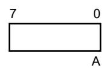

H

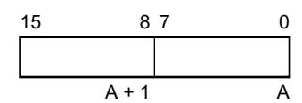

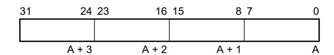

#### **3.1.2 Integer**

In the V810, all integers are expressed in the two's-complement binary notation, and are composed of either 8 bits, 16 bits, or 32 bits. Regardless of the data length, bit 0 is the least significant bit, and higher-numbered bits express higher digits of the integer with the highest bit expressing its sign.

| Data Length |         | Range                      |
|-------------|---------|----------------------------|
| Byte        | 8 bits  | –128 to +127               |
| Halfword    | 16 bits | –32768 to +32767           |
| Word        | 32 bits | –2147483648 to +2147483647 |

#### **3.1.3 Unsigned integer**

An unsigned integer is either zero or a positive integer unlike the integer explained in section 3.1.2 which can be negative as well as zero and positive. Unsigned integers are expressed in the binary notation in the same way as integers, and are either 8 bits, 16 bits, or 32 bits long. Regardless of the data length, the bit assignments are the same as in the case of integers except that unsigned integers do not include a sign bit; the highest bit is also a part of the integer.

| Data Length |         | Range           |
|-------------|---------|-----------------|
| Byte        | 8 bits  | 0 to 255        |
| Halfword    | 16 bits | 0 to 65535      |
| Word        | 32 bits | 0 to 4294967295 |

#### **3.1.4 Bit string**

A bit string is a type of data whose bit length is variable from 0 to 232 – 1. To specify a bit-string data, define the following three attributes.

- A : address of the string data's first word (lower two bits must be 0.)
- B : in-word bit offset in the string data (0 to 31)
- M : bit length of the string data (0 to 232 1)

The above three attributes may vary depending on the bit-string data manipulation direction: upward or downward, as shown below. The former is the direction from lower addresses to higher addresses while the latter is the direction from higher to lower addresses.

| Attribute                               | Upward | Downward |
|-----------------------------------------|--------|----------|
| First-word address (0s in bits 1 and 0) | A      | A + 4    |
| In-word bit offset (0 to 31)            | B      | D        |
| Bit length (0 to 232 – 1)               | M      | M        |

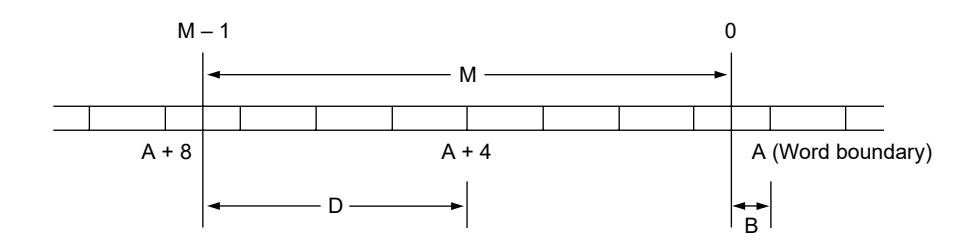

#### **3.1.5 Single-precision floating-point data**

This data type is 32 bits long and its bit allocation complies with the IEEE single format. A single-precision floating-point data consists of 1-bit mantissa sign bit, 8-bit exponent, and 23-bit mantissa. The exponent is offsetexpressed from the bias value – 127, and the mantissa is binary-expressed with the integer part omitted.

#### **3.2 Data Alignment**

In the V810, a word data must be aligned to a word boundary (with the lowest two bits of the address fixed to 0s), and a halfword data to a halfword boundary (with the lowest bit of the address fixed to 0). If a data is not aligned as specified, the lowest one bit (in the case of word) or two bits (in the case of halfword) of its address will forcibly be masked with 0s when the data is accessed.

| 31 | 30 |         | 23 |    |               |   |
|----|----|---------|----|----|---------------|---|
| s  |    | exp (8) |    |    | mantissa (23) |   |
|    |    |         |    | 22 |               | 0 |

#### **4. ADDRESS SPACE** H

The V810 supports 4 Gbytes of linear memory space and I/O space. The CPU outputs 32-bit addresses to the memory and I/Os; therefore, the addresses are from 0 to 232 – 1.

Bit number 0 of each byte data is defined as the LSB (Least Significant Bit), and bit number 7 is the MSB (Most Significant Bit). Unless otherwise specified, the byte data at the lower address side of data consisting of two or more bytes is the LSB, and the byte data at the higher address side is the MSB (little endian).

Data consisting of 2 bytes is called a halfword, and data consisting of 4 bytes is called a word. The lower address of memory or I/O data of two or more bytes, here, is shown on the right, and the higher address is shown on the left, as follows:

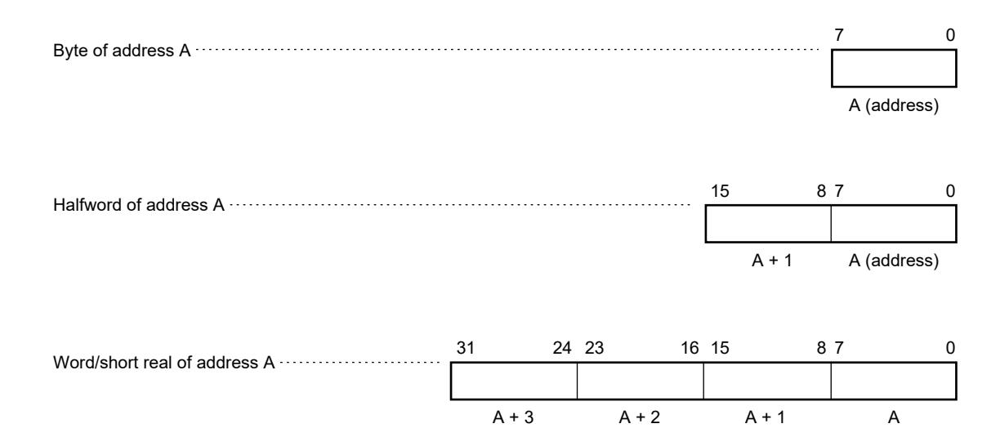

Figure 4-1 shows the memory map of the V810, and Figure 4-2 shows the I/O map.

**Figure 4-1. Memory Map**

**Note** For the details, refer to **Table 6-1 Exception Codes**.

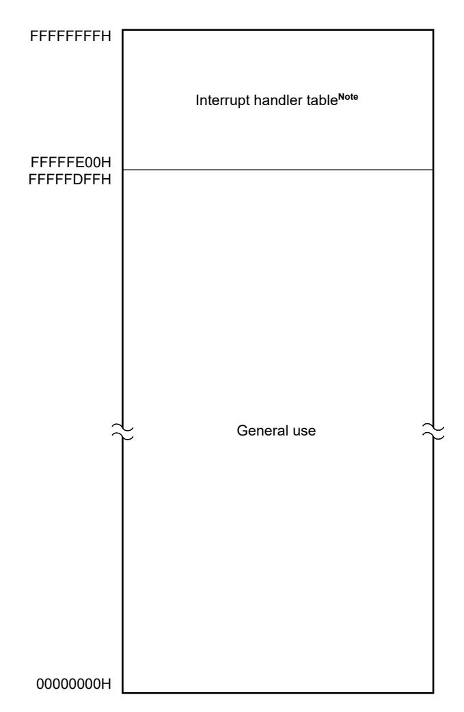

**Figure 4-2. I/O Map**

FFFFFFFFH

General use

00000000H

## **5. BUS INTERFACE FUNCTION**

The V810 is equipped with a 32-bit data bus.

In the bus interface, there are two modes: 32-bit bus mode which uses the data bus in 32 bits and 16-bit bus fixed mode which fixes the bus in 16 bits. Modes can be switched only at reset using the SIZ16B signal.

The 32-bit bus mode has a dynamic bus sizing function which uses the data bus in 16-bit bus width to access the 16-bit peripherals. This function can be used by setting the SZRQ signal active. Access to word data (32-bit data) in the dynamic bus sizing is executed by loading/storing a 16-bit data twice.

In the 16-bit bus fixed mode, access to word data (32-bit data) is executed by activating a bus cycle twice. The control signal and the A1 signal output values according to the 16-bit system.

The relationship between the external access and byte enable signals (BE3 to BE0) during the 32-bit bus mode and the 16-bit bus fixed mode is shown below.

 **Table 5-1. Relationship among Address, Data Length, Byte Enable Signals and A1 (32-bit bus mode)**

| Data length | Operand address Bit 1 | Bit 0 | BE3 | Byte enable BE2 | BE1 | BE0 | A1 | Bus cycle sequence |
|-------------|-----------------------|-------|-----|-----------------|-----|-----|----|--------------------|
| Byte        | 0                     | 0     | 1   | 1               | 1   | 0   | 0  | 1                  |
|             | 0                     | 1     | 1   | 1               | 0   | 1   | 0  | 1                  |
|             | 1                     | 0     | 1   | 0               | 1   | 1   | 0  | 1                  |
|             | 1                     | 1     | 0   | 1               | 1   | 1   | 0  | 1                  |
| Halfword    | 0                     | 0     | 1   | 1               | 0   | 0   | 0  | 1                  |
|             | 1                     | 0     | 0   | 0               | 1   | 1   | 0  | 1                  |
| Word        | 0                     | 0     | 0   | 0               | 0   | 0   | 0  | 1                  |
|             |                       |       | 0   | 0               | 1   | 1   | 1  | 2 Note             |

**Note** Bus cycle added by dynamic bus sizing

 **Table 5-2. Relationship among Address, Data Length, Byte Enable Signals and A1 (16-bit bus fixed mode)**

| Data length | Operand address Bit 1 | Bit 0 | BE3  | Byte enable BE2 | BE1 | BE0 | A1 | Bus cycle sequence |
|-------------|-----------------------|-------|------|-----------------|-----|-----|----|--------------------|
| Byte        | 0                     | 0     | Hi-Z | Hi-Z            | 1   | 0   | 0  | 1                  |
|             | 0                     | 1     | Hi-Z | Hi-Z            | 0   | 1   | 0  | 1                  |
|             | 1                     | 0     | Hi-Z | Hi-Z            | 1   | 0   | 1  | 1                  |
|             | 1                     | 1     | Hi-Z | Hi-Z            | 0   | 1   | 1  | 1                  |
| Halfword    | 0                     | 0     | Hi-Z | Hi-Z            | 0   | 0   | 0  | 1                  |
|             | 1                     | 0     | Hi-Z | Hi-Z            | 0   | 0   | 1  | 1                  |
| Word        | 0                     | 0     | Hi-Z | Hi-Z            | 0   | 0   | 0  | 1                  |
|             |                       |       | Hi-Z | Hi-Z            | 0   | 0   | 1  | 2 Note             |

**Note** Added bus cycle

H

#### **6. INTERRUPT AND EXCEPTION** H

Interrupts are events that take place independently of the program execution and can be classified into maskable interrupts and a non-maskable interrupt. An exception is an event that takes place depending upon the program execution. There is little difference between the interrupt and exception in terms of flow, but the interrupt takes precedence over the exception.

The V810 architecture is provided with the interrupts and exceptions listed in the table below. If an exception, a maskable interrupt or NMI occurs, control is transferred to a handler whose address is determined by the source of the interrupt or exception. The exception source can be checked by examining an exception code stored in the ECR (Exception Code Register). Each handler analyzes the contents of the ECR and performs appropriate exception/interrupt servicing.

**Table 6-1. Exception Codes**

| Exception and interrupt                    | Classification   | Exception code | Handler address | Restore PC Note 1 |
|--------------------------------------------|------------------|----------------|-----------------|-------------------|
| Reset                                      | Interrupt        | F F F 0        | F F F F F F F 0 | Note 2            |
| NMI                                        | Interrupt        | F F D 0        | F F F F F F D 0 | next PC Note 3    |
| Duplexed exception                         | Exception        | Note 4         | F F F F F F D 0 | current PC        |
| Address trap                               | Exception        | F F C 0        | F F F F F F C 0 | current PC        |
| Trap instruction (parameter is 0x1n)       | Exception        | F F B n        | F F F F F F B 0 | next PC           |
| Trap instruction (parameter is 0x0n)       | Exception        | F F A n        | F F F F F F A 0 | next PC           |
| Invalid instruction code                   | Exception        | F F 9 0        | F F F F F F 9 0 | current PC        |
| Zero division                              | Exception        | F F 8 0        | F F F F F F 8 0 | current PC        |
| FIV (floating-point invalid operation)     | Exception        | F F 7 0        | F F F F F F 6 0 | current PC        |
| FZD (floating-point zero division)         | Exception        | F F 6 8        | F F F F F F 6 0 | current PC        |
| FOV (floating-point overflow)              | Exception        | F F 6 4        | F F F F F F 6 0 | current PC        |
| FUD (floating-point underflow)             | Note 5 Exception | F F 6 2        | F F F F F F 6 0 | current PC        |
| FPR (floating-point precision degradation) | Note 5 Exception | F F 6 1        | F F F F F F 6 0 | current PC        |
| FRO (floating-point reserved operand)      | Exception        | F F 6 0        | F F F F F F 6 0 | current PC        |
| INT level n (n = 0 to 15)                  | Interrupt        | F E n 0        | F F F F F E n 0 | next PC Note 3    |

**Notes 1.** PC to be saved to EIPC or FEPC.

- **2.** EIPC and FEPC are undefined.
- **3.** While an instruction whose execution is aborted by an interrupt (DIV/DIVU, single-precision floatingpoint data, bit string instruction) is executed, restore PC = current PC.
- **4.** The exception code of the exception that occurs for the first time is stored to the lower 16 bits of the ECR, and that of the second exception is stored in the higher 16 bits.
- **5.** In the V810, the floating-point underflow exception and floating-point precision degradation exception do not occur.

## **7. CACHE**

Figure 7-1 shows the instruction cache configuration provided to the V810.

**Figure 7-1. Cache Configuration**

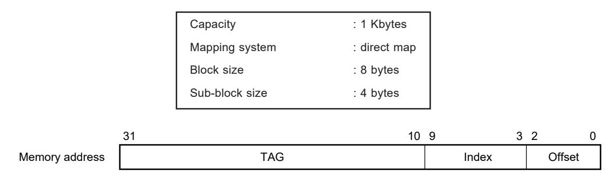

H

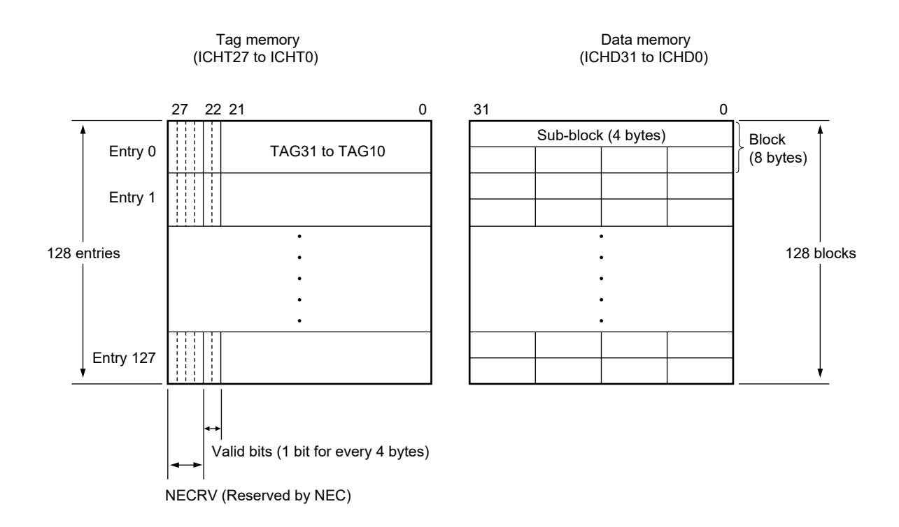

#### **8. RESET** H

A low-level input detection on the RESET pin always triggers a system reset. Consequently, all the hardwarecontrolling registers are initialized as shown in Table 8-1. After the initialization procedure is completed and the RESET pin returns to the high level, the device is released from the resetting state and starts the implementation of a program. Then, if necessary, set some registers to user-desired values in the first stage of the program.

**Table 8-1. Register State after Reset**

| Hardware (Symbol)                    |           | State after Reset  |
|--------------------------------------|-----------|--------------------|
| Program counter                      | PC        | FFFFFFF0H          |
| Status saving register for interrupt | EIPC      | Undefind           |
| Status saving register for NMI       | FEPC      | Undefind           |
| Interrupt cause register             | FECC      | 0000H              |
|                                      | EICC      | FFF0H              |
| Program status word                  | PSW       | 00008000H          |
| General-purpose register             | r0        | Fixed to 00000000H |
|                                      | r1 to r31 | Undefind           |

## **9. INSTRUCTION SET**

#### **9.1 Instruction Format**

The V810 instructions are formatted in either 16 bits or 32 bits. Examples of the 16-bit format instruction are binomial operation, control, and conditional branch; those for the 32-bit format are load/store, I/O manipulate, 16 bit immediate, jump & link, and extended operations.

Some instructions have an unused field. However, do not write a program that uses this field because it is reserved for future use. This unused field must be set to zeros.

Instructions are stored in memory in the following manner.

- The lower half of an instruction, that is, the half which includes bit 0, is stored at the lower address.
- The higher half of an instruction, that is, the half which includes bit 15 or 31, is stored at the higher address.

#### **(1) reg-reg instruction format (Format I)**

This format consists of one 6-bit field to hold an operation code and two 5-bit fields to specify generalpurpose registers as instruction's operands. 16-bit instructions use this format.

#### **(2) imm-reg instruction format (Format II)**

This format consists of one 6-bit field to hold an operation code, one 5-bit field to hold an immediate data, and one field to specify a general-purpose register as an operand. 16-bit instructions use this format.

#### **(3) Conditonal branch instruction format (Format III)**

This format consists of one 3-bit field to hold an operation code, one 4-bit field to hold a condition code, and one 9-bit field to hold a branch displacement (with its LSB masked to 0). 16-bit instructions use this format.

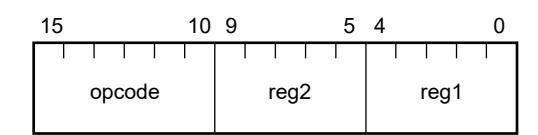

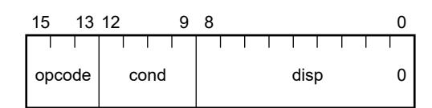

H

#### **(4) Intermediate jump instruction format (Format IV)**

This format consists of one 6-bit field to hold an operation code and one 26-bit field to hold a displacement (with its LSB masked to 0). 32-bit instructions use this format.

#### **(5) 3-operand instruction format (Format V)**

This format consists of one 6-bit field to hold an operation code, two fields to specify general-purpose registers as operands, and one 16-bit field to hold an immediate data. 32-bit instructions use this format.

#### **(6) Load/store instruction format (Format VI)**

This format consists of one 6-bit field to hold an operation code, two fields to specify a general-purpose register, and one 16-bit field to hold a displacement. 32-bit instructions use this format.

#### **(7) Extension instruction format (Format VII)**

This format consists of one 6-bit field to hold an operation code, two 5-bit fields to specify general-purpose registers as operands, and one 6-bit field to hold an sub-operation code. The remaining 10 bits are reserved for future use and must be set to zeros. 32-bit instructions use this format.

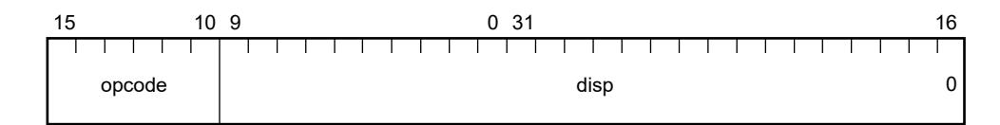

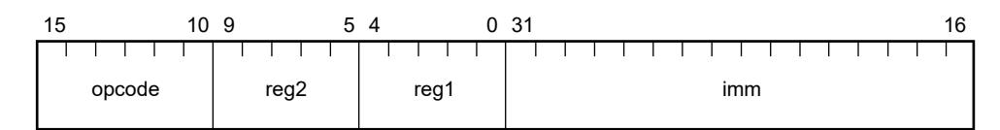

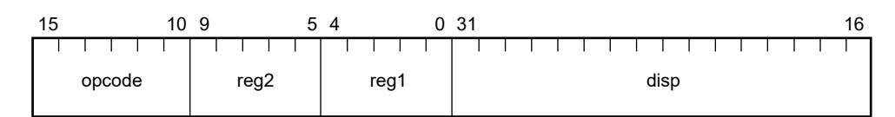

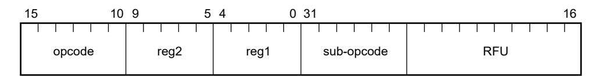

#### **9.2 Instruction Mnemonic (in alphabetical order)**

The list of mnemonics is shown below.

This section lists the instructions incorporated in the V810 along with their operations. The instructions are listed in the instruction mnemonic's alphabetical order to allow users to use this section as a quick reference or dictionary. The conventions used in the list are shown below.

| Identifier | Description                                                                                            |
|------------|--------------------------------------------------------------------------------------------------------|
| reg1       | General-purpose register (Used as a source register)                                                   |
| reg2       | General-purpose register (Used mainly as a destination register and occasionally as a source register) |
| imm5       | 5-bit immediate                                                                                        |
| imm16      | 16-bit immediate                                                                                       |
| disp9      | 9-bit displacement                                                                                     |
| disp16     | 16-bit displacement                                                                                    |
| disp26     | 26-bit displacement                                                                                    |
| regID      | System register number                                                                                 |
| vector adr | Trap handler address that corresponds to a trap vector                                                 |

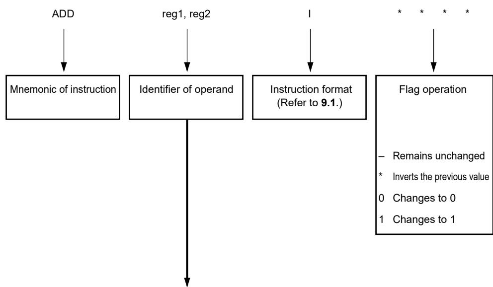

|         |  |  |  |  |         |
|----------------------|---------------|---------------|---------------|---------------|----------------------|
| Instruction Mnemonic | Operand (s)   | Format        | CY OV         | S             | Instruction Function |

#### **Legend**

**Table 9-1. Instruction Mnemonics (in alphabetical order) (1/9)**

| Instruction | Operand (s)       | Format | CY OV | S | Z Instruction Function                                    |
|-------------|-------------------|--------|-------|---|-----------------------------------------------------------|
| ADD         | reg1, reg2        | I      | * *   | * | * Addition:                                               |
| ADD         | imm5, reg2        | II     | * *   | * | * Addition:                                               |
| ADDF.S      | reg1, reg2        | VII    | * 0   | * | * Floating-point addition:                                |
| ADDI        | imm16, reg1, reg2 | V      | * *   | * | * Addition:                                               |
| AND         | reg1, reg2        | I      | – 0   | * | * AND:                                                    |
| ANDBSU      | –                 | II     | – –   | – | – Transfer after ANDing bit strings:                      |
| ANDI        | imm16, reg1, reg2 | V      | – 0   | 0 | * AND:                                                    |
| ANDNBSU     | –                 | II     | – –   | – | – Transfer after NOTting a bit string then ANDing it with |
| BC          | disp9             | III    | – –   | – | – Conditional branch (if Carry):                          |
| BE          | disp9             | III    | – –   | – | – Conditional branch (if Equal):                          |
| BGE         | disp9             | III    | – –   | – | – Conditional branch (if Greater than or Equal):          |
| BGT         | disp9             | III    | – –   | – | – Conditional branch (if Greater than):                   |

**Table 9-1. Instruction Mnemonics (in alphabetical order) (2/9)**

| Instruction | Operand (s)         | Format | CY OV | S Z | Instruction Function                                 |
|-------------|---------------------|--------|-------|-----|------------------------------------------------------|
| BH          | disp9               | III    | – –   | – – | Conditional branch (if Higher):                      |
| BL          | disp9               | III    | – –   | – – | Conditional branch (if Lower):                       |
| BLE         | disp9               | III    | – –   | – – | Conditional branch (if Less than or Equal):          |
| BLT         | disp9               | III    | – –   | – – | Conditional branch (if Less than):                   |
| BN          | disp9               | III    | – –   | – – | Conditional branch (if Negative):                    |
| BNC         | disp9               | III    | – –   | – – | Conditional branch (if Not Carry):                   |
| BNE         | disp9               | III    | – –   | – – | Conditional branch (if Not Equal):                   |
| BNH         | disp9               | III    | – –   | – – | Conditional branch (if Not Higher):                  |
| BNL         | disp9               | III    | – –   | – – | Conditional branch (if Not Lower):                   |
| BNV         | disp9               | III    | – –   | – – | Conditional branch (if Not Overflow):                |
| BNZ         | disp9               | III    | – –   | – – | Conditional branch (if Not Zero):                    |
| BP          | disp9               | III    | – –   | – – | Conditional branch (if Positive):                    |
| BR          | disp9               | III    | – –   | – – | Unconditional branch:                                |
| BV          | disp9               | III    | – –   | – – | Conditional branch (if Overflow):                    |
| BZ          | disp9               | III    | – –   | – – | Conditional branch (if Zero):                        |
| CAXI        | disp16 [reg1], reg2 | VI     | * *   | * * | Inter-processor synchronization in a multi-processor |
| CMP         | reg1, reg2          | I      | * *   | * * | Comparison:                                          |
| CMP         | imm5, reg2          | II     | * *   | * * | Comparison:                                          |
| CMPF.S      | reg1, reg2          | VII    | * 0   | * * | Floating-point comparison:                           |

**Table 9-1. Instruction Mnemonics (in alphabetical order) (3/9)**

| Instruction | Operand (s)         | Format | CY OV | S Z | Instruction Function                            |
|-------------|---------------------|--------|-------|-----|-------------------------------------------------|
| CVT.SW      | reg1, reg2          | VII    | – 0   | * * | Data conversion from floating-point to integer: |
| CVT.WS      | reg1, reg2          | VII    | * 0   | * * | Data conversion from integer to floating-point: |
| DIV         | reg1, reg2          | I      | – *   | * * | Signed division:                                |
| DIVF.S      | reg1, reg2          | VII    | * 0   | * * | Floating-point division:                        |
| DIVU        | reg1, reg2          | I      | – 0   | * * | Unsigned division:                              |
| HALT        | –                   | II     | – –   | – – | Processor stop                                  |
| IN.B        | disp16 [reg1], reg2 | VI     | – –   | – – | Port input:                                     |
| IN.H        | disp16 [reg1], reg2 | VI     | – –   | – – | Port input:                                     |

**Table 9-1. Instruction Mnemonics (in alphabetical order) (4/9)**

| Instruction | Operand (s)         | Format | CY OV | S Z | Instruction Function                    |
|-------------|---------------------|--------|-------|-----|-----------------------------------------|
| IN.W        | disp16 [reg1], reg2 | VI     | – –   | – – | Port input:                             |
| JAL         | disp26              | IV     | – –   | – – | Jump and link:                          |
| JMP         | [reg1]              | I      | – –   | – – | Register-indirect unconditional branch: |
| JR          | disp26              | IV     | – –   | – – | Unconditional branch:                   |
| LD.B        | disp16 [reg1], reg2 | VI     | – –   | – – | Byte load:                              |
| LD.H        | disp16 [reg1], reg2 | VI     | – –   | – – | Halfword load:                          |
| LD.W        | disp16 [reg1], reg2 | VI     | – –   | – – | Word load:                              |

**Table 9-1. Instruction Mnemonics (in alphabetical order) (5/9)**

| Instruction | Operand (s)       | Format | CY OV | S Z | Instruction Function           |
|-------------|-------------------|--------|-------|-----|--------------------------------|
| LDSR        | reg2, regID       | II     | * *   | * * | Loading system register:       |
| MOV         | reg1, reg2        | I      | – –   | – – | Transferring data:             |
| MOV         | imm5, reg2        | II     | – –   | – – | Transferring data:             |
| MOVBSU      | –                 | II     | – –   | – – | Transferring bit strings:      |
| MOVEA       | imm16, reg1, reg2 | V      | – –   | – – | Addition:                      |
| MOVHI       | imm16, reg1, reg2 | V      | – –   | – – | Addition:                      |
| MUL         | reg1, reg2        | I      | – *   | * * | Signed multiplication:         |
| MULF.S      | reg1, reg2        | VII    | * 0   | * * | Floating-point multiplication: |
| MULU        | reg1, reg2        | I      | – *   | * * | Unsigned multiplication:       |
| NOP         | –                 | III    | – –   | – – | No operation:                  |
| NOT         | reg1, reg2        | I      | – 0   | * * | Logical NOT:                   |

**Table 9-1. Instruction Mnemonics (in alphabetical order) (6/9)**

| Instruction | Operand (s)         | Format | CY OV | S Z | Instruction Function                                  |
|-------------|---------------------|--------|-------|-----|-------------------------------------------------------|
| NOTBSU      | –                   | II     | – –   | – – | Transfer after NOTting a bit string:                  |
| OR          | reg1, reg2          | I      | – 0   | * * | OR:                                                   |
| ORBSU       | –                   | II     | – –   | – – | Transfer after ORing bit strings:                     |
| ORI         | imm16, reg1, reg2   | V      | – 0   | * * | OR:                                                   |
| ORNBSU      | –                   | II     | – –   | – – | Transfer after NOTting a bit string and ORing it with |
| OUT.B       | reg2, disp16 [reg1] | VI     | – –   | – – | Port output:                                          |
| OUT.H       | reg2, disp16 [reg1] | VI     | – –   | – – | Port output:                                          |
| OUT.W       | reg2, disp16 [reg1] | VI     | – –   | – – | Port output:                                          |

**Table 9-1. Instruction Mnemonics (in alphabetical order) (7/9)**

| Instruction | Operand (s) | Format | CY OV | S Z | Instruction Function                                      |
|-------------|-------------|--------|-------|-----|-----------------------------------------------------------|
| RETI        | –           | II     | * *   | * * | Return from a trap or interrupt routine:                  |
| SAR         | reg1, reg2  | I      | * 0   | * * | Arithmetic right shift:                                   |
| SAR         | imm5, reg2  | II     | * 0   | * * | Arithmetic right shift:                                   |
|             |             |        |       |     | the reg2-specified register. In arithmetic right shift    |
| SCH0BSU     | –           | II     | – –   | – * | Searching 0s in a bit string:                             |
| SCH0BSD     | –           | II     | – –   | – * | Searches “0” bits in the source bit string, and loads r30 |
| SCH1BSU     | –           | II     | – –   | – – | Searching 1s in a bit string:                             |
| SCH1BSD     | –           | II     | – –   | – – | Searches 1s in the source bit string, and loads r30 and   |
| SETF        | imm5, reg2  | II     | – –   | – – | Flag condition setting:                                   |
| SHL         | reg1, reg2  | I      | * 0   | * * | Logical left shift:                                       |

**Table 9-1. Instruction Mnemonics (in alphabetical order) (8/9)**

| Instruction | Operand (s)         | Format | CY OV | S Z | Instruction Function                                |
|-------------|---------------------|--------|-------|-----|-----------------------------------------------------|
| SHL         | imm5, reg2          | II     | * 0   | * * | Logical left shift:                                 |
| SHR         | reg1, reg2          | I      | * 0   | * * | Logical right shift:                                |
| SHR         | imm5, reg2          | II     | * 0   | * * | Logical right shift:                                |
|             |                     |        |       |     | the reg2-specified register. In logical right shift |
| ST.B        | reg2, disp16 [reg1] | VI     | – –   | – – | Byte store:                                         |
| ST.H        | reg2, disp16 [reg1] | VI     | – –   | – – | Halfword store:                                     |
| ST.W        | reg2, disp16 [reg1] | VI     | – –   | – – | Word store:                                         |
| STSR        | regID, reg2         | II     | – –   | – – | Storing system register contents:                   |
| SUB         | reg1, reg2          | I      | * *   | * * | Subtraction:                                        |

**Table 9-1. Instruction Mnemonics (in alphabetical order) (9/9)**

| Instruction | Operand (s)       | Format | CY OV | S Z | Instruction Function                                 |
|-------------|-------------------|--------|-------|-----|------------------------------------------------------|
| SUBF.S      | reg1, reg2        | VII    | * 0   | * * | Floating-point subtraction:                          |
| TRAP        | vector            | II     | – –   | – – | Software trap:                                       |
|             |                   |        |       |     | (1) Saving the restore PC and PSW into the FEPC      |
|             |                   |        |       |     | (2) Setting an exception code into the ECR’s FECC    |
|             |                   |        |       |     | (3) Setting the PSW’s ID flag and clearing the PSW’s |
|             |                   |        |       |     | (4) Setting the PSW’s NP flag if the PSW’s EP flag   |
| TRNC.SW     | reg1, reg2        | VII    | – 0   | * * | Conversion from floating-point data to integer:      |
| XOR         | reg1, reg2        | I      | – 0   | * * | Exclusive OR:                                        |
| XORBSU      | –                 | II     | – –   | – – | Transfer of exclusive ORed bit string:               |
| XORI        | imm16, reg1, reg2 | V      | – 0   | * * | Exclusive OR:                                        |
| XORNBSU     | –                 | II     | – –   | – – | Transfer after exclusive-ORing a NOTted bit string   |

## **10. ELECTRICAL SPECIFICATIONS**

#### **Supported Electrical Specifications**

| Operating Supply   | Operating Ambient | µPD70732-16         | µPD70732-20 |          | µPD70732-25          |                     |
|--------------------|-------------------|---------------------|-------------|----------|----------------------|---------------------|
| Voltage            | Temperature (TA)  | 120-pin Plastic QFP |             |          | 120-pin Plastic TQFP | 176-pin Ceramic PGA |
| VDD = +5 V ± 10%   | –10 to +70°C      | (16 MHz)            | (20 MHz)    | (25 MHz) | (25 MHz)             | (25 MHz)            |
|                    | –40 to +85°C      | —                   | —           | (20 MHz) | (20 MHz)             | —                   |
| VDD = 2.7 to 3.6 V | –40 to +85°C      | —                   | —           | (16 MHz) | (16 MHz)             | —                   |
| VDD = 2.2 to 3.6 V | –40 to +85°C      | —                   | —           | (10 MHz) | (10 MHz)             | —                   |

**Remarks 1.** : with electrical specifications

— : without electrical specifications

**2.** ( ) : maximum operating frequency

H

#### **10.1 Specifications When VDD = +5 V ± 10%**

**(1) TA = –10 to +70°C**

#### **Absolute Maximum Ratings (TA = 25°C)**

| Parameter                     | Symbol | Test Conditions  | Rating            | Unit |
|-------------------------------|--------|------------------|-------------------|------|
| Supply voltage                | VDD    |                  | –0.5 to +7.0      | V    |
| Input voltage                 | VI     | VDD = +5 V ± 10% | –0.5 to VDD + 0.3 | V    |
| Clock Input voltage           | VK     | VDD = +5 V ± 10% | –0.5 to VDD + 0.3 | V    |
| Output voltage                | VO     | VDD = +5 V ± 10% | –0.5 to VDD + 0.3 | V    |
| Operating ambient temperature | TA     |                  | –10 to +70        | °C   |
| Storage temperature           | Tstg   |                  | –65 to +150       | °C   |

- **Cautions 1. Do not directly interconnect IC product output (or input/output) pins, or directly connect VDD or VCC to GND. However, open-drain pins and open-collector pins can be interconnected. Direct connection is also possible for an external circuit using timing design that avoids output collision with a pin that becomes high-impedance.**
  - **2. Product quality may suffer if the absolute maximum rating is exceeded for even a single parameter, or even momentarily. In other words, the absolute maximum ratings are rated values at which the product is on the verge of suffering physical damage, and therefore, the product must be used under conditions which ensure that the absolute maximum ratings are not exceeded. As far as possible, the product should be used in a state in which the rated value is not approached. The ratings and test conditions shown in the DC characteristics and AC characteristics are the normal operation and quality assurance ranges of the product.**

#### **DC Characteristics (TA = –10 to +70°C, VDD = +5V ± 10%)**

| Parameter                 | Symbol | Test Conditions       | MIN. | TYP.       | MAX.      | Unit |
|---------------------------|--------|-----------------------|------|------------|-----------|------|
| Clock input voltage, high | VKH    |                       | 4.0  |            | VDD + 0.3 | V    |
| Clock input voltage, low  | VKL    |                       | –0.5 |            | +0.6      | V    |
| Input voltage, high       | VIH    |                       | 2.2  |            | VDD + 0.3 | V    |
| Input voltage, low        | VIL    |                       | –0.5 |            | +0.8      | V    |
| Output voltage, high      | VOH    | IOH = –400 µA         | 2.4  |            |           | V    |
| Output voltage, low       | VOL    | IOL = 3.2 mA          |      |            | 0.45      | V    |
| Input leak current, high  | ILIH   | VIN = VDD             |      |            | 10        | µA   |
| Input leak current, low   | ILIL   | VIN = 0 V             |      |            | –10       | µA   |
| Output leak current, high | ILOH   | VO = VDD              |      |            | 10        | µA   |
| Output leak current, low  | ILOL   | VO = 0 V              |      |            | –10       | µA   |
| Supply current            | IDD    | f = 16 MHz            |      | 64 Note 2  | 160       |      |
|                           |        | f = 20 MHz            |      | 80 Note 2  | 200       | mA   |
|                           |        | f = 25 MHz            |      | 100 Note 2 | 240       |      |
|                           |        | Stopping clock Note 1 |      | 5          |           | µA   |

- **Notes 1.** VIL = 0 V, VIH = VDD applied
  - **2.** In general benchmark test (Output pins are open.)

**Capacitance (TA = 25°C, VDD = +5 V ± 10%)**

| Parameter         | Symbol | Test Conditions | MIN. | MAX. | Unit |
|-------------------|--------|-----------------|------|------|------|
| Input capacitance | CI     | fC = 1 MHz      |      | 15   | pF   |
| I/O capacitance   | CIO    |                 |      | 15   | pF   |

**AC Characteristics (TA = –10 to +70°C, VDD = +5V ± 10%)**

**Clock Input**

| Parameter                    | Symbol | Test       | µPD70732-16 | µPD70732-20 | µPD70732-25 | Unit |
|------------------------------|--------|------------|-------------|-------------|-------------|------|
|                              |        | Conditions | MIN. MAX.   | MIN. MAX.   | MIN. MAX.   |      |
| Clock cycle                  | tCYK   |            | 62.5        | 50          | 40          | ns   |
| Clock pulse high-level width | tKKH   |            | 26          | 21          | 17          | ns   |
| Clock pulse low-level width  | tKKL   |            | 26          | 21          | 17          | ns   |
| Clock rise time              | tKR    |            | 5           | 4           | 3           | ns   |
| Clock fall time              | tKF    |            | 5           | 4           | 3           | ns   |

**Reset**

| Parameter                                    | Symbol | Test Conditions | $\mu\text{PD}$ 70732-16 |      | $\mu\text{PD}$ 70732-20 |      | $\mu\text{PD}$ 70732-25 |      | Unit |
|----------------------------------------------|--------|--------------------|-------------------------|------|-------------------------|------|-------------------------|------|------|
|                                              |        |                    | MIN.                    | MAX. | MIN.                    | MAX. | MIN.                    | MAX. |      |
| RESET hold time (from V DD VALID) | tHVR   | Conditions         | 1000 + 20 tcykR      |      | 1000 + 20 tcykR      |      | 1000 + 20 tcykR      |      | ns   |
| Clock cycle (at reset)                       | tcykR  |                    | 62.5                    | 1000 | 50                      | 1000 | 40                      | 1000 | ns   |
| Clock high-level time (at reset)             | tkkHR  |                    | 26                      |      | 21                      |      | 17                      |      | ns   |
| Clock low-level time (at reset)              | tkkLR  |                    | 26                      |      | 21                      |      | 17                      |      | ns   |
| RESET setup time (to CLK↓, active)           | tSRKF  |                    | 10                      |      | 10                      |      | 10                      |      | ns   |
| RESET setup time (to CLK↓, inactive)         | tSRKR  | 10                 |                         | 10   |                         | 10   |                         | ns   |      |
| RESET hold time (from CLK↓)                  | tHKR   | 10                 |                         | 10   |                         | 10   |                         | ns   |      |
| RESET pulse low-level width (to CLK↓)        | twRL   | 20 tcykR           |                         |      | 20 tcykR                |      | 20 tcykR                |      | ns   |

#### **Memory, I/O Access**

| Parameter                         | Symbol    | Test Conditions MIN. | µPD70732-16 MAX. | MIN. | µPD70732-20 MAX. | MIN. | µPD70732-25 MAX. | Unit |
|-----------------------------------|-----------|----------------------|------------------|------|------------------|------|------------------|------|
| Address, etc. output delay time   | tDKA      | 2                    | 20               | 2    | 15               | 2    | 15               | ns   |
| (from CLK )                       |           |                      |                  |      |                  |      |                  |      |
| Address, etc. ouput hold time     | tHKA      | 2                    | 20               | 2    | 15               | 2    | 15               | ns   |
| (from CLK )                       |           |                      |                  |      |                  |      |                  |      |
| BCYST output delay time (from CLK | ) tDKBC   | 2                    | 20               | 2    | 15               | 2    | 15               | ns   |
| BCYST output hold time (from CLK  | ) tHKBC   | 2                    | 20               | 2    | 15               | 2    | 15               | ns   |
| DA output delay time (from CLK    | ) tDKDA   | 2                    | 20               | 2    | 15               | 2    | 15               | ns   |
| DA output hold time (from CLK     | ) tHKDA   | 2                    | 20               | 2    | 15               | 2    | 15               | ns   |
| READY setup time (to CLK          | Ø ) tSRYK | 6                    |                  | 5    |                  | 4    |                  | ns   |
| READY hold time (from CLK         | Ø ) tHKRY | 5                    |                  | 5    |                  | 4    |                  | ns   |
| Data setup time (to CLK           | ) tSDK    | 6                    |                  | 5    |                  | 4    |                  | ns   |
| Data hold time (from CLK          | ) tHKD    | 5                    |                  | 5    |                  | 4    |                  | ns   |
| Data output delay time            | tDKDT     | 2                    | 20               | 2    | 15               | 2    | 15               | ns   |
| (from active, from CLK            | Ø )       |                      |                  |      |                  |      |                  |      |
| Data output hold time             | tHKDT     | 2                    | 20               | 2    | 15               | 2    | 15               | ns   |
| (to active, from CLK              | Ø )       |                      |                  |      |                  |      |                  |      |
| Data output delay time            | tLZKDT    | 5                    | 25               | 5    | 20               | 5    | 20               | ns   |
| (from float, from CLK             | Ø )       |                      |                  |      |                  |      |                  |      |
| Data output hold time             | tHZKDT    | 5                    | 25               | 5    | 20               | 5    | 20               | ns   |
| (to float, from CLK Ø             | )         |                      |                  |      |                  |      |                  |      |

#### **Dynamic Bus Sizing**

| Parameter                    | Symbol | Test       | µPD70732-16 | µPD70732-20 | µPD70732-25 | Unit |
|------------------------------|--------|------------|-------------|-------------|-------------|------|
|                              |        | Conditions | MIN. MAX.   | MIN. MAX.   | MIN. MAX.   |      |
| SZRQ setup time (to CLK Ø )  | tSSZK  |            | 6           | 5           | 4           | ns   |
| SZRQ hold time (from CLK Ø ) | tHKSZ  |            | 5           | 5           | 4           | ns   |

#### **Interrupt**

| Parameter                     |     | Symbol Test | µPD70732-16 | µPD70732-20 | µPD70732-25 | Unit |
|-------------------------------|-----|-------------|-------------|-------------|-------------|------|
|                               |     | Conditions  | MIN.        | MAX. MIN.   | MAX. MIN.   | MAX. |
| NMI setup time (to CLK        | Ø ) | tSNK        | 6           | 5           | 4           | ns   |
| NMI hold time (from CLK       | Ø ) | tHKN        | 5           | 5           | 4           | ns   |
| INT, etc. setup time (to CLK  | )   | tSIK        | 6           | 5           | 4           | ns   |
| INT, etc. hold time (from CLK | )   | tHKI        | 5           | 5           | 4           | ns   |

#### **Bus Hold**

| Parameter HLDRQ setup time (to CLK HLDRQ hold time (from CLK | Symbol Ø ) tSHQK Ø ) tHKHQ | Test Conditions MIN. 6 5 | µPD70732-16 MAX. | MIN. 5 5 | µPD70732-20 MAX. | MIN. 4 4 | µPD70732-25 MAX. | Unit ns ns |
|--------------------------------------------------------------|----------------------------|--------------------------|------------------|----------|------------------|----------|------------------|------------|
| HLDAK output delay time (from CLK                            | ) tDKHA                    | 2                        | 20               | 2        | 15               | 2        | 15               | ns         |
| HLDAK output hold time (from CLK                             | ) tHKHA                    | 2                        | 20               | 2        | 15               | 2        | 15               | ns         |
| Address, etc. delay time                                     | tHZKA                      | 2                        | 25               | 2        | 20               | 2        | 20               | ns         |
| (from active, from CLK                                       | )                          |                          |                  |          |                  |          |                  |            |
| Address, etc. delay time                                     | tLZKA                      | 2                        | 25               | 2        | 20               | 2        | 20               | ns         |
| (from float, from CLK                                        | )                          |                          |                  |          |                  |          |                  |            |
| Data delay time                                              | tHZKD                      | 5                        | 25               | 5        | 20               | 5        | 20               | ns         |
| (from active, from CLK                                       | Ø )                        |                          |                  |          |                  |          |                  |            |
| Data delay time                                              | tLZKD                      | 5                        | 25               | 5        | 20               | 5        | 20               | ns         |
| (from float, from CLK                                        | Ø )                        |                          |                  |          |                  |          |                  |            |
| BCYST delay time                                             | tHZKBC                     | 2                        | 25               | 2        | 20               | 2        | 20               | ns         |
| (from active, from CLK                                       | )                          |                          |                  |          |                  |          |                  |            |
| BCYST delay time                                             | tLZKBC                     | 2                        | 25               | 2        | 20               | 2        | 20               | ns         |
| (from float, from CLK                                        | )                          |                          |                  |          |                  |          |                  |            |
| DA delay time                                                | tHZKDA                     | 2                        | 25               | 2        | 20               | 2        | 20               | ns         |
| (from active, from CLK                                       | )                          |                          |                  |          |                  |          |                  |            |
| DA delay time                                                | tLZKDA                     | 2                        | 25               | 2        | 20               | 2        | 20               | ns         |
| (from float, from CLK                                        | )                          |                          |                  |          |                  |          |                  |            |

#### **AC Test Input Waveform (Except CLK)**

#### **AC Test Input Waveform (CLK)**

#### **AC Test Output Test Points**

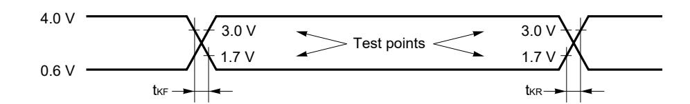

#### **Load Conditions**

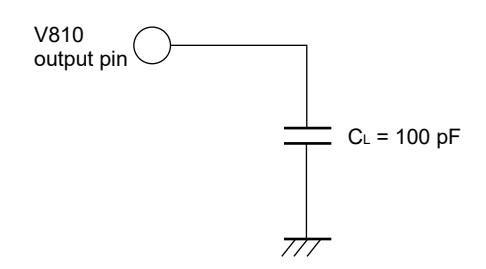

**(2) TA = –40 to +85°C**

#### **Absolute Maximum Ratings (TA = 25°C)**

| Parameter                     | Symbol | Test Conditions  | Rating            | Unit |
|-------------------------------|--------|------------------|-------------------|------|
| Supply voltage                | VDD    |                  | –0.5 to +7.0      | V    |
| Input voltage                 | VI     | VDD = +5 V ± 10% | –0.5 to VDD + 0.3 | V    |
| Clock Input voltage           | VK     | VDD = +5 V ± 10% | –0.5 to VDD + 0.3 | V    |
| Output voltage                | VO     | VDD = +5 V ± 10% | –0.5 to VDD + 0.3 | V    |
| Operating ambient temperature | TA     |                  | –40 to +85        | °C   |
| Storage temperature           | Tstg   |                  | –65 to +150       | °C   |

**Cautions 1. Do not directly interconnect IC product output (or input/output) pins, or directly connect VDD or VCC to GND. However, open-drain pins and open-collector pins can be interconnected. Direct connection is also possible for an external circuit using timing design that avoids output collision with a pin that becomes high-impedance.**

> **2. Product quality may suffer if the absolute maximum rating is exceeded for even a single parameter, or even momentarily.**

**In other words, the absolute maximum ratings are rated values at which the product is on the verge of suffering physical damage, and therefore, the product must be used under conditions which ensure that the absolute maximum ratings are not exceeded. As far as possible, the product should be used in a state in which the rated value is not approached. The ratings and test conditions shown in the DC characteristics and AC characteristics are the normal operation and quality assurance ranges of the product.**

#### **DC Characteristics (TA = –40 to +85°C, VDD = +5V ± 10%)**

| Parameter                 | Symbol | Test Conditions       | MIN. TYP. MAX. | Unit |
|---------------------------|--------|-----------------------|----------------|------|
| Clock input voltage, high | VKH    |                       | 4.0 VDD + 0.3  | V    |
| Clock input voltage, low  | VKL    |                       | –0.5 +0.6      | V    |
| Input voltage, high       | VIH    |                       | 2.2 VDD + 0.3  | V    |
| Input voltage, low        | VIL    |                       | –0.5 +0.8      | V    |
| Output voltage, high      | VOH    | IOH = –400 µA         | 2.4            | V    |
| Output voltage, low       | VOL    | IOL = 3.2 mA          | 0.45           | V    |
| Input leak current, high  | ILIH   | VIN = VDD             | 10             | µA   |
| Input leak current, low   | ILIL   | VIN = 0 V             | –10            | µA   |
| Output leak current, high | ILOH   | VO = VDD              | 10             | µA   |
| Output leak current, low  | ILOL   | VO = 0 V              | –10            | µA   |
| Supply current            | IDD    | f = 20 MHz            | 80 Note 2 200  | mA   |
|                           |        | Stopping clock Note 1 | 5              | µA   |

**Notes 1.** VIL = 0 V, VIH = VDD applied

**2.** In general benchmark test (Output pins are open.)

**Remark** Operating supply current is approximately proportional to operating clock frequency.

#### **Capacitance (TA = 25°C, VDD = +5 V ± 10%)**

| Parameter         | Symbol | Test Conditions | MIN. | MAX. | Unit |
|-------------------|--------|-----------------|------|------|------|
| Input capacitance | CI     | fC = 1 MHz      |      | 15   | pF   |
| I/O capacitance   | CIO    |                 |      | 15   | pF   |

#### **AC Characteristics (TA = –40 to +85°C, VDD = +5V ± 10%)**

#### **Clock Input**

| Parameter                    | Symbol | Test Conditions | µPD70732-25 | Unit |
|------------------------------|--------|-----------------|-------------|------|
|                              |        |                 | MIN. MAX.   |      |
| Clock cycle                  | tCYK   |                 | 50          | ns   |
| Clock pulse high-level width | tKKH   |                 | 21          | ns   |
| Clock pulse low-level width  | tKKL   |                 | 21          | ns   |
| Clock rise time              | tKR    |                 | 4           | ns   |
| Clock fall time              | tKF    |                 | 4           | ns   |

#### **Reset**

|                          | Parameter                           |             | Symbol Test Conditions | µPD70732-25     | Unit    |
|--------------------------|-------------------------------------|-------------|------------------------|-----------------|---------|
|                          |                                     |             |                        | MIN.            | MAX.    |
|                          | RESET hold time (from VDD VALID)    |             | tHVR                   | 1000 + 20 tCYKR | ns      |
| Clock cycle (at reset)   |                                     |             | tCYKR                  | 50              | 1000 ns |
|                          | Clock high-level time (at reset)    |             | tKKHR                  | 21              | ns      |
|                          | Clock low-level time (at reset)     |             | tKKLR                  | 21              | ns      |
| RESET setup time (to CLK | Ø                                   | , active)   | tSRKF                  | 10              | ns      |
| RESET setup time (to CLK | Ø                                   | , inactive) | tSRKR                  | 10              | ns      |
|                          | RESET hold time (from CLK           | Ø )         | tHKR                   | 10              | ns      |
|                          | RESET pulse low-level width (to CLK | Ø )         | tWRL                   | 20 tCYKR        | ns      |

#### **Memory, I/O Access**

|                                               | Parameter             | Symbol Test Conditions | µPD70732-25 |      | Unit |
|-----------------------------------------------|-----------------------|------------------------|-------------|------|------|
|                                               |                       |                        | MIN.        | MAX. |      |
| Address, etc. ouput delay time (from CLK      |                       | ) tDKA                 | 1           | 15   | ns   |
| Address, etc. ouput hold time (from CLK       |                       | ) tHKA                 | 1           | 15   | ns   |
| BCYST output delay time (from CLK             | )                     | tDKBC                  | 1           | 15   | ns   |
| BCYST output hold time (from CLK              | )                     | tHKBC                  | 1           | 15   | ns   |
| DA output delay time (from CLK                | )                     | tDKDA                  | 1           | 15   | ns   |
| DA output hold time (from CLK                 | )                     | tHKDA                  | 1           | 15   | ns   |
| READY setup time (to CLK                      | Ø )                   | tSRYK                  | 5           |      | ns   |
| READY hold time (from CLK                     | Ø )                   | tHKRY                  | 5           |      | ns   |
| Data setup time (to CLK                       | )                     | tSDK                   | 5           |      | ns   |
| Data hold time (from CLK                      | )                     | tHKD                   | 5           |      | ns   |
| Data output delay time (from active, from CLK |                       | Ø ) tDKDT              | 1           | 15   | ns   |
| Data output hold time (to active, from CLK    |                       | Ø ) tHKDT              | 1           | 15   | ns   |
| Data output delay time (from float, from CLK  |                       | Ø ) tLZKDT             | 5           | 20   | ns   |
| Data output hold time                         | (to float, from CLK Ø | ) tHZKDT               | 5           | 20   | ns   |

#### **Dynamic Bus Sizing**

| Parameter                    | Symbol | Test Conditions | µPD70732-25 | Unit |
|------------------------------|--------|-----------------|-------------|------|
|                              |        |                 | MIN. MAX.   |      |
| SZRQ setup time (to CLK Ø )  | tSSZK  |                 | 5           | ns   |
| SZRQ hold time (from CLK Ø ) | tHKSZ  |                 | 5           | ns   |

#### **Interrupt**

|                               | Parameter | Symbol Test Conditions | µPD70732-25 | Unit |
|-------------------------------|-----------|------------------------|-------------|------|
|                               |           |                        | MIN.        | MAX. |
| NMI setup time (to CLK        | Ø )       | tSNK                   | 5           | ns   |
| NMI hold time (from CLK       | Ø )       | tHKN                   | 5           | ns   |
| INT, etc. setup time (to CLK  | )         | tSIK                   | 5           | ns   |
| INT, etc. hold time (from CLK | )         | tHKI                   | 5           | ns   |

#### **Bus Hold**

| Parameter                                       |     | Symbol Test Conditions | µPD70732-25 |      | Unit |
|-------------------------------------------------|-----|------------------------|-------------|------|------|
|                                                 |     |                        | MIN.        | MAX. |      |
| HLDRQ setup time (to CLK                        | Ø ) | tSHQK                  | 5           |      | ns   |
| HLDRQ hold time (from CLK                       | Ø ) | tHKHQ                  | 5           |      | ns   |
| HLDAK output delay time (from CLK               | )   | tDKHA                  | 1           | 15   | ns   |
| HLDAK output hold time (from CLK                | )   | tHKHA                  | 1           | 15   | ns   |
| Address, etc. delay time (from active, from CLK |     | ) tHZKA                | 2           | 20   | ns   |
| Address, etc. delay time (from float, from CLK  |     | ) tLZKA                | 2           | 20   | ns   |
| Data delay time (from active, from CLK          | Ø ) | tHZKD                  | 5           | 20   | ns   |
| Data delay time (from float, from CLK           | Ø ) | tLZKD                  | 5           | 20   | ns   |
| BCYST delay time (from active, from CLK         | )   | tHZKBC                 | 2           | 20   | ns   |
| BCYST delay time (from float, from CLK          | )   | tLZKBC                 | 2           | 20   | ns   |
| DA delay time (from active, from CLK            | )   | tHZKDA                 | 2           | 20   | ns   |
| DA delay time (from float, from CLK             | )   | tLZKDA                 | 2           | 20   | ns   |

#### **AC Test Input Waveform (Except CLK)**

#### **AC Test Input Waveform (CLK)**

#### **AC Test Output Test Points**

#### **Load Conditions**

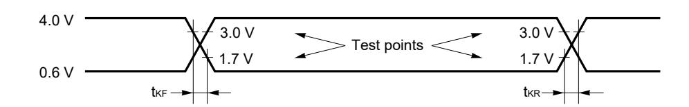

#### **10.2 Specifications When VDD = 2.7 to 3.6 V**

#### **Absolute Maximum Ratings (TA = 25°C)**

| Parameter                     | Symbol | Test Conditions    | Rating            | Unit |
|-------------------------------|--------|--------------------|-------------------|------|
| Supply voltage                | VDD    |                    | –0.5 to +7.0      | V    |
| Input voltage                 | VI     | VDD = 2.7 to 3.6 V | –0.5 to VDD + 0.3 | V    |
| Clock Input voltage           | VK     | VDD = 2.7 to 3.6 V | –0.5 to VDD + 0.3 | V    |
| Output voltage                | VO     | VDD = 2.7 to 3.6 V | –0.5 to VDD + 0.3 | V    |
| Operaitng ambient temperature | TA     |                    | –40 to +85        | °C   |
| Storage temperature           | Tstg   |                    | –65 to +150       | °C   |

- **Cautions 1. Do not directly interconnect IC product output (or input/output) pins, or directly connect VDD or VCC to GND. However, open-drain pins and open-collector pins can be interconnected. Direct connection is also possible for an external circuit using timing design that avoids output collision with a pin that becomes high-impedance.**
  - **2. Product quality may suffer if the absolute maximum rating is exceeded for even a single parameter, or even momentarily. In other words, the absolute maximum ratings are rated values at which the product is on the verge of suffering physical damage, and therefore, the product must be used under conditions which ensure that the absolute maximum ratings are not exceeded. As far as possible, the product should be used in a state in which the rated value is not approached. The ratings and test conditions shown in the DC characteristics and AC characteristics are the normal operation and quality assurance ranges of the product.**

#### **DC Characteristics (TA = –40 to +85°C, VDD = 2.7 to 3.6 V)**

| Parameter                 | Symbol | Test Conditions       | MIN. TYP. MAX.    | Unit |
|---------------------------|--------|-----------------------|-------------------|------|
| Clock input voltage, high | VKH    |                       | 0.8 VDD VDD + 0.3 | V    |
| Clock input voltage, low  | VKL    |                       | –0.5 +0.2 VDD     | V    |
| Input voltage, high       | VIH    |                       | 2.0 VDD + 0.3     | V    |
| Input voltage, low        | VIL    |                       | –0.5 +0.6         | V    |
| Output voltage, high      | VOH    | IOH = –2.0 mA         | 0.85 VDD          | V    |
|                           |        | IOH = –100 µA         | VDD – 0.2         | V    |
| Output voltage, low       | VOL    | IOL = 3.2 mA          | 0.4               | V    |
| Input leak current, high  | ILIH   | VIN = VDD             | 5                 | µA   |
| Input leak current, low   | ILIL   | VIN = 0 V             | –5                | µA   |
| Output leak current, high | ILOH   | VO = VDD              | 5                 | µA   |
| Output leak current, low  | ILOL   | VO = 0 V              | –5                | µA   |
| Supply current            | IDD    | f = 16 MHz            | 38 Note 2 100     | mA   |
|                           |        | Stopping clock Note 1 | 3 30              | µA   |

- **Notes 1.** VIL = 0 V, VIH = VDD applied
  - **2.** In general benchmark test (Output pins are open.)

**Remark** Operating supply current is approximately proportional to operating clock frequency.

#### **Capacitance (TA = 25°C, VDD = 2.7 to 3.6 V)**

| Parameter         | Symbol | Test Conditions | MIN. | MAX. | Unit |
|-------------------|--------|-----------------|------|------|------|
| Input capacitance | CI     | fC = 1 MHz      |      | 15   | pF   |
| I/O capacitance   | CIO    |                 |      | 15   | pF   |

#### **AC Characteristics (TA = –40 to +85°C, VDD = 2.7 to 3.6 V)**

#### **Clock Input**

| Parameter                    | Symbol | Test Conditions | µPD70732-25 | Unit |
|------------------------------|--------|-----------------|-------------|------|
|                              |        |                 | MIN. MAX.   |      |
| Clock cycle                  | tCYK   |                 | 62.5        | ns   |
| Clock pulse high-level width | tKKH   |                 | 26          | ns   |
| Clock pulse low-level width  | tKKL   |                 | 26          | ns   |
| Clock rise time              | tKR    |                 | 5           | ns   |
| Clock fall time              | tKF    |                 | 5           | ns   |

#### **Reset**

|                          | Parameter                           |             | Symbol Test Conditions | µPD70732-25    | Unit    |
|--------------------------|-------------------------------------|-------------|------------------------|----------------|---------|
|                          |                                     |             |                        | MIN.           | MAX.    |
|                          | RESET hold time (from VDD VALID)    |             | tHVR                   | 1000 + 20tCYKR | ns      |
| Clock cycle (at reset)   |                                     |             | tCYKR                  | 62.5           | 1000 ns |
|                          | Clock high-level time (at reset)    |             | tKKHR                  | 26             | ns      |
|                          | Clock low-level time (at reset)     |             | tKKLR                  | 26             | ns      |
| RESET setup time (to CLK | Ø                                   | , active)   | tSRKF                  | 10             | ns      |
| RESET setup time (to CLK | Ø                                   | , inactive) | tSRKR                  | 10             | ns      |
|                          | RESET hold time (from CLK           | Ø )         | tHKR                   | 10             | ns      |
|                          | RESET pulse low-level width (to CLK | Ø )         | tWRL                   | 20tCYKR        | ns      |

#### **Memory, I/O Access**

| Parameter                                     |     | Symbol Test Conditions | µPD70732-25 |      | Unit |
|-----------------------------------------------|-----|------------------------|-------------|------|------|
|                                               |     |                        | MIN.        | MAX. |      |
| Address etc. output delay time (from CLK      |     | ) tDKA                 | 1           | 25   | ns   |
| Address etc. output hold time (from CLK       | )   | tHKA                   | 1           | 25   | ns   |
| BCYST output delay time (from CLK             | )   | tDKBC                  | 1           | 25   | ns   |
| BCYST output hold time (from CLK              | )   | tHKBC                  | 1           | 25   | ns   |
| DA output delay time (from CLK                | )   | tDKDA                  | 1           | 25   | ns   |
| DA output hold time (from CLK                 | )   | tHKDA                  | 1           | 25   | ns   |
| READY setup time (to CLK                      | Ø ) | tSRYK                  | 8           |      | ns   |
| READY hold time (from CLK                     | Ø ) | tHKRY                  | 5           |      | ns   |
| Data setup time (to CLK                       | )   | tSDK                   | 8           |      | ns   |
| Data hold time (from CLK                      | )   | tHKD                   | 5           |      | ns   |
| Data output delay time (from active, from CLK |     | Ø ) tDKDT              | 1           | 35   | ns   |
| Data output hold time (to active, from CLK    |     | Ø ) tHKDT              | 1           | 35   | ns   |
| Data output delay time (from float, from CLK  |     | Ø ) tLZKDT             | 3           | 40   | ns   |
| Data output hold time (to float, from CLK     | Ø   | ) tHZKDT               | 3           | 40   | ns   |

#### **Dynamic Bus Sizing**

| Parameter                    | Symbol | Test Conditions | µPD70732-25 | Unit |
|------------------------------|--------|-----------------|-------------|------|
|                              |        |                 | MIN. MAX.   |      |
| SZRQ setup time (to CLK Ø )  | tSSZK  |                 | 8           | ns   |
| SZRQ hold time (from CLK Ø ) | tHKSZ  |                 | 5           | ns   |

#### **Interrupt**

|                              | Parameter | Symbol Test Conditions | µPD70732-25 | Unit |
|------------------------------|-----------|------------------------|-------------|------|
|                              |           |                        | MIN.        | MAX. |
| NMI setup time (to CLK       | Ø )       | tSNK                   | 8           | ns   |
| NMI hold time (from CLK      | Ø )       | tHKN                   | 5           | ns   |
| INT etc. setup time (to CLK  | )         | tSIK                   | 8           | ns   |
| INT etc. hold time (from CLK | )         | tHKI                   | 5           | ns   |

#### **Bus Hold**

| Parameter                                       |     | Symbol Test Conditions | µPD70732-25 |      | Unit |
|-------------------------------------------------|-----|------------------------|-------------|------|------|
|                                                 |     |                        | MIN.        | MAX. |      |
| HLDRQ setup time (to CLK                        | Ø ) | tSHQK                  | 8           |      | ns   |
| HLDRQ hold time (from CLK                       | Ø ) | tHKHQ                  | 5           |      | ns   |
| HLDAK output delay time (from CLK               | )   | tDKHA                  | 1           | 25   | ns   |
| HLDAK output hold time (from CLK                | )   | tHKHA                  | 1           | 25   | ns   |
| Address, etc. delay time (from active, from CLK |     | ) tHZKA                | 3           | 30   | ns   |
| Address, etc. delay time (from float, from CLK  |     | ) tLZKA                | 3           | 30   | ns   |
| Data delay time (from active, from CLK          | Ø ) | tHZKD                  | 3           | 40   | ns   |
| Data delay time (from float, from CLK           | Ø ) | tLZKD                  | 3           | 40   | ns   |
| BCYST delay time (from active, from CLK         | )   | tHZKBC                 | 3           | 30   | ns   |
| BCYST delay time (from float, from CLK          | )   | tLZKBC                 | 3           | 30   | ns   |
| DA delay time (from active, from CLK            | )   | tHZKDA                 | 3           | 30   | ns   |
| DA delay time (from float, from CLK             | )   | tLZKDA                 | 3           | 30   | ns   |

#### **AC Test Input Waveform (Except CLK)**

#### **AC Test Input Waveform (CLK)**

#### **AC Test Output Test Points**

#### **Load Conditions**

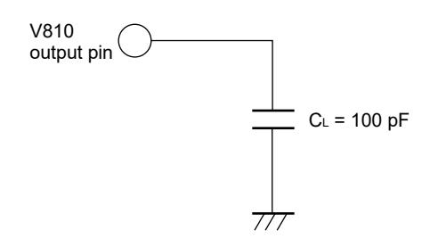

#### **10.3 Specifications When VDD = 2.2 to 3.6 V**

#### **Absolute Maximum Ratings (TA = 25°C)**

| Parameter                     | Symbol | Test Conditions    | Rating            | Unit |
|-------------------------------|--------|--------------------|-------------------|------|
| Supply voltage                | VDD    |                    | –0.5 to +7.0      | V    |
| Input voltage                 | VI     | VDD = 2.2 to 3.6 V | –0.5 to VDD + 0.3 | V    |
| Clock Input voltage           | VK     | VDD = 2.2 to 3.6 V | –0.5 to VDD + 0.3 | V    |
| Output voltage                | VO     | VDD = 2.2 to 3.6 V | –0.5 to VDD + 0.3 | V    |
| Operaitng ambient temperature | TA     |                    | –40 to +85        | °C   |
| Storage temperature           | Tstg   |                    | –65 to +150       | °C   |

- **Cautions 1. Do not directly interconnect IC product output (or input/output) pins, or directly connect VDD or VCC to GND. However, open-drain pins and open-collector pins can be interconnected. Direct connection is also possible for an external circuit using timing design that avoids output collision with a pin that becomes high-impedance.**
  - **2. Product quality may suffer if the absolute maximum rating is exceeded for even a single parameter, or even momentarily. In other words, the absolute maximum ratings are rated values at which the product is on the verge of suffering physical damage, and therefore, the product must be used under conditions which ensure that the absolute maximum ratings are not exceeded. As far as possible, the product should be used in a state in which the rated value is not approached. The ratings and test conditions shown in the DC characteristics and AC characteristics are the normal operation and quality assurance ranges of the product.**

#### **DC Characteristics (TA = –40 to +85°C, VDD = 2.2 to 3.6 V)**

| Parameter                 | Symbol | Test Conditions       | MIN.      | TYP.      | MAX.      | Unit |
|---------------------------|--------|-----------------------|-----------|-----------|-----------|------|
| Clock input voltage, high | VKH    |                       | 0.8 VDD   |           | VDD + 0.3 | V    |
| Clock input voltage, low  | VKL    |                       | –0.5      |           | +0.2 VDD  | V    |
| Input voltage, high       | VIH    | VDD • 2.5 V           | 2.0       |           | VDD + 0.3 | V    |
|                           |        | VDD - 2.5 V           | 0.8 VDD   |           | VDD + 0.3 | V    |
| Input voltage, low        | VIL    |                       | –0.5      |           | +0.2 VDD  | V    |
| Output voltage, high      | VOH    | IOH = –2.0 mA         | 0.85 VDD  |           |           | V    |
|                           |        | IOH = –100 µA         | VDD – 0.2 |           |           | V    |
| Output voltage, low       | VOL    | IOL = 3.2 mA          |           |           | 0.4       | V    |
| Input leak current, high  | ILIH   | VIN = VDD             |           |           | 5         | µA   |
| Input leak current, low   | ILIL   | VIN = 0 V             |           |           | –5        | µA   |
| Output leak current, high | ILOH   | VO = VDD              |           |           | 5         | µA   |
| Output leak current, low  | ILOL   | VO = 0 V              |           |           | –5        | µA   |
| Supply current            | IDD    | f = 10 MHz            |           | 24 Note 2 | 70        | mA   |
|                           |        | Stopping clock Note 1 |           | 3         | 30        | µA   |

- **Notes 1.** VIL = 0 V, VIH = VDD applied
  - **2.** In general benchmark test (Output pins are open.)

#### **Capacitance (TA = 25°C, VDD = 2.2 to 3.6 V)**

| Parameter         | Symbol | Test Conditions | MIN. | MAX. | Unit |
|-------------------|--------|-----------------|------|------|------|
| Input capacitance | CI     | fC = 1 MHz      |      | 15   | pF   |
| I/O capacitance   | CIO    |                 |      | 15   | pF   |

#### **AC Characteristics (TA = –40 to +85°C, VDD = 2.2 to 3.6 V)**

#### **Clock Input**

| Parameter                    | Symbol | Test Conditions | µPD70732-25 | Unit |
|------------------------------|--------|-----------------|-------------|------|
|                              |        |                 | MIN. MAX.   |      |
| Clock cycle                  | tCYK   |                 | 100         | ns   |
| Clock pulse high-level width | tKKH   |                 | 40          | ns   |
| Clock pulse low-level width  | tKKL   |                 | 40          | ns   |
| Clock rise time              | tKR    |                 | 10          | ns   |
| Clock fall time              | tKF    |                 | 10          | ns   |

#### **Reset**

|                          | Parameter                           |             | Symbol Test Conditions | µPD70732-25    | Unit    |
|--------------------------|-------------------------------------|-------------|------------------------|----------------|---------|
|                          |                                     |             |                        | MIN.           | MAX.    |
|                          | RESET hold time (from VDD VALID)    |             | tHVR                   | 1000 + 20tCYKR | ns      |
| Clock cycle (at reset)   |                                     |             | tCYKR                  | 100            | 1000 ns |
|                          | Clock high-level time (at reset)    |             | tKKHR                  | 40             | ns      |
|                          | Clock low-level time (at reset)     |             | tKKLR                  | 40             | ns      |
| RESET setup time (to CLK | Ø                                   | , active)   | tSRKF                  | 10             | ns      |
| RESET setup time (to CLK | Ø                                   | , inactive) | tSRKR                  | 10             | ns      |
|                          | RESET hold time (from CLK           | Ø )         | tHKR                   | 15             | ns      |
|                          | RESET pulse low-level width (to CLK | Ø )         | tWRL                   | 20tCYKR        | ns      |

#### **Memory, I/O Access**

| Parameter                                     |     | Symbol Test Conditions | µPD70732-25 |      | Unit |
|-----------------------------------------------|-----|------------------------|-------------|------|------|
|                                               |     |                        | MIN.        | MAX. |      |
| Address, etc. output delay time (from CLK     |     | ) tDKA                 | 1           | 35   | ns   |
| Address, etc. output hold time (from CLK      |     | ) tHKA                 | 1           | 35   | ns   |
| BCYST output delay time (from CLK             | )   | tDKBC                  | 1           | 35   | ns   |
| BCYST output hold time (from CLK              | )   | tHKBC                  | 1           | 35   | ns   |
| DA output delay time (from CLK                | )   | tDKDA                  | 1           | 35   | ns   |
| DA output hold time (from CLK                 | )   | tHKDA                  | 1           | 35   | ns   |
| READY setup time (to CLK                      | Ø ) | tSRYK                  | 15          |      | ns   |
| READY hold time (from CLK                     | Ø ) | tHKRY                  | 5           |      | ns   |
| Data setup time (to CLK                       | )   | tSDK                   | 15          |      | ns   |
| Data hold time (from CLK                      | )   | tHKD                   | 5           |      | ns   |
| Data output delay time (from active, from CLK |     | Ø ) tDKDT              | 1           | 50   | ns   |
| Data output hold time (to active, from CLK    |     | Ø ) tHKDT              | 1           | 50   | ns   |
| Data output delay time (from float, from CLK  |     | Ø ) tLZKDT             | 3           | 50   | ns   |
| Data output hold time (to float, from CLK     | Ø   | ) tHZKDT               | 3           | 50   | ns   |

#### **Dynamic Bus Sizing**

| Parameter                    | Symbol | Test Conditions | µPD70732-25 | Unit |
|------------------------------|--------|-----------------|-------------|------|
|                              |        |                 | MIN. MAX.   |      |
| SZRQ setup time (to CLK Ø )  | tSSZK  |                 | 15          | ns   |
| SZRQ hold time (from CLK Ø ) | tHKSZ  |                 | 5           | ns   |

#### **Interrupt**

|                               | Parameter | Symbol Test Conditions | µPD70732-25 | Unit |
|-------------------------------|-----------|------------------------|-------------|------|
|                               |           |                        | MIN.        | MAX. |
| NMI setup time (to CLK        | Ø )       | tSNK                   | 15          | ns   |
| NMI hold time (from CLK       | Ø )       | tHKN                   | 5           | ns   |
| INT, etc. setup time (to CLK  | )         | tSIK                   | 15          | ns   |
| INT, etc. hold time (from CLK | )         | tHKI                   | 5           | ns   |

#### **Bus Hold**

| Parameter                                       |     | Symbol Test Conditions | µPD70732-25 |      | Unit |
|-------------------------------------------------|-----|------------------------|-------------|------|------|
|                                                 |     |                        | MIN.        | MAX. |      |
| HLDRQ setup time (to CLK                        | Ø ) | tSHQK                  | 15          |      | ns   |
| HLDRQ hold time (from CLK                       | Ø ) | tHKHQ                  | 5           |      | ns   |
| HLDAK output delay time (from CLK               | )   | tDKHA                  | 1           | 35   | ns   |
| HLDAK output hold time (from CLK                | )   | tHKHA                  | 1           | 35   | ns   |
| Address, etc. delay time (from active, from CLK |     | ) tHZKA                | 3           | 35   | ns   |
| Address, etc. delay time (from float, from CLK  |     | ) tLZKA                | 3           | 35   | ns   |
| Data delay time (from active, from CLK          | Ø ) | tHZKD                  | 3           | 50   | ns   |
| Data delay time (from float, from CLK           | Ø ) | tLZKD                  | 3           | 50   | ns   |
| BCYST delay time (from active, from CLK         | )   | tHZKBC                 | 3           | 35   | ns   |
| BCYST delay time (from float, from CLK          | )   | tLZKBC                 | 3           | 35   | ns   |
| DA delay time (from active, from CLK            | )   | tHZKDA                 | 3           | 35   | ns   |
| DA delay time (from float, from CLK             | )   | tLZKDA                 | 3           | 35   | ns   |

#### **AC Test Input Waveform (Except CLK)**

#### **AC Test Input Waveform (CLK)**

#### **AC Test Output Test Points**

#### **Load Conditions**

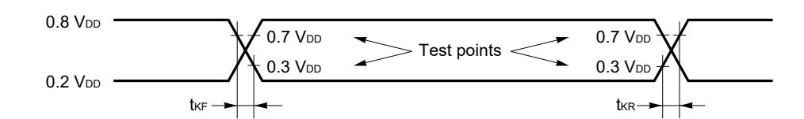

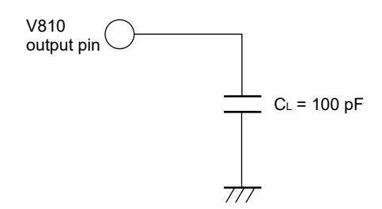

#### **Clock Timing**

#### **Reset Timing**

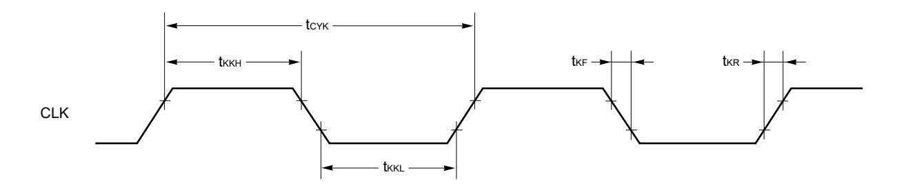

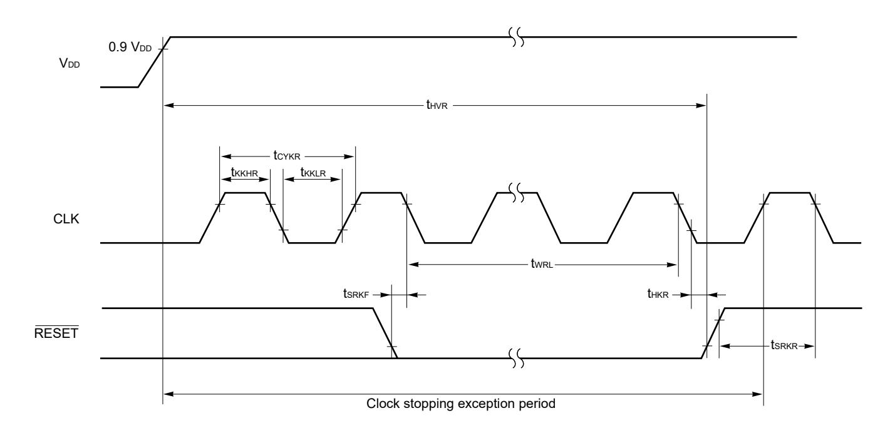

#### **Memory, I/O Access Timing**

**Note** A31 to A1, BE3 to BE0, R/W, MRQ, ST1, ST0, BLOCK, ADRSERR

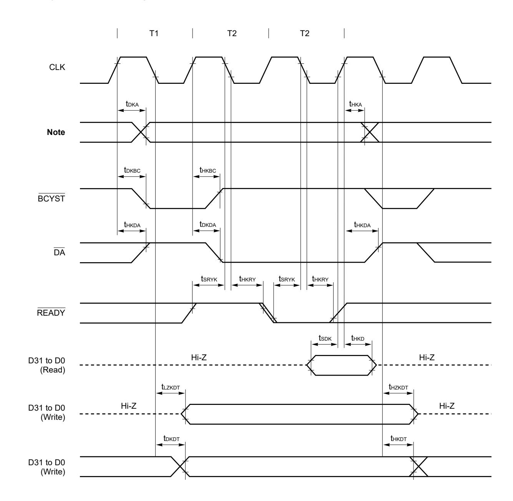

**Dynamic Bus Sizing Timing**

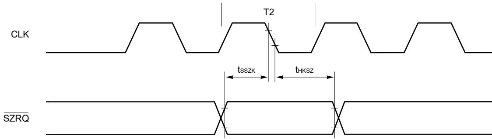

**Interrupt Timing**

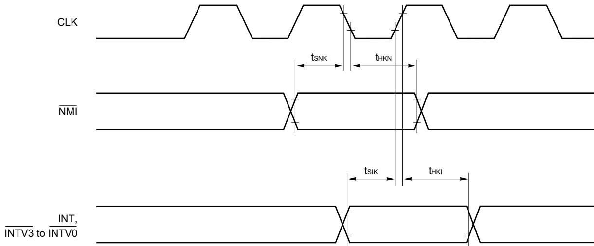

#### **Bus Hold Timing**

**Notes1.**A31 to A1, BE3 to BE0, R/W, MRQ, ST1, ST0**2.**The level immediately before the high-impedance state has been stored internally.

**Remark**A dashed line indicates high impedance.

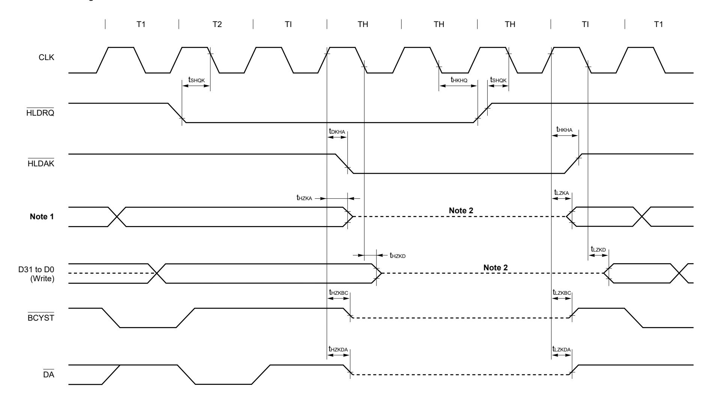

## **11. PACKAGE DRAWINGS**

**120-pin plastic QFP (28 x 28)**

#### **NOTE**

Each lead centerline is located within 0.15 mm (0.006 inch) of its true position (T.P.) at maximum material condition.

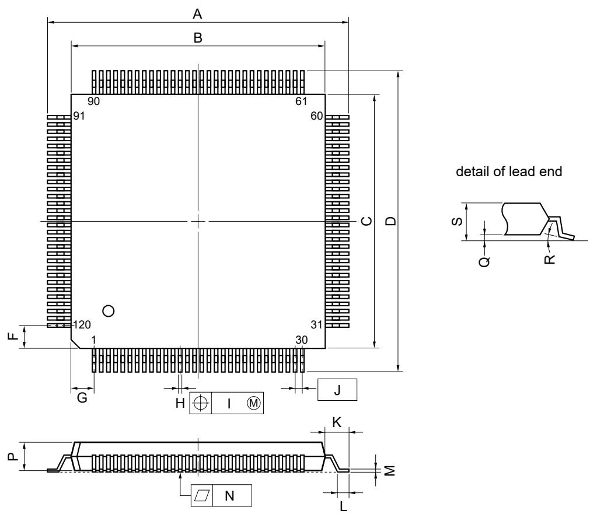

| ITEM | MILLIMETERS                            | INCHES                                    |
|------|----------------------------------------|-------------------------------------------|
| A    | 32.0±0.3                               | 1.260±0.012                               |
| B    | 28.0±0.2                               | 1.102 +0.009 -0.008 |
| C    | 28.0±0.2                               | 1.102 +0.009 -0.008 |
| D    | 32.0±0.3                               | 1.260±0.012                               |
| F    | 2.4                                    | 0.094                                     |
| G    | 2.4                                    | 0.094                                     |
| H    | 0.35±0.10                              | 0.014 +0.004 -0.005 |
| I    | 0.15                                   | 0.006                                     |
| J    | 0.8 (T.P.)                             | 0.031 (T.P.)                              |
| K    | 2.0±0.2                                | 0.079 +0.009 -0.008 |
| L    | 0.8±0.2                                | 0.031 +0.009 -0.008 |
| M    | 0.15 +0.10 -0.05 | 0.006 +0.004 -0.003 |
| N    | 0.1                                    | 0.004                                     |
| P    | 3.2                                    | 0.126                                     |
| Q    | 0.1±0.1                                | 0.004±0.004                               |
| R    | 5°±5°                                  | 5°±5°                                     |
| S    | 3.5 MAX.                               | 0.138 MAX.                                |

**P120GD-80-LBB, MBB-1**

**120-pin plastic TQFP (Fine pitch) (14 x 14)** H

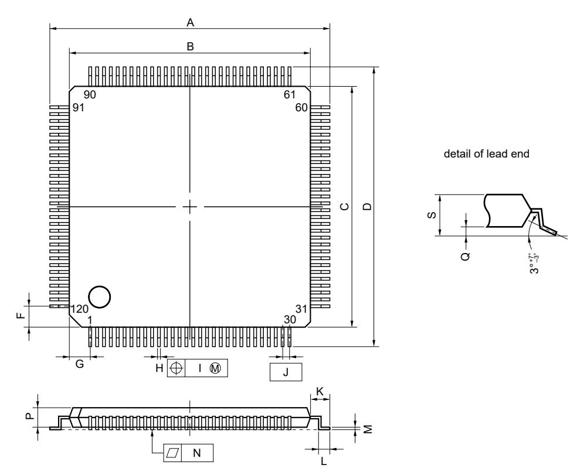

| S120GC-40-9EV                                                                                                          |      |             |                                           |
|------------------------------------------------------------------------------------------------------------------------|------|-------------|-------------------------------------------|
|                                                                                                                        | ITEM | MILLIMETERS | INCHES                                    |
| Each lead centerline is located within 0.09 mm (0.004 inch) of its true position (T.P.) at maximum material condition. |      |             |                                           |
|                                                                                                                        | A    | 16.0±0.2    | 0.630±0.008                               |
|                                                                                                                        | B    | 14.0±0.2    | 0.551 +0.009 -0.008 |
|                                                                                                                        | C    | 14.0±0.2    | 0.551 +0.009 -0.008 |
|                                                                                                                        | D    | 16.0±0.2    | 0.630±0.008                               |
|                                                                                                                        | F    | 1.2         | 0.047                                     |
|                                                                                                                        | G    | 1.2         | 0.047                                     |
|                                                                                                                        | H    | 0.18±0.05   | 0.007±0.002                               |
|                                                                                                                        | I    | 0.09        | 0.004                                     |
|                                                                                                                        | J    | 0.4 (T.P.)  | 0.016 (T.P.)                              |
|                                                                                                                        | K    | 1.0±0.2     | 0.039 +0.009 -0.008 |
|                                                                                                                        | L    | 0.5±0.2     | 0.020 +0.008 -0.009 |
|                                                                                                                        | M    | 0.145±0.05  | 0.006 +0.002 -0.003 |
|                                                                                                                        | N    | 0.08        | 0.003                                     |
|                                                                                                                        | P    | 1.0±0.1     | 0.039 +0.005 -0.004 |
|                                                                                                                        | Q    | 0.1±0.05    | 0.004±0.002                               |
|                                                                                                                        | S    | 1.2 MAX.    | 0.048 MAX.                                |

#### **176-pin ceramic PGA (Seamweld)**

| ITEM A D | MILLIMETERS 38.1±0.4 38.1±0.4 | INCHES +0.016 1.500 –0.015 +0.016 1.500 –0.015 |
|----------|-------------------------------|------------------------------------------------|
| F        | 2.54 (T.P.)                   |                                                |
| E        | 1.27                          | 0.050                                          |
| G H I J  | 2.8±0.3 0.5 MIN. 4.57 MAX.    | 0.110                                          |
| K        | 1.2±0.2 φ                     | 0.047                                          |
| L        | 0.46±0.05 φ                   | 0.018                                          |
| M        | 0.5                           | 0.020                                          |

#### **NOTE**

Each lead centerline is located within  $\phi 0.5$  mm ( $\phi 0.020$  inch) of its true position (T.P.) at maximum material condition.

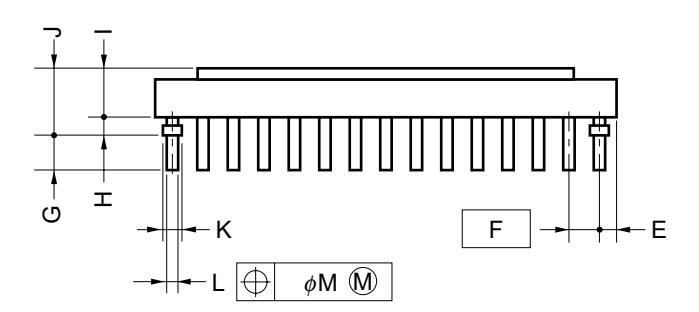

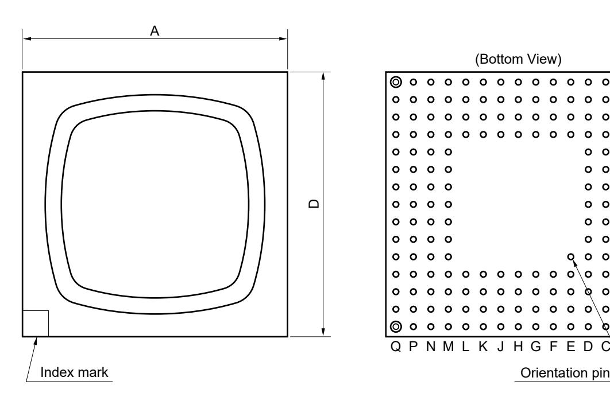

## **12. RECOMMENDED SOLDERING CONDITIONS**

The µPD70732 should be soldered and mounted under the conditions recommended in the table below.

For details of recommended soldering conditions, refer to the information document **"Semiconductor Device Mounting Technology Manual" (C10535E).**

For soldering methods and conditions other than those recommended below, contact an NEC sales representative.

**Table 12-1. Surface Mounting Type Soldering Conditions**

- **(1) µPD70732GD-16-LBB : 120-pin plastic QFP (28 x 28 mm) µPD70732GD-20-LBB : 120-pin plastic QFP (28 x 28 mm) µPD70732GD-25-LBB : 120-pin plastic QFP (28 x 28 mm)**

#### **E specification model only**

| Soldering Method | Soldering Conditions                                                         | Recommended                             |
|------------------|------------------------------------------------------------------------------|-----------------------------------------|
| Infrared reflow  | Package peak temperature: 235°C, Duration: 30 sec. Max. (at 210°C or above), | IR35-367-2                              |
|                  | Number of times: Twice Max., Time limit: 7 days Note                         | (thereafter 36 hours prebaking          |
| VPS              | Package peak temperature: 215°C, Duration: 40 sec. Max. (at 200°C or above), | VP15-367-2                              |
|                  | Number of times: Twice Max., Time limit: 7 days Note                         | (thereafter 36 hours prebaking          |
| Wave soldering   | Solder bath temperature: 260°C Max., Duration: 10 sec. Max.,                 | WS60-367-1                              |
|                  | Number of times: Once, Time limit: 7 days Note                               | (thereafter 36 hours prebaking required |
| Partial heating  | Pin temperature: 300°C Max., Duration: 3 sec. Max. (per device side)         | —                                       |

**Note** For the storage period after dry-pack decapsulation, storage conditions are Max. 25°C, 65% RH.

**Caution Use of more than one soldering method should be avoided (except for partial heating).**

**(2) µPD70732GC-25-9EV: 120-pin plastic TQFP (Fine pitch) (14 x 14 mm)** H

| Soldering Method | Soldering Conditions                                                         | Recommended                    |
|------------------|------------------------------------------------------------------------------|--------------------------------|
| Infrared reflow  | Package peak temperature: 235°C, Duration: 30 sec. Max. (at 210°C or above), | IR35-107-2                     |
|                  | Number of times: Twice Max., Time limit: 7 days Note                         | (thereafter 10 hours prebaking |
| VPS              | Package peak temperature: 215°C, Duration: 40 sec. Max. (at 200°C or above), | VP15-107-2                     |
|                  | Number of times: Twice Max., Time limit: 7 days Note                         | (thereafter 10 hours prebaking |
| Partial heating  | Pin temperature: 300°C Max., Duration: 3 sec. Max. (per device side)         | —                              |

**Note** For the storage period after dry-pack decapsulation, storage conditions are Max. 25°C, 65% RH.

**Caution Use of more than one soldering method should be avoided (except for partial heating).**

**Table 12-2. Insertion Type Soldering Conditions**

**µPD70732R-25: 176-pin ceramic PGA (Seam weld)**

| Soldering Method | Soldering Conditions                                             |
|------------------|------------------------------------------------------------------|
| Wave soldering   | Solder bath temperature: 260°C Max., Duration: 10 sec. Max.      |
| Partial heating  | Pin temperature: 300°C Max., Duration: 3 sec. Max. (per one pin) |

**Caution Apply wave soldering only to the pins and be careful not to bring solder into direct contact with the package.**

# **NOTES FOR CMOS DEVICES**

# **1 PRECAUTION AGAINST ESD FOR SEMICONDUCTORS**

**Note: Strong electric field, when exposed to a MOS device, can cause destruction of the gate oxide and ultimately degrade the device operation. Steps must be taken to stop generation of static electricity as much as possible, and quickly dissipate it once, when it has occurred. Environmental control must be adequate. When it is dry, humidifier should be used. It is recommended to avoid using insulators that easily build static electricity. Semiconductor devices must be stored and transported in an anti-static container, static shielding bag or conductive material. All test and measurement tools including work bench and floor should be grounded. The operator should be grounded using wrist strap. Semiconductor devices must not be touched with bare hands. Similar precautions need to be taken for PW boards with semiconductor devices on it.**

# **2 HANDLING OF UNUSED INPUT PINS FOR CMOS**

**Note: No connection for CMOS device inputs can be cause of malfunction. If no connection is provided to the input pins, it is possible that an internal input level may be generated due to noise, etc., hence causing malfunction. CMOS devices behave differently than Bipolar or NMOS devices. Input levels of CMOS devices must be fixed high or low by using a pull-up or pull-down circuitry. Each unused pin should be connected to VDD or GND with a resistor, if it is considered to have a possibility of being an output pin. All handling related to the unused pins must be judged device by device and related specifications governing the devices.**

# **3 STATUS BEFORE INITIALIZATION OF MOS DEVICES**

**Note: Power-on does not necessarily define initial status of MOS device. Production process of MOS does not define the initial operation status of the device. Immediately after the power source is turned ON, the devices with reset function have not yet been initialized. Hence, power-on does not guarantee out-pin levels, I/O settings or contents of registers. Device is not initialized until the reset signal is received. Reset operation must be executed immediately after power-on for devices having reset function.**

#### **NEC Electronics Inc. (U.S.)**

Mountain View, California Tel: 800-366-9782 Fax: 800-729-9288

#### **NEC Electronics (Germany) GmbH**

Duesseldorf, Germany Tel: 0211-65 03 02 Fax: 0211-65 03 490

#### **NEC Electronics (UK) Ltd.**

Milton Keynes, UK Tel: 01908-691-133 Fax: 01908-670-290

#### **NEC Electronics Italiana s.r.1.**

Milano, Italy Tel: 02-66 75 41 Fax: 02-66 75 42 99

#### **NEC Electronics Hong Kong Ltd.**

Hong Kong Tel: 2886-9318 Fax: 2886-9022/9044

#### **NEC Electronics Hong Kong Ltd.**

Seoul Branch Seoul, Korea Tel: 02-528-0303 Fax: 02-528-4411

#### **NEC Electronics Singapore Pte. Ltd.**

United Square, Singapore 1130 Tel: 253-8311 Fax: 250-3583

#### **NEC Electronics Taiwan Ltd.**

Taipei, Taiwan Tel: 02-719-2377 Fax: 02-719-5951

#### **NEC do Brasil S.A.**

Sao Paulo-SP, Brasil Tel: 011-889-1680 Fax: 011-889-1689

# **Regional Information**

Some information contained in this document may vary from country to country. Before using any NEC product in your application, please contact the NEC office in your country to obtain a list of authorized representatives and distributors. They will verify:

- Device availability
- Ordering information
- Product release schedule
- Availability of related technical literature
- Development environment specifications (for example, specifications for third-party tools and components, host computers, power plugs, AC supply voltages, and so forth)
- Network requirements

In addition, trademarks, registered trademarks, export restrictions, and other legal issues may also vary from country to country.

#### **NEC Electronics (Germany) GmbH**

Benelux Office Eindhoven, The Netherlands Tel: 040-2445845 Fax: 040-2444580

#### **NEC Electronics (France) S.A.**

France Tel: 01-30-67 58 00 Fax: 01-30-67 58 99

#### **NEC Electronics (France) S.A.**

Spain Office Madrid, Spain Tel: 01-504-2787 Fax: 01-504-2860

#### **NEC Electronics (Germany) GmbH**

Scandinavia Office Taeby Sweden Tel: 8-63 80 820 Fax: 8-63 80 388

#### **Reference**: Electrical Characteristics for Microcomputer (IEI-601)

No part of this document may be copied or reproduced in any form or by any means without the prior written consent of NEC Corporation. NEC Corporation assumes no responsibility for any errors which may appear in this document.

NEC Corporation does not assume any liability for infringement of patents, copyrights or other intellectual property rights of third parties by or arising from use of a device described herein or any other liability arising from use of such device. No license, either express, implied or otherwise, is granted under any patents, copyrights or other intellectual property rights of NEC Corporation or others.

While NEC Corporation has been making continuous effort to enhance the reliability of its semiconductor devices, the possibility of defects cannot be eliminated entirely. To minimize risks of damage or injury to persons or property arising from a defect in an NEC semiconductor device, customers must incorporate sufficient safety measures in its design, such as redundancy, fire-containment, and anti-failure features.

NEC devices are classified into the following three quality grades:

"Standard", "Special", and "Specific". The Specific quality grade applies only to devices developed based on a customer designated "quality assurance program" for a specific application. The recommended applications of a device depend on its quality grade, as indicated below. Customers must check the quality grade of each device before using it in a particular application.

Standard: Computers, office equipment, communications equipment, test and measurement equipment, audio and visual equipment, home electronic appliances, machine tools, personal electronic equipment and industrial robots

Special: Transportation equipment (automobiles, trains, ships, etc.), traffic control systems, anti-disaster systems, anti-crime systems, safety equipment and medical equipment (not specifically designed for life support)

Specific: Aircrafts, aerospace equipment, submersible repeaters, nuclear reactor control systems, life support systems or medical equipment for life support, etc.

The quality grade of NEC devices is "Standard" unless otherwise specified in NEC's Data Sheets or Data Books. If customers intend to use NEC devices for applications other than those specified for Standard quality grade, they should contact an NEC sales representative in advance.

Anti-radioactive design is not implemented in this product.

The related documents indicated in this publication may include preliminary versions. However, preliminary versions are not marked as such.

#### **V805, V810, and V810 Family are trademarks of NEC Corporation.**