#### **Cyclone® V Device Handbook**

# **Volume 1: Device Interfaces and Integration**

101 Innovation Drive San Jose, CA 95134 www.altera.com

# Contents

**Logic Array Blocks and Adaptive Logic Modules in Cyclone® V Devices..... 1-1**

- LAB ..... 1-1
- MLAB ..... 1-2
- Local and Direct Link Interconnects ..... 1-3
- LAB Control Signals..... 1-4
- ALM Resources ..... 1-5
- ALM Output ..... 1-6
- ALM Operating Modes ..... 1-8
- Normal Mode ..... 1-8
- Extended LUT Mode ..... 1-8
- Arithmetic Mode ..... 1-8
- Shared Arithmetic Mode ..... 1-10
- Logic Array Blocks and Adaptive Logic Modules in Cyclone V Devices Revision History..... 1-11

**Embedded Memory Blocks in Cyclone V Devices..... 2-1**

- Types of Embedded Memory..... 2-1
- Embedded Memory Capacity in Cyclone V Devices..... 2-1
- Embedded Memory Design Guidelines for Cyclone V Devices..... 2-2
- Guideline: Consider the Memory Block Selection..... 2-2
- Guideline: Implement External Conflict Resolution..... 2-3
- Guideline: Customize Read-During-Write Behavior..... 2-3
- Same-Port Read-During-Write Mode..... 2-3
- Mixed-Port Read-During-Write Mode..... 2-4
- Guideline: Consider Power-Up State and Memory Initialization..... 2-7
- Guideline: Control Clocking to Reduce Power Consumption..... 2-7
- Embedded Memory Features..... 2-7
- Embedded Memory Configurations..... 2-9
- Mixed-Width Port Configurations..... 2-9
- M10K Blocks Mixed-Width Configurations..... 2-9
- Embedded Memory Modes..... 2-10
- Embedded Memory Clocking Modes..... 2-12
- Clocking Modes for Each Memory Mode..... 2-12
- Single Clock Mode..... 2-12
- Read/Write Clock Mode..... 2-13
- Input/Output Clock Mode..... 2-13
- Independent Clock Mode..... 2-13
- Asynchronous Clears in Clocking Modes..... 2-13
- Output Read Data in Simultaneous Read/Write..... 2-13
- Independent Clock Enables in Clocking Modes..... 2-13
- Parity Bit in Memory Blocks..... 2-14
- Byte Enable in Embedded Memory Blocks..... 2-14
- Byte Enable Controls in Memory Blocks..... 2-14

| Data Byte Output.....                                             | 2-15 |
| ----------------------------------------------------------------- | ---- |
| RAM Blocks Operations.....                                        | 2-15 |
| Memory Blocks Packed Mode Support.....                            | 2-16 |
| Memory Blocks Address Clock Enable Support.....                   | 2-16 |
| Embedded Memory Blocks in Cyclone V Devices Revision History..... | 2-18 |

**Variable Precision DSP Blocks in Cyclone V Devices..... 3-1**

| Features.....                                                            | 3-1  |
| ------------------------------------------------------------------------ | ---- |
| Supported Operational Modes in Cyclone V Devices.....                    | 3-2  |
| Resources.....                                                           | 3-2  |
| Design Considerations.....                                               | 3-3  |
| Operational Modes.....                                                   | 3-4  |
| Internal Coefficient and Pre-Adder.....                                  | 3-4  |
| Accumulator.....                                                         | 3-4  |
| Chainout Adder.....                                                      | 3-4  |
| Block Architecture.....                                                  | 3-4  |
| Input Register Bank.....                                                 | 3-5  |
| Pre-Adder.....                                                           | 3-7  |
| Internal Coefficient.....                                                | 3-7  |
| Multipliers.....                                                         | 3-8  |
| Adder.....                                                               | 3-8  |
| Accumulator and Chainout Adder.....                                      | 3-8  |
| Systolic Registers.....                                                  | 3-9  |
| Double Accumulation Register.....                                        | 3-9  |
| Output Register Bank.....                                                | 3-9  |
| Operational Mode Descriptions.....                                       | 3-10 |
| Independent Multiplier Mode.....                                         | 3-10 |
| 9 x 9 Independent Multiplier.....                                        | 3-11 |
| 18 x 18 or 18 x 19 Independent Multiplier.....                           | 3-11 |
| 18 x 25 Independent Multiplier.....                                      | 3-12 |
| 20 x 24 Independent Multiplier.....                                      | 3-12 |
| 27 x 27 Independent Multiplier.....                                      | 3-13 |
| Independent Complex Multiplier Mode.....                                 | 3-13 |
| 18 x 19 Complex Multiplier.....                                          | 3-14 |
| Multiplier Adder Sum Mode.....                                           | 3-15 |
| 18 x 18 Multiplication Summed with 36-Bit Input Mode.....                | 3-15 |
| Systolic FIR Mode.....                                                   | 3-16 |
| 18-Bit Systolic FIR Mode.....                                            | 3-16 |
| 27-Bit Systolic FIR Mode.....                                            | 3-17 |
| Variable Precision DSP Blocks in Cyclone V Devices Revision History..... | 3-18 |

**Clock Networks and PLLs in Cyclone V Devices..... 4-1**

| Clock Networks.....                       | 4-1 |
| ----------------------------------------- | --- |
| Clock Resources in Cyclone V Devices..... | 4-2 |
| Types of Clock Networks.....              | 4-4 |
| Global Clock Networks.....                | 4-4 |
| Regional Clock Networks.....              | 4-6 |

| Periphery Clock Networks.....                                      | 4-8  |
| ------------------------------------------------------------------ | ---- |
| Clock Sources Per Quadrant.....                                    | 4-10 |
| Types of Clock Regions.....                                        | 4-11 |
| Entire Device Clock Region.....                                    | 4-11 |
| Regional Clock Region.....                                         | 4-11 |
| Dual-Regional Clock Region.....                                    | 4-11 |
| Clock Network Sources.....                                         | 4-12 |
| Dedicated Clock Input Pins.....                                    | 4-12 |
| Internal Logic.....                                                | 4-12 |
| HSSI Outputs.....                                                  | 4-13 |
| PLL Clock Outputs.....                                             | 4-13 |
| Clock Input Pin Connections to GCLK and RCLK Networks.....         | 4-13 |
| Clock Output Connections.....                                      | 4-15 |
| Clock Control Block.....                                           | 4-15 |
| Pin Mapping in Cyclone V Devices.....                              | 4-15 |
| GCLK Control Block.....                                            | 4-15 |
| RCLK Control Block.....                                            | 4-16 |
| PCLK Control Block.....                                            | 4-17 |
| External PLL Clock Output Control Block.....                       | 4-17 |
| Clock Power Down.....                                              | 4-17 |
| Clock Enable Signals.....                                          | 4-18 |
| Cyclone V PLLs.....                                                | 4-19 |
| PLL Physical Counters in Cyclone V Devices.....                    | 4-20 |
| PLL Locations in Cyclone V Devices.....                            | 4-21 |
| PLL Migration Guidelines .....                                     | 4-27 |
| Fractional PLL Architecture.....                                   | 4-28 |
| Fractional PLL Usage.....                                          | 4-28 |
| PLL Cascading.....                                                 | 4-28 |
| PLL External Clock I/O Pins.....                                   | 4-29 |
| PLL Control Signals.....                                           | 4-30 |
| areset.....                                                        | 4-30 |
| locked.....                                                        | 4-31 |
| Clock Feedback Modes.....                                          | 4-31 |
| Source Synchronous Mode.....                                       | 4-32 |
| LVDS Compensation Mode.....                                        | 4-32 |
| Direct Mode.....                                                   | 4-33 |
| Normal Compensation Mode.....                                      | 4-33 |
| Zero-Delay Buffer Mode.....                                        | 4-34 |
| External Feedback Mode.....                                        | 4-36 |
| Clock Multiplication and Division.....                             | 4-37 |
| Programmable Phase Shift.....                                      | 4-38 |
| Programmable Duty Cycle.....                                       | 4-38 |
| Clock Switchover.....                                              | 4-39 |
| Automatic Switchover.....                                          | 4-39 |
| Automatic Switchover with Manual Override.....                     | 4-41 |
| Manual Clock Switchover.....                                       | 4-42 |
| Guidelines.....                                                    | 4-43 |
| PLL Reconfiguration and Dynamic Phase Shift.....                   | 4-44 |
| Clock Networks and PLLs in Cyclone V Devices Revision History..... | 4-44 |

**I/O Features in Cyclone V Devices..... 5-1**

- I/O Resources Per Package for Cyclone V Devices..... 5-1
- I/O Vertical Migration for Cyclone V Devices..... 5-5
  - Verifying Pin Migration Compatibility..... 5-6
- I/O Standards Support in Cyclone V Devices..... 5-6
  - I/O Standards Support for FPGA I/O in Cyclone V Devices..... 5-7
  - I/O Standards Support for HPS I/O in Cyclone V Devices..... 5-8
  - I/O Standards Voltage Levels in Cyclone V Devices..... 5-9
  - MultiVolt I/O Interface in Cyclone V Devices..... 5-11
- I/O Design Guidelines for Cyclone V Devices..... 5-12
  - Mixing Voltage-Referenced and Non-Voltage-Referenced I/O Standards..... 5-12
    - Non-Voltage-Referenced I/O Standards..... 5-12
    - Voltage-Referenced I/O Standards..... 5-12
    - Mixing Voltage-Referenced and Non-Voltage Referenced I/O Standards..... 5-13
- PLLs and Clocking..... 5-13
  - Guideline: Use PLLs in Integer PLL Mode for LVDS..... 5-13
  - Guideline: Reference Clock Restriction for LVDS Application..... 5-13
  - Guideline: Using LVDS Differential Channels..... 5-14
- LVDS Interface with External PLL Mode..... 5-16
  - Altera\_PLL Signal Interface with ALTLVDS IP Core..... 5-16
  - Altera\_PLL Parameter Values for External PLL Mode..... 5-17
  - Connection between Altera\_PLL and ALTLVDS..... 5-19
- Guideline: Use the Same VCCPD for All I/O Banks in a Group..... 5-19
- Guideline: Ensure Compatible VCCIO and VCCPD Voltage in the Same Bank..... 5-20
- Guideline: VREF Pin Restrictions..... 5-20
- Guideline: Observe Device Absolute Maximum Rating for 3.3 V Interfacing..... 5-20
- Guideline: Adhere to the LVDS I/O Restrictions and Differential Pad Placement Rules.... 5-21
- Guideline: Pin Placement for General Purpose High-Speed Signals..... 5-21

- I/O Banks Locations in Cyclone V Devices..... 5-21
- I/O Banks Groups in Cyclone V Devices..... 5-24
  - Modular I/O Banks for Cyclone V E Devices..... 5-24
  - Modular I/O Banks for Cyclone V GX Devices..... 5-25
  - Modular I/O Banks for Cyclone V GT Devices..... 5-26
  - Modular I/O Banks for Cyclone V SE Devices..... 5-27
  - Modular I/O Banks for Cyclone V SX Devices..... 5-27
  - Modular I/O Banks for Cyclone V ST Devices..... 5-28
- I/O Element Structure in Cyclone V Devices..... 5-29
  - I/O Buffer and Registers in Cyclone V Devices..... 5-29
- Programmable IOE Features in Cyclone V Devices..... 5-31
  - Programmable Current Strength..... 5-33
  - Programmable Output Slew Rate Control..... 5-34
  - Programmable IOE Delay..... 5-35
  - Programmable Output Buffer Delay..... 5-35
  - Programmable Pre-Emphasis..... 5-35
  - Programmable Differential Output Voltage..... 5-36
  - Open-Drain Output..... 5-37
  - Bus-Hold Circuitry..... 5-38

| Pull-up Resistor.....                                            | 5-38 |
| ---------------------------------------------------------------- | ---- |
| On-Chip I/O Termination in Cyclone V Devices.....                | 5-38 |
| R S OCT without Calibration in Cyclone V Devices..... | 5-39 |
| R S OCT with Calibration in Cyclone V Devices.....    | 5-41 |
| R T OCT with Calibration in Cyclone V Devices.....    | 5-43 |
| Dynamic OCT in Cyclone V Devices.....                            | 5-45 |
| LVDS Input R D OCT in Cyclone V Devices.....          | 5-46 |
| OCT Calibration Block in Cyclone V Devices.....                  | 5-47 |
| Calibration Block Locations in Cyclone V Devices.....            | 5-48 |
| Sharing an OCT Calibration Block on Multiple I/O Banks.....      | 5-48 |
| OCT Calibration Block Sharing Example.....                       | 5-49 |
| External I/O Termination for Cyclone V Devices.....              | 5-50 |
| Single-ended I/O Termination.....                                | 5-51 |
| Differential I/O Termination.....                                | 5-53 |
| Differential HSTL, SSTL, and HSUL Termination.....               | 5-54 |
| LVDS, RSDS, SLVS, and Mini-LVDS Termination.....                 | 5-55 |
| Emulated LVDS, RSDS, and Mini-LVDS Termination.....              | 5-56 |
| LVPECL Termination.....                                          | 5-58 |
| Dedicated High-Speed Circuitries.....                            | 5-59 |
| High-Speed Differential I/O Locations.....                       | 5-59 |
| LVDS SERDES Circuitry.....                                       | 5-62 |
| True LVDS Buffers in Cyclone V Devices.....                      | 5-63 |
| Emulated LVDS Buffers in Cyclone V Devices.....                  | 5-71 |
| Differential Transmitter in Cyclone V Devices.....               | 5-71 |
| Transmitter Blocks.....                                          | 5-71 |
| Transmitter Clocking.....                                        | 5-72 |
| Serializer Bypass for DDR and SDR Operations.....                | 5-73 |
| Differential Receiver in Cyclone V Devices.....                  | 5-73 |
| Receiver Blocks in Cyclone V Devices.....                        | 5-74 |
| Data Realignment Block (Bit Slip).....                           | 5-74 |
| Deserializer.....                                                | 5-75 |
| Receiver Mode in Cyclone V Devices.....                          | 5-76 |
| LVDS Receiver Mode.....                                          | 5-76 |
| Receiver Clocking for Cyclone V Devices.....                     | 5-77 |
| Differential I/O Termination for Cyclone V Devices.....          | 5-77 |
| Source-Synchronous Timing Budget.....                            | 5-78 |
| Differential Data Orientation.....                               | 5-78 |
| Differential I/O Bit Position.....                               | 5-79 |
| Differential Bit Naming Conventions.....                         | 5-79 |
| Transmitter Channel-to-Channel Skew.....                         | 5-80 |
| Receiver Skew Margin for LVDS Mode.....                          | 5-81 |
| I/O Features in Cyclone V Devices Revision History.....          | 5-83 |

## External Memory Interfaces in Cyclone V Devices.....6-1

| External Memory Performance.....                       | 6-1 |
| ------------------------------------------------------ | --- |
| HPS External Memory Performance.....                   | 6-2 |
| Memory Interface Pin Support in Cyclone V Devices..... | 6-2 |
| Guideline: Using DQ/DQS Pins.....                      | 6-3 |

| DQ/DQS Bus Mode Pins for Cyclone V Devices.....                       | 6-3  |
| --------------------------------------------------------------------- | ---- |
| DQ/DQS Groups in Cyclone V E.....                                     | 6-4  |
| DQ/DQS Groups in Cyclone V GX.....                                    | 6-6  |
| DQ/DQS Groups in Cyclone V GT.....                                    | 6-8  |
| DQ/DQS Groups in Cyclone V SE.....                                    | 6-10 |
| DQ/DQS Groups in Cyclone V SX.....                                    | 6-11 |
| DQ/DQS Groups in Cyclone V ST.....                                    | 6-11 |
| External Memory Interface Features in Cyclone V Devices.....          | 6-12 |
| UniPHY IP.....                                                        | 6-12 |
| External Memory Interface Datapath.....                               | 6-13 |
| DQS Phase-Shift Circuitry.....                                        | 6-13 |
| Delay-Locked Loop.....                                                | 6-18 |
| DLL Reference Clock Input for Cyclone V Devices.....                  | 6-19 |
| DLL Phase-Shift.....                                                  | 6-20 |
| PHY Clock (PHYCLK) Networks.....                                      | 6-21 |
| DQS Logic Block.....                                                  | 6-26 |
| Update Enable Circuitry.....                                          | 6-27 |
| DQS Delay Chain.....                                                  | 6-27 |
| DQS Postamble Circuitry.....                                          | 6-28 |
| Half Data Rate Block.....                                             | 6-28 |
| Dynamic OCT Control.....                                              | 6-29 |
| IOE Registers.....                                                    | 6-30 |
| Input Registers.....                                                  | 6-30 |
| Output Registers.....                                                 | 6-30 |
| Delay Chains.....                                                     | 6-31 |
| I/O and DQS Configuration Blocks.....                                 | 6-33 |
| Hard Memory Controller.....                                           | 6-34 |
| Features of the Hard Memory Controller.....                           | 6-34 |
| Multi-Port Front End .....                                            | 6-36 |
| Numbers of MPFE Ports Per Device.....                                 | 6-37 |
| Bonding Support.....                                                  | 6-37 |
| Hard Memory Controller Width for Cyclone V E.....                     | 6-40 |
| Hard Memory Controller Width for Cyclone V GX.....                    | 6-40 |
| Hard Memory Controller Width for Cyclone V GT.....                    | 6-41 |
| Hard Memory Controller Width for Cyclone V SE.....                    | 6-42 |
| Hard Memory Controller Width for Cyclone V SX.....                    | 6-42 |
| Hard Memory Controller Width for Cyclone V ST.....                    | 6-43 |
| External Memory Interfaces in Cyclone V Devices Revision History..... | 6-44 |

**Configuration, Design Security, and Remote System Upgrades in Cyclone V Devices..... 7-1**

| Enhanced Configuration and Configuration via Protocol..... | 7-1 |
| ---------------------------------------------------------- | --- |
| MSEL Pin Settings.....                                     | 7-2 |
| Configuration Sequence.....                                | 7-3 |
| Power Up.....                                              | 7-5 |
| Reset.....                                                 | 7-5 |
| Configuration.....                                         | 7-6 |
| Configuration Error Handling.....                          | 7-6 |

| Initialization.....                                                            | 7-6  |
| ------------------------------------------------------------------------------ | ---- |
| User Mode.....                                                                 | 7-6  |
| Configuration Timing Waveforms.....                                            | 7-8  |
| FPP Configuration Timing.....                                                  | 7-8  |
| AS Configuration Timing.....                                                   | 7-10 |
| PS Configuration Timing.....                                                   | 7-11 |
| Device Configuration Pins.....                                                 | 7-11 |
| I/O Standards and Drive Strength for Configuration Pins.....                   | 7-13 |
| Configuration Pin Options in the Intel Quartus Prime Software.....             | 7-14 |
| Fast Passive Parallel Configuration.....                                       | 7-15 |
| Fast Passive Parallel Single-Device Configuration.....                         | 7-15 |
| Fast Passive Parallel Multi-Device Configuration.....                          | 7-16 |
| Pin Connections and Guidelines.....                                            | 7-16 |
| Using Multiple Configuration Data.....                                         | 7-16 |
| Using One Configuration Data.....                                              | 7-17 |
| Transmitting Configuration Data.....                                           | 7-18 |
| Active Serial Configuration.....                                               | 7-19 |
| DATA Clock (DCLK).....                                                         | 7-19 |
| Active Serial Single-Device Configuration.....                                 | 7-20 |
| Active Serial Multi-Device Configuration.....                                  | 7-21 |
| Pin Connections and Guidelines.....                                            | 7-22 |
| Using Multiple Configuration Data.....                                         | 7-22 |
| Estimating the Active Serial Configuration Time.....                           | 7-23 |
| Using EPCS and EPCQ Devices.....                                               | 7-23 |
| Controlling EPCS and EPCQ Devices.....                                         | 7-24 |
| Evaluating Data Setup and Hold Timing Slack in AS Configuration.....           | 7-24 |
| Programming EPCS and EPCQ Devices.....                                         | 7-25 |
| Programming EPCS Using the JTAG Interface.....                                 | 7-25 |
| Programming EPCQ Using the JTAG Interface.....                                 | 7-26 |
| Programming EPCS Using the Active Serial Interface.....                        | 7-27 |
| Programming EPCQ Using the Active Serial Interface.....                        | 7-28 |
| Passive Serial Configuration.....                                              | 7-29 |
| Passive Serial Single-Device Configuration Using an External Host.....         | 7-30 |
| Passive Serial Single-Device Configuration Using an Altera Download Cable..... | 7-30 |
| Passive Serial Multi-Device Configuration.....                                 | 7-31 |
| Pin Connections and Guidelines.....                                            | 7-32 |
| Using Multiple Configuration Data.....                                         | 7-32 |
| Using One Configuration Data.....                                              | 7-32 |
| Using PC Host and Download Cable.....                                          | 7-33 |
| JTAG Configuration.....                                                        | 7-34 |
| JTAG Single-Device Configuration.....                                          | 7-35 |
| JTAG Multi-Device Configuration.....                                           | 7-36 |
| Pin Connections and Guidelines.....                                            | 7-36 |
| Using a Download Cable.....                                                    | 7-36 |
| CONFIG_IO JTAG Instruction.....                                                | 7-37 |
| Configuration Data Compression.....                                            | 7-38 |
| Enabling Compression Before Design Compilation.....                            | 7-38 |
| Enabling Compression After Design Compilation.....                             | 7-38 |
| Using Compression in Multi-Device Configuration.....                           | 7-38 |

- Remote System Upgrades.....7-39
- Configuration Images.....7-40
- Configuration Sequence in the Remote Update Mode.....7-41
- Remote System Upgrade Circuitry.....7-41
- Enabling Remote System Upgrade Circuitry.....7-42
- Remote System Upgrade Registers.....7-43
  - Control Register.....7-43
  - Status Register.....7-44
- Remote System Upgrade State Machine.....7-44
- User Watchdog Timer.....7-44
- Design Security.....7-45
  - Altera Unique Chip ID IP Core.....7-46
  - JTAG Secure Mode.....7-46
  - Security Key Types.....7-46
  - Security Modes.....7-47
  - Design Security Implementation Steps.....7-48
- Configuration, Design Security, and Remote System Upgrades in Cyclone V Devices Revision History.....7-49

**SEU Mitigation for Cyclone V Devices..... 8-1**

- Error Detection Features.....8-1
- Configuration Error Detection.....8-1
- User Mode Error Detection.....8-2
- Internal Scrubbing.....8-2
- Specifications.....8-2
  - Minimum EMR Update Interval.....8-3
  - Error Detection Frequency.....8-3
  - CRC Calculation Time For Entire Device.....8-4
- Using Error Detection Features in User Mode.....8-5
  - Enabling Error Detection.....8-5
  - CRC\_ERROR Pin.....8-6
  - Error Detection Registers.....8-6
  - Error Detection Process.....8-8
  - Testing the Error Detection Block.....8-9
- SEU Mitigation for Cyclone V Devices Document Revision History.....8-10

**JTAG Boundary-Scan Testing in Cyclone V Devices..... 9-1**

- BST Operation Control .....9-1
- IDCODE .....9-1
- Supported JTAG Instruction .....9-3
- JTAG Secure Mode .....9-7
- JTAG Private Instruction .....9-7
- I/O Voltage for JTAG Operation .....9-8
- Performing BST .....9-8
- Enabling and Disabling IEEE Std. 1149.1 BST Circuitry .....9-9
- Guidelines for IEEE Std. 1149.1 Boundary-Scan Testing.....9-10
- IEEE Std. 1149.1 Boundary-Scan Register .....9-10

Boundary-Scan Cells of a Cyclone V Device I/O Pin..... 9-11  
 JTAG Boundary-Scan Testing in Cyclone V Devices Revision History..... 9-13

**Power Management in Cyclone V Devices..... 10-1**

Power Consumption..... 10-1  
 Dynamic Power Equation..... 10-1  
 Hot-Socketing Feature..... 10-2  
 Hot-Socketing Implementation..... 10-2  
 Power-Up Sequence Recommendation for Cyclone V Devices..... 10-4  
 Power-On Reset Circuitry..... 10-5  
 Power Supplies Monitored and Not Monitored by the POR Circuitry..... 10-7  
 Power Management in Cyclone V Devices Revision History..... 10-8

#### **Logic Array Blocks and Adaptive Logic Modules in Cyclone® V Devices 1**

2023.10.18

CV-52001 **[Subscribe](https://www.intel.com/content/www/us/en/docs/programmable/683375/) [Send Feedback](mailto:FPGAtechdocfeedback@intel.com?subject=Feedback%20on%20(CV-52001%202023.10.18)%20Logic%20Array%20Blocks%20and%20Adaptive%20Logic%20Modules%20in%20Cyclone%20V%20Devices&body=We%20appreciate%20your%20feedback.%20In%20your%20comments,%20also%20specify%20the%20page%20number%20or%20paragraph.%20Thank%20you.)**

This chapter describes the features of the logic array block (LAB) in the Cyclone® V core fabric.

The LAB is composed of basic building blocks known as adaptive logic modules (ALMs) that you can configure to implement logic functions, arithmetic functions, and register functions.

You can use a quarter of the available LABs in the Cyclone V devices as a memory LAB (MLAB).

The Intel® Quartus® Prime software and other supported third-party synthesis tools, in conjunction with parameterized functions such as the library of parameterized modules (LPM), automatically choose the appropriate mode for common functions such as counters, adders, subtractors, and arithmetic functions.

This chapter contains the following sections:

- LAB
- ALM Operating Modes

#### Related Information

#### Cyclone**®** [V Device Handbook: Known Issues](https://www.intel.com/content/www/us/en/support/programmable/articles/000085691.html)

Lists the planned updates to the Cyclone V Device Handbook chapters.

#### **LAB**

The LABs are configurable logic blocks that consist of a group of logic resources. Each LAB contains dedicated logic for driving control signals to its ALMs.

MLAB is a superset of the LAB and includes all the LAB features.

Intel Corporation. All rights reserved. Intel, the Intel logo, Altera, Arria, Cyclone, Enpirion, MAX, Nios, Quartus and Stratix words and logos are trademarks of Intel Corporation or its subsidiaries in the U.S. and/or other countries. Intel warrants performance of its FPGA and semiconductor products to current specifications in accordance with Intel's standard warranty, but reserves the right to make changes to any products and services at any time without notice. Intel assumes no responsibility or liability arising out of the application or use of any information, product, or service described herein except as expressly agreed to in writing by Intel. Intel customers are advised to obtain the latest version of device specifications before relying on any published information and before placing orders for products or services.

\*Other names and brands may be claimed as the property of others.

[ISO](http://www.altera.com/support/devices/reliability/certifications/rel-certifications.html)

[9001:2015](http://www.altera.com/support/devices/reliability/certifications/rel-certifications.html) [Registered](http://www.altera.com/support/devices/reliability/certifications/rel-certifications.html)

**Figure 1-1: LAB Structure and Interconnects Overview in Cyclone V Devices**

This figure shows an overview of the Cyclone V LAB and MLAB structure with the LAB interconnects.

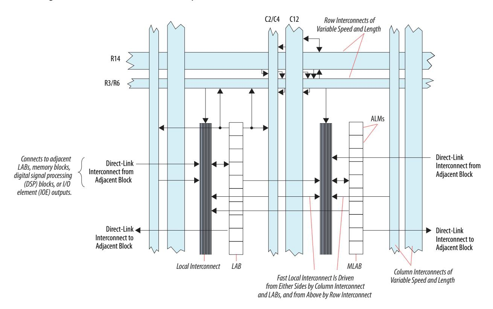

#### **MLAB**

Each MLAB supports a maximum of 640 bits of simple dual-port SRAM.

You can configure each ALM in an MLAB as a 32 x 2 memory block, resulting in a configuration of 32 x 20 simple dual-port SRAM block.

**Figure 1-2: LAB and MLAB Structure for Cyclone V Devices**

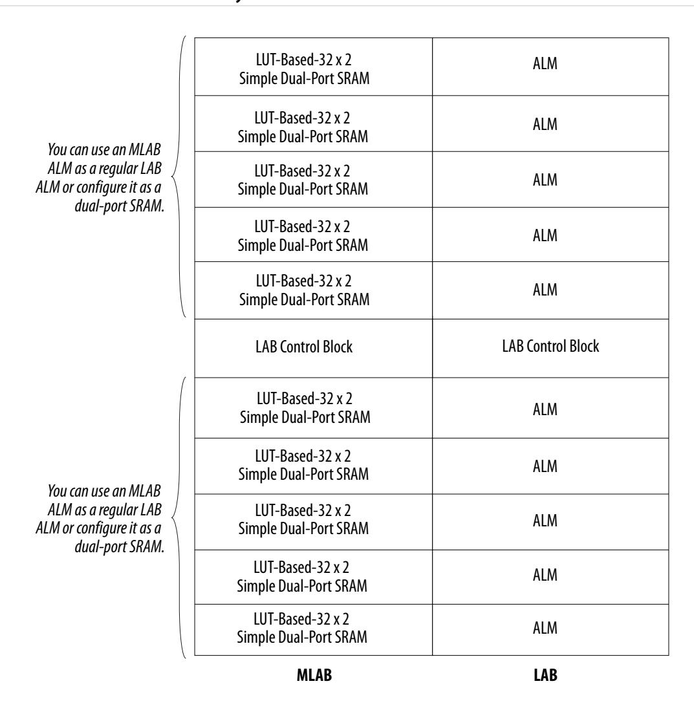

#### **Local and Direct Link Interconnects**

Each LAB can drive 30 ALMs through fast-local and direct-link interconnects. Ten ALMs are in any given LAB and ten ALMs are in each of the adjacent LABs.

The local interconnect can drive ALMs in the same LAB using column and row interconnects and ALM outputs in the same LAB.

Neighboring LABs, MLABs, M10K blocks, or digital signal processing (DSP) blocks from the left or right can also drive the LAB's local interconnect using the direct link connection.

The direct link connection feature minimizes the use of row and column interconnects, providing higher performance and flexibility.

**Figure 1-3: LAB Fast Local and Direct Link Interconnects for Cyclone V Devices**

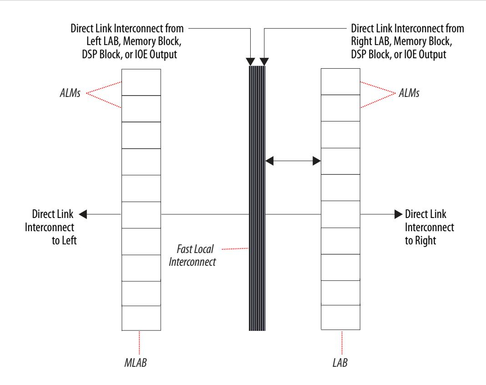

#### **LAB Control Signals**

Each LAB contains dedicated logic for driving the control signals to its ALMs, and has two unique clock sources and three clock enable signals.

The LAB control block generates up to three clocks using the two clock sources and three clock enable signals. An inverted clock source is considered as an individual clock source. Each clock and the clock enable signals are linked.

De-asserting the clock enable signal turns off the corresponding LAB-wide clock.

**Figure 1-4: LAB-Wide Control Signals for Cyclone V Devices**

This figure shows the clock sources and clock enable signals in a LAB.

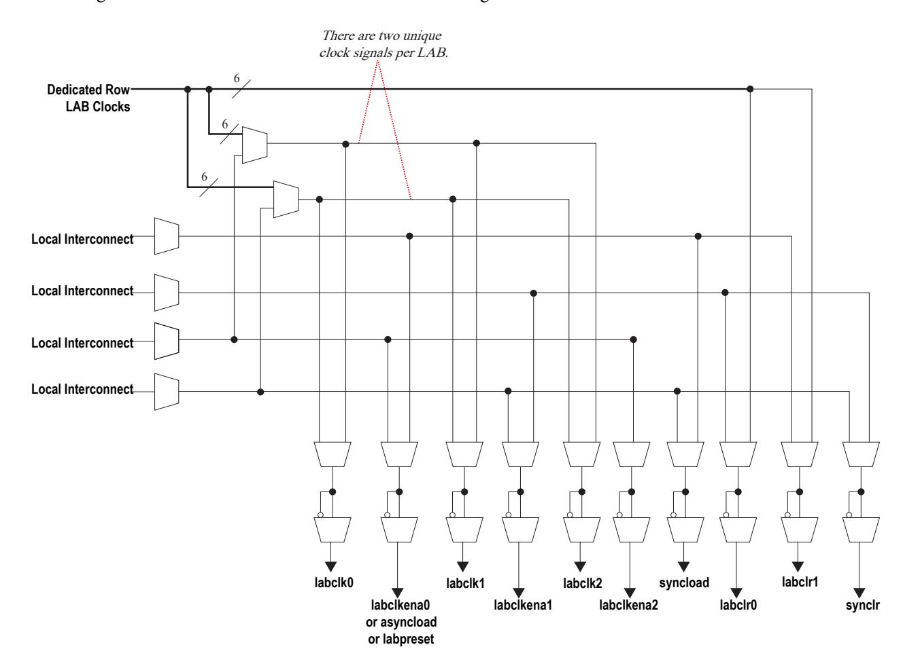

#### **ALM Resources**

One ALM contains four programmable registers. Each register has the following ports:

- Data
- Clock
- Synchronous and asynchronous clear
- Synchronous load

Global signals, general-purpose I/O (GPIO) pins, or any internal logic can drive the clock and clear control signals of an ALM register.

GPIO pins or internal logic drives the clock enable signal.

For combinational functions, the registers are bypassed and the output of the look-up table (LUT) drives directly to the outputs of an ALM.

Note: The Intel Quartus Prime software automatically configures the ALMs for optimized performance.

**Figure 1-5: ALM High-Level Block Diagram for Cyclone V Devices**

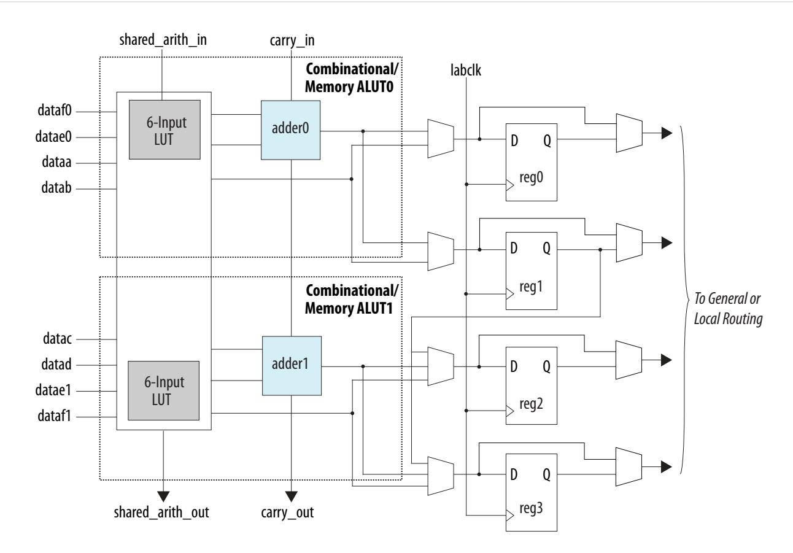

#### **ALM Output**

The general routing outputs in each ALM drive the local, row, and column routing resources. Two ALM outputs can drive column, row, or direct link routing connections, and one of these ALM outputs can also drive local interconnect resources.

The LUT, adder, or register output can drive the ALM outputs. The LUT or adder can drive one output while the register drives another output.

Register packing improves device utilization by allowing unrelated register and combinational logic to be packed into a single ALM. Another mechanism to improve fitting is to allow the register output to feed back into the look-up table (LUT) of the same ALM so that the register is packed with its own fan-out LUT. The ALM can also drive out registered and unregistered versions of the LUT or adder output.

**Figure 1-6: ALM Connection Details for Cyclone V Devices**

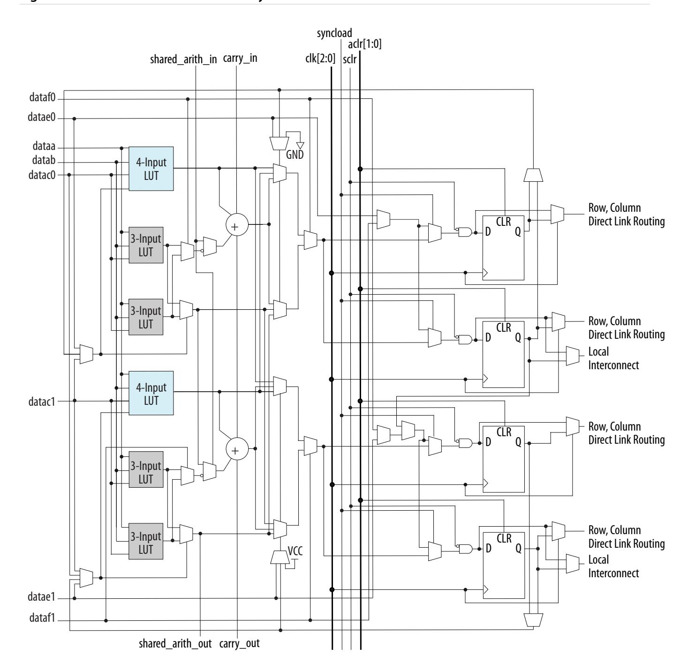

## **ALM Operating Modes**

The Cyclone V ALM operates in any of the following modes:

- Normal mode
- Extended LUT mode
- Arithmetic mode
- Shared arithmetic mode

#### **Normal Mode**

Normal mode allows two functions to be implemented in one Cyclone V ALM, or a single function of up to six inputs.

Up to eight data inputs from the LAB local interconnect are inputs to the combinational logic.

The ALM can support certain combinations of completely independent functions and various combina‐ tions of functions that have common inputs.

#### **Extended LUT Mode**

In this mode, if the 7-input function is unregistered, the unused eighth input is available for register packing.

Functions that fit into the template, as shown in the following figure, often appear in designs as "if-else" statements in Verilog HDL or VHDL code.

**Figure 1-7: Template for Supported 7-Input Functions in Extended LUT Mode for Cyclone V Devices**

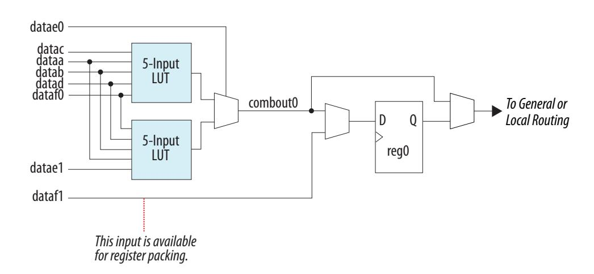

#### **Arithmetic Mode**

The ALM in arithmetic mode uses two sets of two 4-input LUTs along with two dedicated full adders.

The dedicated adders allow the LUTs to perform pre-adder logic; therefore, each adder can add the output of two 4-input functions.

The ALM supports simultaneous use of the adder's carry output along with combinational logic outputs. The adder output is ignored in this operation.

Using the adder with the combinational logic output provides resource savings of up to 50% for functions that can use this mode.

**Figure 1-8: ALM in Arithmetic Mode for Cyclone V Devices**

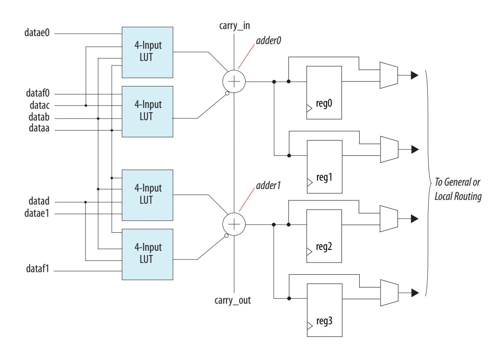

#### **Carry Chain**

The carry chain provides a fast carry function between the dedicated adders in arithmetic or shared arithmetic mode.

The two-bit carry select feature in Cyclone V devices halves the propagation delay of carry chains within the ALM. Carry chains can begin in either the first ALM or the fifth ALM in a LAB. The final carry-out signal is routed to an ALM, where it is fed to local, row, or column interconnects.

To avoid routing congestion in one small area of the device when a high fan-in arithmetic function is implemented, the LAB can support carry chains that only use either the top half or bottom half of the LAB before connecting to the next LAB. This leaves the other half of the ALMs in the LAB available for implementing narrower fan-in functions in normal mode. Carry chains that use the top five ALMs in the first LAB carry into the top half of the ALMs in the next LAB in the column. Carry chains that use the bottom five ALMs in the first LAB carry into the bottom half of the ALMs in the next LAB within the column. You can bypass the top-half of the LAB columns and bottom-half of the MLAB columns.

The Intel Quartus Prime Compiler creates carry chains longer than 20 ALMs (10 ALMs in arithmetic or shared arithmetic mode) by linking LABs together automatically. For enhanced fitting, a long carry chain runs vertically, allowing fast horizontal connections to the TriMatrix memory and DSP blocks. A carry chain can continue as far as a full column.

#### **Shared Arithmetic Mode**

The ALM in shared arithmetic mode can implement a 3-input add in the ALM.

This mode configures the ALM with four 4-input LUTs. Each LUT either computes the sum of three inputs or the carry of three inputs. The output of the carry computation is fed to the next adder using a dedicated connection called the shared arithmetic chain.

**Figure 1-9: ALM in Shared Arithmetic Mode for Cyclone V Devices**

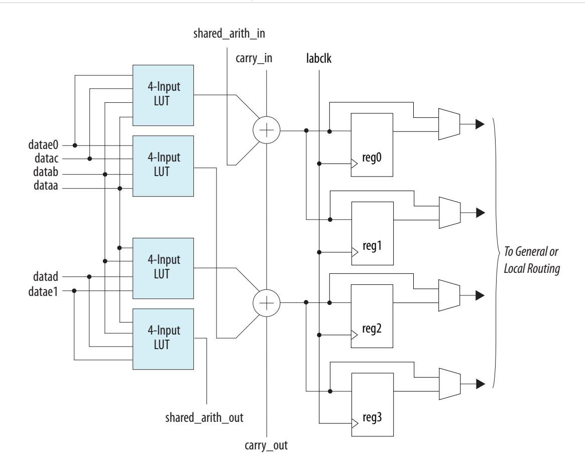

#### **Shared Arithmetic Chain**

The shared arithmetic chain available in enhanced arithmetic mode allows the ALM to implement a 3-input adder. This significantly reduces the resources necessary to implement large adder trees or correlator functions.

The shared arithmetic chain can begin in either the first or sixth ALM in a LAB.

Similar to carry chains, the top and bottom half of the shared arithmetic chains in alternate LAB columns can be bypassed. This capability allows the shared arithmetic chain to cascade through half of the ALMs in an LAB while leaving the other half available for narrower fan-in functionality. In every LAB, the column is top-half bypassable; while in MLAB, columns are bottom-half bypassable.

The Intel Quartus Prime Compiler creates shared arithmetic chains longer than 20 ALMs (10 ALMs in arithmetic or shared arithmetic mode) by linking LABs together automatically. To enhance fitting, a long shared arithmetic chain runs vertically, allowing fast horizontal connections to the TriMatrix memory and DSP blocks. A shared arithmetic chain can continue as far as a full column.

#### **Logic Array Blocks and Adaptive Logic Modules in Cyclone V Devices Revision History**

| Date         | Version    | Changes                                                               |
| ------------ | ---------- | --------------------------------------------------------------------- |
| August 2016  | 2016.08.24 | Added description on clock source in the LAB Control Signals section. |
|              | 2015.12.21 | Changed instances of Quartus II to Quartus Prime                      |
| January 2014 | 2014.01.10 | Added multiplexers for the bypass paths and register outputs in the   |
| May 2013     | 2013.05.06 | Added link to the known document issues in the Knowledge Base.        |
|              |            | Removed reg_chain_in and reg_chain_out ports in ALM high             |
|              | 2012.12.28 | Reorganized content and updated template.                             |
| June 2012    | 2.0        | Updated for the Quartus II software v12.0 release:                    |
|              | 1.1        | Minor text edits.                                                     |
| October 2011 | 1.0        | Initial release.                                                      |

# **Embedded Memory Blocks in Cyclone V Devices 2**

2023.10.18

CV-52002 **[Subscribe](https://www.intel.com/content/www/us/en/docs/programmable/683375/) [Send Feedback](mailto:FPGAtechdocfeedback@intel.com?subject=Feedback%20on%20(CV-52002%202023.10.18)%20Embedded%20Memory%20Blocks%20in%20Cyclone%20V%20Devices&body=We%20appreciate%20your%20feedback.%20In%20your%20comments,%20also%20specify%20the%20page%20number%20or%20paragraph.%20Thank%20you.)**

The embedded memory blocks in the devices are flexible and designed to provide an optimal amount of small- and large-sized memory arrays to fit your design requirements.

#### Related Information

#### Cyclone**®** [V Device Handbook: Known Issues](https://www.intel.com/content/www/us/en/support/programmable/articles/000085691.html)

Lists the planned updates to the Cyclone V Device Handbook chapters.

## **Types of Embedded Memory**

The Cyclone V devices contain two types of memory blocks:

- 10 Kb M10K blocks—blocks of dedicated memory resources. The M10K blocks are ideal for larger memory arrays while still providing a large number of independent ports.
- 640 bit memory logic array blocks (MLABs)—enhanced memory blocks that are configured from dualpurpose logic array blocks (LABs). The MLABs are ideal for wide and shallow memory arrays. The MLABs are optimized for implementation of shift registers for digital signal processing (DSP) applica‐ tions, wide shallow FIFO buffers, and filter delay lines. Each MLAB is made up of ten adaptive logic modules (ALMs). In the Cyclone V devices, you can configure these ALMs as ten 32 x 2 blocks, giving you one 32 x 20 simple dual-port SRAM block per MLAB.

#### **Embedded Memory Capacity in Cyclone V Devices**

**Table 2-1: Embedded Memory Capacity and Distribution in Cyclone V Devices**

| Member Variant Code | Block | M10K RAM Bit (Kb) | Block | MLAB RAM Bit (Kb) | Total RAM Bit (Kb) |
| ------------------- | ----- | ----------------- | ----- | ----------------- | ------------------ |
| A2                  | 176   | 1,760             | 314   | 196               | 1,956              |
| A4                  | 308   | 3,080             | 485   | 303               | 3,383              |
| A5 Cyclone V E      | 446   | 4,460             | 679   | 424               | 4,884              |
| A7                  | 686   | 6,860             | 1338  | 836               | 7,696              |
| A9                  | 1,220 | 12,200            | 2748  | 1,717             | 13,917             |

Intel Corporation. All rights reserved. Intel, the Intel logo, Altera, Arria, Cyclone, Enpirion, MAX, Nios, Quartus and Stratix words and logos are trademarks of Intel Corporation or its subsidiaries in the U.S. and/or other countries. Intel warrants performance of its FPGA and semiconductor products to current specifications in accordance with Intel's standard warranty, but reserves the right to make changes to any products and services at any time without notice. Intel assumes no responsibility or liability arising out of the application or use of any information, product, or service described herein except as expressly agreed to in writing by Intel. Intel customers are advised to obtain the latest version of device specifications before relying on any published information and before placing orders for products or services.

\*Other names and brands may be claimed as the property of others.

[ISO](http://www.altera.com/support/devices/reliability/certifications/rel-certifications.html) [9001:2015](http://www.altera.com/support/devices/reliability/certifications/rel-certifications.html) [Registered](http://www.altera.com/support/devices/reliability/certifications/rel-certifications.html)

| Member Variant Code | Block | M10K RAM Bit (Kb) | Block | MLAB RAM Bit (Kb) | Total RAM Bit (Kb) |
| ------------------- | ----- | ----------------- | ----- | ----------------- | ------------------ |
| C3                  | 135   | 1,350             | 291   | 182               | 1,532              |
| C4                  | 250   | 2,500             | 678   | 424               | 2,924              |
| C5 Cyclone V GX     | 446   | 4,460             | 678   | 424               | 4,884              |
| C7                  | 686   | 6,860             | 1338  | 836               | 7,696              |
| C9                  | 1,220 | 12,200            | 2748  | 1,717             | 13,917             |
| D5                  | 446   | 4,460             | 679   | 424               | 4,884              |
| D7 Cyclone V GT     | 686   | 6,860             | 1338  | 836               | 7,696              |
| D9                  | 1,220 | 12,200            | 2748  | 1,717             | 13,917             |
| A2                  | 140   | 1,400             | 221   | 138               | 1,538              |
| A4 Cyclone V SE     | 270   | 2,700             | 370   | 231               | 2,460              |
| A5                  | 397   | 3,970             | 768   | 480               | 4,450              |
| A6                  | 553   | 5,530             | 994   | 621               | 6,151              |
| C2                  | 140   | 1,400             | 221   | 138               | 1,538              |
| C4 Cyclone V SX     | 270   | 2,700             | 370   | 231               | 2,460              |
| C5                  | 397   | 3,970             | 768   | 480               | 4,450              |
| C6                  | 553   | 5,530             | 994   | 621               | 6,151              |
| D5 Cyclone V ST     | 397   | 3,970             | 768   | 480               | 4,450              |
| D6                  | 553   | 5,530             | 994   | 621               | 6,151              |

# **Embedded Memory Design Guidelines for Cyclone V Devices**

There are several considerations that require your attention to ensure the success of your designs. Unless noted otherwise, these design guidelines apply to all variants of this device family.

#### **Guideline: Consider the Memory Block Selection**

The Intel Quartus Prime software automatically partitions the user-defined memory into the memory blocks based on your design's speed and size constraints. For example, the Intel Quartus Prime software may spread out the memory across multiple available memory blocks to increase the performance of the design.

To assign the memory to a specific block size manually, use the RAM IP core in the IP Catalog.

For the memory logic array blocks (MLAB), you can implement single-port SRAM through emulation using the Intel Quartus Prime software. Emulation results in minimal additional use of logic resources.

Because of the dual-purpose architecture of the MLAB, only data input and output registers are available in the block. The MLABs gain read address registers from the ALMs. However, the write address and read data registers are internal to the MLABs.

#### **Guideline: Implement External Conflict Resolution**

In the true dual-port RAM mode, you can perform two write operations to the same memory location. However, the memory blocks do not have internal conflict resolution circuitry. To avoid unknown data being written to the address, implement external conflict resolution logic to the memory block.

#### **Guideline: Customize Read-During-Write Behavior**

Customize the read-during-write behavior of the memory blocks to suit your design requirements.

**Figure 2-1: Read-During-Write Data Flow**

This figure shows the difference between the two types of read-during-write operations available—same port and mixed port.

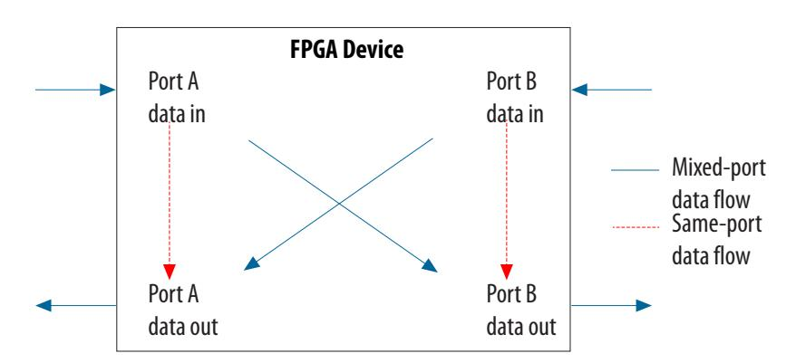

#### **Same-Port Read-During-Write Mode**

The same-port read-during-write mode applies to a single-port RAM or the same port of a true dual-port RAM.

**Table 2-2: Output Modes for Embedded Memory Blocks in Same-Port Read-During-Write Mode**

This table lists the available output modes if you select the embedded memory blocks in the same-port read-during-write mode.

| Output Mode  | Memory Type | Description                                         |
| ------------ | ----------- | --------------------------------------------------- |
|              | M10K        | The new data is available on the rising edge of the |
| "don't care" | M10K, MLAB  | The RAM outputs "don't care" values for a read     |

**Figure 2-2: Same-Port Read-During-Write: New Data Mode**

This figure shows sample functional waveforms of same-port read-during-write behavior in the "new data" mode.

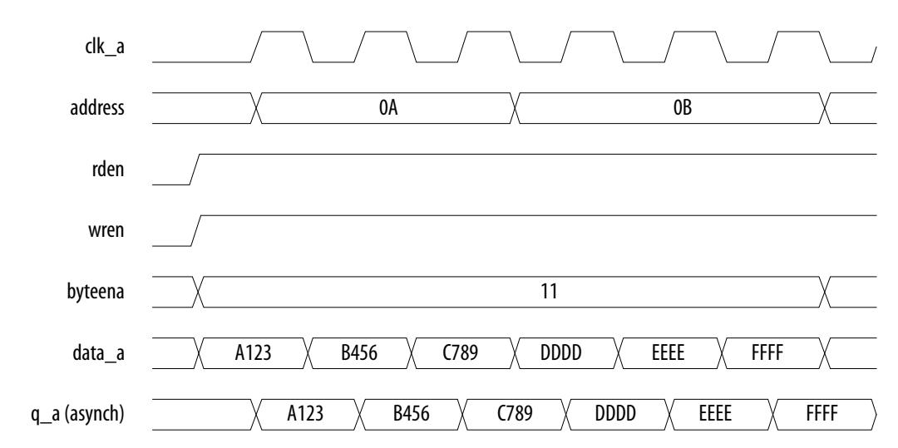

#### **Mixed-Port Read-During-Write Mode**

The mixed-port read-during-write mode applies to simple and true dual-port RAM modes where two ports perform read and write operations on the same memory address using the same clock—one port reading from the address, and the other port writing to it.

**Table 2-3: Output Modes for RAM in Mixed-Port Read-During-Write Mode**

| Output Mode | Memory Type | Description                                                 |
| ----------- | ----------- | ----------------------------------------------------------- |
| "new data"  | MLAB        | A read-during-write operation to different ports causes the |
| "old data"  | M10K, MLAB  | A read-during-write operation to different ports causes the |

| Output Mode  | Memory Type | Description                                                |
| ------------ | ----------- | ---------------------------------------------------------- |
| "don't care" | M10K, MLAB  | The RAM outputs “don’t care” or “unknown” value.           |
|              | MLAB        | The RAM outputs “don’t care” or “unknown” value. The Intel |

**Figure 2-3: Mixed-Port Read-During-Write: New Data Mode**

This figure shows a sample functional waveform of mixed-port read-during-write behavior for the "new data" mode.

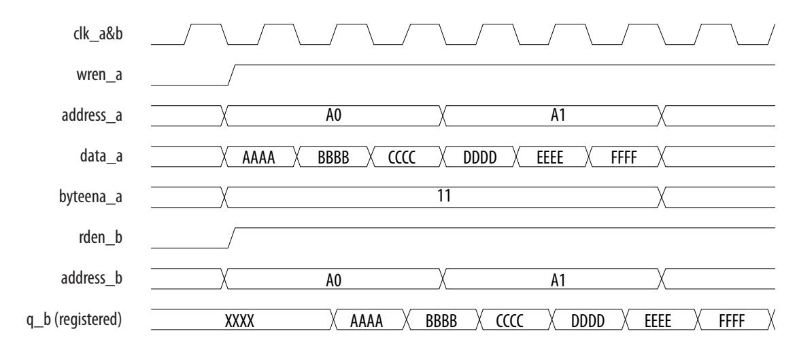

**Figure 2-4: Mixed-Port Read-During-Write: Old Data Mode**

This figure shows a sample functional waveform of mixed-port read-during-write behavior for the "old data" mode.

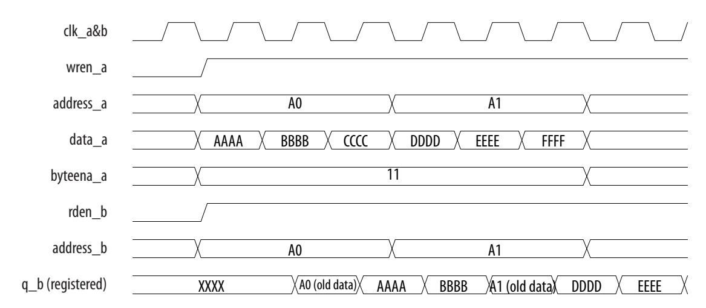

**Figure 2-5: Mixed-Port Read-During-Write: Don't Care or Constrained Don't Care Mode**

This figure shows a sample functional waveform of mixed-port read-during-write behavior for the "don't care" or "constrained don't care" mode.

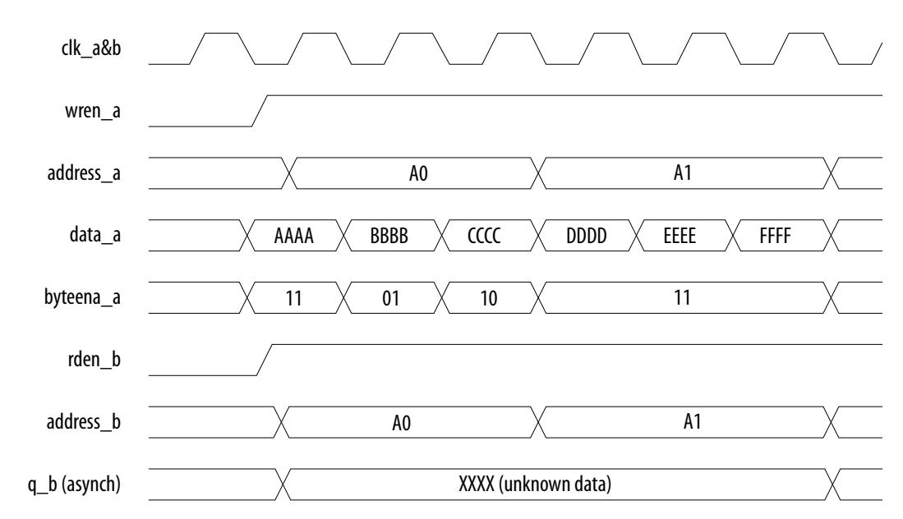

In the dual-port RAM mode, the mixed-port read-during-write operation is supported if the input registers have the same clock. The output value during the operation is "unknown."

#### Related Information

#### Embedded Memory (RAM: 1-PORT, RAM: 2-PORT, ROM: 1-PORT, and ROM: 2-PORT) User Guide

Provides more information about the RAM IP core that controls the read-during-write behavior.

#### **Guideline: Consider Power-Up State and Memory Initialization**

Consider the power up state of the different types of memory blocks if you are designing logic that evaluates the initial power-up values, as listed in the following table.

**Table 2-4: Initial Power-Up Values of Embedded Memory Blocks**

| Memory Type Output Registers | Power Up Value       |
| ---------------------------- | -------------------- |
| Used                         | Zero (cleared)       |
| Bypassed                     | Read memory contents |
| Used                         | Zero (cleared)       |
| Bypassed                     | Zero (cleared)       |

By default, the Intel Quartus Prime software initializes the RAM cells in Cyclone V devices to zero unless you specify a .mif.

All memory blocks support initialization with a .mif. You can create .mif files in the Intel Quartus Prime software and specify their use with the RAM IP core when you instantiate a memory in your design. Even if a memory is pre-initialized (for example, using a .mif), it still powers up with its output cleared.

#### Related Information

- [Embedded Memory \(RAM: 1-PORT, RAM:2-PORT, ROM: 1-PORT, and ROM: 2-PORT\) User Guide](http://www.altera.com/literature/ug/ug_ram_rom.pdf) Provides more information about .mif files.
- [Quartus II Handbook](http://www.altera.com/literature/hb/qts/quartusii_handbook.pdf) Provides more information about .mif files.

#### **Guideline: Control Clocking to Reduce Power Consumption**

Reduce AC power consumption in your design by controlling the clocking of each memory block:

- Use the read-enable signal to ensure that read operations occur only when necessary. If your design does not require read-during-write, you can reduce your power consumption by de-asserting the readenable signal during write operations, or during the period when no memory operations occur.
- Use the Intel Quartus Prime software to automatically place any unused memory blocks in low-power mode to reduce static power.

# **Embedded Memory Features**

**Table 2-5: Memory Features in Cyclone V Devices**

This table summarizes the features supported by the embedded memory blocks.

|     | Features                                   | M10K    | MLAB    |
| --- | ------------------------------------------ | ------- | ------- |
|     | Maximum operating frequency                | 315 MHz | 420 MHz |
|     | Capacity per block (including parity bits) | 10,240  | 640     |

| Features                          | M10K                  | MLAB                       |
| --------------------------------- | --------------------- | -------------------------- |
| Parity bits                       | Supported             | Supported                  |
| Byte enable                       | Supported             | Supported                  |
| Packed mode                       | Supported             | —                          |
| Address clock enable              | Supported             | Supported                  |
| Simple dual-port mixed width      | Supported             | —                          |
| True dual-port mixed width        | Supported             | —                          |
| FIFO buffer mixed width           | Supported             | —                          |
| Memory Initialization File (.mif) | Supported             | Supported                  |
| Mixed-clock mode                  | Supported             | Supported                  |
| Fully synchronous memory          | Supported             | Supported                  |
| Asynchronous memory               | —                     | Only for flow-through read |
| Power-up state                    | Output ports are      |                            |
| Asynchronous clears               | Output registers and  |                            |
| Write/read operation triggering   | Rising clock edges    | Rising clock edges         |
| Same-port read-during-write       | Output ports set to   |                            |
| Mixed-port read-during-write      | Output ports set to   |                            |
| ECC support                       | Soft IP support using |                            |

Embedded Memory (RAM: 1-PORT, RAM: 2-PORT, ROM: 1-PORT, and ROM: 2-PORT) User Guide Provides more information about the embedded memory features.

#### **Embedded Memory Configurations**

**Table 2-6: Supported Embedded Memory Block Configurations for Cyclone V Devices**

This table lists the maximum configurations supported for the embedded memory blocks. The information is applicable only to the single-port RAM and ROM modes.

| Memory Block Depth (bits) | Programmable Width |
| ------------------------- | ------------------ |
| MLAB 32                   | x16, x18, or x20   |
| 256                       | x40 or x32         |
| 512                       | x20 or x16         |
| 1K                        | x10 or x8          |
| 2K                        | x5 or x4           |
| 4K                        | x2                 |
| 8K                        | x1                 |

#### **Mixed-Width Port Configurations**

The mixed-width port configuration is supported in the simple dual-port RAM and true dual-port RAM memory modes.

Note: MLABs do not support mixed-width port configurations.

#### Related Information

Embedded Memory (RAM: 1-PORT, RAM:2-PORT, ROM: 1-PORT, and ROM: 2-PORT) User Guide Provides more information about dual-port mixed width support.

#### **M10K Blocks Mixed-Width Configurations**

**Table 2-7: M10K Block Mixed-Width Configurations in Simple Dual-Port RAM Mode**

| Read Port |        |        |        |        |        | Write Port |         |         |         |          |
| --------- | ------ | ------ | ------ | ------ | ------ | ---------- | ------- | ------- | ------- | -------- |
|           | 8K x 1 | 4K x 2 | 2K x 4 | 2K x 5 | 1K x 8 | 1k x 10    | 512 x 1 | 512 x 2 | 256 x 3 | 256 x 40 |
| 8K x 1    | Yes    | Yes    | Yes    | —      | Yes    | —          | Yes     | —       | Yes     | —        |
| 4K x 2    | Yes    | Yes    | Yes    | —      | Yes    | —          | Yes     | —       | Yes     | —        |
| 2K x 4    | Yes    | Yes    | Yes    | —      | Yes    | —          | Yes     | —       | Yes     | —        |
| 2K x 5    | —      | —      | —      | Yes    | —      | Yes        | —       | Yes     | —       | Yes      |
| 1K x 8    | Yes    | Yes    | Yes    | —      | Yes    | —          | Yes     | —       | Yes     | —        |
| 1K x 10   | —      | —      | —      | Yes    | —      | Yes        | —       | Yes     | —       | Yes      |
| 512 x 16  | Yes    | Yes    | Yes    | —      | Yes    | —          | Yes     | —       | Yes     | —        |
| 512 x 20  | —      | —      | —      | Yes    | —      | Yes        | —       | Yes     | —       | Yes      |

| Read Port |        |        |        |        |        | Write Port |         |         |         |          |
| --------- | ------ | ------ | ------ | ------ | ------ | ---------- | ------- | ------- | ------- | -------- |
|           | 8K x 1 | 4K x 2 | 2K x 4 | 2K x 5 | 1K x 8 | 1k x 10    | 512 x 1 | 512 x 2 | 256 x 3 | 256 x 40 |
| 256 x 32  | Yes    | Yes    | Yes    | —      | Yes    | —          | Yes     | —       | Yes     | —        |
| 256 x 40  | —      | —      | —      | Yes    | —      | Yes        | —       | Yes     | —       | Yes      |

**Table 2-8: M10K Block Mixed-Width Configurations in True Dual-Port Mode**

| Port B   |        |        |        |        | Port A |         |          |          |
| -------- | ------ | ------ | ------ | ------ | ------ | ------- | -------- | -------- |
|          | 8K x 1 | 4K x 2 | 2K x 4 | 2K x 5 | 1K x 8 | 1K x 10 | 512 x 16 | 512 x 20 |
| 8K x 1   | Yes    | Yes    | Yes    | —      | Yes    | —       | Yes      | —        |
| 4K x 2   | Yes    | Yes    | Yes    | —      | Yes    | —       | Yes      | —        |
| 2K x 4   | Yes    | Yes    | Yes    | —      | Yes    | —       | Yes      | —        |
| 2K x 5   | —      | —      | —      | Yes    | —      | Yes     | —        | Yes      |
| 1K x 8   | Yes    | Yes    | Yes    | —      | Yes    | —       | Yes      | —        |
| 1K x 10  | —      | —      | —      | Yes    | —      | Yes     | —        | Yes      |
| 512 x 16 | Yes    | Yes    | Yes    | —      | Yes    | —       | Yes      | —        |
| 512 x 20 | —      | —      | —      | Yes    | —      | Yes     | —        | Yes      |

# **Embedded Memory Modes**

Caution: To avoid corrupting the memory contents, do not violate the setup or hold time on any of the memory block input registers during read or write operations. This is applicable if you use the memory blocks in single-port RAM, simple dual-port RAM, true dual-port RAM, or ROM mode.

**Table 2-9: Memory Modes Supported in the Embedded Memory Blocks**

This table lists and describes the memory modes that are supported in the Cyclone V embedded memory blocks.

|                      | M10K    | MLAB    |                                                                                                                                                             |
| -------------------- | ------- | ------- | ----------------------------------------------------------------------------------------------------------------------------------------------------------- |
| Memory Mode          | Support | Support | Description                                                                                                                                                 |
| Single-port RAM      | Yes     | Yes     | You can perform only one read or one write operation at a time. deasserted. operation.                                                                      |
| Simple dual-port RAM | Yes     | Yes     | You can simultaneously perform one read and one write                                                                                                       |
| True dual-port RAM   | Yes     | —       | You can perform any combination of two port operations: two clock frequencies.                                                                              |
| Shift-register       | Yes     | Yes     | You can use the memory blocks as a shift-register block to save logic cells and routing resources. cells for large shift registers. larger shift registers. |
| ROM                  | Yes     | Yes     | You can use the memory blocks as ROM. a .mif or .hex. port RAM mode only.                                                                                   |

|      | M10K Support | MLAB Support | Description                                                                                                                                                                                                                                                                                                                         |
| ---- | ------------ | ------------ | ----------------------------------------------------------------------------------------------------------------------------------------------------------------------------------------------------------------------------------------------------------------------------------------------------------------------------------- |
| FIFO | Yes          | Yes          | 
You can use the memory blocks as FIFO buffers. Use the SCFIFO and DCFIFO IP cores to implement single- and dual-clock asynchronous FIFO buffers in your design.
 
For designs with many small and shallow FIFO buffers, the MLABs are ideal for the FIFO mode. However, the MLABs do not support mixed-width FIFO mode.
 |

- Embedded Memory (RAM: 1-PORT, RAM:2-PORT, ROM: 1-PORT, and ROM: 2-PORT) User Guide Provides more information memory modes.
- [RAM-Based Shift Register \(ALTSHIFT\\_TAPS\) IP Core User Guide](https://cdrdv2.intel.com/v1/dl/getContent/654554) Provides more information about implementing the shift register mode.
- FIFO Intel**®** FPGA IP User Guide Provides more information about implementing FIFO buffers.

# **Embedded Memory Clocking Modes**

This section describes the clocking modes for the Cyclone V memory blocks.

Caution: To avoid corrupting the memory contents, do not violate the setup or hold time on any of the memory block input registers during read or write operations.

#### **Clocking Modes for Each Memory Mode**

**Table 2-10: Memory Blocks Clocking Modes Supported for Each Memory Mode**

| Clocking Mode           |             |              | Memory Mode     |     |      |
| ----------------------- | ----------- | ------------ | --------------- | --- | ---- |
|                         | Single-Port | Simple Dual |                 |     |      |
|                         |             | Port         | True Dual Port | ROM | FIFO |
| Single clock mode       | Yes         | Yes          | Yes             | Yes | Yes  |
| Read/write clock mode   | —           | Yes          | —               | —   | Yes  |
| Input/output clock mode | Yes         | Yes          | Yes             | Yes | —    |
| Independent clock mode  | —           | —            | Yes             | Yes | —    |

Note: The clock enable signals are not supported for write address, byte enable, and data input registers on MLAB blocks.

#### **Single Clock Mode**

In the single clock mode, a single clock, together with a clock enable, controls all registers of the memory block.

#### **Read/Write Clock Mode**

In the read/write clock mode, a separate clock is available for each read and write port. A read clock controls the data-output, read-address, and read-enable registers. A write clock controls the data-input, write-address, write-enable, and byte enable registers.

#### **Input/Output Clock Mode**

In input/output clock mode, a separate clock is available for each input and output port. An input clock controls all registers related to the data input to the memory block including data, address, byte enables, read enables, and write enables. An output clock controls the data output registers.

#### **Independent Clock Mode**

In the independent clock mode, a separate clock is available for each port (A and B). Clock A controls all registers on the port A side; clock B controls all registers on the port B side.

Note: You can create independent clock enable for different input and output registers to control the shut down of a particular register for power saving purposes. From the parameter editor, click More Options (beside the clock enable option) to set the available independent clock enable that you prefer.

#### **Asynchronous Clears in Clocking Modes**

In all clocking modes, asynchronous clears are available only for output latches and output registers. For the independent clock mode, this is applicable on both ports.

#### **Output Read Data in Simultaneous Read/Write**

If you perform a simultaneous read/write to the same address location using the read/write clock mode, the output read data is unknown. If you require the output read data to be a known value, use single-clock or input/output clock mode and select the appropriate read-during-write behavior in the IP Catalog.

Note: MLAB memory blocks only support simultaneous read/write operations when operating in single clock mode.

#### **Independent Clock Enables in Clocking Modes**

Independent clock enables are supported in the following clocking modes:

- Read/write clock mode—supported for both the read and write clocks.
- Independent clock mode—supported for the registers of both ports.

To save power, you can control the shut down of a particular register using the clock enables.

#### Related Information

[Guideline: Control Clocking to Reduce Power Consumption](#page-27-0) on page 2-7

## **Parity Bit in Memory Blocks**

**Table 2-11: Parity Bit Support for the Embedded Memory Blocks**

This table describes the parity bit support for the memory blocks.

|                                                                                                                                                                                                                                                                                                                               | M10K                                                                                                                                                                                                                   | MLAB |
| ----------------------------------------------------------------------------------------------------------------------------------------------------------------------------------------------------------------------------------------------------------------------------------------------------------------------------- | ---------------------------------------------------------------------------------------------------------------------------------------------------------------------------------------------------------------------- | ---- |
| <ul><li>The parity bit is the fifth bit associated with each 4 data bits in data widths of 5, 10, 20, and 40 (bits 4, 9, 14, 19, 24, 29, 34, and 39).</li> <li>In non-parity data widths, the parity bits are skipped during read or write operations.</li> <li>Parity function is not performed on the parity bit.</li></ul> | <ul><li>The parity bit is the ninth bit associated with each byte.</li> <li>The ninth bit can store a parity bit or serve as an additional bit.</li> <li>Parity function is not performed on the parity bit.</li></ul> |      |

# **Byte Enable in Embedded Memory Blocks**

The embedded memory blocks support byte enable controls:

- The byte enable controls mask the input data so that only specific bytes of data are written. The unwritten bytes retain the values written previously.
- The write enable (wren) signal, together with the byte enable (byteena) signal, control the write operations on the RAM blocks. By default, the byteena signal is high (enabled) and only the wren signal controls the writing.
- The byte enable registers do not have a clear port.
- If you are using parity bits, on the M10K blocks, the byte enable function controls 8 data bits and 2 parity bits; on the MLABs, the byte enable function controls all 10 bits in the widest mode.
- The MSB and LSB of the byteena signal correspond to the MSB and LSB of the data bus, respectively.
- The byte enables are active high.

#### **Byte Enable Controls in Memory Blocks**

**Table 2-12: byteena Controls in x20 Data Width**

| byteena[1:0] | Data Bits Written |       |
| ------------ | ----------------- | ----- |
| 11 (default) | [19:10]           | [9:0] |
| 10           | [19:10]           | —     |
| 01           | —                 | [9:0] |

**Table 2-13: byteena Controls in x40 Data Width**

| byteena[3:0]   |         |         | Data Bits Written |       |
| -------------- | ------- | ------- | ----------------- | ----- |
| 1111 (default) | [39:30] | [29:20] | [19:10]           | [9:0] |
| 1000           | [39:30] | —       | —                 | —     |

| byteena[3:0] | Data Bits Written |         |       |
| ------------ | ----------------- | ------- | ----- |
| 0100         | — [29:20]         | —       | —     |
| 0010         | — —               | [19:10] | —     |
| 0001         | — —               | —       | [9:0] |

#### **Data Byte Output**

In M10K blocks, the corresponding masked data byte output appears as a "don't care" value.

In MLABs, when you de-assert a byte-enable bit during a write cycle, the corresponding data byte output appears as either a "don't care" value or the current data at that location. You can control the output value for the masked byte in the MLABs by using the Intel Quartus Prime software.

#### **RAM Blocks Operations**

**Figure 2-6: Byte Enable Functional Waveform**

This figure shows how the wren and byteena signals control the operations of the RAM blocks. For the M10K blocks, the write-masked data byte output appears as a "don't care" value because the "current data" value is not supported.

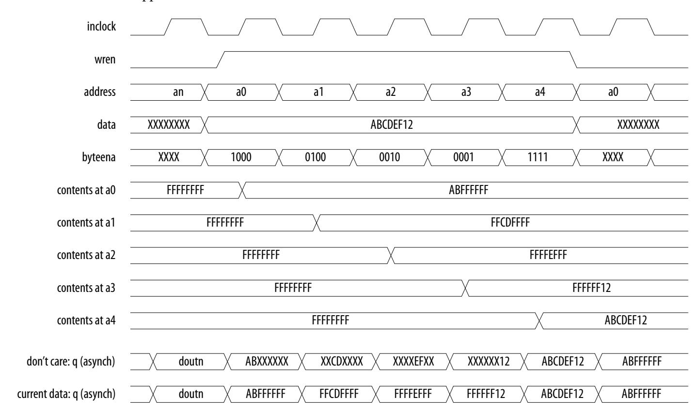

## **Memory Blocks Packed Mode Support**

The M10K memory blocks support packed mode.

The packed mode feature packs two independent single-port RAM blocks into one memory block. The Intel Quartus Prime software automatically implements packed mode where appropriate by placing the physical RAM block in true dual-port mode and using the MSB of the address to distinguish between the two logical RAM blocks. The size of each independent single-port RAM must not exceed half of the target block size.

# **Memory Blocks Address Clock Enable Support**

The embedded memory blocks support address clock enable, which holds the previous address value for as long as the signal is enabled (addressstall = 1). When the memory blocks are configured in dual-port mode, each port has its own independent address clock enable. The default value for the address clock enable signal is low (disabled).

**Figure 2-7: Address Clock Enable**

This figure shows an address clock enable block diagram. The address clock enable is referred to by the port name addressstall.

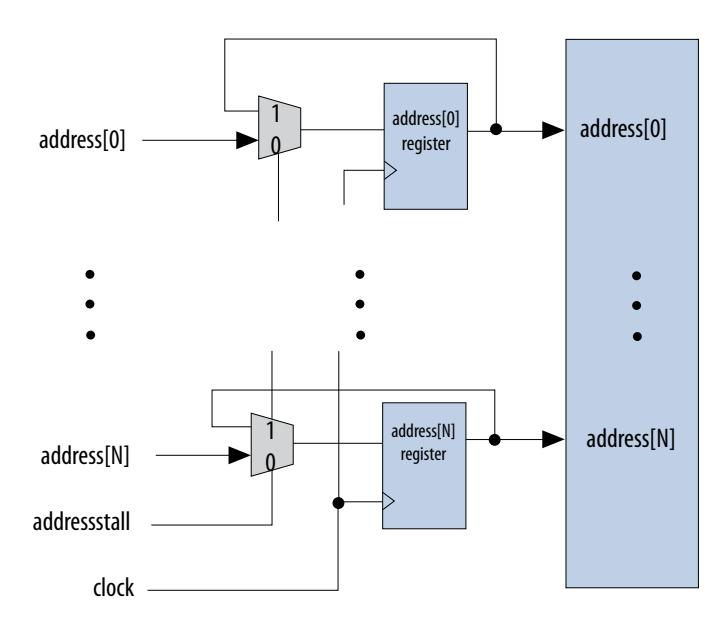

**Figure 2-8: Address Clock Enable During Read Cycle Waveform**

This figure shows the address clock enable waveform during the read cycle.

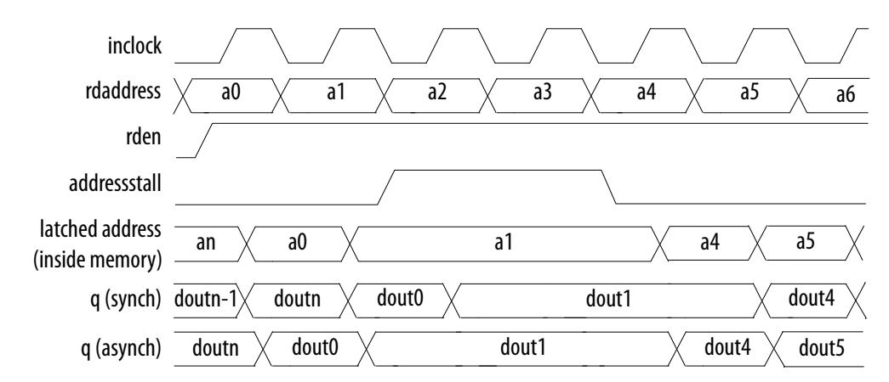

**Figure 2-9: Address Clock Enable During the Write Cycle Waveform**

This figure shows the address clock enable waveform during the write cycle.

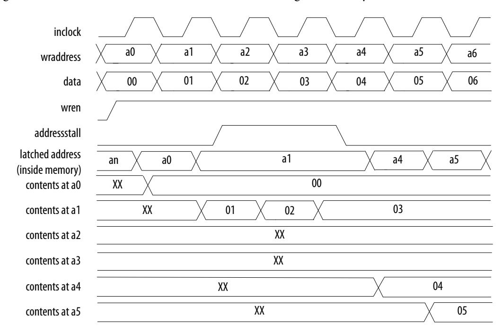

## **Embedded Memory Blocks in Cyclone V Devices Revision History**

| Date      | Version    | Changes                                                   |
| --------- | ---------- | --------------------------------------------------------- |
|           | 2017.12.15 | Updated M10K block count in Embedded Memory Capacity and  |
|           | 2015.12.21 | Changed instances of Quartus II to Quartus Prime          |
| June 2015 | 2015.06.12 | Updated MLAB RAM bit (Kb) in Embedded Memory Capacity and |

| Date          | Version    | Changes                                                                                                                                                                                                                                                                                                                                                                                                                                                                                                                                                                                                                                                                                                                                                                                                                                                                                                                     |
| ------------- | ---------- | --------------------------------------------------------------------------------------------------------------------------------------------------------------------------------------------------------------------------------------------------------------------------------------------------------------------------------------------------------------------------------------------------------------------------------------------------------------------------------------------------------------------------------------------------------------------------------------------------------------------------------------------------------------------------------------------------------------------------------------------------------------------------------------------------------------------------------------------------------------------------------------------------------------------------- |
| January 2015  | 2015.01.23 | <ul> <li>• Updated Embedded Memory Capacity and Distribution in Cyclone V Devices table for Cyclone V GX C3 devices.</li> <li>• M10K block: Updated from 119 to 135</li> <li>• M10K RAM bit (Kb): Updated from 1,190 to 1,350</li> <li>• MLAB block: Updated from 255 to 291</li> <li>• MLAB RAM bit (Kb): Updated from 159 to 181</li> <li>• Total RAM bit (Kb): Updated from 1,349 to 1,531</li> <li>• Reword Total RAM bits in Memory Features in Cyclone V Devices table to Capacity per Block.</li> </ul>                                                                                                                                                                                                                                                                                                                                                                                                              |
| June 2013     | 2014.06.30 | Clarified that the address lines of the ROM are registered on M10K blocks but can be unregistered on MLABs. However, the unregistered address line on MLABs is supported for simple dual-port RAM mode only.                                                                                                                                                                                                                                                                                                                                                                                                                                                                                                                                                                                                                                                                                                                |
| May 2013      | 2013.05.06 | <ul> <li>• Moved all links to the Related Information section of respective topics for easy reference.</li> <li>• Added link to the known document issues in the Knowledge Base.</li> <li>• Updated the maximum operating frequency of the MLAB.</li> <li>• Corrected the description about the "don't care" output mode for RAM in mixed-port read-during-write.</li> <li>• Reorganized the structure of the supported memory configurations topics (single-port and mixed-width dual-port) to improve clarity about maximum data widths supported for each configuration.</li> <li>• Added a description to the table listing the maximum embedded memory configurations to clarify that the information applies only to the single port or ROM mode.</li> <li>• Removed the topic about mixed-width configurations for MLABs and added a note to clarify that MLABs do not support mixed-width configuration.</li> </ul> |
| December 2012 | 2012.12.28 | <ul> <li>• Reorganized content and updated template.</li> <li>• Added memory capacity information from the <i>Cyclone V Device Overview</i> for easy reference.</li> <li>• Moved information about supported memory block configurations into its own table.</li> <li>• Added short descriptions of each clocking mode.</li> <li>• Added topic about the packed mode support.</li> <li>• Added topic about the address clock enable support.</li> </ul>                                                                                                                                                                                                                                                                                                                                                                                                                                                                     |

| Date         | Version | Changes                                                       |
| ------------ | ------- | ------------------------------------------------------------- |
| June 2012    | 2.0     | Restructured the chapter.                                     |
|              |         | Moved the memory capacity information to the Cyclone V Device |
| October 2011 | 1.0     | Initial release.                                              |

# **Variable Precision DSP Blocks in Cyclone V Devices 3**

2023.10.18

CV-52003 **[Subscribe](https://www.intel.com/content/www/us/en/docs/programmable/683375/) [Send Feedback](mailto:FPGAtechdocfeedback@intel.com?subject=Feedback%20on%20(CV-52003%202023.10.18)%20Variable%20Precision%20DSP%20Blocks%20in%20Cyclone%20V%20Devices&body=We%20appreciate%20your%20feedback.%20In%20your%20comments,%20also%20specify%20the%20page%20number%20or%20paragraph.%20Thank%20you.)**

This chapter describes how the variable-precision digital signal processing (DSP) blocks in Cyclone V devices are optimized to support higher bit precision in high-performance DSP applications.

#### Related Information

Cyclone**®** [V Device Handbook: Known Issues](https://www.intel.com/content/www/us/en/support/programmable/articles/000085691.html)

Lists the planned updates to the Cyclone V Device Handbook chapters.

#### **Features**

The Cyclone V variable precision DSP blocks offer the following features:

- High-performance, power-optimized, and fully registered multiplication operations
- 9-bit, 18-bit, and 27-bit word lengths
- Two 18 x 19 complex multiplications
- Built-in addition, subtraction, and dual 64-bit accumulation unit to combine multiplication results
- Cascading 19-bit or 27-bit to form the tap-delay line for filtering applications
- Cascading 64-bit output bus to propagate output results from one block to the next block without external logic support
- Hard pre-adder supported in 19-bit, and 27-bit mode for symmetric filters
- Internal coefficient register bank for filter implementation
- 18-bit and 27-bit systolic finite impulse response (FIR) filters with distributed output adder

#### Related Information

Cyclone V Device Overview

Provides more information about the number of multipliers in each Cyclone V device.

Intel Corporation. All rights reserved. Intel, the Intel logo, Altera, Arria, Cyclone, Enpirion, MAX, Nios, Quartus and Stratix words and logos are trademarks of Intel Corporation or its subsidiaries in the U.S. and/or other countries. Intel warrants performance of its FPGA and semiconductor products to current specifications in accordance with Intel's standard warranty, but reserves the right to make changes to any products and services at any time without notice. Intel assumes no responsibility or liability arising out of the application or use of any information, product, or service described herein except as expressly agreed to in writing by Intel. Intel customers are advised to obtain the latest version of device specifications before relying on any published information and before placing orders for products or services.

\*Other names and brands may be claimed as the property of others.

[ISO](http://www.altera.com/support/devices/reliability/certifications/rel-certifications.html)

[9001:2015](http://www.altera.com/support/devices/reliability/certifications/rel-certifications.html) [Registered](http://www.altera.com/support/devices/reliability/certifications/rel-certifications.html)

## **Supported Operational Modes in Cyclone V Devices**

**Table 3-1: Variable Precision DSP Blocks Operational Modes for Cyclone V Devices**

| Variable-Precision Operation Supported DSP Block Resource Mode Instance | Pre-Adder Support | Coefficient Support | Input Cascade | Chainout Support |
| ----------------------------------------------------------------------- | ----------------- | ------------------- | ------------- | ---------------- |
|                                                                         |                   |                     | Support (1)   |                  |
| 3                                                                       | No                | No                  | No            | No               |
| 2                                                                       | Yes               | Yes                 | Yes           | No               |
| 2                                                                       | Yes               | Yes                 | Yes           | No               |
| 1                                                                       | Yes               | Yes                 | Yes           | Yes              |
| 1                                                                       | Yes               | Yes                 | Yes           | Yes              |
| 1                                                                       | Yes               | Yes                 | Yes           | Yes              |
| 1                                                                       | Yes               | Yes                 | Yes           | Yes              |
| 1                                                                       | Yes               | No                  | No            | Yes              |
| 1                                                                       | No                | No                  | Yes           | No               |

#### **Resources**

**Table 3-2: Number of Multipliers in Cyclone V Devices**

The table lists the variable-precision DSP resources by bit precision for each Cyclone V device.

(1) When you enable the pre-adder feature, the input cascade support is not available.

| Variant Member Code | Variable precision DSP Block | 9 x 9 Multiplier | Independent Input and Output Multiplications Operator 18 x 18 Multiplier | 27 x 27 Multiplier | 18 x 18 Multiplier Adder Mode | 18 x 18 Multiplier Adder Summed with 36 bit Input |
| ------------------- | ----------------------------- | ---------------- | ------------------------------------------------------------------------ | ------------------ | ----------------------------- | ------------------------------------------------- |
| A2                  | 25                            | 75               | 50                                                                       | 25                 | 25                            | 25                                                |
| A4                  | 66                            | 198              | 132                                                                      | 66                 | 66                            | 66                                                |
| A5 Cyclone V E      | 150                           | 450              | 300                                                                      | 150                | 150                           | 150                                               |
| A7                  | 156                           | 468              | 312                                                                      | 156                | 156                           | 156                                               |
| A9                  | 342                           | 1,026            | 684                                                                      | 342                | 342                           | 342                                               |
| C3                  | 57                            | 171              | 114                                                                      | 57                 | 57                            | 57                                                |
| C4 Cyclone V        | 70                            | 210              | 140                                                                      | 70                 | 70                            | 70                                                |
| C5 GX               | 150                           | 450              | 300                                                                      | 150                | 150                           | 150                                               |
| C7                  | 156                           | 468              | 312                                                                      | 156                | 156                           | 156                                               |
| C9                  | 342                           | 1,026            | 684                                                                      | 342                | 342                           | 342                                               |
| D5 Cyclone V        | 150                           | 450              | 300                                                                      | 150                | 150                           | 150                                               |
| D7 GT               | 156                           | 468              | 312                                                                      | 156                | 156                           | 156                                               |
| D9                  | 342                           | 1,026            | 684                                                                      | 342                | 342                           | 342                                               |
| A2                  | 36                            | 108              | 72                                                                       | 36                 | 36                            | 36                                                |
| A4 Cyclone V SE     | 84                            | 252              | 168                                                                      | 84                 | 84                            | 84                                                |
| A5                  | 87                            | 261              | 174                                                                      | 87                 | 87                            | 87                                                |
| A6                  | 112                           | 336              | 224                                                                      | 112                | 112                           | 112                                               |
| C2                  | 36                            | 108              | 72                                                                       | 36                 | 36                            | 36                                                |
| C4 Cyclone V SX     | 84                            | 252              | 168                                                                      | 84                 | 84                            | 84                                                |
| C5                  | 87                            | 261              | 174                                                                      | 87                 | 87                            | 87                                                |
| C6                  | 112                           | 336              | 224                                                                      | 112                | 112                           | 112                                               |
| D5 Cyclone V ST     | 87                            | 261              | 174                                                                      | 87                 | 87                            | 87                                                |
| D6                  | 112                           | 336              | 224                                                                      | 112                | 112                           | 112                                               |

#### **Design Considerations**

You should consider the following elements in your design:

- Operational modes
- Internal coefficient and pre-adder
- Accumulator
- Chainout adder

#### **Operational Modes**

The Intel Quartus Prime software includes IP cores that you can use to control the operation mode of the multipliers. After entering the parameter settings with the IP Catalog, the Intel Quartus Prime software automatically configures the variable precision DSP block.

Altera provides two methods for implementing various modes of the Cyclone V variable precision DSP block in a design—using the Intel Quartus Prime DSP IP cores and HDL inferring.

The following Intel Quartus Prime IP cores are supported for the Cyclone V variable precision DSP blocks implementation:

- LPM\_MULT
- ALTERA\_MULT\_ADD
- ALTMULT\_COMPLEX
- ALTMEMMULT

#### Related Information

- Introduction to Intel**®** FPGA IP Cores
- Intel FPGA Integer Arithmetic IP Cores User Guide
- Floating-Point IP Cores User Guide
- Intel**®** Quartus**®** [Prime Software Help](https://www.intel.com/content/www/us/en/programmable/quartushelp/current/index.htm#quartus/gl_quartus_welcome.htm)

#### **Internal Coefficient and Pre-Adder**

To use the pre-adder feature, all input data and multipliers must have the same clock setting.

The input cascade support is not available when you enable the pre-adder feature.

In both 18-bit and 27-bit modes, you can use the coefficient feature and pre-adder feature independently.

#### **Accumulator**

The accumulator in the Cyclone V devices supports double accumulation by enabling the 64-bit double accumulation registers located between the output register bank and the accumulator.

The double accumulation registers are set statically in the programming file.

#### **Chainout Adder**

You can use the output chaining path to add results from other DSP blocks.

#### **Block Architecture**

The Cyclone V variable precision DSP block consists of the following elements:

- Input register bank
- Pre-adder
- Internal coefficient
- Multipliers
- Adder
- Accumulator and chainout adder

- • Systolic registers
- Double accumulation register
- Output register bank

If the variable precision DSP block is not configured in systolic FIR mode, both systolic registers are bypassed.

**Figure 3-1: Variable Precision DSP Block Architecture for Cyclone V Devices**

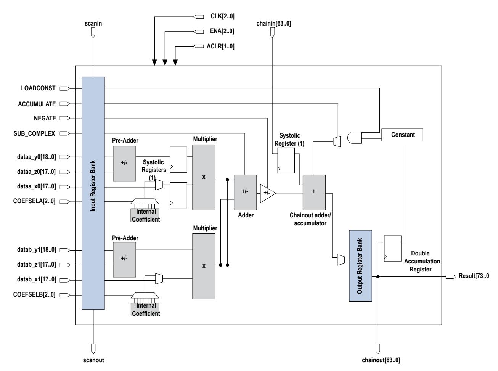

**Note:**

**1. When enabled, systolic registers are clocked with the same clock source as the output register bank.**

#### **Input Register Bank**

The input register bank consists of data, dynamic control signals, and two sets of delay registers.

All the registers in the DSP blocks are positive-edge triggered and cleared on power up. Each multiplier operand can feed an input register or a multiplier directly, bypassing the input registers.

The following variable precision DSP block signals control the input registers within the variable precision DSP block:

- CLK[2..0]
- ENA[2..0]
- ACLR[0]

In 18 x 19 mode, you can use the delay registers to balance the latency requirements when you use both the input cascade and chainout features.

The tap-delay line feature allows you to drive the top leg of the multiplier input, dataa\_y0 and datab\_y1 in 18 x 19 mode and dataa\_y0 only in 27 x 27 mode, from the general routing or cascade chain.

**Figure 3-2: Input Register of a Variable Precision DSP Block in 18 x 19 Mode for Cyclone V Devices**

The figures show the data registers only. Registers for the control signals are not shown.

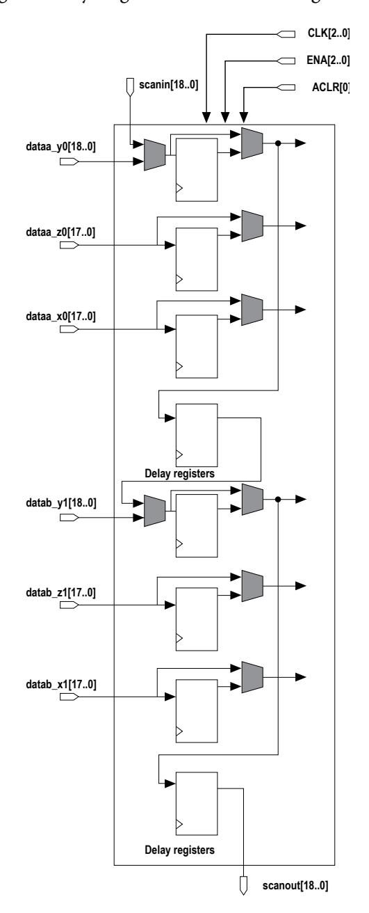

**Figure 3-3: Input Register of a Variable Precision DSP Block in 27 x 27 Mode for Cyclone V Devices**

The figures show the data registers only. Registers for the control signals are not shown.

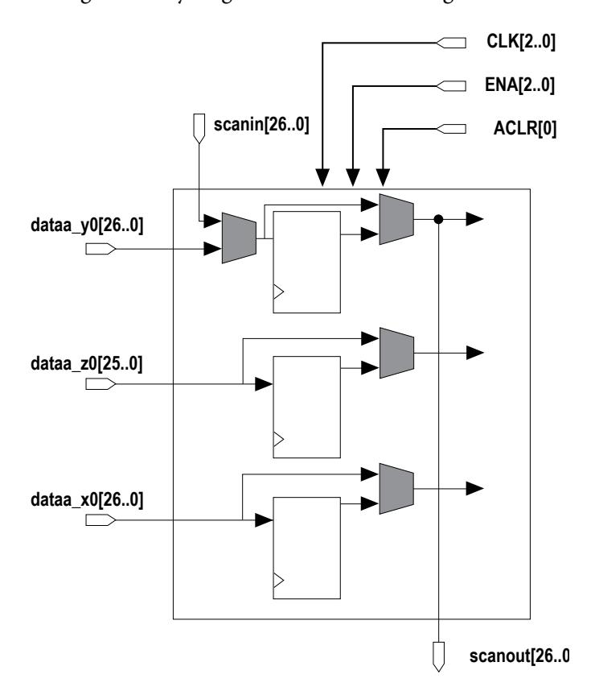

#### **Pre-Adder**

#### **Cyclone V Devices**

Each variable precision DSP block has two 19-bit pre-adders. You can configure these pre-adders in the following configurations:

- Two independent 19-bit pre-adders
- One 27-bit pre-adder

The pre-adder supports both addition and subtraction in the following input configurations:

- 18-bit (signed) addition or subtraction for 18 x 19 mode
- 17-bit (unsigned) addition or subtraction for 18 x 19 mode
- 26-bit addition or subtraction for 27 x 27 mode

#### **Internal Coefficient**

The Cyclone V variable precision DSP block has the flexibility of selecting the multiplicand from either the dynamic input or the internal coefficient.

The internal coefficient can support up to eight constant coefficients for the multiplicands in 18-bit and 27-bit modes. When you enable the internal coefficient feature, COEFSELA/COEFSELB are used to control the selection of the coefficient multiplexer.

#### **Multipliers**

A single variable precision DSP block can perform many multiplications in parallel, depending on the data width of the multiplier.

There are two multipliers per variable precision DSP block. You can configure these two multipliers in several operational modes:

- One 27 x 27 multiplier
- Two 18 (signed)/(unsigned) x 19 (signed) multipliers
- Three 9 x 9 multipliers

#### Related Information

#### [Operational Mode Descriptions](#page-50-0) on page 3-10

Provides more information about the operational modes of the multipliers.

#### **Adder**

You can use the adder in various sizes, depending on the operational mode:

- One 64-bit adder with the 64-bit accumulator
- Two 18 x 19 modes—the adder is divided into two 37-bit adders to produce the full 37-bit result of each independent 18 x 19 multiplication
- Three 9 x 9 modes—you can use the adder as three 18-bit adders to produce three 9 x 9 multiplication results independently

#### **Accumulator and Chainout Adder**

The Cyclone V variable precision DSP block supports a 64-bit accumulator and a 64-bit adder.

The following signals can dynamically control the function of the accumulator:

- NEGATE
- LOADCONST
- ACCUMULATE

The accumulator supports double accumulation by enabling the 64-bit double accumulation registers located between the output register bank and the accumulator.

The double accumulation registers are set statically in the programming file.

The accumulator and chainout adder features are not supported in two independent 18 x 19 modes and three independent 9 x 9 modes.

#### **Table 3-3: Accumulator Functions and Dynamic Control Signals**

This table lists the dynamic signals settings and description for each function. In this table, X denotes a "don't care" value.

|         | Function | Description               | NEGATE | LOADCONST | ACCUMULATE |
| ------- | -------- | ------------------------- | ------ | --------- | ---------- |
| Zeroing |          | Disables the accumulator. | 0      | 0         | 0          |

| Function Description NEGATE Loads an initial value to the accumulator. Only one bit of the 64-bit preload value | LOADCONST | ACCUMULATE |
| --------------------------------------------------------------------------------------------------------------- | --------- | ---------- |
| 0                                                                                                               | 1         | 0          |
| 0                                                                                                               | X         | 1          |
| 1                                                                                                               | X         | 1          |

#### **Systolic Registers**

There are two systolic registers per variable precision DSP block. If the variable precision DSP block is not configured in systolic FIR mode, both systolic registers are bypassed.

The first set of systolic registers consists of 18-bit and 19-bit registers that are used to register the 18-bit and 19-bit inputs of the upper multiplier, respectively.

The second set of systolic registers are used to delay the chainout output to the next variable precision DSP block.

You must clock all the systolic registers with the same clock source as the output register bank.

#### **Double Accumulation Register**

The double accumulation register is an extra register in the feedback path of the accumulator. Enabling the double accumulation register will cause an extra clock cycle delay in the feedback path of the accumulator.

This register has the same CLK, ENA, and ACLR settings as the output register bank.

By enabling this register, you can have two accumulator channels using the same number of variable precision DSP block.

#### **Output Register Bank**

The positive edge of the clock signal triggers the 64-bit bypassable output register bank and is cleared after power up.

The following variable precision DSP block signals control the output register per variable precision DSP block:

- CLK[2..0]
- ENA[2..0]
- ACLR[1]

#### **Operational Mode Descriptions**

This section describes how you can configure an Cyclone V variable precision DSP block to efficiently support the following operational modes:

- Independent Multiplier Mode
- Independent Complex Multiplier Mode
- Multiplier Adder Sum Mode
- 18 x 18 Multiplication Summed with 36-Bit Input Mode
- Systolic FIR Mode

#### **Independent Multiplier Mode**

In independent input and output multiplier mode, the variable precision DSP blocks perform individual multiplication operations for general purpose multipliers.

**Table 3-4: Variable Precision DSP Block Independent Multiplier Mode Configurations**

| Configuration | Multipliers per block |
| ------------- | --------------------- |
| 9 x 9         | 3                     |
| 18 x 25       | 1                     |
| 20 x 24       | 1                     |
| 27 x 27       | 1                     |

#### **9 x 9 Independent Multiplier**

#### **Figure 3-4: Three 9 x 9 Independent Multiplier Mode per Variable Precision DSP Block for Cyclone V Devices**

Three pairs of data are packed into the ax and ay ports; result contains three 18-bit products.

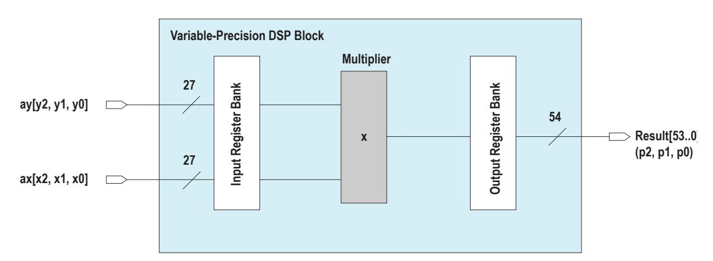

#### **18 x 18 or 18 x 19 Independent Multiplier**

#### **Figure 3-5: Two 18 x 18 or 18 x 19 Independent Multiplier Mode per Variable Precision DSP Block for Cyclone V Devices**

In this figure, the variables are defined as follows:

- n = 19 and m = 37 for 18 x 19 mode
- n = 18 and m = 36 for 18 x 18 mode

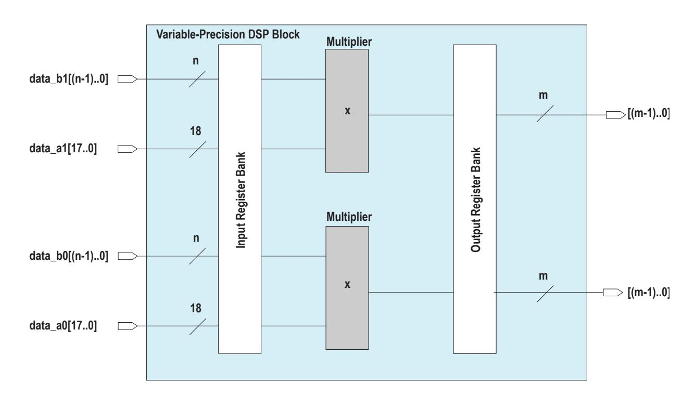

#### **18 x 25 Independent Multiplier**

**Figure 3-6: One 18 x 25 Independent Multiplier Mode per Variable Precision DSP Block for Cyclone V Devices**

In this mode, the result can be up to 52 bits when combined with a chainout adder or accumulator.

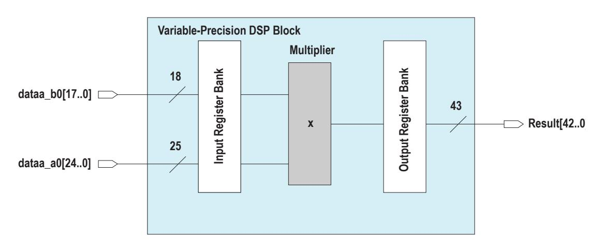

#### **20 x 24 Independent Multiplier**

**Figure 3-7: One 20 x 24 Independent Multiplier Mode per Variable Precision DSP Block for Cyclone V Devices**

In this mode, the result can be up to 52 bits when combined with a chainout adder or accumulator.

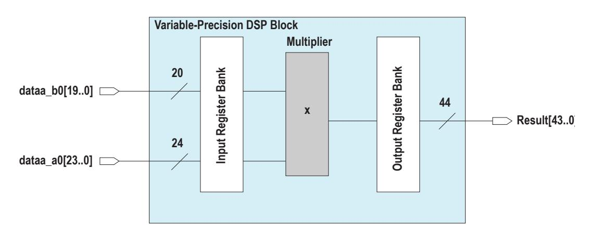

#### **27 x 27 Independent Multiplier**

#### **Figure 3-8: One 27 x 27 Independent Multiplier Mode per Variable Precision DSP Block for Cyclone V Devices**

In this mode, the result can be up to 64 bits when combined with a chainout adder or accumulator.

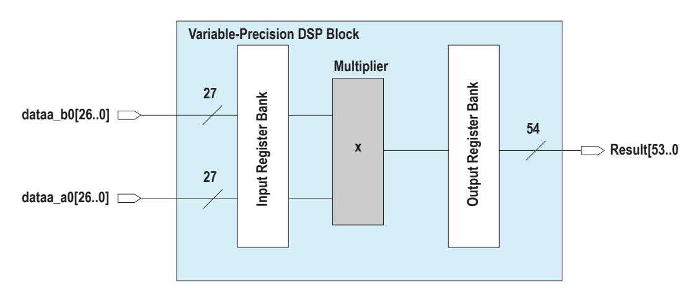

#### **Independent Complex Multiplier Mode**

The Cyclone V devices support the 18 x 19 complex multiplier mode using two Cyclone V variableprecision DSP blocks.

#### **Figure 3-9: Sample of Complex Multiplication Equation**

$$(a + jb) \times (c + jd) = [(a \times c) - (b \times d)] + j[(a \times d) + (b \times c)]$$

The imaginary part [(a × d) + (b × c)] is implemented in the first variable-precision DSP block, while the real part [(a × c) - (b × d)] is implemented in the second variable-precision DSP block.

#### **18 x 19 Complex Multiplier**

**Figure 3-10: One 18 x 19 Complex Multiplier with Two Variable Precision DSP Blocks for Cyclone V Devices**

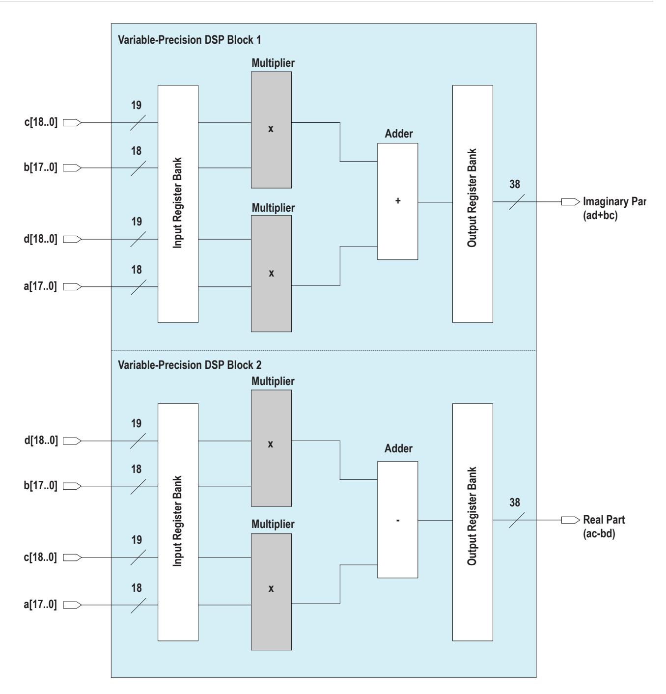

#### **Multiplier Adder Sum Mode**

**Figure 3-11: One Sum of Two 18 x 19 Multipliers with One Variable Precision DSP Block for Cyclone V Devices**

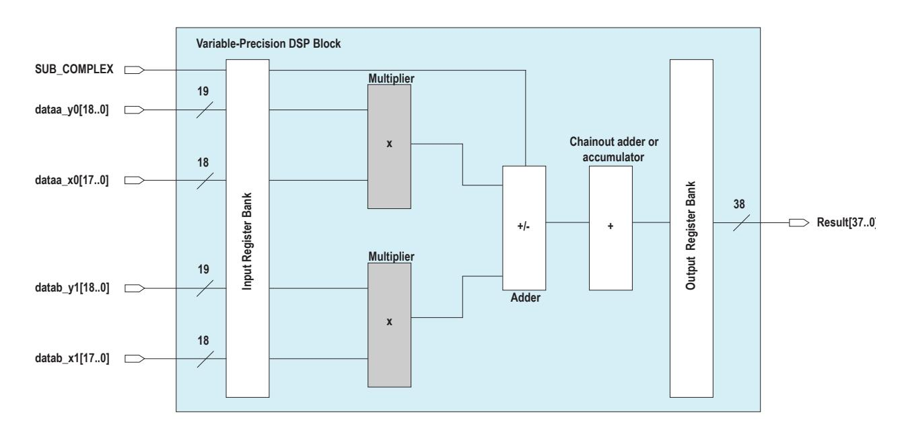

#### **18 x 18 Multiplication Summed with 36-Bit Input Mode**

Cyclone V variable precision DSP blocks support one 18 x 18 multiplication summed to a 36-bit input.

Use the upper multiplier to provide the input for an 18 x 18 multiplication, while the bottom multiplier is bypassed. The datab\_y1[17..0] and datab\_y1[35..18] signals are concatenated to produce a 36-bit input.

**Figure 3-12: One 18 x 18 Multiplication Summed with 36-Bit Input Mode for Cyclone V Devices**

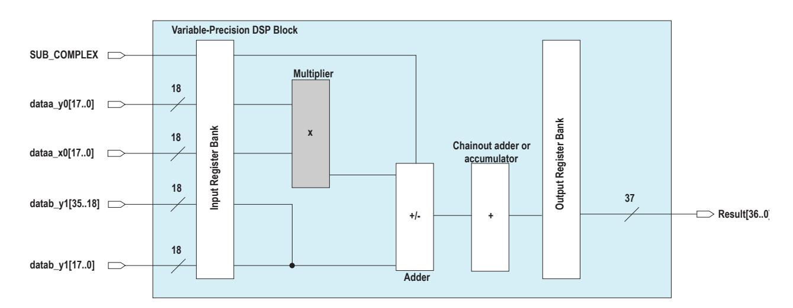

#### **Systolic FIR Mode**

The basic structure of a FIR filter consists of a series of multiplications followed by an addition.

**Figure 3-13: Basic FIR Filter Equation**

$$y[n] = \sum_{i=1}^k c[i]x[n-i-1]$$

Depending on the number of taps and the input sizes, the delay through chaining a high number of adders can become quite large. To overcome the delay performance issue, the systolic form is used with additional delay elements placed per tap to increase the performance at the cost of increased latency.

**Figure 3-14: Systolic FIR Filter Equivalent Circuit**

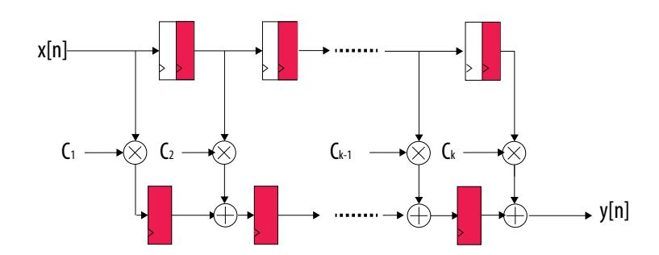

Cyclone V variable precision DSP blocks support the following systolic FIR structures:

- 18-bit
- 27-bit

In systolic FIR mode, the input of the multiplier can come from four different sets of sources:

- Two dynamic inputs
- One dynamic input and one coefficient input
- One coefficient input and one pre-adder output
- One dynamic input and one pre-adder output

#### **18-Bit Systolic FIR Mode**

In 18-bit systolic FIR mode, the adders are configured as dual 44-bit adders, thereby giving 8 bits of overhead when using an 18-bit operation (36-bit products). This allows a total of 256 multiplier products.

**Figure 3-15: 18-Bit Systolic FIR Mode for Cyclone V Devices**

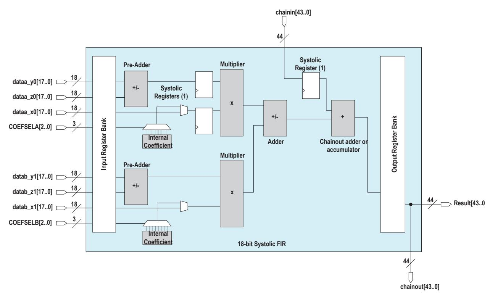

**Note:**

**1. The systolic registers have the same clock source as the output register bank.**

#### **27-Bit Systolic FIR Mode**

In 27-bit systolic FIR mode, the chainout adder or accumulator is configured for a 64-bit operation, providing 10 bits of overhead when using a 27-bit data (54-bit products). This allows a total of 1,024 multiplier products.

The 27-bit systolic FIR mode allows the implementation of one stage systolic filter per DSP block.

**Figure 3-16: 27-Bit Systolic FIR Mode for Cyclone V Devices**

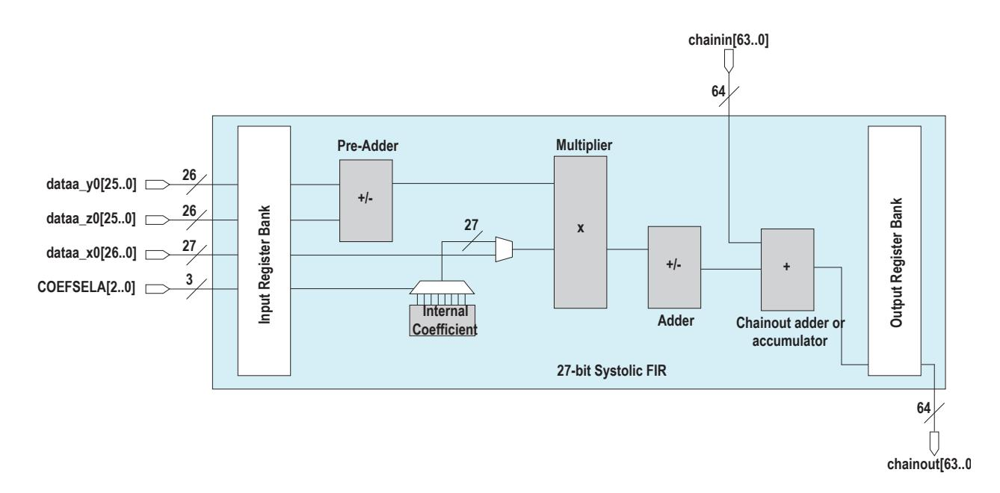

# **Variable Precision DSP Blocks in Cyclone V Devices Revision History**

| Date         | Version    | Changes                                                                      |
| ------------ | ---------- | ---------------------------------------------------------------------------- |
|              | 2015.12.21 | Changed instances of Quartus II to Quartus Prime                             |
| June 2015    | 2015.06.12 | Updated Systolic FIR Filter Equivalent Circuit figure.                       |
| January 2015 | 2015.01.23 | Updated Number of Multipliers in Cyclone V Devices table for                 |
| July 2014    | 2014.07.22 | Reinstated input register bank and systolic registers to the block architec‐ |
| June 2014    | 2014.06.30 | Updated the supported megafunctions from ALTMULT_ADD and                     |

| Date         | Version    | Changes                                                             |
| ------------ | ---------- | ------------------------------------------------------------------- |
| January 2014 | 2014.01.10 | Corrected variable-precision DSP block, 27 x 27 multiplier, 18 x 18 |
| May 2013     | 2013.05.06 | Added link to the known document issues in the Knowledge Base.      |
|              | 2012.12.28 | Added resources for Cyclone V devices.                              |
| June 2012    | 2.0        | Updated for the Quartus II software v12.0 release:                  |
| May 2011     | 1.0        | Initial release.                                                    |

# **Clock Networks and PLLs in Cyclone V Devices 4**

2023.10.18

CV-52004 **[Subscribe](https://www.intel.com/content/www/us/en/docs/programmable/683375/) [Send Feedback](mailto:FPGAtechdocfeedback@intel.com?subject=Feedback%20on%20(CV-52004%202023.10.18)%20Clock%20Networks%20and%20PLLs%20in%20Cyclone%20V%20Devices&body=We%20appreciate%20your%20feedback.%20In%20your%20comments,%20also%20specify%20the%20page%20number%20or%20paragraph.%20Thank%20you.)**

This chapter describes the advanced features of hierarchical clock networks and phase-locked loops (PLLs) in Cyclone V devices. The Intel Quartus Prime software enables the PLLs and their features without external devices.

#### Related Information

#### Cyclone**®** [V Device Handbook: Known Issues](https://www.intel.com/content/www/us/en/support/programmable/articles/000085691.html)

Lists the planned updates to the Cyclone V Device Handbook chapters.

#### **Clock Networks**

The Cyclone V devices contain the following clock networks that are organized into a hierarchical structure:

- Global clock (GCLK) networks
- Regional clock (RCLK) networks
- Periphery clock (PCLK) networks

Intel Corporation. All rights reserved. Intel, the Intel logo, Altera, Arria, Cyclone, Enpirion, MAX, Nios, Quartus and Stratix words and logos are trademarks of Intel Corporation or its subsidiaries in the U.S. and/or other countries. Intel warrants performance of its FPGA and semiconductor products to current specifications in accordance with Intel's standard warranty, but reserves the right to make changes to any products and services at any time without notice. Intel assumes no responsibility or liability arising out of the application or use of any information, product, or service described herein except as expressly agreed to in writing by Intel. Intel customers are advised to obtain the latest version of device specifications before relying on any published information and before placing orders for products or services.

\*Other names and brands may be claimed as the property of others.

[ISO](http://www.altera.com/support/devices/reliability/certifications/rel-certifications.html)

[9001:2015](http://www.altera.com/support/devices/reliability/certifications/rel-certifications.html) [Registered](http://www.altera.com/support/devices/reliability/certifications/rel-certifications.html)

#### **Clock Resources in Cyclone V Devices**

**Table 4-1: Clock Resources in Cyclone V Devices**

| Clock Resource Device Number of Resources |                          |                 |
| ----------------------------------------- | ------------------------ | --------------- |
| Available                                 | Source of Clock Resource |                 |
| differential                              | CLK[0..11][p,n]          | pins            |
|                                           | CLK[0..3][p,n]           | , CLK[6][p,n] , |
|                                           | and CLK[8..11][p,n]      | pins            |
| differential                              | CLK[0..7][p,n]           | pins            |
|                                           | CLK[0..3][p,n]           | and CLK[6,7]    |
|                                           | [p,n] pins               |                 |

| Clock Resource Device Number of Resources |                 |
| ----------------------------------------- | --------------- |
| Available Source of Clock Resource        |                 |
| CLK[0..11][p,n]                           | pins, PLL       |
| CLK[0..3][p,n]                            | , CLK[6][p,n] , |
| CLK[8..11][p,n]                           | pins, PLL       |
| CLK[0..3][p,n]                            | and CLK[6,7]    |
| [p,n] pins                                |                 |
| CLK[0..7][p,n]                            | pins, PLL clock |

| Clock Resource | Device                | Number of Resources |                          |
| -------------- | --------------------- | ------------------- | ------------------------ |
|                |                       | Available           | Source of Clock Resource |
|                | Cyclone V E A2 and A4 |                     | —                        |
|                | Cyclone V GX C3       | 6                   |                          |

For more information about the clock input pins connections, refer to the pin connection guidelines.

#### Related Information

Cyclone**®** [V GX, GT, E, SX, ST and SE Device Family Pin Connection Guidelines](https://cdrdv2.intel.com/v1/dl/getContent/654351)

#### **Types of Clock Networks**

#### **Global Clock Networks**

Cyclone V devices provide GCLKs that can drive throughout the device. The GCLKs serve as low-skew clock sources for functional blocks, such as adaptive logic modules (ALMs), digital signal processing (DSP), embedded memory, and PLLs. Cyclone V I/O elements (IOEs) and internal logic can also drive GCLKs to create internally-generated global clocks and other high fan-out control signals, such as synchronous or asynchronous clear and clock enable signals.

**Figure 4-1: GCLK Networks in Cyclone V E, GX, and GT Devices**

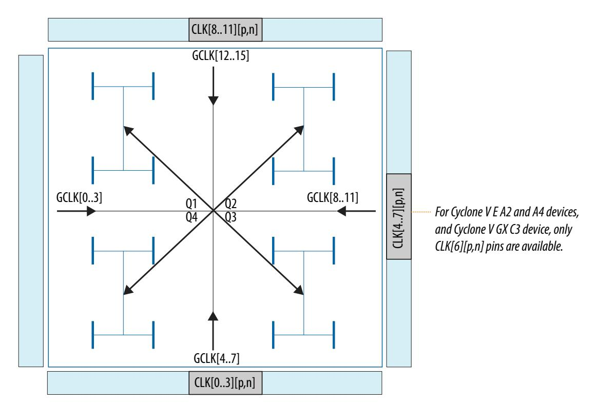

**Figure 4-2: GCLK Networks in Cyclone V SE, SX, and ST Devices**

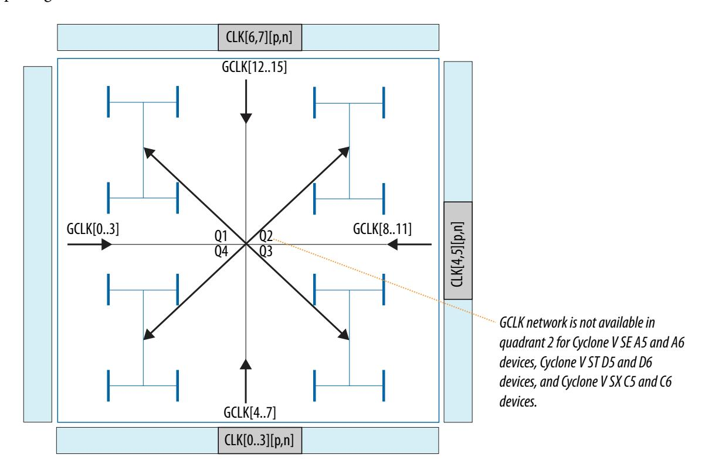

#### **Regional Clock Networks**

RCLK networks are only applicable to the quadrant they drive into. RCLK networks provide the lowest clock insertion delay and skew for logic contained within a single device quadrant. The Cyclone V IOEs and internal logic within a given quadrant can also drive RCLKs to create internally generated regional clocks and other high fan-out control signals.

#### **Figure 4-3: RCLK Networks in Cyclone V E, GX, and GT Devices**

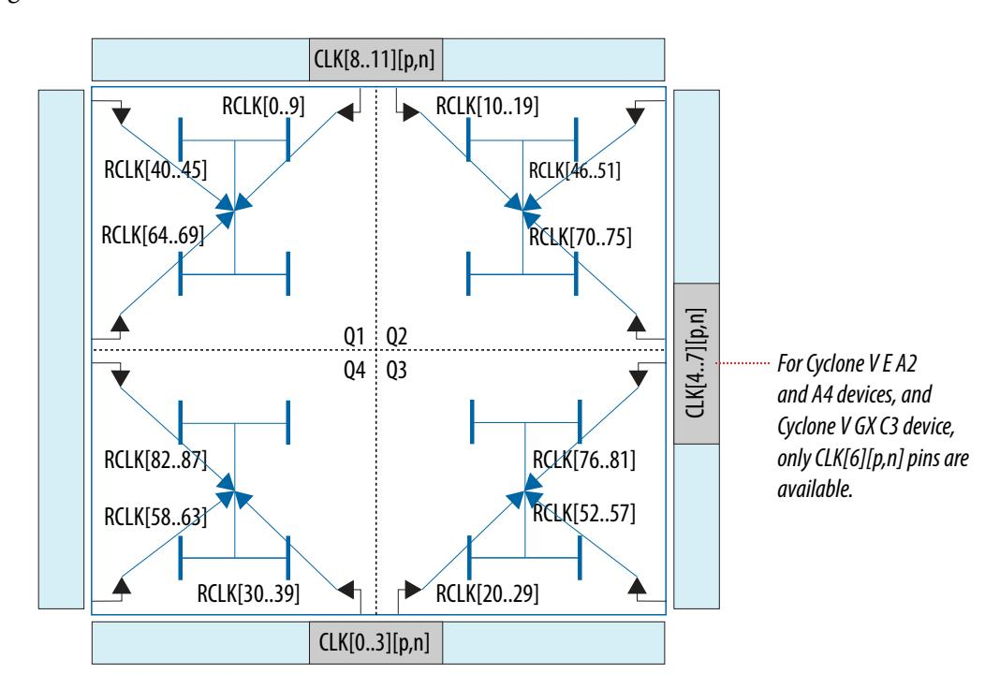

**Figure 4-4: RCLK Networks in Cyclone V SE, SX, and ST Devices**

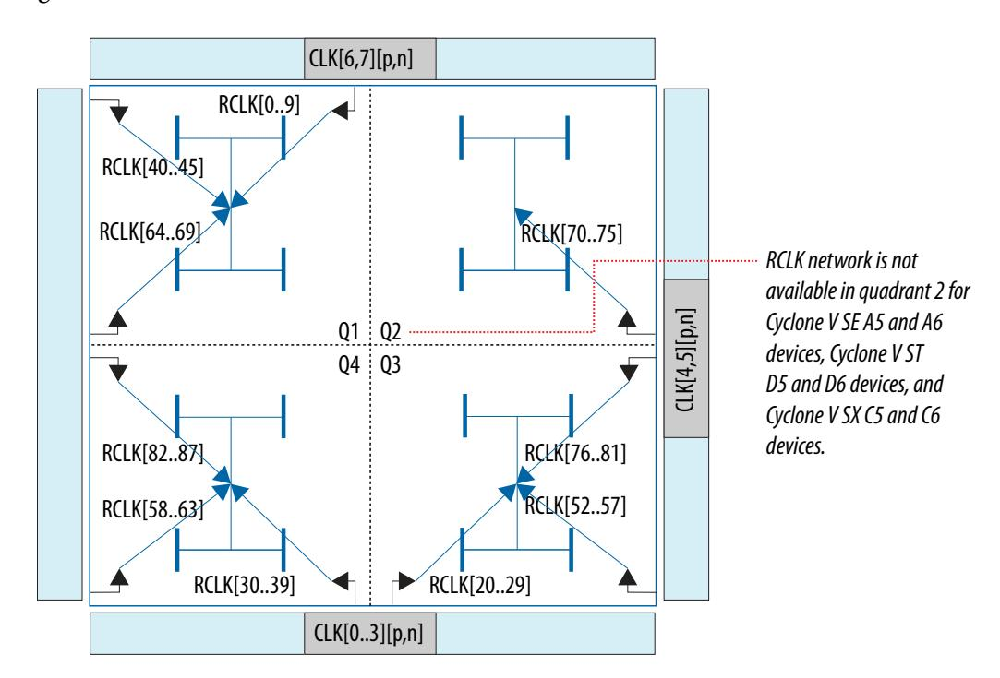

#### **Periphery Clock Networks**

Cyclone V devices provide only horizontal PCLKs from the left periphery.

Clock outputs from the programmable logic device (PLD)-transceiver interface clocks, horizontal I/O pins, and internal logic can drive the PCLK networks.

PCLKs have higher skew when compared with GCLK and RCLK networks. You can use PCLKs for general purpose routing to drive signals into and out of the Cyclone V device.

**Figure 4-5: PCLK Networks in Cyclone V E, GX, and GT Devices**

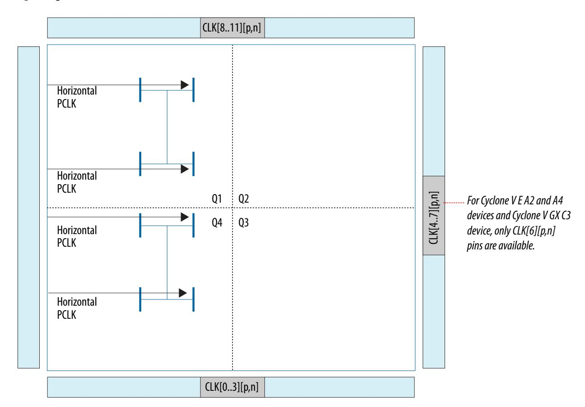

**Figure 4-6: PCLK Networks in Cyclone V SE, SX, and ST Devices**

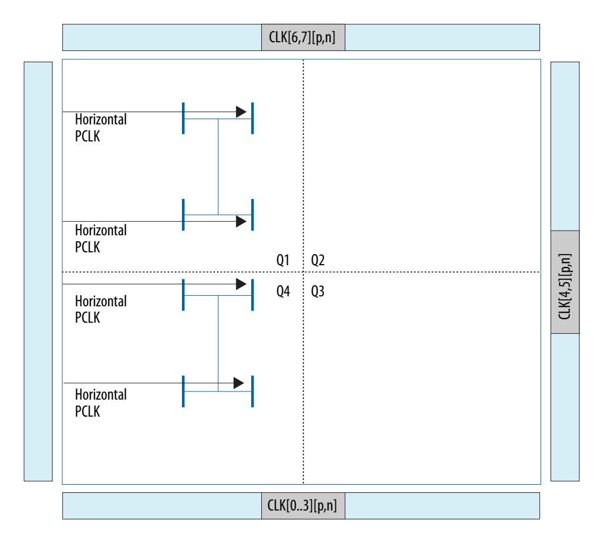

#### **Clock Sources Per Quadrant**

The Cyclone V devices provide 30 section clock (SCLK) networks in each spine clock per quadrant. The SCLK networks can drive six row clocks in each logic array block (LAB) row, nine column I/O clocks, and two core reference clocks. The SCLKs are the clock resources to the core functional blocks, PLLs, and I/O interfaces of the device.

A spine clock is another layer of routing between the GCLK, RCLK, and PCLK networks before each clock is connected to the clock routing for each LAB row. The settings for spine clocks are transparent. The Intel Quartus Prime software automatically routes the spine clock based on the GCLK, RCLK, and PCLK networks.

The following figure shows SCLKs driven by the GCLK, RCLK, PCLK, or the PLL feedback clock networks in each spine clock per quadrant. The GCLK, RCLK, PCLK, and PLL feedback clocks share the same routing to the SCLKs. To ensure successful design fitting in the Intel Quartus Prime software, the total number of clock resources must not exceed the SCLK limits in each region.

**Figure 4-7: Hierarchical Clock Networks in Each Spine Clock Per Quadrant**

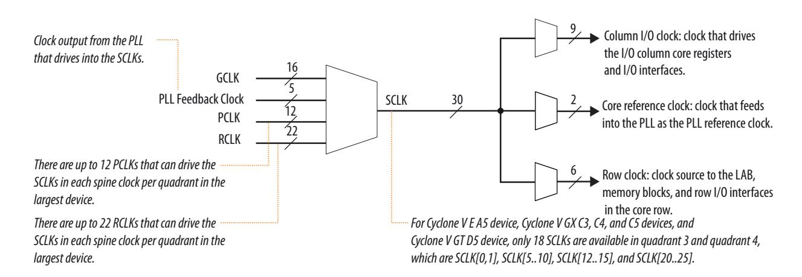

#### **Types of Clock Regions**

This section describes the types of clock regions in Cyclone V devices.

#### **Entire Device Clock Region**

To form the entire device clock region, a source drives a signal in a GCLK network that can be routed through the entire device. The source is not necessarily a clock signal. This clock region has the maximum insertion delay when compared with other clock regions, but allows the signal to reach every destination in the device. It is a good option for routing global reset and clear signals or routing clocks throughout the device.

#### **Regional Clock Region**

To form a regional clock region, a source drives a signal in a RCLK network that you can route throughout one quadrant of the device. This clock region provides the lowest skew in a quadrant. It is a good option if all the destinations are in a single quadrant.

#### **Dual-Regional Clock Region**

To form a dual-regional clock region, a single source (a clock pin or PLL output) generates a dual-regional clock by driving two RCLK networks (one from each quadrant). This technique allows destinations across two adjacent device quadrants to use the same low-skew clock. The routing of this signal on an entire side has approximately the same delay as a RCLK region. Internal logic can also drive a dual-regional clock network.

Dual-regional clock region is only supported for quadrant 3 and quadrant 4 in Cyclone V SE, SX, and ST devices.

**Figure 4-8: Dual-Regional Clock Region for Cyclone V Devices**

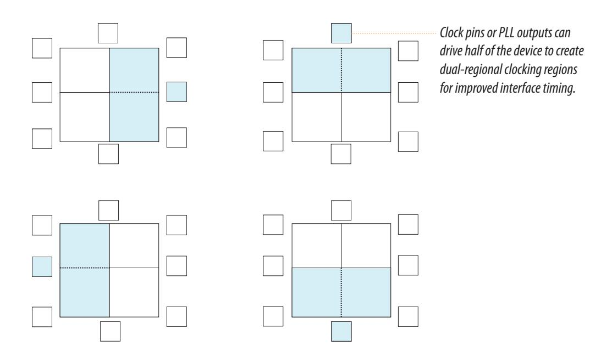

#### **Clock Network Sources**

In Cyclone V devices, clock input pins, PLL outputs, high-speed serial interface (HSSI) outputs, and internal logic can drive the GCLK, RCLK, and PCLK networks.

#### **Dedicated Clock Input Pins**

You can use the dedicated clock input pins (CLK[0..11][p,n]) for high fan-out control signals, such as asynchronous clears, presets, and clock enables, for protocol signals through the GCLK or RCLK networks.

CLK pins can be either differential clocks or single-ended clocks. When you use the CLK pins as singleended clock inputs, only the CLK<#>p pins have dedicated connections to the PLL. The CLK<#>n pins drive the PLLs over global or regional clock networks and do not have dedicated routing paths to the PLLs.

Driving a PLL over a global or regional clock can lead to higher jitter at the PLL input, and the PLL will not be able to fully compensate for the global or regional clock. Altera recommends using the CLK<#>p pins for optimal performance when you use single-ended clock inputs to drive the PLLs.

#### **Internal Logic**

You can drive each GCLK, RCLK, and horizontal PCLK network using LAB-routing and row clock to enable internal logic to drive a high fan-out, low-skew signal.

Note: Internally-generated GCLKs, RCLKs, or PCLKs cannot drive the Cyclone V PLLs. The input clock to the PLL has to come from dedicated clock input pins, PLL-fed GCLKs, or PLL-fed RCLKs.

#### **HSSI Outputs**

Every three HSSI outputs generate a group of four PCLKs to the core.

#### Related Information

- [PLLs and Clocking](#page-119-0) on page 5-13 Provides more information about HSSI outputs.
- [LVDS Interface with External PLL Mode](#page-122-0) on page 5-16 Provides more information about HSSI outputs.

#### **PLL Clock Outputs**

The Cyclone V PLL clock outputs can drive both GCLK and RCLK networks.

#### **Clock Input Pin Connections to GCLK and RCLK Networks**

**Table 4-2: Dedicated Clock Input Pin Connectivity to the GCLK Networks for Cyclone V E, GX, and GT Devices**

| Clock Resources           | CLK (p/n Pins)   |
| ------------------------- | ---------------- |
| GCLK[0,1,2,3,4,5,6,7]     | CLK[0,1,2,3]     |
| GCLK[8,9,10,11]           | CLK[4,5,6,7] (2) |
| GCLK[0,1,2,3,12,13,14,15] | CLK[8,9,10,11]   |

**Table 4-3: Dedicated Clock Input Pin Connectivity to the GCLK Networks for Cyclone V SE, SX, and ST Devices**

| Clock Resources           | CLK (p/n Pins) |
| ------------------------- | -------------- |
| GCLK[0,1,2,3,4,5,6,7]     | CLK[0,1,2,3]   |
| GCLK[8,9,10,11]           | CLK[4,5] (3)   |
| GCLK[0,1,2,3,12,13,14,15] | CLK[6,7]       |

**Table 4-4: Dedicated Clock Input Pin Connectivity to the RCLK Networks for Cyclone V E, GX, and GT Devices**

A given clock input pin can drive two adjacent RCLK networks to create a dual-regional clock network.

| Clock Resources                                                        | CLK (p/n Pins) |
| ---------------------------------------------------------------------- | -------------- |
| RCLK [20, 24, 28, 30, 34, 38, 58, 59, 60, 61, 62, 63, 6 4, 68, 82, 86] | CLK [0]        |
| RCLK [21, 25, 29, 31, 35, 39, 58, 59, 60, 61, 62, 63, 6 5, 69, 83, 87] | CLK [1]        |

(2) For Cyclone V E A2 and A4 devices, and Cyclone V GX C3 device, only CLK[6] is available.

(3) This applies to all Cyclone V SE, SX, and ST devices except for Cyclone V SE A2 and A4 devices, and Cyclone V SX C2 and C4 devices.

**Clock Resources CLK (p/n Pins)**

RCLK[22,26,32,36,52,53,54,55,56,57,58,59,6

0,61,62,63,66,84]

CLK[2]

RCLK[23,27,33,37,52,53,54,55,56,57,58,59,6

0,61,62,63,67,85]

CLK[3]

RCLK[46,47,48,49,50,51,70,74,76,80] CLK[4] (4) RCLK[46,47,48,49,50,51,71,75,77,81] CLK[5] (4)

RCLK[52,53,54,55,56,57,72,78] CLK[6] RCLK[52,53,54,55,56,57,73,79] CLK[7] (4)

RCLK[0,4,8,10,14,18,40,41,42,43,44,45,64,6

8,82,86]

CLK[8]

RCLK[1,5,9,11,15,19,40,41,42,43,44,45,65,6

9,83,87]

CLK[9]

RCLK[2,6,12,16,40,41,42,43,44,45,46,47,48,

49,50,51,66,84]

CLK[10]

RCLK[3,7,13,17,40,41,42,43,44,45,46,47,48,

49,50,51,67,85]

CLK[11]

**Table 4-5: Dedicated Clock Input Pin Connectivity to the RCLK Networks for Cyclone V SE, SX, and ST Devices**

A given clock input pin can drive two adjacent RCLK networks to create a dual-regional clock network.

| Clock Resources                           | CLK (p/n pins) |
| ----------------------------------------- | -------------- |
| RCLK[52,53,54,55,56,57,78]                | CLK[4] (3)     |
| RCLK[52,53,54,55,56,57,79]                | CLK[5] (3)     |
| RCLK[0,4,8,40,41,42,43,44,45,64,68,82,86] | CLK[6]         |
| RCLK[1,5,9,40,41,42,43,44,45,65,69,83,87] | CLK[7]         |

(4) This applies to all Cyclone V E, GX, and GT devices except for Cyclone V E A2 and A4 devices, and Cyclone V GX C3 device.

#### **Clock Output Connections**

For Cyclone V PLL connectivity to GCLK and RCLK networks, refer to the PLL connectivity to GCLK and RCLK networks spreadsheet.

#### Related Information

#### [PLL Connectivity to GCLK and RCLK Networks for Cyclone V Devices](https://www.intel.com/content/dam/www/programmable/us/en/others/literature/hb/cyclone-v/pll_connectivity_to_gclk_and_rclk_networks_cyclone_v.xls)

#### **Clock Control Block**

Every GCLK, RCLK, and PCLK network has its own clock control block. The control block provides the following features:

- Clock source selection (dynamic selection available only for GCLKs)
- Global clock multiplexing
- Clock power down (static or dynamic clock enable or disable available only for GCLKs and RCLKs)

#### **Pin Mapping in Cyclone V Devices**

**Table 4-6: Mapping Between the Input Clock Pins, PLL Counter Outputs, and Clock Control Block Inputs**

| Clock                              | Fed by                                                                                                                                                                                                                                                                                                                   |
| ---------------------------------- | ------------------------------------------------------------------------------------------------------------------------------------------------------------------------------------------------------------------------------------------------------------------------------------------------------------------------ |
| <code>inclk[0] and inclk[1]</code> | Any of the four dedicated clock pins on the same side of the Cyclone V device.                                                                                                                                                                                                                                           |
| <code>inclk[2]</code>              | <ul> <li>PLL counters <code>c0</code> and <code>c2</code> from PLLs on the same side of the clock control block (for top, bottom, and right side of the Cyclone V device)</li> <li>PLL counter <code>c4</code> from PLLs on the same side of the clock control block (for left side of the Cyclone V device).</li> </ul> |
| <code>inclk[3]</code>              | PLL counters <code>c1</code> and <code>c3</code> from PLLs on the same side of the clock control block (for top, bottom, and right side of the Cyclone V device). This input clock port is not connected for the clock control block on left side of the Cyclone V device.                                               |

#### **GCLK Control Block**

You can select the clock source for the GCLK select block either statically or dynamically using internal logic to drive the multiplexer-select inputs.

When selecting the clock source dynamically, you can select up to two PLL counter outputs and up to two clock pins.

**Figure 4-9: GCLK Control Block for Cyclone V Devices**

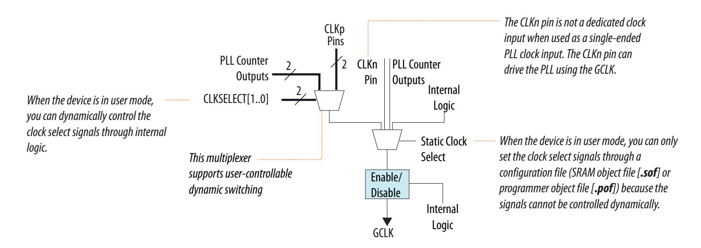

#### **RCLK Control Block**

You can only control the clock source selection for the RCLK select block statically using configuration bit settings in the configuration file (.sof or .pof) generated by the Intel Quartus Prime software.

**Figure 4-10: RCLK Control Block for Cyclone V Devices**

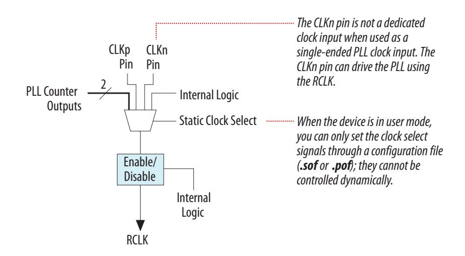

You can set the input clock sources and the clkena signals for the GCLK and RCLK network multiplexers through the Intel Quartus Prime software using the ALTCLKCTRL IP core.

Note: When selecting the clock source dynamically using the ALTCLKCTRL IP core, choose the inputs using the CLKSELECT[0..1] signal. The inputs from the clock pins feed the inclk[0..1] ports of the multiplexer, and the PLL outputs feed the inclk[2..3] ports.

#### Related Information

#### [Clock Control Block \(ALTCLKCTRL\) IP Core User Guide](https://cdrdv2.intel.com/v1/dl/getContent/654442)

Provides more information about ALTCLKCTRL IP core.

#### **PCLK Control Block**

To drive the HSSI horizontal PCLK control block, select the HSSI output or internal logic .

**Figure 4-11: Horizontal PCLK Control Block for Cyclone V Devices**

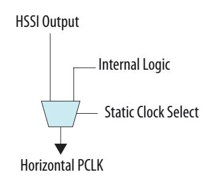

#### **External PLL Clock Output Control Block**

You can enable or disable the dedicated external clock output pins using the ALTCLKCTRL IP core.

**Figure 4-12: External PLL Output Clock Control Block for Cyclone V Devices**

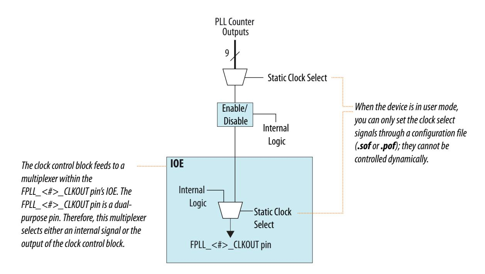

#### Related Information

#### [Clock Control Block \(ALTCLKCTRL\) IP Core User Guide](https://cdrdv2.intel.com/v1/dl/getContent/654442)

Provides more information about ALTCLKCTRL IP core.

#### **Clock Power Down**

You can power down the GCLK and RCLK clock networks using both static and dynamic approaches.

When a clock network is powered down, all the logic fed by the clock network is in off-state, reducing the overall power consumption of the device. The unused GCLK, RCLK, and PCLK networks are automati‐ cally powered down through configuration bit settings in the configuration file (.sof or .pof) generated by the Intel Quartus Prime software.

The dynamic clock enable or disable feature allows the internal logic to control power-up or power-down synchronously on the GCLK and RCLK networks, including dual-regional clock regions. This feature is independent of the PLL and is applied directly on the clock network.

Note: You cannot dynamically enable or disable GCLK or RCLK networks that drive PLLs.

#### **Clock Enable Signals**

You cannot use the clock enable and disable circuit of the clock control block if the GCLK or RCLK output drives the input of a PLL.

**Figure 4-13: clkena Implementation with Clock Enable and Disable Circuit**

This figure shows the implementation of the clock enable and disable circuit of the clock control block.

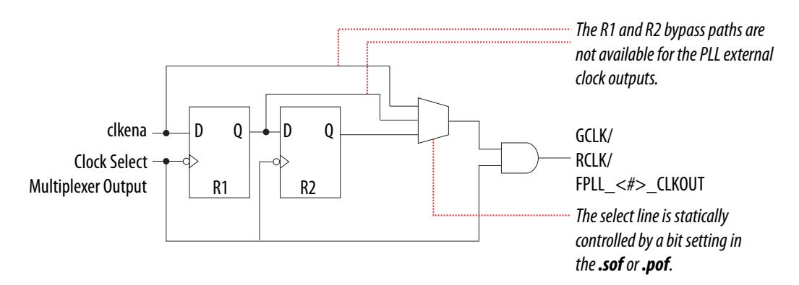

The clkena signals are supported at the clock network level instead of at the PLL output counter level. This allows you to gate off the clock even when you are not using a PLL. You can also use the clkena signals to control the dedicated external clocks from the PLLs.

#### **Figure 4-14: Example of clkena Signals**

This figure shows a waveform example for a clock output enable. The clkena signal is synchronous to the falling edge of the clock output.

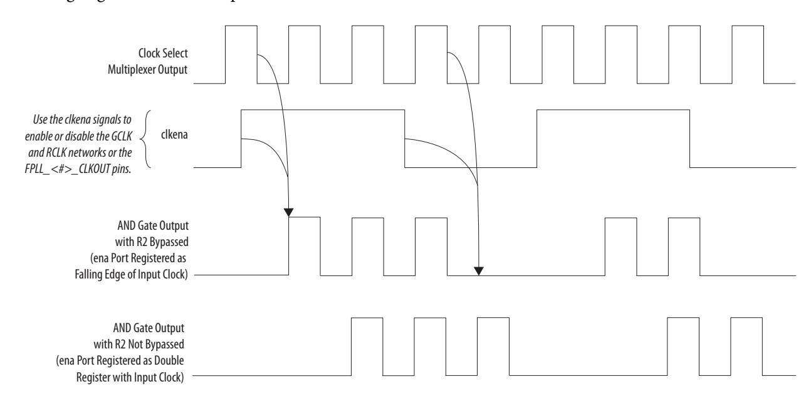

Cyclone V devices have an additional metastability register that aids in asynchronous enable and disable of the GCLK and RCLK networks. You can optionally bypass this register in the Intel Quartus Prime software.

The PLL can remain locked, independent of the clkena signals, because the loop-related counters are not affected. This feature is useful for applications that require a low-power or sleep mode. The clkena signal can also disable clock outputs if the system is not tolerant of frequency overshoot during resynchroniza‐ tion.

#### **Cyclone V PLLs**

PLLs provide robust clock management and synthesis for device clock management, external system clock management, and high-speed I/O interfaces.

The Cyclone V device family contains fractional PLLs that can function as fractional PLLs or integer PLLs. The output counters in Cyclone V devices are dedicated to each fractional PLL that support integer or fractional frequency synthesis.

The Cyclone V devices offer up to 8 fractional PLLs in the larger densities.

**Table 4-7: PLL Features in Cyclone V Devices**

| Feature        | Support |
| -------------- | ------- |
| Integer PLL    | Yes     |
| Fractional PLL | Yes     |

| Feature                              | Support                           |
| ------------------------------------ | --------------------------------- |
| C output counters                    | 9                                 |
| M , N , C counter sizes              | 1 to 512                          |
| Dedicated external clock outputs     | 2 single-ended and 1 differential |
| Dedicated clock input pins           | 4 single-ended or 4 differential  |
| External feedback input pin          | Single-ended or differential      |
| Spread-spectrum input clock tracking | Yes (5)                           |
| Source synchronous compensation      | Yes                               |
| Direct compensation                  | Yes                               |
| Normal compensation                  | Yes                               |
| Zero-delay buffer compensation       | Yes                               |
| External feedback compensation       | Yes                               |
| LVDS compensation                    | Yes                               |
| Phase shift resolution               | 78.125 ps (6)                     |
| Programmable duty cycle              | Yes                               |
| Power down mode                      | Yes                               |

#### **PLL Physical Counters in Cyclone V Devices**

The physical counters for the fractional PLLs are arranged in the following sequences:

- Up-to-down
- Down-to-up

#### **Figure 4-15: PLL Physical Counters Orientation for Cyclone V Devices**

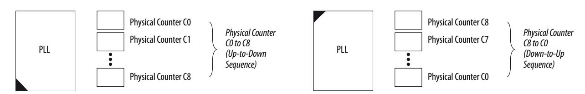

(5) Provided input clock jitter is within input jitter tolerance specifications. The modulation frequency of the input clock is below the PLL bandwidth which is specified in the Fitter report.

(6) The smallest phase shift is determined by the voltage-controlled oscillator (VCO) period divided by eight. For degree increments, the Cyclone V device can shift all output frequencies in increments of at least 45°. Smaller degree increments are possible depending on the frequency and divide parameters.

#### **PLL Locations in Cyclone V Devices**

Cyclone V devices provide a PLL for each group of three transceiver channels. These PLLs are located in a strip, where the strip refers to an area in the FPGA.

For the PLL in the strip, only PLL counter C[4..8] of the strip fractional PLLs are used in a clock network. PLL counter C[0..3] are used for supporting high-speed requirement of HSSI applications.

The total number of PLLs in the Cyclone V devices includes the PLLs in the PLL strip. However, the transceivers can only use the PLLs located in the strip.

The following figures show the physical locations of the fractional PLLs. Every index represents one fractional PLL in the device. The physical locations of the fractional PLLs correspond to the coordinates in the Intel Quartus Prime Chip Planner.

#### **Figure 4-16: PLL Locations for Cyclone V E A2 and A4 Devices**

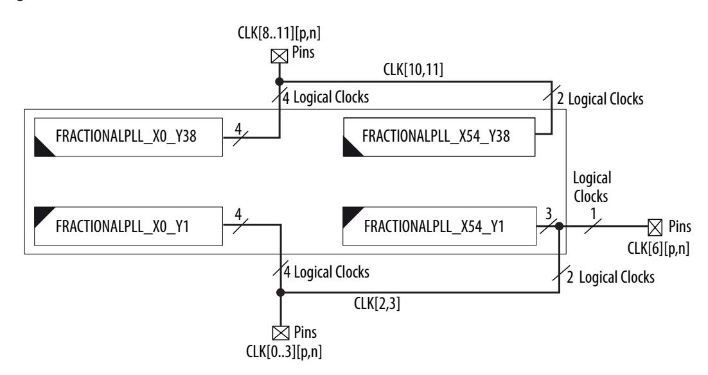

**Figure 4-17: PLL Locations for Cyclone V GX C3 Device**

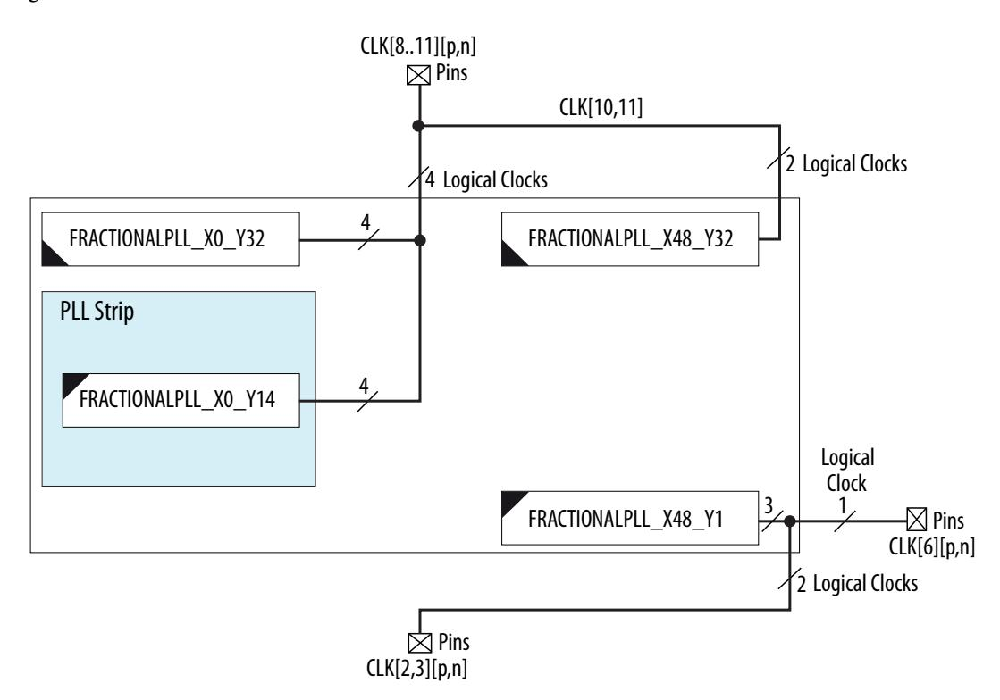

**Figure 4-18: PLL Locations for Cyclone V E A5 Device, Cyclone V GX C4 and C5 Devices, and Cyclone V GT D5 Device**

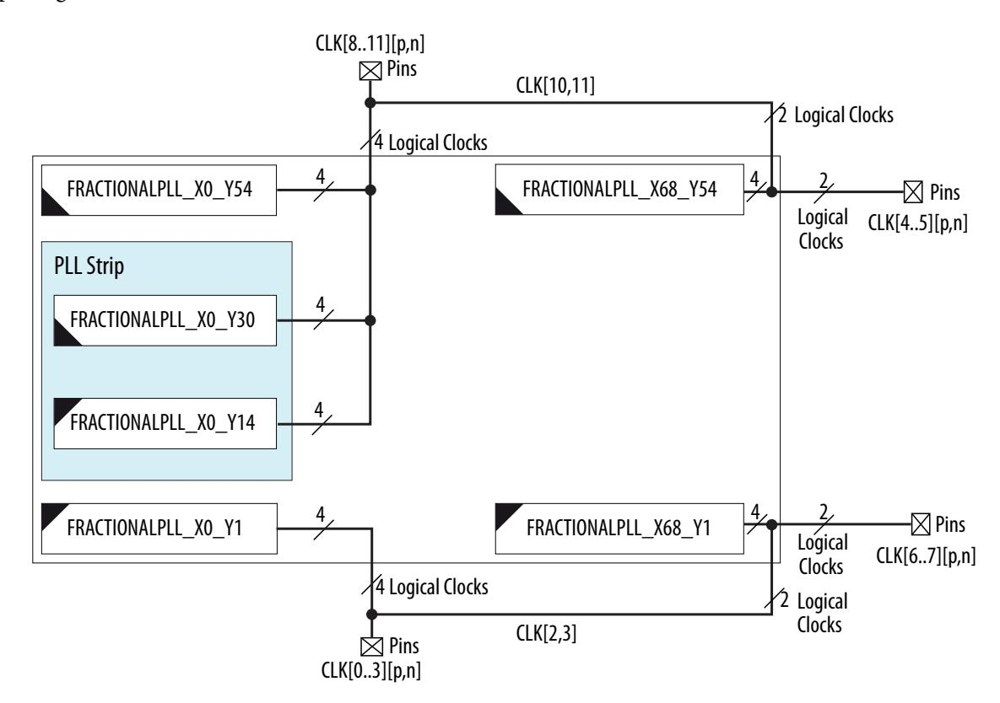

**Figure 4-19: PLL Locations for Cyclone V E A7 Device, Cyclone V GX C7 Device, and Cyclone V GT D7 Device**

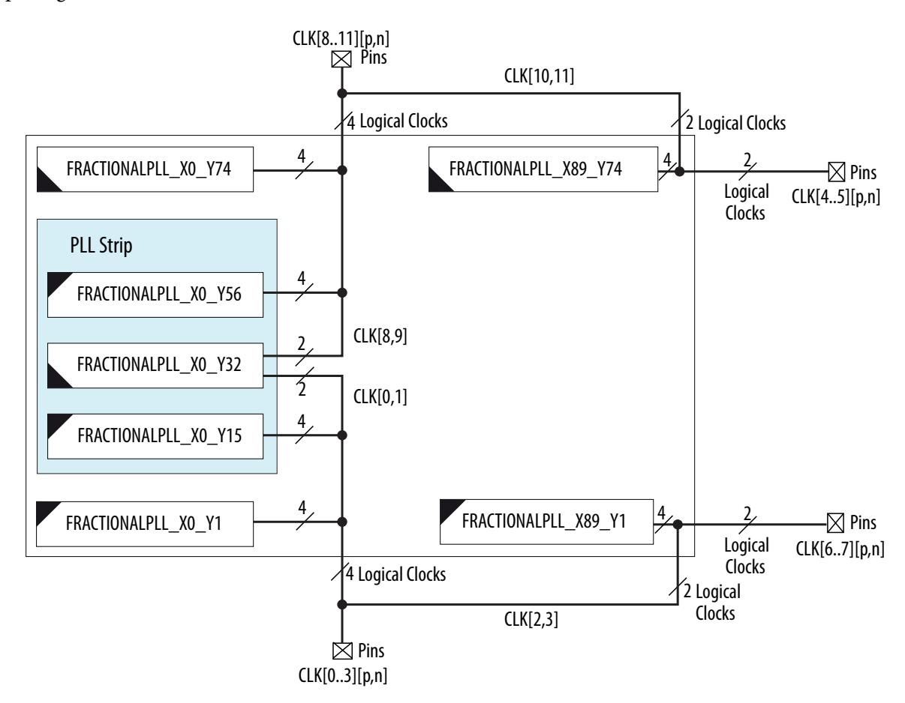

**Figure 4-20: PLL Locations for Cyclone V E A9 Device, Cyclone V GX C9 Device, and Cyclone V GT D9 Device**

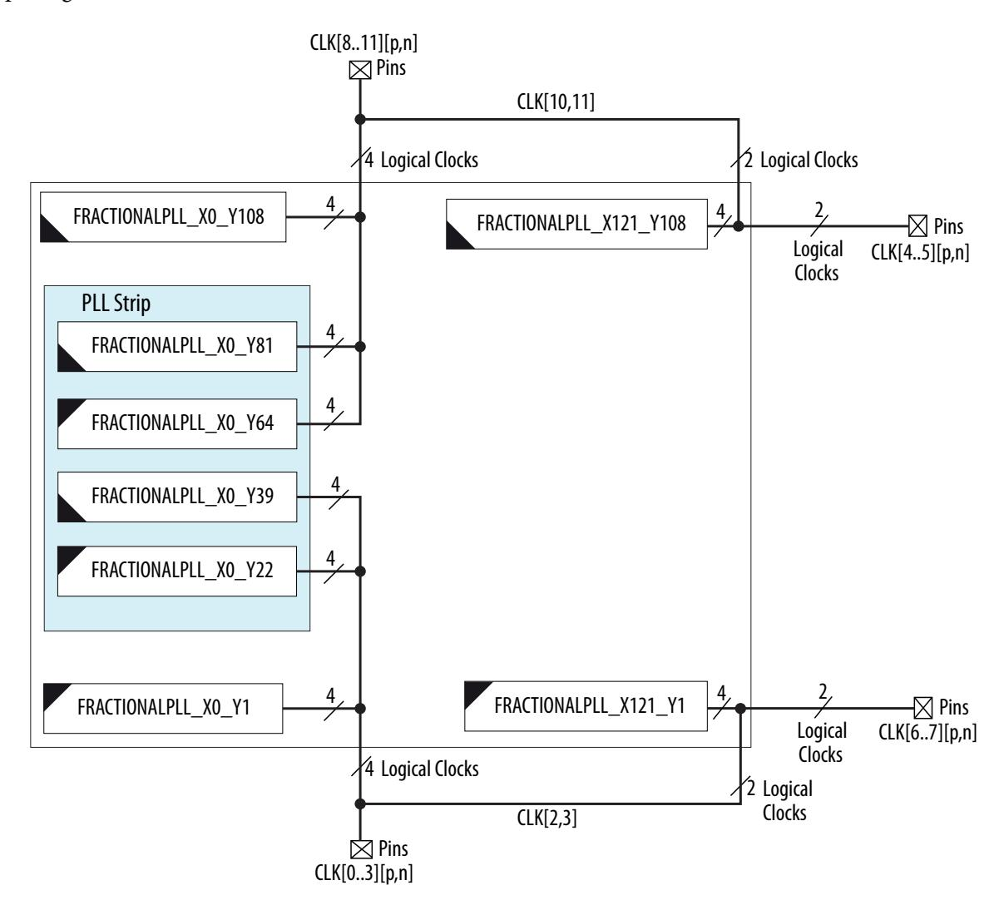

**Figure 4-21: PLL Locations for Cyclone V SE A2 and A4 Devices, and Cyclone V SX C2 and C4 Devices**

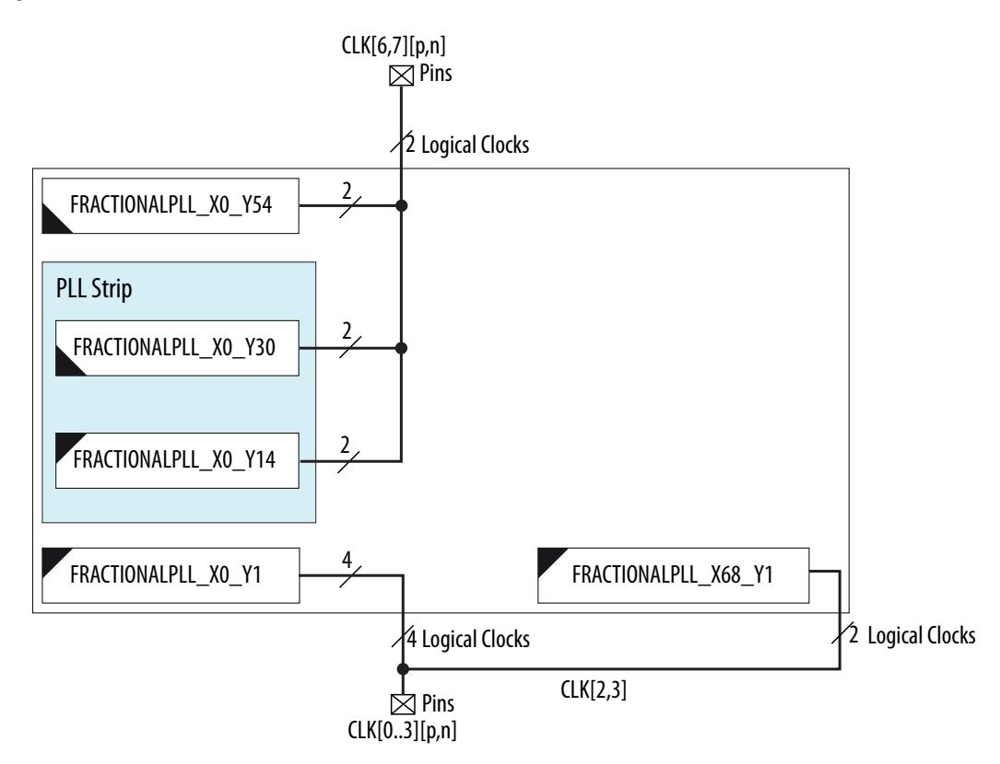

**Figure 4-22: PLL Locations for Cyclone V SE A5 and A6 Devices, Cyclone V SX C5 and C6 Devices, and Cyclone V ST D5 and D6 Devices**

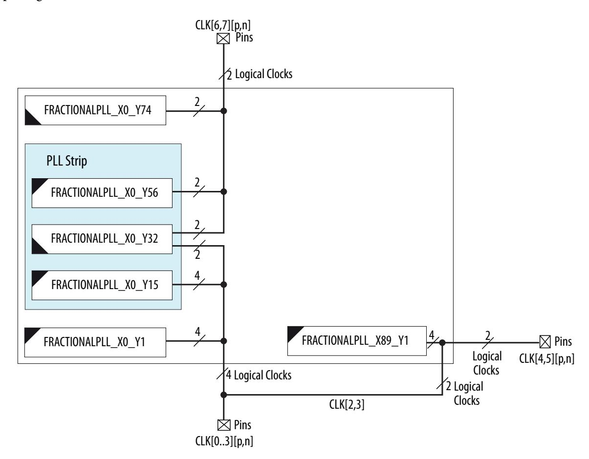

#### Related Information

PLL Migration Guidelines on page 4-27

Provides more information about PLL migration between Cyclone V SX C2, C4, C5, and C6 devices.

#### **PLL Migration Guidelines**

If you plan to migrate your design between Cyclone V SX C2, C4, C5, and C6 devices, and your design requires a PLL to drive the HSSI and clock network (GCLK or RCLK), use the PLLs on the left side of the device.

**Table 4-8: Location of PLLs for PLL Migration**

| Variant      | Member Code | PLL Location (Left Side) |
| ------------ | ----------- | ------------------------ |
| Cyclone V SX | C2          | FRACTIONALPLL_X0_Y14     |
|              | C4          |                          |
|              | C5          |                          |
|              | C6          | FRACTIONALPLL_X0_Y32     |

#### [PLL Locations in Cyclone V Devices](#page-80-0) on page 4-21

Provides more information about CLKIN pin connectivity to the PLLs.

#### **Fractional PLL Architecture**

**Figure 4-23: Fractional PLL High-Level Block Diagram for Cyclone V Devices**

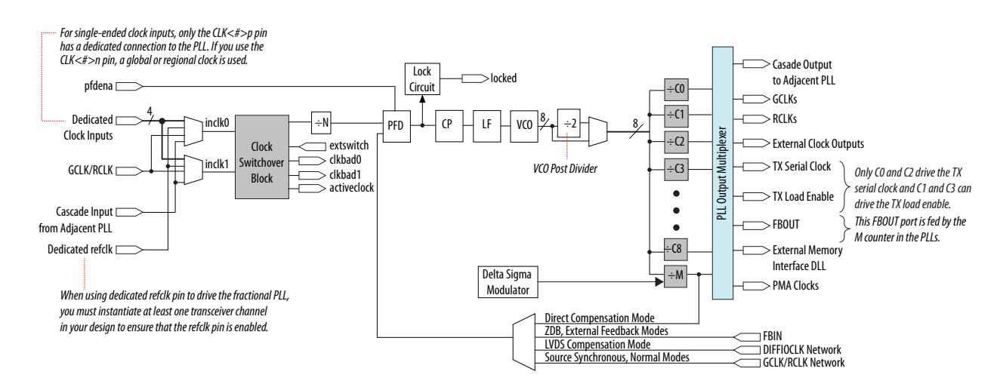

#### **Fractional PLL Usage**

You can configure the fractional PLL to function either in the integer or in the enhanced fractional mode. One fractional PLL can use up to 9 output counters and all external clock outputs.

Fractional PLLs can be used as follows:

- Reduce the number of required oscillators on the board
- Reduce the clock pins used in the FPGA by synthesizing multiple clock frequencies from a single reference clock source
- Compensate clock network delay
- Zero delay buffering
- Transmit clocking for transceivers

#### **PLL Cascading**

Cyclone V devices support two types of PLL cascading.

#### **PLL-to-PLL Cascading**

This cascading mode synthesizes a more precise output frequency than a single PLL in integer mode. Cascading two PLLs in integer mode expands the effective range of the pre-scale counter, N and the multiply counter, M.

Cyclone V devices only use adjpllin input clock source for inter-cascading between fracturable fractional PLLs.

Altera recommends using a low bandwidth setting for the source (upstream) PLL and a high bandwidth setting for destination (downstream) PLL.

#### **Counter-Output-to-Counter-Output Cascading**

This cascading mode synthesizes a lower frequency output than a single post-scale counter, C. Cascading two C counters expands the effective range of C counters.

#### **PLL External Clock I/O Pins**

All Cyclone V external clock outputs for corner fractional PLLs (that are not from the PLL strips) are dualpurpose clock I/O pins. Two external clock output pins associated with each corner fractional PLL are organized as one of the following combinations:

- Two single-ended clock outputs
- One differential clock output
- Two single-ended clock outputs and one single-ended clock input in the I/O driver feedback for zero delay buffer (ZDB) mode support
- One single-ended clock output and one single-ended feedback input for single-ended external feedback (EFB) mode support
- One differential clock output and one differential feedback input for differential EFB support

Note: The external clock outputs support is dependent on the device density and package.

The following figure shows that any of the output counters (C[0..8]) or the M counter on the PLLs can feed the dedicated external clock outputs. Therefore, one counter or frequency can drive all output pins available from a given PLL.

**Figure 4-24: Dual-Purpose Clock I/O Pins Associated with PLL for Cyclone V Devices**

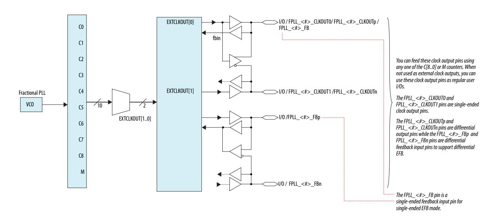

Each pin of a single-ended output pair can be either in-phase or 180° out-of-phase. To implement the 180° out-of-phase pin in a pin pair, the Intel Quartus Prime software places a NOT gate in the design into the IOE.

The clock output pin pairs support the following I/O standards:

- Same I/O standard for the pin pairs
- LVDS
- Differential high-speed transceiver logic (HSTL)
- Differential SSTL

Cyclone V PLLs can drive out to any regular I/O pin through the GCLK or RCLK network. You can also use the external clock output pins as user I/O pins if you do not require external PLL clocking.

#### Related Information

- [Cyclone V Device Pin-Out Files](https://www.intel.com/content/www/us/en/support/programmable/support-resources/devices/lit-dp.html) Provides more information about the external clock output availability.
- [I/O Standards Support in Cyclone V Devices](#page-112-0) on page 5-6 Provides more information about I/O standards supported by the PLL clock input and output pins.
- [Zero-Delay Buffer Mode](#page-93-0) on page 4-34
- [External Feedback Mode](#page-95-0) on page 4-36

#### **PLL Control Signals**

You can use the areset signal to control PLL operation and resynchronization, and use the locked signal to observe the status of the PLL.

#### **areset**

The areset signal is the reset or resynchronization input for each PLL. The device input pins or internal logic can drive these input signals.

When areset is driven high, the PLL counters reset, clearing the PLL output and placing the PLL out-oflock. The VCO is then set back to its nominal setting. When areset is driven low again, the PLL resynch‐ ronizes to its input as it re-locks.

You must assert the areset signal every time the PLL loses lock to guarantee the correct phase relation‐ ship between the PLL input and output clocks. You can set up the PLL to automatically reset (self-reset) after a loss-of-lock condition using the Intel Quartus Prime IP Catalog.

You must include the areset signal if either of the following conditions is true:

- PLL reconfiguration or clock switchover is enabled in the design
- Phase relationships between the PLL input and output clocks must be maintained after a loss-of-lock condition

Note: If the input clock to the PLL is not toggling or is unstable after power up, assert the areset signal after the input clock is stable and within specifications.

#### **locked**

The locked signal output of the PLL indicates the following conditions:

- The PLL has locked onto the reference clock.
- The PLL clock outputs are operating at the desired phase and frequency set in the IP Catalog.

The lock detection circuit provides a signal to the core logic. The signal indicates when the feedback clock has locked onto the reference clock both in phase and frequency.

#### **Clock Feedback Modes**

This section describes the following clock feedback modes:

- Source synchronous
- LVDS compensation
- Direct
- Normal compensation
- ZDB
- EFB

Each mode allows clock multiplication and division, phase shifting, and programmable duty cycle.

The input and output delays are fully compensated by a PLL only when using the dedicated clock input pins associated with a given PLL as the clock source.

The input and output delays may not be fully compensated in the Intel Quartus Prime software for the following conditions:

- When a GCLK or RCLK network drives the PLL
- When the PLL is driven by a dedicated clock pin that is not associated with the PLL

For example, when you configure a PLL in ZDB mode, the PLL input is driven by an associated dedicated clock input pin. In this configuration, a fully compensated clock path results in zero delay between the clock input and one of the clock outputs from the PLL. However, if the PLL input is fed by a non-dedicated input (using the GCLK network), the output clock may not be perfectly aligned with the input clock.

#### **Source Synchronous Mode**

If the data and clock arrive at the same time on the input pins, the same phase relationship is maintained at the clock and data ports of any IOE input register. Data and clock signals at the IOE experience similar buffer delays as long as you use the same I/O standard.

Altera recommends source synchronous mode for source synchronous data transfers.

**Figure 4-25: Example of Phase Relationship Between Clock and Data in Source Synchronous Mode**

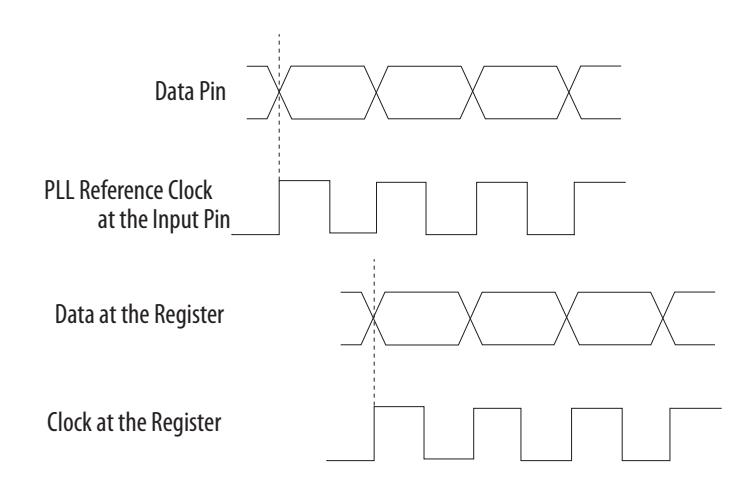

The source synchronous mode compensates for the delay of the clock network used and any difference in the delay between the following two paths:

- Data pin to the IOE register input
- Clock input pin to the PLL phase frequency detector (PFD) input

The Cyclone V PLL can compensate multiple pad-to-input-register paths, such as a data bus when it is set to use source synchronous compensation mode.

#### **LVDS Compensation Mode**

The purpose of LVDS compensation mode is to maintain the same data and clock timing relationship seen at the pins of the internal serializer/deserializer (SERDES) capture register, except that the clock is inverted (180° phase shift). Thus, LVDS compensation mode ideally compensates for the delay of the LVDS clock network, including the difference in delay between the following two paths:

- Data pin-to-SERDES capture register
- Clock input pin-to-SERDES capture register

The output counter must provide the 180° phase shift.

**Figure 4-26: Example of Phase Relationship Between the Clock and Data in LVDS Compensation Mode**

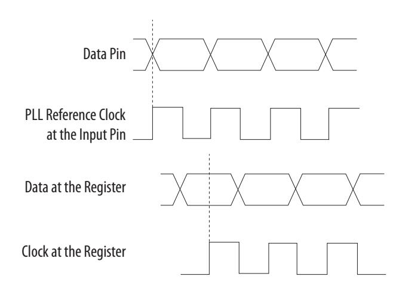

#### **Direct Mode**

In direct mode, the PLL does not compensate for any clock networks. This mode provides better jitter performance because the clock feedback into the PFD passes through less circuitry. Both the PLL internaland external-clock outputs are phase-shifted with respect to the PLL clock input.

**Figure 4-27: Example of Phase Relationship Between the PLL Clocks in Direct Mode**

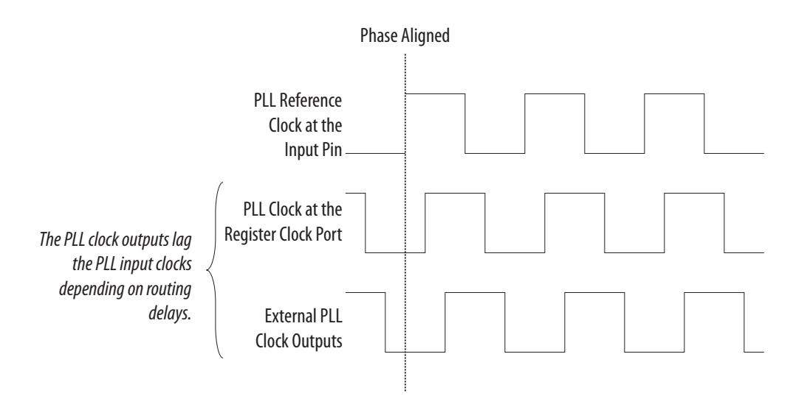

#### **Normal Compensation Mode**

An internal clock in normal compensation mode is phase-aligned to the input clock pin. The external clock output pin has a phase delay relative to the clock input pin if connected in this mode. The Intel Quartus Prime Timing Analyzer reports any phase difference between the two. In normal compensation mode, the delay introduced by the GCLK or RCLK network is fully compensated.

**Figure 4-28: Example of Phase Relationship Between the PLL Clocks in Normal Compensation Mode**

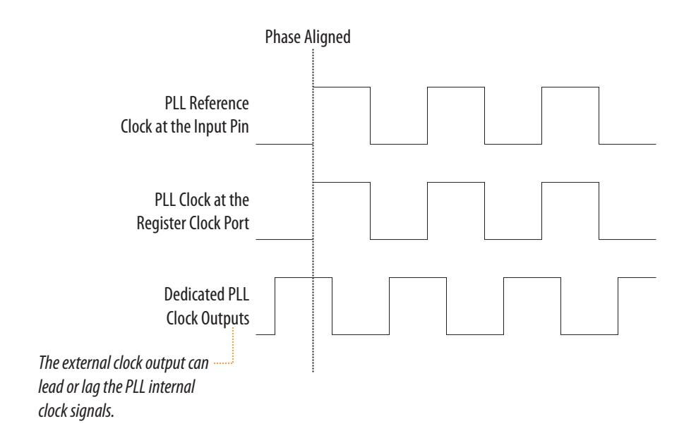

#### **Zero-Delay Buffer Mode**

In ZDB mode, the external clock output pin is phase-aligned with the clock input pin for zero delay through the device. This mode is supported on all Cyclone V PLLs.

When using this mode, you must use the same I/O standard on the input clocks and clock outputs to guarantee clock alignment at the input and output pins. You cannot use differential I/O standards on the PLL clock input or output pins.

To ensure phase alignment between the clk pin and the external clock output (CLKOUT) pin in ZDB mode, instantiate a bidirectional I/O pin in the design. The bidirectional I/O pin serves as the feedback path connecting the fbout and fbin ports of the PLL. The bidirectional I/O pin must always be assigned a single-ended I/O standard. The PLL uses this bidirectional I/O pin to mimic and compensate for the output delay from the clock output port of the PLL to the external clock output pin.

Note: To avoid signal reflection when using ZDB mode, do not place board traces on the bidirectional I/O pin.

**Figure 4-29: ZDB Mode in Cyclone V PLLs**

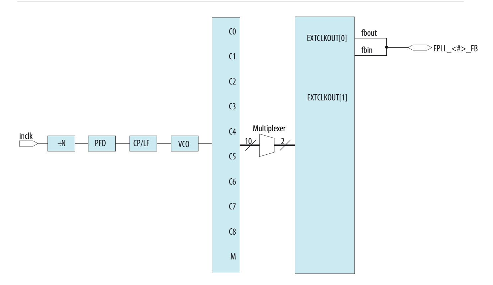

**Figure 4-30: Example of Phase Relationship Between the PLL Clocks in ZDB Mode**

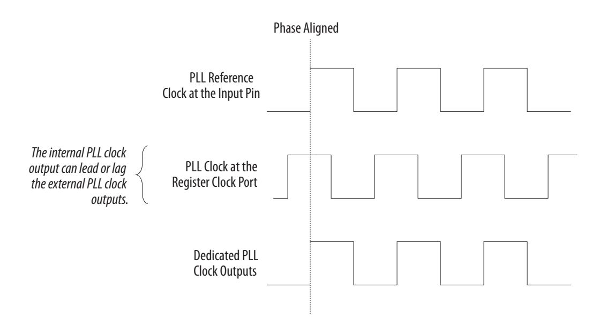

[PLL External Clock I/O Pins](#page-88-0) on page 4-29

Provides more information about PLL clock outputs.

#### **External Feedback Mode**

In EFB mode, the output of the M counter (fbout) feeds back to the PLL fbin input (using a trace on the board) and becomes part of the feedback loop.

One of the dual-purpose external clock outputs becomes the fbin input pin in this mode. The external feedback input pin, fbin is phase-aligned with the clock input pin. Aligning these clocks allows you to remove clock delay and skew between devices.

When using EFB mode, you must use the same I/O standard on the input clock, feedback input, and clock outputs.

This mode is supported only on the corner fractional PLLs. For Cyclone V E A2 and A4 devices, and Cyclone V GX C3 device, EFB mode is supported only on the left corner fractional PLLs.

**Figure 4-31: EFB Mode in Cyclone V Devices**

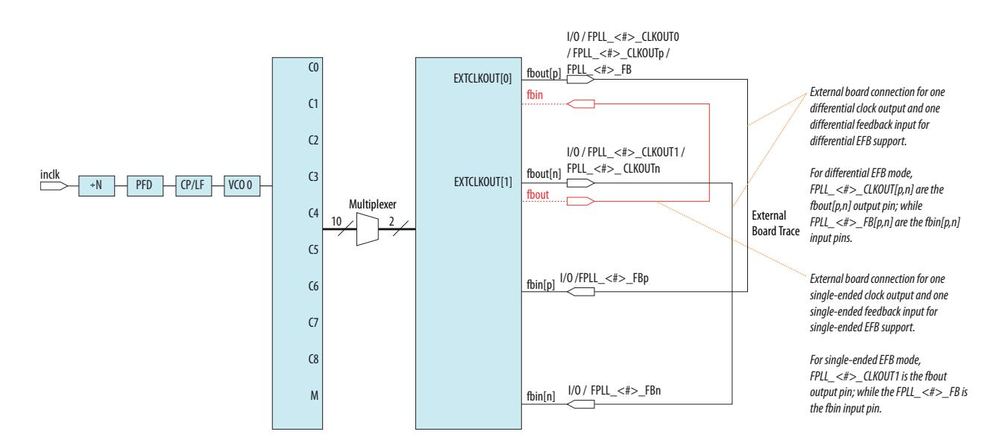

**Figure 4-32: Example of Phase Relationship Between the PLL Clocks in EFB Mode**

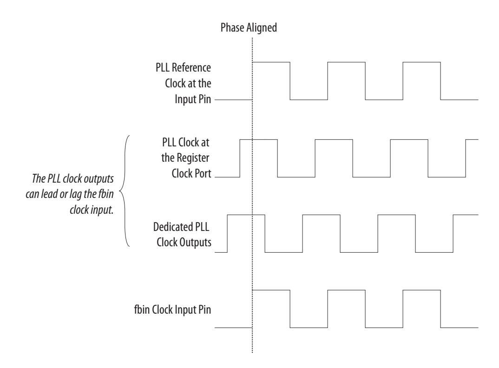

[PLL External Clock I/O Pins](#page-88-0) on page 4-29

Provides more information about PLL clock outputs.

#### **Clock Multiplication and Division**

Each Cyclone V PLL provides clock synthesis for PLL output ports using the M/(N × C) scaling factors. The input clock is divided by a pre-scale factor, N, and is then multiplied by the M feedback factor. The control loop drives the VCO to match fin × (M/N).

The Intel Quartus Prime software automatically chooses the appropriate scaling factors according to the input frequency, multiplication, and division values entered into the ALTERA\_PLL IP core.

#### **VCO Post Divider**

A VCO post divider is inserted after the VCO. When you enable the VCO post divider, the VCO post divider divides the VCO frequency by two. When the VCO post divider is bypassed, the VCO frequency goes to the output port without being divided by two.

#### **Post-Scale Counter, C**

Each output port has a unique post-scale counter, C, that divides down the output from the VCO post divider. For multiple PLL outputs with different frequencies, the VCO is set to the least common multiple of the output frequencies that meets its frequency specifications. For example, if the output frequencies required from one PLL are 33 and 66 MHz, the Intel Quartus Prime software sets the VCO to 660 MHz

(the least common multiple of 33 and 66 MHz within the VCO range). Then the post-scale counters, C, scale down the VCO frequency for each output port.

#### **Pre-Scale Counter, N and Multiply Counter, M**

Each PLL has one pre-scale counter, N, and one multiply counter, M, with a range of 1 to 512 for both M and N. The N counter does not use duty-cycle control because the only purpose of this counter is to calculate frequency division. The post-scale counters have a 50% duty cycle setting. The high- and low-count values for each counter range from 1 to 256. The sum of the high- and low-count values chosen for a design selects the divide value for a given counter.

#### **Delta-Sigma Modulator**

The delta-sigma modulator (DSM) is used together with the M multiply counter to enable the PLL to operate in fractional mode. The DSM dynamically changes the M counter divide value on a cycle to cycle basis. The different M counter values allow the "average" M counter value to be a non-integer.

#### **Fractional Mode**

In fractional mode, the M counter divide value equals to the sum of the "clock high" count, "clock low" count, and the fractional value. The fractional value is equal to K/2^X, where K is an integer between 0 and (2^X – 1), and X = 8, 16, 24, or 32.

#### **Integer Mode**

For PLL operating in integer mode, M is an integer value and DSM is disabled.

#### Related Information

#### Altera Phase-Locked Loop (Altera PLL) IP Core User Guide

Provides more information about PLL software support in the Quartus Prime software.

#### **Programmable Phase Shift**

The programmable phase shift feature allows the PLLs to generate output clocks with a fixed phase offset.

The VCO frequency of the PLL determines the precision of the phase shift. The minimum phase shift increment is 1/8 of the VCO period. For example, if a PLL operates with a VCO frequency of 1000 MHz, phase shift steps of 125 ps are possible.

The Intel Quartus Prime software automatically adjusts the VCO frequency according to the user-specified phase shift values entered into the IP core.

#### **Programmable Duty Cycle**

The programmable duty cycle allows PLLs to generate clock outputs with a variable duty cycle. This feature is supported on the PLL post-scale counters.

The duty-cycle setting is achieved by a low and high time-count setting for the post-scale counters. To determine the duty cycle choices, the Intel Quartus Prime software uses the frequency input and the required multiply or divide rate.

The post-scale counter value determines the precision of the duty cycle. The precision is defined as 50% divided by the post-scale counter value. For example, if the C0 counter is 10, steps of 5% are possible for duty-cycle choices from 5% to 90%. If the PLL is in external feedback mode, set the duty cycle for the counter driving the fbin pin to 50%.

Combining the programmable duty cycle with programmable phase shift allows the generation of precise non-overlapping clocks.

#### **Clock Switchover**

The clock switchover feature allows the PLL to switch between two reference input clocks. Use this feature for clock redundancy or for a dual-clock domain application where a system turns on the redundant clock if the previous clock stops running. The design can perform clock switchover automatically when the clock is no longer toggling or based on a user control signal, extswitch.

The following clock switchover modes are supported in Cyclone V PLLs:

- Automatic switchover—The clock sense circuit monitors the current reference clock. If the current reference clock stops toggling, the reference clock automatically switches to inclk0 or inclk1 clock.
- Manual clock switchover—Clock switchover is controlled using the extswitch signal. When the extswitch signal goes from logic low to logic high, and stays high for at least three clock cycles, the reference clock to the PLL is switched from inclk0 to inclk1, or vice-versa.
- Automatic switchover with manual override—This mode combines automatic switchover and manual clock switchover. When the extswitch signal goes high, it overrides the automatic clock switchover function.

#### **Automatic Switchover**

Cyclone V PLLs support a fully configurable clock switchover capability.

**Figure 4-33: Automatic Clock Switchover Circuit Block Diagram**

This figure shows a block diagram of the automatic switchover circuit built into the PLL.

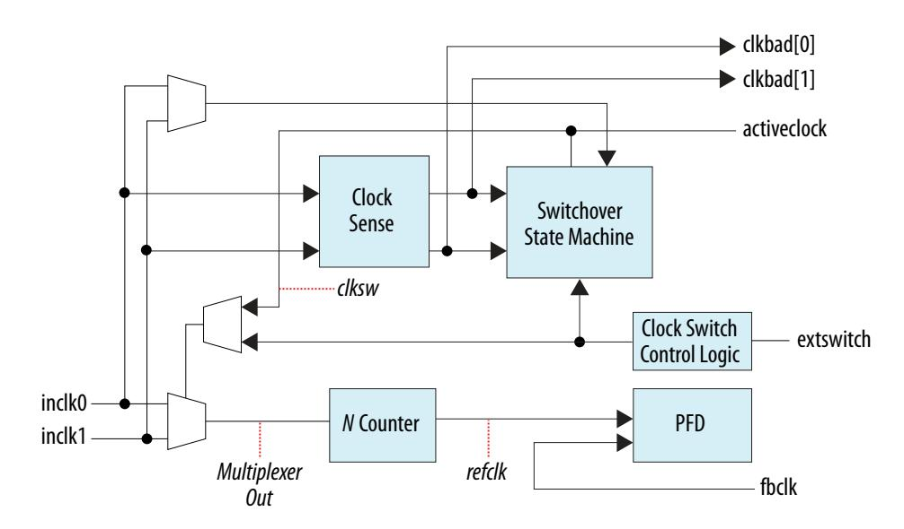

When the current reference clock is not present, the clock sense block automatically switches to the backup clock for PLL reference. You can select a clock source as the backup clock by connecting it to the inclk1 port of the PLL in your design.

The clock switchover circuit sends out three status signals—clkbad[0], clkbad[1], and activeclock from the PLL to implement a custom switchover circuit in the logic array.

In automatic switchover mode, the clkbad[0] and clkbad[1] signals indicate the status of the two clock inputs. When they are asserted, the clock sense block detects that the corresponding clock input has stopped toggling. These two signals are not valid if the frequency difference between inclk0 and inclk1 is greater than 20%.

The activeclock signal indicates which of the two clock inputs (inclk0 or inclk1) is being selected as the reference clock to the PLL. When the frequency difference between the two clock inputs is more than 20%, the activeclock signal is the only valid status signal.

Note: Glitches in the input clock may cause the frequency difference between the input clocks to be more than 20%.

Use the switchover circuitry to automatically switch between inclk0 and inclk1 when the current reference clock to the PLL stops toggling. You can switch back and forth between inclk0 and inclk1 any number of times when one of the two clocks fails and the other clock is available.

For example, in applications that require a redundant clock with the same frequency as the reference clock, the switchover state machine generates a signal (clksw) that controls the multiplexer select input. In this case, inclk1 becomes the reference clock for the PLL.

When using automatic clock switchover mode, the following requirements must be satisfied:

- Both clock inputs must be running when the FPGA is configured.
- The period of the two clock inputs can differ by no more than 20%.

If the current clock input stops toggling while the other clock is also not toggling, switchover is not initiated and the clkbad[0..1] signals are not valid. If both clock inputs are not the same frequency, but their period difference is within 20%, the clock sense block detects when a clock stops toggling. However, the PLL may lose lock after the switchover is completed and needs time to relock.

Note: Altera recommends resetting the PLL using the areset signal to maintain the phase relationships between the PLL input and output clocks when using clock switchover.

**Figure 4-34: Automatic Switchover After Loss of Clock Detection**

This figure shows an example waveform of the switchover feature in automatic switchover mode. In this example, the inclk0 signal is stuck low. After the inclk0 signal is stuck at low for approximately two clock cycles, the clock sense circuitry drives the clkbad[0] signal high. Since the reference clock signal is not toggling, the switchover state machine controls the multiplexer through the extswitch signal to switch to the backup clock, inclk1.

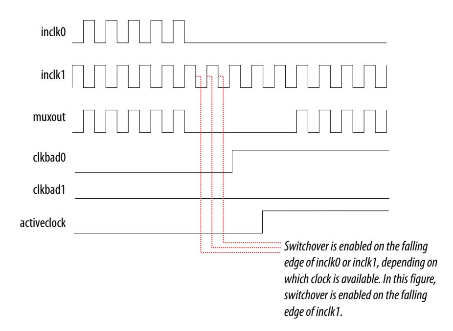

#### **Automatic Switchover with Manual Override**

In automatic switchover with manual override mode, you can use the extswitch signal for user- or system-controlled switch conditions. You can use this mode for same-frequency switchover, or to switch between inputs of different frequencies.

For example, if inclk0 is 66 MHz and inclk1 is 200 MHz, you must control switchover using the extswitch signal. The automatic clock-sense circuitry cannot monitor clock input (inclk0 and inclk1) frequencies with a frequency difference of more than 100% (2×).

This feature is useful when the clock sources originate from multiple cards on the backplane, requiring a system-controlled switchover between the frequencies of operation.

You must choose the backup clock frequency and set the M, N, C, and K counters so that the VCO operates within the recommended operating frequency range. The ALTERA\_PLL IP Catalog notifies you if a given combination of inclk0 and inclk1 frequencies cannot meet this requirement.

#### **Figure 4-35: Clock Switchover Using the extswitch (Manual) Control**

This figure shows a clock switchover waveform controlled by the extswitch signal. In this case, both clock sources are functional and inclk0 is selected as the reference clock; the extswitch signal goes high, which starts the switchover sequence. On the falling edge of inclk0, the counter's reference clock, muxout, is gated off to prevent clock glitching. On the falling edge of inclk1, the reference clock multiplexer switches from inclk0 to inclk1 as the PLL reference. The activeclock signal changes to indicate the clock which is currently feeding the PLL.

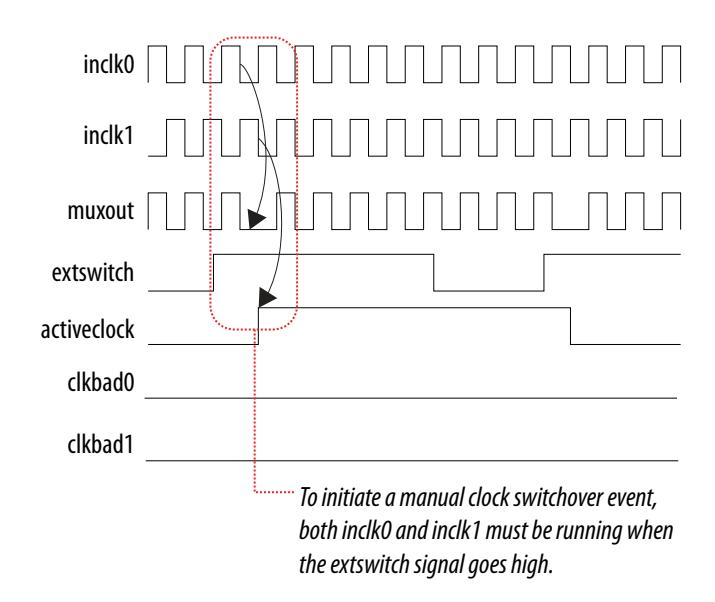

In automatic override with manual switchover mode, the activeclock signal mirrors the extswitch signal. Since both clocks are still functional during the manual switch, neither clkbad signal goes high. Because the switchover circuit is positive-edge sensitive, the falling edge of the extswitch signal does not cause the circuit to switch back from inclk1 to inclk0. When the extswitch signal goes high again, the process repeats.

The extswitch signal and automatic switch work only if the clock being switched to is available. If the clock is not available, the state machine waits until the clock is available.

#### Related Information

#### Altera Phase-Locked Loop (Altera PLL) IP Core User Guide

Provides more information about PLL software support in the Quartus Prime software.

#### **Manual Clock Switchover**

In manual clock switchover mode, the extswitch signal controls whether inclk0 or inclk1 is selected as the input clock to the PLL. By default, inclk0 is selected.

A clock switchover event is initiated when the extswitch signal transitions from logic low to logic high, and being held high for at least three inclk cycles.

You must bring the extswitch signal back low again for PLL to re-gain lock. If you do not require another switchover event, you can leave the extswitch signal in a logic low state.

Pulsing the extswitch signal high for at least three inclk cycles performs another switchover event.

If inclk0 and inclk1 are different frequencies and are always running, the extswitch signal minimum high time must be greater than or equal to three of the slower frequency inclk0 and inclk1 cycles.

**Figure 4-36: Manual Clock Switchover Circuitry in Cyclone V PLLs**

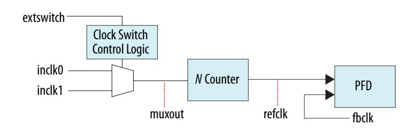

You can delay the clock switchover action by specifying the switchover delay in the ALTERA\_PLL IP core. When you specify the switchover delay, the extswitch signal must be held high for at least three inclk cycles plus the number of the delay cycles that has been specified to initiate a clock switchover.

#### Related Information

#### Altera Phase-Locked Loop (Altera PLL) IP Core User Guide

Provides more information about PLL software support in the Quartus Prime software.

#### **Guidelines**

When implementing clock switchover in Cyclone V PLLs, use the following guidelines:

- Automatic clock switchover requires that the inclk0 and inclk1 frequencies be within 20% of each other. Failing to meet this requirement causes the clkbad[0] and clkbad[1] signals to not function properly.
- When using manual clock switchover, the difference between inclk0 and inclk1 can be more than 100% (2×). However, differences in frequency, phase, or both, of the two clock sources will likely cause the PLL to lose lock. Resetting the PLL ensures that you maintain the correct phase relationships between the input and output clocks.
- Both inclk0 and inclk1 must be running when the extswitch signal goes high to initiate the manual clock switchover event. Failing to meet this requirement causes the clock switchover to not function properly.
- Applications that require a clock switchover feature and a small frequency drift must use a lowbandwidth PLL. When referencing input clock changes, the low-bandwidth PLL reacts more slowly than a high-bandwidth PLL. When switchover happens, a low-bandwidth PLL propagates the stopping of the clock to the output more slowly than a high-bandwidth PLL. However, be aware that the lowbandwidth PLL also increases lock time.
- After a switchover occurs, there may be a finite resynchronization period for the PLL to lock onto a new clock. The time it takes for the PLL to relock depends on the PLL configuration.
- The phase relationship between the input clock to the PLL and the output clock from the PLL is important in your design. Assert areset for at least 10 ns after performing a clock switchover. Wait for the locked signal to go high and be stable before re-enabling the output clocks from the PLL.
- The VCO frequency gradually decreases when the current clock is lost and then increases as the VCO locks on to the backup clock, as shown in the following figure.

**Figure 4-37: VCO Switchover Operating Frequency**

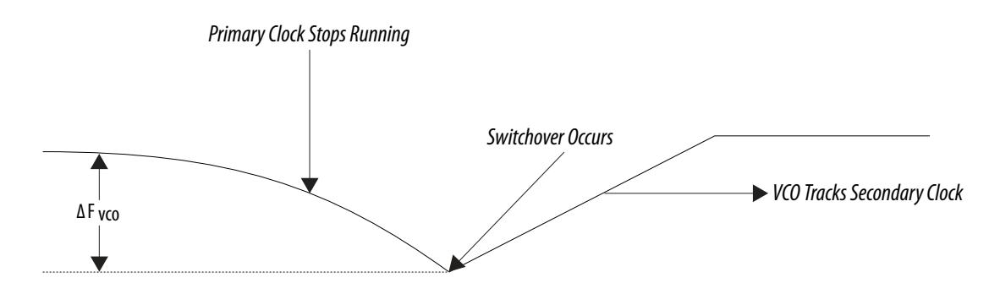

#### **PLL Reconfiguration and Dynamic Phase Shift**

For more information about PLL reconfiguration and dynamic phase shifting, refer to AN661.

#### Related Information

AN 661: Implementing Fractional PLL Reconfiguration with Altera PLL and Altera PLL Reconfig IP Cores

## **Clock Networks and PLLs in Cyclone V Devices Revision History**

| Document Version | Changes                                                                                                                                                                                                                                                                                                                                                      |
| ---------------- | ------------------------------------------------------------------------------------------------------------------------------------------------------------------------------------------------------------------------------------------------------------------------------------------------------------------------------------------------------------ |
| 2019.05.15       | Corrected the PLL locations for Cyclone V GX C3 Device.                                                                                                                                                                                                                                                                                                      |
| 2019.04.26       | <ul> <li>Corrected the signal name from <code>clkswitch</code> to <code>extswitch</code>.</li> <li>Updated the description for the automatic switchover with manual override mode in the <i>Clock Switchover</i> section.</li> <li>Updated the description about the <code>extswitch</code> signal in the <i>Manual Clock Switchover</i> section.</li> </ul> |

| Date | Version    | Changes                                                                 |
| ---- | ---------- | ----------------------------------------------------------------------- |
|      | 2017.12.15 | Updated the PLL Locations for Cyclone V GX C3 Device diagram.           |
|      | 2016.12.09 | Added a note to dedicated refclk pin in Fractional PLL High-Level Block |
|      | 2015.12.21 | Changed instances of Quartus II to Quartus Prime                        |

| Date         | Version    | Changes                                                                                                                                                                                                                                                                                                                                                                                                                                                                                                                                                                                                                                                                                                                                                                                                                                                                                                                                                                                                                                                                                                                                                                                                                                                                                                                                                     |
| ------------ | ---------- | ----------------------------------------------------------------------------------------------------------------------------------------------------------------------------------------------------------------------------------------------------------------------------------------------------------------------------------------------------------------------------------------------------------------------------------------------------------------------------------------------------------------------------------------------------------------------------------------------------------------------------------------------------------------------------------------------------------------------------------------------------------------------------------------------------------------------------------------------------------------------------------------------------------------------------------------------------------------------------------------------------------------------------------------------------------------------------------------------------------------------------------------------------------------------------------------------------------------------------------------------------------------------------------------------------------------------------------------------------------- |
| June 2015    | 2015.06.12 | <ul> <li>• Updated RCLK Networks in Cyclone V SE, SX, and ST Devices diagram. Mentioned that RCLK network is not available in quadrant 2 for Cyclone V SE A5 and A6 device, Cyclone V ST D5 and D6 devices, and Cyclone V SX C5 and C6 devices.</li> <li>• Added CLK pins connection to FRACTIONALPLL_X0_Y32 in PLL Locations for Cyclone V E A7 Device, Cyclone V GX C7 Device, and Cyclone V GT D7 Device diagram.</li> </ul>                                                                                                                                                                                                                                                                                                                                                                                                                                                                                                                                                                                                                                                                                                                                                                                                                                                                                                                             |
| January 2014 | 2014.01.10 | <ul> <li>• Removed Preliminary tags for clock resources, clock input pin connections to GCLK and RCLK networks, and PLL features tables.</li> <li>• Updated clock resources table.</li> <li>• Updated GCLK, RCLK, and PCLK networks diagrams for Cyclone V E, GX, and GT devices.</li> <li>• Added GCLK, RCLK, and PCLK networks diagrams for Cyclone V SE, SX, and ST devices.</li> <li>• Added notes to dedicated clock input pin connectivity to GCLK and RCLK tables for Cyclone V SE, ST, and SX devices.</li> <li>• Updated the following PLL locations diagrams: <ul> <li>• Cyclone V GX C3 device</li> <li>• Cyclone V E A7 device, Cyclone V GX C7 device, and Cyclone V GT D7 device</li> </ul> </li> <li>• Added the following PLL locations diagrams: <ul> <li>• Cyclone V SE A2 and A4 devices, and Cyclone V SX C2 and C4 devices</li> <li>• Cyclone V SE A5 and A6 devices, Cyclone V SX C5 and C6 devices, and Cyclone V ST D5 and D6 devices</li> </ul> </li> <li>• Added information on PLL migration guidelines.</li> <li>• Updated VCO post-scale counter, K, to VCO post divider.</li> <li>• Added information on PLL cascading.</li> <li>• Updated information on external clock output support.</li> <li>• Added information on programmable phase shift.</li> <li>• Updated automatic clock switchover mode requirement.</li> </ul> |

| Date          | Version    | Changes                                                                                                                                                                                                                                                                                                                                                                                                                                                                                                                                                                                                                                                                                                                                                                                                                                                                                                                                                                                                                                                                                                                                                                                          |
| ------------- | ---------- | ------------------------------------------------------------------------------------------------------------------------------------------------------------------------------------------------------------------------------------------------------------------------------------------------------------------------------------------------------------------------------------------------------------------------------------------------------------------------------------------------------------------------------------------------------------------------------------------------------------------------------------------------------------------------------------------------------------------------------------------------------------------------------------------------------------------------------------------------------------------------------------------------------------------------------------------------------------------------------------------------------------------------------------------------------------------------------------------------------------------------------------------------------------------------------------------------ |
| May 2013      | 2013.05.06 | <ul> <li>• Added link to the known document issues in the Knowledge Base.</li> <li>• Updated PCLK clock sources in hierarchical clock networks in each spine clock per quadrant diagram.</li> <li>• Added PCLK networks in clock network sources section.</li> <li>• Updated dedicated clock input pins in clock network sources section.</li> <li>• Added descriptions for PLLs located in a strip.</li> <li>• Added information on PLL physical counters.</li> <li>• Updated the fractional PLL architecture diagram to add dedicated <code>refclk</code> input port and connections.</li> <li>• Updated PLL support for EFB mode.</li> <li>• Updated the scaling factors for PLL output ports.</li> <li>• Updated the fractional value for PLL in fractional mode.</li> <li>• Moved all links to the Related Information section of respective topics for easy reference.</li> <li>• Reorganized content.</li> </ul>                                                                                                                                                                                                                                                                          |
| December 2012 | 2012.12.28 | <ul> <li>• Added note to indicate that the figures shown are the top view of the silicon die.</li> <li>• Removed DPA support.</li> <li>• Updated clock resources table.</li> <li>• Updated diagrams for GCLK, RCLK, and PCLK networks.</li> <li>• Updated diagram for clock sources per quadrant.</li> <li>• Updated dual-regional clock region for Cyclone V SoC devices support.</li> <li>• Restructured and updated tables for clock input pin connectivity to the GCLK and RCLK networks.</li> <li>• Added tables for clock input pin connectivity to the GCLK and RCLK networks for Cyclone V SoC devices.</li> <li>• Updated PCLK control block diagram.</li> <li>• Updated information on clock power down.</li> <li>• Added diagram for PLL physical counter orientation.</li> <li>• Updated PLL locations diagrams.</li> <li>• Updated fractional PLL high-level block diagram.</li> <li>• Removed information on <code>pfdena</code> PLL control signal.</li> <li>• Removed information on PLL Compensation assignment in the Quartus II software.</li> <li>• Updated the fractional value for PLL in fractional mode.</li> <li>• Reorganized content and updated template.</li> </ul> |

| Date          | Version | Changes               |
| ------------- | ------- | --------------------- |
| June 2012     | 2.0     | Restructured chapter. |
| February 2012 | 1.1     | Updated Table 4–2.    |
| October 2011  | 1.0     | Initial release.      |

# **I/O Features in Cyclone V Devices 5**

2023.10.18

CV-52005 **[Subscribe](https://www.intel.com/content/www/us/en/docs/programmable/683375/) [Send Feedback](mailto:FPGAtechdocfeedback@intel.com?subject=Feedback%20on%20(CV-52005%202023.10.18)%20I/O%20Features%20in%20Cyclone%20V%20Devices&body=We%20appreciate%20your%20feedback.%20In%20your%20comments,%20also%20specify%20the%20page%20number%20or%20paragraph.%20Thank%20you.)**

This chapter provides details about the features of the Cyclone V I/O elements (IOEs) and how the IOEs work in compliance with current and emerging I/O standards and requirements.

The Cyclone V I/Os support the following features:

- Single-ended, non-voltage-referenced, and voltage-referenced I/O standards
- Low-voltage differential signaling (LVDS), RSDS, mini-LVDS, HSTL, HSUL, and SSTL I/O standards
- Serializer/deserializer (SERDES)
- Programmable output current strength
- Programmable slew rate
- Programmable bus-hold
- Programmable pull-up resistor
- Programmable pre-emphasis
- Programmable I/O delay
- Programmable voltage output differential (VOD)
- Open-drain output
- On-chip series termination (RS OCT) with and without calibration
- On-chip parallel termination (RT OCT)
- On-chip differential termination (RD OCT)
- High-speed differential I/O support

Note: The information in this chapter is applicable to all Cyclone V variants, unless noted otherwise.

#### Related Information

#### Cyclone**®** [V Device Handbook: Known Issues](https://www.intel.com/content/www/us/en/support/programmable/articles/000085691.html)

Lists the planned updates to the Cyclone V Device Handbook chapters.

#### **I/O Resources Per Package for Cyclone V Devices**

The following package plan tables for the different Cyclone V variants list the maximum I/O resources available for each package.

Intel Corporation. All rights reserved. Intel, the Intel logo, Altera, Arria, Cyclone, Enpirion, MAX, Nios, Quartus and Stratix words and logos are trademarks of Intel Corporation or its subsidiaries in the U.S. and/or other countries. Intel warrants performance of its FPGA and semiconductor products to current specifications in accordance with Intel's standard warranty, but reserves the right to make changes to any products and services at any time without notice. Intel assumes no responsibility or liability arising out of the application or use of any information, product, or service described herein except as expressly agreed to in writing by Intel. Intel customers are advised to obtain the latest version of device specifications before relying on any published information and before placing orders for products or services.

\*Other names and brands may be claimed as the property of others.

[ISO](http://www.altera.com/support/devices/reliability/certifications/rel-certifications.html) [9001:2015](http://www.altera.com/support/devices/reliability/certifications/rel-certifications.html) [Registered](http://www.altera.com/support/devices/reliability/certifications/rel-certifications.html)

**Table 5-1: Package Plan for Cyclone V E Devices**

| Member Code | M383 GPIO | M484 GPIO | U324 GPIO | F256 GPIO | U484 GPIO | F484 GPIO | F672 GPIO | F896 GPIO |
| ----------- | --------- | --------- | --------- | --------- | --------- | --------- | --------- | --------- |
| A2          | 223       | —         | 176       | 128       | 224       | 224       | —         | —         |
| A4          | 223       | —         | 176       | 128       | 224       | 224       | —         | —         |
| A5          | 175       | —         | —         | —         | 224       | 240       | —         | —         |
| A7          | —         | 240       | —         | —         | 240       | 240       | 336       | 480       |
| A9          | —         | —         | —         | —         | 240       | 224       | 336       | 480       |

**Table 5-2: Package Plan for Cyclone V GX Devices**

| Member Code C3 | GPIO — | M301 XCVR — | GPIO — | M383 XCVR — | GPIO — | M484 XCVR — | GPIO 144 U324 XCVR 3 | GPIO 208 | U484 XCVR 3 |
| -------------- | ------ | ----------- | ------ | ----------- | ------ | ----------- | -------------------- | -------- | ----------- |
| C4             | 129    | 4           | 175    | 6           | —      | —           | — —                  | 224      | 6           |
| C5             | 129    | 4           | 175    | 6           | —      | —           | — —                  | 224      | 6           |
| C7             | —      | —           | —      | —           | 240    | 3           | — —                  | 240      | 6           |
| C9             | —      | —           | —      | —           | —      | —           | — —                  | 240      | 5           |

| Member Code | F484 | F672 | F896 | F1152 |      |      |
| ----------- | ---- | ---- | ---- | ----- | ---- | ---- |
|             | GPIO | XCVR | GPIO | XCVR  | GPIO | XCVR |
| C3          | 208  | 3    | —    | —     | —    | —    |
| C4          | 240  | 6    | 336  | 6     | —    | —    |
| C5          | 240  | 6    | 336  | 6     | —    | —    |
| C7          | 240  | 6    | 336  | 9     | 9    | —    |
| C9          | 224  | 6    | 336  | 9     | 480  | 520  |

**Table 5-3: Package Plan for Cyclone V GT Devices**

Transceiver counts shown are for transceiver ≤5 Gbps . 6 Gbps transceiver channel count support depends on the package and channel usage. For more information about the 6 Gbps transceiver channel count, refer to the Cyclone V Device Handbook Volume 2: Transceivers.

| Member Code | GPIO | M301 XCVR | GPIO | M383 XCVR | GPIO | M484 XCVR | GPIO | U484 XCVR |
| ----------- | ---- | --------- | ---- | --------- | ---- | --------- | ---- | --------- |
| D5          | 129  | 4         | 175  | 6         | —    | —         | 224  | 6         |
| D7          | —    | —         | —    | —         | 240  | 3         | 240  | 6         |
| D9          | —    | —         | —    | —         | —    | —         | 240  | 5         |

| Member Code | F484 | F672 | F896 | F1152 |      |
| ----------- | ---- | ---- | ---- | ----- | ---- |
|             | GPIO | XCVR | GPIO | XCVR  | XCVR |
| D5          | 240  | 6    | 336  | 6     | —    |
| D7          | 240  | 6    | 336  | 9     | —    |
| D9          | 224  | 6    | 336  | 480   | 520  |

#### **Table 5-4: Package Plan for Cyclone V SE Devices**

The HPS I/O counts are the number of I/Os in the HPS and does not correlate with the number of HPSspecific I/O pins in the FPGA. Each HPS-specific pin in the FPGA may be mapped to several HPS I/Os.

| Member Code | FPGA GPIO | U484 HPS I/O | FPGA GPIO | U672 HPS I/O | FPGA GPIO | F896 HPS I/O |
| ----------- | --------- | ------------ | --------- | ------------ | --------- | ------------ |
| A2          | 66        | 151          | 145       | 181          | —         | —            |
| A4          | 66        | 151          | 145       | 181          | —         | —            |
| A5          | 66        | 151          | 145       | 181          | 288       | 181          |
| A6          | 66        | 151          | 145       | 181          | 288       | 181          |

#### **Table 5-5: Package Plan for Cyclone V SX Devices**

The HPS I/O counts are the number of I/Os in the HPS and does not correlate with the number of HPSspecific I/O pins in the FPGA. Each HPS-specific pin in the FPGA may be mapped to several HPS I/Os.

| Member Code | U672 | HPS I/O | XCVR | FPGA GPIO | HPS I/O | XCVR |
| ----------- | ---- | ------- | ---- | --------- | ------- | ---- |
| C2          | 145  | 181     | 6    | —         | —       | —    |
| C4          | 145  | 181     | 6    | —         | —       | —    |
| C5          | 145  | 181     | 6    | 288       | 181     | 9    |
| C6          | 145  | 181     | 6    | 288       | 181     | 9    |

#### **Table 5-6: Package Plan for Cyclone V ST Devices**

- The HPS I/O counts are the number of I/Os in the HPS and does not correlate with the number of HPS-specific I/O pins in the FPGA. Each HPS-specific pin in the FPGA may be mapped to several HPS I/Os.
- Transceiver counts shown are for transceiver ≤5 Gbps . 6 Gbps transceiver channel count support depends on the package and channel usage. For more information about the 6 Gbps transceiver channel count, refer to the Cyclone V Device Handbook Volume 2: Transceivers.

| Member Code | FPGA GPIO | HPS I/O | XCVR |
| ----------- | --------- | ------- | ---- |
| D5          | 288       | 181     | 9    |

| Member Code | FPGA GPIO | HPS I/O | XCVR |
| ----------- | --------- | ------- | ---- |
| D6          | 288       | 181     | 9    |

For more information about each device variant, refer to the device overview.

#### Related Information

- [6.144-Gbps Support Capability in Cyclone V GT Devices, Cyclone V Device Handbook Volume 2:](https://documentation.altera.com/#/link/nik1409855456781/nik1409855410757/en-us) [Transceivers](https://documentation.altera.com/#/link/nik1409855456781/nik1409855410757/en-us) Provides more information about 6 Gbps transceiver channel count.
- [Cyclone V Device Overview](https://documentation.altera.com/#/link/sam1403480548153/sam1403480280293/en-us)

## **I/O Vertical Migration for Cyclone V Devices**

**Figure 5-1: Vertical Migration Capability Across Cyclone V Device Packages and Densities**

The arrows indicate the vertical migration paths. The devices included in each vertical migration path are shaded. You can also migrate your design across device densities in the same package option if the devices have the same dedicated pins, configuration pins, and power pins.

| Variant      | Member Code | Package |      |      |      |      |      |      |      |      |      |       |
| ------------ | ----------- | ------- | ---- | ---- | ---- | ---- | ---- | ---- | ---- | ---- | ---- | ----- |
|              |             | M301    | M383 | M484 | F256 | U324 | U484 | F484 | U672 | F672 | F896 | F1152 |
| Cyclone V E  | A2          |         | ↑    | ↑    |      | ↑    | ↑    | ↑    |      |      |      |       |
|              | A4          |         | ↓    | ↓    |      | ↓    | ↓    |      |      |      |      |       |
|              | A5          |         | ↓    | ↓    |      |      |      |      |      |      |      |       |
|              | A7          |         |      |      |      |      |      |      | ↑    | ↑    |      |       |
|              | A9          |         |      |      |      |      | ↓    | ↓    |      | ↓    | ↓    |       |
| Cyclone V GX | C3          |         |      |      |      |      | ↑    | ↑    |      |      |      |       |
|              | C4          | ↑       | ↑    |      |      |      |      |      | ↑    |      |      |       |
|              | C5          | ↓       | ↓    |      |      |      |      |      |      | ↑    |      |       |
|              | C7          |         |      |      |      |      |      |      |      | ↑    |      |       |
|              | C9          |         |      |      |      |      | ↓    | ↓    |      | ↓    | ↓    |       |
| Cyclone V GT | D5          |         |      |      |      |      | ↑    | ↑    |      | ↑    |      |       |
|              | D7          |         |      |      |      |      |      |      |      | ↑    |      |       |
|              | D9          |         |      |      |      |      | ↓    | ↓    |      | ↓    | ↓    |       |
| Cyclone V SE | A2          |         |      |      |      |      | ↑    | ↑    | ↑    | ↑    |      |       |
|              | A4          |         |      |      |      |      |      | ↑    | ↑    | ↑    |      |       |
|              | A5          |         |      |      |      |      | ↑    | ↑    | ↑    | ↑    | ↑    | ↑     |
|              | A6          |         |      |      |      |      | ↓    | ↓    | ↑    | ↑    | ↑    | ↑     |
| Cyclone V SX | C2          |         |      |      |      |      |      | ↑    | ↑    | ↑    |      |       |
|              | C4          |         |      |      |      |      |      |      | ↑    | ↑    | ↑    | ↑     |
|              | C5          |         |      |      |      |      |      | ↑    | ↑    | ↑    | ↑    | ↑     |
|              | C6          |         |      |      |      |      |      | ↓    | ↓    | ↑    | ↑    | ↑     |
| Cyclone V ST | D5          |         |      |      |      |      |      |      | ↑    | ↑    | ↑    | ↑     |
|              | D6          |         |      |      |      |      |      |      |      | ↑    | ↑    | ↑     |

You can achieve the vertical migration shaded in red if you use only up to 175 GPIOs for the M383 package, and 138 GPIOs for the U672 package. These migration paths are not shown in the Intel Quartus Prime software Pin Migration View.

Note: To verify the pin migration compatibility, use the Pin Migration View window in the Intel Quartus Prime software Pin Planner.

- • Verifying Pin Migration Compatibility on page 5-6
- [Managing Device I/O Pins, Quartus II Handbook](https://documentation.altera.com/#/link/mwh1410471376527/mwh1410471036713/en-us) Provides more information about vertical I/O migrations.
- [What is the difference between pin-to-pin compatibility and drop-in compatibility?](https://www.intel.com/content/www/us/en/programmable/support/support-resources/knowledge-base/solutions/rd10261999_1469.html)

#### **Verifying Pin Migration Compatibility**

You can use the Pin Migration View window in the Intel Quartus Prime software Pin Planner to assist you in verifying whether your pin assignments migrate to a different device successfully. You can vertically migrate to a device with a different density while using the same device package, or migrate between packages with different densities and ball counts.

- 1. Open Assignments > Pin Planner and create pin assignments.
- 2. If necessary, perform one of the following options to populate the Pin Planner with the node names in the design:
  - Analysis & Elaboration
  - Analysis & Synthesis
  - Fully compile the design
- 3. Then, on the menu, click View > Pin Migration View.
- 4. To select or change migration devices:
  - a. Click Device to open the Device dialog box.
  - b. Under Migration compatibility click Migration Devices.
- 5. To show more information about the pins:
  - a. Right-click anywhere in the Pin Migration View window and select Show Columns.
  - b. Then, click the pin feature you want to display.
- 6. If you want to view only the pins, in at least one migration device, that have a different feature than the corresponding pin in the migration result, turn on Show migration differences.
- 7. Click Pin Finder to open the Pin Finder dialog box to find and highlight pins with specific function‐ ality. If you want to view only the pins highlighted by the most recent query in the Pin Finder dialog box, turn on Show only highlighted pins.
- 8. To export the pin migration information to a Comma-Separated Value file (.csv), click Export.

#### Related Information

- [I/O Vertical Migration for Cyclone V Devices](#page-111-0) on page 5-5
- [Managing Device I/O Pins, Quartus II Handbook](https://documentation.altera.com/#/link/mwh1410471376527/mwh1410471036713/en-us) Provides more information about vertical I/O migrations.

#### **I/O Standards Support in Cyclone V Devices**

This section lists the I/O standards supported in the FPGA I/Os and HPS I/Os of Cyclone V devices, the typical power supply values for each I/O standard, and the MultiVolt I/O interface feature.

#### **I/O Standards Support for FPGA I/O in Cyclone V Devices**

**Table 5-7: Supported I/O Standards in FPGA I/O for Cyclone V Devices**

| I/O Standard                     | Standard Support |
| -------------------------------- | ---------------- |
| 3.3 V LVTTL/3.3 V LVCMOS         | JESD8-B          |
| 3.0 V LVTTL/3.0 V LVCMOS         | JESD8-B          |
| 3.0 V PCI (7)                    | PCI Rev. 2.2     |
| 3.0 V PCI-X (8)                  | PCI-X Rev. 1.0   |
| 2.5 V LVCMOS                     | JESD8-5          |
| 1.8 V LVCMOS                     | JESD8-7          |
| 1.5 V LVCMOS                     | JESD8-11         |
| 1.2 V LVCMOS                     | JESD8-12         |
| SSTL-2 Class I                   | JESD8-9B         |
| SSTL-2 Class II                  | JESD8-9B         |
| SSTL-18 Class I                  | JESD8-15         |
| SSTL-18 Class II                 | JESD8-15         |
| SSTL-15 Class I                  | —                |
| SSTL-15 Class II                 | —                |
| 1.8 V HSTL Class I               | JESD8-6          |
| 1.8 V HSTL Class II              | JESD8-6          |
| 1.5 V HSTL Class I               | JESD8-6          |
| 1.5 V HSTL Class II              | JESD8-6          |
| 1.2 V HSTL Class I               | JESD8-16A        |
| 1.2 V HSTL Class II              | JESD8-16A        |
| Differential SSTL-2 Class I      | JESD8-9B         |
| Differential SSTL-2 Class II     | JESD8-9B         |
| Differential SSTL-18 Class I     | JESD8-15         |
| Differential SSTL-18 Class II    | JESD8-15         |
| Differential SSTL-15 Class I     | —                |
| Differential SSTL-15 Class II    | —                |
| Differential 1.8 V HSTL Class I  | JESD8-6          |
| Differential 1.8 V HSTL Class II | JESD8-6          |

(7) 3.3 V PCI I/O standard is not supported.

(8) 3.3 V PCI-X I/O standard is not supported. PCI-X does not meet the PCI-X I–V curve requirement at the linear region.

| I/O Standard                     | Standard Support |
| -------------------------------- | ---------------- |
| Differential 1.5 V HSTL Class I  | JESD8-6          |
| Differential 1.5 V HSTL Class II | JESD8-6          |
| Differential 1.2 V HSTL Class I  | JESD8-16A        |
| Differential 1.2 V HSTL Class II | JESD8-16A        |
| LVDS                             | ANSI/TIA/EIA-644 |
| RSDS (9)                         | —                |
| Mini-LVDS (10)                   | —                |
| LVPECL                           | —                |
| SLVS                             | JESD8-13         |
| Sub-LVDS                         | —                |
| HiSpi                            | —                |
| SSTL-15                          | JESD79-3D        |
| SSTL-135                         | —                |
| SSTL-125                         | —                |
| HSUL-12                          | —                |
| Differential SSTL-15             | JESD79-3D        |
| Differential SSTL-135            | —                |
| Differential SSTL-125            | —                |
| Differential HSUL-12             | —                |

#### **I/O Standards Support for HPS I/O in Cyclone V Devices**

**Table 5-8: Supported I/O Standards in HPS I/O for Cyclone V SE, SX, and ST Devices**

| I/O Standard             | Standard Support | HPS Column I/O | HPS Row I/O |
| ------------------------ | ---------------- | -------------- | ----------- |
| 3.3 V LVTTL/3.3 V LVCMOS | JESD8-B          | Yes            | —           |
| 3.0 V LVTTL/3.0 V LVCMOS | JESD8-B          | Yes            | —           |
| 2.5 V LVCMOS             | JESD8-5          | Yes            | —           |
| 1.8 V LVCMOS             | JESD8-7          | Yes            | Yes         |
| 1.5 V LVCMOS             | JESD8-11         | Yes            | —           |
| SSTL-18 Class I          | JESD8-15         | —              | Yes         |

(9) The Cyclone V devices support true RSDS output standard with data rates of up to 230 Mbps using true LVDS output buffer types on all I/O banks.

(10) The Cyclone V devices support true mini-LVDS output standard with data rates of up to 340 Mbps using true LVDS output buffer types on all I/O banks.

| I/O Standard        | Standard Support | HPS Column I/O | HPS Row I/O |
| ------------------- | ---------------- | -------------- | ----------- |
| SSTL-18 Class II    | JESD8-15         | —              | Yes         |
| SSTL-15 Class I     | —                | —              | Yes         |
| SSTL-15 Class II    | —                | —              | Yes         |
| 1.5 V HSTL Class I  | JESD8-6          | Yes            | —           |
| 1.5 V HSTL Class II | JESD8-6          | Yes            | —           |
| SSTL-135            | —                | —              | Yes         |
| HSUL-12             | —                | —              | Yes         |

#### **I/O Standards Voltage Levels in Cyclone V Devices**

**Table 5-9: Cyclone V I/O Standards Voltage Levels**

This table lists the typical power supplies for each supported I/O standards in Cyclone V devices.

| I/O Standard 3.3 V LVTTL/3.3 V LVCMOS 3.0 V LVTTL/3.0 V LVCMOS 3.0 V PCI 3.0 V PCI-X 2.5 V LVCMOS 1.8 V LVCMOS 1.5 V LVCMOS 1.2 V LVCMOS |     | V Input (11) 3.3/3.0/2.5 3.3/3.0/2.5 3.0 3.0 3.3/3.0/2.5 1.8/1.5 1.8/1.5 1.2 | CCIO (V) Output 3.3 3.0 3.0 3.0 2.5 1.8 1.5 1.2 | V CCPD (V) (Pre-Driver Voltage) 3.3 3.0 3.0 3.0 2.5 2.5 2.5 2.5 | V REF (V) (Input Ref Voltage) — — — — — — — — | V TT (V) (Board Termination Voltage) — — — — — — — — |
| ---------------------------------------------------------------------------------------------------------------------------------------- | --- | ---------------------------------------------------------------------------- | ----------------------------------------------- | --------------------------------------------------------------- | --------------------------------------------- | ---------------------------------------------------- |
| SSTL-2 Class I                                                                                                                           | V   | CCPD                                                                         | 2.5                                             | 2.5                                                             | 1.25                                          | 1.25                                                 |
| SSTL-2 Class II                                                                                                                          | V   | CCPD                                                                         | 2.5                                             | 2.5                                                             | 1.25                                          | 1.25                                                 |
| SSTL-18 Class I                                                                                                                          | V   | CCPD                                                                         | 1.8                                             | 2.5                                                             | 0.9                                           | 0.9                                                  |
| SSTL-18 Class II                                                                                                                         | V   | CCPD                                                                         | 1.8                                             | 2.5                                                             | 0.9                                           | 0.9                                                  |
| SSTL-15 Class I                                                                                                                          | V   | CCPD                                                                         | 1.5                                             | 2.5                                                             | 0.75                                          | 0.75                                                 |
| SSTL-15 Class II                                                                                                                         | V   | CCPD                                                                         | 1.5                                             | 2.5                                                             | 0.75                                          | 0.75                                                 |
| 1.8 V HSTL Class I                                                                                                                       | V   | CCPD                                                                         | 1.8                                             | 2.5                                                             | 0.9                                           | 0.9                                                  |
| 1.8 V HSTL Class II                                                                                                                      | V   | CCPD                                                                         | 1.8                                             | 2.5                                                             | 0.9                                           | 0.9                                                  |

- (11) Input buffers for the SSTL, HSTL, Differential SSTL, Differential HSTL, LVDS, RSDS, Mini-LVDS, LVPECL, HSUL, and Differential HSUL are powered by VCCPD

| I/O Standard                                  |     | V Input (11) | CCIO (V) Output | V CCPD (V) (Pre-Driver Voltage) | V REF (V) (Input Ref Voltage) | V TT (V) (Board Termination Voltage) |
| --------------------------------------------- | --- | ------------ | --------------- | ------------------------------- | ----------------------------- | ------------------------------------ |
| 1.5 V HSTL Class I                            | V   | CCPD         | 1.5             | 2.5                             | 0.75                          | 0.75                                 |
| 1.5 V HSTL Class II                           | V   | CCPD         | 1.5             | 2.5                             | 0.75                          | 0.75                                 |
| 1.2 V HSTL Class I                            | V   | CCPD         | 1.2             | 2.5                             | 0.6                           | 0.6                                  |
| 1.2 V HSTL Class II Differential SSTL-2 Class | V   | CCPD         | 1.2             | 2.5                             | 0.6                           | 0.6                                  |
| I Differential SSTL-2 Class                   | V   | CCPD         | 2.5             | 2.5                             | —                             | 1.25                                 |
| II Differential SSTL-18                       | V   | CCPD         | 2.5             | 2.5                             | —                             | 1.25                                 |
| Class I Differential SSTL-18                  | V   | CCPD         | 1.8             | 2.5                             | —                             | 0.9                                  |
| Class II Differential SSTL-15                 | V   | CCPD         | 1.8             | 2.5                             | —                             | 0.9                                  |
| Class I Differential SSTL-15                  | V   | CCPD         | 1.5             | 2.5                             | —                             | 0.75                                 |
| Class II Differential 1.8 V HSTL              | V   | CCPD         | 1.5             | 2.5                             | —                             | 0.75                                 |
| Class I Differential 1.8 V HSTL               | V   | CCPD         | 1.8             | 2.5                             | —                             | 0.9                                  |
| Class II Differential 1.5 V HSTL              | V   | CCPD         | 1.8             | 2.5                             | —                             | 0.9                                  |
| Class I Differential 1.5 V HSTL               | V   | CCPD         | 1.5             | 2.5                             | —                             | 0.75                                 |
| Class II Differential 1.2 V HSTL              | V   | CCPD         | 1.5             | 2.5                             | —                             | 0.75                                 |
| Class I Differential 1.2 V HSTL               | V   | CCPD         | 1.2             | 2.5                             | —                             | 0.6                                  |
| Class II                                      | V   | CCPD         | 1.2             | 2.5                             | —                             | 0.6                                  |
| LVDS                                          | V   | CCPD         | 2.5             | 2.5                             | —                             | —                                    |
| RSDS                                          | V   | CCPD         | 2.5             | 2.5                             | —                             | —                                    |
| Mini-LVDS LVPECL (Differential                | V   | CCPD         | 2.5             | 2.5                             | —                             | —                                    |
| clock input only)                             | V   | CCPD         | —               | 2.5                             | —                             | —                                    |
| SLVS (Input only)                             | V   | CCPD         | —               | 2.5                             | —                             | —                                    |

(11) Input buffers for the SSTL, HSTL, Differential SSTL, Differential HSTL, LVDS, RSDS, Mini-LVDS, LVPECL, HSUL, and Differential HSUL are powered by VCCPD

|                       |       | V CCIO | (V)    | V CCPD (V) |           |
| --------------------- | ----- | ------ | ------ | ---------- | --------- |
|                       |       |        |        |            | V REF (V) |
|                       |       |        |        |            | V TT (V)  |
|                       | Input | (11)   | Output |            | Voltage)  |
| Sub-LVDS (input only) | V     | CCPD   | —      | 2.5        | — —       |
| HiSpi (input only)    | V     | CCPD   | —      | 2.5        | — —       |
| SSTL-15               | V     | CCPD   | 1.5    | 2.5        | 0.75      |
| SSTL-135              | V     | CCPD   | 1.35   | 2.5        | 0.675     |
| SSTL-125              | V     | CCPD   | 1.25   | 2.5        | 0.625     |
| HSUL-12               | V     | CCPD   | 1.2    | 2.5        | 0.6       |
| Differential SSTL-15  | V     | CCPD   | 1.5    | 2.5        | —         |
| Differential SSTL-135 | V     | CCPD   | 1.35   | 2.5        | —         |
| Differential SSTL-125 | V     | CCPD   | 1.25   | 2.5        | —         |
| Differential HSUL-12  | V     | CCPD   | 1.2    | 2.5        | —         |

- MultiVolt I/O Interface in Cyclone V Devices on page 5-11
- [Non-Voltage-Referenced I/O Standards](#page-118-0) on page 5-12

#### **MultiVolt I/O Interface in Cyclone V Devices**

The MultiVolt I/O interface feature allows Cyclone V devices in all packages to interface with systems of different supply voltages.

**Table 5-10: MultiVolt I/O Support in Cyclone V Devices**

| V CCIO (V) | V CCPD (V) (11) | Input Signal (V) | Output Signal (V) |
| ---------- | --------------- | ---------------- | ----------------- |
| 1.2        | 2.5             | 1.2              | 1.2               |
| 1.25       | 2.5             | 1.25             | 1.25              |
| 1.35       | 2.5             | 1.35             | 1.35              |
| 1.5        | 2.5             | 1.5, 1.8         | 1.5               |
| 1.8        | 2.5             | 1.5, 1.8         | 1.8               |
| 2.5        | 2.5             | 2.5, 3.0, 3.3    | 2.5               |
| 3.0        | 3.0             | 2.5, 3.0, 3.3    | 3.0               |
| 3.3        | 3.3             | 2.5, 3.0, 3.3    | 3.3               |

(11) Input buffers for the SSTL, HSTL, Differential SSTL, Differential HSTL, LVDS, RSDS, Mini-LVDS, LVPECL, HSUL, and Differential HSUL are powered by VCCPD

The pin current may be slightly higher than the default value. Verify that the VOL maximum and VOH minimum voltages of the driving device do not violate the applicable VIL maximum and VIH minimum voltage specifications of the Cyclone V device.

The VCCPD power pins must be connected to a 2.5 V, 3.0 V, or 3.3 V power supply. Using these power pins to supply the pre-driver power to the output buffers increases the performance of the output pins.

Note: If the input signal is 3.0 V or 3.3 V, Altera recommends that you use a clamping diode on the I/O pins.

#### Related Information

[I/O Standards Voltage Levels in Cyclone V Devices](#page-115-0) on page 5-9

#### **I/O Design Guidelines for Cyclone V Devices**

There are several considerations that require your attention to ensure the success of your designs. Unless noted otherwise, these design guidelines apply to all variants of this device family.

#### **Mixing Voltage-Referenced and Non-Voltage-Referenced I/O Standards**

Each I/O bank can simultaneously support multiple I/O standards. The following sections provide guidelines for mixing non-voltage-referenced and voltage-referenced I/O standards in the devices.

#### **Non-Voltage-Referenced I/O Standards**

Each Cyclone V I/O bank has its own VCCIO pins and supports only one VCCIO of 1.2, 1.25, 1.35, 1.5, 1.8, 2.5, 3.0, or 3.3 V. An I/O bank can simultaneously support any number of input signals with different I/O standard assignments if the I/O standards support the VCCIO level of the I/O bank.

For output signals, a single I/O bank supports non-voltage-referenced output signals that drive at the same voltage as VCCIO. Because an I/O bank can only have one VCCIO value, it can only drive out the value for non-voltage-referenced signals.

For example, an I/O bank with a 2.5 V VCCIO setting can support 2.5 V, 3.0 V and 3.3 V inputs but supports only 2.5 V output.

#### Related Information

[I/O Standards Voltage Levels in Cyclone V Devices](#page-115-0) on page 5-9

#### **Voltage-Referenced I/O Standards**

To accommodate voltage-referenced I/O standards:

- Each Cyclone V I/O bank contains a dedicated VREF pin.
- Each bank can have only a single VCCIO voltage level and a single voltage reference (VREF) level.

An I/O bank featuring single-ended or differential standards can support different voltage-referenced standards if the VCCIO and VREF are the same levels.

For performance reasons, voltage-referenced input standards use their own VCCPD level as the power source. This feature allows you to place voltage-referenced input signals in an I/O bank with a VCCIO of 2.5 V or below. For example, you can place HSTL-15 input pins in an I/O bank with 2.5 V VCCIO. However, the voltage-referenced input with RT OCT enabled requires the VCCIO of the I/O bank to match

the voltage of the input standard. RT OCT cannot be supported for the HSTL-15 I/O standard when VCCIO is 2.5 V.

Voltage-referenced bidirectional and output signals must be the same as the VCCIO voltage of the I/O bank. For example, you can place only SSTL-2 output pins in an I/O bank with a 2.5 V VCCIO.

#### **Mixing Voltage-Referenced and Non-Voltage Referenced I/O Standards**

An I/O bank can support voltage-referenced and non-voltage-referenced pins by applying each of the rule sets individually.

Examples:

- An I/O bank can support SSTL-18 inputs and outputs, and 1.8 V inputs and outputs with a 1.8 V VCCIO and a 0.9 V VREF.
- An I/O bank can support 1.5 V standards, 1.8 V inputs (but not outputs), and 1.5 V HSTL I/O standards with a 1.5 V VCCIO and 0.75 V VREF.

#### **PLLs and Clocking**

The Cyclone V device family supports fractional PLLs on each side of the device. You can use fractional PLLs to reduce the number of oscillators and the clock pins used in the FPGA by synthesizing multiple clock frequencies from a single reference clock source.

The corner fractional PLLs can drive the LVDS receiver and driver channels. However, the clock tree network cannot cross over to different I/O regions. For example, the top left corner fractional PLL cannot cross over to drive the LVDS receiver and driver channels on the top right I/O bank. The Intel Quartus Prime compiler automatically checks the design and issues an error message if the guidelines are not followed.

Note: Spread-spectrum input clock is not supported in LVDS.

#### Related Information

- [High-Speed Differential I/O Locations](#page-165-0) on page 5-59 PLL locations that are available for each device.
- Guideline: Use PLLs in Integer PLL Mode for LVDS on page 5-13

#### **Guideline: Use PLLs in Integer PLL Mode for LVDS**

To drive the LVDS channels, you must use the PLLs in integer PLL mode. The corner PLLs can drive the LVDS receiver and transmitter channels.

#### **Guideline: Reference Clock Restriction for LVDS Application**

You must use the dedicated reference clock pin of the same I/O bank used by the data channel. For I/O banks without a dedicated reference clock pin, use the reference clock pin in the I/O bank listed in the following table.

**Table 5-11: Reference Clock Pin for I/O Bank Without Dedicated Reference Clock Pin**

| Device Variant | Member Code | Data Channel I/O |     |
| -------------- | ----------- | ---------------- | --- |
|                |             | 3A               | 3B  |
|                |             | 5A               | 5B  |
|                |             | 3A               | 3B  |
|                |             | 5A               | 5B  |
|                |             | 3A               | 3B  |
|                |             | 5A               | 5B  |
|                |             | 7A               | 8A  |
|                |             | 3A               | 3B  |
|                |             | 5A               | 5B  |
|                | D7          | 3A               | 3B  |
|                | A2, A4      | 3A               | 3B  |
|                | A5, A6      | 5A               | 5B  |
|                | C2, C4      | 3A               | 3B  |
|                | C5, C6      | 5A               | 5B  |
| Cyclone V ST   | D5, D6      | 5A               | 5B  |

#### **Guideline: Using LVDS Differential Channels**

If you use LVDS channels, adhere to the following guidelines.

#### **LVDS Channel Driving Distance**

Each PLL can drive all the LVDS channels located at the same edge of the chip.

#### **Using Both Corner PLLs**

You can use both corner PLLs to drive LVDS channels simultaneously. You can use a corner PLL to drive all the transmitter channels and the other corner PLL to drive all the receiver channels in the same I/O bank. Both corner PLLs can drive duplex channels in the same I/O bank if the channels that are driven by each PLL are not interleaved. You do not require separation between the groups of channels that are driven by both corner PLLs.

Note: The figures in this section show guidelines for using corner PLLs but do not necessarily represent the exact locations of the high-speed LVDS I/O banks.

**Figure 5-2: Corner PLLs Driving LVDS Differential I/Os in the Same Bank**

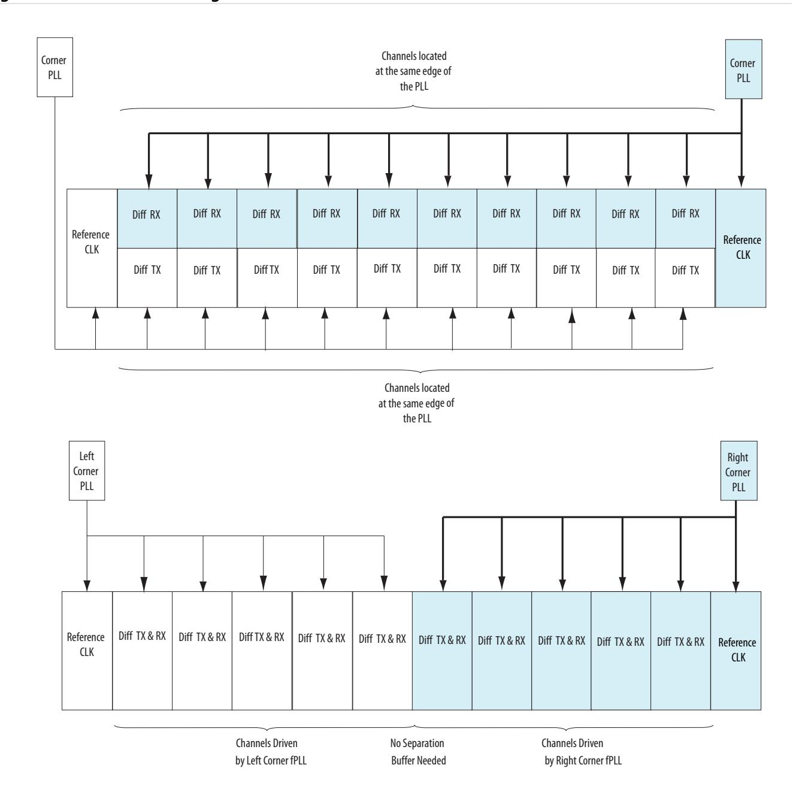

**Figure 5-3: Invalid Placement of Differential I/Os Due to Interleaving of Channels Driven by the Corner PLLs**

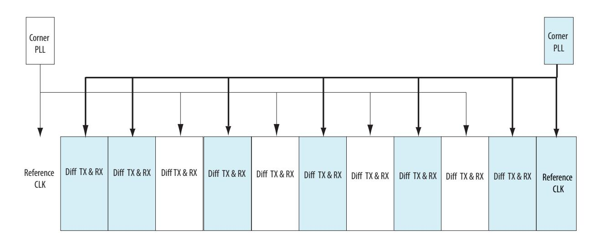

[Clock Networks and PLLs in Cyclone V Devices](#page-60-0) on page 4-1

#### **LVDS Interface with External PLL Mode**

The IP Catalog provides an option for implementing the LVDS interface with the Use External PLL option. With this option enabled you can control the PLL settings, such as dynamically reconfiguring the PLL to support different data rates, dynamic phase shift, and other settings. You must also instantiate the an Altera\_PLL IP core to generate the various clock and load enable signals.

If you enable the Use External PLL option with the ALTLVDS transmitter and receiver, the following signals are required from the Altera\_PLL IP core:

- Serial clock input to the SERDES of the ALTLVDS transmitter and receiver
- Load enable to the SERDES of the ALTLVDS transmitter and receiver
- Parallel clock used to clock the transmitter FPGA fabric logic and parallel clock used for the receiver rx\_syncclock port and receiver FPGA fabric logic
- Asynchronous PLL reset port of the ALTLVDS receiver

#### **Altera\_PLL Signal Interface with ALTLVDS IP Core**

**Table 5-12: Signal Interface Between Altera\_PLL and ALTLVDS IP Cores**

This table lists the signal interface between the output ports of the Altera\_PLL IP core and the input ports of the ALTLVDS transmitter and receiver. As an example, the table lists the serial clock output, load enable output, and parallel clock output generated on ports outclk0, outclk1, and outclk2, along with the locked signal of the Altera\_PLL instance. You can choose any of the PLL output clock ports to generate the interface clocks.

| From the Altera_PLL IP Core                                                                                                                                             | To the ALTLVDS Transmitter                                               | To the ALTLVDS Receiver                                                                                                                                                                                                                           |
| ----------------------------------------------------------------------------------------------------------------------------------------------------------------------- | ------------------------------------------------------------------------ | ------------------------------------------------------------------------------------------------------------------------------------------------------------------------------------------------------------------------------------------------- |
| Serial clock output (outclk0)                                                                                                                                           | tx_inclock (serial clock input to the transmitter)                       | rx_inclock (serial clock input)                                                                                                                                                                                                                   |
| The serial clock output (outclk0) can only drive tx_inclock on the ALTLVDS transmitter, and rx_inclock on the ALTLVDS receiver. This clock cannot drive the core logic. |                                                                          |                                                                                                                                                                                                                                                   |
| Load enable output (outclk1)                                                                                                                                            | tx_enable (load enable to the transmitter)                               | rx_enable (load enable for the deserializer)                                                                                                                                                                                                      |
| Parallel clock output (outclk2)                                                                                                                                         | Parallel clock used inside the transmitter core logic in the FPGA fabric | Parallel clock used inside the receiver core logic in the FPGA fabric                                                                                                                                                                             |
| ~(locked)                                                                                                                                                               | —                                                                        | pll_areset (asynchronous PLL reset port)  The pll_areset signal is automatically enabled for the LVDS receiver in external PLL mode. This signal does not exist for LVDS transmitter instantiation when the external PLL option is enabled. |

Note: With soft SERDES, a different clocking requirement is needed.

#### Related Information

#### LVDS SERDES Transmitter/Receiver IP Cores User Guide

More information about the different clocking requirement for soft SERDES.

#### **Altera\_PLL Parameter Values for External PLL Mode**

The following example shows the clocking requirements to generate output clocks for ALTLVDS\_TX and ALTLVDS\_RX using the Altera\_PLL IP core. The example sets the phase shift with the assumption that the clock and data are edge aligned at the pins of the device.

Note: For other clock and data phase relationships, Altera recommends that you first instantiate your ALTLVDS\_RX and ALTLVDS\_TX interface without using the external PLL mode option. Compile the IP cores in the Intel Quartus Prime software and take note of the frequency, phase shift, and duty cycle settings for each clock output. Enter these settings in the Altera\_PLL IP core parameter editor and then connect the appropriate output to the ALTLVDS\_RX and ALTLVDS\_TX IP cores.

#### **Table 5-13: Example: Generating Output Clocks Using an Altera\_PLL IP Core**

This table lists the parameter values that you can set in the Altera\_PLL parameter editor to generate three output clocks using an Altera\_PLL IP core if you are not using DPA and soft-CDR mode.

| Parameter   | outclk0                                                                               | outclk1                                                                             | outclk2                                                                                    |
| ----------- | ------------------------------------------------------------------------------------- | ----------------------------------------------------------------------------------- | ------------------------------------------------------------------------------------------ |
|             | (Connects to the tx_inclock port of ALTLVDS_TX and the rx_inclock port of ALTLVDS_RX) | (Connects to the tx_enable port of ALTLVDS_TX and the rx_enable port of ALTLVDS_RX) | (Used as the core clock for the parallel data registers for both transmitter and receiver) |
| Frequency   | data rate                                                                             | data rate/serialization factor                                                      | data rate/serialization factor                                                             |
| Phase shift | -180°                                                                                 | [(deserialization factor - 2)/deserialization factor] x 360°                        | -180/serialization factor (outclk0 phase shift divided by the serialization factor)     |
| Duty cycle  | 50%                                                                                   | 100/serialization factor                                                            | 50%                                                                                        |

**Figure 5-4: Phase Relationship for External PLL Interface Signals**

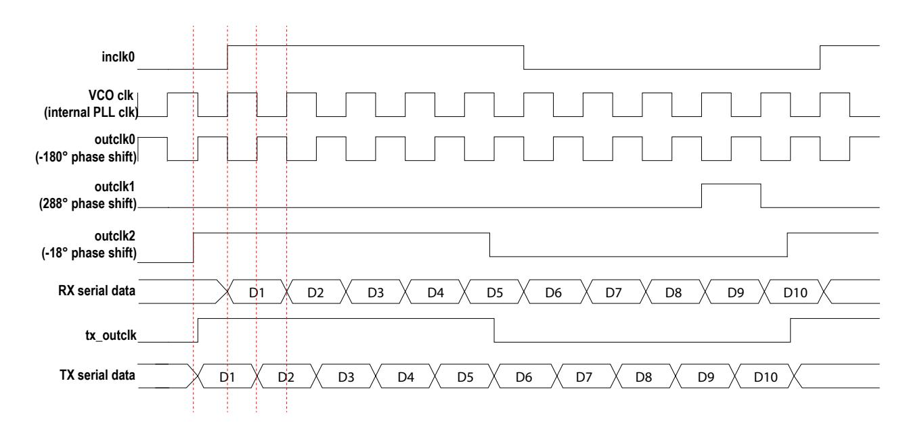

#### **Connection between Altera\_PLL and ALTLVDS**

#### **Figure 5-5: LVDS Interface with the Altera\_PLL IP Core**

This figure shows the connections between the Altera\_PLL and ALTLVDS IP core.

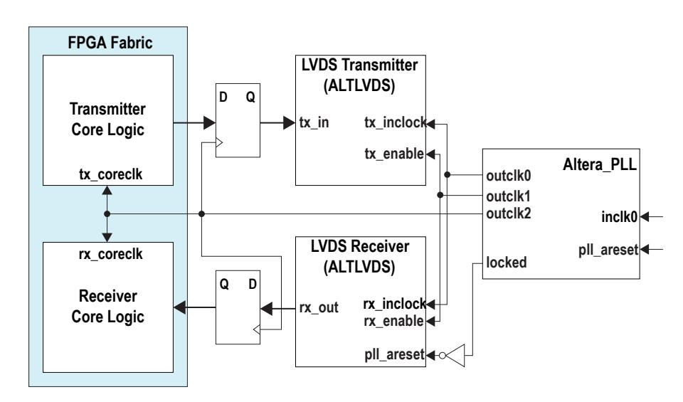

When generating the Altera\_PLL IP core, the Left/Right PLL option is configured to set up the PLL in LVDS mode. Instantiation of pll\_areset is optional.

The rx\_enable and rx\_inclock input ports are not used and can be left unconnected.

## **Guideline: Use the Same VCCPD for All I/O Banks in a Group**

In the Cyclone V devices, all I/O banks have individual VCCPD with the following exceptions:

- Cyclone V E, GX and GT devices:
  - Banks 1A (if available) and 2A share the same VCCPD.
  - Banks 3B and 4A share the same VCCPD.
  - Banks 7A and 8A share the same VCCPD.
- Cyclone V SE, SX and ST devices:
  - Banks 1A (if available) and 2A share the same VCCPD.
  - Banks 3B and 4A share the same VCCPD.
  - Banks 6A and 6B share the same VCCPD.

Examples of sharing the same VCCPD:

- If bank 3B uses a 3.0 V VCCPD, bank 4A must also use 3.0 V VCCPD.
- If bank 8A uses a 2.5 V VCCPD, bank 7A must also use 2.5 V VCCPD.

For more information about the I/O banks available in each device package, refer to the related links.

#### Related Information

- [Modular I/O Banks for Cyclone V E Devices](#page-130-0) on page 5-24
- [Modular I/O Banks for Cyclone V GX Devices](#page-131-0) on page 5-25

- • [Modular I/O Banks for Cyclone V GT Devices](#page-132-0) on page 5-26
- [Modular I/O Banks for Cyclone V SE Devices](#page-133-0) on page 5-27
- [Modular I/O Banks for Cyclone V SX Devices](#page-133-0) on page 5-27
- [Modular I/O Banks for Cyclone V ST Devices](#page-134-0) on page 5-28

# **Guideline: Ensure Compatible VCCIO and VCCPD Voltage in the Same Bank**

When planning I/O bank usage for Cyclone V devices, you must ensure the VCCIO voltage is compatible with the VCCPD voltage of the same bank. Some banks may share the same VCCPD power pin. This limits the possible VCCIO voltages that can be used on banks that share VCCPD power pins.

Examples:

- VCCPD3B is connected to 2.5 V—VCCIO pins for banks 3B and 4A can be connected 1.2 V, 1.25 V, 1.35 V, 1.5 V, 1.8 V, or 2.5 V.
- VCCPD3B is connected to 3.0 V—VCCIO pins for banks 3B and 4A must be connected to 3.0 V.

#### **Guideline: VREF Pin Restrictions**

For the Cyclone V devices, consider the following VREF pins guidelines:

- You cannot assign shared VREF pins as LVDS or external memory interface pins.
- SSTL, HSTL, and HSUL I/O standards do not support shared VREF pins. For example, if a particular B1p or B1n pin is a shared VREF pin, the corresponding B1p/B1n pin pair do not have LVDS transmitter support.
- You must perform signal integrity analysis using your board design when using a shared VREF pin to determine the FMAX for your system.

For more information about pin capacitance of the VREF pins, refer to the device datasheet.

#### Related Information

#### [Cyclone V Device Datasheet](https://documentation.altera.com/#/link/mcn1422497163812/mcn1422497300420/en-us)

#### **Guideline: Observe Device Absolute Maximum Rating for 3.3 V Interfacing**

To ensure device reliability and proper operation when you use the device for 3.3 V I/O interfacing, do not violate the absolute maximum ratings of the device. For more information about absolute maximum rating and maximum allowed overshoot during transitions, refer to the device datasheet.

Tip: Perform IBIS or SPICE simulations to make sure the overshoot and undershoot voltages are within the specifications.

#### **Transmitter Application**

If you use the Cyclone V device as a transmitter, use slow slew rate and series termination to limit the overshoot and undershoot at the I/O pins. Transmission line effects that cause large voltage deviations at the receiver are associated with an impedance mismatch between the driver and the transmission lines. By matching the impedance of the driver to the characteristic impedance of the transmission line, you can significantly reduce overshoot voltage. You can use a series termination resistor placed physically close to the driver to match the total driver impedance to the transmission line impedance.

#### **Receiver Application**

If you use the Cyclone V device as a receiver, use the on-chip clamping diode to limit the overshoot and undershoot voltage at the I/O pins.

#### Related Information

#### [Cyclone V Device Datasheet](https://documentation.altera.com/#/link/mcn1422497163812/mcn1422497300420/en-us)

#### **Guideline: Adhere to the LVDS I/O Restrictions and Differential Pad Placement Rules**

For Cyclone V LVDS applications, adhere to these guidelines to avoid adverse impact on LVDS perform‐ ance:

- I/O restrictions guideline—to avoid excessive jitter on the LVDS transmitter output pins.
- Differential pad placement rule for each device—to avoid crosstalk effects.

#### Related Information

- [Cyclone V Device Family Pin Connection Guidelines](https://www.intel.com/content/dam/www/programmable/us/en/pdfs/literature/dp/cyclone-v/pcg-01014.pdf) Describes the I/O restriction guidelines for the Cyclone V LVDS transmitters.
- [Cyclone V Differential Pad Placement Rule and Pad Mapping Files](http://www.altera.com/literature/dp/cyclone-v/differential_pad_placement_mapping_files.zip) Provides the pad mapping spreadsheets for Cyclone V devices.

#### **Guideline: Pin Placement for General Purpose High-Speed Signals**

For general purpose high-speed signals faster than 200 MHz, follow these guidelines to ensure I/O timing closure.

- Avoid using HMC DQ pins as the input pin.
- Avoid using HMC DQ and command pins as the output pin.

I/O signals that use the hard memory controller pins are routed through the HMCPHY\_RE routing elements. These routing elements have a higher routing delay compared to other I/O pins. To identify the hard memory controller pins for your Cyclone V device and package, refer to the relevant pin-out files.

#### Related Information

#### [Cyclone V Device Pin-Out Files](https://www.intel.com/content/www/us/en/programmable/support/literature/lit-dp.html#cyclone-v)

Provides the pin-out files for each Cyclone V device package.

# **I/O Banks Locations in Cyclone V Devices**

The number of Cyclone V I/O banks in a particular device depends on the device density.

Note: The availability of I/O banks in device packages varies. For more details, refer to the related links.

**Figure 5-6: I/0 Banks for Cyclone V E Devices**

|     |     | <b>Bank 8A</b> |                | <b>Bank 7A</b> |                |
| --- | --- | -------------- | -------------- | -------------- | -------------- |
|     |     |                |                |                | <b>Bank 1A</b> |
|     |     |                |                |                | <b>Bank 6A</b> |
|     |     |                |                |                |                |
|     |     |                |                |                | <b>Bank 5B</b> |
|     |     |                |                |                | <b>Bank 5A</b> |
|     |     |                |                |                |                |
|     |     | <b>Bank 3A</b> | <b>Bank 3B</b> | <b>Bank 4A</b> |                |

**Figure 5-7: I/0 Banks for Cyclone V GX and GT Devices**

|                          | <b>Bank 8A</b> | <b>Bank 7A</b> |                |                |
| ------------------------ | -------------- | -------------- | -------------- | -------------- |
| <b>Transceiver Block</b> |                |                |                | <b>Bank 6A</b> |
|                          |                |                |                | <b>Bank 5B</b> |
|                          |                |                |                | <b>Bank 5A</b> |
|                          | <b>Bank 3A</b> | <b>Bank 3B</b> | <b>Bank 4A</b> |                |

**Figure 5-8: I/0 Banks for Cyclone V SE Devices**

| <b>Bank 8A</b> |                | <b>HPS Column I/O</b> |     |                    |
| -------------- | -------------- | --------------------- | --- | ------------------ |
|                |                | <b>HPS Core</b>       |     | <b>HPS Row I/O</b> |
|                |                |                       |     | <b>Bank 5B</b>     |
|                |                |                       |     | <b>Bank 5A</b>     |
| <b>Bank 3A</b> | <b>Bank 3B</b> | <b>Bank 4A</b>        |     |                    |

**Figure 5-9: I/0 Banks for Cyclone V SX and ST Devices**

| <b>Transceiver Block</b> | <b>Bank 8A</b> |                | <b>HPS Column I/O</b> |                    |                    |
| ------------------------ | -------------- | -------------- | --------------------- | ------------------ | ------------------ |
|                          |                |                | <b>HPS Core</b>       | <b>HPS Row I/O</b> |                    |
|                          |                |                |                       | <b>Bank 5B</b>     | <b>HPS Row I/O</b> |
|                          |                |                |                       | <b>Bank 5A</b>     | <b>Bank 5B</b>     |
| <b>Bank 4A</b>           |                |                |                       | <b>Bank 4A</b>     |                    |
| <b>Bank 3A</b>           | <b>Bank 3B</b> | <b>Bank 4A</b> |                       |                    |                    |

- [Modular I/O Banks for Cyclone V E Devices](#page-130-0) on page 5-24
- [Modular I/O Banks for Cyclone V GX Devices](#page-131-0) on page 5-25
- [Modular I/O Banks for Cyclone V GT Devices](#page-132-0) on page 5-26
- [Modular I/O Banks for Cyclone V SE Devices](#page-133-0) on page 5-27
- [Modular I/O Banks for Cyclone V SX Devices](#page-133-0) on page 5-27
- [Modular I/O Banks for Cyclone V ST Devices](#page-134-0) on page 5-28

## **I/O Banks Groups in Cyclone V Devices**

The I/O pins in Cyclone V devices are arranged in groups called modular I/O banks:

- Modular I/O banks have independent power supplies that allow each bank to support different I/O standards.
- Each modular I/O bank can support multiple I/O standards that use the same VCCIO and VCCPD voltages.

#### **Modular I/O Banks for Cyclone V E Devices**

**Table 5-14: Modular I/O Banks for Cyclone V E A2 and A4 Devices**

| Member Code Package 1A | M383 16 | U324 — | A2 F256 — | U484 — | F484 — | M383 16 | U324 — | A4 F256 — | U484 — | F484 — |
| ---------------------- | ------- | ------ | --------- | ------ | ------ | ------- | ------ | --------- | ------ | ------ |
| 2A                     | 32      | 32     | 16        | 16     | 16     | 32      | 32     | 16        | 16     | 16     |
| 3A                     | 16      | 16     | 16        | 16     | 16     | 16      | 16     | 16        | 16     | 16     |
| 3B I/O                 | 21      | 16     | 16        | 32     | 32     | 21      | 16     | 16        | 32     | 32     |
| 4A Bank                | 38      | 32     | 16        | 48     | 48     | 38      | 32     | 16        | 48     | 48     |
| 5A                     | 16      | 16     | 16        | 16     | 16     | 16      | 16     | 16        | 16     | 16     |
| 5B                     | 16      | 16     | 16        | 16     | 16     | 16      | 16     | 16        | 16     | 16     |
| 7A                     | 38      | 32     | 16        | 48     | 48     | 38      | 32     | 16        | 48     | 48     |
| 8A                     | 30      | 16     | 16        | 32     | 32     | 30      | 16     | 16        | 32     | 32     |
| Total                  | 223     | 176    | 128       | 224    | 224    | 223     | 176    | 128       | 224    | 224    |

**Table 5-15: Modular I/O Banks for Cyclone V E A5, A7, and A9 Devices**

| Member Code Package | M383 | A5 U484 | F484 | M484 | U484 | A7 F484 | F672 | F896 | U484 | F484 | A9 F672 | F896 |
| ------------------- | ---- | ------- | ---- | ---- | ---- | ------- | ---- | ---- | ---- | ---- | ------- | ---- |
| 3A                  | 16   | 16      | 16   | 16   | 16   | 16      | 16   | 32   | 16   | 16   | 16      | 32   |
| 3B                  | 21   | 32      | 32   | 32   | 32   | 32      | 32   | 48   | 32   | 32   | 32      | 48   |
| 4A                  | 38   | 48      | 48   | 48   | 48   | 48      | 80   | 80   | 48   | 48   | 80      | 80   |
| 5A I/O Bank         | 16   | 16      | 16   | 16   | 16   | 16      | 16   | 32   | 16   | 16   | 16      | 32   |
| 5B                  | 14   | 32      | 16   | 16   | 48   | 16      | 64   | 48   | 48   | 16   | 32      | 48   |
| 6A                  | —    | —       | —    | 32   | —    | —       | 16   | 80   | —    | —    | 48      | 80   |
| 7A                  | 39   | 48      | 80   | 48   | 48   | 80      | 80   | 80   | 48   | 64   | 80      | 80   |
| 8A                  | 31   | 32      | 32   | 32   | 32   | 32      | 32   | 80   | 32   | 32   | 32      | 80   |
| Total               | 175  | 224     | 240  | 240  | 240  | 240     | 336  | 480  | 240  | 224  | 336     | 480  |

- • [I/O Banks Locations in Cyclone V Devices](#page-127-0) on page 5-21
- [Guideline: Use the Same VCCPD for All I/O Banks in a Group](#page-125-0) on page 5-19 Provides guidelines about VCCPD and I/O banks groups.

#### **Modular I/O Banks for Cyclone V GX Devices**

**Table 5-16: Modular I/O Banks for Cyclone V GX C3, C4, and C5 Devices**

| Member Code Package | U324 | C3 U484 | F484 | M301 | M383 | C4 U484 | F484 | F672 | M301 | M383 | C5 U484 | F484 | F672 |
| ------------------- | ---- | ------- | ---- | ---- | ---- | ------- | ---- | ---- | ---- | ---- | ------- | ---- | ---- |
| 3A                  | 16   | 16      | 16   | 16   | 16   | 16      | 16   | 16   | 16   | 16   | 16      | 16   | 16   |
| 3B                  | 16   | 32      | 32   | 18   | 21   | 32      | 32   | 32   | 18   | 21   | 32      | 32   | 32   |
| 4A                  | 32   | 48      | 48   | 22   | 38   | 48      | 48   | 80   | 22   | 38   | 48      | 48   | 80   |
| 5A I/O Bank         | 16   | 16      | 16   | 16   | 16   | 16      | 16   | 16   | 16   | 16   | 16      | 16   | 16   |
| 5B                  | 16   | 16      | 16   | 14   | 14   | 32      | 16   | 32   | 14   | 14   | 32      | 16   | 32   |
| 6A                  | —    | —       | —    | —    | —    | —       | —    | 48   | —    | —    | —       | —    | 48   |
| 7A                  | 32   | 48      | 48   | 23   | 39   | 48      | 80   | 80   | 23   | 39   | 48      | 80   | 80   |
| 8A                  | 16   | 32      | 32   | 20   | 31   | 32      | 32   | 32   | 20   | 31   | 32      | 32   | 32   |
| Total               | 144  | 208     | 208  | 129  | 175  | 224     | 240  | 336  | 129  | 175  | 224     | 240  | 336  |

**Table 5-17: Modular I/O Banks for Cyclone V GX C7 and C9 Devices**

| Member Code Package |     | M484 | U484 | C7 F484 | F672 | F896 | U484 | F484 | C9 F672 | F896 | F1152 |
| ------------------- | --- | ---- | ---- | ------- | ---- | ---- | ---- | ---- | ------- | ---- | ----- |
|                     | 3A  | 16   | 16   | 16      | 16   | 32   | 16   | 16   | 16      | 32   | 48    |
|                     | 3B  | 32   | 32   | 32      | 32   | 48   | 32   | 32   | 32      | 48   | 48    |
|                     | 4A  | 48   | 48   | 48      | 80   | 80   | 48   | 48   | 80      | 80   | 96    |
| I/O Bank            | 5A  | 16   | 16   | 16      | 16   | 32   | 16   | 16   | 16      | 32   | 48    |
|                     | 5B  | 16   | 48   | 16      | 32   | 48   | 48   | 16   | 32      | 48   | 48    |
|                     | 6A  | 32   | —    | —       | 48   | 80   | —    | —    | 48      | 80   | 80    |
|                     | 7A  | 48   | 48   | 80      | 80   | 80   | 48   | 64   | 80      | 80   | 96    |
|                     | 8A  | 32   | 32   | 32      | 32   | 80   | 32   | 32   | 32      | 80   | 96    |
| Total               |     | 240  | 240  | 240     | 336  | 480  | 240  | 224  | 336     | 480  | 560   |

#### Related Information

- [I/O Banks Locations in Cyclone V Devices](#page-127-0) on page 5-21

- [Guideline: Use the Same VCCPD for All I/O Banks in a Group](#page-125-0) on page 5-19 Provides guidelines about VCCPD and I/O banks groups.

#### **Modular I/O Banks for Cyclone V GT Devices**

**Table 5-18: Modular I/O Banks for Cyclone V GT D5 and D7 Devices**

| Member Code Package |     | M301 | M383 | D5 U484 | F484 | F672 | M484 | U484 | D7 F484 | F672 | F896 |
| ------------------- | --- | ---- | ---- | ------- | ---- | ---- | ---- | ---- | ------- | ---- | ---- |
|                     | 3A  | 16   | 16   | 16      | 16   | 16   | 16   | 16   | 16      | 16   | 32   |
|                     | 3B  | 18   | 21   | 32      | 32   | 32   | 32   | 32   | 32      | 32   | 48   |
|                     | 4A  | 22   | 38   | 48      | 48   | 80   | 48   | 48   | 48      | 80   | 80   |
| I/O Bank            | 5A  | 16   | 16   | 16      | 16   | 16   | 16   | 16   | 16      | 16   | 32   |
|                     | 5B  | 14   | 14   | 32      | 16   | 64   | 16   | 48   | 16      | 64   | 48   |
|                     | 6A  | —    | —    | —       | —    | 16   | 32   | —    | —       | 16   | 80   |
|                     | 7A  | 23   | 39   | 48      | 80   | 80   | 48   | 48   | 80      | 80   | 80   |
|                     | 8A  | 20   | 31   | 32      | 32   | 32   | 32   | 32   | 32      | 32   | 80   |
| Total               |     | 129  | 175  | 224     | 240  | 336  | 240  | 240  | 240     | 336  | 480  |

**Table 5-19: Modular I/O Banks for Cyclone V GT D9 Devices**

| Member Code Package |     | U484 | F484 | D9 F672 | F896 | F1152 |
| ------------------- | --- | ---- | ---- | ------- | ---- | ----- |
|                     | 3A  | 16   | 16   | 16      | 32   | 48    |
|                     | 3B  | 32   | 32   | 32      | 48   | 48    |
|                     | 4A  | 48   | 48   | 80      | 80   | 96    |
| I/O Bank            | 5A  | 16   | 16   | 16      | 32   | 48    |
|                     | 5B  | 48   | 16   | 32      | 48   | 48    |
|                     | 6A  | —    | —    | 48      | 80   | 80    |
|                     | 7A  | 48   | 64   | 80      | 80   | 96    |
|                     | 8A  | 32   | 32   | 32      | 80   | 96    |
| Total               |     | 240  | 224  | 336     | 480  | 560   |

#### Related Information

- [I/O Banks Locations in Cyclone V Devices](#page-127-0) on page 5-21
- [Guideline: Use the Same VCCPD for All I/O Banks in a Group](#page-125-0) on page 5-19 Provides guidelines about VCCPD and I/O banks groups.

#### **Modular I/O Banks for Cyclone V SE Devices**

**Table 5-20: Modular I/O Banks for Cyclone V SE Devices**

Note: The HPS row and column I/O counts are the number of HPS-specific I/O pins on the device. Each HPS-specific pin may be mapped to several HPS I/Os.

| Member Code Package |     | A2 U484 | U672 | A4 U484 | U672 | U484 | A5 U672 | F896 | U484 | A6 U672 | F896 |
| ------------------- | --- | ------- | ---- | ------- | ---- | ---- | ------- | ---- | ---- | ------- | ---- |
|                     | 3A  | 16      | 16   | 16      | 16   | 16   | 16      | 32   | 16   | 16      | 32   |
| FPGA                | 3B  | 6       | 32   | 6       | 32   | 6    | 32      | 48   | 6    | 32      | 48   |
| I/O Bank            | 4A  | 22      | 68   | 22      | 68   | 22   | 68      | 80   | 22   | 68      | 80   |
|                     | 5A  | 16      | 16   | 16      | 16   | 16   | 16      | 32   | 16   | 16      | 32   |
|                     | 5B  | —       | —    | —       | —    | —    | 7       | 16   | —    | 7       | 16   |
| HPS Row I/          | 6A  | 52      | 56   | 52      | 56   | 52   | 56      | 56   | 52   | 56      | 56   |
| O Bank              | 6B  | 23      | 44   | 23      | 44   | 23   | 44      | 44   | 23   | 44      | 44   |
| HPS                 | 7A  | 19      | 19   | 19      | 19   | 19   | 19      | 19   | 19   | 19      | 19   |
| Column I/O          | 7B  | 21      | 22   | 21      | 22   | 21   | 22      | 22   | 21   | 22      | 22   |
| Bank                | 7C  | 8       | 12   | 8       | 12   | 8    | 12      | 12   | 8    | 12      | 12   |
|                     | 7D  | 14      | 14   | 14      | 14   | 14   | 14      | 14   | 14   | 14      | 14   |
| FPGA I/O Bank       | 8A  | 6       | 13   | 6       | 13   | 6    | 6       | 80   | 6    | 6       | 80   |
| Total               |     | 203     | 312  | 203     | 312  | 203  | 312     | 455  | 203  | 312     | 455  |

#### Related Information

- [I/O Banks Locations in Cyclone V Devices](#page-127-0) on page 5-21
- [Guideline: Use the Same VCCPD for All I/O Banks in a Group](#page-125-0) on page 5-19 Provides guidelines about VCCPD and I/O banks groups.

#### **Modular I/O Banks for Cyclone V SX Devices**

**Table 5-21: Modular I/O Banks for Cyclone V SX Devices**

Note: The HPS row and column I/O counts are the number of HPS-specific I/O pins on the device. Each HPS-specific pin may be mapped to several HPS I/Os.

| Member Code Package |     | C2 U672 | C4 U672 | C5 U672 | F896 | U672 | C6 F896 |
| ------------------- | --- | ------- | ------- | ------- | ---- | ---- | ------- |
|                     | 3A  | 16      | 16      | 16      | 32   | 16   | 32      |
| FPGA I/O            | 3B  | 32      | 32      | 32      | 48   | 32   | 48      |
| Bank                | 4A  | 68      | 68      | 68      | 80   | 68   | 80      |
|                     | 5A  | 16      | 16      | 16      | 32   | 16   | 32      |
|                     | 5B  | —       | —       | —       | 16   | —    | 16      |
| HPS Row I/ O Bank   | 6A  | 56      | 56      | 56      | 56   | 56   | 56      |
|                     | 6B  | 44      | 44      | 44      | 44   | 44   | 44      |
| HPS                 | 7A  | 19      | 19      | 19      | 19   | 19   | 19      |
| Column I/O          | 7B  | 22      | 22      | 22      | 22   | 22   | 22      |
| Bank                | 7C  | 12      | 12      | 12      | 12   | 12   | 12      |
|                     | 7D  | 14      | 14      | 14      | 14   | 14   | 14      |
| FPGA I/O Bank       | 8A  | 13      | 13      | 13      | 80   | 13   | 80      |
| Total               |     | 312     | 312     | 312     | 455  | 312  | 455     |

- [I/O Banks Locations in Cyclone V Devices](#page-127-0) on page 5-21
- [Guideline: Use the Same VCCPD for All I/O Banks in a Group](#page-125-0) on page 5-19 Provides guidelines about VCCPD and I/O banks groups.

#### **Modular I/O Banks for Cyclone V ST Devices**

**Table 5-22: Modular I/O Banks for Cyclone V ST Devices**

Note: The HPS row and column I/O counts are the number of HPS-specific I/O pins on the device. Each HPS-specific pin may be mapped to several HPS I/Os.

| Member Code Package | D5 F896 | D6 F896 |
| ------------------- | ------- | ------- |
| 3A                  | 32      | 32      |
| 3B                  | 48      | 48      |
| 4A FPGA I/O Bank    | 80      | 80      |
| 5A                  | 32      | 32      |
| 5B                  | 16      | 16      |
| 6A HPS Row I/O Bank | 56      | 56      |
| 6B                  | 44      | 44      |

|                     | Member Code Package |     | D5 F896 | D6 F896 |
| ------------------- | ------------------- | --- | ------- | ------- |
|                     |                     | 7A  | 19      | 19      |
| HPS Column I/O Bank |                     | 7B  | 22      | 22      |
|                     |                     | 7C  | 12      | 12      |
|                     |                     | 7D  | 14      | 14      |
| FPGA I/O Bank       |                     | 8A  | 80      | 80      |
|                     | Total               |     | 455     | 455     |

- [I/O Banks Locations in Cyclone V Devices](#page-127-0) on page 5-21
- [Guideline: Use the Same VCCPD for All I/O Banks in a Group](#page-125-0) on page 5-19 Provides guidelines about VCCPD and I/O banks groups.

# **I/O Element Structure in Cyclone V Devices**

The I/O elements (IOEs) in Cyclone V devices contain a bidirectional I/O buffer and I/O registers to support a complete embedded bidirectional single data rate (SDR) or double data rate (DDR) transfer.

The IOEs are located in I/O blocks around the periphery of the Cyclone V device.

The Cyclone V SE, SX, and ST devices also have I/O elements for the HPS.

#### **I/O Buffer and Registers in Cyclone V Devices**

I/O registers are composed of the input path for handling data from the pin to the core, the output path for handling data from the core to the pin, and the output enable (OE) path for handling the OE signal to the output buffer. These registers allow faster source-synchronous register-to-register transfers and resynchro‐ nization.

**Table 5-23: Input and Output Paths in Cyclone V Devices**

This table summarizes the input and output path in the Cyclone V devices.

| Input Path                                                                                                                                                                                   | Output Path                                                                                                                |
| -------------------------------------------------------------------------------------------------------------------------------------------------------------------------------------------- | -------------------------------------------------------------------------------------------------------------------------- |
| 
Consists of:
 <ul> <li>DDR input registers</li> <li>Alignment and synchronization registers</li> <li>Half data rate blocks</li> </ul>                                                  | 
Consists of:
 <ul> <li>Output or OE registers</li> <li>Alignment registers</li> <li>Half data rate blocks</li> </ul> |
| 
You can bypass each block in the input path. The input path uses the deskew delay to adjust the input register clock delay across process, voltage, and temperature (PVT) variations.
 | 
You can bypass each block of the output and OE paths.
                                                               |

**Figure 5-10: IOE Structure for Cyclone V Devices**

This figure shows the Cyclone V FPGA IOE structure. In the figure, one dynamic on-chip termination (OCT) control is available for each DQ/DQS group.

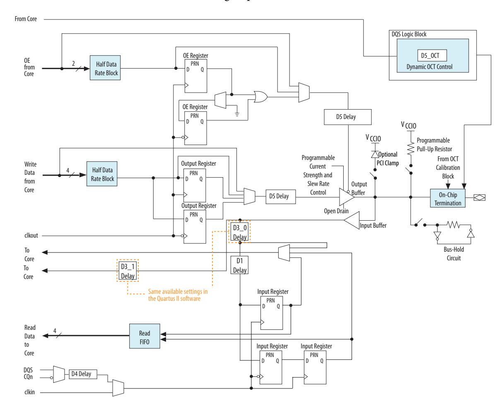

# Programmable IOE Features in Cyclone V Devices

**Table 5-24: Summary of Supported Cyclone V Programmable IOE Features and Settings**

| Feature                           | Setting                                                                           | Assignment Name     | Supported I/O Standards                                                                                                                                                                                                                                                                                                                                                                                  | Supported in HPS I/O (SoC Devices Only) |
| --------------------------------- | --------------------------------------------------------------------------------- | ------------------- | -------------------------------------------------------------------------------------------------------------------------------------------------------------------------------------------------------------------------------------------------------------------------------------------------------------------------------------------------------------------------------------------------------- | ------------------------------------------ |
| Slew Rate Control (12) | <ul> <li>0 (Slow)</li> <li>1 (Fast). Default is 1.</li> </ul>                     | Slew Rate           | <ul> <li>3.0/3.3V LVTTL</li> <li>1.2/1.5/1.8/2.5/3.0/3.3 LVCMOS</li> <li>SSTL-2/SSTL-18/SSTL-15</li> <li>1.8/1.5/1.2V HSTL</li> <li>3.0V PCI</li> <li>3.0V PCI-X</li> <li>Differential SSTL-2/Differential SSTL-18/Differential SSTL-15</li> <li>Differential 1.2/1.5/1.8V HSTL</li> </ul>                                                                                                               | Yes                                        |
| Programmable Output Buffer Delay  | <ul> <li>0 ps (Default)</li> <li>50 ps</li> <li>100 ps</li> <li>150 ps</li> </ul> | Output Buffer Delay | <ul> <li>3.0/3.3-V LVTTL</li> <li>1.2/1.5/1.8/2.5/3.0/3.3 LVCMOS</li> <li>SSTL-2, SSTL-18, SSTL-15, SSTL-135, SSTL-125</li> <li>1.8/1.5/1.2 V HSTL</li> <li>HSUL-12</li> <li>3.0V PCI</li> <li>3.0V PCI-X</li> <li>Differential SSTL-2/Diff-SSTL-18/Differential SSTL-15/Differential SSTL-135/Differential SSTL-125</li> <li>Differential 1.2/1.5/1.8V HSTL</li> <li>Differential 1.2-V HSUL</li> </ul> | —                                          |

(12) Disabled if you use the  $R_S$  OCT feature.

| Feature  | Setting Assignment Name Supported I/O Standards Supported in HPS |
| -------- | ---------------------------------------------------------------- |
| Output   | (13)                                                             |
|          | — 3.0/3.3V LVTTL                                                 |
| Bus-Hold | (14) On                                                          |
| Resistor | (15)                                                             |

(13) Open drain feature can be enabled using the OPNDRN primitive.

(14) Disabled if you use the weak pull-up resistor feature.

(15) Disabled if you use the bus-hold feature.

| Feature                                  | Setting                                                                           | Assignment Name                                | Supported I/O Standards                                                                          | Supported in HPS I/O  (SoC Devices Only) |
| ---------------------------------------- | --------------------------------------------------------------------------------- | ---------------------------------------------- | ------------------------------------------------------------------------------------------------ | ---------------------------------------------- |
| Differential Output Voltage              | <ul> <li>0 (low)</li> <li>1 (medium).</li> <li>2 (high). Default is 1.</li> </ul> | Programmable Differential Output Voltage (VOD) | <ul> <li>LVDS</li> <li>RSDS</li> <li>Mini-LVDS</li> </ul>                                        | —                                              |
| On-Chip Clamp Diode (16) (17) | <ul> <li>On</li> <li>Off (Default)</li> </ul>                                     | Clamping Diode                                 | <ul> <li>3.0/3.3V LVTTL</li> <li>3.0/3.3 LVCMOS</li> <li>3.0V PCI</li> <li>3.0V PCI-X</li> </ul> | Yes                                            |

Note: The on-chip clamp diode is available on all general purpose I/O (GPIO) pins in all Cyclone V device variants.

#### Related Information

- [Cyclone V Device Datasheet](https://documentation.altera.com/#/link/mcn1422497163812/mcn1422497300420/en-us)
- Programmable Current Strength on page 5-33
- [Programmable Output Slew Rate Control](#page-140-0) on page 5-34
- [Programmable IOE Delay](#page-141-0) on page 5-35
- [Programmable Output Buffer Delay](#page-141-0) on page 5-35
- [Programmable Pre-Emphasis](#page-141-0) on page 5-35
- [Programmable Differential Output Voltage](#page-142-0) on page 5-36

#### **Programmable Current Strength**

You can use the programmable current strength to mitigate the effects of high signal attenuation that is caused by a long transmission line or a legacy backplane.

**Table 5-25: Programmable Current Strength Settings for Cyclone V Devices**

The output buffer for each Cyclone V device I/O pin has a programmable current strength control for the I/O standards listed in this table.

| I/O Standard | I OH / I OL Current Strength Setting (mA) |                    |
| ------------ | ----------------------------------------- | ------------------ |
| 3.3 V LVTTL  | 16, 8, 4                                  | Yes (except 16 mA) |
| 3.3 V LVCMOS | 2                                         | Yes                |
| 3.0 V LVTTL  | 16, 12, 8, 4                              | Yes                |
| 3.0 V LVCMOS | 16, 12, 8, 4                              | Yes                |

(16) Recommended to turn on for 3.3 V I/O standards

(17) PCI clamp diode is enabled by default for 3.0 V PCI and 3.0 V PCI-X standards.

| I/O Standard        | I OH / I OL Current Strength Setting (mA) |     |
| ------------------- | ----------------------------------------- | --- |
| 2.5 V LVCMOS        | 16, 12, 8, 4                              | Yes |
| 1.8 V LVCMOS        | 12, 10, 8, 6, 4, 2                        | Yes |
| 1.5 V LVCMOS        | 12, 10, 8, 6, 4, 2                        | Yes |
| 1.2 V LVCMOS        | 8, 6, 4, 2                                | —   |
| SSTL-2 Class I      | 12, 10, 8                                 | —   |
| SSTL-2 Class II     | 16                                        | —   |
| SSTL-18 Class I     | 12, 10, 8, 6, 4                           | Yes |
| SSTL-18 Class II    | 16                                        | Yes |
| SSTL-15 Class I     | 12, 10, 8, 6, 4                           | Yes |
| SSTL-15 Class II    | 16                                        | Yes |
| 1.8 V HSTL Class I  | 12, 10, 8, 6, 4                           | —   |
| 1.8 V HSTL Class II | 16                                        | —   |
| 1.5 V HSTL Class I  | 12, 10, 8, 6, 4                           | Yes |
| 1.5 V HSTL Class II | 16                                        | Yes |
| 1.2 V HSTL Class I  | 12, 10, 8, 6, 4                           | —   |
| 1.2 V HSTL Class II | 16                                        | —   |

Note: Intel recommends that you perform IBIS or SPICE simulations to determine the best current strength setting for your specific application.

#### Related Information

[Programmable IOE Features in Cyclone V Devices](#page-137-0) on page 5-31

#### **Programmable Output Slew Rate Control**

Programmable output slew rate is available for single-ended I/O standards and emulated LVDS output standards.

The programmable output slew rate control in the output buffer of each regular- and dual-function I/O pin allows you to configure the following:

- Fast slew rate—provides high-speed transitions for high-performance systems.
- Slow slew rate—reduces system noise and crosstalk but adds a nominal delay to the rising and falling edges.

You can specify the slew rate on a pin-by-pin basis because each I/O pin contains a slew rate control.

Note: Altera recommends that you perform IBIS or SPICE simulations to determine the best slew rate setting for your specific application.

#### Related Information

[Programmable IOE Features in Cyclone V Devices](#page-137-0) on page 5-31

#### **Programmable IOE Delay**

You can activate the programmable IOE delays to ensure zero hold times, minimize setup times, or increase clock-to-output times. This feature helps read and write timing margins because it minimizes the uncertainties between signals in the bus.

Each pin can have a different input delay from pin-to-input register or a delay from output register-to-output pin values to ensure that the signals within a bus have the same delay going into or out of the device.

For more information about the programmable IOE delay specifications, refer to the device datasheet.

#### Related Information

- [Cyclone V Device Datasheet](https://documentation.altera.com/#/link/mcn1422497163812/mcn1422497300420/en-us)
- [Programmable IOE Features in Cyclone V Devices](#page-137-0) on page 5-31

#### **Programmable Output Buffer Delay**

The delay chains are built inside the single-ended output buffer. There are four levels of output buffer delay settings. By default, there is no delay.

The delay chains can independently control the rising and falling edge delays of the output buffer, allowing you to:

- Adjust the output-buffer duty cycle
- Compensate channel-to-channel skew
- Reduce simultaneous switching output (SSO) noise by deliberately introducing channel-to-channel skew
- Improve high-speed memory-interface timing margins

For more information about the programmable output buffer delay specifications, refer to the device datasheet.

#### Related Information

- [Cyclone V Device Datasheet](https://documentation.altera.com/#/link/mcn1422497163812/mcn1422497300420/en-us)
- [Programmable IOE Features in Cyclone V Devices](#page-137-0) on page 5-31

#### **Programmable Pre-Emphasis**

The VOD setting and the output impedance of the driver set the output current limit of a high-speed transmission signal. At a high frequency, the slew rate may not be fast enough to reach the full VOD level before the next edge, producing pattern-dependent jitter. With pre-emphasis, the output current is boosted momentarily during switching to increase the output slew rate.

Pre-emphasis increases the amplitude of the high-frequency component of the output signal, and thus helps to compensate for the frequency-dependent attenuation along the transmission line. The overshoot introduced by the extra current happens only during a change of state switching to increase the output slew rate and does not ring, unlike the overshoot caused by signal reflection. The amount of pre-emphasis required depends on the attenuation of the high-frequency component along the transmission line.

**Figure 5-11: Programmable Pre-Emphasis**

This figure shows the LVDS output with pre-emphasis.

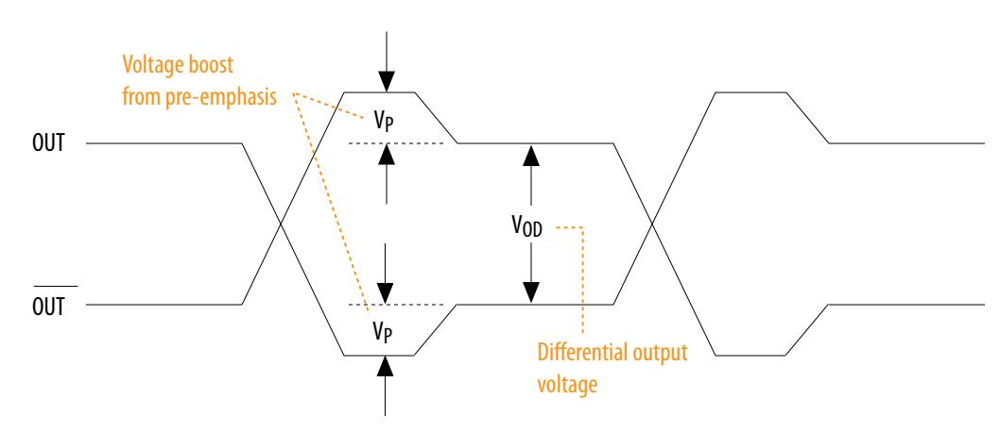

**Table 5-26: Intel Quartus Prime Software Assignment Editor—Programmable Pre-Emphasis**

This table lists the assignment name for programmable pre-emphasis and its possible values in the Intel Quartus Prime software Assignment Editor.

| Field           | Assignment                               |
| --------------- | ---------------------------------------- |
| To              | tx_out                                   |
| Assignment name | Programmable Pre-emphasis                |
| Allowed values  | 0 (disabled), 1 (enabled). Default is 1. |

#### Related Information

[Programmable IOE Features in Cyclone V Devices](#page-137-0) on page 5-31

#### **Programmable Differential Output Voltage**

The programmable VOD settings allow you to adjust the output eye opening to optimize the trace length and power consumption. A higher VOD swing improves voltage margins at the receiver end, and a smaller VOD swing reduces power consumption. You can statically adjust the VOD of the differential signal by changing the VOD settings in the Intel Quartus Prime software Assignment Editor.

**Figure 5-12: Differential VOD**

This figure shows the VOD of the differential LVDS output.

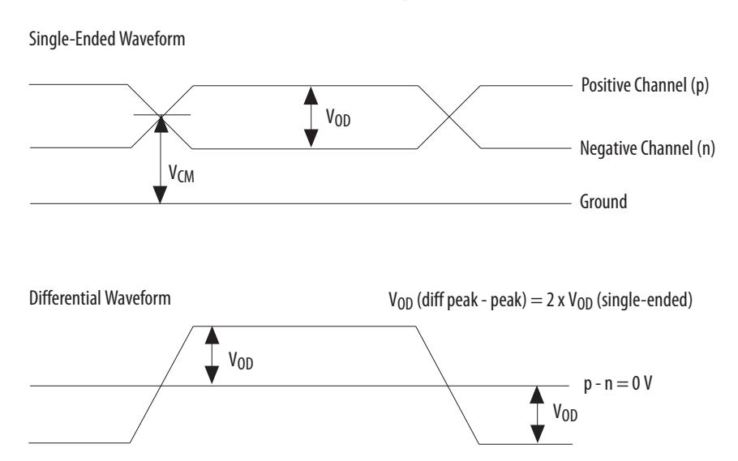

**Table 5-27: Intel Quartus Prime Software Assignment Editor—Programmable VOD**

This table lists the assignment name for programmable VOD and its possible values in the Intel Quartus Prime software Assignment Editor.

| Field           | Assignment                                       |
| --------------- | ------------------------------------------------ |
| To              | tx_out                                           |
| Assignment name | Programmable Differential Output Voltage (V OD ) |
| Allowed values  | 00 (low), 01 (medium), 10 (high). Default is 01. |

#### Related Information

[Programmable IOE Features in Cyclone V Devices](#page-137-0) on page 5-31

#### **Open-Drain Output**

The optional open-drain output for each I/O pin is equivalent to an open collector output. If it is configured as an open drain, the logic value of the output is either high-Z or logic low.

You can attach several open-drain output to a wire. This connection type is like a logical OR function and is commonly called an active-low wired-OR circuit. If at least one of the outputs is in logic 0 state (active), the circuit sinks the current and brings the line to low voltage.

You can use open-drain output if you are connecting multiple devices to a bus. For example, you can use the open-drain output for system-level control signals that can be asserted by any device or as an interrupt.

You can enable the open-drain output assignment using one these methods:

- Design the tristate buffer using OPNDRN primitive.
- Turn on the Auto Open-Drain Pins option in the Intel Quartus Prime software.

Although you can design open-drain output without enabling the option assignment, you will not be using the open-drain output feature of the I/O buffer. The open-drain output feature in the I/O buffer provides you the best propagation delay from OE to output.

#### **Bus-Hold Circuitry**

Each I/O pin provides an optional bus-hold feature that is active only after configuration. When the device enters user mode, the bus-hold circuit captures the value that is present on the pin by the end of the configuration.

The bus-hold circuitry uses a resistor with a nominal resistance (RBH), approximately 7 kΩ, to weakly pull the signal level to the last-driven state of the pin. The bus-hold circuitry holds this pin state until the next input signal is present. Because of this, you do not require an external pull-up or pull-down resistor to hold a signal level when the bus is tri-stated.

For each I/O pin, you can individually specify that the bus-hold circuitry pulls non-driven pins away from the input threshold voltage—where noise can cause unintended high-frequency switching. To prevent over-driving signals, the bus-hold circuitry drives the voltage level of the I/O pin lower than the VCCIO level.

If you enable the bus-hold feature, you cannot use the programmable pull-up option. To configure the I/O pin for differential signals, disable the bus-hold feature.

#### **Pull-up Resistor**

Each I/O pin provides an optional programmable pull-up resistor during user mode. The pull-up resistor weakly holds the I/O to the VCCIO level. If you enable this option, you cannot use the bus-hold feature.

The Cyclone V device supports programmable weak pull-up resistors only on user I/O pins.

For dedicated configuration pins, dedicated clock pins, or JTAG pins with internal pull-up resistors, these resistor values are not programmable. You can find more information related to the internal pull-up values for dedicated configuration pins, dedicated clock pins, or JTAG pins in the Cyclone V Pin Connection Guidelines.

# **On-Chip I/O Termination in Cyclone V Devices**

Dynamic RS and RT OCT provides I/O impedance matching and termination capabilities. OCT maintains signal quality, saves board space, and reduces external component costs.

The Cyclone V devices support OCT in all FPGA I/O banks. For the HPS I/Os, the column I/Os do not support OCT with calibration.

**Table 5-28: OCT Schemes Supported in Cyclone V Devices**

| Direction | OCT Schemes          | Supported in HPS Row I/Os |
| --------- | -------------------- | ------------------------- |
|           | R S                  |                           |
|           | OCT with calibration | Yes                       |
|           | R S                  |                           |

| Direction     | OCT Schemes              | Supported in HPS Row I/Os |
| ------------- | ------------------------ | ------------------------- |
|               | R T OCT with calibration | Yes                       |
|               | R D OCT (LVDS, mini      |                           |
| Bidirectional | Dynamic R                | S                         |
|               |                          | OCT and R T               |

- RS OCT without Calibration in Cyclone V Devices on page 5-39
- [RS OCT with Calibration in Cyclone V Devices](#page-147-0) on page 5-41
- [RT OCT with Calibration in Cyclone V Devices](#page-149-0) on page 5-43
- [LVDS Input RD OCT in Cyclone V Devices](#page-152-0) on page 5-46
- [Dynamic OCT in Cyclone V Devices](#page-151-0) on page 5-45

#### **RS OCT without Calibration in Cyclone V Devices**

The Cyclone V devices support RS OCT for single-ended and voltage-referenced I/O standards. RS OCT without calibration is supported on output only.

**Table 5-29: Selectable I/O Standards for RS OCT Without Calibration**

This table lists the output termination settings for uncalibrated OCT on different I/O standards.

| I/O Standard             | Uncalibrated OCT (Output) |
| ------------------------ | ------------------------- |
|                          | R S                       |
| 3.0 V LVTTL/3.0 V LVCMOS | 25/50                     |
| 2.5 V LVCMOS             | 25/50                     |
| 1.8 V LVCMOS             | 25/50                     |
| 1.5 V LVCMOS             | 25/50                     |
| 1.2 V LVCMOS             | 25/50                     |
| SSTL-2 Class I           | 50                        |
| SSTL-2 Class II          | 25                        |
| SSTL-18 Class I          | 50                        |
| SSTL-18 Class II         | 25                        |
| SSTL-15 Class I          | 50                        |
| SSTL-15 Class II         | 25                        |
| 1.8 V HSTL Class I       | 50                        |
| 1.8 V HSTL Class II      | 25                        |
| 1.5 V HSTL Class I       | 50                        |

| I/O Standard                     | Uncalibrated OCT (Output) |
| -------------------------------- | ------------------------- |
|                                  | R S                       |
| 1.5 V HSTL Class II              | 25                        |
| 1.2 V HSTL Class I               | 50                        |
| 1.2 V HSTL Class II              | 25                        |
| Differential SSTL-2 Class I      | 50                        |
| Differential SSTL-2 Class II     | 25                        |
| Differential SSTL-18 Class I     | 50                        |
| Differential SSTL-18 Class II    | 25                        |
| Differential SSTL-15 Class I     | 50                        |
| Differential SSTL-15 Class II    | 25                        |
| Differential 1.8 V HSTL Class I  | 50                        |
| Differential 1.8 V HSTL Class II | 25                        |
| Differential 1.5 V HSTL Class I  | 50                        |
| Differential 1.5 V HSTL Class II | 25                        |
| Differential 1.2 V HSTL Class I  | 50                        |
| Differential 1.2 V HSTL Class II | 25                        |
| SSTL-15                          | 25, 50, 34, 40            |
| SSTL-135                         | 34, 40                    |
| SSTL-125                         | 34, 40                    |
| HSUL-12                          | 34, 40, 48, 60, 80        |
| Differential SSTL-15             | 25, 50, 34, 40            |
| Differential SSTL-135            | 34, 40                    |
| Differential SSTL-125            | 34, 40                    |
| Differential HSUL-12             | 34, 40, 48, 60, 80        |

Driver-impedance matching provides the I/O driver with controlled output impedance that closely matches the impedance of the transmission line. As a result, you can significantly reduce signal reflections on PCB traces.

If you select matching impedance, current strength is no longer selectable.

**Figure 5-13: RS OCT Without Calibration**

This figure shows the RS as the intrinsic impedance of the output transistors.

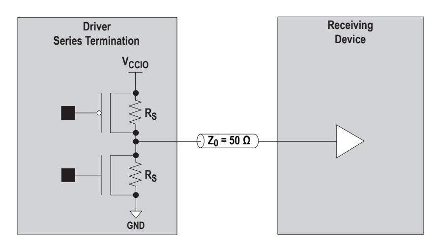

#### Related Information

[On-Chip I/O Termination in Cyclone V Devices](#page-144-0) on page 5-38

#### **RS OCT with Calibration in Cyclone V Devices**

The Cyclone V devices support RS OCT with calibration in all banks.

**Table 5-30: Selectable I/O Standards for RS OCT With Calibration**

This table lists the output termination settings for calibrated OCT on different I/O standards.

| I/O Standard 3.0 V LVTTL/3.0 V LVCMOS 2.5 V LVCMOS 1.8 V LVCMOS 1.5 V LVCMOS 1.2 V LVCMOS | R S (Ω) 25/50 25/50 25/50 25/50 25/50 | Calibrated OCT (Output) RZQ (Ω) 100 100 100 100 100 |
| ----------------------------------------------------------------------------------------- | ------------------------------------- | --------------------------------------------------- |
| SSTL-2 Class I                                                                            | 50                                    | 100                                                 |
| SSTL-2 Class II                                                                           | 25                                    | 100                                                 |
| SSTL-18 Class I                                                                           | 50                                    | 100                                                 |
| SSTL-18 Class II                                                                          | 25                                    | 100                                                 |
| SSTL-15 Class I                                                                           | 50                                    | 100                                                 |
| SSTL-15 Class II                                                                          | 25                                    | 100                                                 |
| 1.8 V HSTL Class I                                                                        | 50                                    | 100                                                 |
| 1.8 V HSTL Class II                                                                       | 25                                    | 100                                                 |

| I/O Standard                     | R S (Ω)            | Calibrated OCT (Output) RZQ (Ω) |
| -------------------------------- | ------------------ | ------------------------------- |
| 1.5 V HSTL Class I               | 50                 | 100                             |
| 1.5 V HSTL Class II              | 25                 | 100                             |
| 1.2 V HSTL Class I               | 50                 | 100                             |
| 1.2 V HSTL Class II              | 25                 | 100                             |
| Differential SSTL-2 Class I      | 50                 | 100                             |
| Differential SSTL-2 Class II     | 25                 | 100                             |
| Differential SSTL-18 Class I     | 50                 | 100                             |
| Differential SSTL-18 Class II    | 25                 | 100                             |
| Differential SSTL-15 Class I     | 50                 | 100                             |
| Differential SSTL-15 Class II    | 25                 | 100                             |
| Differential 1.8 V HSTL Class I  | 50                 | 100                             |
| Differential 1.8 V HSTL Class II | 25                 | 100                             |
| Differential 1.5 V HSTL Class I  | 50                 | 100                             |
| Differential 1.5 V HSTL Class II | 25                 | 100                             |
| Differential 1.2 V HSTL Class I  | 50                 | 100                             |
| Differential 1.2 V HSTL Class II | 25                 | 100                             |
| SSTL-15                          | 25, 50             | 100                             |
|                                  | 34, 40             | 240                             |
| SSTL-135                         | 34, 40             | 240                             |
| SSTL-125                         | 34, 40             | 240                             |
| HSUL-12                          | 34, 40, 48, 60, 80 | 240                             |
| Differential SSTL-15             | 25, 50             | 100                             |
|                                  | 34, 40             | 240                             |
| Differential SSTL-135            | 34, 40             | 240                             |
| Differential SSTL-125            | 34, 40             | 240                             |
| Differential HSUL-12             | 34, 40, 48, 60, 80 | 240                             |

The RS OCT calibration circuit compares the total impedance of the I/O buffer to the external reference resistor connected to the RZQ pin and dynamically enables or disables the transistors until they match.

Calibration occurs at the end of device configuration. When the calibration circuit finds the correct impedance, the circuit powers down and stops changing the characteristics of the drivers.

**Figure 5-14: RS OCT with Calibration**

This figure shows the RS as the intrinsic impedance of the output transistors.

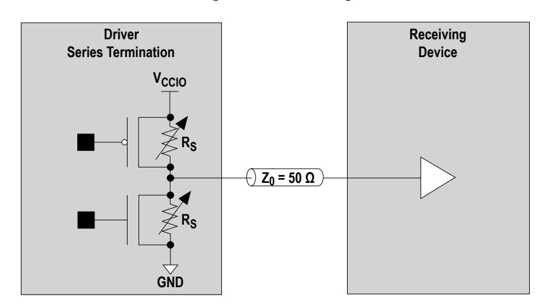

#### Related Information

[On-Chip I/O Termination in Cyclone V Devices](#page-144-0) on page 5-38

#### **RT OCT with Calibration in Cyclone V Devices**

The Cyclone V devices support RT OCT with calibration in all banks. RT OCT with calibration is available only for configuration of input and bidirectional pins. Output pin configurations do not support RT OCT with calibration. If you use RT OCT, the VCCIO of the bank must match the I/O standard of the pin where you enable the RT OCT.

**Table 5-31: Selectable I/O Standards for RT OCT With Calibration**

This table lists the input termination settings for calibrated OCT on different I/O standards.

| I/O Standard        | R T (Ω) | Calibrated OCT (Input) RZQ (Ω) |
| ------------------- | ------- | ------------------------------ |
| SSTL-2 Class I      | 50      | 100                            |
| SSTL-2 Class II     | 50      | 100                            |
| SSTL-18 Class I     | 50      | 100                            |
| SSTL-18 Class II    | 50      | 100                            |
| SSTL-15 Class I     | 50      | 100                            |
| SSTL-15 Class II    | 50      | 100                            |
| 1.8 V HSTL Class I  | 50      | 100                            |
| 1.8 V HSTL Class II | 50      | 100                            |
| 1.5 V HSTL Class I  | 50      | 100                            |
| 1.5 V HSTL Class II | 50      | 100                            |
| 1.2 V HSTL Class I  | 50      | 100                            |

| I/O Standard                     | R T (Ω)             | Calibrated OCT (Input) RZQ (Ω) |
| -------------------------------- | ------------------- | ------------------------------ |
| 1.2 V HSTL Class II              | 50                  | 100                            |
| Differential SSTL-2 Class I      | 50                  | 100                            |
| Differential SSTL-2 Class II     | 50                  | 100                            |
| Differential SSTL-18 Class I     | 50                  | 100                            |
| Differential SSTL-18 Class II    | 50                  | 100                            |
| Differential SSTL-15 Class I     | 50                  | 100                            |
| Differential SSTL-15 Class II    | 50                  | 100                            |
| Differential 1.8 V HSTL Class I  | 50                  | 100                            |
| Differential 1.8 V HSTL Class II | 50                  | 100                            |
| Differential 1.5 V HSTL Class I  | 50                  | 100                            |
| Differential 1.5 V HSTL Class II | 50                  | 100                            |
| Differential 1.2 V HSTL Class I  | 50                  | 100                            |
| Differential 1.2 V HSTL Class II | 50                  | 100                            |
| SSTL-15                          | 20, 30, 40, 60,120  | 240                            |
| SSTL-135                         | 20, 30, 40, 60, 120 | 240                            |
| SSTL-125                         | 20, 30, 40, 60, 120 | 240                            |
| Differential SSTL-15             | 20, 30, 40, 60,120  | 240                            |
| Differential SSTL-135            | 20, 30, 40, 60, 120 | 240                            |
| Differential SSTL-125            | 20, 30, 40, 60, 120 | 240                            |

The RT OCT calibration circuit compares the total impedance of the I/O buffer to the external resistor connected to the RZQ pin. The circuit dynamically enables or disables the transistors until the total impedance of the I/O buffer matches the external resistor.

Calibration occurs at the end of the device configuration. When the calibration circuit finds the correct impedance, the circuit powers down and stops changing the characteristics of the drivers.

**Figure 5-15: RT OCT with Calibration**

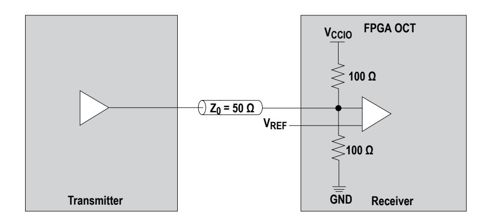

[On-Chip I/O Termination in Cyclone V Devices](#page-144-0) on page 5-38

#### **Dynamic OCT in Cyclone V Devices**

Dynamic OCT is useful for terminating a high-performance bidirectional path by optimizing the signal integrity depending on the direction of the data. Dynamic OCT also helps save power because device termination is internal—termination switches on only during input operation and thus draw less static power.

Note: If you use the SSTL-15, SSTL-135, and SSTL-125 I/O standards with external memory interfaces, Intel recommends that you use OCT with these I/O standards to save board space and cost. OCT reduces the number of external termination resistors used.

**Table 5-32: Dynamic OCT Based on Bidirectional I/O**

Dynamic RT OCT or RS OCT is enabled or disabled based on whether the bidirectional I/O acts as a receiver or driver.

| Dynamic OCT Bidirectional I/O | State    |
| ----------------------------- | -------- |
| Dynamic R T OCT               |          |
| Acts as a receiver            | Enabled  |
| Acts as a driver              | Disabled |
| Dynamic R S                   |          |
| Acts as a receiver            | Disabled |
| Acts as a driver              | Enabled  |

**Figure 5-16: Dynamic RT OCT in Cyclone V Devices**

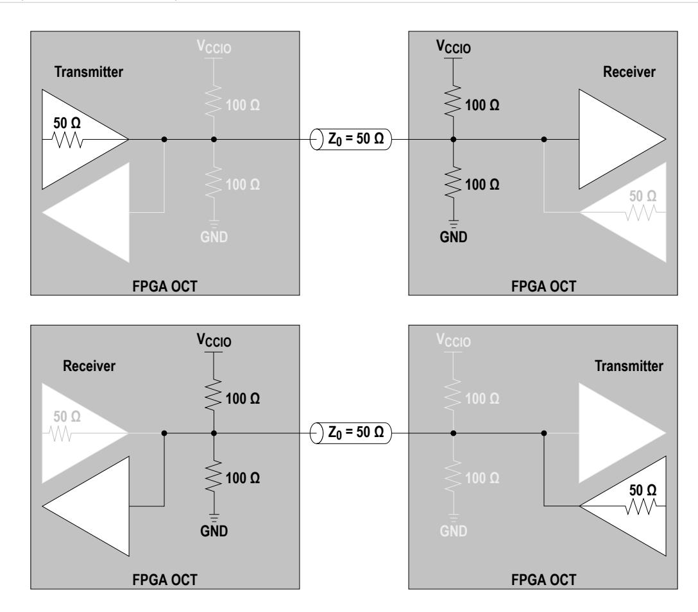

[On-Chip I/O Termination in Cyclone V Devices](#page-144-0) on page 5-38

#### **LVDS Input RD OCT in Cyclone V Devices**

The Cyclone V devices support RD OCT in all I/O banks.

You can only use RD OCT if you set the VCCPD to 2.5 V.

**Figure 5-17: Differential Input OCT**

The Cyclone V devices support OCT for differential LVDS and SLVS input buffers with a nominal resistance value of 100 Ω, as shown in this figure.

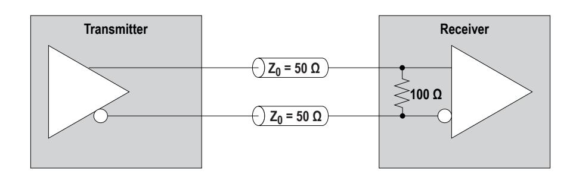

#### Related Information

[On-Chip I/O Termination in Cyclone V Devices](#page-144-0) on page 5-38

#### **OCT Calibration Block in Cyclone V Devices**

You can calibrate the OCT using any of the available four OCT calibration blocks for each device. Each calibration block contains one RZQ pin.

You can use RS and RT OCT in the same I/O bank for different I/O standards if the I/O standards use the same VCCIO supply voltage. You cannot configure the RS OCT and the programmable current strength for the same I/O buffer.

The OCT calibration process uses the RZQ pin that is available in every calibration block in a given I/O bank for series- and parallel-calibrated termination:

- Connect the RZQ pin to GND through an external 100 Ω or 240 Ω resistor (depending on the RS or RT OCT value).
- The RZQ pin shares the same VCCIO supply voltage with the I/O bank where the pin is located.

Cyclone V devices support calibrated RS and calibrated RT OCT on all I/O pins except for dedicated configuration pins.

#### **Calibration Block Locations in Cyclone V Devices**

#### **Figure 5-18: OCT Calibration Block and RZQ Pin Location**

This figure shows the location of I/O banks with OCT calibration blocks and RZQ pins in the Cyclone V device.

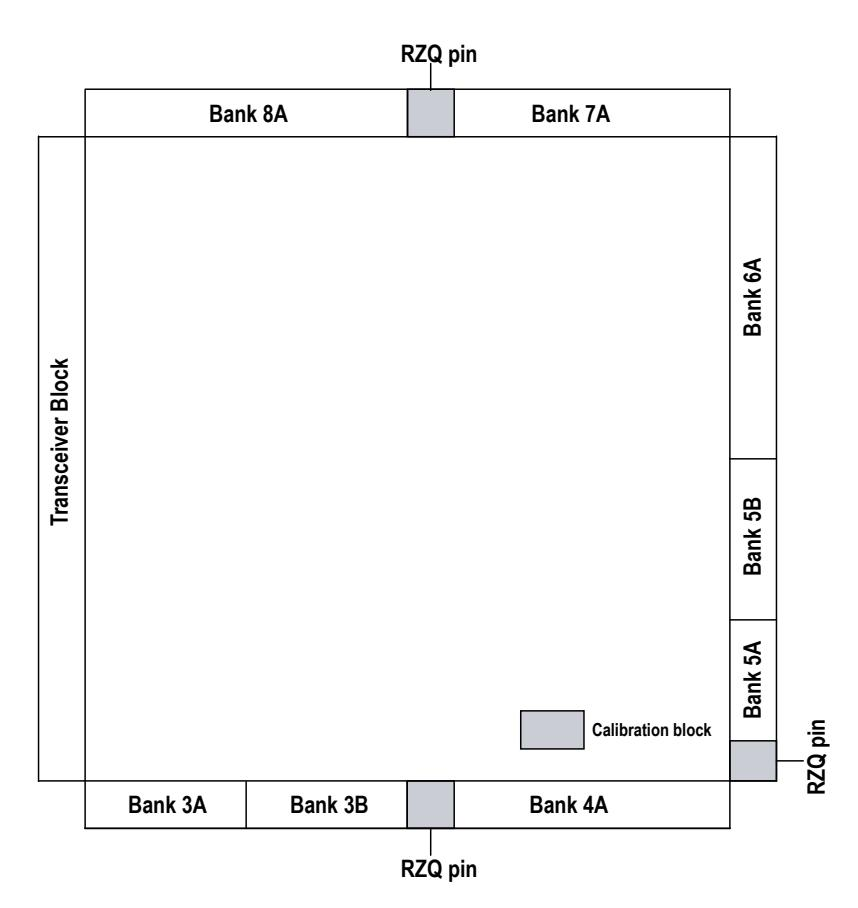

#### **Sharing an OCT Calibration Block on Multiple I/O Banks**

An OCT calibration block has the same VCCIO as the I/O bank that contains the block. All I/O banks with the same VCCIO can share one OCT calibration block, even if that particular I/O bank has an OCT calibra‐ tion block.

I/O banks that do not have calibration blocks share the calibration blocks in the I/O banks that have calibration blocks.

All I/O banks support OCT calibration with different VCCIO voltage standards, up to the number of available OCT calibration blocks.

You can configure the I/O banks to receive calibration codes from any OCT calibration block with the same VCCIO. If a group of I/O banks has the same VCCIO voltage, you can use one OCT calibration block to calibrate the group of I/O banks placed around the periphery.

#### Related Information

- [OCT Calibration Block Sharing Example](#page-155-0) on page 5-49

- • [ALTOCT IP Core User Guide](https://www.intel.com/content/dam/www/programmable/us/en/pdfs/literature/ug/ug_altoct.pdf) Provides more information about the OCT calibration block.

#### **OCT Calibration Block Sharing Example**

#### **Figure 5-19: Example of Calibrating Multiple I/O Banks with One Shared OCT Calibration Block**

As an example, this figure shows a group of I/O banks that has the same VCCIO voltage. The figure does not show transceiver calibration blocks.

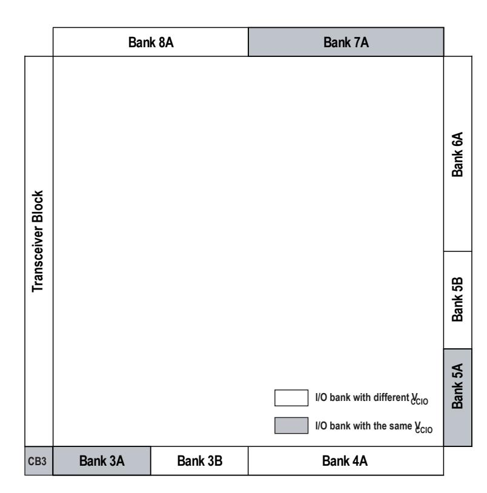

Because banks 5A and 7A have the same VCCIO as bank 3A, you can calibrate all three I/O banks (3A, 5A, and 7A) with the OCT calibration block (CB3) located in bank 3A.

To enable this calibration, serially shift out the RS OCT calibration codes from the OCT calibration block in bank 3A to the I/O banks around the periphery.

#### Related Information

- [Sharing an OCT Calibration Block on Multiple I/O Banks](#page-154-0) on page 5-48
- [ALTOCT IP Core User Guide](https://www.intel.com/content/dam/www/programmable/us/en/pdfs/literature/ug/ug_altoct.pdf) Provides more information about the OCT calibration block.

## **External I/O Termination for Cyclone V Devices**

**Table 5-33: External Termination Schemes for Different I/O Standards**

| I/O Standard                  | External Termination Scheme                |
| ----------------------------- | ------------------------------------------ |
| 3.3 V LVTTL/3.3 V V LVCMOS    |                                            |
| 3.0 V LVVTL/3.0 V LVCMOS      |                                            |
| 3.0 V PCI                     |                                            |
| 3.0 V PCI-X                   |                                            |
| 2.5 V LVCMOS                  | No external termination required           |
| 1.8 V LVCMOS                  |                                            |
| 1.5 V LVCMOS                  |                                            |
| 1.2 V LVCMOS                  |                                            |
| SSTL-2 Class I                |                                            |
| SSTL-2 Class II               |                                            |
| SSTL-18 Class I               | Single-Ended SSTL I/O Standard Termination |
| SSTL-18 Class II              |                                            |
| SSTL-15 Class I               |                                            |
| SSTL-15 Class II              |                                            |
| 1.8 V HSTL Class I            |                                            |
| 1.8 V HSTL Class II           |                                            |
| 1.5 V HSTL Class I            | Single-Ended HSTL I/O Standard Termination |
| 1.5 V HSTL Class II           |                                            |
| 1.2 V HSTL Class I            |                                            |
| 1.2 V HSTL Class II           |                                            |
| Differential SSTL-2 Class I   |                                            |
| Differential SSTL-2 Class II  |                                            |
| Differential SSTL-18 Class I  | Differential SSTL I/O Standard Termination |
| Differential SSTL-18 Class II |                                            |
| Differential SSTL-15 Class I  |                                            |
| Differential SSTL-15 Class II |                                            |

|                       | I/O Standard External Termination Scheme     |
| --------------------- | -------------------------------------------- |
| LVDS                  | LVDS I/O Standard Termination                |
| LVPECL                | Differential LVPECL I/O Standard Termination |
| SLVS                  | SLVS I/O Standard Termination                |
| SSTL-15 (18)          |                                              |
| SSTL-135 (18)         |                                              |
| SSTL-125 (18)         |                                              |
| Differential SSTL-15  | (18)                                         |
| Differential SSTL-135 | (18)                                         |
| Differential SSTL-125 | (18)                                         |

#### **Single-ended I/O Termination**

Voltage-referenced I/O standards require an input VREF and a termination voltage (VTT). The reference voltage of the receiving device tracks the termination voltage of the transmitting device.

The supported I/O standards such as SSTL-125, SSTL-135, and SSTL-15 typically do not require external board termination.

Intel recommends that you use OCT with these I/O standards to save board space and cost. OCT reduces the number of external termination resistors used.

Note: You cannot use RS and RT OCT simultaneously. For more information, refer to the related informa‐ tion.

(18) Intel recommends that you use OCT with these I/O standards to save board space and cost. OCT reduces the number of external termination resistors used.

**Figure 5-20: SSTL I/O Standard Termination**

This figure shows the details of SSTL I/O termination on Cyclone V devices.

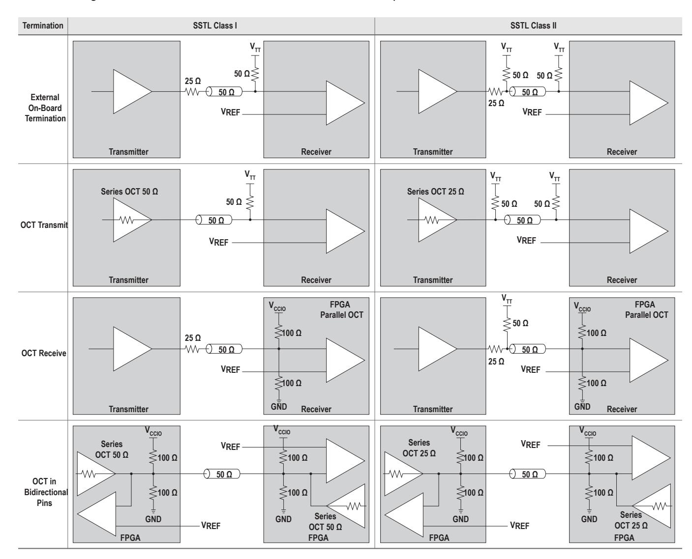

**Figure 5-21: HSTL I/O Standard Termination**

This figure shows the details of HSTL I/O termination on the Cyclone V devices.

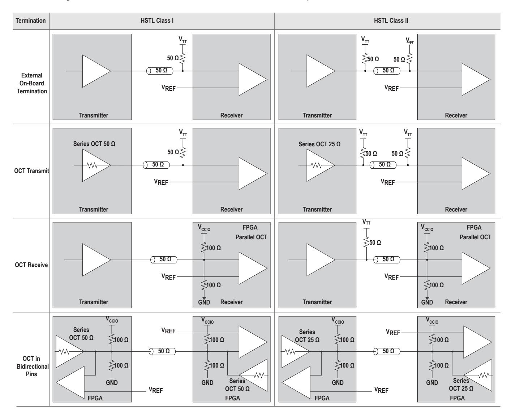

#### Related Information

[Dynamic OCT in Cyclone V Devices](#page-151-0) on page 5-45

#### **Differential I/O Termination**

The I/O pins are organized in pairs to support differential I/O standards. Each I/O pin pair can support differential input and output buffers.

The supported I/O standards such as Differential SSTL-15, Differential SSTL-125, and Differential SSTL-135 typically do not require external board termination.

Intel recommends that you use OCT with these I/O standards to save board space and cost. OCT reduces the number of external termination resistors used.

#### **Differential HSTL, SSTL, and HSUL Termination**

Differential HSTL, SSTL, and HSUL inputs use LVDS differential input buffers. However, RD support is only available if the I/O standard is LVDS.

Differential HSTL, SSTL, and HSUL outputs are not true differential outputs. These I/O standards use two single-ended outputs with the second output programmed as inverted.

**Figure 5-22: Differential SSTL I/O Standard Termination**

This figure shows the details of Differential SSTL I/O termination on Cyclone V devices.

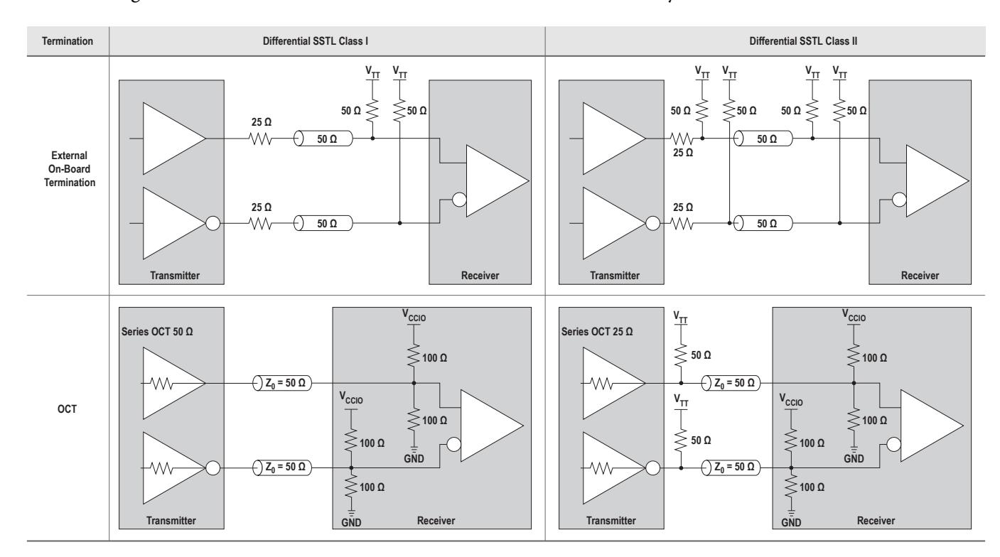

**Figure 5-23: Differential HSTL I/O Standard Termination**

This figure shows the details of Differential HSTL I/O standard termination on Cyclone V devices.

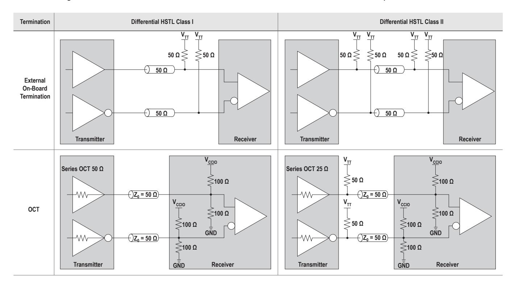

#### **LVDS, RSDS, SLVS, and Mini-LVDS Termination**

All I/O banks have dedicated circuitry to support the true LVDS, RSDS, SLVS, and mini-LVDS I/O standards by using true LVDS output buffers without resistor networks.

**Figure 5-24: LVDS and SLVS I/O Standard Termination**

This figure shows the LVDS and SLVS I/O standards termination. The on-chip differential resistor is available in all I/O banks.

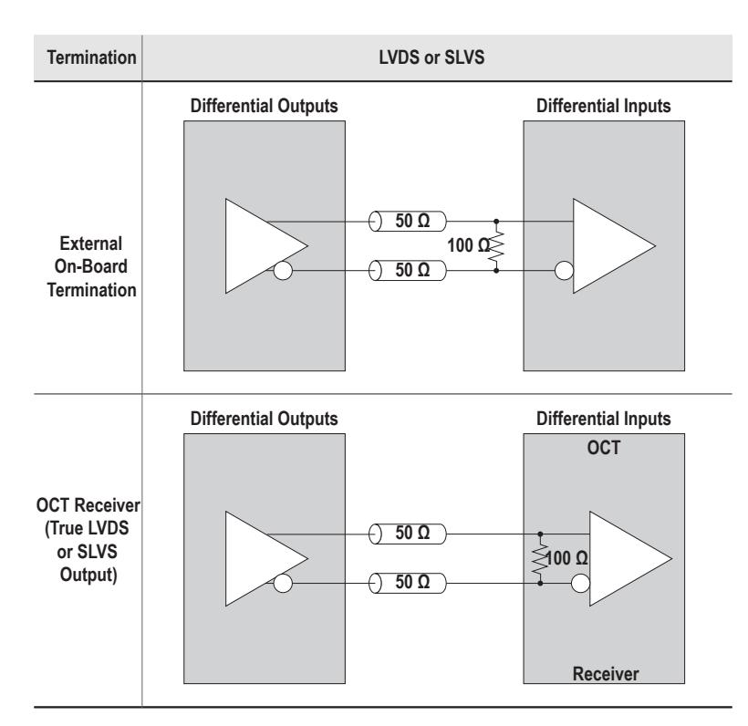

#### **Emulated LVDS, RSDS, and Mini-LVDS Termination**

The I/O banks also support emulated LVDS, RSDS, and mini-LVDS I/O standards.

Emulated LVDS, RSDS and mini-LVDS output buffers use two single-ended output buffers with an external single-resistor or three-resistor network, and can be tri-stated.

**Figure 5-25: Emulated LVDS, RSDS, or Mini-LVDS I/O Standard Termination**

The output buffers, as shown in this figure, are available in all I/O banks. RS is 120 Ω and RP is 170 Ω.

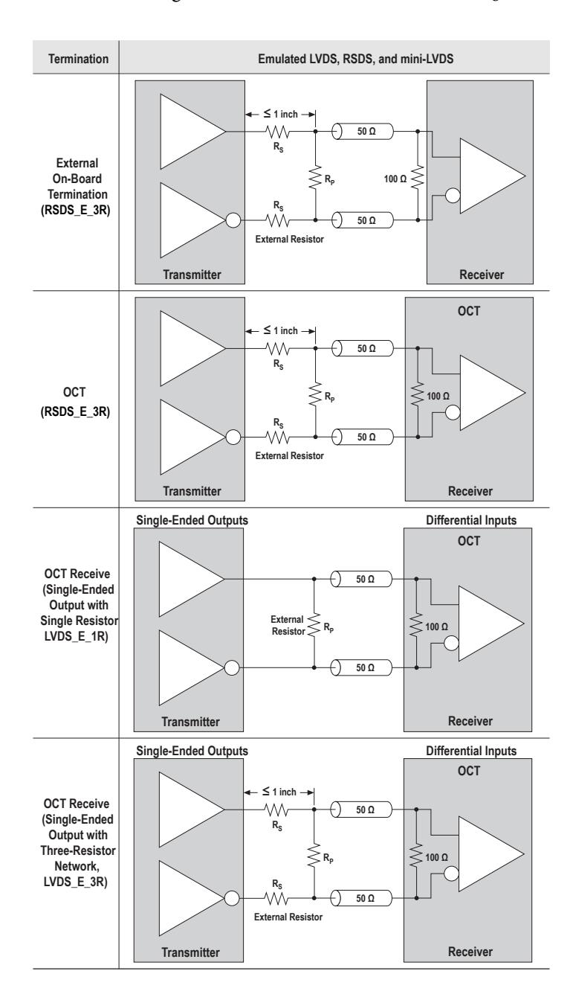

To meet the RSDS or mini-LVDS specifications, you require a resistor network to attenuate the outputvoltage swing.

You can modify the three-resistor network values to reduce power or improve the noise margin. Choose resistor values that satisfy the following equation.

**Figure 5-26: Resistor Network Calculation**

$$\frac{R_S \times \frac{R_P}{2}}{R_S + \frac{R_P}{2}} = 50 \, \Omega$$

Note: Altera recommends that you perform additional simulations with IBIS or SPICE models to validate that the custom resistor values meet the RSDS or mini-LVDS I/O standard requirements.

For information about the data rates supported for external single resistor or three-resistor network, refer to the device datasheet.

#### Related Information

#### [Cyclone V Device Datasheet](https://documentation.altera.com/#/link/mcn1422497163812/mcn1422497300420/en-us)

#### **LVPECL Termination**

The Cyclone V devices support the LVPECL I/O standard on input clock pins only:

- LVPECL input operation is supported using LVDS input buffers.
- LVPECL output operation is not supported.

Use AC coupling if the LVPECL common-mode voltage of the output buffer does not match the LVPECL input common-mode voltage.

Note: Altera recommends that you use IBIS models to verify your LVPECL AC/DC-coupled termination.

**Figure 5-27: LVPECL AC-Coupled Termination**

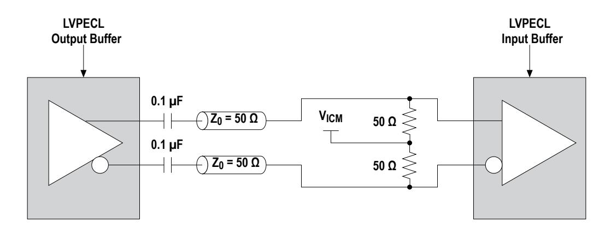

Support for DC-coupled LVPECL is available if the LVPECL output common mode voltage is within the Cyclone V LVPECL input buffer specification.

**Figure 5-28: LVPECL DC-Coupled Termination**

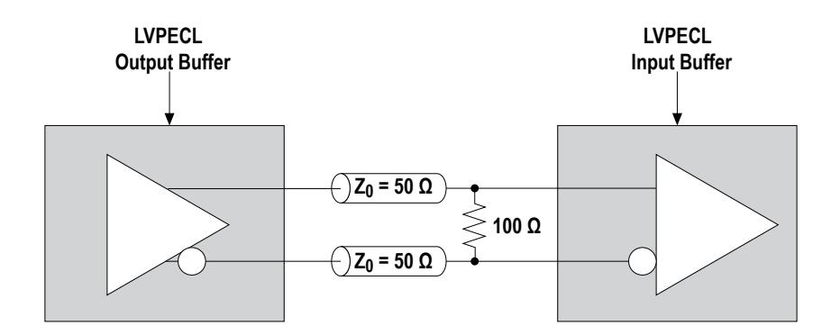

For information about the VICM specification, refer to the device datasheet.

#### Related Information

#### [Cyclone V Device Datasheet](https://documentation.altera.com/#/link/mcn1422497163812/mcn1422497300420/en-us)

#### **Dedicated High-Speed Circuitries**

The Cyclone V device has dedicated circuitries for differential transmitter and receiver to transmit or receive high-speed differential signals.

**Table 5-34: Features and Dedicated Circuitries of the Differential Transmitter and Receiver**

| Feature                  | Differential Transmitter  | Differential Receiver                  |
| ------------------------ | ------------------------- | -------------------------------------- |
| True differential buffer | LVDS, mini-LVDS, and RSDS | LVDS, SLVS, mini-LVDS, and RSDS        |
| SERDES                   | Up to 10 bit serializer   | Up to 10 bit deserializer              |
| Fractional PLL           | Clocks the load and shift |                                        |
| Programmable V OD        | Statically assignable     | —                                      |
|                          | Boosts output current     | —                                      |
|                          | —                         | Inserts bit latencies into serial data |
| Skew adjustment          | —                         | Manual                                 |
|                          | —                         | 100 Ω in LVDS and SLVS standards       |

#### Related Information

[Guideline: Use PLLs in Integer PLL Mode for LVDS](#page-119-0) on page 5-13

#### **High-Speed Differential I/O Locations**

The following figures show the locations of the dedicated serializer/deserializer (SERDES) circuitry and the high-speed I/Os in the Cyclone V devices.

**Figure 5-29: High-Speed Differential I/O Locations in Cyclone V E A2 and A4 Devices**

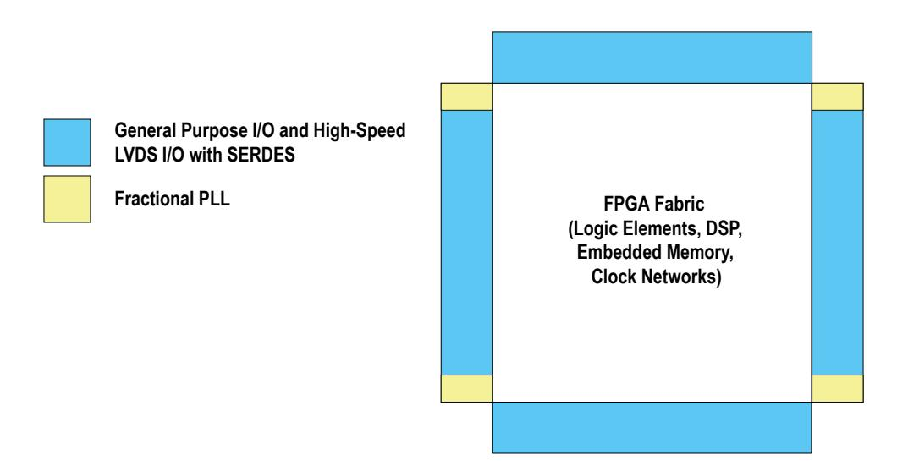

**Figure 5-30: High-Speed Differential I/O Locations in Cyclone V GX C3 Devices**

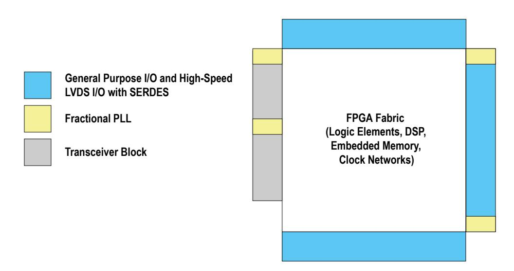

**Figure 5-31: High-Speed Differential I/O Locations in Cyclone V GX C4, C5, C7, and C9 Devices, and Cyclone V GT D5, D7, and D9 Devices**

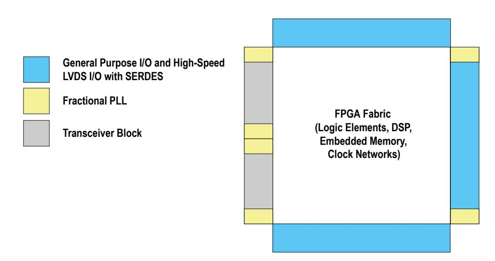

**Figure 5-32: High-Speed Differential I/O Locations in Cyclone V SE A2, A4, A5, and A6 Devices**

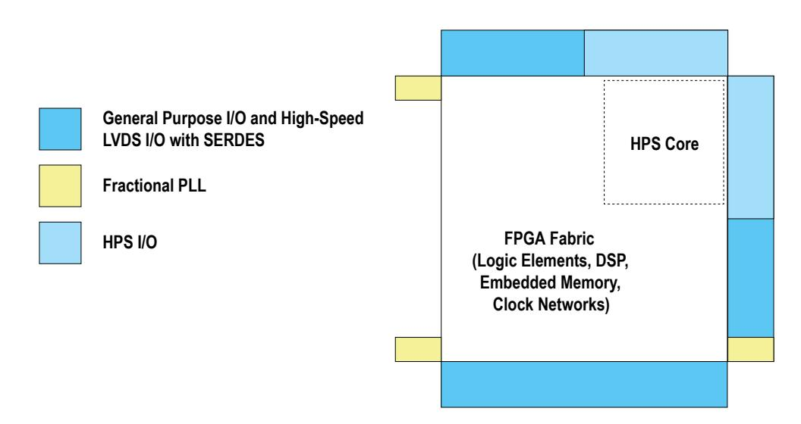

**Figure 5-33: High-Speed Differential I/O Locations in Cyclone V SX C2, C4, C5, and C6 Devices, and Cyclone V ST D5 and D6 Devices**

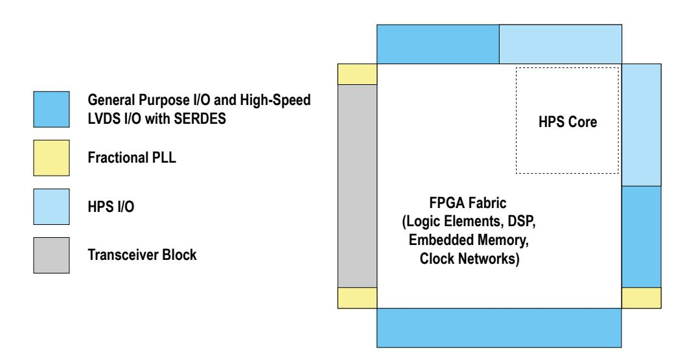

- [PLLs and Clocking](#page-119-0) on page 5-13 I/O design guidelines related to PLLs and clocking.
- [Guideline: Use PLLs in Integer PLL Mode for LVDS](#page-119-0) on page 5-13

#### **LVDS SERDES Circuitry**

The following figure shows a transmitter and receiver block diagram for the LVDS SERDES circuitry with the interface signals of the transmitter and receiver data paths.

**Figure 5-34: LVDS SERDES**

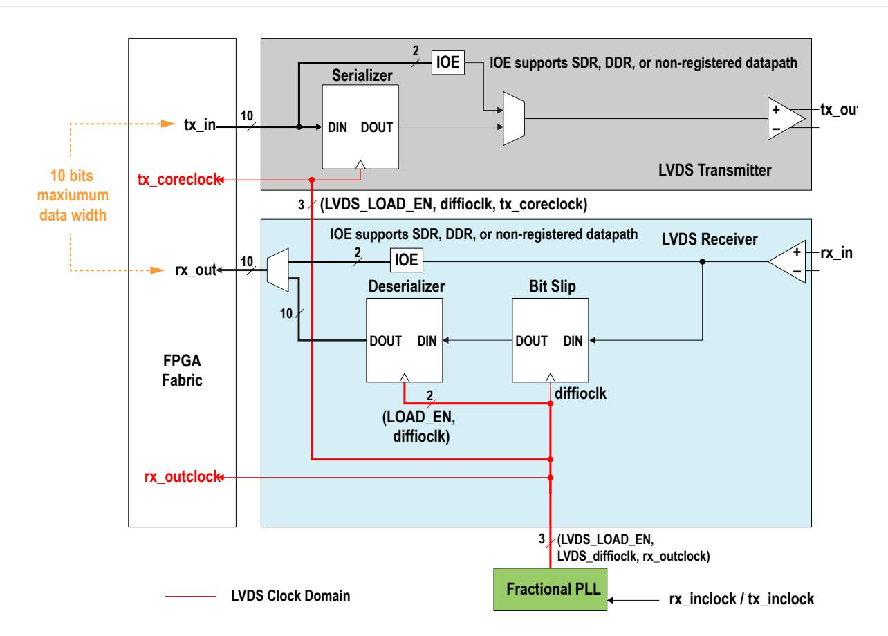

The preceding figure shows a shared PLL between the transmitter and receiver. If the transmitter and receiver do not share the same PLL, you require two fractional PLLs. In single data rate (SDR) and double data rate (DDR) modes, the data width is 1 and 2 bits, respectively.

Note: For the maximum data rate supported by the Cyclone V devices, refer to the device overview.

#### Related Information

- [Cyclone V Device Overview](https://documentation.altera.com/#/link/sam1403480548153/sam1403480280293/en-us)
- [Ports, LVDS SERDES Transmitter/Receiver IP Cores User Guide](https://documentation.altera.com/#/link/sam1412665235337/sam1412665126625/en-us) Provides a list of the LVDS transmitter and receiver ports and settings using ALTLVDS.
- [Guideline: Use PLLs in Integer PLL Mode for LVDS](#page-119-0) on page 5-13

#### **True LVDS Buffers in Cyclone V Devices**

The Cyclone V device family supports LVDS on all I/O banks:

- Both row and column I/Os support true LVDS input buffers with RD OCT and true LVDS output buffers.
- Cyclone V devices offer single-ended I/O reference clock support for the fractional PLL that drives the SERDES.

Note: True LVDS output buffers cannot be tri-stated.

The following tables list the number of true LVDS buffers supported in Cyclone V devices with these conditions:

- The LVDS channel count does not include dedicated clock pins.
- Each I/O sub-bank can support up to two independent ALTLVDS interfaces. For example, you can place two ALTLVDS interfaces in bank 8A driven by two different PLLs, provided that the LVDS channels are not interleaved.

**Table 5-35: LVDS Channels Supported in Cyclone V E Devices**

| Member Code Package Side                  | TX  | RX  |
| ----------------------------------------- | --- | --- |
| Top                                       | 8   | 8   |
| Left 256-pin FineLine BGA                 | 4   | 4   |
| Right                                     | 8   | 8   |
| Bottom                                    | 12  | 12  |
| Top                                       | 12  | 12  |
| Left 324-pin Ultra FineLine BGA           | 8   | 8   |
| Right                                     | 8   | 8   |
| Bottom                                    | 16  | 16  |
| Top                                       | 15  | 19  |
| Left A2 and A4 383-pin Micro FineLine BGA | 12  | 12  |
| Right                                     | 7   | 8   |
| Bottom                                    | 16  | 20  |
| Top                                       | 20  | 20  |
| Left 484-pin Ultra FineLine BGA           | 4   | 4   |
| Right                                     | 8   | 8   |
| Bottom                                    | 24  | 24  |
| Top                                       | 20  | 20  |
| Left 484-pin FineLine BGA                 | 4   | 4   |
| Right                                     | 8   | 8   |
| Bottom                                    | 24  | 24  |

| Member Code Package Side            | TX  | RX  |
| ----------------------------------- | --- | --- |
| Top                                 | 15  | 19  |
| Right 383-pin Micro FineLine BGA    | 7   | 8   |
| Bottom                              | 16  | 21  |
| Top                                 | 20  | 20  |
| Right A5 484-pin Ultra FineLine BGA | 12  | 12  |
| Bottom                              | 24  | 24  |
| Top                                 | 28  | 28  |
| Right 484-pin FineLine BGA          | 8   | 8   |
| Bottom                              | 24  | 24  |
| Top                                 | 20  | 20  |
| Right 484-pin Micro FineLine BGA    | 16  | 16  |
| Bottom                              | 24  | 24  |
| Top                                 | 20  | 20  |
| Right 484-pin Ultra FineLine BGA    | 16  | 16  |
| Bottom                              | 24  | 24  |
| Top                                 | 28  | 28  |
| Right A7 484-pin FineLine BGA       | 8   | 8   |
| Bottom                              | 24  | 24  |
| Top                                 | 28  | 28  |
| Right 672-pin FineLine BGA          | 24  | 24  |
| Bottom                              | 32  | 32  |
| Top                                 | 40  | 40  |
| Right 896-pin FineLine BGA          | 40  | 40  |
| Bottom                              | 40  | 40  |

| Member Code Package Side         | TX  | RX  |
| -------------------------------- | --- | --- |
| Top                              | 20  | 20  |
| Right 484-pin Ultra FineLine BGA | 16  | 16  |
| Bottom                           | 24  | 24  |
| Top                              | 24  | 24  |
| Right 484-pin FineLine BGA       | 8   | 8   |
| Bottom A9                        | 24  | 24  |
| Top                              | 28  | 28  |
| Right 672-pin FineLine BGA       | 24  | 24  |
| Bottom                           | 32  | 32  |
| Top                              | 40  | 40  |
| Right 896-pin FineLine BGA       | 40  | 40  |
| Bottom                           | 40  | 40  |

**Table 5-36: LVDS Channels Supported in Cyclone V GX Devices**

| Member Code Package Side            | TX  | RX  |
| ----------------------------------- | --- | --- |
| Top                                 | 12  | 12  |
| Right 324-pin Ultra FineLine BGA    | 8   | 8   |
| Bottom                              | 16  | 16  |
| Top                                 | 20  | 20  |
| Right C3 484-pin Ultra FineLine BGA | 8   | 8   |
| Bottom                              | 24  | 24  |
| Top                                 | 20  | 20  |
| Right 484-pin FineLine BGA          | 8   | 8   |
| Bottom                              | 24  | 24  |

| Member Code Package Side            | TX  | RX  |
| ----------------------------------- | --- | --- |
| Top                                 | 6   | 15  |
| Right 301-pin Micro FineLine BGA    | 7   | 8   |
| Bottom                              | 8   | 20  |
| Top                                 | 15  | 19  |
| Right 383-pin Micro FineLine BGA    | 7   | 8   |
| Bottom                              | 16  | 21  |
| Top                                 | 20  | 20  |
| Right C4 484-pin Ultra FineLine BGA | 12  | 12  |
| Bottom                              | 24  | 24  |
| Top                                 | 28  | 28  |
| Right 484-pin FineLine BGA          | 8   | 8   |
| Bottom                              | 24  | 24  |
| Top                                 | 28  | 28  |
| Right 672-pin FineLine BGA          | 24  | 24  |
| Bottom                              | 32  | 32  |
| Top                                 | 6   | 15  |
| Right 301-pin Micro FineLine BGA    | 7   | 8   |
| Bottom                              | 8   | 20  |
| Top                                 | 15  | 19  |
| Right 383-pin Micro FineLine BGA    | 7   | 8   |
| Bottom                              | 16  | 21  |
| Top                                 | 20  | 20  |
| Right C5 484-pin Ultra FineLine BGA | 12  | 12  |
| Bottom                              | 24  | 24  |
| Top                                 | 28  | 28  |
| Right 484-pin FineLine BGA          | 8   | 8   |
| Bottom                              | 24  | 24  |
| Top                                 | 28  | 28  |
| Right 672-pin FineLine BGA          | 24  | 24  |
| Bottom                              | 32  | 32  |

| Member Code Package Side         | TX  | RX  |
| -------------------------------- | --- | --- |
| Top                              | 20  | 20  |
| Right 484-pin Micro FineLine BGA | 16  | 16  |
| Bottom                           | 24  | 24  |
| Top                              | 20  | 20  |
| Right 484-pin Ultra FineLine BGA | 16  | 16  |
| Bottom                           | 24  | 24  |
| Top                              | 28  | 28  |
| Right C7 484-pin FineLine BGA    | 8   | 8   |
| Bottom                           | 24  | 24  |
| Top                              | 28  | 28  |
| Right 672-pin FineLine BGA       | 24  | 24  |
| Bottom                           | 32  | 32  |
| Top                              | 40  | 40  |
| Right 896-pin FineLine BGA       | 40  | 40  |
| Bottom                           | 40  | 40  |
| Top                              | 20  | 20  |
| Right 484-pin Ultra FineLine BGA | 16  | 16  |
| Bottom                           | 24  | 24  |
| Top                              | 24  | 24  |
| Right 484-pin FineLine BGA       | 8   | 8   |
| Bottom                           | 24  | 24  |
| Top                              | 28  | 28  |
| Right C9 672-pin FineLine BGA    | 24  | 24  |
| Bottom                           | 32  | 32  |
| Top                              | 40  | 40  |
| Right 896-pin FineLine BGA       | 40  | 40  |
| Bottom                           | 40  | 40  |
| Top                              | 48  | 48  |
| Right 1152-pin FineLine BGA      | 44  | 44  |
| Bottom                           | 48  | 48  |

**Table 5-37: LVDS Channels Supported in Cyclone V GT Devices**

| Member Code Package Side            | TX  | RX  |
| ----------------------------------- | --- | --- |
| Top                                 | 6   | 15  |
| Right 301-pin Micro FineLine BGA    | 7   | 8   |
| Bottom                              | 8   | 20  |
| Top                                 | 15  | 19  |
| Right 383-pin Micro FineLine BGA    | 7   | 8   |
| Bottom                              | 16  | 21  |
| Top                                 | 20  | 20  |
| Right D5 484-pin Ultra FineLine BGA | 12  | 12  |
| Bottom                              | 24  | 24  |
| Top                                 | 28  | 28  |
| Right 484-pin FineLine BGA          | 8   | 8   |
| Bottom                              | 24  | 24  |
| Top                                 | 28  | 28  |
| Right 672-pin FineLine BGA          | 24  | 24  |
| Bottom                              | 32  | 32  |
| Top                                 | 20  | 20  |
| Right 484-pin Micro FineLine BGA    | 16  | 16  |
| Bottom                              | 24  | 24  |
| Top                                 | 20  | 20  |
| Right 484-pin Ultra FineLine BGA    | 16  | 16  |
| Bottom                              | 24  | 24  |
| Top                                 | 28  | 28  |
| Right D7 484-pin FineLine BGA       | 8   | 8   |
| Bottom                              | 24  | 24  |
| Top                                 | 28  | 28  |
| Right 672-pin FineLine BGA          | 24  | 24  |
| Bottom                              | 32  | 32  |
| Top                                 | 40  | 40  |
| Right 896-pin FineLine BGA          | 40  | 40  |
| Bottom                              | 40  | 40  |

| Member Code Package Side         | TX  | RX  |
| -------------------------------- | --- | --- |
| Top                              | 20  | 20  |
| Right 484-pin Ultra FineLine BGA | 16  | 16  |
| Bottom                           | 24  | 24  |
| Top                              | 24  | 24  |
| Right 484-pin FineLine BGA       | 8   | 8   |
| Bottom                           | 24  | 24  |
| Top                              | 28  | 28  |
| Right D9 672-pin FineLine BGA    | 24  | 24  |
| Bottom                           | 32  | 32  |
| Top                              | 40  | 40  |
| Right 896-pin FineLine BGA       | 40  | 40  |
| Bottom                           | 40  | 40  |
| Top                              | 48  | 48  |
| Right 1152-pin FineLine BGA      | 44  | 44  |
| Bottom                           | 48  | 48  |

**Table 5-38: LVDS Channels Supported in Cyclone V SE Devices**

| Member Code Package Side                   | TX  | RX  |
| ------------------------------------------ | --- | --- |
| Top                                        | 1   | 2   |
| Right 484-pin Ultra FineLine BGA           | 4   | 4   |
| Bottom A2 and A4                           | 10  | 12  |
| Top                                        | 1   | 2   |
| Right 672-pin Ultra FineLine BGA           | 5   | 6   |
| Bottom                                     | 26  | 29  |
| Top                                        | 1   | 2   |
| Right 484-pin Ultra FineLine BGA           | 4   | 4   |
| Bottom                                     | 10  | 12  |
| Top                                        | 1   | 2   |
| Right A5 and A6 672-pin Ultra FineLine BGA | 5   | 6   |
| Bottom                                     | 26  | 29  |
| Top                                        | 20  | 20  |
| Right 896-pin FineLine BGA                 | 12  | 12  |
| Bottom                                     | 40  | 40  |

**Table 5-39: LVDS Channels Supported in Cyclone V SX Devices**

| Member Code | Package                    | Side   | TX  | RX  |
| ----------- | -------------------------- | ------ | --- | --- |
| C2 and C4   | 672-pin Ultra FineLine BGA |        |     |     |
|             |                            | Top    | 1   | 2   |
|             |                            | Right  | 5   | 6   |
|             |                            | Bottom | 26  | 29  |
|             |                            | Top    | 1   | 2   |
|             | 672-pin Ultra FineLine BGA | Right  | 5   | 6   |
| C5 and C6   |                            | Bottom | 26  | 29  |
|             |                            | Top    | 20  | 20  |
|             | 896-pin FineLine BGA       | Right  | 12  | 12  |
|             |                            | Bottom | 40  | 40  |

**Table 5-40: LVDS Channels Supported in Cyclone V ST Devices**

| Member Code | Package              | Side   | TX  | RX  |
| ----------- | -------------------- | ------ | --- | --- |
| D5 and D6   | 896-pin FineLine BGA |        |     |     |
|             |                      | Top    | 20  | 20  |
|             |                      | Right  | 12  | 12  |
|             |                      | Bottom | 40  | 40  |

[Guideline: Use PLLs in Integer PLL Mode for LVDS](#page-119-0) on page 5-13

#### **Emulated LVDS Buffers in Cyclone V Devices**

The Cyclone V device family supports emulated LVDS on all I/O banks:

- You can use unutilized true LVDS input channels as emulated LVDS output buffers (eTX).
- The emulated LVDS output buffers use two single-ended output buffers with an external resistor network to support LVDS, mini-LVDS, and RSDS I/O standards.
- The emulated differential output buffers support tri-state capability.

#### **Differential Transmitter in Cyclone V Devices**

The Cyclone V transmitter contains dedicated circuitry to support high-speed differential signaling. The differential transmitter buffers support the following features:

- LVDS signaling that can drive out LVDS, mini-LVDS, and RSDS signals
- Programmable VOD and programmable pre-emphasis

#### **Transmitter Blocks**

The dedicated circuitry consists of a true differential buffer, a serializer, and fractional PLLs that you can share between the transmitter and receiver. The serializer takes up to 10 bits wide parallel data from the

FPGA fabric, clocks it into the load registers, and serializes it using shift registers that are clocked by the fractional PLL before sending the data to the differential buffer. The MSB of the parallel data is transmitted first.

Note: To drive the LVDS channels, you must use the PLLs in integer PLL mode.

The following figure shows a block diagram of the transmitter. In SDR and DDR modes, the data width is 1 and 2 bits, respectively.

**Figure 5-35: LVDS Transmitter**

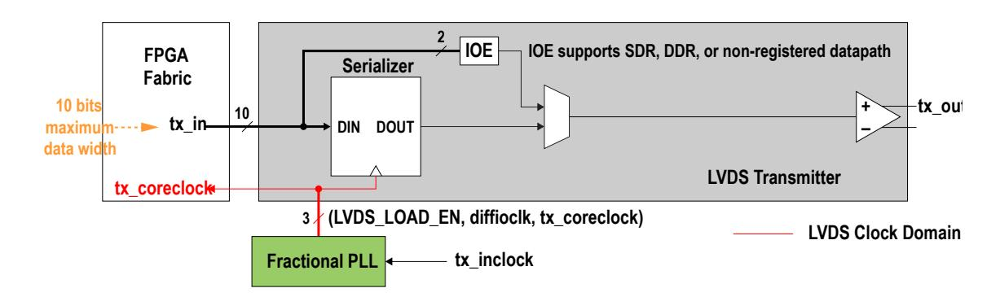

#### Related Information

[Guideline: Use PLLs in Integer PLL Mode for LVDS](#page-119-0) on page 5-13

#### **Transmitter Clocking**

The fractional PLL generates the parallel clocks (rx\_outclock and tx\_outclock), the load enable (LVDS\_LOAD\_EN) signal and the diffioclk signal (the clock running at serial data rate) that clocks the load and shift registers. You can statically set the serialization factor to x4, x5, x6, x7, x8, x9, or x10 using the Intel Quartus Prime software. The load enable signal is derived from the serialization factor setting.

You can configure any Cyclone V transmitter data channel to generate a source-synchronous transmitter clock output. This flexibility allows the placement of the output clock near the data outputs to simplify board layout and reduce clock-to-data skew.

Different applications often require specific clock-to-data alignments or specific data-rate-to-clock-rate factors. You can specify these settings statically in the Intel Quartus Prime IP Catalog:

- The transmitter can output a clock signal at the same rate as the data—with a maximum output clock frequency that each speed grade of the device supports.
- You can divide the output clock by a factor of 1, 2, 4, 6, 8, or 10, depending on the serialization factor.
- You can set the phase of the clock in relation to the data using internal PLL option of the ALTLVDS IP core. The fractional PLLs provide additional support for other phase shifts in 45° increments.

The following figure shows the transmitter in clock output mode. In clock output mode, you can use an LVDS channel as a clock output channel.

**Figure 5-36: Transmitter in Clock Output Mode**

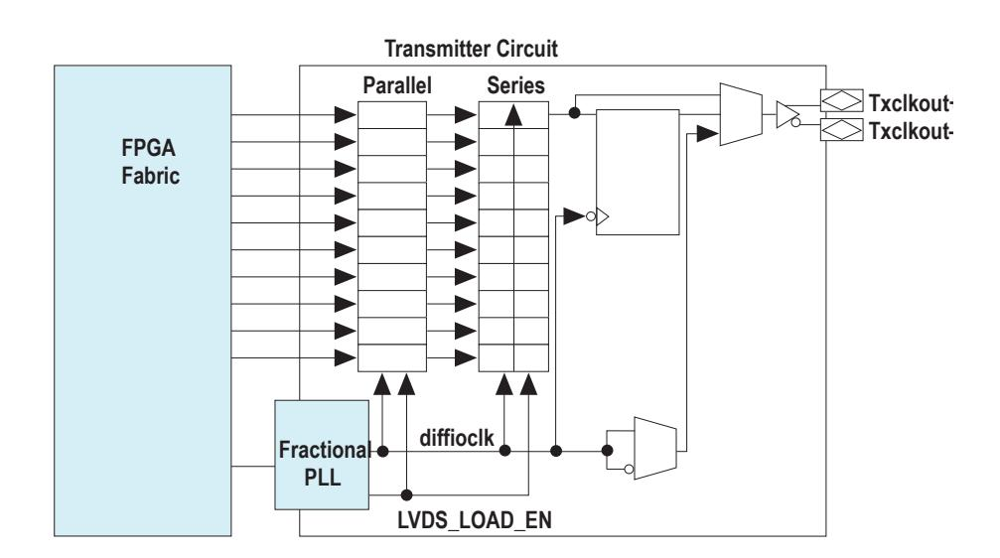

[Guideline: Use PLLs in Integer PLL Mode for LVDS](#page-119-0) on page 5-13

#### **Serializer Bypass for DDR and SDR Operations**

You can bypass the serializer to support DDR (x2) and SDR (x1) operations to achieve a serialization factor of 2 and 1, respectively. The I/O element (IOE) contains two data output registers that can each operate in either DDR or SDR mode.

**Figure 5-37: Serializer Bypass**

This figure shows the serializer bypass path. In DDR mode, tx\_inclock clocks the IOE register. In SDR mode, data is passed directly through the IOE. In SDR and DDR modes, the data width to the IOE is 1 and 2 bits, respectively.

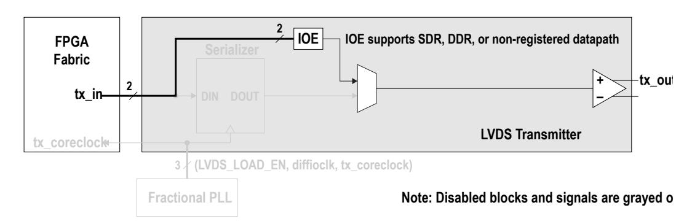

# **Differential Receiver in Cyclone V Devices**

The receiver has a differential buffer and fractional PLLs that you can share among the transmitter and receiver, a data realignment block, and a deserializer. The differential buffer can receive LVDS, mini-LVDS, and RSDS signal levels. You can statically set the I/O standard of the receiver pins to LVDS, SLVS, mini-LVDS, or RSDS in the Intel Quartus Prime software Assignment Editor.

Note: To drive the LVDS channels, you must use the PLLs in integer PLL mode.

#### Related Information

[Guideline: Use PLLs in Integer PLL Mode for LVDS](#page-119-0) on page 5-13

#### **Receiver Blocks in Cyclone V Devices**

The Cyclone V differential receiver has the following hardware blocks:

- Data realignment block (bit slip)
- Deserializer

The following figure shows the hardware blocks of the receiver. In SDR and DDR modes, the data width from the IOE is 1 and 2 bits, respectively. The deserializer includes shift registers and parallel load registers, and sends a maximum of 10 bits to the internal logic.

**Figure 5-38: Receiver Block Diagram**

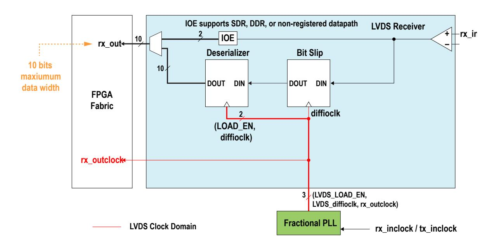

#### **Data Realignment Block (Bit Slip)**

Skew in the transmitted data along with skew added by the link causes channel-to-channel skew on the received serial data streams. To compensate for this channel-to-channel skew and establish the correct received word boundary at each channel, each receiver channel has a dedicated data realignment circuit that realigns the data by inserting bit latencies into the serial stream.

An optional RX\_CHANNEL\_DATA\_ALIGN port controls the bit insertion of each receiver independently controlled from the internal logic. The data slips one bit on the rising edge of RX\_CHANNEL\_DATA\_ALIGN. The requirements for the RX\_CHANNEL\_DATA\_ALIGN signal include the following items:

- The minimum pulse width is one period of the parallel clock in the logic array.
- The minimum low time between pulses is one period of the parallel clock.
- The signal is an edge-triggered signal.
- The valid data is available two parallel clock cycles after the rising edge of RX\_CHANNEL\_DATA\_ALIGN.

**Figure 5-39: Data Realignment Timing**

This figure shows receiver output (RX\_OUT) after one bit slip pulse with the deserialization factor set to 4.

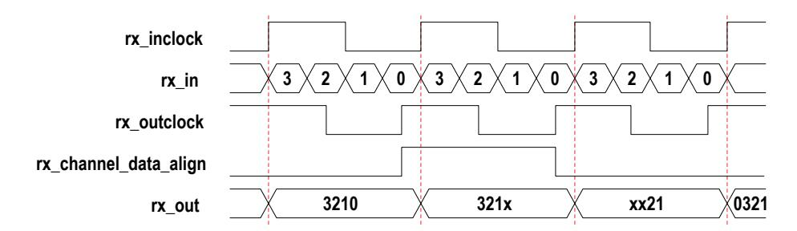

The data realignment circuit can have up to 11 bit-times of insertion before a rollover occurs. The programmable bit rollover point can be from 1 to 11 bit-times, independent of the deserialization factor. Set the programmable bit rollover point equal to, or greater than, the deserialization factor—allowing enough depth in the word alignment circuit to slip through a full word. You can set the value of the bit rollover point using the IP Catalog. An optional status port, RX\_CDA\_MAX, is available to the FPGA fabric from each channel to indicate the reaching of the preset rollover point.

**Figure 5-40: Receiver Data Realignment Rollover**

This figure shows a preset value of four bit-times before rollover occurs. The rx\_cda\_max signal pulses for one rx\_outclock cycle to indicate that rollover has occurred.

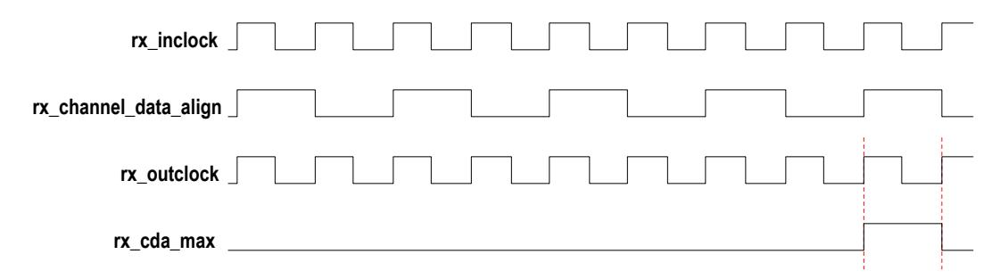

#### **Deserializer**

You can statically set the deserialization factor to x4, x5, x6, x7, x8, x9, or x10 by using the Intel Quartus Prime software. You can bypass the deserializer in the Intel Quartus Prime IP Catalog to support DDR (x2) or SDR (x1) operations, as shown in the following figure.

**Figure 5-41: Deserializer Bypass**

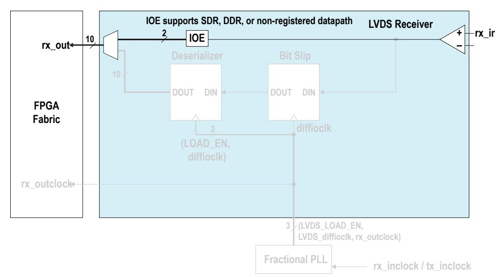

**Note: Disabled blocks and signals are grayed out**

The IOE contains two data input registers that can operate in DDR or SDR mode. In DDR mode, rx\_inclock clocks the IOE register. In SDR mode, data is directly passed through the IOE. In SDR and DDR modes, the data width from the IOE is 1 and 2 bits, respectively.

#### **Receiver Mode in Cyclone V Devices**

The Cyclone V devices support the LVDS receiver mode.

#### **LVDS Receiver Mode**

Input serial data is registered at the rising edge of the serial LVDS\_diffioclk clock that is produced by the left and right PLLs.

You can select the rising edge option with the Intel Quartus Prime IP Catalog. The LVDS\_diffioclk clock that is generated by the left and right PLLs clocks the data realignment and deserializer blocks.

The following figure shows the LVDS datapath block diagram. In SDR and DDR modes, the data width from the IOE is 1 and 2 bits, respectively.

**Figure 5-42: Receiver Data Path in LVDS Mode**

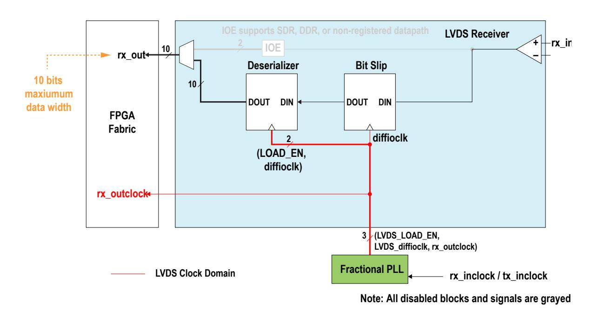

#### **Receiver Clocking for Cyclone V Devices**

The fractional PLL receives the external clock input and generates different phases of the same clock.

The physical medium connecting the transmitter and receiver LVDS channels may introduce skew between the serial data and the source-synchronous clock. The instantaneous skew between each LVDS channel and the clock also varies with the jitter on the data and clock signals as seen by the receiver.

LVDS mode allows you to statically select the optimal phase between the source synchronous clock and the received serial data to compensate skew.

#### Related Information

[Guideline: Use PLLs in Integer PLL Mode for LVDS](#page-119-0) on page 5-13

#### **Differential I/O Termination for Cyclone V Devices**

The Cyclone V devices provide a 100 Ω, on-chip differential termination option on each differential receiver channel for LVDS standards. On-chip termination saves board space by eliminating the need to add external resistors on the board. You can enable on-chip termination in the Intel Quartus Prime software Assignment Editor.

All I/O pins and dedicated clock input pins support on-chip differential termination, RD OCT.

**Figure 5-43: On-Chip Differential I/O Termination**

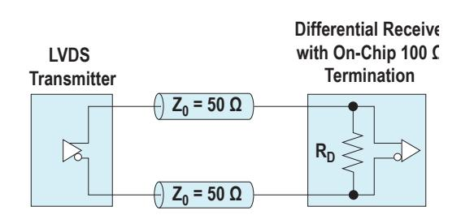

**Table 5-41: Intel Quartus Prime Software Assignment Editor—On-Chip Differential Termination**

This table lists the assignment name for on-chip differential termination in the Intel Quartus Prime software Assignment Editor.

| Field           | Assignment        |
| --------------- | ----------------- |
| To              | rx_in             |
| Assignment name | Input Termination |
| Value           | Differential      |

# **Source-Synchronous Timing Budget**

The topics in this section describe the timing budget, waveforms, and specifications for source-synchro‐ nous signaling in the Cyclone V device family.

The LVDS I/O standard enables high-speed transmission of data, resulting in better overall system performance. To take advantage of fast system performance, you must analyze the timing for these highspeed signals. Timing analysis for the differential block is different from traditional synchronous timing analysis techniques.

The basis of the source synchronous timing analysis is the skew between the data and the clock signals instead of the clock-to-output setup times. High-speed differential data transmission requires the use of timing parameters provided by IC vendors and is strongly influenced by board skew, cable skew, and clock jitter.

This section defines the source-synchronous differential data orientation timing parameters, the timing budget definitions for the Cyclone V device family, and how to use these timing parameters to determine the maximum performance of a design.

#### **Differential Data Orientation**

There is a set relationship between an external clock and the incoming data. For operations at 840 Mbps and a serialization factor of 10, the external clock is multiplied by 10. You can set phase-alignment in the PLL to coincide with the sampling window of each data bit. The data is sampled on the falling edge of the multiplied clock.

#### **Figure 5-44: Bit Orientation in the Intel Quartus Prime Software**

This figure shows the data bit orientation of the x10 mode.

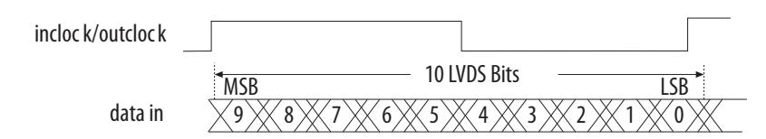

#### **Differential I/O Bit Position**

Data synchronization is necessary for successful data transmission at high frequencies.

The following figure shows the data bit orientation for a channel operation and is based on the following conditions:

- The serialization factor is equal to the clock multiplication factor.
- The phase alignment uses edge alignment.
- The operation is implemented in hard SERDES.

#### **Figure 5-45: Bit-Order and Word Boundary for One Differential Channel**

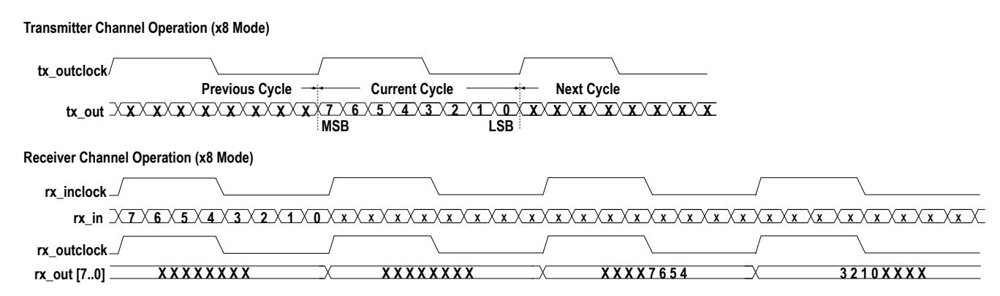

**Note: These waveforms are only functional waveforms and do not convey timing information**

For other serialization factors, use the Intel Quartus Prime software tools to find the bit position within the word.

#### **Differential Bit Naming Conventions**

The following table lists the conventions for differential bit naming for 18 differential channels. The MSB and LSB positions increase with the number of channels used in a system.

#### **Table 5-42: Differential Bit Naming**

This table lists the conventions for differential bit naming for 18 differential channels, and the bit positions after deserialization.

| Receiver Channel Data Number | MSB Position | Internal 8-Bit Parallel Data LSB Position |
| ---------------------------- | ------------ | ----------------------------------------- |
| 1                            | 7            | 0                                         |
| 2                            | 15           | 8                                         |
| 3                            | 23           | 16                                        |
| 4                            | 31           | 24                                        |
| 5                            | 39           | 32                                        |
| 6                            | 47           | 40                                        |
| 7                            | 55           | 48                                        |
| 8                            | 63           | 56                                        |
| 9                            | 71           | 64                                        |
| 10                           | 79           | 72                                        |
| 11                           | 87           | 80                                        |
| 12                           | 95           | 88                                        |
| 13                           | 103          | 96                                        |
| 14                           | 111          | 104                                       |
| 15                           | 119          | 112                                       |
| 16                           | 127          | 120                                       |
| 17                           | 135          | 128                                       |
| 18                           | 143          | 136                                       |

#### **Transmitter Channel-to-Channel Skew**

The receiver skew margin calculation uses the transmitter channel-to-channel skew (TCCS)—an important parameter based on the Cyclone V transmitter in a source-synchronous differential interface:

- TCCS is the difference between the fastest and slowest data output transitions, including the TCO variation and clock skew.
- For LVDS transmitters, the Timing Analyzer provides the TCCS value in the TCCS report (report\_TCCS) in the Intel Quartus Prime compilation report, which shows TCCS values for serial output ports.
- You can also get the TCCS value from the device datasheet.

#### Related Information

- [Cyclone V Device Datasheet](https://documentation.altera.com/#/link/mcn1422497163812/mcn1422497300420/en-us)
- [Receiver Skew Margin and Transmitter Channel-to-Channel Skew, LVDS SERDES Transmitter/](https://documentation.altera.com/#/link/sam1412665235337/sam1412665137218/en-us) [Receiver IP Cores User Guide](https://documentation.altera.com/#/link/sam1412665235337/sam1412665137218/en-us)

Provides more information about the LVDS Transmitter/Receiver Package Skew Compensation report panel.

#### **Receiver Skew Margin for LVDS Mode**

In LVDS mode, use RSKM, TCCS, and sampling window (SW) specifications for high-speed sourcesynchronous differential signals in the receiver data path.

The following equation expresses the relationship between RSKM, TCCS, and SW.

**Figure 5-46: RSKM Equation**

$$RSKM = \frac{TUI - SW - TCCS}{2}$$

Conventions used for the equation:

- RSKM—the timing margin between the receiver's clock input and the data input sampling window.
- Time unit interval (TUI)—time period of the serial data.
- SW—the period of time that the input data must be stable to ensure that data is successfully sampled by the LVDS receiver. The SW is a device property and varies with device speed grade.
- TCCS—the timing difference between the fastest and the slowest output edges, including tCO variation and clock skew, across channels driven by the same PLL. The clock is included in the TCCS measure‐ ment.

You must calculate the RSKM value to decide whether the LVDS receiver can sample the data properly or not, given the data rate and device. A positive RSKM value indicates that the LVDS receiver can sample the data properly, whereas a negative RSKM indicates that it cannot sample the data properly.

The following figure shows the relationship between the RSKM, TCCS, and the SW of the receiver.

**Figure 5-47: Differential High-Speed Timing Diagram and Timing Budget for LVDS Mode**

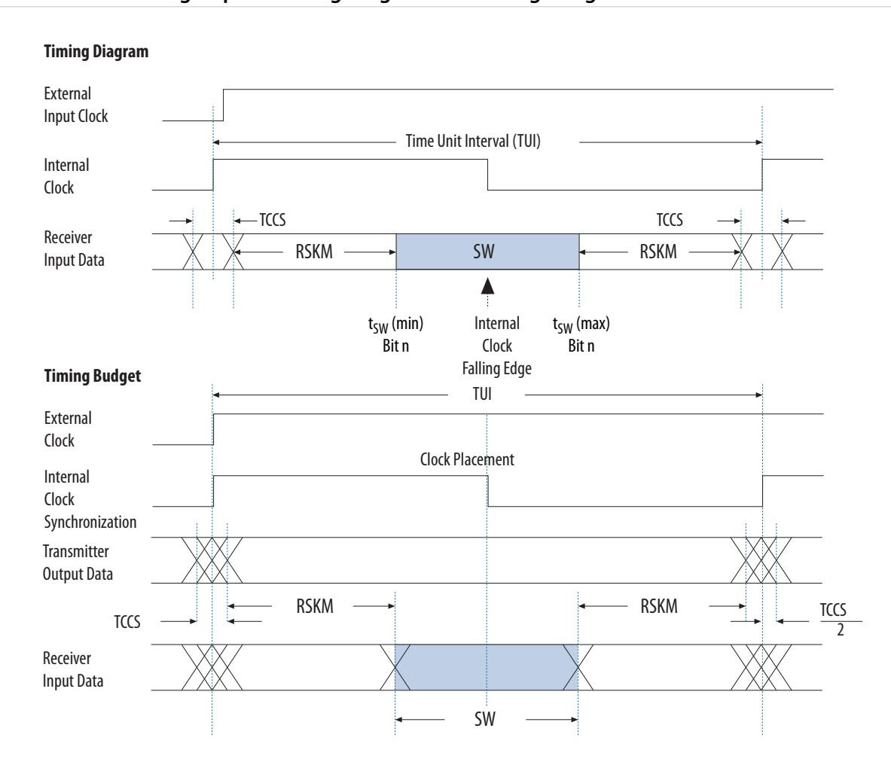

For LVDS receivers, the Intel Quartus Prime software provides an RSKM report showing the SW, TUI, and RSKM values for non-DPA LVDS mode:

- You can generate the RSKM report by executing the report\_RSKM command in the Timing Analyzer. You can find the RSKM report in the Intel Quartus Prime compilation report in the Timing Analyzer section.
- To obtain the RSKM value, assign the input delay to the LVDS receiver through the constraints menu of the Timing Analyzer. The input delay is determined according to the data arrival time at the LVDS receiver port, with respect to the reference clock.
- If you set the input delay in the settings parameters for the Set Input Delay option, set the clock name to the clock that reference the source synchronous clock that feeds the LVDS receiver.
- If you do not set any input delay in the Timing Analyzer, the receiver channel-to-channel skew defaults to zero.
- You can also directly set the input delay in a Synopsys Design Constraint file (.sdc) using the set\_input\_delay command.

- • [Receiver Skew Margin and Transmitter Channel-to-Channel Skew, LVDS SERDES Transmitter/](https://documentation.altera.com/#/link/sam1412665235337/sam1412665137218/en-us) [Receiver IP Cores User Guide](https://documentation.altera.com/#/link/sam1412665235337/sam1412665137218/en-us) Provides more information about the RSKM equation and calculation.
- [The Quartus II TimeQuest Timing Analyzer, Quartus II Handbook Volume 3: Verification](https://documentation.altera.com/#/link/mwh1410385117325/mwh1410383638859/en-us) Provides more information about .sdc commands and the TimeQuest Timing Analyzer.

#### **I/O Features in Cyclone V Devices Revision History**

| Document Version | Changes                                                                                                             |
| ---------------- | ------------------------------------------------------------------------------------------------------------------- |
| 2019.03.19       | Corrected the number of I/O pins for I/O banks 5B and 6A in the F672 package of the Cyclone V GX C5 and C7 devices. |

| Date          | Version    | Changes                                                                |
| ------------- | ---------- | ---------------------------------------------------------------------- |
| March 2018    | 2018.03.02 | Updated the note in Dynamic OCT in Cyclone V Devices topic.            |
| December 2017 | 2017.12.15 | Updated the default value for Differential Output Voltage feature from |
|               |            | Added a note to PLLs and Clocking topic to clarify that spread        |
|               |            | Added a note to On-Chip I/O Termination in Cyclone V Devices           |
| June 2016     | 2016.06.10 | Clarified the example quoted in Non-Voltage-Referenced I/O             |
| December 2015 | 2015.12.21 | Added assignment name and supported I/O standards in Summary of        |
|               |            | Changed instances of Quartus II to Quartus Prime                       |
| June 2015     | 2015.06.12 | Updated figures in Guideline: Using LVDS Differential Channels.        |
| March 2015    | 2015.03.31 | Added the R S                                                          |
|               |            | (120 Ω) and R P (170 Ω) values for the emulated LVDS,                  |

| Date         | Version    | Changes                                                                                                                                                                                                                                                                                                                                                                                                                                                                                                                                                                                                                                                                                                                                                                                                                                                                                                                                                                                                                                                                                                                                                                                                                                                                                                                                                                                                                                         |
| ------------ | ---------- | ----------------------------------------------------------------------------------------------------------------------------------------------------------------------------------------------------------------------------------------------------------------------------------------------------------------------------------------------------------------------------------------------------------------------------------------------------------------------------------------------------------------------------------------------------------------------------------------------------------------------------------------------------------------------------------------------------------------------------------------------------------------------------------------------------------------------------------------------------------------------------------------------------------------------------------------------------------------------------------------------------------------------------------------------------------------------------------------------------------------------------------------------------------------------------------------------------------------------------------------------------------------------------------------------------------------------------------------------------------------------------------------------------------------------------------------------- |
| January 2015 | 2015.01.23 | <ul> <li>• Corrected truncated sentence in the note about the recommendation to use dynamic OCT for several I/O standards with DDR3 external memory interface.</li> <li>• Remove footnote of RS and RT OCT values pending silicon characterization for Table RS OCT with Calibration in Cyclone V Devices and RT OCT with Calibration in Cyclone V Devices.</li> <li>• Updated Guideline: Use the Same Vccpd for All I/O Banks in a Group to clarify that certain Cyclone V devices does not share the same Vccpd for bank 7A and 8A.</li> <li>• Updated images for High-Speed Differential I/O Locations in all Cyclone V devices to show only 1 fractional PLL per each corner.</li> <li>• Added mini LVDS and RSDS I/O standard in OCT Schemes Supported in Cyclone V Devices Table for <math>R_D</math> termination.</li> <li>• Clarified that dedicated configuration pins, clock pins and JTAG pins do not support programmable pull-up resistor but these pins have fixed value of internal pull-up resistors.</li> <li>• Moved the Open-Drain Output, Bus-Hold Circuitry and Pull-up Resistor sections to Programmable IOE Features in Cyclone V Devices.</li> <li>• Update Open-Drain Output section with steps to enable open-drain output in Assignment Editor.</li> <li>• Updated timing diagram for Phase Relationship for External PLL Interface Signals to reflect the correct phase shift and frequency for outclk2.</li> </ul> |
| June 2014    | 2014.06.30 | <ul> <li>• Updated the I/O vertical migration figure to clarify the migration capability of Cyclone V SE and SX devices.</li> <li>• Added footnote to clarify that some of the voltage levels listed in the MultiVolt I/O support table are for showing that multiple single-ended I/O standards are not compatible with certain <math>V_{CClO}</math> voltages.</li> <li>• Corrected the number of I/O pins for I/O banks 5B and 6A in the F672 package of the Cyclone V C4 device.</li> <li>• Added pin placement guidelines for general purpose high-speed signals faster than 200 MHz.</li> <li>• Added information to clarify that programmable output slew rate is available for single-ended and emulated LVDS I/O standards.</li> </ul>                                                                                                                                                                                                                                                                                                                                                                                                                                                                                                                                                                                                                                                                                                 |

| Date         | Version    | Changes                                                                                                                                                                                                                                                                                                                                                                                                                                                                                                                                                                                                                                                                                                                                                                                                                                                                                                                                                                                                                                                                                                                                                                                                                                                                                                                                                                                                                                                                                                                                                                                                                                                                                                                                                                                                                                                                                                                                                                                                                                                                                                                                                                                                                                                    |
| ------------ | ---------- | ---------------------------------------------------------------------------------------------------------------------------------------------------------------------------------------------------------------------------------------------------------------------------------------------------------------------------------------------------------------------------------------------------------------------------------------------------------------------------------------------------------------------------------------------------------------------------------------------------------------------------------------------------------------------------------------------------------------------------------------------------------------------------------------------------------------------------------------------------------------------------------------------------------------------------------------------------------------------------------------------------------------------------------------------------------------------------------------------------------------------------------------------------------------------------------------------------------------------------------------------------------------------------------------------------------------------------------------------------------------------------------------------------------------------------------------------------------------------------------------------------------------------------------------------------------------------------------------------------------------------------------------------------------------------------------------------------------------------------------------------------------------------------------------------------------------------------------------------------------------------------------------------------------------------------------------------------------------------------------------------------------------------------------------------------------------------------------------------------------------------------------------------------------------------------------------------------------------------------------------------------------- |
| January 2014 | 2014.01.10 | <ul> <li>• Added 3.3 V VCClO input for 3.0 V LVTTL/3.0 V LVCMOS and 2.5 V LVCMOS I/O standards.</li> <li>• Added 3.3 V input signal for 2.5 V VCClO in the table listing the MultiVolt I/O support.</li> <li>• Updated the statement about setting the phase of the clock in relation to data in the topic about transmitter clocking.</li> <li>• Updated statements in several topics to clarify that each modular I/O bank can support multiple I/O standards that use the same voltage.</li> <li>• Updated the guideline topic about using the same VCCPD for I/O banks in the same VCCPD group to improve clarity.</li> <li>• Added the optional PCI clamp diode to the figure showing the IOE structure.</li> <li>• Changed all "SoC FPGA" to "SoC".</li> <li>• Removed SSTL-125 from the list of supported I/O standards for the HPS I/O.</li> <li>• Added SSTL-15, SSTL-135, SSTL-125, HSUL-12, Differential SSTL-15, Differential SSTL-135, Differential SSTL-125, and Differential HSUL-12 to the list of output termination settings for uncalibrated RS OCT.</li> <li>• Removed I/O banks 5A and 5B from Cyclone V SE A2 and A4, and Cyclone V SX C2 and C4 in the table that lists the reference clock pin for I/O banks without dedicated reference clock pin. These devices do not have I/O bank 5B.</li> <li>• Added the M301 and M383 packages to the modular I/O banks tables for Cyclone V GX C4 device.</li> <li>• Added the number of true LVDS buffers for the M301 and M383 packages of the Cyclone V GX C4 device.</li> <li>• Added a figure that shows the phase relationship for the external PLL interface signals.</li> <li>• Clarified that you can only use RD OCT if VCCPD is 2.5 V.</li> <li>• Removed all "preliminary" marks.</li> <li>• Added link to Knowledge Base article that clarifies about vertical migration (drop-in compatibility).</li> <li>• Clarified that "internal PLL option" refers to the option in the ALTLVDS megafunction.</li> <li>• Updated the topic about emulated LVDS buffers to clarify that you can use unutilized true LVDS input channels (instead of "buffers") as emulated LVDS output buffers.</li> </ul> |
| June 2013    | 2013.06.21 | Updated the figure about data realignment timing to correct the data pattern after a bit slip.                                                                                                                                                                                                                                                                                                                                                                                                                                                                                                                                                                                                                                                                                                                                                                                                                                                                                                                                                                                                                                                                                                                                                                                                                                                                                                                                                                                                                                                                                                                                                                                                                                                                                                                                                                                                                                                                                                                                                                                                                                                                                                                                                             |

| Date      | Version    | Changes                                                                                                                                                                                                                                                                                                                                                                                                                                                                                                                                                                                                                                                                                                                                                                                                                                                                                                                                                                                                                                                                                                                                                                                                                                |
| --------- | ---------- | -------------------------------------------------------------------------------------------------------------------------------------------------------------------------------------------------------------------------------------------------------------------------------------------------------------------------------------------------------------------------------------------------------------------------------------------------------------------------------------------------------------------------------------------------------------------------------------------------------------------------------------------------------------------------------------------------------------------------------------------------------------------------------------------------------------------------------------------------------------------------------------------------------------------------------------------------------------------------------------------------------------------------------------------------------------------------------------------------------------------------------------------------------------------------------------------------------------------------------------- |
| June 2013 | 2013.06.17 | <ul> <li>Removed 3.3 V input signal for 2.5 V <math>V_{CClO}</math> in the table listing the MultiVolt I/O support.</li> <li>Added a topic about LVDS I/O restrictions and differential pad placement rule.</li> <li>Updated the preliminary I/O counts per bank for the following packages: <ul> <li>M301 packages of Cyclone V GX C5 and GT D5 devices.</li> <li>U324 package of Cyclone V GX C3 device.</li> <li>M383 packages of Cyclone V E A5, GX C5, and GT D5 devices.</li> <li>M484 packages of Cyclone V E A7, GX C7, and GT D7 devices.</li> <li>U484 packages of Cyclone V E A9, GX C9, and GT D9 devices.</li> <li>F1152 packages of Cyclone V GX C9 and GT D9 devices.</li> </ul> </li> <li>Updated the preliminary LVDS channels counts for the M301 and M383 packages of Cyclone V E, GX, and GT devices.</li> <li>Added the preliminary LVDS channels counts for Cyclone V SE, SX, and ST devices.</li> <li>Updated the topic about LVDS input <math>R_D</math> OCT to remove the requirement for setting the <math>V_{CClO}</math> to 2.5 V. <math>R_D</math> OCT now requires only that the <math>V_{CCPD}</math> is 2.5 V.</li> <li>Updated the topic about LVPECL termination to improve clarity.</li> </ul>      |
| May 2013  | 2013.05.06 | <ul> <li>Moved all links in all topics to the Related Information section for easy reference.</li> <li>Added link to the known document issues in the Knowledge Base.</li> <li>Updated the M386 package to M383.</li> <li>Updated the M383 package plan of the Cyclone V E device.</li> <li>Updated the GPIO count for the M301 package of the Cyclone V GX devices.</li> <li>Updated the HPS I/O counts for Cyclone V SE, SX, and ST devices.</li> <li>Updated the I/O vertical migration table.</li> <li>Corrected the note in the MultiVolt I/O interface topic.</li> <li>Updated the 3.3 V LVTTL programmable current strength values to add 16 mA current strength.</li> <li>Removed statements indicating that the clock tree network cannot cross over to different I/O regions.</li> <li>Removed references to <code>rx_syncclock</code> port because the port does not apply to Cyclone V devices.</li> <li>Added Bank 1A to the I/O banks location figure for Cyclone V E devices because it is now available for the Cyclone V E A2 and A4 devices.</li> <li>Added the M383 and M484 packages to the modular I/O banks tables for Cyclone V E devices, and added the U484 package for the Cyclone V E A9 device.</li> </ul> |

| Date          | Version    | Changes                                                                                                                                                                                                                                                                                                                                                                                                                                                                                                                                                                                                                                                                                                                                                                                                                                                                                                                                                                                                                                                                                                                                                                                                                                                                                                                                                                                                                                                                                                                                                                                                                                                                                                                                                                                                                                                                                                                                                                                                                                                                           |
| ------------- | ---------- | --------------------------------------------------------------------------------------------------------------------------------------------------------------------------------------------------------------------------------------------------------------------------------------------------------------------------------------------------------------------------------------------------------------------------------------------------------------------------------------------------------------------------------------------------------------------------------------------------------------------------------------------------------------------------------------------------------------------------------------------------------------------------------------------------------------------------------------------------------------------------------------------------------------------------------------------------------------------------------------------------------------------------------------------------------------------------------------------------------------------------------------------------------------------------------------------------------------------------------------------------------------------------------------------------------------------------------------------------------------------------------------------------------------------------------------------------------------------------------------------------------------------------------------------------------------------------------------------------------------------------------------------------------------------------------------------------------------------------------------------------------------------------------------------------------------------------------------------------------------------------------------------------------------------------------------------------------------------------------------------------------------------------------------------------------------------------------- |
|               |            | <ul> <li>• Added the U324, M301, M383, and M484 to the modular I/O banks tables for the Cyclone V GX devices, and added the U484 package for the Cyclone V GX C9 device.</li> <li>• Added the M301, M383, and M484 to the modular I/O banks tables for the Cyclone V GT devices, and added the U484 package for the Cyclone V GT D9 device.</li> <li>• Added notes to clarify the HPS row and column I/O counts in the modular I/O banks tables for the Cyclone V SE, SX, and ST devices.</li> <li>• Changed the color of the transceiver blocks in the high-speed differential I/O location diagrams for clarity.</li> <li>• Repaired the diagram for the example of calibrating multiple I/O banks with a shared OCT calibration block for readability.</li> <li>• Added a topic about emulated LVDS buffers.</li> <li>• Edited the topic about true LVDS buffers.</li> <li>• Updated the tables listing the number of LVDS channels for the Cyclone V devices:                             <ul> <li>• Removed the F256 package from Cyclone V GX C3 device.</li> <li>• Removed the F324 package from the Cyclone V GX C4 and C5, and Cyclone V GT D5 devices.</li> <li>• Changed the F324 package of the Cyclone V GX C3 device to U324.</li> <li>• Separated the Cyclone V GX C4 and C5 devices to different rows.</li> <li>• Removed the F672 package from Cyclone V E A5.</li> <li>• Added the M301 package to the Cyclone V GX C5 and Cyclone V GT D5 devices.</li> <li>• Added the M383 package to the Cyclone V E A2, A4 and A4, Cyclone V GX C5, and Cyclone V GT D5 devices.</li> <li>• Added the M484 package to the Cyclone V E A7, Cyclone V GX C7, and Cyclone V GT D7 devices.</li> <li>• Added the U484 package to the Cyclone V E A9, Cyclone V GX C9, and Cyclone V GT D9 devices.</li> <li>• Added the F484 package to the Cyclone V GX C9 and Cyclone V GT D9 devices.</li> <li>• Updated the data realignment timing figure to improve clarity.</li> <li>• Updated the receiver data realignment rollover figure to improve clarity.</li> </ul> </li> </ul> |
| December 2012 | 2012.12.28 | <ul> <li>• Reorganized content and updated template.</li> <li>• Added the I/O resources per package and I/O vertical migration sections for easy reference.</li> <li>• Added the steps to verify pin migration compatibility using the Quartus II software.</li> <li>• Updated the I/O standards support table with HPS I/O information.</li> </ul>                                                                                                                                                                                                                                                                                                                                                                                                                                                                                                                                                                                                                                                                                                                                                                                                                                                                                                                                                                                                                                                                                                                                                                                                                                                                                                                                                                                                                                                                                                                                                                                                                                                                                                                               |

| Date          | Version | Changes                                                                                                                                                                                                                                                                                                                                                                                                                                                                                                                                                                                                                                                                                                                                                                                                                                                                                                                                                                                                                                                                                                                                                                                                                                                                         |
| ------------- | ------- | ------------------------------------------------------------------------------------------------------------------------------------------------------------------------------------------------------------------------------------------------------------------------------------------------------------------------------------------------------------------------------------------------------------------------------------------------------------------------------------------------------------------------------------------------------------------------------------------------------------------------------------------------------------------------------------------------------------------------------------------------------------------------------------------------------------------------------------------------------------------------------------------------------------------------------------------------------------------------------------------------------------------------------------------------------------------------------------------------------------------------------------------------------------------------------------------------------------------------------------------------------------------------------- |
|               |         | <ul> <li>• Added topic about the reference clock pin restriction for LVDS application.</li> <li>• Updated the pin placement guideline for using LVDS differential channels.</li> <li>• Added guideline about using the external PLL mode.</li> <li>• Rearranged the I/O banks groups tables for easier reference.</li> <li>• Removed statements that imply that <math>V_{\text{REF}}</math> pins can be used as normal I/Os.</li> <li>• Updated the 3.3 V LVTTL programmable current strength values.</li> <li>• Restructured the information in the topic about I/O buffers and registers to improve clarity and for faster reference.</li> <li>• Added HPS information to the topic on programmable IOE features.</li> <li>• Rearranged the tables about on-chip I/O termination for clarity and topic-based reference.</li> <li>• Updated the high-speed differential I/O locations diagram for Cyclone V GX, SX, and ST devices.</li> <li>• Removed statements about LVDS SERDES being available on top and bottom banks only.</li> <li>• Removed the topic about LVDS direct loopback mode.</li> <li>• Updated the true LVDS buffers count for Cyclone V E, GX, and GT devices.</li> <li>• Added the RSKM equation, description, and high-speed timing diagram.</li> </ul> |
| June 2012     | 2.0     | 
Updated for the Quartus II software v12.0 release:
 <ul> <li>• Restructured chapter.</li> <li>• Added “Design Considerations”, “VCCIO Restriction”, “LVDS Channels”, “Modular I/O Banks”, and “OCT Calibration Block” sections.</li> <li>• Added Figure 5–3, Figure 5–4, Figure 5–5, Figure 5–6, and Figure 5–27.</li> <li>• Updated Table 5–1, Table 5–8, and Table 5–10.</li> <li>• Updated Figure 5–22 with emulated LVDS with external single resistor.</li> </ul>                                                                                                                                                                                                                                                                                                                                                                                                                                                                                                                                                                                                                                                                                                                                                                                                    |
| February 2012 | 1.2     | <ul> <li>• Updated Table 5–1, Table 5–2, Table 5–8, and Table 5–10.</li> <li>• Updated “I/O Banks” on page 5–8.</li> <li>• Minor text edits.</li> </ul>                                                                                                                                                                                                                                                                                                                                                                                                                                                                                                                                                                                                                                                                                                                                                                                                                                                                                                                                                                                                                                                                                                                         |

| Date          | Version | Changes            |
| ------------- | ------- | ------------------ |
| November 2011 | 1.1     | Updated Table 5–2. |
| October 2011  | 1.0     | Initial release.   |

# **External Memory Interfaces in Cyclone V Devices 6**

2023.10.18

CV-52006 **[Subscribe](https://www.intel.com/content/www/us/en/docs/programmable/683375/) [Send Feedback](mailto:FPGAtechdocfeedback@intel.com?subject=Feedback%20on%20(CV-52006%202023.10.18)%20External%20Memory%20Interfaces%20in%20Cyclone%20V%20Devices&body=We%20appreciate%20your%20feedback.%20In%20your%20comments,%20also%20specify%20the%20page%20number%20or%20paragraph.%20Thank%20you.)**

The Cyclone V devices provide an efficient architecture that allows you to fit wide external memory interfaces to support a high level of system bandwidth within the small modular I/O bank structure. The I/Os are designed to provide high-performance support for existing and emerging external memory standards.

**Table 6-1: Supported External Memory Standards in Cyclone V Devices**

| Memory Standard | Hard Memory Controller | Soft Memory Controller |
| --------------- | ---------------------- | ---------------------- |
| DDR3 SDRAM      | Full rate              | Half rate              |
| DDR2 SDRAM      | Full rate              | Half rate              |
| LPDDR2 SDRAM    | Full rate              | Half rate              |

#### Related Information

- Cyclone**®** [V Device Handbook: Known Issues](https://www.intel.com/content/www/us/en/support/programmable/articles/000085691.html) Lists the planned updates to the Cyclone V Device Handbook chapters.
- [External Memory Interface Spec Estimator](https://www.intel.com/content/www/us/en/programmable/support/support-resources/external-memory.html) For the latest information and to estimate the external memory system performance specification, use Altera's External Memory Interface Spec Estimator tool.
- External Memory Interface Handbook Provides more information about the memory types supported, board design guidelines, timing analysis, simulation, and debugging information.

#### **External Memory Performance**

**Table 6-2: External Memory Interface Performance in Cyclone V Devices**

The maximum and minimum operating frequencies depend on the memory interface standards and the supported delay-locked loop (DLL) frequency listed in the device datasheet.

Intel Corporation. All rights reserved. Intel, the Intel logo, Altera, Arria, Cyclone, Enpirion, MAX, Nios, Quartus and Stratix words and logos are trademarks of Intel Corporation or its subsidiaries in the U.S. and/or other countries. Intel warrants performance of its FPGA and semiconductor products to current specifications in accordance with Intel's standard warranty, but reserves the right to make changes to any products and services at any time without notice. Intel assumes no responsibility or liability arising out of the application or use of any information, product, or service described herein except as expressly agreed to in writing by Intel. Intel customers are advised to obtain the latest version of device specifications before relying on any published information and before placing orders for products or services.

\*Other names and brands may be claimed as the property of others.

[ISO](http://www.altera.com/support/devices/reliability/certifications/rel-certifications.html) [9001:2015](http://www.altera.com/support/devices/reliability/certifications/rel-certifications.html) [Registered](http://www.altera.com/support/devices/reliability/certifications/rel-certifications.html)

| Interface    | Voltage (V) | Hard Controller | Maximum Frequency (MHz) Soft Controller | Minimum Frequency (MHz) |
| ------------ | ----------- | --------------- | --------------------------------------- | ----------------------- |
| DDR3 SDRAM   | 1.5         | 400             | 303                                     | 303                     |
|              | 1.35        | 400             | 303                                     | 303                     |
| DDR2 SDRAM   | 1.8         | 400             | 300                                     | 167                     |
| LPDDR2 SDRAM | 1.2         | 333             | 300                                     | 167                     |

- Cyclone V Device Datasheet
- [External Memory Interface Spec Estimator](https://www.intel.com/content/www/us/en/programmable/support/support-resources/external-memory.html) For the latest information and to estimate the external memory system performance specification, use Altera's External Memory Interface Spec Estimator tool.

# **HPS External Memory Performance**

**Table 6-3: HPS External Memory Interface Performance**

The hard processor system (HPS) is available in Cyclone V SoC devices only.

| Interface    | Voltage (V) | HPS Hard Controller (MHz) |
| ------------ | ----------- | ------------------------- |
| DDR3 SDRAM   | 1.5         | 400                       |
|              | 1.35        | 400                       |
| DDR2 SDRAM   | 1.8         | 400                       |
| LPDDR2 SDRAM | 1.2         | 333                       |

#### Related Information

#### [External Memory Interface Spec Estimator](https://www.intel.com/content/www/us/en/programmable/support/support-resources/external-memory.html)

For the latest information and to estimate the external memory system performance specification, use Altera's External Memory Interface Spec Estimator tool.

# **Memory Interface Pin Support in Cyclone V Devices**

In the Cyclone V devices, the memory interface circuitry is available in every I/O bank that does not support transceivers. The devices offer differential input buffers for differential read-data strobe and clock operations.

The memory clock pins are generated with double data rate input/output (DDRIO) registers.

#### Related Information

#### Planning Pin and FPGA Resources, External Memory Interface Handbook

Provides more information about which pins to use for memory clock pins and pin location requirements.

#### **Guideline: Using DQ/DQS Pins**

The following list provides guidelines on using the DQ/DQS pins:

- The devices support DQ and DQS signals with DQ bus modes of x8 or x16. Cyclone V devices do not support the x4 bus mode.
- You can use the DQSn pins that are not used for clocking as DQ pins.
- If you do not use the DQ/DQS pins for memory interfacing, you can use these pins as user I/Os. However, unused HPS DQ/DQS pins on the Cyclone V SE, SX and ST devices cannot be used as user I/Os.
- Some specific DQ pins can also be used as RZQ pins. If you need extra RZQ pins, you can use these the DQ pins as RZQ pins instead.

Note: For the x8 or x16 DQ/DQS groups whose members are used as RZQ pins, Altera recommends that you assign the DQ and DQS pins manually. Otherwise, the Intel Quartus Prime software might not be able to place the DQ and DQS pins, resulting in a "no-fit" error.

#### **Reading the Pin Table**

For the maximum number of DQ pins and the exact number per group for a particular Cyclone V device, refer to the relevant device pin table.

In the pin tables, the DQS and DQSn pins denote the differential data strobe/clock pin pairs. The DQS and DQSn pins are listed respectively in the Cyclone V pin tables as DQSXY and DQSnXY. X indicates the DQ/DQS grouping number and Y indicates whether the group is located on the top (T), bottom (B), left (L), or right (R) side of the device.

Note: The F484 package of the Cyclone V E A9, GX C9, and GT D9 devices can only support a 24 bit hard memory controller on the top side using the T\_DQ\_0 to T\_DQ\_23 pin assignments. Even though the F484 package pin tables of these devices list T\_DQ\_32 to T\_DQ\_39 in the "HMC Pin Assignment" columns, you cannot use these pin assignments for the hard memory controller.

#### Related Information

- [Hard Memory Controller Width for Cyclone V E](#page-235-0) on page 6-40
- [Hard Memory Controller Width for Cyclone V GX](#page-235-0) on page 6-40
- [Hard Memory Controller Width for Cyclone V GT](#page-236-0) on page 6-41
- [Cyclone V Device Pin-Out Files](https://www.intel.com/content/www/us/en/programmable/support/literature/lit-dp.html#cyclone-v)

Download the relevant pin tables from this web page.

#### **DQ/DQS Bus Mode Pins for Cyclone V Devices**

The following table lists the pin support per DQ/DQS bus mode, including the DQS and DQSn pin pairs. The maximum number of data pins per group listed in the table may vary according to the following conditions:

- Single-ended DQS signaling—the maximum number of DQ pins includes data mask connected to the DQS bus network.
- Differential or complementary DQS signaling—the maximum number of data pins per group decreases by one.
- DDR3 and DDR2 interfaces—each x8 group of pins require one DQS pin. You may also require one DQSn pin and one DM pin. This further reduces the total number of data pins available.

**Table 6-4: DQ/DQS Bus Mode Pins for Cyclone V Devices**

|     |      |              | Data Mask  |                             |
| --- | ---- | ------------ | ---------- | --------------------------- |
|     | Mode | DQSn Support |            |                             |
|     |      |              | (Optional) | Maximum Data Pins per Group |
| x8  |      | Yes          | Yes        | 11                          |
| x16 |      | Yes          | Yes        | 23                          |

#### **DQ/DQS Groups in Cyclone V E**

**Table 6-5: Number of DQ/DQS Groups Per Side in Cyclone V E Devices**

| Member Code Package Side        | x8  | x16 |
| ------------------------------- | --- | --- |
| Top                             | 2   | 0   |
| Left 256-pin FineLine BGA       | 1   | 0   |
| Right                           | 2   | 0   |
| Bottom                          | 3   | 0   |
| Top                             | 3   | 0   |
| Left 324-pin Ultra FineLine BGA | 2   | 0   |
| Right                           | 2   | 0   |
| Bottom                          | 4   | 0   |
| Top A2                          | 4   | 0   |
| Left 383-pin Micro FineLine BGA | 2   | 0   |
| Right A4                        | 1   | 0   |
| Bottom                          | 4   | 0   |
| Top                             | 5   | 1   |
| Left 484-pin Ultra FineLine BGA | 1   | 0   |
| Right                           | 2   | 0   |
| Bottom                          | 6   | 1   |
| Top                             | 5   | 1   |
| Left 484-pin FineLine BGA       | 1   | 0   |
| Right                           | 2   | 0   |
| Bottom                          | 6   | 1   |

| Member Code Package Side            | x8  | x16 |
| ----------------------------------- | --- | --- |
| Top                                 | 4   | 0   |
| Right 383-pin Micro FineLine BGA    | 1   | 0   |
| Bottom                              | 4   | 0   |
| Top                                 | 5   | 1   |
| Right A5 484-pin Ultra FineLine BGA | 3   | 0   |
| Bottom                              | 6   | 1   |
| Top                                 | 7   | 2   |
| Right 484-pin FineLine BGA          | 2   | 0   |
| Bottom                              | 6   | 1   |
| Top                                 | 5   | 1   |
| Right 484-pin Micro FineLine BGA    | 4   | 0   |
| Bottom                              | 6   | 1   |
| Top                                 | 5   | 1   |
| Right 484-pin Ultra FineLine BGA    | 4   | 1   |
| Bottom                              | 6   | 1   |
| Top                                 | 7   | 2   |
| Right A7 484-pin FineLine BGA       | 2   | 0   |
| Bottom                              | 6   | 1   |
| Top                                 | 7   | 2   |
| Right 672-pin FineLine BGA          | 6   | 0   |
| Bottom                              | 8   | 2   |
| Top                                 | 10  | 3   |
| Right 896-pin FineLine BGA          | 10  | 3   |
| Bottom                              | 10  | 3   |

| Member Code Package Side         | x8  | x16 |
| -------------------------------- | --- | --- |
| Top                              | 5   | 1   |
| Right 484-pin Ultra FineLine BGA | 4   | 0   |
| Bottom                           | 6   | 1   |
| Top                              | 5   | 1   |
| Right 484-pin FineLine BGA       | 2   | 0   |
| Bottom A9                        | 6   | 1   |
| Top                              | 7   | 2   |
| Right 672-pin FineLine BGA       | 6   | 0   |
| Bottom                           | 8   | 2   |
| Top                              | 10  | 3   |
| Right 896-pin FineLine BGA       | 10  | 3   |
| Bottom                           | 10  | 3   |

#### [Cyclone V Device Pin-Out Files](https://www.intel.com/content/www/us/en/programmable/support/literature/lit-dp.html#cyclone-v)

Download the relevant pin tables from this web page.

#### **DQ/DQS Groups in Cyclone V GX**

#### **Table 6-6: Number of DQ/DQS Groups Per Side in Cyclone V GX Devices**

| Member Code Package Side            | x8  | x16 |
| ----------------------------------- | --- | --- |
| Top                                 | 3   | 0   |
| Right 324-pin Ultra FineLine BGA    | 2   | 0   |
| Bottom                              | 4   | 0   |
| Top                                 | 5   | 1   |
| Right C3 484-pin Ultra FineLine BGA | 2   | 0   |
| Bottom                              | 6   | 1   |
| Top                                 | 5   | 1   |
| Right 484-pin FineLine BGA          | 2   | 0   |
| Bottom                              | 6   | 1   |

| Member Code Package Side            | x8  | x16 |
| ----------------------------------- | --- | --- |
| Left 301-pin Micro FineLine BGA     | 1   | 0   |
| Bottom                              | 2   | 0   |
| Top                                 | 4   | 0   |
| Right 383-pin Micro FineLine BGA    | 1   | 0   |
| Bottom                              | 4   | 0   |
| Top                                 | 5   | 1   |
| Right C4 484-pin Ultra FineLine BGA | 3   | 0   |
| Bottom C5                           | 6   | 1   |
| Top                                 | 7   | 2   |
| Right 484-pin FineLine BGA          | 2   | 0   |
| Bottom                              | 6   | 1   |
| Top                                 | 7   | 2   |
| Right 672-pin FineLine BGA          | 6   | 0   |
| Bottom                              | 8   | 2   |
| Top                                 | 5   | 1   |
| Right 484-pin Micro FineLine BGA    | 4   | 0   |
| Bottom                              | 6   | 1   |
| Top                                 | 5   | 1   |
| Right 484-pin Ultra FineLine BGA    | 4   | 1   |
| Bottom                              | 6   | 1   |
| Top                                 | 7   | 2   |
| Right C7 484-pin FineLine BGA       | 2   | 0   |
| Bottom                              | 6   | 1   |
| Top                                 | 7   | 2   |
| Right 672-pin FineLine BGA          | 6   | 0   |
| Bottom                              | 8   | 2   |
| Top                                 | 10  | 3   |
| Right 896-pin FineLine BGA          | 10  | 3   |
| Bottom                              | 10  | 3   |

| Member Code Package Side         | x8  | x16 |
| -------------------------------- | --- | --- |
| Top                              | 5   | 1   |
| Right 484-pin Ultra FineLine BGA | 4   | 0   |
| Bottom                           | 6   | 1   |
| Top                              | 5   | 1   |
| Right 484-pin FineLine BGA       | 2   | 0   |
| Bottom                           | 6   | 1   |
| Top                              | 7   | 2   |
| Right C9 672-pin FineLine BGA    | 6   | 0   |
| Bottom                           | 8   | 2   |
| Top                              | 10  | 3   |
| Right 896-pin FineLine BGA       | 10  | 3   |
| Bottom                           | 10  | 3   |
| Top                              | 12  | 4   |
| Right 1152-pin FineLine BGA      | 11  | 4   |
| Bottom                           | 12  | 4   |

#### [Cyclone V Device Pin-Out Files](https://www.intel.com/content/www/us/en/programmable/support/literature/lit-dp.html#cyclone-v)

Download the relevant pin tables from this web page.

#### **DQ/DQS Groups in Cyclone V GT**

#### **Table 6-7: Number of DQ/DQS Groups Per Side in Cyclone V GT Devices**

| Member Code Package Side            | x8  | x16 |
| ----------------------------------- | --- | --- |
| Left 301-pin Micro FineLine BGA     | 1   | 0   |
| Bottom                              | 2   | 0   |
| Top                                 | 4   | 0   |
| Right 383-pin Micro FineLine BGA    | 1   | 0   |
| Bottom                              | 4   | 0   |
| Top                                 | 5   | 1   |
| Right 484-pin Ultra FineLine BGA D5 | 3   | 0   |
| Bottom                              | 6   | 1   |
| Top                                 | 7   | 2   |
| Right 484-pin FineLine BGA          | 2   | 0   |
| Bottom                              | 6   | 1   |
| Top                                 | 7   | 2   |
| Right 672-pin FineLine BGA          | 6   | 0   |
| Bottom                              | 8   | 2   |
| Top                                 | 5   | 1   |
| Right 484-pin Micro FineLine BGA    | 4   | 0   |
| Bottom                              | 6   | 1   |
| Top                                 | 5   | 1   |
| Right 484-pin Ultra FineLine BGA    | 4   | 1   |
| Bottom                              | 6   | 1   |
| Top                                 | 7   | 2   |
| Right D7 484-pin FineLine BGA       | 2   | 0   |
| Bottom                              | 6   | 1   |
| Top                                 | 7   | 2   |
| Right 672-pin FineLine BGA          | 6   | 0   |
| Bottom                              | 8   | 2   |
| Top                                 | 10  | 3   |
| Right 896-pin FineLine BGA          | 10  | 3   |
| Bottom                              | 10  | 3   |

| Member Code Package Side         | x8  | x16 |
| -------------------------------- | --- | --- |
| Top                              | 5   | 1   |
| Right 484-pin Ultra FineLine BGA | 4   | 0   |
| Bottom                           | 6   | 1   |
| Top                              | 5   | 1   |
| Right 484-pin FineLine BGA       | 2   | 0   |
| Bottom                           | 6   | 1   |
| Top                              | 7   | 2   |
| Right D9 672-pin FineLine BGA    | 6   | 0   |
| Bottom                           | 8   | 2   |
| Top                              | 10  | 3   |
| Right 896-pin FineLine BGA       | 10  | 3   |
| Bottom                           | 10  | 3   |
| Top                              | 12  | 4   |
| Right 1152-pin FineLine BGA      | 11  | 4   |
| Bottom                           | 12  | 4   |

#### [Cyclone V Device Pin-Out Files](https://www.intel.com/content/www/us/en/programmable/support/literature/lit-dp.html#cyclone-v)

Download the relevant pin tables from this web page.

#### **DQ/DQS Groups in Cyclone V SE**

#### **Table 6-8: Number of DQ/DQS Groups Per Side in Cyclone V SE Devices**

| Member Code Package Side            | x8  | x16 |
| ----------------------------------- | --- | --- |
| Right 484-pin Ultra FineLine BGA A2 | 1   | 0   |
| Bottom                              | 2   | 0   |
| Right A4 672-pin Ultra FineLine BGA | 1   | 0   |
| Bottom                              | 8   | 2   |

| Member Code Package Side            | x8  | x16 |
| ----------------------------------- | --- | --- |
| Right 484-pin Ultra FineLine BGA    | 1   | 0   |
| Bottom                              | 2   | 0   |
| Right A5 672-pin Ultra FineLine BGA | 1   | 0   |
| Bottom A6                           | 8   | 2   |
| Top                                 | 5   | 2   |
| Right 896-pin FineLine BGA          | 3   | 0   |
| Bottom                              | 10  | 3   |

#### **DQ/DQS Groups in Cyclone V SX**

#### **Table 6-9: Number of DQ/DQS Groups Per Side in Cyclone V SX Devices**

This table lists the DQ/DQS groups for the soft memory controller. For the hard memory controller, you can get the DQ/DQS groups from the pin table of the specific device.

| Member Code Package Side            | x8  | x16 |
| ----------------------------------- | --- | --- |
| Right C2 672-pin Ultra FineLine BGA | 1   | 0   |
| Bottom C4                           | 8   | 2   |
| Right 672-pin Ultra FineLine BGA    | 1   | 0   |
| Bottom C5                           | 8   | 2   |
| Top C6                              | 5   | 2   |
| Right 896-pin FineLine BGA          | 3   | 0   |
| Bottom                              | 10  | 3   |

#### Related Information

#### [Cyclone V Device Pin-Out Files](https://www.intel.com/content/www/us/en/programmable/support/literature/lit-dp.html#cyclone-v)

Download the relevant pin tables from this web page.

#### **DQ/DQS Groups in Cyclone V ST**

#### **Table 6-10: Number of DQ/DQS Groups Per Side in Cyclone V ST Devices**

| Member Code Package Side      | x8  | x16 |
| ----------------------------- | --- | --- |
| Top D5                        | 5   | 2   |
| Right 896-pin FineLine BGA D6 | 3   | 0   |
| Bottom                        | 10  | 3   |

#### [Cyclone V Device Pin-Out Files](https://www.intel.com/content/www/us/en/programmable/support/literature/lit-dp.html#cyclone-v)

Download the relevant pin tables from this web page.

## **External Memory Interface Features in Cyclone V Devices**

The Cyclone V I/O elements (IOE) provide built-in functionality required for a rapid and robust implementation of external memory interfacing.

The following device features are available for external memory interfaces:

- DQS phase-shift circuitry
- PHY Clock (PHYCLK) networks
- DQS logic block
- Dynamic on-chip termination (OCT) control
- IOE registers
- Delay chains
- Hard memory controllers

#### **UniPHY IP**

The high-performance memory interface solution includes the self-calibrating UniPHY IP that is optimized to take advantage of the Cyclone V I/O structure and the Intel Quartus Prime software Timing Analyzer. The UniPHY IP helps set up the physical interface (PHY) best suited for your system. This provides the total solution for the highest reliable frequency of operation across process, voltage, and temperature (PVT) variations.

The UniPHY IP instantiates a PLL to generate related clocks for the memory interface. The UniPHY IP can also dynamically choose the number of delay chains that are required for the system. The amount of delay is equal to the sum of the intrinsic delay of the delay element and the product of the number of delay steps and the value of the delay steps.

The UniPHY IP and the Altera memory controller IP core can run at half the I/O interface frequency of the memory devices, allowing better timing management in high-speed memory interfaces. The Cyclone V devices contain built-in circuitry in the IOE to convert data from full rate (the I/O frequency) to half rate (the controller frequency) and vice versa.

#### Related Information

#### Functional Description - UniPHY, External Memory Interface Handbook Volume 3

Provide more information about the UniPHY IP

#### **External Memory Interface Datapath**

The following figure shows an overview of the memory interface datapath that uses the Cyclone V I/O elements. In the figure, the DQ/DQS read and write signals may be bidirectional or unidirectional, depending on the memory standard. If the signal is bidirectional, it is active during read and write operations. You can bypass each register block.

**Figure 6-1: External Memory Interface Datapath Overview for Cyclone V Devices**

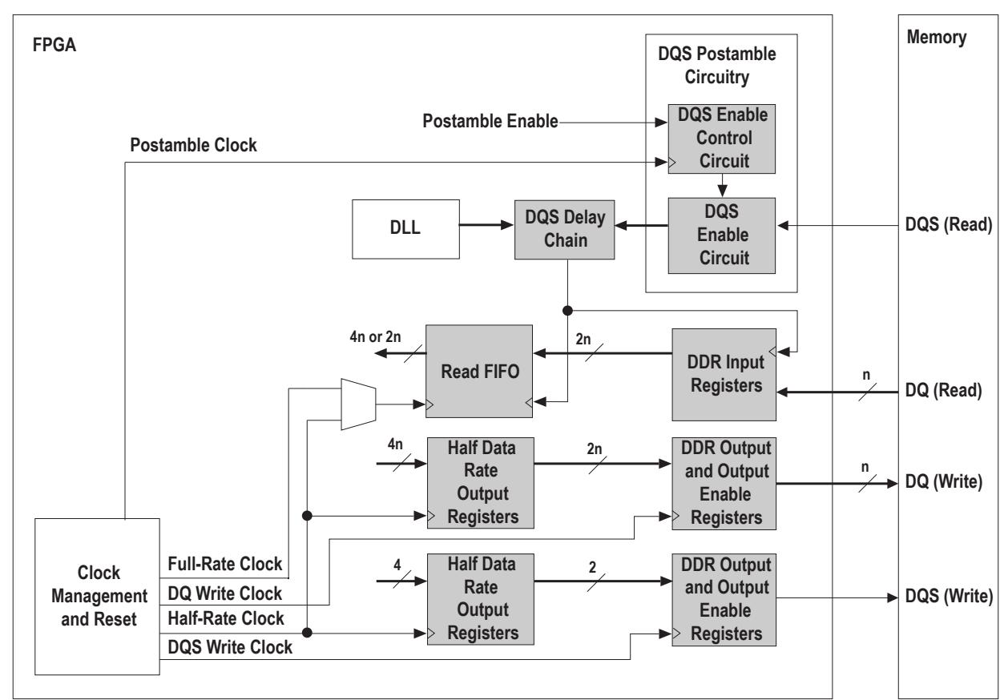

**Note: There are slight block differences for different memory interface standards. The shaded blocks are part of the I/O elements.**

#### **DQS Phase-Shift Circuitry**

The Cyclone V DLL provides phase shift to the DQS pins on read transactions if the DQS pins are acting as input clocks or strobes to the FPGA.

The following figures show how the DLLs are connected to the DQS pins in the various Cyclone V variants. The reference clock for each DLL may come from adjacent PLLs.

Note: The following figures show all possible connections for each device. For available pins and connections in each device package, refer to the device pin-out files.

**Figure 6-2: DQS Pins and DLLs in Cyclone V E (A2 and A4) Devices**

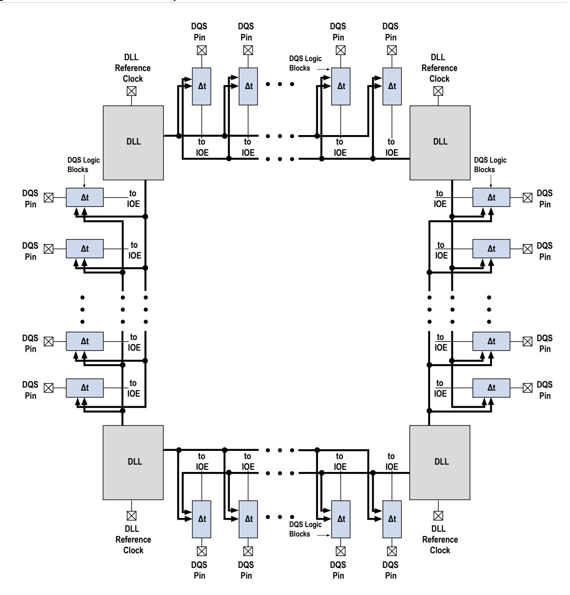

**Figure 6-3: DQS Pins and DLLs in Cyclone V GX (C3) Devices**

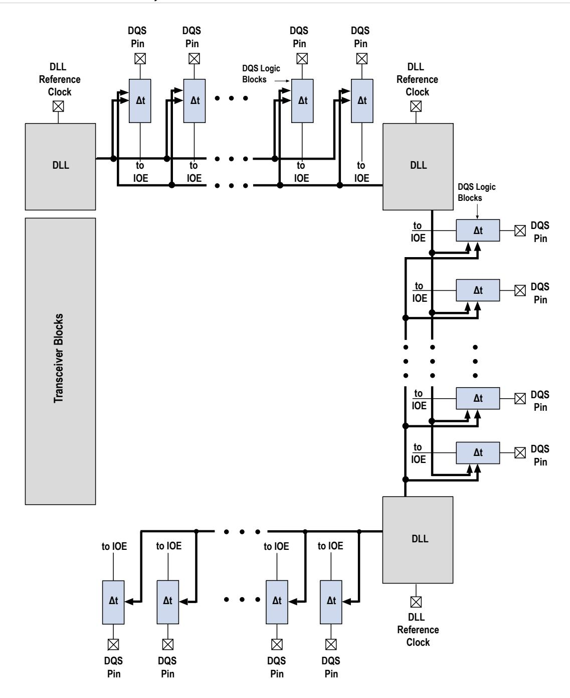

**Figure 6-4: DQS Pins and DLLs in Cyclone V E (A5, A7, and A9), GX (C4, C5, C7, and C9), GT (D5, D7, and D9) Devices**

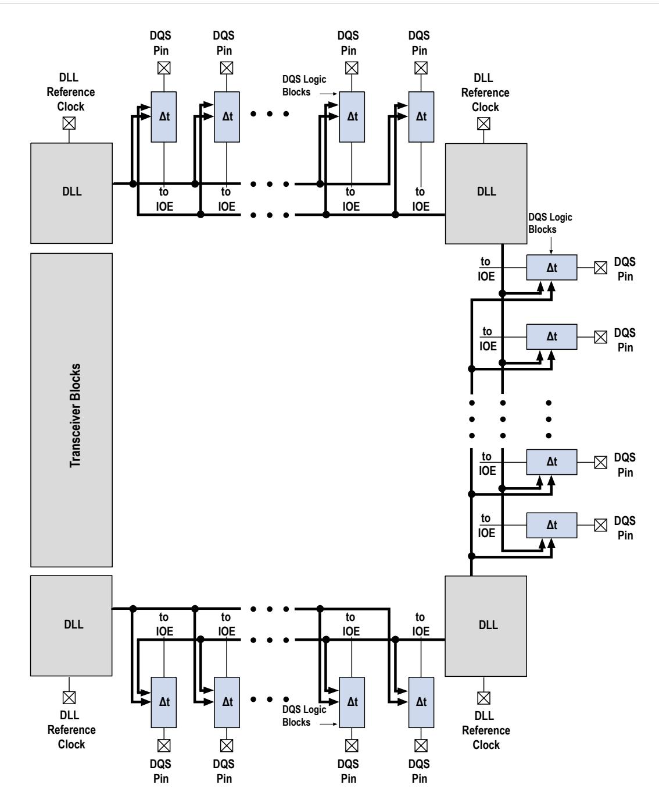

**Figure 6-5: DQS Pins and DLLs in Cyclone V SE (A2, A4, A5, and A6) Devices**

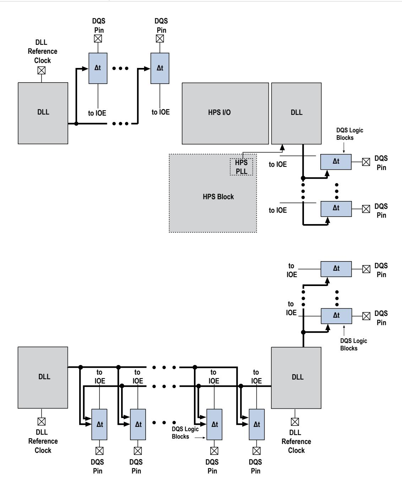

**Figure 6-6: DQS Pins and DLLs in Cyclone V SX (C2, C4, C5, and C6) and ST (D5 and D6) Devices**

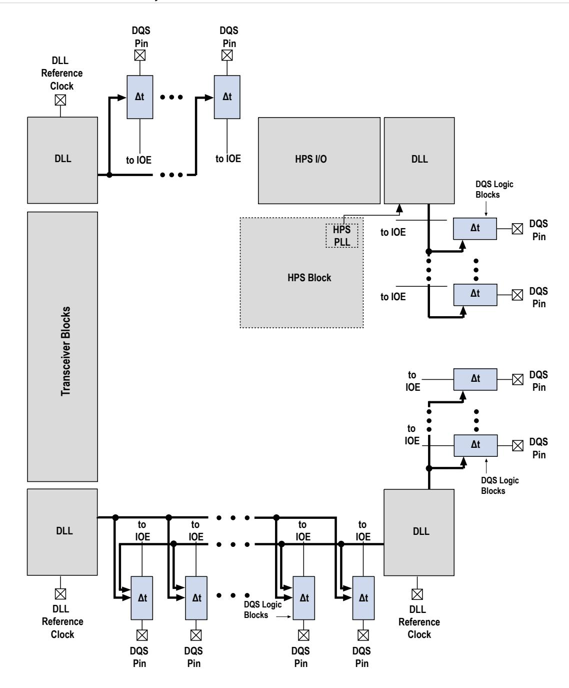

#### [Cyclone V Device Pin-Out Files](https://www.intel.com/content/www/us/en/programmable/support/literature/lit-dp.html#cyclone-v)

Download the relevant pin tables from this web page.

#### **Delay-Locked Loop**

The delay-locked loop (DLL) uses a frequency reference to dynamically generate control signals for the delay chains in each of the DQS pins, allowing the delay to compensate for process, voltage, and tempera‐ ture (PVT) variations. The DQS delay settings are gray-coded to reduce jitter if the DLL updates the settings.

There are a maximum of four DLLs, located in each corner of the Cyclone V devices. You can clock each DLL using different frequencies.

The DLLs can access the two adjacent sides from its location in the device. You can have two different interfaces with the same frequency on the two sides adjacent to a DLL, where the DLL controls the DQS delay settings for both interfaces.

I/O banks between two DLLs have the flexibility to create multiple frequencies and multiple-type interfaces. These banks can use settings from either or both adjacent DLLs. For example, DQS1R can get its phase-shift settings from DLL\_TR, while DQS2R can get its phase-shift settings from DLL\_BR.

The reference clock for each DLL may come from the PLL output clocks or clock input pins.

Note: If you have a dedicated PLL that only generates the DLL input reference clock, set the PLL mode to Direct Compensation to achieve better performance (or the Intel Quartus Prime software automati‐ cally changes it). Because the PLL does not use any other outputs, it does not have to compensate for any clock paths.

#### **DLL Reference Clock Input for Cyclone V Devices**

**Table 6-11: DLL Reference Clock Input from PLLs for Cyclone V E (A2, A4, A5, A7, and A9), GX (C4, C5, C7, and C9), and GT (D5, D7, and D9) Devices**

| DLL    |          |           | PLL         |              |
| ------ | -------- | --------- | ----------- | ------------ |
|        | Top Left | Top Right | Bottom Left | Bottom Right |
| DLL_TL | pllout   | —         | —           | —            |
| DLL_TR | —        | pllout    | —           | —            |
| DLL_BL | —        | —         | pllout      | —            |
| DLL_BR | —        | —         | —           | pllout       |

**Table 6-12: DLL Reference Clock Input from PLLs for Cyclone V GX (C3) Device**

| DLL    |          |           | PLL         |              |
| ------ | -------- | --------- | ----------- | ------------ |
|        | Top Left | Top Right | Bottom Left | Bottom Right |
| DLL_TL | pllout   | —         | —           | —            |
| DLL_TR | —        | pllout    | —           | —            |
| DLL_BL | —        | —         | —           | —            |
| DLL_BR | —        | —         | —           | pllout       |

**Table 6-13: DLL Reference Clock Input from PLLs for Cyclone V SE A2, A4, A5, and A6 Devices, Cyclone V SX C2, C4, C5, and C6 Devices, and Cyclone V ST D5 and D6 Devices**

| DLL    |          |           | PLL         |              |
| ------ | -------- | --------- | ----------- | ------------ |
|        | Top Left | Top Right | Bottom Left | Bottom Right |
| DLL_TL | pllout   | —         | —           | —            |
| DLL_TR | —        | —         | —           | —            |
| DLL_BL | —        | —         | pllout      | —            |
| DLL_BR | —        | —         | —           | pllout       |

#### **DLL Phase-Shift**

The DLL can shift the incoming DQS signals by 0° or 90°. The shifted DQS signal is then used as the clock for the DQ IOE input registers, depending on the number of DQS delay chains used.

All DQS pins referenced to the same DLL, can have their input signal phase shifted by a different degree amount but all must be referenced at one particular frequency. However, not all phase-shift combinations are supported. The phase shifts on the DQS pins referenced by the same DLL must all be a multiple of 90°.

The 7-bit DQS delay settings from the DLL vary with PVT to implement the phase-shift delay. For example, with a 0° shift, the DQS signal bypasses both the DLL and DQS logic blocks. The Intel Quartus Prime software automatically sets the DQ input delay chains, so that the skew between the DQ and DQS pins at the DQ IOE registers is negligible if a 0° shift is implemented. You can feed the DQS delay settings to the DQS logic block and logic array.

The shifted DQS signal goes to the DQS bus to clock the IOE input registers of the DQ pins. The signal can also go into the logic array for resynchronization if you are not using IOE read FIFO for resynchroniza‐ tion.

For Cyclone V SoC devices, you can feed the hard processor system (HPS) DQS delay settings to the HPS DQS logic block only.

#### **Figure 6-7: Simplified Diagram of the DQS Phase-Shift Circuitry**

This figure shows a simple block diagram of the DLL. All features of the DQS phase-shift circuitry are accessible from the UniPHY IP core in the Intel Quartus Prime software.

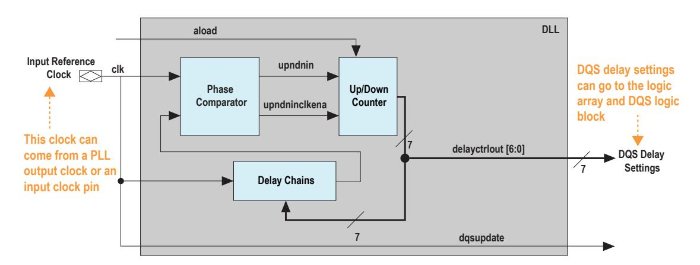

The input reference clock goes into the DLL to a chain of up to eight delay elements. The phase comparator compares the signal coming out of the end of the delay chain block to the input reference clock. The phase comparator then issues the upndn signal to the Gray-code counter. This signal increments or decrements a 7-bit delay setting (DQS delay settings) that increases or decreases the delay through the delay element chain to bring the input reference clock and the signals coming out of the delay element chain in phase.

The DLL can be reset from either the logic array or a user I/O pin. Each time the DLL is reset, you must wait for 2,560 clock cycles for the DLL to lock before you can capture the data properly. The DLL phase comparator requires 2,560 clock cycles to lock and calculate the correct input clock period.

For the frequency range of each DLL frequency mode, refer to the device datasheet.

#### Related Information

#### Cyclone V Device Datasheet

#### **PHY Clock (PHYCLK) Networks**

The PHYCLK network is a dedicated high-speed, low-skew balanced clock tree designed for a highperformance external memory interface.

The top and bottom sides of the Cyclone V devices have up to four PHYCLK networks each. There are up to two PHYCLK networks on the left and right side I/O banks. Each PHYCLK network spans across one I/O bank and is driven by one of the PLLs located adjacent to the I/O bank.

The following figures show the PHYCLK networks available in the Cyclone V devices.

**Figure 6-8: PHYCLK Networks in Cyclone V E A2 and A4 Devices**

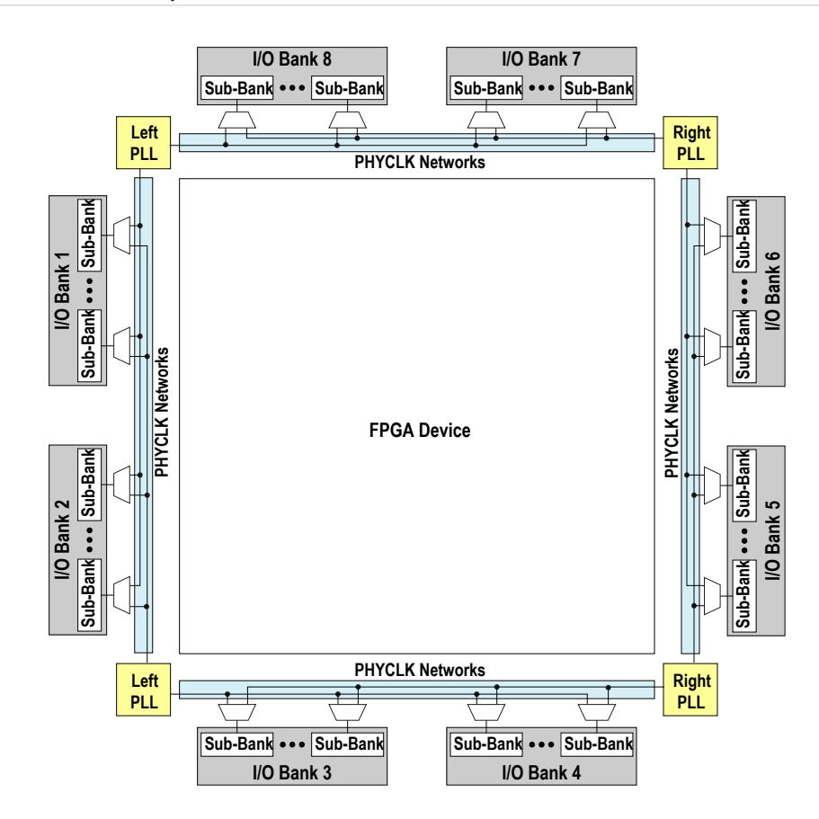

**Figure 6-9: PHYCLK Networks in Cyclone V GX C3 Devices**

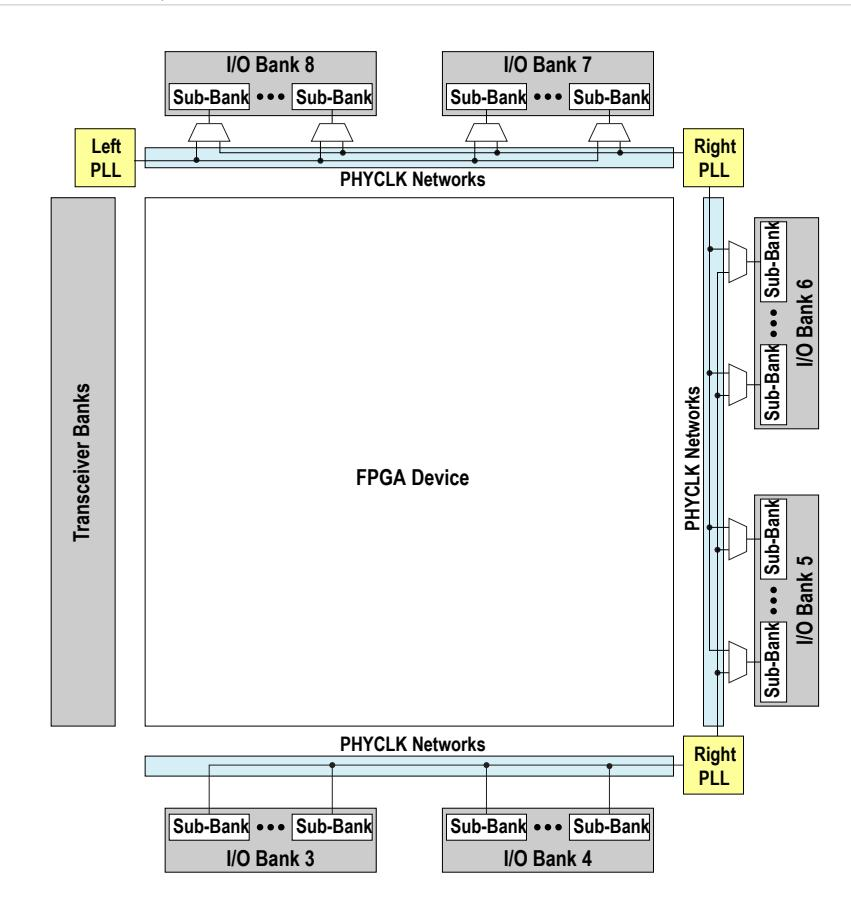

**Figure 6-10: PHYCLK Networks in Cyclone V E A7, A5, and A9 Devices, Cyclone V GX C4, C5, C7, and C9 Devices, and Cyclone V GT D5, D7, and D9 Devices**

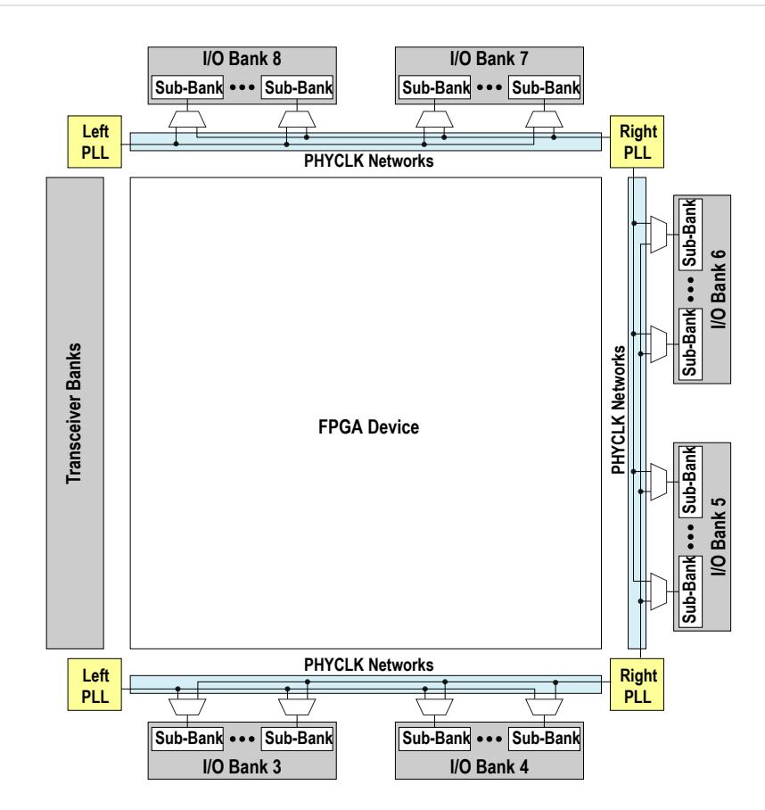

**Figure 6-11: PHYCLK Networks in Cyclone V SE A2, A4, A5, and A6 Devices**

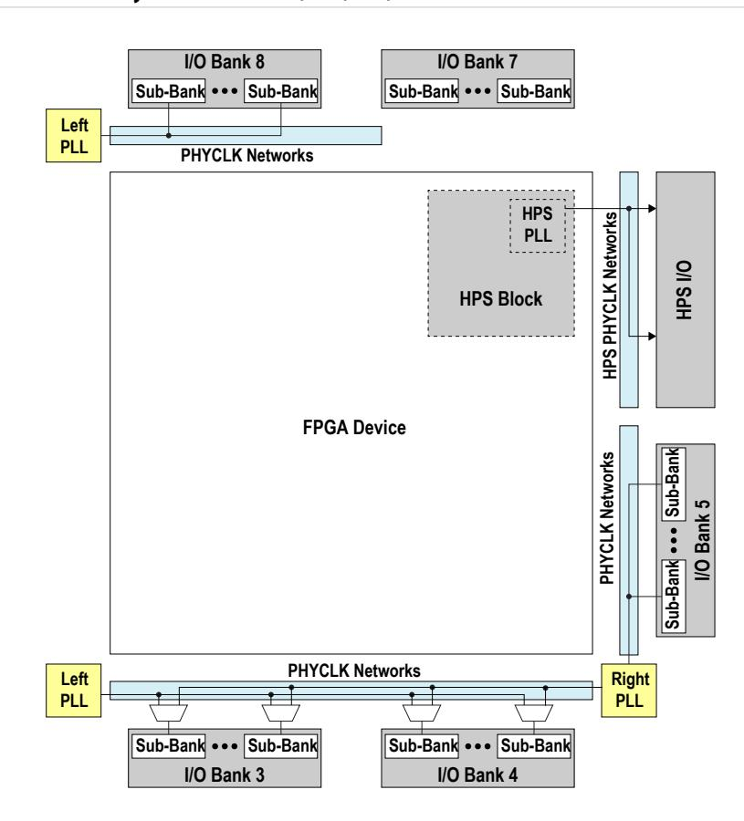

**Figure 6-12: PHYCLK Networks in Cyclone V SX C2, C4, C5, and C6 Devices, and Cyclone V ST D5 and D6 Devices**

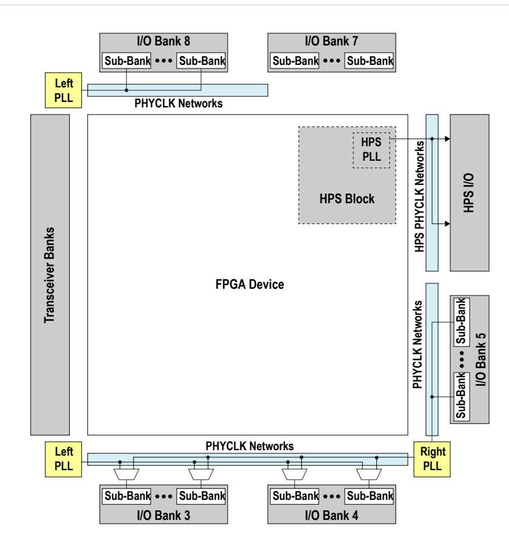

#### **DQS Logic Block**

Each DQS/CQ/CQn/QK# pin is connected to a separate DQS logic block, which consists of the update enable circuitry, DQS delay chains, and DQS postamble circuitry.

The following figure shows the DQS logic block.

**Figure 6-13: DQS Logic Block in Cyclone V Devices**

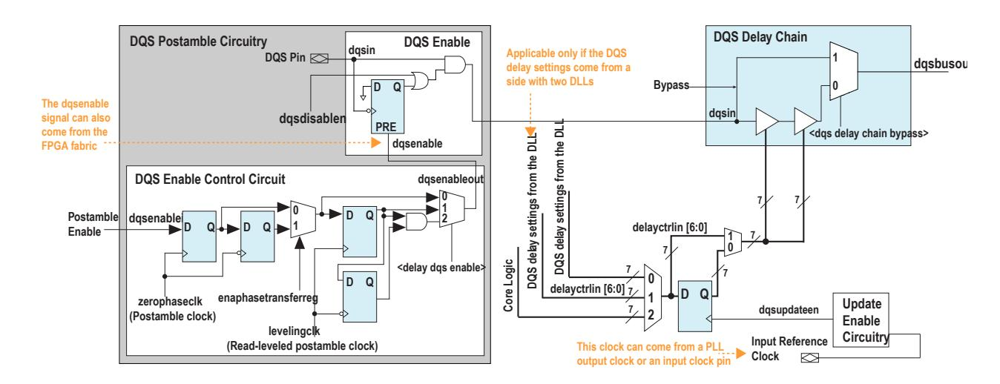

#### **Update Enable Circuitry**

The update enable circuitry enables the registers to allow enough time for the DQS delay settings to travel from the DQS phase-shift circuitry or core logic to all the DQS logic blocks before the next change.

Both the DQS delay settings and the phase-offset settings pass through a register before going into the DQS delay chains. The registers are controlled by the update enable circuitry to allow enough time for any changes in the DQS delay setting bits to arrive at all the delay elements, which allows them to be adjusted at the same time.

The circuitry uses the input reference clock or a user clock from the core to generate the update enable output. The UniPHY intellectual property (IP) uses this circuit by default.

**Figure 6-14: DQS Update Enable Waveform**

This figure shows an example waveform of the update enable circuitry output.

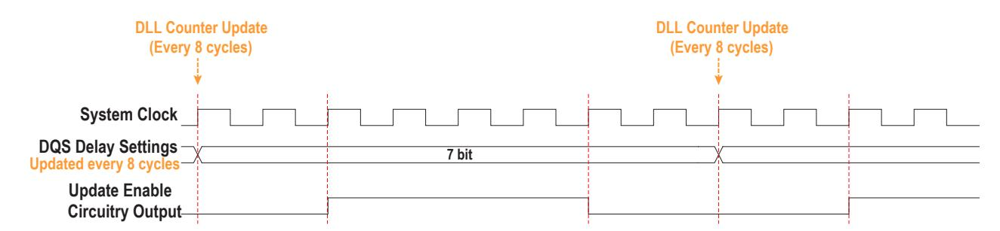

#### **DQS Delay Chain**

DQS delay chains consist of a set of variable delay elements to allow the input DQS signals to be shifted by the amount specified by the DQS phase-shift circuitry or the logic array.

There are two delay elements in the DQS delay chain that have the same characteristics:

- Delay elements in the DQS logic block
- Delay elements in the DLL

The DQS pin is shifted by the DQS delay settings.

The number of delay chains required is transparent because the UniPHY IP automatically sets it when you choose the operating frequency.

In the Cyclone V SE, SX, and ST devices, the DQS delay chain is controlled by the DQS phase-shift circuitry only.

#### Related Information

- ALTDQ\_DQS2 IP Core User Guide Provides more information about programming the delay chains.
- [Delay Chains](#page-226-0) on page 6-31

#### **DQS Postamble Circuitry**

There are preamble and postamble specifications for both read and write operations in DDR3 and DDR2 SDRAM. The DQS postamble circuitry ensures that data is not lost if there is noise on the DQS line during the end of a read operation that occurs while DQS is in a postamble state.

The Cyclone V devices contain dedicated postamble registers that you can control to ground the shifted DQS signal that is used to clock the DQ input registers at the end of a read operation. This function ensures that any glitches on the DQS input signal during the end of a read operation and occurring while DQS is in a postamble state do not affect the DQ IOE registers.

- For preamble state, the DQS is low, just after a high-impedance state.
- For postamble state, the DQS is low, just before it returns to a high-impedance state.

For external memory interfaces that use a bidirectional read strobe (DDR3 and DDR2 SDRAM), the DQS signal is low before going to or coming from a high-impedance state.

#### **Half Data Rate Block**

The Cyclone V devices contain a half data rate (HDR) block in the postamble enable circuitry.

The HDR block is clocked by the half-rate resynchronization clock, which is the output of the I/O clock divider circuit. There is an AND gate after the postamble register outputs to avoid postamble glitches from a previous read burst on a non-consecutive read burst. This scheme allows half-a-clock cycle latency for dqsenable assertion and zero latency for dqsenable deassertion.

Using the HDR block as the first stage capture register in the postamble enable circuitry block is optional. Altera recommends using these registers if the controller is running at half the frequency of the I/Os.

**Figure 6-15: Avoiding Glitch on a Non-Consecutive Read Burst Waveform**

This figure shows how to avoid postamble glitches using the HDR block.

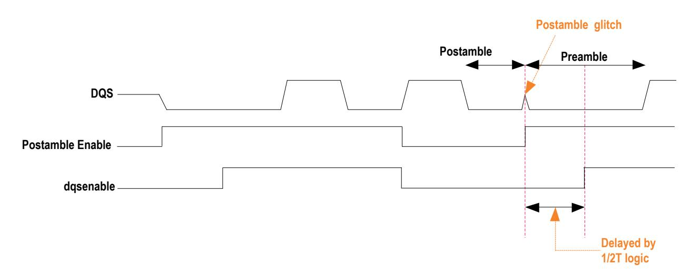

#### **Dynamic OCT Control**

The dynamic OCT control block includes all the registers that are required to dynamically turn the onchip parallel termination (RT OCT) on during a read and turn RT OCT off during a write.

**Figure 6-16: Dynamic OCT Control Block for Cyclone V Devices**

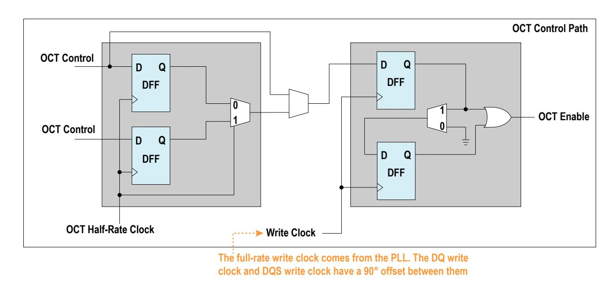

#### Related Information

[Dynamic OCT in Cyclone V Devices](#page-151-0) on page 5-45

Provides more information about dynamic OCT control.

#### **IOE Registers**

The IOE registers are expanded to allow source-synchronous systems to have faster register-to-FIFO transfers and resynchronization. All top, bottom, and right IOEs have the same capability.

#### **Input Registers**

The input path consists of the DDR input registers and the read FIFO block. You can bypass each block of the input path.

There are three registers in the DDR input registers block. Registers A and B capture data on the positive and negative edges of the clock while register C aligns the captured data. Register C uses the same clock as Register A.

The read FIFO block resynchronizes the data to the system clock domain and lowers the data rate to half rate.

The following figure shows the registers available in the Cyclone V input path. For DDR3 and DDR2 SDRAM interfaces, the DQS and DQSn signals must be inverted. If you use Altera's memory interface IPs, the DQS and DQSn signals are automatically inverted.

**Figure 6-17: IOE Input Registers for Cyclone V Devices**

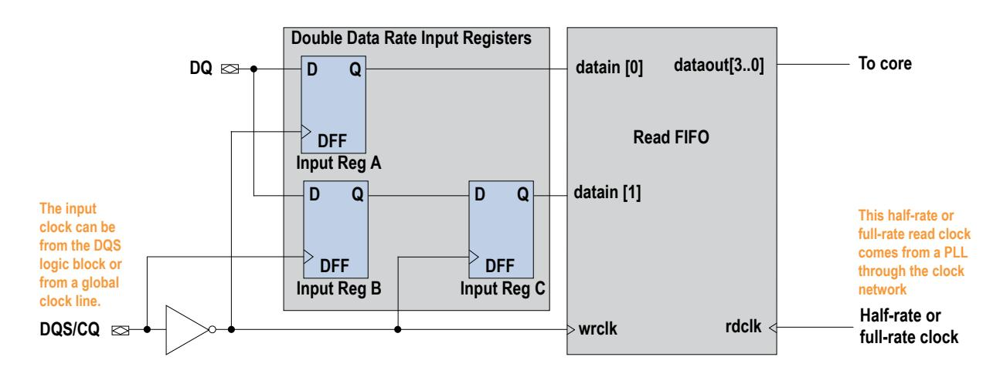

#### **Output Registers**

The Cyclone V output and output-enable path is divided into the HDR block, and output and outputenable registers. The device can bypass each block of the output and output-enable path.

The output path is designed to route combinatorial or registered single data rate (SDR) outputs and fullrate or half-rate DDR outputs from the FPGA core. Half-rate data is converted to full-rate with the HDR block, clocked by the half-rate clock from the PLL.

The output-enable path has a structure similar to the output path—ensuring that the output-enable path goes through the same delay and latency as the output path.

**Figure 6-18: IOE Output and Output-Enable Path Registers for Cyclone V Devices**

The following figure shows the registers available in the Cyclone V output and output-enable paths.

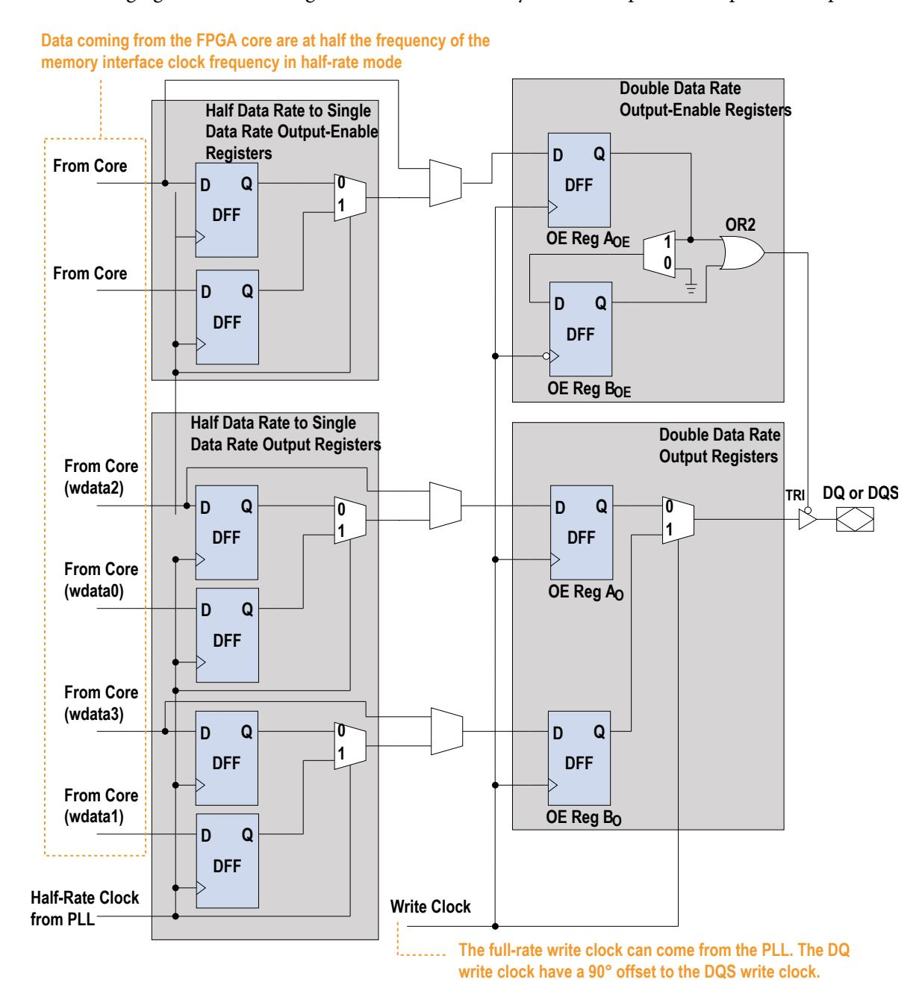

#### **Delay Chains**

The Cyclone V devices contain run-time adjustable delay chains in the I/O blocks and the DQS logic blocks. You can control the delay chain setting through the I/O or the DQS configuration block output. Every I/O block contains a delay chain between the following elements:

- The output registers and output buffer
- The input buffer and input register
- The output enable and output buffer
- The R T OCT enable-control register and output buffer

You can bypass the DQS delay chain to achieve a 0° phase shift.

**Figure 6-19: Delay Chains in an I/O Block**

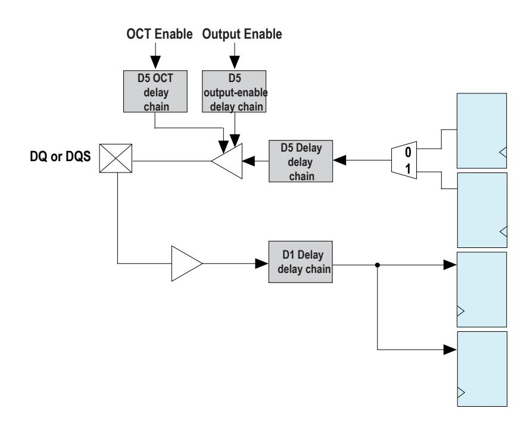

Each DQS logic block contains a delay chain after the dqsbusout output and another delay chain before the dqsenable input.

**Figure 6-20: Delay Chains in the DQS Input Path**

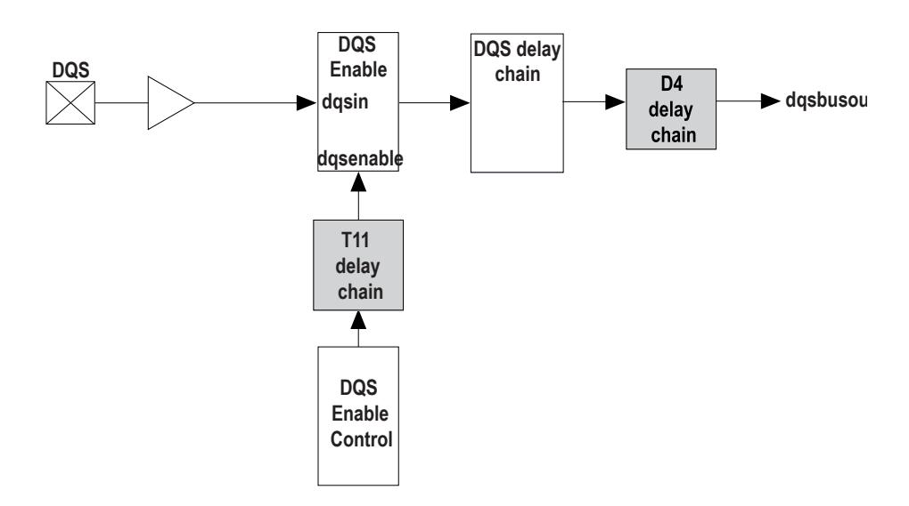

- ALTDQ\_DQS2 IP Core User Guide Provides more information about programming the delay chains.
- [DQS Delay Chain](#page-222-0) on page 6-27

#### **I/O and DQS Configuration Blocks**

The I/O and DQS configuration blocks are shift registers that you can use to dynamically change the settings of various device configuration bits.

- The shift registers power-up low.
- Every I/O pin contains one I/O configuration register.
- Every DQS pin contains one DQS configuration block in addition to the I/O configuration register.

#### **Figure 6-21: Configuration Block (I/O and DQS)**

This figure shows the I/O configuration block and the DQS configuration block circuitry.

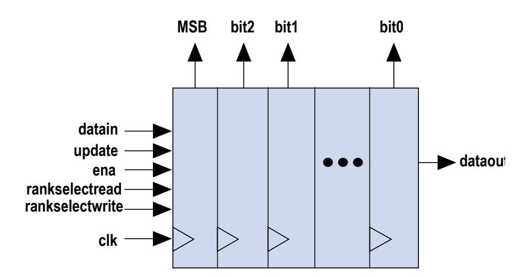

#### ALTDQ\_DQS2 IP Core User Guide

Provide details about the I/O and DQS configuration block bit sequence.

# **Hard Memory Controller**

The Cyclone V devices feature dedicated hard memory controllers. You can use the hard memory control‐ lers for LPDDR2, DDR2, and DDR3 SDRAM interfaces. Compared to the memory controllers implemented using core logic, the hard memory controllers allow support for higher memory interface frequencies with shorter latency cycles.

The hard memory controllers use dedicated I/O pins as data, address, command, control, clock, and ground pins for the SDRAM interface. If you do not use the hard memory controllers, you can use these dedicated pins as regular I/O pins.

#### Related Information

- Functional Description HPC II Controller Chapter, External The hard memory controller is functionally similar to the High-Performance Controller II (HPC II).
- Functional Description Hard Memory Interface, External Memory Interface Handbook Provides detailed information about application of the hard memory interface.

#### **Features of the Hard Memory Controller**

**Table 6-14: Features of the Cyclone V Hard Memory Controller**

| Feature                     | Description                                                                                                                                                                                                     |
| --------------------------- | --------------------------------------------------------------------------------------------------------------------------------------------------------------------------------------------------------------- |
| Memory Interface Data Width | <ul> <li>8, 16, and 32 bit data</li> <li>16 bit data + 8 bit ECC</li> <li>32 bit data + 8bit ECC</li> </ul>                                                                                                     |
| Memory Density              | The controller supports up to four gigabits density parts and two chip selects.                                                                                                                                 |
| Memory Burst Length         | <ul> <li>DDR3—Burst length of 8 and burst chop of 4</li> <li>DDR2—Burst lengths of 4 and 8</li> <li>LPDDR2—Burst lengths of 2, 4, 8, and 16</li> </ul>                                                          |
| Command and Data Reordering | The controller increases efficiency through the support for out-of-order execution of DRAM commands—with address collision detection-and in-order return of results.                                            |
| Starvation Control          | A starvation counter ensures that all requests are served after a predefined time-out period. This function ensures that data with low priority access are not left behind when reordering data for efficiency. |

| Feature                                                              | Description           |
| -------------------------------------------------------------------- | --------------------- |
| Avalon ®                                                             |                       |
| controller intelligently keeps a row open based on incoming traffic. | This feature improves |

| Feature | Description                                                                     |
| ------- | ------------------------------------------------------------------------------- |
| ECC     | Standard Hamming single error correction, double error detection (SECDED) error |
|         | ACTIVATE command to the bank prior to t RCD to increase the command efficiency. |

#### **Multi-Port Front End**

The multi-port front end (MPFE) and its associated fabric interface provide up to six command ports, four read-data ports and four write-data ports, through which user logic can access the hard memory controller.

**Figure 6-22: Simplified Diagram of the Cyclone V Hard Memory Interface**

This figure shows a simplified diagram of the Cyclone V hard memory interface with the MPFE.

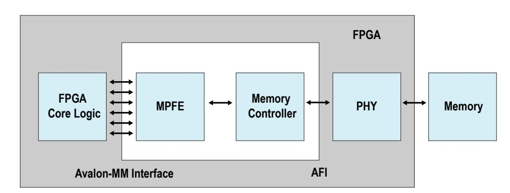

#### **Numbers of MPFE Ports Per Device**

**Table 6-15: Numbers of MPFE Command, Write-Data, and Read-Data Ports for Each Cyclone V Device**

| Variant Member Code | Command | MPFE Ports Write-data | Read-data |
| ------------------- | ------- | --------------------- | --------- |
| A2                  | 4       | 2                     | 2         |
| A4                  | 4       | 2                     | 2         |
| A5 Cyclone V E      | 6       | 4                     | 4         |
| A7                  | 6       | 4                     | 4         |
| A9                  | 6       | 4                     | 4         |
| C3                  | 4       | 2                     | 2         |
| C4                  | 6       | 4                     | 4         |
| C5 Cyclone V GX     | 6       | 4                     | 4         |
| C7                  | 6       | 4                     | 4         |
| C9                  | 6       | 4                     | 4         |
| D5                  | 6       | 4                     | 4         |
| D7 Cyclone V GT     | 6       | 4                     | 4         |
| D9                  | 6       | 4                     | 4         |

#### **Bonding Support**

Note: Bonding is supported only for hard memory controllers configured with one port. Do not use the bonding configuration when there is more than one port in each hard memory controller.

You can bond two hard memory controllers to support wider data widths.

If you bond two hard memory controllers, the data going out of the controllers to the user logic is synchronized. However, the data going out of the controllers to the memory is not synchronized.

The bonding controllers are not synchronized and remain independent with two separate address buses and two independent command buses. These buses are calibrated separately.

If you require ECC support for a bonded interface, you must implement the ECC logic external to the hard memory controllers.

Note: A memory interface that uses the bonding feature has higher average latency. Bonding through the core fabric will also cause a higher latency.

**Figure 6-23: Hard Memory Controllers Bonding Support in Cyclone V E A7, A5, and A9 Devices, Cyclone V GX C4, C5, C7, and C9 Devices, and Cyclone V GT D5, D7, and D9 Devices**

This figure shows the bonding of two opposite hard memory controllers through the core fabric.

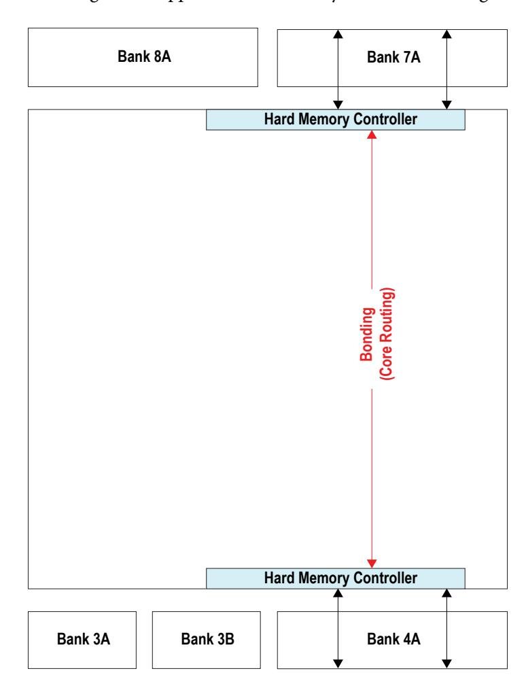

**Figure 6-24: Hard Memory Controllers in Cyclone V SX C2, C4, C5, and C6 Devices, and Cyclone V ST D5 and D6 Devices**

This figure shows hard memory controllers in the SoC devices. There is no bonding support.

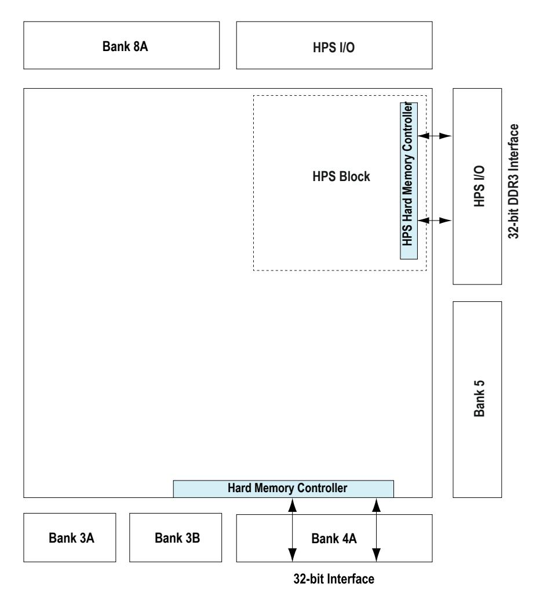

#### Related Information

- Cyclone**®** [V GX, GT, E, SX, ST and SE Device Family Pin Connection Guidelines](https://cdrdv2.intel.com/v1/dl/getContent/654351) Provides more information about the dedicated pins.
- [Bonding Does Not Work for Multiple MPFE Ports in Hard Memory Controller KDB](https://www.intel.com/content/www/us/en/support/programmable/articles/000084168.html)

#### **Hard Memory Controller Width for Cyclone V E**

**Table 6-16: Hard Memory Controller Width Per Side in Cyclone V E Devices**

| Package M383 M484 F256 U324 | Top ≤ 24 — 0 0 | A2 Bottom 0 — 0 0 | Top ≤ 24 — 0 0 | A4 Bottom 0 — 0 0 | Top ≤ 24 — — — | Member Code A5 Bottom 0 — — — | Top — 24 — — | A7 Bottom — 24 — — | Top — — — — | A9 Bottom — — — — |
| --------------------------- | -------------- | ----------------- | -------------- | ----------------- | -------------- | ----------------------------- | ------------ | ------------------ | ----------- | ----------------- |
| U484                        | 24             | 0                 | 24             | 0                 | 24             | 24                            | 24           | 24                 | 24          | 24                |
| F484                        | 24             | 0                 | 24             | 0                 | 40             | 24                            | 40           | 24                 | 24          | 24                |
| F672                        | —              | —                 | —              | —                 | —              | —                             | 40           | 40                 | 40          | 40                |
| F896                        | —              | —                 | —              | —                 | —              | —                             | 40           | 40                 | 40          | 40                |

#### Related Information

- Cyclone V Device Overview

Provides more information about which device packages and feature options contain hard memory controllers.

- [Guideline: Using DQ/DQS Pins](#page-198-0) on page 6-3

Important information about usable pin assignments for the hard memory controller in the F484 package of this device.

#### **Hard Memory Controller Width for Cyclone V GX**

**Table 6-17: Hard Memory Controller Width Per Side in Cyclone V GX Devices**

|         |        |      |        |      | Member Code |     |        |     |        |
| ------- | ------ | ---- | ------ | ---- | ----------- | --- | ------ | --- | ------ |
| Package | C3     |      | C4     |      | C5          |     | C7     |     | C9     |
| Top     | Bottom | Top  | Bottom | Top  | Bottom      | Top | Bottom | Top | Bottom |
| — M30   | —      | 0    | 0      | 0    | 0           | —   | —      | —   | —      |
| — M38   | —      | ≤ 24 | 0      | ≤ 24 | 0           | —   | —      | —   | —      |
| — M48   | —      | —    | —      | —    | —           | 24  | 24     | —   | —      |
| 0 U32   | 0      | —    | —      | —    | —           | —   | —      | —   | —      |

| Package | Top | C3 Bottom | Top | C4 Bottom | Top | Member Code C5 Bottom | Top | C7 Bottom | Top | C9 Bottom |
| ------- | --- | --------- | --- | --------- | --- | --------------------- | --- | --------- | --- | --------- |
| U48     | 24  | 0         | 24  | 24        | 24  | 24                    | 24  | 24        | 24  | 24        |
| F484    | 24  | 0         | 40  | 24        | 40  | 24                    | 40  | 24        | 24  | 24        |
| F672    | —   | —         | 40  | 40        | 40  | 40                    | 40  | 40        | 40  | 40        |
| F896    | —   | —         | —   | —         | —   | —                     | 40  | 40        | 40  | 40        |
| F115    | —   | —         | —   | —         | —   | —                     | —   | —         | 40  | 40        |

- Cyclone V Device Overview

Provides more information about which device packages and feature options contain hard memory controllers.

- [Guideline: Using DQ/DQS Pins](#page-198-0) on page 6-3

Important information about usable pin assignments for the hard memory controller in the F484 package of this device.

#### **Hard Memory Controller Width for Cyclone V GT**

**Table 6-18: Hard Memory Controller Width Per Side in Cyclone V GT Devices**

| Package M301 M383 M484 | Top 0 ≤ 24 — | D5 Bottom 0 0 — | Top — — 24 | Member Code D7 Bottom — — 24 | Top — — — | D9 Bottom — — — |
| ---------------------- | ------------ | --------------- | ---------- | ---------------------------- | --------- | --------------- |
| U484                   | 24           | 24              | 24         | 24                           | 24        | 24              |
| F484                   | 40           | 24              | 40         | 24                           | 24        | 24              |
| F672                   | 40           | 40              | 40         | 40                           | 40        | 40              |
| F896                   | —            | —               | 40         | 40                           | 40        | 40              |
| F1152                  | —            | —               | —          | —                            | 40        | 40              |

- • Cyclone V Device Overview

Provides more information about which device packages and feature options contain hard memory controllers.

- [Guideline: Using DQ/DQS Pins](#page-198-0) on page 6-3

Important information about usable pin assignments for the hard memory controller in the F484 package of this device.

#### **Hard Memory Controller Width for Cyclone V SE**

**Table 6-19: Hard Memory Controller Width Per Side in Cyclone V SE Devices**

| Package | Top | A2 Bottom | Top | A4 Bottom | Member Code Top | A5 Bottom | Top | A6 Bottom |
| ------- | --- | --------- | --- | --------- | --------------- | --------- | --- | --------- |
| U484    | 0   | 0         | 0   | 0         | 0               | 0         | 0   | 0         |
| U672    | 0   | 40        | 0   | 40        | 0               | 40        | 0   | 40        |
| F896    | —   | —         | —   | —         | 0               | 40        | 0   | 40        |

**Table 6-20: HPS Hard Memory Controller Width in Cyclone V SE Devices**

| Package | A2  | A4  | Member Code A5 | A6  |
| ------- | --- | --- | -------------- | --- |
| U484    | 32  | 32  | 32             | 32  |
| U672    | 40  | 40  | 40             | 40  |
| F896    | —   | —   | 40             | 40  |

#### Related Information

#### Cyclone V Device Overview

Provides more information about which device packages and feature options contain hard memory controllers.

#### **Hard Memory Controller Width for Cyclone V SX**

**Table 6-21: Hard Memory Controller Width Per Side in Cyclone V SX Devices**

| Package | Member Code |        |     |        |     |        |     |        |
| ------- | ----------- | ------ | --- | ------ | --- | ------ | --- | ------ |
|         | C2          |        | C4  |        | C5  |        | C6  |        |
|         | Top         | Bottom | Top | Bottom | Top | Bottom | Top | Bottom |
| U672    | 0           | 40     | 0   | 40     | 0   | 40     | 0   | 40     |

| Package | Member Code |        |     |        |     |        |     |        |
| ------- | ----------- | ------ | --- | ------ | --- | ------ | --- | ------ |
|         | C2          |        | C4  |        | C5  |        | C6  |        |
|         | Top         | Bottom | Top | Bottom | Top | Bottom | Top | Bottom |
| F896    | —           | —      | —   | —      | 0   | 40     | 0   | 40     |

**Table 6-22: HPS Hard Memory Controller Width in Cyclone V SX Devices**

|   |   Package |   Member Code |   Package |   Member Code |   Package |
| -------------- | ---------------------- | -------------------------- | ---------------------- | -------------------------- | ---------------------- |
|                | C2                     | C4                         | C5                     | C6                         | C6                     |
| U672           | 40                     | 40                         | 40                     | 40                         | 40                     |
| F896           | —                      | —                          | 40                     | 40                         | 40                     |

#### Cyclone V Device Overview

Provides more information about which device packages and feature options contain hard memory controllers.

#### **Hard Memory Controller Width for Cyclone V ST**

**Table 6-23: Hard Memory Controller Width Per Side in Cyclone V ST Devices**

| Package | Member Code |        |     |        |
| ------- | ----------- | ------ | --- | ------ |
|         | D5          |        | D6  |        |
|         | Top         | Bottom | Top | Bottom |
| F896    | 0           | 40     | 0   | 40     |

**Table 6-24: HPS Hard Memory Controller Width in Cyclone V ST Devices**

|      | Package | Member Code |     | Package |
| ---- | ------- | ----------- | --- | ------- |
|      |         | D5          |     | D6      |
| F896 |         | 40          |     | 40      |

#### Related Information

#### Cyclone V Device Overview

Provides more information about which device packages and feature options contain hard memory controllers.

## **External Memory Interfaces in Cyclone V Devices Revision History**

| Document Version | Changes                                                                                                                                                  |
| ---------------- | -------------------------------------------------------------------------------------------------------------------------------------------------------- |
| 2022.07.05       | Updated the table that lists the hard memory controller widths for Cyclone V E devices to add information for package U484 of the Cyclone V E A9 device. |

| Date         | Version    | Changes                                                           |
| ------------ | ---------- | ----------------------------------------------------------------- |
| March 2015   | 2015.03.31 | Removed all preliminary data.                                     |
| January 2015 | 2015.01.23 | Added Cyclone V SE device in the Guideline: Using DQ/DQS Pins to  |
| June 2014    | 2014.06.30 | Added links to the Cyclone V Device Overview for more information |

| Date         | Version    | Changes                                                                                                                                                                                                                                                                                                                                                                                                                                                                                                                                                                                                                                                                                                                                                                                                                                                                                                                                                                                                                                                                                                                                                                                                                                                                                                                                                                                                                                                                                                                                                                                                                                         |
| ------------ | ---------- | ----------------------------------------------------------------------------------------------------------------------------------------------------------------------------------------------------------------------------------------------------------------------------------------------------------------------------------------------------------------------------------------------------------------------------------------------------------------------------------------------------------------------------------------------------------------------------------------------------------------------------------------------------------------------------------------------------------------------------------------------------------------------------------------------------------------------------------------------------------------------------------------------------------------------------------------------------------------------------------------------------------------------------------------------------------------------------------------------------------------------------------------------------------------------------------------------------------------------------------------------------------------------------------------------------------------------------------------------------------------------------------------------------------------------------------------------------------------------------------------------------------------------------------------------------------------------------------------------------------------------------------------------- |
| January 2014 | 2014.01.10 | <ul> <li>• Added Cyclone V SE DLL reference clock input information.</li> <li>• Added the DQ/DQS groups table for Cyclone V SE.</li> <li>• Added the DQS pins and DLLs figure for Cyclone V SE.</li> <li>• Added the PHYCLK networks figure for Cyclone V SE.</li> <li>• Updated the DQ/DQS numbers for the M383 package of Cyclone V E, GX, and GT variants.</li> <li>• Removed the statement about the bottom hard memory controller restrictions in the figure that shows the Cyclone V GX C5 hard memory controller bonding.</li> <li>• Added information about the hard memory controller interface widths for the Cyclone V SE.</li> <li>• Added the HPS hard memory controller widths for Cyclone V SE, SX, and ST.</li> <li>• Added related information link to <a href="#">ALTDQ_DQS2 Megafunction User Guide</a> for more information about using the delay chains.</li> <li>• Changed all "SoC FPGA" to "SoC".</li> <li>• Added links to Altera's <a href="#">External Memory Spec Estimator</a> tool to the topics listing the external memory interface performance.</li> <li>• Updated the topic about using DQ/DQS pins to specify that only some specific DQ pins can also be used as RZQ pins.</li> <li>• Updated the topic about DQS delay chain to remove statements about using <code>delayctrlin[6..0]</code> signals in UniPHY IP to input your own gray-coded 7 bit settings. This mode is not recommended with the UniPHY controllers.</li> <li>• Updated topic about hard memory controller bonding support to specify that bonding is supported only for hard memory controllers configured with one port.</li> </ul> |

| Date          | Version    | Changes                                                                                                                                                                                                                                                                                                                                                                                                                                                                                                                                                                                                                                                                                                                                                                                                                                                                                                                                                                                                                                                                                                                                                                                                                                                                                                                                                                                                        |
| ------------- | ---------- | -------------------------------------------------------------------------------------------------------------------------------------------------------------------------------------------------------------------------------------------------------------------------------------------------------------------------------------------------------------------------------------------------------------------------------------------------------------------------------------------------------------------------------------------------------------------------------------------------------------------------------------------------------------------------------------------------------------------------------------------------------------------------------------------------------------------------------------------------------------------------------------------------------------------------------------------------------------------------------------------------------------------------------------------------------------------------------------------------------------------------------------------------------------------------------------------------------------------------------------------------------------------------------------------------------------------------------------------------------------------------------------------------------------- |
| May 2013      | 2013.05.06 | <ul> <li>• Moved all links to the Related Information section of respective topics for easy reference.</li> <li>• Added link to the known document issues in the Knowledge Base.</li> <li>• Added the supported minimum operating frequencies for the supported memory interface standards.</li> <li>• Added packages and updated the DQ/DQS groups of Cyclone V E, GX, GT, and SX devices.</li> <li>• Added the number of MPFE command, write-data, and read-data ports for each Cyclone V E, GX, and GT device.</li> <li>• Added a note about the usable hard memory controller pin assignments for the F484 package of the Cyclone V E A9, GX C9, and GT D9 devices.</li> <li>• Updated the M386 package to M383.</li> <li>• Removed the F672 package from the Cyclone V E A5 device in the table listing Cyclone V E hard memory controller widths.</li> <li>• Added the U484 package for the Cyclone V GX C9 device in the table listing Cyclone V GX hard memory controller widths.</li> <li>• Updated the hard memory controller widths of Cyclone V E, GX, SX, and ST.</li> <li>• Removed the restrictions on using the bottom hard memory controller of the Cyclone V GX C5 device if the configuration is 3.3/3.0 V.</li> <li>• Added note to clarify that the DQS phase-shift circuitry figures show all possible connections and the device pin-out files have per package information.</li> </ul> |
| December 2012 | 2012.11.28 | <ul> <li>• Reorganized content and updated template.</li> <li>• Added a list of supported external memory interface standards using the hard memory controller and soft memory controller.</li> <li>• Added performance information for external memory interfaces and the HPS external memory interfaces.</li> <li>• Separated the DQ/DQS groups tables into separate topics for each device variant for easy reference.</li> <li>• Updated the DQ/DQS numbers and device packages for the Cyclone V E, GX, GT, SX, and ST variants.</li> <li>• Moved the PHYCLK networks pin placement guideline to the <a href="#">Planning Pin and FPGA Resources</a> chapter of the <i>External Memory Interface Handbook</i>.</li> <li>• Moved information from the "Design Considerations" section into relevant topics.</li> <li>• Removed the "DDR2 SDRAM Interface" and "DDR3 SDRAM DIMM" sections. Refer to the relevant sections in the <a href="#">External Memory Interface Handbook</a> for the information.</li> </ul>                                                                                                                                                                                                                                                                                                                                                                                         |

| Date          | Version | Changes                                            |
| ------------- | ------- | -------------------------------------------------- |
| June 2012     | 2.0     | Updated for the Quartus II software v12.0 release: |
| February 2012 | 1.2     | Updated Figure 6–20.                               |
|               | 1.1     | Updated Table 6–2.                                 |
| October 2011  | 1.0     | Initial release.                                   |

# Configuration, Design Security, and Remote System Upgrades in Cyclone V Devices

# 7

2023.10.18

CV-52007

Subscribe

Send Feedback

This chapter describes the configuration schemes, design security, and remote system upgrade that are supported by the Cyclone V devices.

## Related Information

- • [Cyclone® V Device Handbook: Known Issues](#)  
  Lists the planned updates to the *Cyclone V Device Handbook* chapters.
- • [Cyclone V Device Overview](#)  
  Provides more information about configuration features supported for each configuration scheme.
- • [Cyclone V Device Datasheet](#)  
  Provides more information about the estimated uncompressed .rbf file sizes, FPP DCLK-to-DATA [ ] ratio, and timing parameters.
- • [Configuration via Protocol \(CvP\) Implementation in V-series FPGA Devices User Guide](#)  
  Provides more information about the CvP configuration scheme.
- • [Introduction to the Hard Processor System, Cyclone® V Hard Processor System Technical Reference Manual](#)  
  Provides more information about configuration via HPS configuration scheme.
- • [Design Planning for Partial Reconfiguration, Intel® Quartus® Prime Standard Edition User Guide: Partial Reconfiguration](#)  
  Provides more information about partial reconfiguration.

## Enhanced Configuration and Configuration via Protocol

Cyclone V devices support 1.8 V, 2.5 V, 3.0 V, and 3.3 V programming voltages and several configuration schemes.

Intel Corporation. All rights reserved. Intel, the Intel logo, Altera, Arria, Cyclone, Enpirion, MAX, Nios, Quartus and Stratix words and logos are trademarks of Intel Corporation or its subsidiaries in the U.S. and/or other countries. Intel warrants performance of its FPGA and semiconductor products to current specifications in accordance with Intel's standard warranty, but reserves the right to make changes to any products and services at any time without notice. Intel assumes no responsibility or liability arising out of the application or use of any information, product, or service described herein except as expressly agreed to in writing by Intel. Intel customers are advised to obtain the latest version of device specifications before relying on any published information and before placing orders for products or services.

\*Other names and brands may be claimed as the property of others.

ISO  
9001:2015  
Registered

**Table 7-1: Configuration Schemes and Features Supported by Cyclone V Devices**

| Mode       | Data    |     |     |     |     |             |     |
| ---------- | ------- | --- | --- | --- | --- | ----------- | --- |
|            |         |     |     |     |     | ration (19) |     |
|            |         | 100 | —   | Yes | Yes | —           | Yes |
|            | 1 bit   | 125 | 125 | Yes | Yes | —           | —   |
|            | 8 bits  | 125 | —   | Yes | Yes | —           |     |
|            | 16 bits | 125 | —   | Yes | Yes | Yes         |     |
| CvP (PCIe) | x1, x2, |     |     |     |     |             |     |
|            |         | —   | —   | Yes | Yes | Yes         | —   |
| JTAG       | 1 bit   | 33  | 33  | —   | —   | —           | —   |

Instead of using an external flash or ROM, you can configure the Cyclone V devices through PCIe using CvP. The CvP mode offers the fastest configuration rate and flexibility with the easy-to-use PCIe hard IP block interface. The Cyclone V CvP implementation conforms to the PCIe 100 ms power-up-to-active time requirement.

#### Related Information

#### Configuration via Protocol (CvP) Implementation in V-series FPGA Devices User Guide

Provides more information about the CvP configuration scheme.

# **MSEL Pin Settings**

To select a configuration scheme, hardwire the MSEL pins to VCCPGM or GND without pull-up or pull-down resistors.

Note: Altera recommends connecting the MSEL pins directly to VCCPGM or GND. Driving the MSEL pins from a microprocessor or another controlling device may not guarantee the VIL or VIH of the MSEL pins. The VIL or VIH of the MSEL pins must be maintained throughout configuration stages.

(19) The partial reconfiguration feature is available for Cyclone V E, GX, SE, and SX devices with the "SC" suffix in the part number. For device availability and ordering, contact your local Intel sales representatives.

**Table 7-2: MSEL Pin Settings for Each Configuration Scheme of Cyclone V Devices**

| Configuration Scheme | Compression |          |                 |          |                        |
| -------------------- | ----------- | -------- | --------------- | -------- | ---------------------- |
|                      |             |          | V CCPGM (V)     | Power-On |                        |
|                      | Disabled    | Disabled | 1.8/2.5/3.0/3.3 |          |                        |
|                      |             |          |                 | Fast     | 10100                  |
|                      |             |          |                 | Standard | 11000                  |
|                      | Disabled    | Enabled  | 1.8/2.5/3.0/3.3 |          |                        |
|                      |             |          |                 | Fast     | 10101                  |
|                      |             |          |                 | Standard | 11001                  |
|                      | Enabled     | Enabled/ |                 |          |                        |
|                      |             | Disabled | 1.8/2.5/3.0/3.3 |          |                        |
|                      |             |          |                 | Fast     | 10110                  |
|                      |             |          |                 | Standard | 11010                  |
| FPP x16 (20)         |             |          |                 |          |                        |
|                      | Disabled    | Disabled | 1.8/2.5/3.0/3.3 |          |                        |
|                      |             |          |                 | Fast     | 00000                  |
|                      |             |          |                 | Standard | 00100                  |
|                      | Disabled    | Enabled  | 1.8/2.5/3.0/3.3 |          |                        |
|                      |             |          |                 | Fast     | 00001                  |
|                      |             |          |                 | Standard | 00101                  |
|                      | Enabled     | Enabled/ |                 |          |                        |
|                      |             | Disabled | 1.8/2.5/3.0/3.3 |          |                        |
|                      |             |          |                 | Fast     | 00010                  |
|                      |             |          |                 | Standard | 00110                  |
| PS                   | Enabled/    |          |                 |          |                        |
|                      |             | Disabled | 1.8/2.5/3.0/3.3 |          |                        |
|                      |             |          |                 | Fast     | 10000                  |
|                      |             |          |                 | Standard | 10001                  |
| AS (x1 and x4)       | Enabled/    |          |                 |          |                        |
|                      |             | Disabled | 3.0/3.3         |          |                        |
|                      |             |          |                 | Fast     | 10010                  |
|                      |             |          |                 | Standard | 10011                  |
|                      | Disabled    | Disabled | —               | —        | Use any valid MSEL pin |

Note: You must also select the configuration scheme in the Configuration page of the Device and Pin Options dialog box in the Intel Quartus Prime software. Based on your selection, the option bit in the programming file is set accordingly.

#### Related Information

- FPGA Manager, Cyclone**®** V Hard Processor System Technical Reference Manual Provides more information about the MSEL pin settings for configuration with hard processor system (HPS) in system on a chip (SoC) FPGA devices.
- Cyclone**®** [V GX, GT, E, SX, ST and SE Device Family Pin Connection Guidelines](https://cdrdv2.intel.com/v1/dl/getContent/654351) Provides more information about JTAG pins voltage-level connection.

#### **Configuration Sequence**

Describes the configuration sequence and each configuration stage.

(20) For configuration with HPS in SoC FPGA devices, refer to the FPGA Manager for the related MSEL pin settings.

**Figure 7-1: Configuration Sequence for Cyclone V Devices**

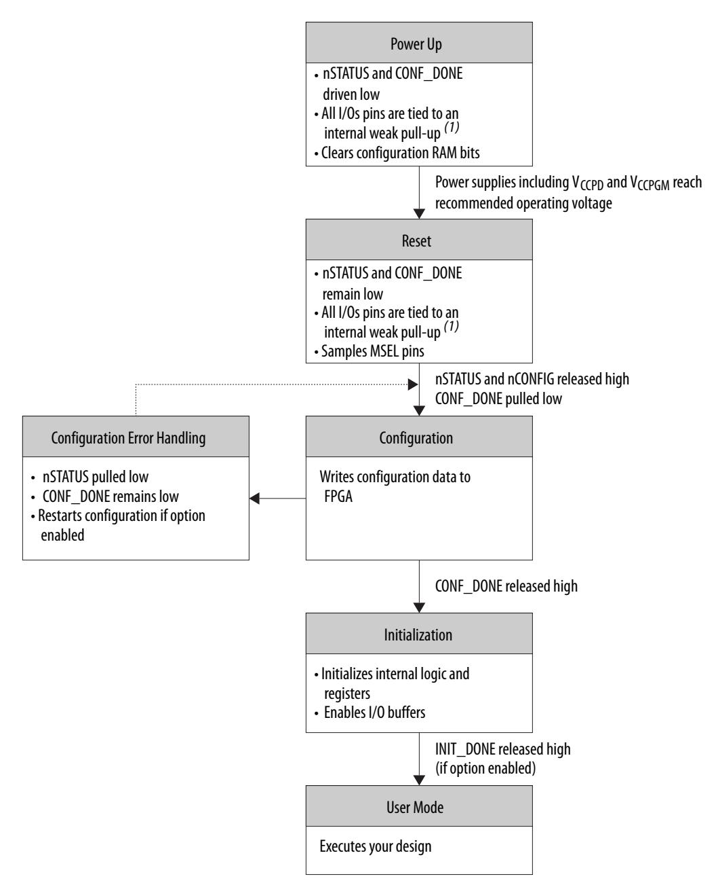

Note:

(1) The weak-pull up is enabled after the device has exited POR.

You can initiate reconfiguration by pulling the nCONFIG pin low to at least the minimum tCFG low-pulse width except for configuration using the partial reconfiguration operation. When this pin is pulled low, the nSTATUS and CONF\_DONE pins are pulled low and all I/O pins are tied to an internal weak pull-up.

#### **Power Up**

Power up all the power supplies that are monitored by the POR circuitry. All power supplies, including VCCPGM and VCCPD, must ramp up from 0 V to the recommended operating voltage level within the ramp-up time specification. Otherwise, hold the nCONFIG pin low until all the power supplies reach the recommended voltage level.

#### **VCCPGM Pin**

The configuration input buffers do not have to share power lines with the regular I/O buffers in Cyclone V devices.

The operating voltage for the configuration input pin is independent of the I/O banks power supply, VCCIO, during configuration. Therefore, Cyclone V devices do not require configuration voltage constraints on VCCIO.

#### **VCCPD Pin**

Use the VCCPD pin, a dedicated programming power supply, to power the I/O pre-drivers and JTAG I/O pins (TCK, TMS, TDI, and TDO). The supported configuration voltages are 2.5, 3.0, and 3.3 V.

If VCCIO of the bank is set to 2.5 V or lower, VCCPD must be powered up at 2.5 V. If VCCIO is set greater than 2.5 V, VCCPD must be greater than VCCIO. For example, when VCCIO is set to 3.0 V, VCCPD must be set at 3.0 V or above. When VCCIO is set to 3.3 V, VCCPD must be set at 3.3 V.

#### Related Information

- Cyclone V Device Datasheet Provides more information about the ramp-up time specifications.
- Cyclone**®** [V GX, GT, E, SX, ST and SE Device Family Pin Connection Guidelines](https://cdrdv2.intel.com/v1/dl/getContent/654351) Provides more information about configuration pin connections.
- [Device Configuration Pins](#page-253-0) on page 7-11 Provides more information about configuration pins.
- [I/O Standards Voltage Levels in Cyclone V Devices](#page-115-0) on page 5-9 Provides more information about typical power supplies for each supported I/O standards in Cyclone V devices.

#### **Reset**

POR delay is the time frame between the time when all the power supplies monitored by the POR circuitry reach the recommended operating voltage and when nSTATUS is released high and the Cyclone V device is ready to begin configuration.

Set the POR delay using the MSEL pins.

The user I/O pins are tied to an internal weak pull-up until the device is configured.

#### Related Information

- [MSEL Pin Settings](#page-244-0) on page 7-2
- Cyclone V Device Datasheet Provides more information about the POR delay specification.

#### **Configuration**

For more information about the DATA[] pins for each configuration scheme, refer to the appropriate configuration scheme.

#### **Configuration Error Handling**

To restart configuration automatically, turn on the Auto-restart configuration after error option in the General page of the Device and Pin Options dialog box in the Intel Quartus Prime software.

If you do not turn on this option, you can monitor the nSTATUS pin to detect errors. To restart configura‐ tion, pull the nCONFIG pin low for at least the duration of tCFG.

#### Related Information

#### Cyclone V Device Datasheet

Provides more information about tSTATUS and tCFG timing parameters.

#### **Initialization**

The initialization clock source is from the internal oscillator, CLKUSR pin, or DCLK pin. By default, the internal oscillator is the clock source for initialization. If you use the internal oscillator, the Cyclone V device will be provided with enough clock cycles for proper initialization.

Note: If you use the optional CLKUSR pin as the initialization clock source and the nCONFIG pin is pulled low to restart configuration during device initialization, ensure that the CLKUSR or DCLK pin continues toggling until the nSTATUS pin goes low and then goes high again.

The CLKUSR pin provides you with the flexibility to synchronize initialization of multiple devices or to delay initialization. Supplying a clock on the CLKUSR pin during initialization does not affect configuration. After the CONF\_DONE pin goes high, the CLKUSR or DCLK pin is enabled after the time specified by tCD2CU. When this time period elapses, Cyclone V devices require a minimum number of clock cycles as specified by Tinit to initialize properly and enter user mode as specified by the tCD2UMC parameter.

#### Related Information

#### Cyclone V Device Datasheet

Provides more information about tCD2CU, tinit, and tCD2UMC timing parameters, and initialization clock source.

#### **User Mode**

You can enable the optional INIT\_DONE pin to monitor the initialization stage. After the INIT\_DONE pin is pulled high, initialization completes and your design starts executing. The user I/O pins will then function as specified by your design.

During device initialization stage, the FPGA registers, core logic, and I/O are not released from reset at the same time. The increase in clock frequency, device size, and design complexity require a reset strategy that

considers the differences in the release from reset. Intel recommends that you use the following implemen‐ tations to reset your design properly and until the device has fully entered user mode:

- Hold the entire design in reset for a period of time by following the CONF\_DONE high to user mode (tCD2UM) or CONF\_DONE high to user mode with CLKUSR option turned on (tCD2UMC) specifications as defined in the Cyclone V Device Datasheet before starting any operation after the device enters into user mode. For example, the tCD2UM range for Cyclone V device is between 175 us to 437 us.
- If you have an external device that reacts based on an Intel FPGA output pin, perform the following steps to avoid false reaction:
  - Ensure that the external device ignores the state of the FPGA output pin until the external INIT\_DONE pin goes high. Refer to the tCD2UM or tCD2UMC specifications in the Cyclone V Device Datasheet for more information.
  - Keep the input state to the external device constant by using the external logic until the external INIT\_DONE pin goes high.

## **Configuration Timing Waveforms**

#### **FPP Configuration Timing**

**Figure 7-2: FPP Configuration Timing Waveform when DCLK-to-DATA[] Ratio is 1**

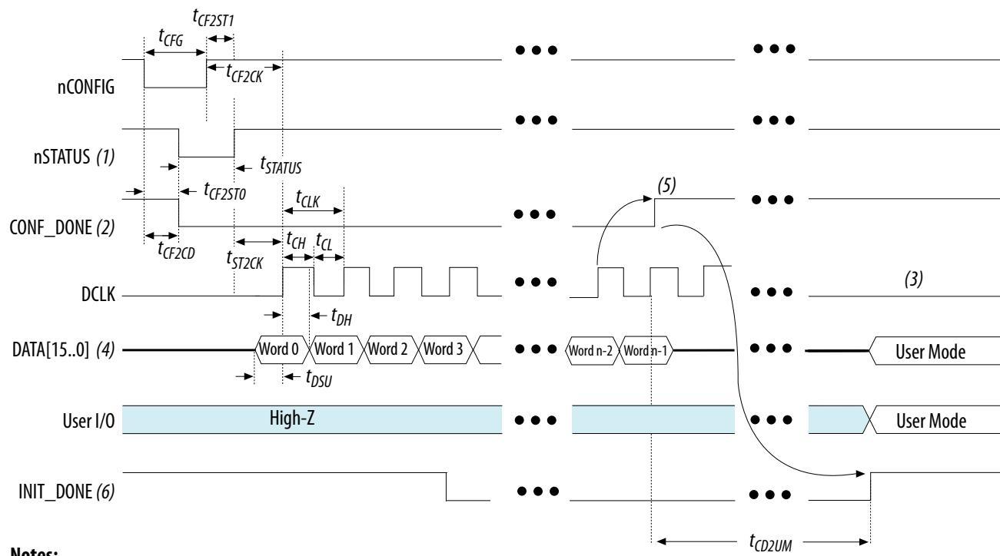

#### **Notes:**

- (1) After power up, the FPGA holds nSTATUS low for the time of the POR delay.
- (2) After power up, before and during configuration, CONF\_DONE is low.
- (3) Do not leave DCLK floating after configuration. DCLK is ignored after configuration is complete. It can toggle high or low if required.
- (4) For FPP x16, use DATA[15..0]. For FPP x8, use DATA[7..0]. DATA[15..5] are available as a user I/O pin after configuration. The state of this pin depends on the dual-purpose pin settings.
- (5) To ensure a successful configuration, send the entire configuration data to the FPGA. CONF\_DONE is released high when the FPGA receives all the configuration data successfully. After CONF\_DONE goes high, send two additional falling edges on DCLK to begin initialization and enter user mode.
- (6) After the option bit to enable the INIT\_DONE pin is configured into the device, the INIT\_DONE goes low.

**Figure 7-3: FPP Configuration Timing Waveform when DCLK-to-DATA[] Ratio is >1**

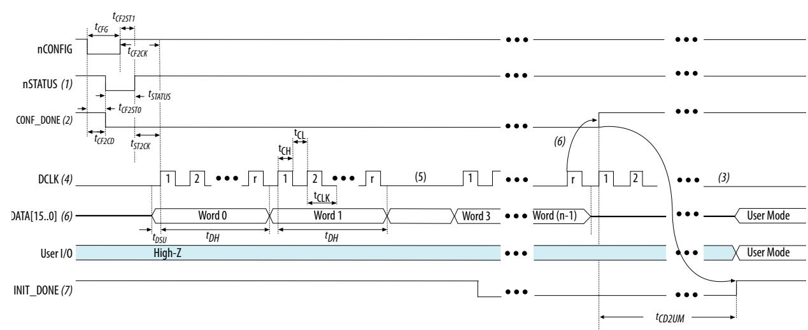

#### **Notes:**

- (1) After power up, the FPGA holds nSTATUS low for the time as specified by the POR delay.
- (2) After power up, before and during configuration, CONF\_DONE is low.
- (3) Do not leave DCLK floating after configuration. DCLK is ignored after configuration is complete. It can toggle high or low if required.
- (4) "r" denotes the DCLK-to-DATA[] ratio. For the DCLK-to-DATA[] ratio based on the decompression and the design security feature enable settings, refer to the DCLK-to-DATA[] Ratio table.
- (5) If needed, pause DCLK by holding it low. When DCLK restarts, the external host must provide data on the DATA[15..0] pins prior to sending the first DCLK rising edge.
- (6) To ensure a successful configuration, send the entire configuration data to the FPGA. CONF\_DONE is released high after the FPGA device receives all the configuration data successfully. After CONF\_DONE goes high, send two additional falling edges on DCLK to begin initialization and enter user mode.
- (7) After the option bit to enable the INIT\_DONE pin is configured into the device, the INIT\_DONE goes low.

#### Related Information

- [FPP Configuration Timing when DCLK-to-DATA\[\] = 1](https://documentation.altera.com/#/link/mcn1422497163812/mcn1419934641020/en-us)
- [FPP Configuration Timing when DCLK-to-DATA\[\] >1](https://documentation.altera.com/#/link/mcn1422497163812/mcn1419934654254/en-us)

#### **AS Configuration Timing**

**Figure 7-4: AS Configuration Timing Waveform**

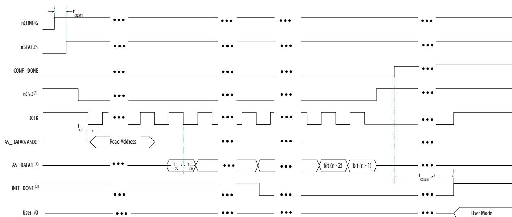

Notes:

- (1) If you are using AS x4 mode, this signal represents the AS\_DATA[3..0] and EPCQ sends in 4-bits of data for each DCLK cycle.
- (2) The initialization clock can be from the internal oscillator or CLKUSR pin.
- (3) After the option bit to enable the INIT\_DONE pin is configured into the device, the INIT\_DONE goes low.
- (4) The time between nCSO falling edge to the first toggling of DCLK is more than 15 ns.

#### Related Information

#### Active Serial (AS) Configuration Timing, Cyclone V Device Datasheet

#### **PS Configuration Timing**

**Figure 7-5: PS Configuration Timing Waveform**

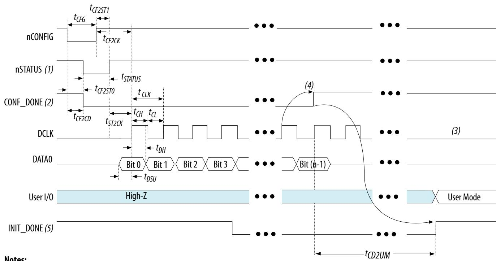

#### **Notes:**

- (1) After power up, the FPGA holds nSTATUS low for the time of the POR delay.
- (2) After power up, before and during configuration, CONF\_DONE is low.
- (3) Do not leave DCLK floating after configuration. DCLK is ignored after configuration is complete. It can toggle high or low if required.
- (4) To ensure a successful configuration, send the entire configuration data to the FPGA. CONF\_DONE is released high after the FPGA receives all the configuration data successfully. After CONF\_DONE goes high, send two additional falling edges on DCLK to begin initialization and enter user mode.
- (5) After the option bit to enable the INIT\_DONE pin is configured into the device, the INIT\_DONE goes low.

#### Related Information

#### Passive Serial (PS) Configuration Timing, Cyclone V Device Datasheet

#### **Device Configuration Pins**

#### **Configuration Pins Summary**

The following table lists the Cyclone V configuration pins and their power supply.

Note: 1. he TDI, TMS, TCK, and TDO pins are powered by VCCPD of the bank in which the pin resides.

- 2. The CLKUSR, DEV\_OE, DEV\_CLRn, and DATA[15..5] pins are powered by VCCPGM during configu‐ ration and by VCCIO of the bank in which the pin resides if you use it as a user I/O pin.
- 3. The DCLK, AS\_DATA0, AS\_DATA1, AS\_DATA2, AS\_DATA3, and nCSO pins have 25 kOhm pull-up resistors when the MSEL pins are set to AS configuration scheme.

**Table 7-3: Configuration Pin Summary for Cyclone V Devices**

| Configuration Pin | Configuration |               |           |                  |
| ----------------- | ------------- | ------------- | --------- | ---------------- |
|                   |               | Input/Output  | User Mode | Powered By       |
| TDI               | JTAG          | Input         | —         | V CCPD           |
| TMS               | JTAG          | Input         | —         | V CCPD           |
| TCK               | JTAG          | Input         | —         | V CCPD           |
| TDO               | JTAG          | Output        | —         | V CCPD           |
| CLKUSR            | All           |               |           |                  |
|                   |               | Input         | I/O       | V CCPGM /V CCIO  |
| CRC_ERROR         | Optional,     |               |           |                  |
|                   |               | Output        | I/O       | Pull-up          |
| CONF_DONE         | All           |               |           |                  |
|                   |               | Bidirectional | —         | V CCPGM /Pull-up |
|                   |               | Input         | —         | V CCPGM          |
|                   | AS            | Output        | —         | V CCPGM          |
| DEV_OE            | Optional,     |               |           |                  |
|                   |               | Input         | I/O       | V CCPGM /V CCIO  |
| DEV_CLRn          | Optional,     |               |           |                  |
|                   |               | Input         | I/O       | V CCPGM /V CCIO  |
| INIT_DONE         | Optional,     |               |           |                  |
|                   |               | Output        | I/O       | Pull-up          |
| MSEL[4..0]        | All           |               |           |                  |
|                   |               | Input         | —         | V CCPGM          |
| nSTATUS           | All           |               |           |                  |
|                   |               | Bidirectional | —         | V CCPGM /Pull-up |
| nCE               | All           |               |           |                  |
|                   |               | Input         | —         | V CCPGM          |
| nCEO              | All           |               |           |                  |
|                   |               | Output        | I/O       | Pull-up          |
| nCONFIG           | All           |               |           |                  |
|                   |               | Input         | —         | V CCPGM          |
| DATA[15..5]       | FPP x8        |               |           |                  |
|                   |               | Input         | I/O       | V CCPGM /V CCIO  |

(21) This pin is powered by VCCPGM during configuration and powered by VCCIO of the bank in which the pin resides when you use this pin as a user I/O pin.

| Configuration Pin        | Configuration Scheme    | Input/Output  | User Mode | Powered By                  |
| ------------------------ | ----------------------- | ------------- | --------- | --------------------------- |
| nCSO/DATA4               | AS                      | Output        | —         | $V_{CCPGM}$                 |
|                          | FPP                     | Input         | —         | $V_{CCPGM}$                 |
| AS_DATA[3..1]/DATA[3..1] | AS                      | Bidirectional | —         | $V_{CCPGM}$                 |
|                          | FPP                     | Input         | —         | $V_{CCPGM}$                 |
| AS_DATA0/DATA0/ASDO      | AS                      | Bidirectional | —         | $V_{CCPGM}$                 |
|                          | FPP and PS              | Input         | —         | $V_{CCPGM}$                 |
| PR_REQUEST               | Partial Reconfiguration | Input         | I/O       | $V_{CCPGM}/V_{CCIO}^{(21)}$ |
| PR_READY                 | Partial Reconfiguration | Output        | I/O       | $V_{CCPGM}/V_{CCIO}^{(21)}$ |
| PR_ERROR                 | Partial Reconfiguration | Output        | I/O       | $V_{CCPGM}/V_{CCIO}^{(21)}$ |
| PR_DONE                  | Partial Reconfiguration | Output        | I/O       | $V_{CCPGM}/V_{CCIO}^{(21)}$ |
| CvP_CONFDONE             | CvP (PCIe)              | Output        | I/O       | $V_{CCPGM}/V_{CCIO}^{(21)}$ |

Note: Intel recommends that you to use the General Purpose I/O (GPIO) IBIS model for the configura‐ tion pins.

#### Related Information

Cyclone**®** [V GX, GT, E, SX, ST and SE Device Family Pin Connection Guidelines](https://cdrdv2.intel.com/v1/dl/getContent/654351)

Provides more information about each configuration pin.

#### **I/O Standards and Drive Strength for Configuration Pins**

In configuration mode, the output drive strength is set as listed in the table below. Dual-function pin output drive strength is programmable if it is used as a regular I/O pin.

**Table 7-4: I/O Standards and Drive Strength for Configuration Pins**

The configuration pins listed support only fast slew rate and OCT is not enabled for these pins.

| Configuration Pin | Type          | I/O Standard | Drive Strength (mA) |
| ----------------- | ------------- | ------------ | ------------------- |
| nSTATUS           | Dedicated     | 3.0 V LVTTL  | 4                   |
| CONF_DONE         | Dedicated     | 3.0 V LVTTL  | 4                   |
| CvP_CONFDONE      | Dual Function | 3.0 V LVTTL  | 4                   |
| DCLK              | Dedicated     | 3.0 V LVTTL  | 12                  |

| Configuration Pin | Type          | I/O Standard | Drive Strength (mA) |
| ----------------- | ------------- | ------------ | ------------------- |
| TDO               | Dedicated     | 3.0 V LVTTL  | 12                  |
| AS_DATA0/ASDO     | Dedicated     | 3.0 V LVTTL  | 8                   |
| AS_DATA1          | Dedicated     | 3.0 V LVTTL  | 8                   |
| AS_DATA2          | Dedicated     | 3.0 V LVTTL  | 8                   |
| AS_DATA3          | Dedicated     | 3.0 V LVTTL  | 8                   |
| INIT_DONE         | Dual Function | 3.0 V LVTTL  | 8                   |
| CRC_ERROR         | Dual Function | 3.0 V LVTTL  | 8                   |
| nCSO              | Dedicated     | 3.0 V LVTTL  | 8                   |

Note: You can use the VCCPGM voltage other than 3 V. Refer to the I/O Standards and Drive Strength for Configuration Pins table for the I/O standard for each Configuration Pin.

#### **Configuration Pin Options in the Intel Quartus Prime Software**

The following table lists the dual-purpose configuration pins available in the Device and Pin Options dialog box in the Intel Quartus Prime software.

**Table 7-5: Configuration Pin Options**

| Configuration Pin | Category Page       | Option                              |
| ----------------- | ------------------- | ----------------------------------- |
| CLKUSR            | General             | Enable user-supplied start-up clock |
| DEV_CLRn          | General             | Enable device-wide reset            |
| DEV_OE            | General             | Enable device-wide output enable    |
| INIT_DONE         | General             | Enable INIT_DONE output             |
| nCEO              | General             | Enable nCEO pin                     |
| CRC_ERROR         | Error Detection CRC |                                     |
|                   | General             | Enable PR pin                       |

Reviewing Printed Circuit Board Schematics with the Intel**®** Quartus**®** Prime Software, Intel**®** Quartus**®** Prime Standard Edition User Guide: PCB Design Tools

Provides more information about the device and pin options dialog box setting.

#### **Fast Passive Parallel Configuration**

The FPP configuration scheme uses an external host, such as a microprocessor, MAX® II device, or MAX V device. This scheme is the fastest method to configure Cyclone V devices. The FPP configuration scheme supports 8- and 16-bits data width.

You can use an external host to control the transfer of configuration data from an external storage such as flash memory to the FPGA. The design that controls the configuration process resides in the external host. You can store the configuration data in Raw Binary File (.rbf), Hexadecimal (Intel-Format) File (.hex), or Tabular Text File (.ttf) formats.

You can use the PFL IP core with a MAX II or MAX V device to read configuration data from the flash memory device and configure the Cyclone V device.

Note: Two DCLK falling edges are required after the CONF\_DONE pin goes high to begin the initialization of the device for both uncompressed and compressed configuration data in an FPP configuration.

#### Related Information

- Parallel Flash Loader Intel**®** FPGA IP User Guide
- [Cyclone V Device Datasheet](https://documentation.altera.com/#/link/mcn1422497163812/mcn1422497300420/en-us) Provides more information about the FPP configuration timing.

#### **Fast Passive Parallel Single-Device Configuration**

To configure a Cyclone V device, connect the device to an external host as shown in the following figure.

**Figure 7-6: Single Device FPP Configuration Using an External Host**

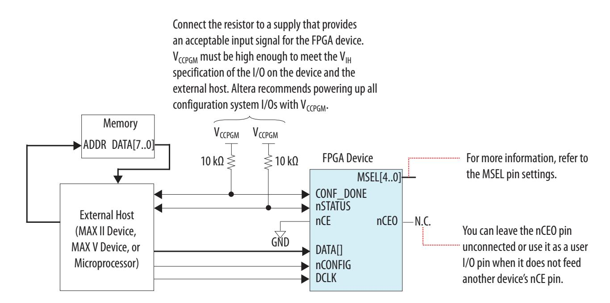

#### **Fast Passive Parallel Multi-Device Configuration**

You can configure multiple Cyclone V devices that are connected in a chain.

#### **Pin Connections and Guidelines**

Observe the following pin connections and guidelines for this configuration setup:

- Tie the following pins of all devices in the chain together:
  - nCONFIG
  - nSTATUS
  - DCLK
  - DATA[]
  - CONF\_DONE

By tying the CONF\_DONE and nSTATUS pins together, the devices initialize and enter user mode at the same time. If any device in the chain detects an error, configuration stops for the entire chain and you must reconfigure all the devices. For example, if the first device in the chain flags an error on the nSTATUS pin, it resets the chain by pulling its nSTATUS pin low.

- Ensure that DCLK and DATA[] are buffered for every fourth device to prevent signal integrity and clock skew problems.
- All devices in the chain must use the same data width.
- If you are configuring the devices in the chain using the same configuration data, the devices must be of the same package and density.

#### **Using Multiple Configuration Data**

To configure multiple Cyclone V devices in a chain using multiple configuration data, connect the devices to an external host as shown in the following figure.

**Figure 7-7: Multiple Device FPP Configuration Using an External Host When Both Devices Receive a Different Set of Configuration Data**

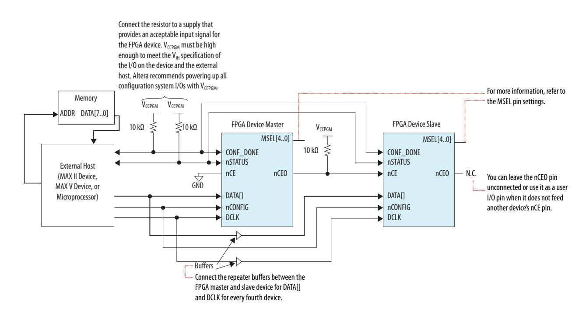

When a device completes configuration, its nCEO pin is released low to activate the nCE pin of the next device in the chain. Configuration automatically begins for the second device in one clock cycle.

#### **Using One Configuration Data**

To configure multiple Cyclone V devices in a chain using one configuration data, connect the devices to an external host as shown in the following figure.

**Figure 7-8: Multiple Device FPP Configuration Using an External Host When Both Devices Receive the Same Data**

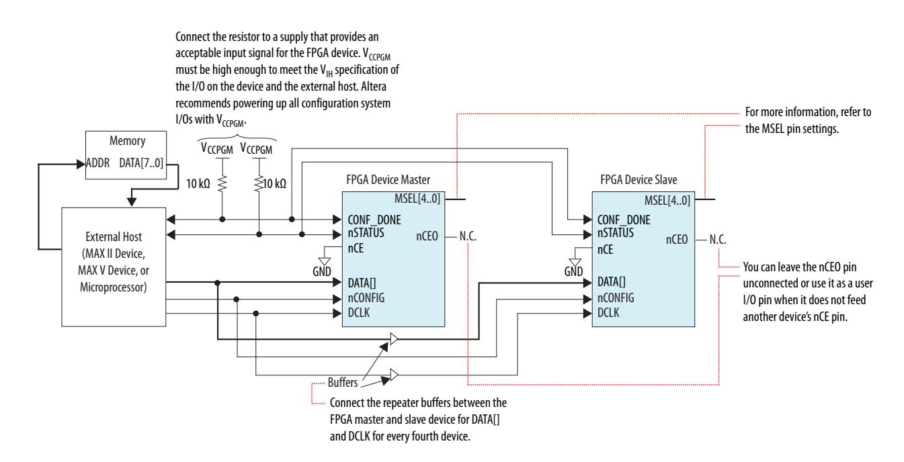

The nCE pins of the device in the chain are connected to GND, allowing configuration for these devices to begin and end at the same time.

#### **Transmitting Configuration Data**

This section describes how to transmit configuration data when you are using .rbf file for FPP x8, x16, and x32 configuration schemes. The configuration data in the .rbf file is little endian.

For example, if the .rbf file contains the byte sequence 02 1B EE 01, refer to the following tables for details on how this data is transmitted in the FPP x8, x16, and x32 configuration schemes.

**Table 7-6: Transmitting Configuration Data for FPP x8 Configuration Scheme**

In FPP x8 configuration scheme, the LSB of a byte is BIT0, and the MSB is BIT7.

| BYTE0 = 02 | BYTE1 = 1B | BYTE2 = EE | BYTE3 = 01 |
| ---------- | ---------- | ---------- | ---------- |
| D[7..0]    | D[7..0]    | D[7..0]    | D[7..0]    |
| 0000 0010  | 0001 1011  | 1110 1110  | 0000 0001  |

**Table 7-7: Transmitting Configuration Data for FPP x16 Configuration Scheme**

In FPP x16 configuration scheme, the first byte in the file is the LSB of the configuration word, and the second byte in the file is the MSB of the configuration word.

| WORD0 = 1B02    |                 |                 | WORD1 = 01EE    |
| --------------- | --------------- | --------------- | --------------- |
| LSB: BYTE0 = 02 | MSB: BYTE1 = 1B | LSB: BYTE2 = EE | MSB: BYTE3 = 01 |
| D[7..0]         | D[15..8]        | D[7..0]         | D[15..8]        |
| 0000 0010       | 0001 1011       | 1110 1110       | 0000 0001       |

Ensure that you do not swap the upper bits or bytes with the lower bits or bytes when performing the FPP configuration. Sending incorrect configuration data during the configuration process may cause unexpected behavior on the CONF\_DONE signal.

#### **Active Serial Configuration**

The AS configuration scheme supports AS x1 (1-bit data width) and AS x4 (4-bit data width) modes. The AS x4 mode provides four times faster configuration time than the AS x1 mode. In the AS configuration scheme, the Cyclone V device controls the configuration interface.

In the AS configuration process, after power-up, the Cyclone V device drives the DCLK pin with the default 12.5 MHz internal oscillator to read the configuration bitstream from the serial flash. The device determines the configuration options such as clock source, DCLK frequency, ASx1, or ASx4 by reading the option bits, located from 0x80 to 0x127, at the start of the programming file stored in the serial flash.

After the option bit is decoded by the Cyclone V configuration control block, the AS configuration continues with the design option by reading the rest of the programming file from the serial flash until CONF\_DONE pin asserts high and eventually enters user mode. When any interruption (such as data corruption) occurs in the middle of the AS Configuration, the nSTATUS pin will assert low to indicate configuration error, and deassert high to restart the configuration process. If there is no image in the serial flash or if the image is corrupted, you will observe the nSTATUS will pulse low repeatedly as the control block tries to configure itself forever, until the configuration is successful.

#### Related Information

#### Cyclone V Device Datasheet

Provides more information about the AS configuration timing.

#### **DATA Clock (DCLK)**

Cyclone V devices generate the serial clock, DCLK, that provides timing to the serial interface. In the AS configuration scheme, Cyclone V devices drive control signals on the falling edge of DCLK and latch the configuration data on the following falling edge of this clock pin.

The maximum DCLK frequency supported by the AS configuration scheme is 100 MHz except for the AS multi-device configuration scheme. You can source DCLK using CLKUSR or the internal oscillator. If you use the internal oscillator, you can choose a 12.5, 25, 50, or 100 MHz clock under the Device and Pin Options dialog box, in the Configuration page of the Intel Quartus Prime software.

After power-up, DCLK is driven by a 12.5 MHz internal oscillator by default. The Cyclone V device determines the clock source and frequency to use by reading the option bit in the programming file.

#### Cyclone V Device Datasheet

Provides more information about the DCLK frequency specification in the AS configuration scheme.

#### **Active Serial Single-Device Configuration**

To configure a Cyclone V device, connect the device to a serial configuration (EPCS) device or quad-serial configuration (EPCQ) device, as shown in the following figures.

**Figure 7-9: Single Device AS x1 Mode Configuration**

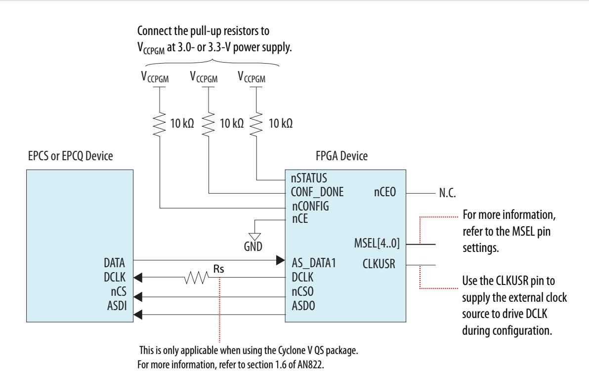

**Figure 7-10: Single Device AS x4 Mode Configuration**

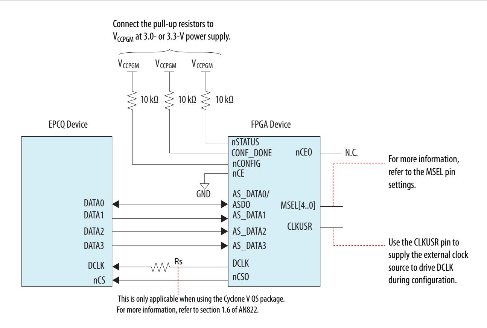

#### **Active Serial Multi-Device Configuration**

You can configure multiple Cyclone V devices that are connected to a chain. Only AS x1 mode supports multi-device configuration.

The first device in the chain is the configuration master. Subsequent devices in the chain are configuration slaves.

#### **Pin Connections and Guidelines**

Observe the following pin connections and guidelines for this configuration setup:

- Hardwire the MSEL pins of the first device in the chain to select the AS configuration scheme. For subsequent devices in the chain, hardwire their MSEL pins to select the PS configuration scheme. Any other Altera® devices that support the PS configuration can also be part of the chain as a configuration slave.
- Tie the following pins of all devices in the chain together:
  - nCONFIG
  - nSTATUS
  - DCLK
  - DATA[]
  - CONF\_DONE

By tying the CONF\_DONE, nSTATUS, and nCONFIG pins together, the devices initialize and enter user mode at the same time. If any device in the chain detects an error, configuration stops for the entire chain and you must reconfigure all the devices. For example, if the first device in the chain flags an error on the nSTATUS pin, it resets the chain by pulling its nSTATUS pin low.

- Ensure that DCLK and DATA[] are buffered every fourth device to prevent signal integrity and clock skew problems.

#### **Using Multiple Configuration Data**

To configure multiple Cyclone V devices in a chain using multiple configuration data, connect the devices to an EPCS or EPCQ device, as shown in the following figure.

**Figure 7-11: Multiple Device AS Configuration When Both Devices in the Chain Receive Different Sets of Configuration Data**

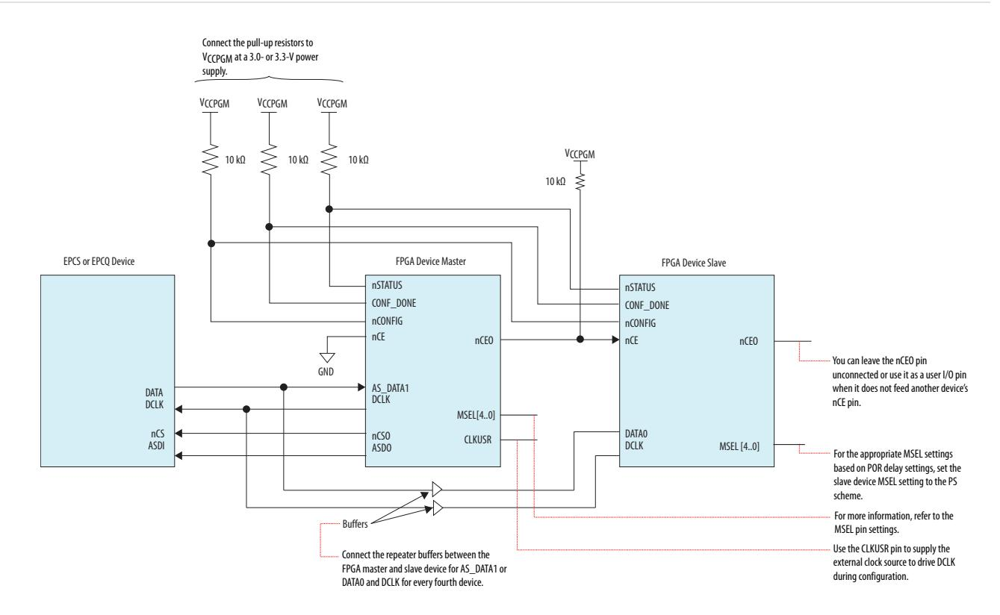

When a device completes configuration, its nCEO pin is released low to activate the nCE pin of the next device in the chain. Configuration automatically begins for the second device in one clock cycle.

#### **Estimating the Active Serial Configuration Time**

The AS configuration time is mostly the time it takes to transfer the configuration data from an EPCS or EPCQ device to the Cyclone V device.

Use the following equations to estimate the configuration time:

- AS x1 mode

.rbf Size x (minimum DCLK period / 1 bit per DCLK cycle) = estimated minimum configuration time.

- AS x4 mode

.rbf Size x (minimum DCLK period / 4 bits per DCLK cycle) = estimated minimum configuration time.

Compressing the configuration data reduces the configuration time. The amount of reduction varies depending on your design.

## **Using EPCS and EPCQ Devices**

EPCS devices support AS x1 mode and EPCQ devices support AS x1 and AS x4 modes.

- • [Serial Configuration Devices Data Sheet](https://cdrdv2.intel.com/v1/dl/getContent/654137)
- Quad-Serial Configuration (EPCQ) Devices Datasheet

#### **Controlling EPCS and EPCQ Devices**

During configuration, Cyclone V devices enable the EPCS or EPCQ device by driving its nCSO output pin low, which connects to the chip select (nCS) pin of the EPCS or EPCQ device. Cyclone V devices use the DCLK and ASDO pins to send operation commands and read address signals to the EPCS or EPCQ device. The EPCS or EPCQ device provides data on its serial data output (DATA[]) pin, which connects to the AS\_DATA[] input of the Cyclone V devices.

Note: If you wish to gain control of the EPCS pins, hold the nCONFIG pin low and pull the nCE pin high. This causes the device to reset and tri-state the AS configuration pins.

#### **Evaluating Data Setup and Hold Timing Slack in AS Configuration**

Follow the guideline below to evaluate and ensure the setup time, tDSU and hold time, tDH meets the requirements explained in the Cyclone V device datasheets. While evaluating the tDSU and tDH slack in your system, you can also use the equations to estimate the trace length for the DCLK and DATA[3..0] lines on your system.

**Figure 7-12: FPGA to EPCQ-A Board Trace Block Diagram**

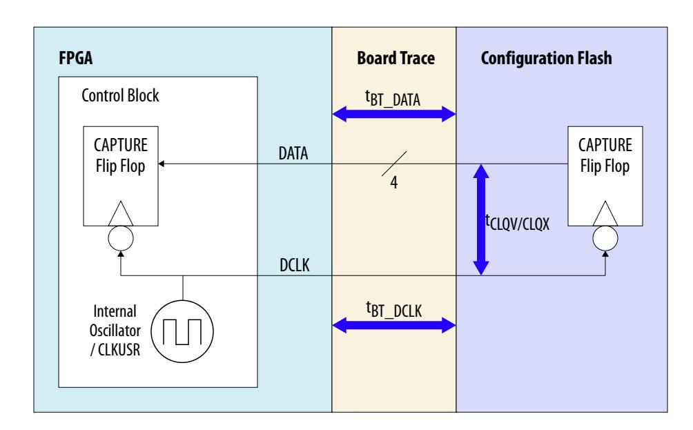

The data setup timing slack must be equal or larger than the minimum data setup time, tDSU

$$\mathbf{t}_{\text{DCLK}} - (\mathbf{t}_{\text{BT\_DCLK}} + \mathbf{t}_{\text{CLQV}} + \mathbf{t}_{\text{BT\_DATA}}) \geq \mathbf{t}_{\text{DSU}}$$

The hold timing slack must be equal or larger than the minimum data hold time, tDH:

$$t_{\text{BT\_DCLK}} + t_{\text{CLQX}} + t_{\text{BT\_DATA}} \geq t_{\text{DH}}$$

- • tDCLK = Period for a DCLK cycle
- tBT\_DCLK = Board trace propagation delay for DCLK from FPGA to EPCQ-A
- tCLQV = Clock low to output valid
- tCLQX = Output hold time
- tBT\_DATA = Board trace propagation delay for Data from EPCQ-A to FPGA
- tDSU = Minimum data setup time required by FPGA
- tDH = Minimum data hold time required by FPGA

#### EPCQ-A Serial Configuration Device Datasheet

#### **Programming EPCS and EPCQ Devices**

You can program EPCS and EPCQ devices in-system using a USB-Blaster™, EthernetBlaster, EthernetBlaster II, or ByteBlaster™ II download cable. Alternatively, you can program the EPCS or EPCQ using a microprocessor with the SRunner software driver.

In-system programming (ISP) offers you the option to program the EPCS or EPCQ either using an AS programming interface or a JTAG interface. Using the AS programming interface, the configuration data is programmed into the EPCS by the Intel Quartus Prime software or any supported third-party software. Using the JTAG interface, an Altera IP called the serial flash loader (SFL) must be downloaded into the Cyclone V device to form a bridge between the JTAG interface and the EPCS or EPCQ. This allows the EPCS or EPCQ to be programmed directly using the JTAG interface.

#### Related Information

- AN 370: Using the Serial Flash Loader IP Core with the Quartus Prime Software
- [AN 418: SRunner: An Embedded Solution for Serial Configuration Device Programming](https://cdrdv2.intel.com/v1/dl/getContent/653946)

#### **Programming EPCS Using the JTAG Interface**

To program an EPCS device using the JTAG interface, connect the device as shown in the following figure.

**Figure 7-13: Connection Setup for Programming the EPCS Using the JTAG Interface**

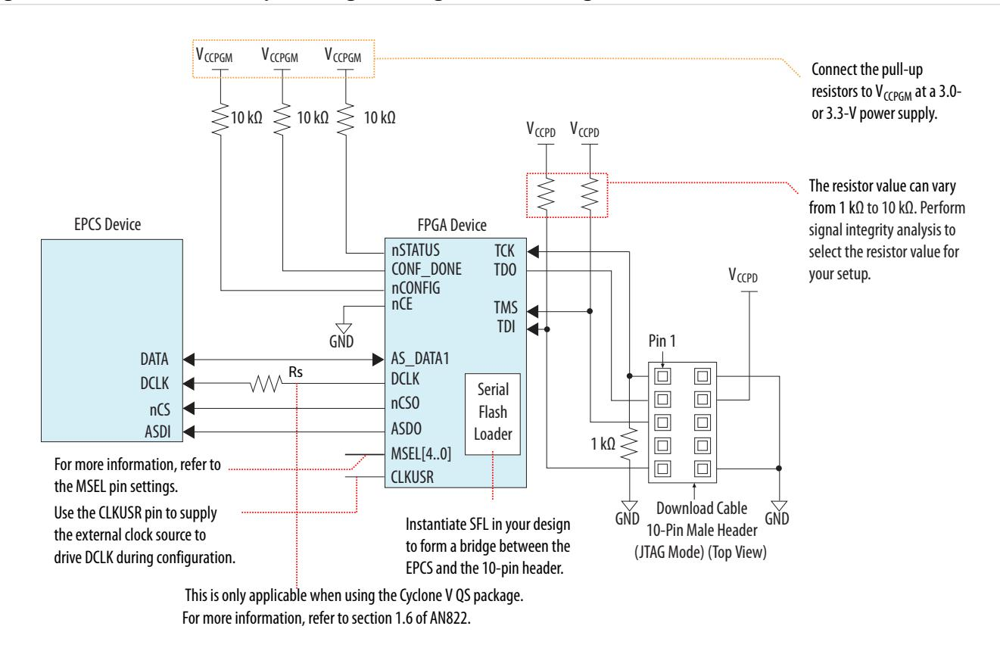

#### **Programming EPCQ Using the JTAG Interface**

To program an EPCQ device using the JTAG interface, connect the device as shown in the following figure.

**Figure 7-14: Connection Setup for Programming the EPCQ Using the JTAG Interface**

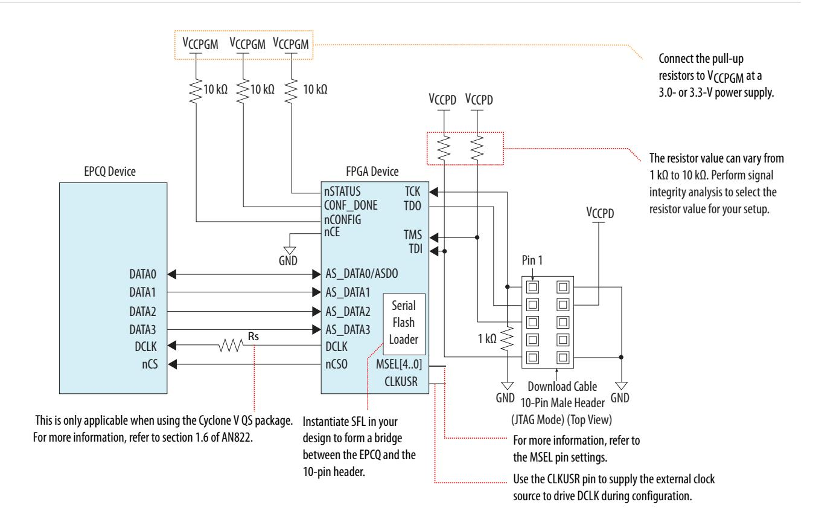

#### **Programming EPCS Using the Active Serial Interface**

To program an EPCS device using the AS interface, connect the device as shown in the following figure.

**Figure 7-15: Connection Setup for Programming the EPCS Using the AS Interface**

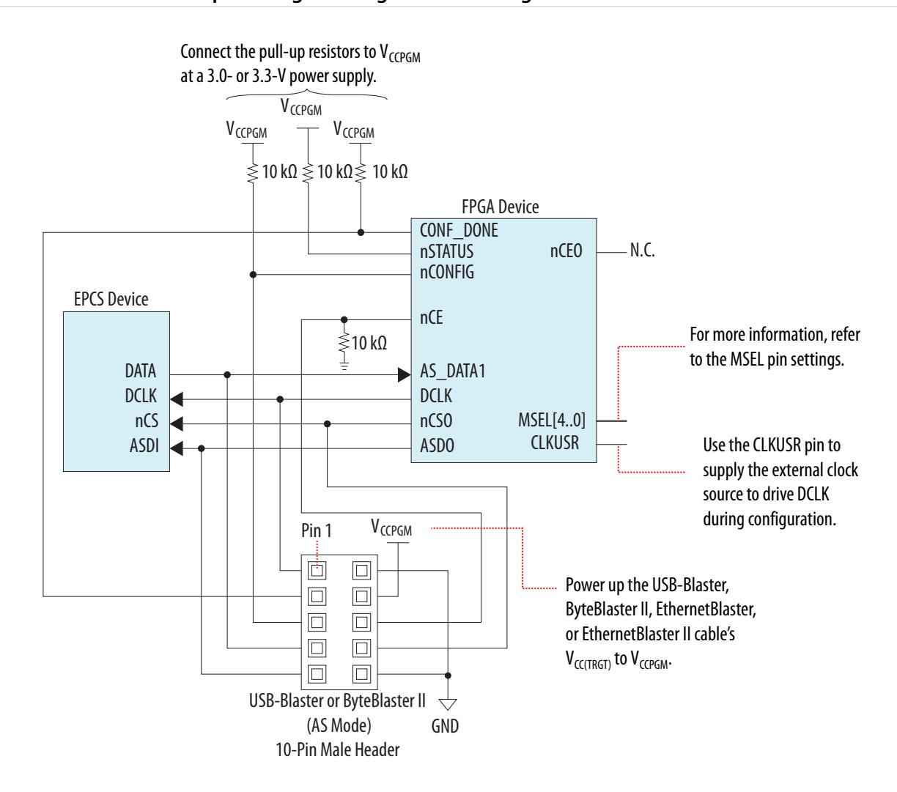

#### **Programming EPCQ Using the Active Serial Interface**

To program an EPCQ device using the AS interface, connect the device as shown in the following figure.

**Figure 7-16: Connection Setup for Programming the EPCQ Using the AS Interface**

Using the AS header, the programmer serially transmits the operation commands and configuration bits to the EPCQ on DATA0. This is equivalent to the programming operation for the EPCS.

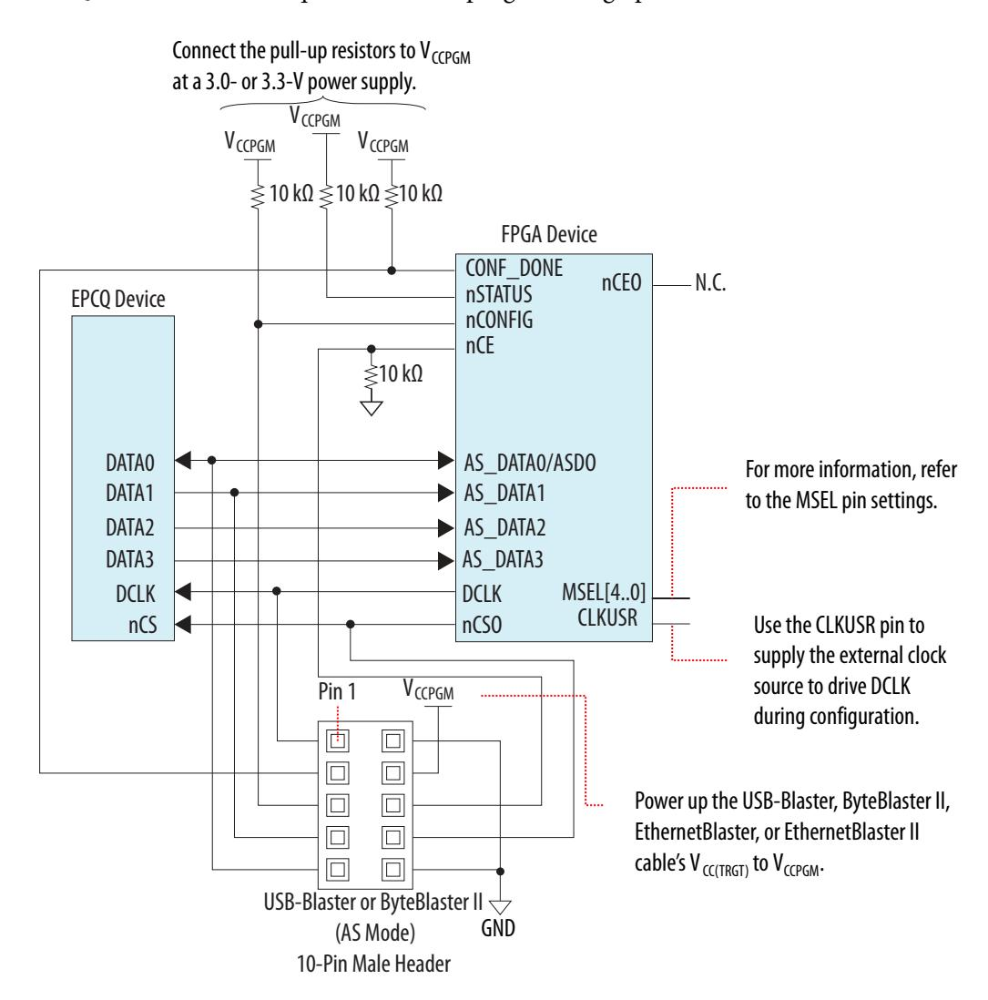

When programming the EPCS and EPCQ devices, the download cable disables access to the AS interface by driving the nCE pin high. The nCONFIG line is also pulled low to hold the Cyclone V device in the reset stage. After programming completes, the download cable releases nCE and nCONFIG, allowing the pull-down and pull-up resistors to drive the pin to GND and VCCPGM, respectively.

During the EPCQ programming using the download cable, DATA0 transfers the programming data, operation command, and address information from the download cable into the EPCQ. During the EPCQ verification using the download cable, DATA1 transfers the programming data back to the download cable.

#### **Passive Serial Configuration**

The PS configuration scheme uses an external host. You can use a microprocessor, MAX II device, MAX V device, or a host PC as the external host.

You can use an external host to control the transfer of configuration data from an external storage such as flash memory to the FPGA. The design that controls the configuration process resides in the external host.

You can store the configuration data in Programmer Object File (.pof), .rbf, .hex, or .ttf. If you are using configuration data in .rbf, .hex, or .ttf, send the LSB of each data byte first. For example, if the .rbf contains the byte sequence 02 1B EE 01 FA, the serial data transmitted to the device must be 0100-0000 1101-1000 0111-0111 1000-0000 0101-1111.

You can use the PFL IP core with a MAX II or MAX V device to read configuration data from the flash memory device and configure the Cyclone V device.

For a PC host, connect the PC to the device using a download cable such as the Altera USB-Blaster USB port, ByteBlaster II parallel port, EthernetBlaster, and EthernetBlaster II download cables.

The configuration data is shifted serially into the DATA0 pin of the device.

If you are using the Intel Quartus Prime programmer and the CLKUSR pin is enabled, you do not need to provide a clock source for the pin to initialize your device.

#### Related Information

- Parallel Flash Loader Intel**®** FPGA IP User Guide
- Cyclone V Device Datasheet Provides more information about the PS configuration timing.

#### **Passive Serial Single-Device Configuration Using an External Host**

To configure a Cyclone V device, connect the device to an external host, as shown in the following figure.

**Figure 7-17: Single Device PS Configuration Using an External Host**

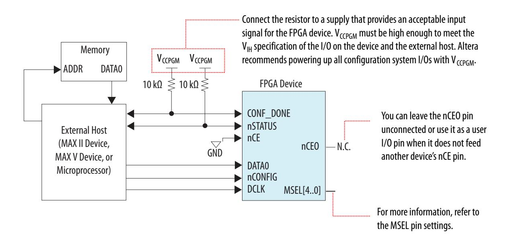

#### **Passive Serial Single-Device Configuration Using an Altera Download Cable**

To configure a Cyclone V device, connect the device to a download cable, as shown in the following figure.

**Figure 7-18: Single Device PS Configuration Using an Altera Download Cable**

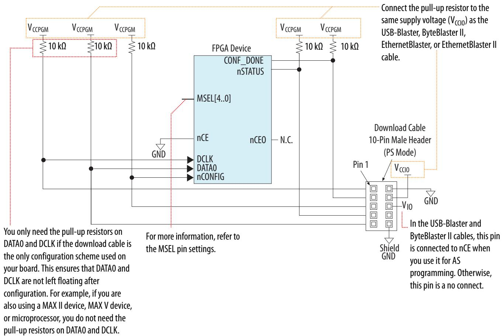

#### **Passive Serial Multi-Device Configuration**

You can configure multiple Cyclone V devices that are connected in a chain.

#### **Pin Connections and Guidelines**

Observe the following pin connections and guidelines for this configuration setup:

- Tie the following pins of all devices in the chain together:
  - nCONFIG
  - nSTATUS
  - DCLK
  - DATA0
  - CONF\_DONE

By tying the CONF\_DONE and nSTATUS pins together, the devices initialize and enter user mode at the same time. If any device in the chain detects an error, configuration stops for the entire chain and you must reconfigure all the devices. For example, if the first device in the chain flags an error on the nSTATUS pin, it resets the chain by pulling its nSTATUS pin low.

- If you are configuring the devices in the chain using the same configuration data, the devices must be of the same package and density.

#### **Using Multiple Configuration Data**

To configure multiple Cyclone V devices in a chain using multiple configuration data, connect the devices to the external host as shown in the following figure.

**Figure 7-19: Multiple Device PS Configuration when Both Devices Receive Different Sets of Configuration Data**

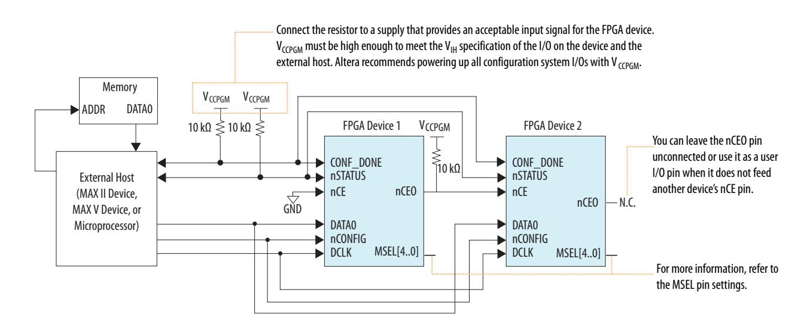

After a device completes configuration, its nCEO pin is released low to activate the nCE pin of the next device in the chain. Configuration automatically begins for the second device in one clock cycle.

#### **Using One Configuration Data**

To configure multiple Cyclone V devices in a chain using one configuration data, connect the devices to an external host, as shown in the following figure.

**Figure 7-20: Multiple Device PS Configuration When Both Devices Receive the Same Set of Configuration Data**

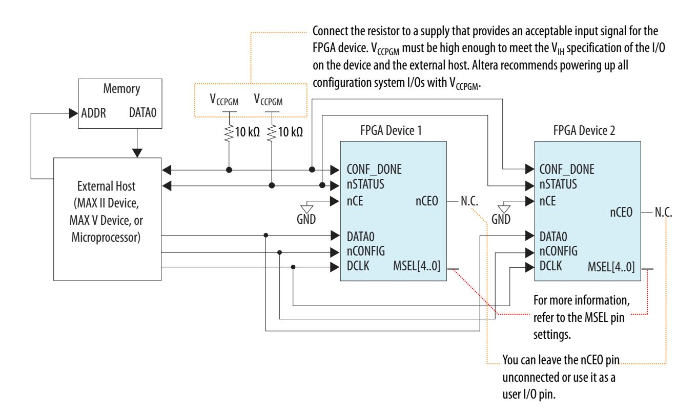

The nCE pins of the devices in the chain are connected to GND, allowing configuration for these devices to begin and end at the same time.

#### **Using PC Host and Download Cable**

To configure multiple Cyclone V devices, connect the devices to a download cable, as shown in the following figure.

**Figure 7-21: Multiple Device PS Configuration Using an Altera Download Cable**

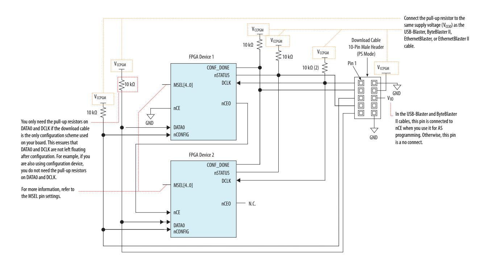

When a device completes configuration, its nCEO pin is released low to activate the nCE pin of the next device. Configuration automatically begins for the second device.

## **JTAG Configuration**

In Cyclone V devices, JTAG instructions take precedence over other configuration schemes.

The Intel Quartus Prime software generates an SRAM Object File (.sof) that you can use for JTAG configu‐ ration using a download cable in the Intel Quartus Prime software programmer. Alternatively, you can use the JRunner software with .rbf or a JAM™ Standard Test and Programming Language (STAPL) Format File (.jam) or JAM Byte Code File (.jbc) with other third-party programmer tools.

#### Related Information

- [JTAG Boundary-Scan Testing in Cyclone V Devices](#page-305-0) on page 9-1 Provides more information about JTAG boundary-scan testing.
- [Device Configuration Pins](#page-253-0) on page 7-11 Provides more information about JTAG configuration pins.
- [JTAG Secure Mode](#page-288-0) on page 7-46
- AN 425: Using the Command-Line Jam STAPL Solution for Device Programming
- Cyclone V Device Datasheet Provides more information about the JTAG configuration timing.
- [Programming Support for Jam STAPL Language](https://www.intel.com/content/www/us/en/support/programmable/support-resources/programming/tls-jam-support.html)
- Intel**®** FPGA Download Cable User Guide
- [ByteBlaster II Download Cable User Guide](https://cdrdv2.intel.com/v1/dl/getContent/654344)

- • [EthernetBlaster Communications Cable User Guide](https://cdrdv2.intel.com/v1/dl/getContent/654134)
- [EthernetBlaster II Communications Cable User Guide](https://cdrdv2.intel.com/v1/dl/getContent/654970)

#### **JTAG Single-Device Configuration**

To configure a single device in a JTAG chain, the programming software sets the other devices to the bypass mode. A device in a bypass mode transfers the programming data from the TDI pin to the TDO pin through a single bypass register. The configuration data is available on the TDO pin one clock cycle later.

The Intel Quartus Prime software can use the CONF\_DONE pin to verify the completion of the configuration process through the JTAG port:

- CONF\_DONE pin is low—indicates that configuration has failed.
- CONF\_DONE pin is high—indicates that configuration was successful.

After the configuration data is transmitted serially using the JTAG TDI port, the TCK port is clocked an additional 1,222 cycles to perform device initialization.

To configure a Cyclone V device using a download cable, connect the device as shown in the following figure.

**Figure 7-22: JTAG Configuration of a Single Device Using a Download Cable**

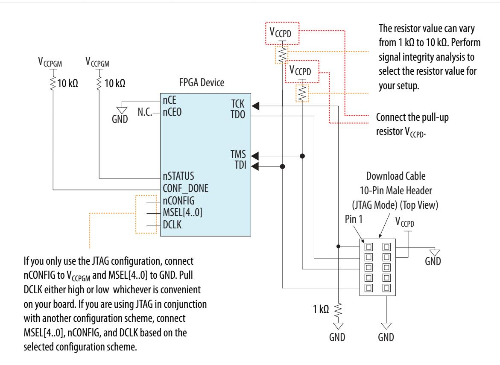

To configure Cyclone V device using a microprocessor, connect the device as shown in the following figure. You can use JRunner as your software driver.

**Figure 7-23: JTAG Configuration of a Single Device Using a Microprocessor**

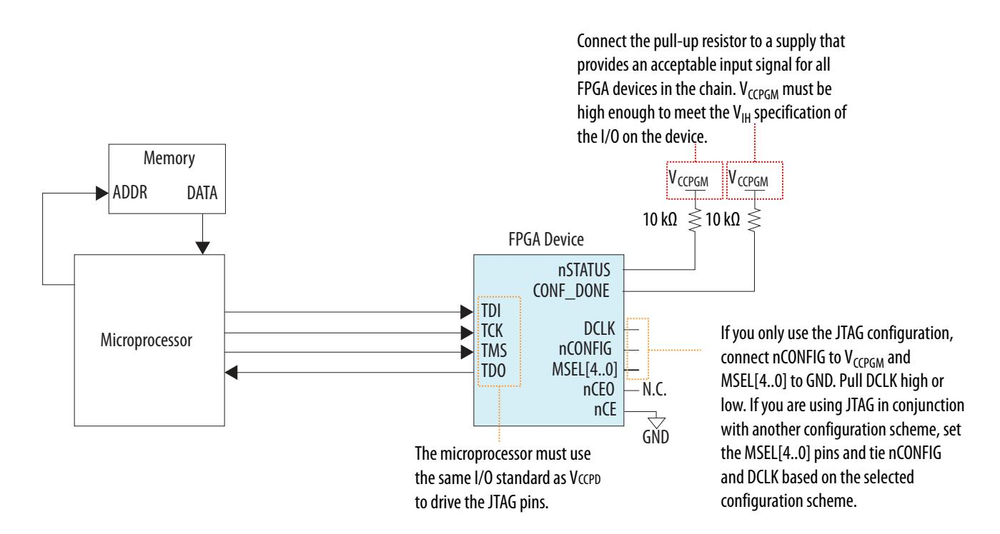

#### [AN 414: The JRunner Software Driver: An Embedded Solution for PLD JTAG Configuration](https://cdrdv2.intel.com/v1/dl/getContent/655021)

#### **JTAG Multi-Device Configuration**

You can configure multiple devices in a JTAG chain.

#### **Pin Connections and Guidelines**

Observe the following pin connections and guidelines for this configuration setup:

- Isolate the CONF\_DONE and nSTATUS pins to allow each device to enter user mode independently.
- One JTAG-compatible header is connected to several devices in a JTAG chain. The number of devices in the chain is limited only by the drive capability of the download cable.
- If you have four or more devices in a JTAG chain, buffer the TCK, TDI, and TMS pins with an on-board buffer. You can also connect other Altera devices with JTAG support to the chain.
- JTAG-chain device programming is ideal when the system contains multiple devices or when testing your system using the JTAG boundary-scan testing (BST) circuitry.

#### **Using a Download Cable**

The following figure shows a multi-device JTAG configuration.

**Figure 7-24: JTAG Configuration of Multiple Devices Using a Download Cable**

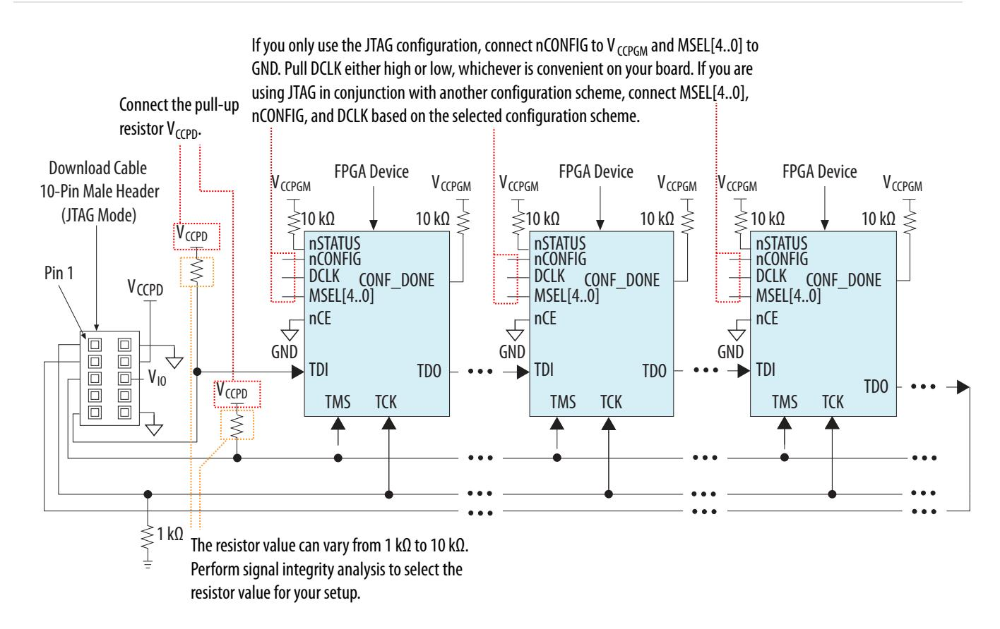

#### [AN 656: Combining Multiple Configuration Schemes](https://cdrdv2.intel.com/v1/dl/getContent/654195)

Provides more information about combining JTAG configuration with other configuration schemes.

#### **CONFIG\_IO JTAG Instruction**

The CONFIO\_IO JTAG instruction allows you to configure the I/O buffers using the JTAG port before or during device configuration. When you issue this instruction, it interrupts configuration and allows you to issue all JTAG instructions. Otherwise, you can only issue the BYPASS, IDCODE, and SAMPLE JTAG instruc‐ tions.

You can use the CONFIO\_IO JTAG instruction to interrupt configuration and perform board-level testing. After the board-level testing is completed, you must reconfigure your device. Use the following methods to reconfigure your device:

- JTAG interface—issue the PULSE\_NCONFIG JTAG instruction.
- FPP, PS, or AS configuration scheme—pulse the nCONFIG pin low.

#### **Configuration Data Compression**

Cyclone V devices can receive compressed configuration bitstream and decompress the data in real-time during configuration. Preliminary data indicates that compression typically reduces the configuration file size by 30% to 55% depending on the design.

Decompression is supported in all configuration schemes except the JTAG configuration scheme.

You can enable compression before or after design compilation.

#### **Enabling Compression Before Design Compilation**

To enable compression before design compilation, follow these steps:

- 1. On the Assignment Menu, click Device.
- 2. Select your Cyclone V device and then click Device and Pin Options.
- 3. In the Device and Pin Options window, select Configuration under the Category list and turn on Generate compressed bitstreams.

#### **Enabling Compression After Design Compilation**

To enable compression after design compilation, follow these steps:

- 1. On the File menu, click Convert Programming Files.
- 2. Select the programming file type (.pof, .sof, .hex, .hexout, .rbf, or .ttf). For POF output files, select a configuration device.
- 3. Under the Input files to convert list, select SOF Data.
- 4. Click Add File and select a Cyclone V device .sof.
- 5. Select the name of the file you added to the SOF Data area and click Properties.
- 6. Turn on the Compression check box.

#### **Using Compression in Multi-Device Configuration**

The following figure shows a chain of two Cyclone V devices. Compression is only enabled for the first device.

This setup is supported by the AS or PS multi-device configuration only.

**Figure 7-25: Compressed and Uncompressed Serial Configuration Data in the Same Configuration File**

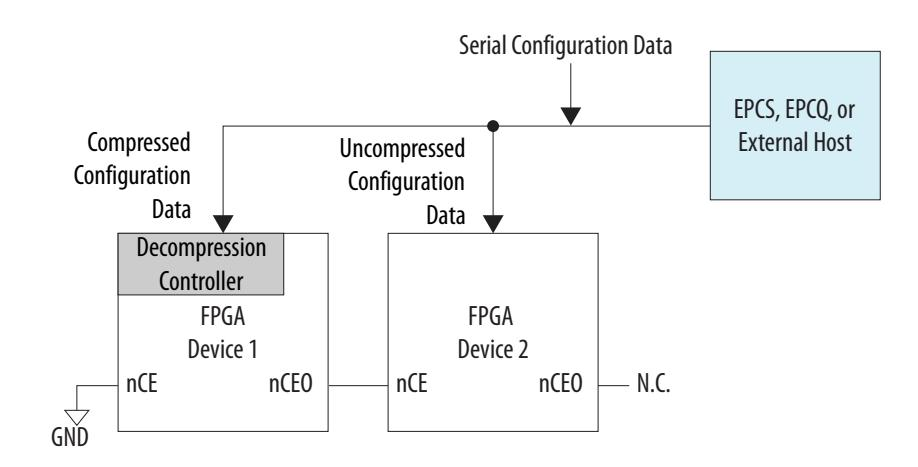

For the FPP configuration scheme, a combination of compressed and uncompressed configuration in the same multi-device configuration chain is not allowed because of the difference on the DCLK-to-DATA[] ratio.

#### **Remote System Upgrades**

Cyclone V devices contain dedicated remote system upgrade circuitry. You can use this feature to upgrade your system from a remote location.

**Figure 7-26: Cyclone V Remote System Upgrade Block Diagram**

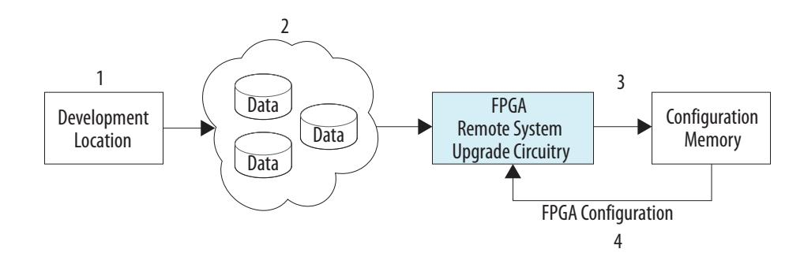

You can design your system to manage remote upgrades of the application configuration images in the configuration device. The following list is the sequence of the remote system upgrade:

- 1. The logic (embedded processor or user logic) in the Cyclone V device receives a configuration image from a remote location. You can connect the device to the remote source using communication protocols such as TCP/IP, PCI, user datagram protocol (UDP), UART, or a proprietary interface.
- 2. The logic stores the configuration image in non-volatile configuration memory.
- 3. The logic starts reconfiguration cycle using the newly received configuration image.
- 4. When an error occurs, the circuitry detects the error, reverts to a safe configuration image, and provides error status to your design.

#### **Configuration Images**

Each Cyclone V device in your system requires one factory image. The factory image is a user-defined configuration image that contains logic to perform the following:

- Processes errors based on the status provided by the dedicated remote system upgrade circuitry.
- Communicates with the remote host, receives new application images, and stores the images in the local non-volatile memory device.
- Determines the application image to load into the Cyclone V device.
- Enables or disables the user watchdog timer and loads its time-out value.
- Instructs the dedicated remote system upgrade circuitry to start a reconfiguration cycle.

You can also create one or more application images for the device. An application image contains selected functionalities to be implemented in the target device.

Store the images at the following locations in the EPCS or EPCQ devices:

- Factory configuration image—PGM[23..0] = 24'h000000 start address on the EPCS or EPCQ device.
- Application configuration image—any sector boundary. Altera recommends that you store only one image at one sector boundary.

When you are using EPCQ 256, ensure that the application configuration image address granularity is 32'h00000100. The granularity requirement is having the most significant 24 bits of the 32 bits start address written to PGM[23..0] bits.

Note: If you are not using the Intel Quartus Prime software or SRunner software for EPCQ 256 program‐ ming, put your EPCQ 256 device into four-byte addressing mode before you program and configure your device.

#### **Configuration Sequence in the Remote Update Mode**

**Figure 7-27: Transitions Between Factory and Application Configurations in Remote Update Mode**

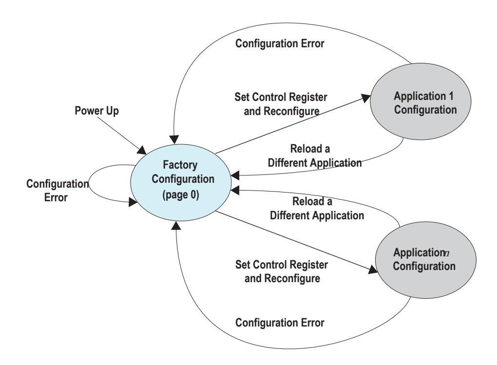

#### Related Information

[Remote System Upgrade State Machine](#page-286-0) on page 7-44

A detailed description of the configuration sequence in the remote update mode.

#### **Remote System Upgrade Circuitry**

The remote system upgrade circuitry contains the remote system upgrade registers, watchdog timer, and a state machine that controls these components.

Note: If you are using the Altera Remote Update IP core, the IP core controls the RU\_DOUT, RU\_SHIFTnLD, RU\_CAPTnUPDT, RU\_CLK, RU\_DIN, RU\_nCONFIG, and RU\_nRSTIMER signals internally to perform all the related remote system upgrade operations.

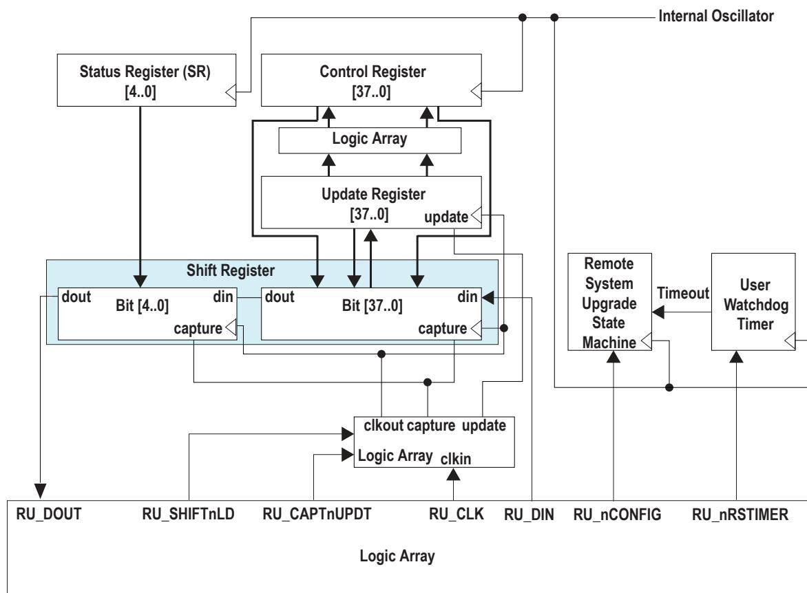

- 1. Select Active Serial x1/x4 or Configuration Device from the Configuration scheme list in the Configu‐
- 2. Select Remote from the Configuration mode list in the Configuration page of the Device and Pin

Remote Update Intel FPGA IP core provides a memory-like interface to the remote system upgrade

#### **Remote System Upgrade Registers**

**Table 7-8: Remote System Upgrade Registers**

| Register | Description                                                                         |
| -------- | ----------------------------------------------------------------------------------- |
| Shift    | Accessible by the logic array and clocked by RU_CLK                                 |
|          | Bits[4..0] —Contents of the status register are shifted into these bits.            |
|          | Bits[37..0] —Contents of the update and control registers are shifted               |
| Control  | This register is clocked by the 10-MHz internal oscillator. The contents of this    |
| Update   | This register is clocked by RU_CLK . The factory configuration updates this         |
| Status   | After each reconfiguration, the remote system upgrade circuitry updates this        |
|          | register to indicate the event that triggered the reconfiguration. This register is |

#### Related Information

- Control Register on page 7-43
- [Status Register](#page-286-0) on page 7-44

#### **Control Register**

**Table 7-9: Control Register Bits**

|     | Bit |     | Name | Reset      |                                            |
| --- | --- | --- | ---- | ---------- | ------------------------------------------ |
|     |     |     |      | Value (22) |                                            |
| 0   |     | AnF |      | 1'b0       | Application not Factory bit. Indicates the |

(22) This is the default value after the device exits POR and during reconfiguration back to the factory configura‐ tion image.

| Bit    | Name            | Reset            |                                                 |
| ------ | --------------- | ---------------- | ----------------------------------------------- |
|        |                 | Value            | (22)                                            |
| 1..24  | PGM[0..23]      | 24'h000000       | Upper 24 bits of AS configuration start         |
|        |                 |                  | address ( StAdd[31..8] ), the 8 LSB are zero.   |
| 25     | Wd_en           | 1'b0             | User watchdog timer enable bit. Set this bit to |
| 26..37 | Wd_timer[11..0] | 12'b000000000000 | User watchdog time-out value.                   |

#### **Status Register**

**Table 7-10: Status Register Bits**

| Bit | Name         | Reset |                                                      |
| --- | ------------ | ----- | ---------------------------------------------------- |
|     |              | Value | (23)                                                 |
| 0   | CRC          | 1'b0  | When set to 1, indicates CRC error during applica‐   |
| 1   | nSTATUS      | 1'b0  | When set to 1, indicates that nSTATUS is asserted by |
| 2   | Core_nCONFIG | 1'b0  | When set to 1, indicates that reconfiguration has    |
| 3   | nCONFIG      | 1'b0  | When set to 1, indicates that nCONFIG is asserted.   |
| 4   | Wd           | 1'b0  | When set to 1, indicates that the user watchdog      |

#### **Remote System Upgrade State Machine**

The operation of the remote system upgrade state machine is as follows:

- 1. After power-up, the remote system upgrade registers are reset to 0 and the factory configuration image is loaded.
- 2. The user logic sets the AnF bit to 1 and the start address of the application image to be loaded. The user logic also writes the watchdog timer settings.
- 3. When the configuration reset (RU\_CONFIG) goes low, the state machine updates the control register with the contents of the update register, and triggers reconfiguration using the application configura‐ tion image.
- 4. If error occurs, the state machine falls back to the factory image. The control and update registers are reset to 0, and the status register is updated with the error information.
- 5. After successful reconfiguration, the system stays in the application configuration.

#### **User Watchdog Timer**

(22) This is the default value after the device exits POR and during reconfiguration back to the factory configura‐ tion image.

(23) After the device exits POR and power-up, the status register content is 5'b00000.

The user watchdog timer prevents a faulty application configuration from stalling the device indefinitely. You can use the timer to detect functional errors when an application configuration is successfully loaded into the device. The timer is automatically disabled in the factory configuration; enabled in the application

Note: If you do not want this feature in the application configuration, you need to turn off this feature by

The counter is 29 bits wide and has a maximum count value of 229. When specifying the user watchdog timer value, specify only the most significant 12 bits. The granularity of the timer setting is 217 cycles. The

The timer begins counting as soon as the application configuration enters user mode. When the timer expires, the remote system upgrade circuitry generates a time-out signal, updates the status register, and

- Secure operation mode for both volatile and non-volatile key through tamper protection bit setting

- Security against copying—the security key is securely stored in the Cyclone V device and cannot be read out through any interface. In addition, as configuration file read-back is not supported in Cyclone
- Security against reverse engineering—reverse engineering from an encrypted configuration file is very difficult and time consuming because the Cyclone V configuration file formats are proprietary and the
- Security against tampering—After you set the tamper protection bit, the Cyclone V device can only accept configuration files encrypted with the same key. Additionally, programming through the JTAG

When you use compression with the design security feature, the configuration file is first compressed and then encrypted using the Intel Quartus Prime software. During configuration, the device first decrypts and When you use design security with Cyclone V devices in an FPP configuration scheme, it requires a different DCLK-to-DATA[] ratio.

#### **Altera Unique Chip ID IP Core**

The Altera Unique Chip ID IP core provides the following features:

- Acquiring the chip ID of an FPGA device.
- Allowing you to identify your device in your design as part of a security feature to protect your design from an unauthorized device.

#### Related Information

#### Chip ID Intel FPGA IP Cores User Guide

#### **JTAG Secure Mode**

When you enable the tamper-protection bit, Cyclone V devices are in the JTAG secure mode after power-up. During this mode, many JTAG instructions are disabled. Cyclone V devices only allow mandatory JTAG 1149.1 instructions to be exercised. These JTAG instructions are SAMPLE/PRELOAD, BYPASS, EXTEST, and optional instructions such as IDCODE and SHIFT\_EDERROR\_REG.

To enable the access of other JTAG instructions such as USERCODE, HIGHZ, CLAMP, PULSE\_nCONFIG, and CONFIG\_IO, you must issue the UNLOCK instruction to deactivate the JTAG secure mode. You can issue the LOCK instruction to put the device back into JTAG secure mode. You can only issue both the LOCK and UNLOCK JTAG instructions during user mode.

#### Related Information

- [Supported JTAG Instruction](#page-307-0) on page 9-3 Provides more information about JTAG binary instruction code related to the LOCK and UNLOCK instructions.
- [JTAG Boundary-Scan Testing in Cyclone V Devices](https://documentation.altera.com/#/link/sam1403481100977/sam1403479207388/en-us) Provides more information about JTAG binary instruction code related to the LOCK and UNLOCK instructions.

#### **Security Key Types**

Cyclone V devices offer two types of keys—volatile and non-volatile. The following table lists the differences between the volatile key and non-volatile keys.

**Table 7-11: Security Key Types**

| Key Types | Key Programmability | Power Supply for Key |
| --------- | ------------------- | -------------------- |
| Volatile  | Reprogrammable      |                      |
|           |                     | battery, V CCBAT     |

(24) VCCBAT is a dedicated power supply for volatile key storage. VCCBAT continuously supplies power to the volatile register regardless of the on-chip supply condition.

| Key Types    | Key Programmability | Power Supply for Key |                  |
| ------------ | ------------------- | -------------------- | ---------------- |
| Non-volatile | One-time            |                      |                  |
|              |                     |                      | programming (25) |

Both non-volatile and volatile key programming offers protection from reverse engineering and copying. If you set the tamper-protection bit, the design is also protected from tampering.

You can perform key programming through the JTAG pins interface. Ensure that the nSTATUS pin is released high before any key-programming attempts.

Note: To clear the volatile key, issue the KEY\_CLR\_VREG JTAG instruction. To verify the volatile key has been cleared, issue the KEY\_VERIFY JTAG instruction.

#### Related Information

- [Supported JTAG Instruction](#page-307-0) on page 9-3 Provides more information about the KEY\_CLR\_VREG and KEY\_VERIFY instructions.
- [Cyclone V Device Family Pin Connection Guidelines](https://www.altera.com/content/dam/altera-www/global/en_US/pdfs/literature/dp/cyclone-v/pcg-01014.pdf) Provides more information about the VCCBAT pin connection recommendations.
- [Cyclone V Device Datasheet](https://documentation.altera.com/#/link/mcn1422497163812/mcn1422497300420/en-us) Provides more information about battery specifications.

#### **Security Modes**

**Table 7-12: Supported Security Modes**

There is no impact to the configuration time required when compared with unencrypted configuration schemes except FPP with AES (and/or decompression), which requires a DCLK that is up to ×4 the data rate.

| Security Mode    | Tamper |     |     |                    |
| ---------------- | ------ | --- | --- | ------------------ |
| No key           | —      | Yes | No  | —                  |
| Volatile Key     | —      | Yes | Yes | Secure             |
|                  | Set    | No  | Yes | Secure with tamper |
| Non-volatile Key | —      | Yes | Yes | Secure             |
|                  | Set    | No  | Yes | Secure with tamper |

(25) Third-party vendors offer in-socket programming.

The use of unencrypted configuration bitstream in the volatile key and non-volatile key security modes is supported for board-level testing only.

Note: For the volatile key with tamper protection bit set security mode, Cyclone V devices do not accept the encrypted configuration file if the volatile key is erased. If the volatile key is erased, you cannot reprogram the key.

Note: For the volatile key security mode, you can reprogram the key if the volatile key is erased.

Enabling the tamper protection bit disables the test mode in Cyclone V devices and disables programming through the JTAG interface. This process is irreversible and prevents Altera from carrying out failure analysis.

#### **Design Security Implementation Steps**

**Figure 7-29: Design Security Implementation Steps**

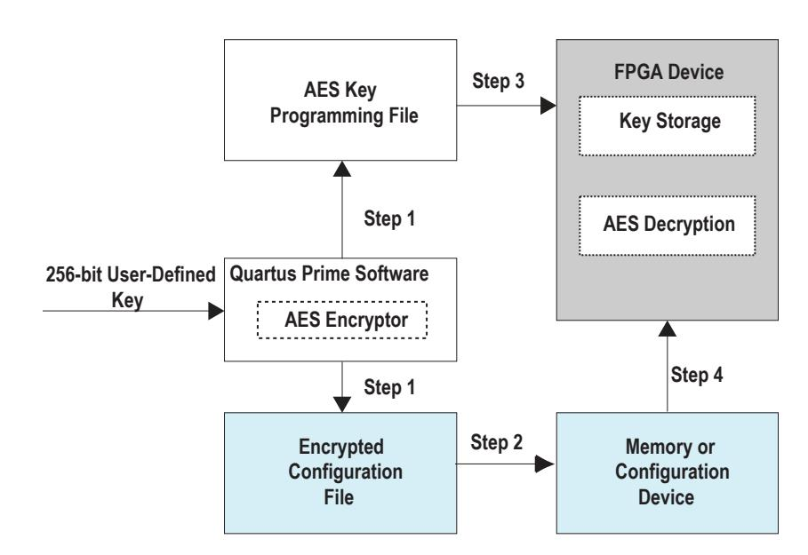

To carry out secure configuration, follow these steps:

- 1. The Intel Quartus Prime software generates the design security key programming file and encrypts the configuration data using the user-defined 256-bit security key.
- 2. Store the encrypted configuration file in the external memory.
- 3. Program the AES key programming file into the Cyclone V device through a JTAG interface.
- 4. Configure the Cyclone V device. At the system power-up, the external memory device sends the encrypted configuration file to the Cyclone V device.

#### **Configuration, Design Security, and Remote System Upgrades in Cyclone V Devices Revision History**

| Document Version                | Changes                                                                                               |
| ------------------------------- | ----------------------------------------------------------------------------------------------------- |
| 2023.10.18 Updated the notes in | Security Modes for clarity.                                                                           |
| 2020.07.24 Updated Figure:      | Single Device AS x1 Mode Configuration and Figure: Single Device AS x4 Mode Configuration             |
| Updated Figure:                 | Connection Setup for Programming the EPCS Using the JTAG Interface                                    |
| and Figure:                     | Connection Setup for Programming the EPCQ Using the JTAG Interface                                    |
| Added topic:                    | I/O Standards and Drive Strength for Configuration Pins                                               |
| 2020.04.13 Removed topic:       | I/O Standards and Drive Strength for Configuration Pins                                               |
| Updated the                     | User Mode topic.                                                                                      |
| Added a note to                 | Device Configuration Pins                                                                             |
| 2019.01.16 Added a note to      | Device Configuration Pins to state that the DCLK , AS_DATA0 , AS_DATA1 , AS_                          |
| DATA2 , AS_DATA3                | , and nCSO pins have 25 kOhm pull-up resistors when the MSEL pins are set to AS configuration scheme. |
| 2018.11.23 Added a new Topic:   | Evaluating Data Setup and Hold Timing Slack in AS Configuration                                       |
| Removed topic:                  | Trace Length and Loading Guideline                                                                    |
| 2018.08.09 Updated the          | Active Serial Configuration topic.                                                                    |
| Updated Figure:                 | AS Configuration Timing Waveform                                                                      |

| Date      | Version    | Changes                                                                |
| --------- | ---------- | ---------------------------------------------------------------------- |
|           | 2017.12.15 | Added description in the I/O Standards and Drive Strength for Configu‐ |
|           |            | ration Pins table.                                                     |
|           | 2016.12.09 | Added note to Power Up and Reset states in the Configuration           |
| June 2016 | 2016.06.10 | Added a note to specify the time between nCSO falling edge to first    |

| Date         | Version    | Changes                                                                |
| ------------ | ---------- | ---------------------------------------------------------------------- |
|              | 2015.12.21 | Changed instances of Quartus II to Quartus Prime                       |
|              |            | Added the CvP_CONFDONE pin to the Configuration Pin Summary for        |
| June 2015    | 2015.06.12 | Added timing waveforms for FPP, AS, and PS configuration.              |
| January 2015 | 2015.01.23 | Added the Transmitting Configuration Data section.                     |
| June 2014    | 2014.06.30 | Updated Figure 7-17: JTAG Configuration of a Single Device Using a     |
| January 2014 | 2014.01.10 | Added decompression support for the CvP configuration mode.            |
| June 2013    | 2013.06.11 | Updated the Configuration Error Handling section.                      |
| May 2013     | 2013.05.10 | Removed support for active serial multi-device configuration using the |
| May 2013     | 2013.05.06 | Added link to the known document issues in the Knowledge Base.         |

| Date         | Version    | Changes                                                       |
| ------------ | ---------- | ------------------------------------------------------------- |
|              | 2012.12.28 | Added configuration modes and features for Cyclone V devices. |
|              |            | Added PR_REQUEST , PR_READY , PR_ERROR , and PR_DONE pins to  |
| June 2012    | 2.0        | Restructured the chapter.                                     |
|              | 1.1        | Updated Table 7-4.                                            |
| October 2011 | 1.0        | Initial release.                                              |

# **SEU Mitigation for Cyclone V Devices 8**

2023.10.18

CV-52008 **[Subscribe](https://www.intel.com/content/www/us/en/docs/programmable/683375/) [Send Feedback](mailto:FPGAtechdocfeedback@intel.com?subject=Feedback%20on%20(CV-52008%202023.10.18)%20SEU%20Mitigation%20for%20Cyclone%20V%20Devices&body=We%20appreciate%20your%20feedback.%20In%20your%20comments,%20also%20specify%20the%20page%20number%20or%20paragraph.%20Thank%20you.)**

This chapter describes the error detection features in Cyclone V devices. You can use these features to mitigate single event upset (SEU) or soft errors.

#### Related Information

#### Cyclone**®** [V Device Handbook: Known Issues](https://www.intel.com/content/www/us/en/support/programmable/articles/000085691.html)

Lists the planned updates to the Cyclone V Device Handbook chapters.

#### **Error Detection Features**

The on-chip error detection CRC circuitry allows you to perform the following operations without any impact on the fitting or performance of the device:

- Auto-detection of CRC errors during configuration.
- Optional CRC error detection and identification in user mode.
- Optional internal scrubbing in user mode. When enabled, this feature corrects single-bit and doubleadjacent errors automatically.
- Testing of error detection functions by deliberately injecting errors through the JTAG interface.

#### **Configuration Error Detection**

When the Intel Quartus Prime software generates the configuration bitstream, the software also computes a 16-bit CRC value for each frame. A configuration bitstream can contain more than one CRC values depending on the number of data frames in the bitstream. The length of the data frame varies for each device.

When a data frame is loaded into the FPGA during configuration, the precomputed CRC value shifts into the CRC circuitry. At the same time, the CRC engine in the FPGA computes the CRC value for the data frame and compares it against the precomputed CRC value. If both CRC values do not match, the nSTATUS pin is set to low to indicate a configuration error.

You can test the capability of this feature by modifying the configuration bitstream or intentionally corrupting the bitstream during configuration.

Intel Corporation. All rights reserved. Intel, the Intel logo, Altera, Arria, Cyclone, Enpirion, MAX, Nios, Quartus and Stratix words and logos are trademarks of Intel Corporation or its subsidiaries in the U.S. and/or other countries. Intel warrants performance of its FPGA and semiconductor products to current specifications in accordance with Intel's standard warranty, but reserves the right to make changes to any products and services at any time without notice. Intel assumes no responsibility or liability arising out of the application or use of any information, product, or service described herein except as expressly agreed to in writing by Intel. Intel customers are advised to obtain the latest version of device specifications before relying on any published information and before placing orders for products or services.

\*Other names and brands may be claimed as the property of others.

[ISO](http://www.altera.com/support/devices/reliability/certifications/rel-certifications.html)

[9001:2015](http://www.altera.com/support/devices/reliability/certifications/rel-certifications.html) [Registered](http://www.altera.com/support/devices/reliability/certifications/rel-certifications.html)

## **User Mode Error Detection**

In user mode, the contents of the configured CRAM bits may be affected by soft errors. These soft errors, which are caused by an ionizing particle, are not common in Altera devices. However, high-reliability applications that require the device to operate error-free may require that your designs account for these errors.

You can enable the error detection circuitry to detect soft errors. Each data frame stored in the CRAM contains a 32-bit precomputed CRC value. When this feature is enabled, the error detection circuitry continuously computes a 32-bit CRC value for each frame in the CRAM and compares the CRC value against the precomputed value.

- If the CRC values match, the 32-bit CRC signature in the syndrome register is set to zero to indicate that no error is detected.
- Otherwise, the resulting 32-bit CRC signature in the syndrome register is non-zero to indicate a CRC error. The CRC\_ERROR pin is pulled high, and the error type and location are identified.

Within a frame, the error detection circuitry can detect all single-, double-, triple-, quadruple-, and quintuple-bit errors. When a single-bit or double-adjacent error is detected, the error detection circuitry reports the bit location and determines the error type for single-bit and double-adjacent errors. The probability of other error patterns is very low and the reporting of bit location is not guaranteed. The probability of more than five CRAM bits being flipped by soft errors is very low. In general, the probability of detection for all error patterns is 99.9999%. The process of error detection continues until the device is reset by setting the nCONFIG signal low.

# **Internal Scrubbing**

Internal scrubbing is the ability to internally correct soft errors in user mode. This feature corrects singlebit and double-adjacent errors detected in each data frame without the need to reconfigure the device.

Note: The SEU internal scrubbing feature is available for Cyclone V E, GX, SE, and SX devices with the "SC" suffix in the part number. For device availability and ordering, contact your local Intel sales representatives.

**Figure 8-1: Block Diagram**

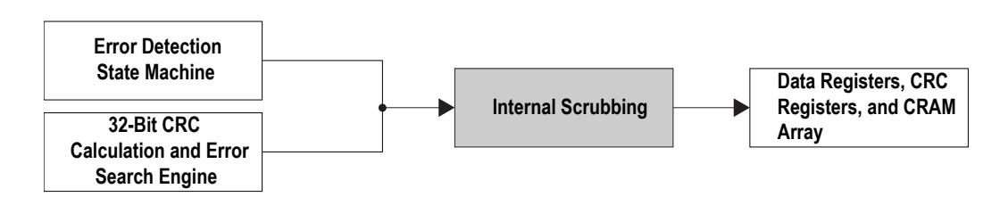

# **Specifications**

This section lists the EMR update interval, error detection frequencies, and CRC calculation time for error detection in user mode.

#### **Minimum EMR Update Interval**

The interval between each update of the error message register depends on the device and the frequency of the error detection clock. Using a lower clock frequency increases the interval time, hence increasing the time required to recover from a single event upset (SEU).

**Table 8-1: Estimated Minimum EMR Update Interval in Cyclone V Devices**

| Variant Member Code | Timing Interval (µs) |
| ------------------- | -------------------- |
| A2                  | 1.47                 |
| A4                  | 1.47                 |
| A5                  | 1.79                 |
| A7                  | 2.33                 |
| A9                  | 3.23                 |
| C3                  | 1.09                 |
| C4                  | 1.79                 |
| C5                  | 1.79                 |
| C7                  | 2.33                 |
| C9                  | 3.23                 |
| D5                  | 1.79                 |
| D7                  | 2.33                 |
| D9                  | 3.23                 |
| A2                  | 1.77                 |
| A4                  | 1.77                 |
| A5                  | 2.31                 |
| A6                  | 2.31                 |
| C4                  | 1.77                 |
| C5                  | 2.31                 |
| C6                  | 2.31                 |
| D5                  | 2.31                 |
| D6                  | 2.31                 |

#### **Error Detection Frequency**

You can control the speed of the error detection process by setting the division factor of the clock frequency in the Intel Quartus Prime software. The divisor is 2n , where n can be any value listed in the following table.

The speed of the error detection process for each data frame is determined by the following equation:

**Figure 8-2: Error Detection Frequency Equation**

**Table 8-2: Error Detection Frequency Range for Cyclone V Devices**

The following table lists the frequencies and valid values of n.

| Internal Oscillator |         | Error Detection Frequency |                           |               |
| ------------------- | ------- | ------------------------- | ------------------------- | ------------- |
| Frequency           |         |                           | n                         | Divisor Range |
|                     | Maximum | Minimum                   |                           |               |
| 100 MHz             | 100 MHz | 390 kHz                   | 0, 1, 2, 3, 4, 5, 6, 7, 8 | 1 – 256       |

#### **CRC Calculation Time For Entire Device**

While the CRC calculation is done on a per frame basis, it is important to know the time taken to complete CRC calculations for the entire device. The entire device detection time is the time taken to do CRC calculations on every frame in the device. This time depends on the device and the error detection clock frequency. The error detection clock frequency also depends on the device and on the internal oscillator frequency, which varies from 42.6 MHz to 100 MHz.

You can calculate the minimum and maximum time for any number of divisor based on the following formula:

Maximum time (n) = 2^(n-8) \* tMAX

Minimum time (n) = 2^n / minimum divisor setting \* tMIN

where the range of n is from 0 to 8.

**Table 8-3: Device EDCRC Detection Time in Cyclone V Devices**

The following table lists the minimum and maximum time taken to calculate the CRC value:

- The minimum time is derived using the maximum clock frequency with the minimum divisor factor
  - (n) for each member code.
- The maximum time is derived using the minimum clock frequency with the maximum divisor factor
  - (n) of 8.

| Variant Member Code | t MIN (ms) | t MAX (s) | Minimum Divisor Settings |
| ------------------- | ---------- | --------- | ------------------------ |
| A2                  | 9          | 2.76      | 2                        |
| A4                  | 9          | 2.76      | 2                        |
| A5 Cyclone V E      | 14         | 4.21      | 2                        |
| A7                  | 12         | 7.36      | 1                        |
| A9                  | 23         | 13.93     | 1                        |

| Variant Member Code | t MIN (ms) | t MAX (s) | Minimum Divisor Settings |
| ------------------- | ---------- | --------- | ------------------------ |
| C3                  | 12         | 1.83      | 4                        |
| C4                  | 14         | 4.21      | 2                        |
| C5 Cyclone V GX     | 14         | 4.21      | 2                        |
| C7                  | 12         | 7.36      | 1                        |
| C9                  | 23         | 13.93     | 1                        |
| D5                  | 14         | 4.21      | 2                        |
| D7 Cyclone V GT     | 12         | 7.36      | 1                        |
| D9                  | 23         | 13.93     | 1                        |
| A2                  | 14         | 4.21      | 2                        |
| A4 Cyclone V SE     | 14         | 4.21      | 2                        |
| A5                  | 12         | 7.36      | 1                        |
| A6                  | 12         | 7.36      | 1                        |
| C2                  | 14         | 4.21      | 2                        |
| C4 Cyclone V SX     | 14         | 4.21      | 2                        |
| C5                  | 12         | 7.36      | 1                        |
| C6                  | 12         | 7.36      | 1                        |
| D5 Cyclone V ST     | 12         | 7.36      | 1                        |
| D6                  | 12         | 7.36      | 1                        |

# **Using Error Detection Features in User Mode**

This section describes the pin, registers, process flow, and procedures for error detection in user mode.

#### **Enabling Error Detection**

To enable user mode error detection and internal scrubbing in the Intel Quartus Prime software, follow these steps:

- 1. On the Assignments menu, click Device.
- 2. In the Device dialog box, click Device and Pin Options.
- 3. In the Category list, click Error Detection CRC.
- 4. Turn on Enable Error Detection CRC\_ERROR pin.
- 5. To set the CRC\_ERROR pin as output open drain, turn on Enable open drain on CRC\_ERROR pin. Turning off this option sets the CRC\_ERROR pin as output.
- 6. To enable the on-chip error correction feature, turn on Enable internal scrubbing.
- 7. In the Divide error check frequency by list, select a valid divisor.
- 8. Click OK.

#### **CRC\_ERROR Pin**

**Table 8-4: Pin Description**

| Pin Name Pin Type        |                                   | Description                             |
| ------------------------ | --------------------------------- | --------------------------------------- |
| CRC_ERROR I/O or output/ |                                   |                                         |
| crcerror                 | port from the WYSIWYG atom to the |                                         |
| dedicated                | CRC_ERROR                         | pin or any user I/O pin. To route       |
| the                      | crcerror                          | port to a user I/O pin, insert a D-type |

#### **Error Detection Registers**

This section describes the registers used in user mode.

**Figure 8-3: Block Diagram for Error Detection in User Mode**

The block diagram shows the registers and data flow in user mode.

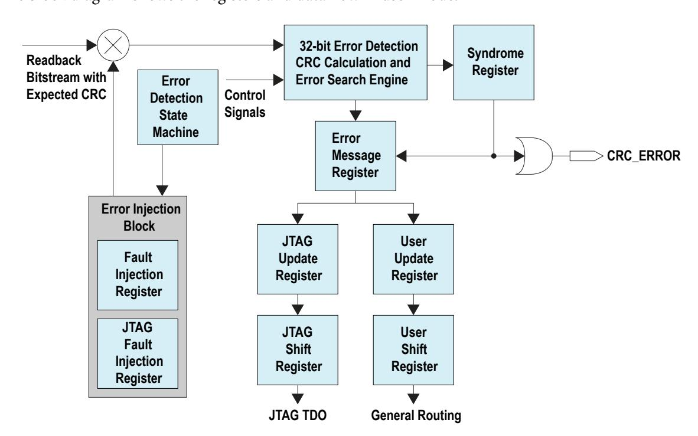

**Table 8-5: Error Detection Registers**

| Name                          | Width |                                                               |
| ----------------------------- | ----- | ------------------------------------------------------------- |
| Syndrome register             | 32    | Contains the 32-bit CRC signature calculated for the          |
|                               |       | current frame. If the CRC value is 0, the CRC_ERROR pin is    |
| Error message register (EMR)  | 67    | Contains error details for single-bit and double-adjacent     |
| JTAG update register          | 67    | This register is automatically updated with the contents of   |
| JTAG shift register           | 67    | This register allows you to access the contents of the JTAG   |
|                               |       | update register via the JTAG interface using the SHIFT_       |
|                               |       | EDERROR_REG JTAG instruction.                                 |
| User update register          | 67    | This register is automatically updated with the contents of   |
| User shift register           | 67    | This register allows user logic to access the contents of the |
| JTAG fault injection register | 46    | You can use this register with the EDERROR_INJECT JTAG        |
| Fault injection register      | 46    | This register is updated with the contents of the JTAG fault  |

**Figure 8-4: Error Message Register Map**

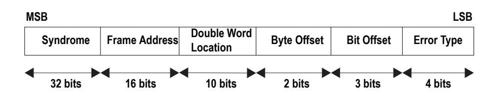

**Table 8-6: Error Type in EMR**

The following table lists the possible error types reported in the error type field in the EMR.

| Bit 3 | Bit 2 | Error Type Bit 1 | Bit 0 | Description                                                   |
| ----- | ----- | ---------------- | ----- | ------------------------------------------------------------- |
| 0     | 0     | 0                | 0     | No CRC error.                                                 |
| 0     | 0     | 0                | 1     | Location of a single-bit error is identified.                 |
| 0     | 0     | 1                | 0     | Location of a double-adjacent error is identified.            |
| 1     | 1     | 1                | 1     | Error types other than single-bit and double-adjacent errors. |

**Table 8-7: JTAG Fault Injection Register Map**

| Field Name Error Byte Value Byte Location Bit 45 | Bit 44 | Bit Range 31:0 41:32 45:42 Bit 43 | Bit 42 | Description field. the first data frame. |
| ------------------------------------------------ | ------ | --------------------------------- | ------ | ---------------------------------------- |
| 0                                                | 0      | 0                                 | 0      | No error                                 |
| 0                                                | 0      | 0                                 | 1      | Single-bit error                         |
| 0                                                | 0      | 1                                 | 0      | Double adjacent error                    |

#### **Error Detection Process**

When enabled, the user mode error detection process activates automatically when the FPGA enters user mode. The process continues to run until the device is reset even when an error is detected in the current frame.

**Figure 8-5: Error Detection Process Flow in User Mode**

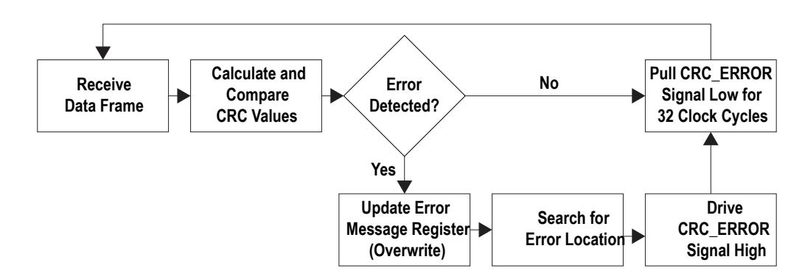

#### **Timing**

The CRC\_ERROR pin is always driven low during CRC calculation. When an error occurs, the EDCRC hard block takes 32 clock cycles to update the EMR, the pin is driven high once the EMR is updated. Therefore, you can start retrieving the contents of the EMR at the rising edge of the CRC\_ERROR pin. The pin stays high until the current frame is read and then driven low again for 32 clock cycles. To ensure information integrity, complete the read operation within one frame of the CRC verification. The following diagram shows the timing of these events.

**Figure 8-6: Timing Requirements**

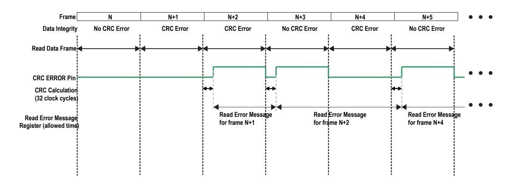

#### **Retrieving Error Information**

You can retrieve the error information via the core interface or the JTAG interface using the SHIFT\_EDERROR\_REG JTAG instruction.

#### **Recovering from CRC Errors**

The system that hosts the FPGA must control device reconfiguration. To recover from a CRC error, drive the nCONFIG signal low. The system waits for a safe time before reconfiguring the device. When reconfigu‐ ration completes successfully, the FPGA operates as intended.

#### Related Information

- [Error Detection Frequency](#page-296-0) on page 8-3
- [Minimum EMR Update Interval](#page-296-0) on page 8-3 Provides more information about the duration of each Cyclone Vdevice.
- AN 539: Test Methodology of Error Detection and Recovery using CRC in Intel FPGA Devices Provides more information about how to retrieve the error information.

#### **Testing the Error Detection Block**

You can inject errors into the configuration data to test the error detection block. This error injection methodology provides design verification and system fault tolerance characterization.

#### **Testing via the JTAG Interface**

You can intentionally inject single or double-adjacent errors into the configuration data using the EDERROR\_INJECT JTAG instruction.

**Table 8-8: EDERROR\_INJECT instruction**

| JTAG Instruction | Instruction Code | Description                                                                                                                                                                                     |
| ---------------- | ---------------- | ----------------------------------------------------------------------------------------------------------------------------------------------------------------------------------------------- |
| EDERROR_INJECT   | 00 0001 0101     | Use this instruction to inject errors into the configuration data. This instruction controls the JTAG fault injection register, which contains the error you want to inject into the bitstream. |

You can only inject errors into the first frame of the configuration data. However, you can monitor the error information at any time. Altera recommends that you reconfigure the FPGA after the test completes.

#### **Automating the Testing Process**

You can automate the testing process by creating a Jam™ file (.jam). Using this file, you can verify the CRC functionality in-system and on-the-fly without reconfiguring the device. You can then switch to the CRC circuitry to check for real errors caused by an SEU.

#### Related Information

AN 539: Test Methodology of Error Detection and Recovery using CRC in Intel FPGA Devices Provides more information about how to test the error detection block.

#### **SEU Mitigation for Cyclone V Devices Document Revision History**

| Document Version | Changes                                                                                         |
| ---------------- | ----------------------------------------------------------------------------------------------- |
| 2019.10.03       | Updated the Minimum time calculation formula in <i>CRC Calculation Time For Entire Device</i> . |
| 2018.06.01       | Updated the Minimum time calculation formula in <i>CRC Calculation Time For Entire Device</i> . |

| Date         | Version    | Changes                                                             |
| ------------ | ---------- | ------------------------------------------------------------------- |
| March 2018   | 2018.03.02 | Updated Cyclone V SX t MIN (ms) value in Device EDCRC Detection     |
|              |            | Time in Cyclone V Devices table.                                    |
|              | 2017.12.15 | Updated Device EDCRC Detection Time in Cyclone V Devices table to   |
| August 2016  | 2016.08.24 | Updated t MIN and t MAX in Device EDCRC Detection Time in Cyclone V |
|              | 2015.12.21 | Changed instances of Quartus II to Quartus Prime.                   |
| March 2015   | 2015.03.31 | Added support for the internal scrubbing feature.                   |
| January 2015 | 2015.01.23 | Updated the description in the CRC Calculation Time section.        |
| June 2014    | 2014.06.30 | Updated the CRC Calculation Time section.                           |

| Date         | Version    | Changes                                                              |
| ------------ | ---------- | -------------------------------------------------------------------- |
|              | 2013.11.12 | Updated the CRC Calculation Time section to include a formula to     |
| May 2013     | 2013.05.06 | Added link to the known document issues in the Knowledge Base.       |
|              | 2012.12.28 | Updated the width of the JTAG fault injection and fault injection    |
| June 2012    | 2.0        | Added the “Basic Description”, “Error Detection Features”, “Types of |
| October 2011 | 1.0        | Initial release.                                                     |

**JTAG Boundary-Scan Testing in Cyclone V**

**Devices 9**

# 2023.10.18 CV-52009 **[Subscribe](https://www.intel.com/content/www/us/en/docs/programmable/683375/) [Send Feedback](mailto:FPGAtechdocfeedback@intel.com?subject=Feedback%20on%20(CV-52009%202023.10.18)%20JTAG%20Boundary-Scan%20Testing%20in%20Cyclone%20V%20Devices&body=We%20appreciate%20your%20feedback.%20In%20your%20comments,%20also%20specify%20the%20page%20number%20or%20paragraph.%20Thank%20you.)** Related Information and during configuration.

This chapter describes the boundary-scan test (BST) features in Cyclone V devices.

- [JTAG Configuration](#page-276-0) on page 7-34 Provides more information about JTAG configuration.
- Cyclone**®** [V Device Handbook: Known Issues](https://www.intel.com/content/www/us/en/support/programmable/articles/000085691.html) Lists the planned updates to the Cyclone V Device Handbook chapters.

#### **BST Operation Control**

Cyclone V devices support IEEE Std. 1149.1 BST. You can perform BST on Cyclone V devices before, after,

#### **IDCODE**

The IDCODE is unique for each Cyclone V device. Use this code to identify the devices in a JTAG chain.

Intel Corporation. All rights reserved. Intel, the Intel logo, Altera, Arria, Cyclone, Enpirion, MAX, Nios, Quartus and Stratix words and logos are trademarks of Intel Corporation or its subsidiaries in the U.S. and/or other countries. Intel warrants performance of its FPGA and semiconductor products to current specifications in accordance with Intel's standard warranty, but reserves the right to make changes to any products and services at any time without notice. Intel assumes no responsibility or liability arising out of the application or use of any information, product, or service described herein except as expressly agreed to in writing by Intel. Intel customers are advised to obtain the latest version of device specifications before relying on any published information and before placing orders for products or services.

\*Other names and brands may be claimed as the property of others.

[ISO](http://www.altera.com/support/devices/reliability/certifications/rel-certifications.html)

[9001:2015](http://www.altera.com/support/devices/reliability/certifications/rel-certifications.html) [Registered](http://www.altera.com/support/devices/reliability/certifications/rel-certifications.html)

**Table 9-1: IDCODE Information for Cyclone V Devices**

| Variant      | Member Code | IDCODE (32 Bits) |                        |                                |             |
| ------------ | ----------- | ---------------- | ---------------------- | ------------------------------ | ----------- |
|              |             | Version (4 Bits) | Part Number (16 Bits)  | Manufacture Identity (11 Bits) | LSB (1 Bit) |
| Cyclone V E  | A2          | 0000             | 0010 1011 0001 0101 | 000 0110 1110                  | 1           |
|              | A4          | 0000             | 0010 1011 0000 0101 | 000 0110 1110                  | 1           |
|              | A5          | 0000             | 0010 1011 0010 0010 | 000 0110 1110                  | 1           |
|              | A7          | 0000             | 0010 1011 0001 0011 | 000 0110 1110                  | 1           |
|              | A9          | 0000             | 0010 1011 0001 0100 | 000 0110 1110                  | 1           |
|              | C3          | 0000             | 0010 1011 0000 0001 | 000 0110 1110                  | 1           |
| Cyclone V GX | C4          | 0000             | 0010 1011 0001 0010 | 000 0110 1110                  | 1           |
|              | C5          | 0000             | 0010 1011 0000 0010 | 000 0110 1110                  | 1           |
|              | C7          | 0000             | 0010 1011 0000 0011 | 000 0110 1110                  | 1           |
|              | C9          | 0000             | 0010 1011 0000 0100 | 000 0110 1110                  | 1           |
| Cyclone V GT | D5          | 0000             | 0010 1011 0000 0010 | 000 0110 1110                  | 1           |
|              | D7          | 0000             | 0010 1011 0000 0011 | 000 0110 1110                  | 1           |
|              | D9          | 0000             | 0010 1011 0000 0100 | 000 0110 1110                  | 1           |
| Cyclone V SE | A2          | 0000             | 0010 1101 0001 0001 | 000 0110 1110                  | 1           |
|              | A4          | 0000             | 0010 1101 0000 0001 | 000 0110 1110                  | 1           |
|              | A5          | 0000             | 0010 1101 0001 0010 | 000 0110 1110                  | 1           |
|              | A6          | 0000             | 0010 1101 0000 0010 | 000 0110 1110                  | 1           |

| Variant      | Member Code | IDCODE (32 Bits) |                        |                                |             |
| ------------ | ----------- | ---------------- | ---------------------- | ------------------------------ | ----------- |
|              |             | Version (4 Bits) | Part Number (16 Bits)  | Manufacture Identity (11 Bits) | LSB (1 Bit) |
| Cyclone V SX | C2          | 0000             | 0010 1101 0001 0001 | 000 0110 1110                  | 1           |
|              | C4          | 0000             | 0010 1101 0000 0001 | 000 0110 1110                  | 1           |
|              | C5          | 0000             | 0010 1101 0001 0010 | 000 0110 1110                  | 1           |
|              | C6          | 0000             | 0010 1101 0000 0010 | 000 0110 1110                  | 1           |
|              | D5          | 0000             | 0010 1101 0001 0010 | 000 0110 1110                  | 1           |
| Cyclone V ST | D6          | 0000             | 0010 1101 0000 0010 | 000 0110 1110                  | 1           |

#### **Supported JTAG Instruction**

**Table 9-2: JTAG Instructions Supported by Cyclone V Devices**

| JTAG Instruction | Instruction Code | Description                        |
| ---------------- | ---------------- | ---------------------------------- |
| SAMPLE / PRELOAD | 00 0000 0101     | Allows you to capture and          |
|                  |                  | before loading the EXTEST instruc‐ |

| JTAG Instruction | Instruction Code | Description                                                                                                                                                                                                                                                                                                                                                                                                                                   |
| ---------------- | ---------------- | --------------------------------------------------------------------------------------------------------------------------------------------------------------------------------------------------------------------------------------------------------------------------------------------------------------------------------------------------------------------------------------------------------------------------------------------- |
| EXTEST           | 00 0000 1111     | <ul> <li>Allows you to test the external circuit and board-level interconnects by forcing a test pattern at the output pins, and capturing the test results at the input pins. Forcing known logic high and low levels on output pins allows you to detect opens and shorts at the pins of any device in the scan chain.</li> <li>The high-impedance state of EXTEST is overridden by bus hold and weak pull-up resistor features.</li> </ul> |
| BYPASS           | 11 1111 1111     | Places the 1-bit bypass register between the TDI and TDO pins. During normal device operation, the 1-bit bypass register allows the BST data to pass synchronously through the selected devices to adjacent devices.                                                                                                                                                                                                                          |
| USERCODE         | 00 0000 0111     | <ul> <li>Examines the user electronic signature (UES) within the devices along a JTAG chain.</li> <li>Selects the 32-bit USERCODE register and places it between the TDI and TDO pins to allow serial shifting of USERCODE out of TDO.</li> <li>The UES value is set to default value before configuration and is only user-defined after the device is configured.</li> </ul>                                                                |

| JTAG Instruction | Instruction Code | Description                                                                                                                                                                                                                                                                                                                                                                                                                                                                                                                            |
| ---------------- | ---------------- | -------------------------------------------------------------------------------------------------------------------------------------------------------------------------------------------------------------------------------------------------------------------------------------------------------------------------------------------------------------------------------------------------------------------------------------------------------------------------------------------------------------------------------------- |
| IDCODE           | 00 0000 0110     | <ul> <li>Identifies the devices in a JTAG chain. If you select IDCODE, the device identification register is loaded with the 32-bit vendor-defined identification code.</li> <li>Selects the IDCODE register and places it between the TDI and TDO pins to allow serial shifting of IDCODE out of TDO.</li> <li>IDCODE is the default instruction at power up and in the TAP RESET state. Without loading any instructions, you can go to the SHIFT_DR state and shift out the JTAG device ID.</li> </ul>                              |
| HIGHZ            | 00 0000 1011     | <ul> <li>Sets all user I/O pins to an inactive drive state.</li> <li>Places the 1-bit bypass register between the TDI and TDO pins. During normal operation, the 1-bit bypass register allows the BST data to pass synchronously through the selected devices to adjacent devices while tri-stating all I/O pins until a new JTAG instruction is executed.</li> <li>If you are testing the device after configuration, the programmable weak pull-up resistor or the bus hold feature overrides the HIGHZ value at the pin.</li> </ul> |

| JTAG Instruction | Instruction Code | Description                                                                                                                                                                                                                                                                                                                                                                                                                                                                                                                                                                            |
| ---------------- | ---------------- | -------------------------------------------------------------------------------------------------------------------------------------------------------------------------------------------------------------------------------------------------------------------------------------------------------------------------------------------------------------------------------------------------------------------------------------------------------------------------------------------------------------------------------------------------------------------------------------- |
| CLAMP            | 00 0000 1010     | <ul> <li>Places the 1-bit bypass register between the TDI and TDO pins. During normal operation, the 1-bit bypass register allows the BST data to pass synchronously through the selected devices to adjacent devices while holding the I/O pins to a state defined by the data in the boundary-scan register.</li> <li>If you are testing the device after configuration, the programmable weak pull-up resistor or the bus hold feature overrides the CLAMP value at the pin. The CLAMP value is the value stored in the update register of the boundary-scan cell (BSC).</li> </ul> |
| PULSE_NCONFIG    | 00 0000 0001     | Emulates pulsing the nCONFIG pin low to trigger reconfiguration even though the physical pin is not affected.                                                                                                                                                                                                                                                                                                                                                                                                                                                                          |
| CONFIG_IO        | 00 0000 1101     | Allows I/O reconfiguration (after or during reconfigurations) through the JTAG ports using I/O configuration shift register (IOCSR) for JTAG testing. You can issue the CONFIG_IO instruction only after the nSTATUS pin goes high.                                                                                                                                                                                                                                                                                                                                                    |
| LOCK             | 01 1111 0000     | Put the device in JTAG secure mode. In this mode, only BYPASS, SAMPLE/PRELOAD, EXTEST, IDCODE, SHIFT_EDERROR_REG, and UNLOCK instructions are supported. This instruction can only be accessed through JTAG core access in user mode. It cannot be accessed through external JTAG pins in test or user mode.                                                                                                                                                                                                                                                                           |

| JTAG Instruction | Instruction Code | Description                            |
| ---------------- | ---------------- | -------------------------------------- |
| UNLOCK           | 11 0011 0001     | Release the device from the JTAG       |
| KEY_CLR_VREG     | 00 0010 1001     | Clears the volatile key.               |
| KEY_VERIFY       | 00 0001 0011     | Verifies the non-volatile key has been |

Note: If the device is in a reset state and the nCONFIG or nSTATUS signal is low, the device IDCODE might not be read correctly. To read the device IDCODE correctly, you must issue the IDCODE JTAG instruc‐ tion only when the nCONFIG and nSTATUS signals are high.

#### Related Information

[JTAG Secure Mode](#page-288-0) on page 7-46

Provides more information about PULSE\_NCONFIG, CONFIG\_IO, LOCK, and UNLOCK JTAG instructions.

#### **JTAG Secure Mode**

If you enable the tamper-protection bit, the Cyclone V device is in JTAG secure mode after power up. In the JTAG secure mode, the JTAG pins support only the BYPASS, SAMPLE/PRELOAD, EXTEST, IDCODE, SHIFT\_EDERROR\_REG, and UNLOCK instructions. Issue the UNLOCK JTAG instruction to enable support for other JTAG instructions.

#### **JTAG Private Instruction**

Caution: Never invoke the following instruction codes. These instructions can damage and render the device unusable:

- 1100010000
- 0011001001
- 1100010011
- 1100010111
- 0111100000
- 1110110011
- 0011100101
- 0011100110
- 0000101010
- 0000101011

## **I/O Voltage for JTAG Operation**

The Cyclone V device operating in IEEE Std. 1149.1 BST mode uses four dedicated JTAG pins—TDI, TDO, TMS, and TCK. Cyclone V devices do not support the optional TRST pin.

The TCK pin has an internal weak pull-down resistor, while the TDI and TMS pins have internal weak pullup resistors. The 3.3-, 3.0-, or 2.5-V VCCPD supply of I/O bank 3A powers the TDO, TDI, TMS, and TCK pins. All user I/O pins are tri-stated during JTAG configuration.

The JTAG chain supports several different devices. Use the supported TDO and TDI voltage combinations listed in the following table if the JTAG chain contains devices that have different VCCIO levels. The output voltage level of the TDO pin must meet the specification of the TDI pin it drives.

**Table 9-3: Supported TDO and TDI Voltage Combinations**

The TDO output buffer for VCCPD of 3.3 V or 3.0 V meets VOH (MIN) of 2.4 V, and the TDO output buffer for VCCPD of 2.5 V meets VOH (MIN) of 2.0 V.

| Device TDI Input Buffer |      |       |                |                 |                |
| ----------------------- | ---- | ----- | -------------- | --------------- | -------------- |
|                         |      |       |                | Cyclone V TDO V | CCPD           |
|                         |      |       | V CCPD = 3.3 V | V CCPD = 3.0 V  | V CCPD = 2.5 V |
| V                       | CCPD | = 3.3 | Yes            | Yes             | Yes            |
| V                       | CCPD | = 3.0 | Yes            | Yes             | Yes            |
| V                       | CCPD | = 2.5 | Yes            | Yes             | Yes            |
| Non-Cyclone V (26)      |      |       |                |                 |                |
| V                       | CC   | = 3.3 | Yes            | Yes             | Yes            |
| V                       | CC   | = 2.5 | Yes            | Yes             | Yes            |
| V                       | CC   | = 1.8 | Yes            | Yes             | Yes            |
| V                       | CC   | = 1.5 | Yes            | Yes             | Yes            |

# **Performing BST**

You can issue BYPASS, IDCODE, and SAMPLE JTAG instructions before, after, or during configuration without having to interrupt configuration.

To issue other JTAG instructions, follow these guidelines:

- To perform testing before configuration, hold the nCONFIG pin low.
- To perform BST during configuration, issue CONFIG\_IO JTAG instruction to interrupt configuration. While configuration is interrupted, you can issue other JTAG instructions to perform BST. After BST is completed, issue the PULSE\_CONFIG JTAG instruction or pulse nCONFIG low to reconfigure the device.

The chip-wide reset (DEV\_CLRn) and chip-wide output enable (DEV\_OE) pins on Cyclone V devices do not affect JTAG boundary-scan or configuration operations. Toggling these pins does not disrupt BST operation (other than the expected BST behavior).

(26) The input buffer must be tolerant to the TDO VCCPD voltage.

If you design a board for JTAG configuration of Cyclone V devices, consider the connections for the dedicated configuration pins.

#### Related Information

- [JTAG Configuration](#page-276-0) on page 7-34 Provides more information about JTAG configuration.
- FPGA JTAG Configuration Timing, Cyclone**®** V Device Datasheet Provides more information about JTAG configuration timing.
- Cyclone**®** [V GX, GT, E, SX, ST and SE Device Family Pin Connection Guidelines](https://cdrdv2.intel.com/v1/dl/getContent/654351) Provides more information about pin connections.

#### **Enabling and Disabling IEEE Std. 1149.1 BST Circuitry**

The IEEE Std. 1149.1 BST circuitry is enabled after the Cyclone V device powers up. However for Cyclone V SoC FPGAs, you must power up both HPS and FPGA to perform BST.

The HPS should be held in reset while performing BST to stop the I/Os being accessed or setup by the HPS.

To ensure that you do not inadvertently enable the IEEE Std. 1149.1 circuitry when it is not required, disable the circuitry permanently with pin connections as listed in the following table.

**Table 9-4: Pin Connections to Permanently Disable the IEEE Std. 1149.1 Circuitry for Cyclone V Devices**

|     | JTAG Pins (27) | Connection for Disabling |
| --- | -------------- | ------------------------ |
| TMS |                | V CCPD supply of Bank 3A |
| TCK |                | GND                      |
| TDI |                | V CCPD supply of Bank 3A |
| TDO |                | Leave open               |

(27) The JTAG pins are dedicated. Software option is not available to disable JTAG in Cyclone V devices.

## **Guidelines for IEEE Std. 1149.1 Boundary-Scan Testing**

Consider the following guidelines when you perform BST with IEEE Std. 1149.1 devices:

- If the "10..." pattern does not shift out of the instruction register through the TDO pin during the first clock cycle of the SHIFT\_IR state, the TAP controller did not reach the proper state. To solve this problem, try one of the following procedures:
  - Verify that the TAP controller has reached the SHIFT\_IR state correctly. To advance the TAP controller to the SHIFT\_IR state, return to the RESET state and send the 01100 code to the TMS pin.
  - Check the connections to the VCC, GND, JTAG, and dedicated configuration pins on the device.
- Perform a SAMPLE/PRELOAD test cycle before the first EXTEST test cycle to ensure that known data is present at the device pins when you enter EXTEST mode. If the OEJ update register contains 0, the data in the OUTJ update register is driven out. The state must be known and correct to avoid contention with other devices in the system.
- Do not perform EXTEST testing during in-circuit reconfiguration because EXTEST is not supported during in-circuit reconfiguration. To perform testing, wait for the configuration to complete or issue the CONFIG\_IO instruction to interrupt configuration.
- After configuration, you cannot test any pins in a differential pin pair. To perform BST after configura‐ tion, edit and redefine the BSC group that correspond to these differential pin pairs as an internal cell.

#### Related Information

#### [IEEE 1149.1 BSDL Files](https://www.intel.com/content/www/us/en/support/programmable/support-resources/board-layout/bsd-11491.html)

Provides more information about BSC group definitions.

#### **IEEE Std. 1149.1 Boundary-Scan Register**

The boundary-scan register is a large serial shift register that uses the TDI pin as an input and the TDO pin as an output. The boundary-scan register consists of 3-bit peripheral elements that are associated with Cyclone V I/O pins. You can use the boundary-scan register to test external pin connections or to capture internal data.

**Figure 9-1: Boundary-Scan Register**

This figure shows how test data is serially shifted around the periphery of the IEEE Std. 1149.1 device.

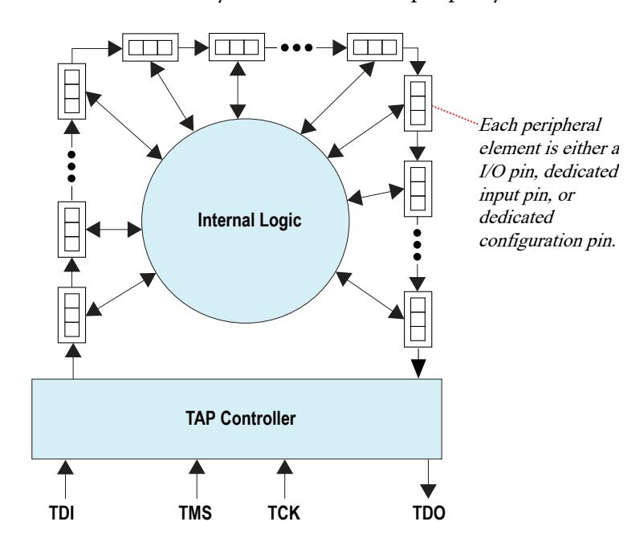

#### **Boundary-Scan Cells of a Cyclone V Device I/O Pin**

The Cyclone V device 3-bit BSC consists of the following registers:

- Capture registers—Connect to internal device data through the OUTJ, OEJ, and PIN\_IN signals.
- Update registers—Connect to external data through the PIN\_OUT and PIN\_OE signals.

The TAP controller generates the global control signals for the IEEE Std. 1149.1 BST registers (shift, clock, and update) internally. A decode of the instruction register generates the MODE signal.

The data signal path for the boundary-scan register runs from the serial data in (SDI) signal to the serial data out (SDO) signal. The scan register begins at the TDI pin and ends at the TDO pin of the device.

**Figure 9-2: User I/O BSC with IEEE Std. 1149.1 BST Circuitry for Cyclone V Devices**

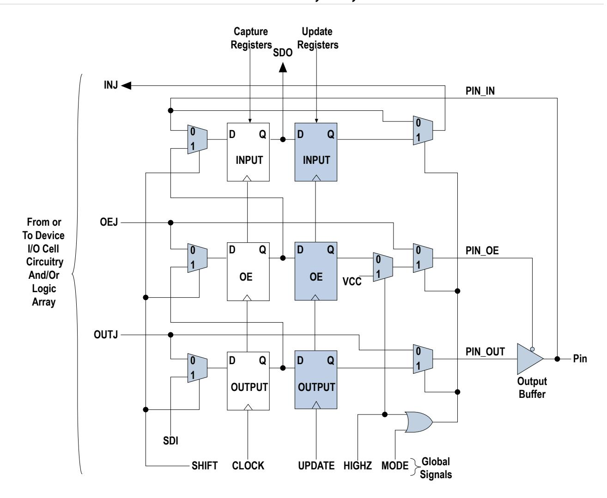

Note: TDI, TDO, TMS, and TCK pins, all VCC and GND pin types, and VREF pins do not have BSCs.

**Table 9-5: Boundary-Scan Cell Descriptions for Cyclone V Devices**

This table lists the capture and update register capabilities of all BSCs within Cyclone V devices.

|               |        | Captures |        |         | Drives |      |               |
| ------------- | ------ | -------- | ------ | ------- | ------ | ---- | ------------- |
|               | Output |          |        |         |        |      | Comments      |
| User I/O pins | OUTJ   | OEJ      | PIN_IN | PIN_OUT | PIN_OE | INJ  | —             |
|               | 0      | 1        | PIN_IN | No      |        |      |               |
|               |        |          |        |         | N.C.   | N.C. | PIN_IN drives |

| Pin Type                                             | Captures                |                     |                        | Drives                 |                    |                       | Comments                                                                        |
| ---------------------------------------------------- | ----------------------- | ------------------- | ---------------------- | ---------------------- | ------------------ | --------------------- | ------------------------------------------------------------------------------- |
|                                                      | Output Capture Register | OE Capture Register | Input Capture Register | Output Update Register | OE Update Register | Input Update Register |                                                                                 |
| Dedicated input (28)                      | 0                       | 1                   | PIN_IN                 | N.C.                   | N.C.               | N.C.                  | PIN_IN drives to the control logic                                              |
| Dedicated bidirectional (open drain) (29) | 0                       | OEJ                 | PIN_IN                 | N.C.                   | N.C.               | N.C.                  | PIN_IN drives to the configuration control                                      |
| Dedicated bidirectional (30)              | OUTJ                    | OEJ                 | PIN_IN                 | N.C.                   | N.C.               | N.C.                  | PIN_IN drives to the configuration control and OUTJ drives to the output buffer |
| Dedicated output (31)                     | OUTJ                    | 0                   | 0                      | N.C.                   | N.C.               | N.C.                  | OUTJ drives to the output buffer                                                |

#### **JTAG Boundary-Scan Testing inCyclone V Devices Revision History**

| Date         | Version    | Changes                                                         |
| ------------ | ---------- | --------------------------------------------------------------- |
|              | 2015.12.21 | Changed instances of Quartus II to Quartus Prime.               |
| June 2015    | 2015.06.12 | Added a note in the Enabling and Disabling IEEE Std. 1149.1 BST |
| June 2014    | 2014.06.30 | Removed a note in the Performing BST section.                   |
| January 2014 | 2014.01.10 | Added a note to the Performing BST section.                     |
|              |            | Updated the KEY_CLR_VREG JTAG instruction.                      |

(28) This includes the PLL\_ENA, VCCSEL, PORSEL, nIO\_PULLUP, nCONFIG, MSEL0, MSEL1, MSEL2, MSEL3, MSEL4, and nCE pins.

(29) This includes the CONF\_DONE and nSTATUS pins.

(30) This includes the DCLK pin.

(31) This includes the nCEO pin.

| Date         | Version    | Changes                                                        |
| ------------ | ---------- | -------------------------------------------------------------- |
| May 2013     | 2013.05.06 | Added link to the known document issues in the Knowledge Base. |
|              | 2012.12.28 | Reorganized content and updated template.                      |
| June 2012    | 2.0        | Restructured the chapter.                                      |
| October 2011 | 1.0        | Initial release.                                               |

# **Power Management in Cyclone V Devices10**

2023.10.18

CV-52010 **[Subscribe](https://www.intel.com/content/www/us/en/docs/programmable/683375/) [Send Feedback](mailto:FPGAtechdocfeedback@intel.com?subject=Feedback%20on%20(CV-52010%202023.10.18)%20Power%20Management%20in%20Cyclone%20V%20Devices&body=We%20appreciate%20your%20feedback.%20In%20your%20comments,%20also%20specify%20the%20page%20number%20or%20paragraph.%20Thank%20you.)**

This chapter describes the hot-socketing feature, power-on reset (POR) requirements, and their implementation in Cyclone V devices.

#### Related Information

- Cyclone**®** [V Device Handbook: Known Issues](https://www.intel.com/content/www/us/en/support/programmable/articles/000085691.html) Lists the planned updates to the Cyclone V Device Handbook chapters.
- Intel**®** Quartus**®** Prime Standard Edition User Guide: Power Analysis and Optimization Provides more information about the Intel® Quartus® Prime Power Analyzer tool.
- Cyclone V Device Datasheet Provides more information about the recommended operating conditions of each power supply.
- Cyclone**®** [V GX, GT, E, SX, ST and SE Device Family Pin Connection Guidelines](https://cdrdv2.intel.com/v1/dl/getContent/654351) Provides detailed information about power supply pin connection guidelines and power regulator sharing.
- AN 958: Board Design Guidelines Provides detailed information about power supply design requirements.
- [Arria V and Cyclone V Design Guidelines](https://cdrdv2.intel.com/v1/dl/getContent/654271)

#### **Power Consumption**

The total power consumption of a Cyclone V device consists of the following components:

- Static power—the power that the configured device consumes when powered up but no clocks are operating.
- Dynamic power— the additional power consumption of the device due to signal activity or toggling.

#### **Dynamic Power Equation**

**Figure 10-1: Dynamic Power**

The following equation shows how to calculate dynamic power where P is power, C is the load capacitance, and V is the supply voltage level.

$$P = \frac{1}{2}CV^2 \times \text{frequency}$$

Intel Corporation. All rights reserved. Intel, the Intel logo, Altera, Arria, Cyclone, Enpirion, MAX, Nios, Quartus and Stratix words and logos are trademarks of Intel Corporation or its subsidiaries in the U.S. and/or other countries. Intel warrants performance of its FPGA and semiconductor products to current specifications in accordance with Intel's standard warranty, but reserves the right to make changes to any products and services at any time without notice. Intel assumes no responsibility or liability arising out of the application or use of any information, product, or service described herein except as expressly agreed to in writing by Intel. Intel customers are advised to obtain the latest version of device specifications before relying on any published information and before placing orders for products or services.

\*Other names and brands may be claimed as the property of others.

[ISO](http://www.altera.com/support/devices/reliability/certifications/rel-certifications.html) [9001:2015](http://www.altera.com/support/devices/reliability/certifications/rel-certifications.html) [Registered](http://www.altera.com/support/devices/reliability/certifications/rel-certifications.html) The equation shows that power is design-dependent and is determined by the operating frequency of your design. Cyclone V devices minimize static and dynamic power using advanced process optimizations. This technology allows Cyclone V designs to meet specific performance requirements with the lowest possible power.

#### **Hot-Socketing Feature**

Cyclone V devices support hot socketing—also known as hot plug-in or hot swap.

The hot-socketing circuitry monitors the VCCIO, VCCPD, and VCC power supplies and all VCCIO and VCCPD banks.

You can power up or power down these power supplies in any sequence.

During the hot-socketing operation, the I/O pin capacitance is less than 15 pF and the clock pin capacitance is less than 20 pF.

The hot-socketing capability removes some of the difficulty that designers face when using the Cyclone V devices on PCBs that contain a mixture of devices with different voltage requirements.

The hot-socketing capability in Cyclone V devices provides the following advantages:

- You can drive signals into the I/O, dedicated input, and dedicated clock pins before or during power up or power down without damaging the device. External input signals to the I/O pins of the unpowered device will not power the power supplies through internal paths within the device.
- The output buffers are tri-stated during system power up or power down. Because the Cyclone V device does not drive signals out before or during power up, the device does not affect the other operating buses.
- You can insert or remove a Cyclone V device from a powered-up system board without damaging or interfering with the system board's operation. This capability allows you to avoid sinking current through the device signal pins to the device power supply, which can create a direct connection to GND that causes power supply failures.
- During hot socketing, Cyclone V devices are immune to latch up that can occur when a device is hotsocketed into an active system.

Altera uses GND as a reference for hot-socketing and I/O buffer circuitry designs. To ensure proper operation, connect GND between boards before connecting the power supplies. This prevents GND on your board from being pulled up inadvertently by a path to power through other components on your board. A pulled up GND could otherwise cause an out-of-specification I/O voltage or over current condition in the Altera device.

#### Related Information

#### Hot Socketing, Cyclone V Device Datasheet

Provides details about the Cyclone V hot-socketing specifications.

#### **Hot-Socketing Implementation**

The hot-socketing feature tri-state the output buffer during power up and power down of the power supplies. When these power supplies are below the threshold voltage, the hot-socketing circuitry generates an internal HOTSCKT signal.

Hot-socketing circuitry prevents excess I/O leakage during power up. When the voltage ramps up very slowly, I/O leakage is still relatively low, even after the release of the POR signal and configuration is complete.

Note: The output buffer cannot flip from the state set by the hot-socketing circuitry at very low voltage. To allow the CONF\_DONE and nSTATUS pins to operate during configuration, the hot-socketing feature is not applied to these configuration pins. Therefore, these pins will drive out during power up and power down.

**Figure 10-2: Hot-Socketing Circuitry for Cyclone V Devices**

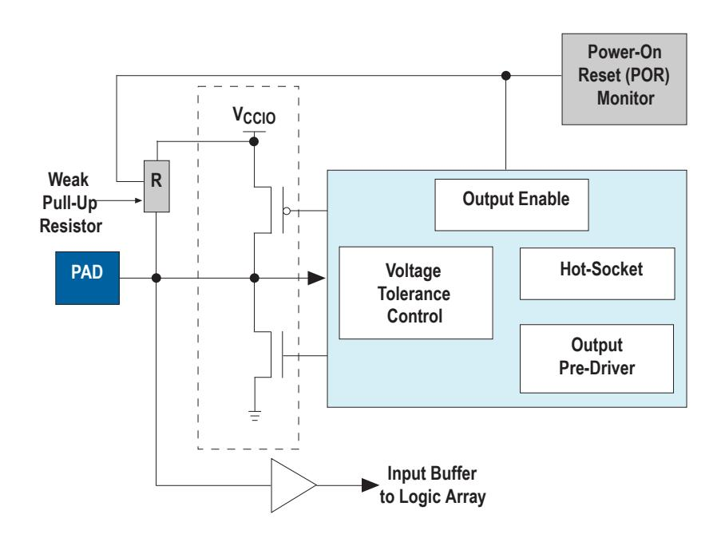

The POR circuitry monitors the voltage level of the power supplies and keeps the I/O pins tri-stated until the device is in user mode. The weak pull-up resistor (R) in the Cyclone V input/output element (IOE) is enabled during configuration download to keep the I/O pins from floating.

The 3.3-V tolerance control circuit allows the I/O pins to be driven by 3.3 V before the power supplies are powered and prevents the I/O pins from driving out before the device enters user mode.

## **Power-Up Sequence Recommendation for Cyclone V Devices**

**Figure 10-3: Power-Up Sequence Recommendation for Cyclone V Devices**

To ensure the minimum current draw during device power up for Cyclone V devices, follow the power-up sequence recommendations as shown in the following figure.

Power up VCCBAT at any time. Ramp up the power rails in Group 1 to a minimum of 80% of their full rail before Group 2 starts. Power up VCCE\_GXB and VCCL\_GXB together with VCC.

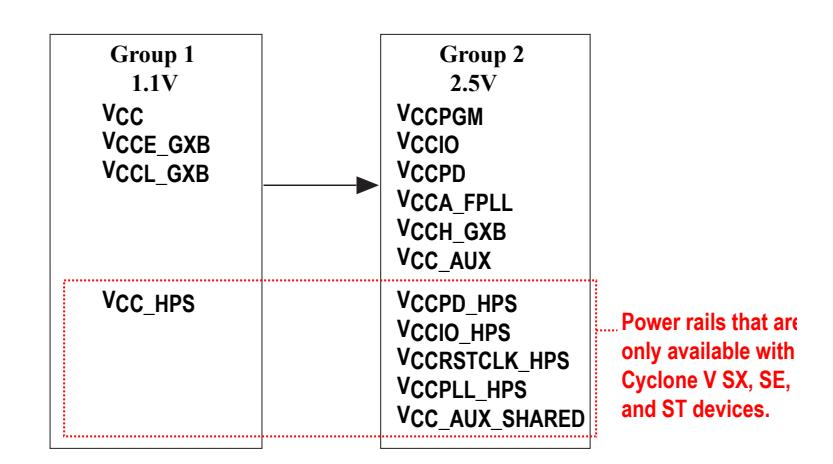

This table lists the current transient that you may observe at the indicated power rails after powering up the Cyclone V device, and before configuration starts. These transients have a finite duration bounded by the time at which the device enters configuration mode. For Cyclone V SX, SE and ST devices, you may observe the current transient in the following table after powering up the device, and before all the power supplies reach the recommended operating range.

For details about the minimum current requirements, refer to the Early Power Estimator (EPE), and compare to the information listed in the following table. If the current transient exceeds the minimum current requirements in the EPE, you need to take the information into consideration for your power regulator design.

**Table 10-1: Maximum Power Supply Current Transient and Typical Duration**

|     | Power Rail                            | Maximum Power Supply Current Transient (mA) | Typical Duration ( $\mu$ s) (32) |
| --- | ------------------------------------- | ------------------------------------------- | ------------------------------------------- |
|     | $V_{\text{CCPD}}$ (33)(34) | 1000                                        | 50                                          |
|     | $V_{\text{CClO}}$ (34)(35) | 250                                         | 200                                         |

(32) Only typical duration is provided as it may vary on the board design.

(33) You may observe the current transient at VCCPD only when you do not follow the recommended power-up sequence. To avoid the current transient at VCCPD, follow the recommended power-up sequence.

(34) The maximum current for VCCIO and VCCPD applies to all voltage levels supported by the Cyclone V device.

(35) You may observe the current transient at VCCIO if you power up VCCIO before VCCPD. To avoid the current transient at VCCIO, follow the recommended power-up sequence by powering up VCCIO and VCCPD together.

| Power Rail                               | Maximum Power Supply Current Transient (mA) | Typical Duration ( $\mu$ s) (32) |
| ---------------------------------------- | ------------------------------------------- | ------------------------------------------- |
| $V_{CC_{AUX}}$ (36)           | 400                                         | 10                                          |
| $V_{CC}$ (36)                 | 350                                         | 100                                         |
| $V_{CCPD_{HPS}}$ (37)(38)(39) | 400                                         | 50                                          |
| $V_{CCIO_{HPS}}$ (37)(39)(40) | 100                                         | 200                                         |
| $V_{CC_{HPS}}$ (36)(37)       | 420                                         | 100                                         |

#### [Early Power Estimators \(EPE\) and Power Analyzer](https://www.intel.com/content/www/us/en/support/programmable/support-resources/power/pow-powerplay.html)

Provides more information about the EPE support for Cyclone V devices.

#### **Power-On Reset Circuitry**

The POR circuitry keeps the Cyclone V device in the reset state until the power supply outputs are within the recommended operating range.

A POR event occurs when you power up the Cyclone V device until the power supplies reach the recommended operating range within the maximum power supply ramp time, tRAMP. If tRAMP is not met, the Cyclone V device I/O pins and programming registers remain tri-stated, during which device configu‐ ration could fail.

(32) Only typical duration is provided as it may vary on the board design.

(36) You may observe the current transient at VCC\_AUX, VCC, and VCC\_HPS with any power-up sequence.

(37) These power rails are only available on Cyclone V SX, SE and ST devices.

(38) You may observe the current transient at VCCPD\_HPS only when you do not follow the recommended powerup sequence. To avoid the current transient at VCCPD\_HPS, follow the recommended power-up sequence.

(39) The maximum current for VCCIO\_HPS and VCCPD\_HPS applies to all voltage levels supported by the Cyclone V device.

(40) You may observe the current transient at VCCIO\_HPS if you power up VCCIO\_HPS before VCCPD\_HPS. To avoid the current transient at VCCIO\_HPS, follow the recommended power-up sequence by powering up VCCIO\_HPS and VCCPD\_HPS together.

**Figure 10-4: Relationship Between tRAMP and POR Delay**

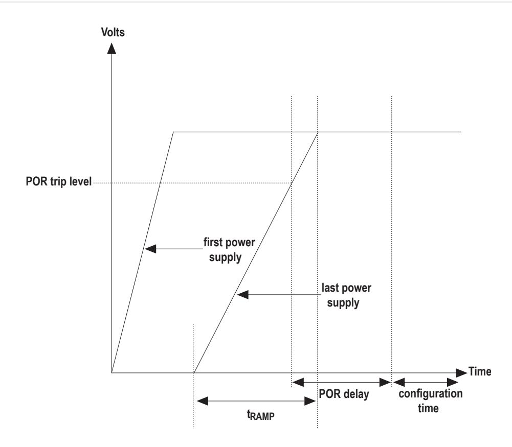

The Cyclone V POR circuitry uses an individual detecting circuitry to monitor each of the configuration-related power supplies independently. The main POR circuitry is gated by the outputs of all the individual detectors. The main POR signal is asserted when the power starts to ramp up. This signal is released after the last ramp-up power reaches the POR trip level during power up.

In user mode, the main POR signal is asserted when any of the monitored power goes below its POR trip level. Asserting the POR signal forces the device into the reset state.

The POR circuitry checks the functionality of the I/O level shifters powered by the VCCPD and VCCPGM power supplies during power-up mode. The main POR circuitry waits for all the individual POR circuitries to release the POR signal before allowing the control block to start programming the device.

**Figure 10-5: Simplified POR Diagram for Cyclone V Devices**

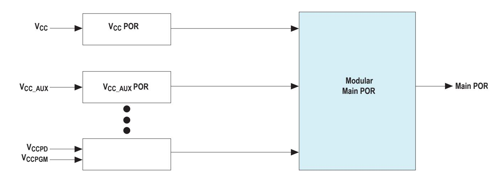

#### POR Specifications, Cyclone V Device Datasheet

Provides more information about the POR delay specification and tRAMP.

#### **Power Supplies Monitored and Not Monitored by the POR Circuitry**

**Table 10-2: Power Supplies Monitored and Not Monitored by the Cyclone V POR Circuitry**

|     | Power Supplies Monitored Power Supplies Not Monitored |
| --- | ----------------------------------------------------- |
| V   | CC_AUX                                                |
| V   | CCBAT                                                 |
| V   | CC                                                    |
| V   | CCPD                                                  |
| V   | CCPGM                                                 |
| V   | CC_HPS                                                |
| V   | CCPD_HPS                                              |
| V   | CCRSTCLK_HPS                                          |
| V   | CC_AUX_SHARED                                         |
|     | V CCE_GXBL                                            |
|     | V CCH_GXBL                                            |
|     | V CCL_GXBL                                            |
|     | V CCA_FPLL                                            |
|     | V CCIO                                                |
|     | V CCIO_HPS                                            |
|     | V CCPLL_HPS                                           |

Note: For the device to exit POR, you must power the VCCBAT power supply even if you do not use the volatile key.

#### Related Information

- Reset Manager, Cyclone**®** V Hard Processor System Technical Reference Manual Provides information from the Hard Processor System Technical Reference Manual.
- [MSEL Pin Settings](#page-244-0) on page 7-2

(41) Only VCCPD3A and VCCPD5A are monitored by POR circuitry.

# **Power Management in Cyclone V Devices Revision History**

| Date         | Version    | Changes                                                                  |
| ------------ | ---------- | ------------------------------------------------------------------------ |
|              | 2017.12.15 | Updated the Power-Up Sequence section title to Power-Up Sequence         |
|              | 2017.09.19 | Added a note to V CCPD in Power Supplies Monitored and Not Monitored     |
|              | 2015.12.21 | Changed instances of Quartus II to Quartus Prime.                        |
| January 2015 | 2015.01.23 | Added V CC_AUX_SHARED to the power supplies monitored by the             |
| January 2014 | 2014.01.10 | Updated the note to the V CCPD_HPS power rail that current transient     |
|              |            | at V CCPD_HPS is observed only when the recommended power-up             |
|              |            | sequence is not followed. To avoid the current transient at V CCPD_HPS , |
| June 2013    | 2013.06.28 | Added power-up sequences for Cyclone V SX, SE and ST devices.            |
| May 2013     | 2013.05.06 | Added link to the known document issues in the Knowledge Base.           |
|              | 2012.12.28 | Added the Power-Up Sequence section.                                     |
| June 2012    | 2.0        | Restructured the chapter.                                                |
| October 2011 | 1.0        | Initial release.                                                         |