**PLANET VIRTUAL BOY**

[HTTP://WWW.VR32.DE](http://WWW.VR32.DE)

# **V810 Seminar**

February 21, 1995

**NEC**

NEC Electronics Inc.

NEC Corporation

# Agenda

**V810 Introduction**

**V810 Architecture**

**Programming Tips & Optimization**

***V810 Seminar***  
V-1123-0295-WW02

**NEC**

# CISC vs. RISC

**CISC**

= Complex Instruction  
Set Computer

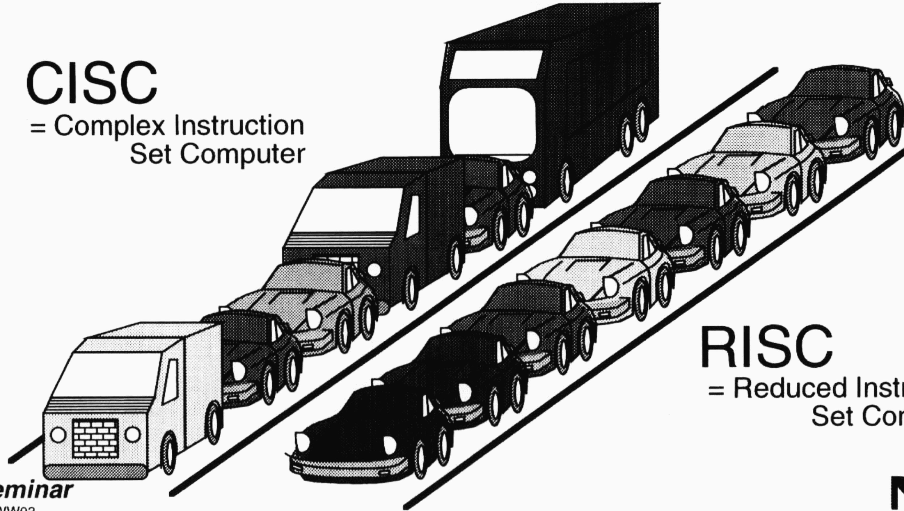

**RISC**

= Reduced Instruction  
Set Computer

**V810 Seminar**

V-1123-0295-WW03

**NEC**

# Load/Store Architecture

CISC

```
add _mem1, _mem2
```

RISC (V810 etc.)

```
load _mem1_disp[rBase], rX
```

```
load _mem2_disp[rBase], rY
```

```
add rX, rY
```

```
store rY, _mem2_disp[rBase]
```

# Code Size Efficiency

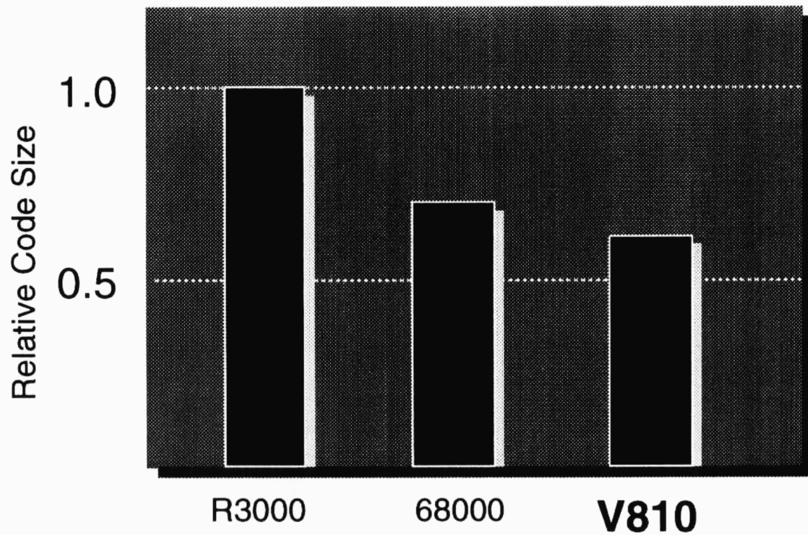

# Pipeline

## Non-pipeline

clock


instruction

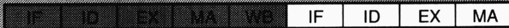

## Pipeline

clock

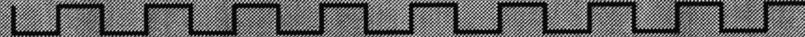

instruction1

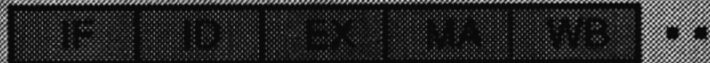

- IF : Instruction Fetch
- ID : Instruction Decode
- EX : Execution
- MA : Memory Access
- WB : Write Back

instruction2


instruction3

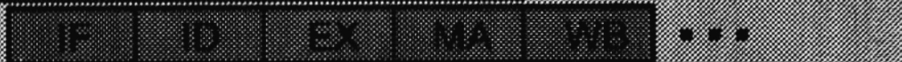

instruction4


instruction5

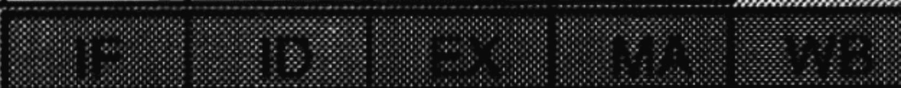

parallel operation of 5-instruction

# Cache Memory

High-performance ; 1 clock access

Parallel Operation ; instruction/data flow

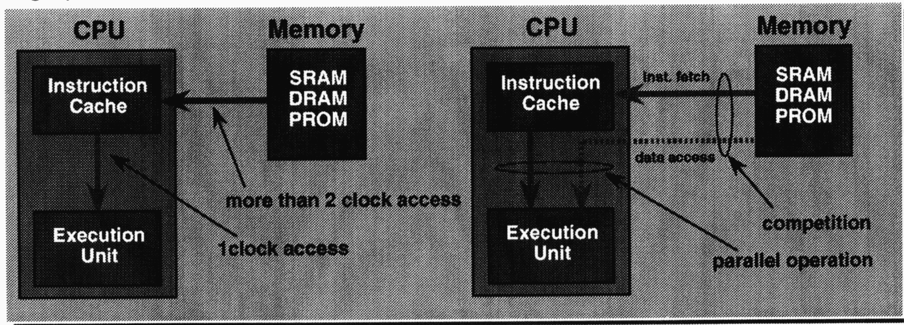

# Fast Interrupt Response

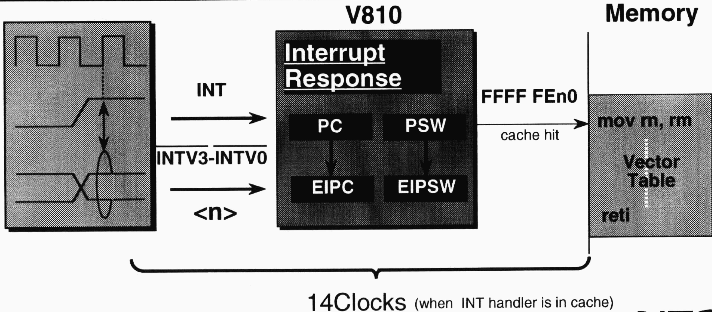

14Clocks (when INT handler is in cache)

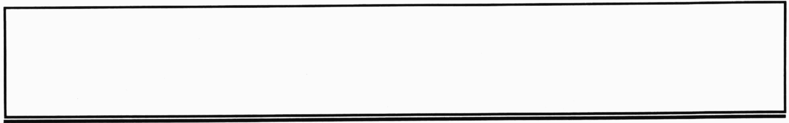

# **V810 Architecture**

***V810 Seminar***  
V-1123-0295-WW09

**NEC**

# Outline of Architecture

- ■ 1K-byte instruction cache memory
- ■ 1 clock pitch pipeline
- ■ 16-bit/32-bit instruction length
- ■ 32 general-purpose registers (32-bit)
- ■ 4G-byte linear address space
- ■ Register/flag hazard interlocked by hardware
- ■ Floating-point operation instructions (IEEE-754)
- ■ Bit string instructions
- ■ 16-levels of high-speed interrupt responses

# Register Set

## Program Registers

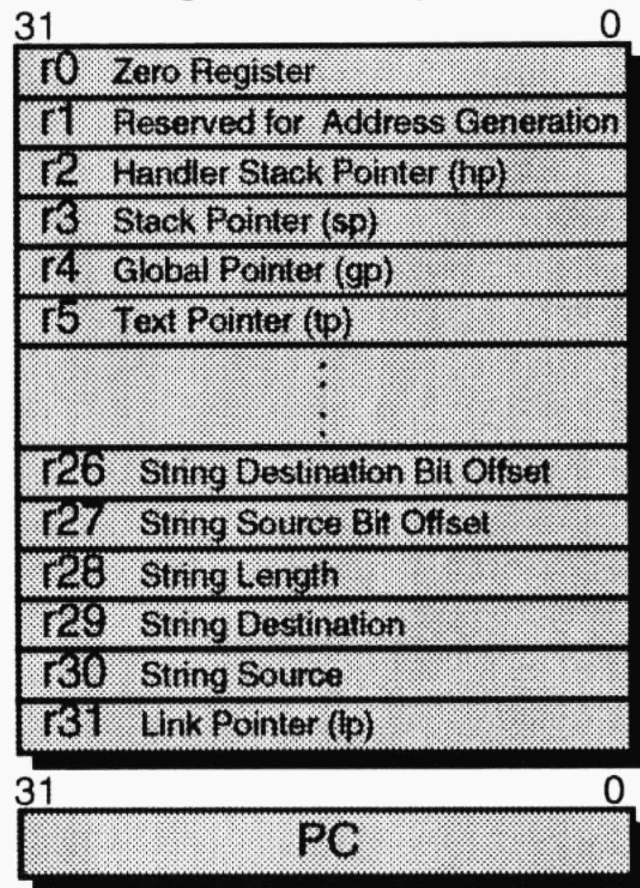

## System Registers

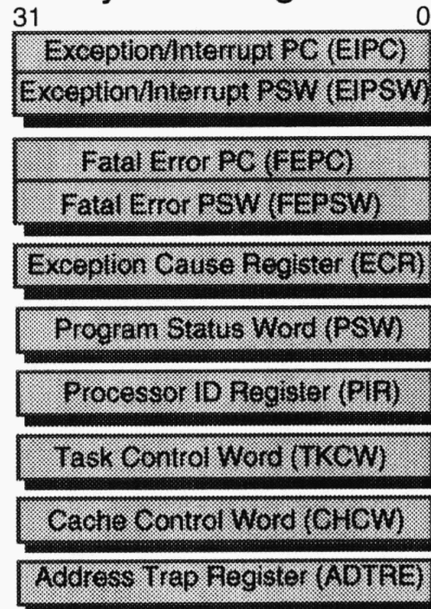

# Data Type

Integer/ Unsigned Integer

Byte (B) 7 0  
MSB LSB

Halfword (H 15 0  
MSB LSB

Word (W 31 0  
MSB LSB

Floating Point number 31 22  
S exponent mantissa

Bit String Bit Length Bit Offset

# Data Alignment

- ● Little Endian
- ● Data must align to their length

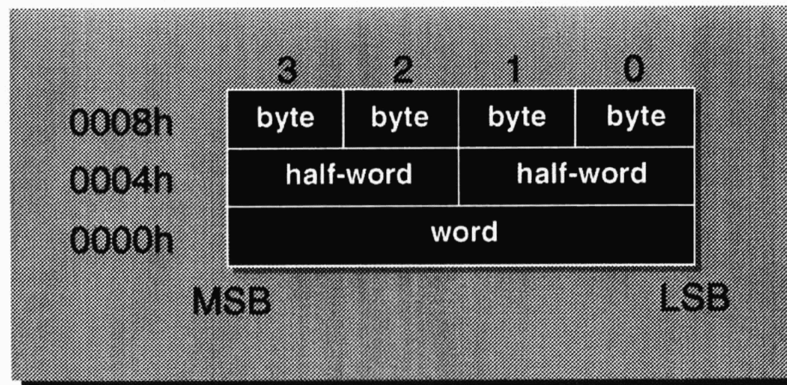

# Instruction Alignment

- ● Little Endian
- ● Half-word(16-bit) alignment

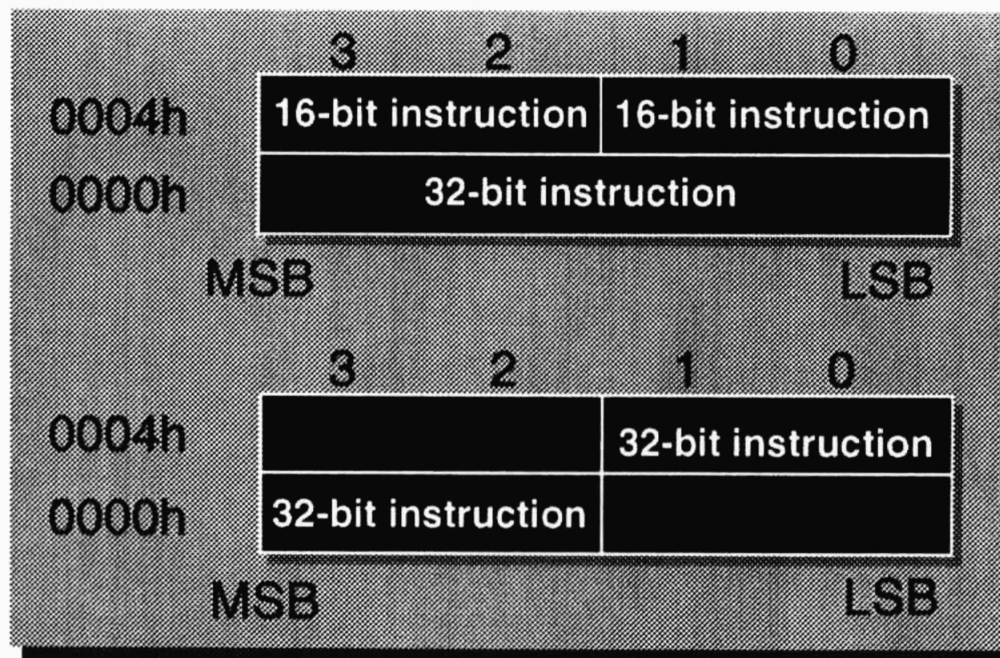

# Instruction Set

| Category             | Function                                                                          | Category  | Function                                                             |
| -------------------- | --------------------------------------------------------------------------------- | --------- | -------------------------------------------------------------------- |
| Data transfer        | General reg $\leftrightarrow$ General reg<br>General reg $\leftrightarrow$ Memory | Bitstring | Move, And, Not, Or, Exclusive-Or, Search                             |
| I/O                  | Input, Output                                                                     | Floating  | Add, Sub, Mul, Div, Compare, Convert                                 |
| Arithmetic / Logical | Signed/ Unsigned add, sub, mul,, div<br>Compare<br>And, Or, Not, Exclusive-Or     | Branch    | Jump, Conditional branch,<br>Jump and link                           |
| Shift                | Logical shift, Arithmetic shift                                                   | Others    | Trap<br>Return from interrupt<br>Nop<br>Halt<br>Compare and exchange |
| System               | System Register load / store                                                      |           |                                                                      |

# Execution Clock

| move                      | mov, movea  | 1   | branch *     | jmp, jr         | 3   |
| ------------------------- | ----------- | --- | ------------ | --------------- | --- |
|                           | ld ***      | 2-5 |              | jal             | 3   |
| load / store              | st ***      | 1-4 |              | Bcc (taken)     | 3   |
|                           |             |     |              | Bcc (not taken) | 1   |
| Integer/logical operation | op reg, reg | 1   | bitstring ** | search ***      | 4   |
|                           | op imm, reg | 1   |              | move, ***       | 12  |
|                           | mul         | 13  |              | logical         |     |
|                           | div         | 38  |              |                 |     |
| Shift                     | sha         | 1   |              |                 |     |
|                           | shl, shr    | 1   |              |                 |     |
| Floating operation        | addf.s      | 24  |              |                 |     |
|                           | subf.s      | 26  |              |                 |     |
|                           | mulf.s      | 27  |              |                 |     |
|                           | divf.s      | 44  |              |                 |     |

- ● This value shows the case that the same instructions are executed
  - \* No hazard and cache hit
  - \*\* Clock for word data
  - \*\*\* 16-bit external data bus

# Instruction Format

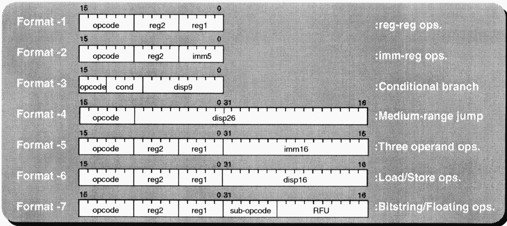

# Offset Addressing Mode

## ■ Load / Store

Id 16bit[base],reg

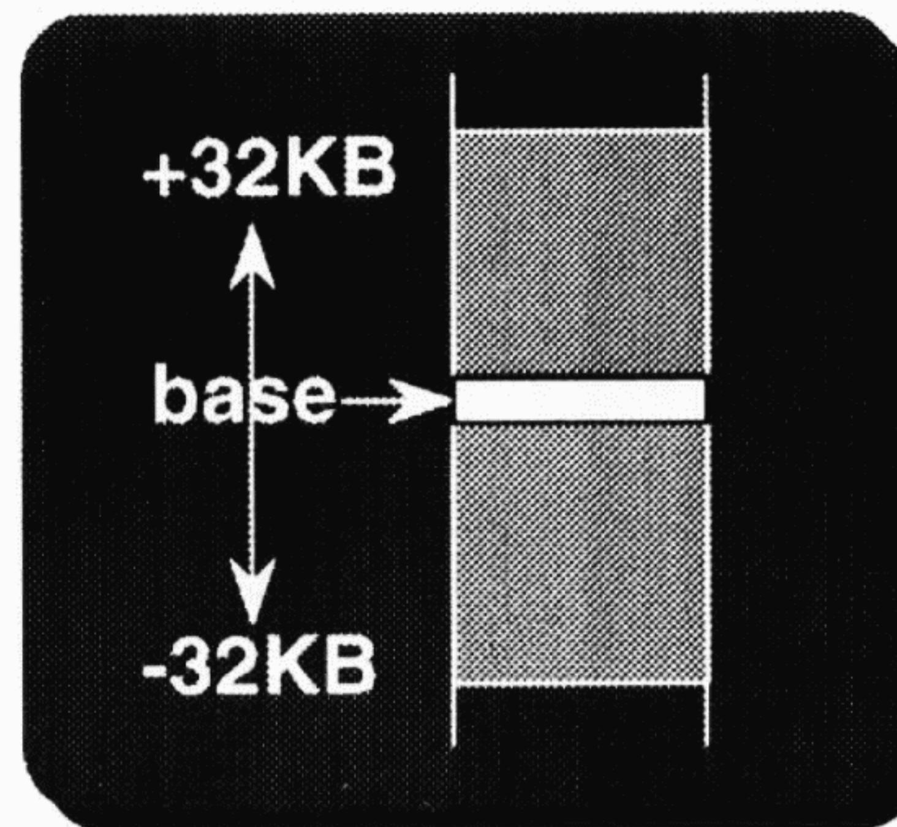

# 32-bit Immediate Load

## ■ Immediate load

movhi imm,reg  
movea imm,reg

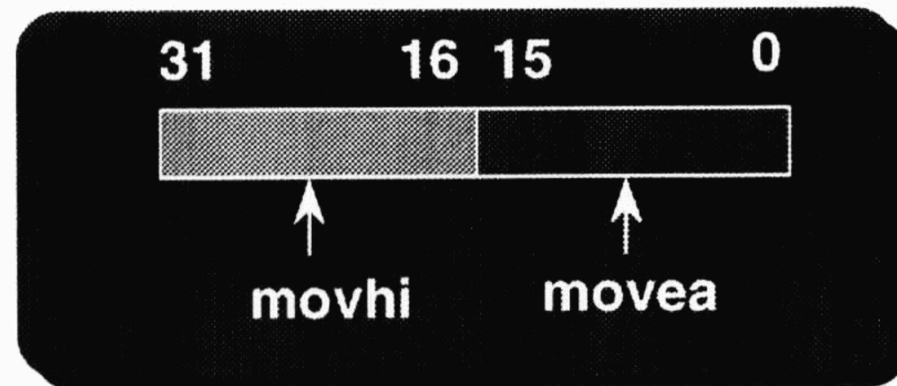

# Function Call Range

## ■ Function call

jal \_func

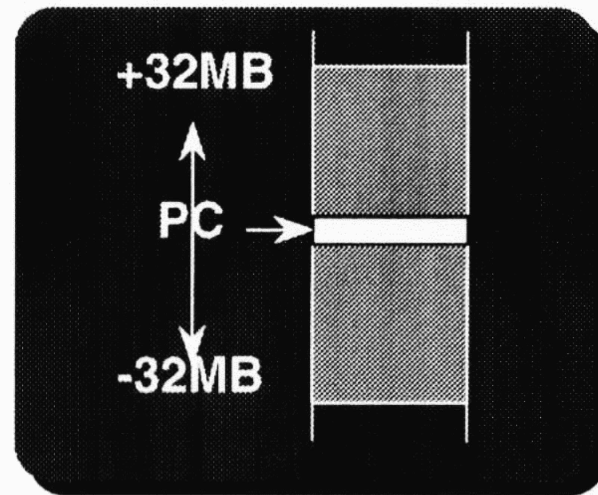

# Flag Operation

|                                    | CY  | OV  | S   | Z   |
| ---------------------------------- | --- | --- | --- | --- |
| mov, movea movhi, ld, st, in, out  | —   | —   | —   | —   |
| add, addi, sub, cmp                | ★   | ★   | ★   | ★   |
| mul, div, mulu, divu               | —   | ★   | ★   | ★   |
| and, or, xor, not, andi, ori, xori | —   | 0   | ★   | ★   |
| shl, shr, sar                      | ★   | 0   | ★   | ★   |
| jmp, jr, jal, Bcond                | —   | —   | —   | —   |

— : Not affected

★: Affected

0 : Cleared to 0

**V810 Seminar**

V-1123-0295-WW21

**NEC**

# Load / In

## ■ Load

--> sign extension

**id.b**

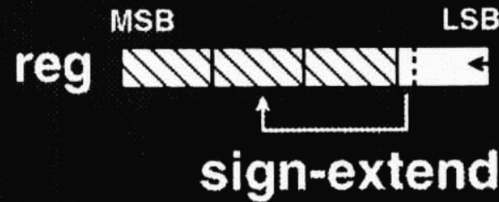

## ■ In

--> zero extension

**in.b**

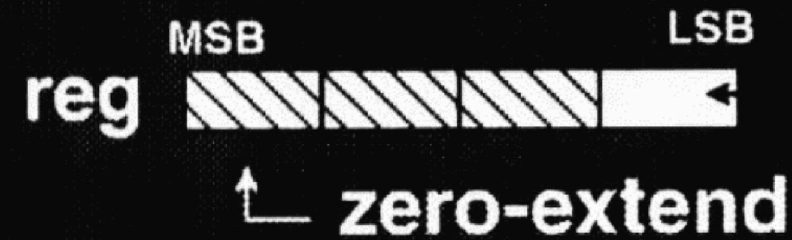

# Function Call

jal op. : return address is saved into r31 register

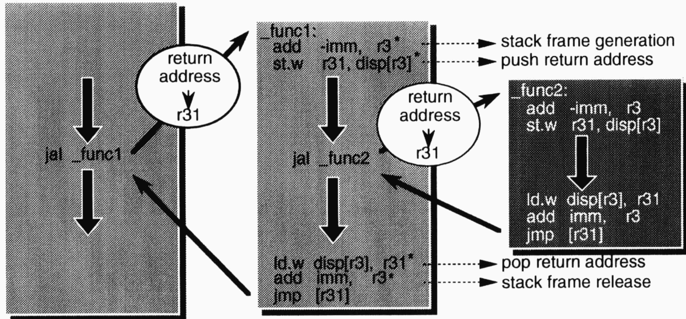

# Bitstring Operation

■ Search      Search for the first 0 or 1 from the specified bit

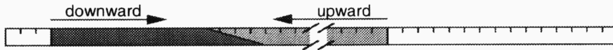

■ Move

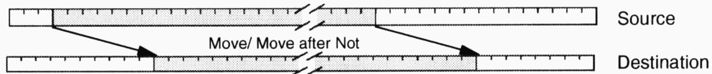

■ Logical operation (BitBLT operation)

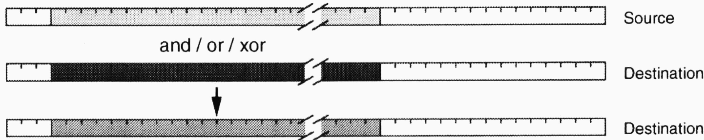

# Floating Point Operation

## ■ Single precision floating point operation (IEEE-754 standard)

- ● Performance = 0.9 M FLOPS (25MHz)
- ● Add, Sub, Mul, Div, Compare (26-44 execution clocks)
- ● Conversion (32 bit float → 32 bit integer)
- ● Floating data are handled in General Registers

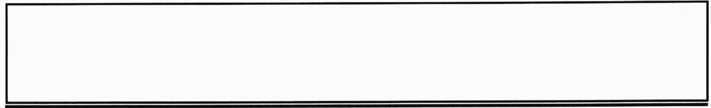

# Interrupt/Exception Flow

***V810 Seminar***  
V-1123-0295-WW26

**NEC**

# Interrupt and Exception

## ■ Interrupt

- ● Maskable interrupt (16 levels)
- ● ~~Non-maskable interrupt~~ NOT IMPROVED

## ■ Exception

- ● Double exception
- ● Trap instruction
- ● Address trap
- ● Reserved op code
- ● Zero division
- ● Floating operation exception (6 types)
- ● Reset

# Maskable Interrupt

Maskable interrupt (INT) occurs

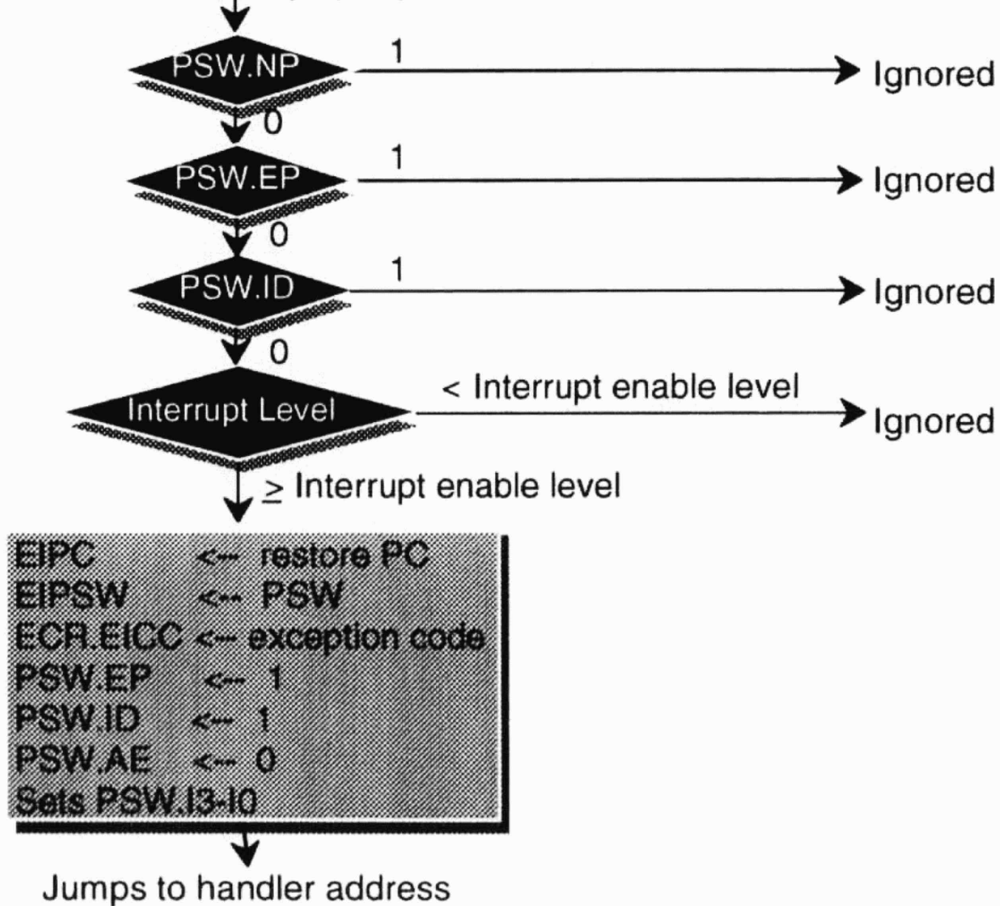

# Non-Maskable Interrupt

Non-maskable interrupt (NMI) occurs

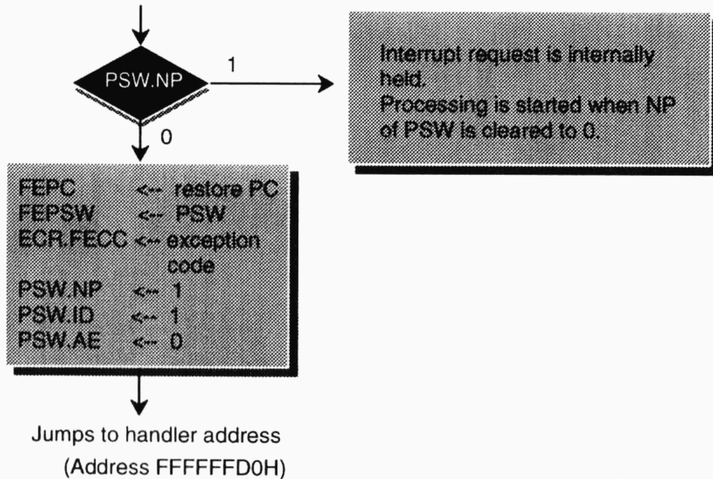

# Exception Processing

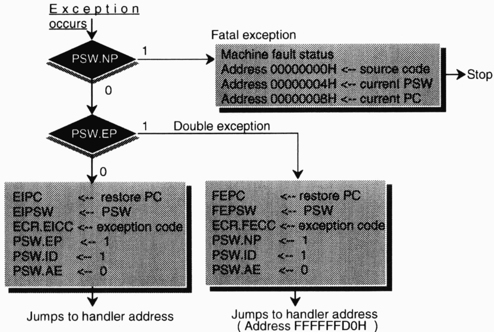

# Return from Exception/Interrupt

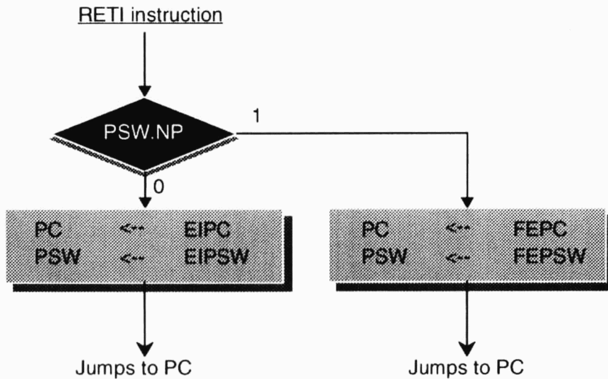

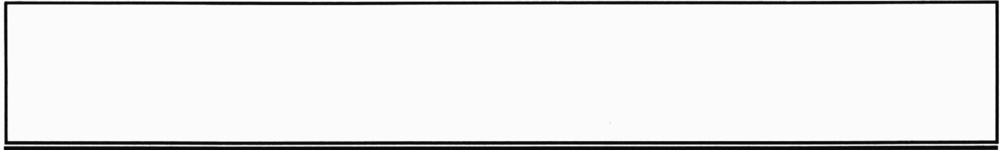

# Important H/W Issues

**V810 Seminar**  
V-1123-0295-WW32

**NEC**

# Interlock

- ■ Interlock support (load/store/flag Interlock).
  - ● Hazard detection & interlock by H/W.
  - ● Transparent to assembler programming & debugging.
  - ● Small code size by reducing excessive instruction.
  - ● Better performance by inserting effective instruction.

- ■ Changing base register just before load/store.

General RISC

assembler inserts  
software wait.

ex.

add r3,r6

→ nop  
Id.w disp[r6],r10

V800

hardware detects hazard  
and stalls pipeline.

ex.

add r3,r6

Id.w disp[r6],r10

- Conditional branch just after flag modification.

General RISC  
assembler inserts  
software wait.

ex.  
cmp r6,r10  
→ nop  
bz

V800  
hardware detects hazard  
and stalls pipeline.

ex.  
cmp r6,r10  
bz

# Cache Implementation

| Capacity       | : 1K bytes       |
| -------------- | ---------------- |
| Mapping method | : Direct mapping |
| Block size     | : 8 bytes        |
| Subblock size  | : 4 bytes        |

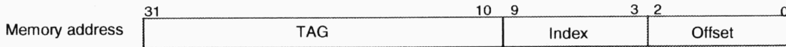

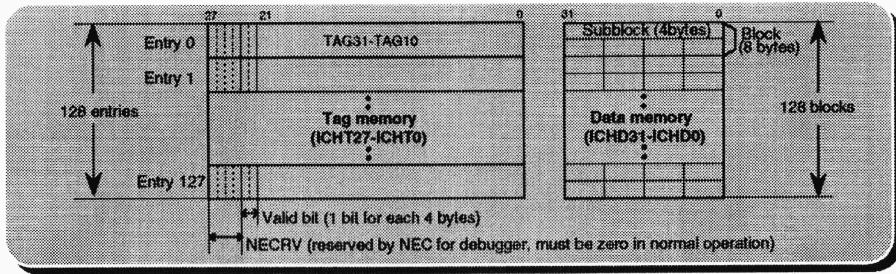

# Cache Tips

- ■ Locality of program execution is very important.
  - ● Loop (with many loop count) -> very good
  - ● Key for performance (ex. INT handler) -> good
  - ● Rarely executing -> poor
  - ● Executing only once (ex. boot routine) -> very poor
- ■ Can control by CHCW(cache control word) register.
  - ● Enable/Disable
  - ● Clear all/part
  - ● Dump/Restore to/from memory

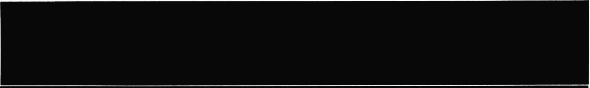

# NEC

NEC Electronics Inc.