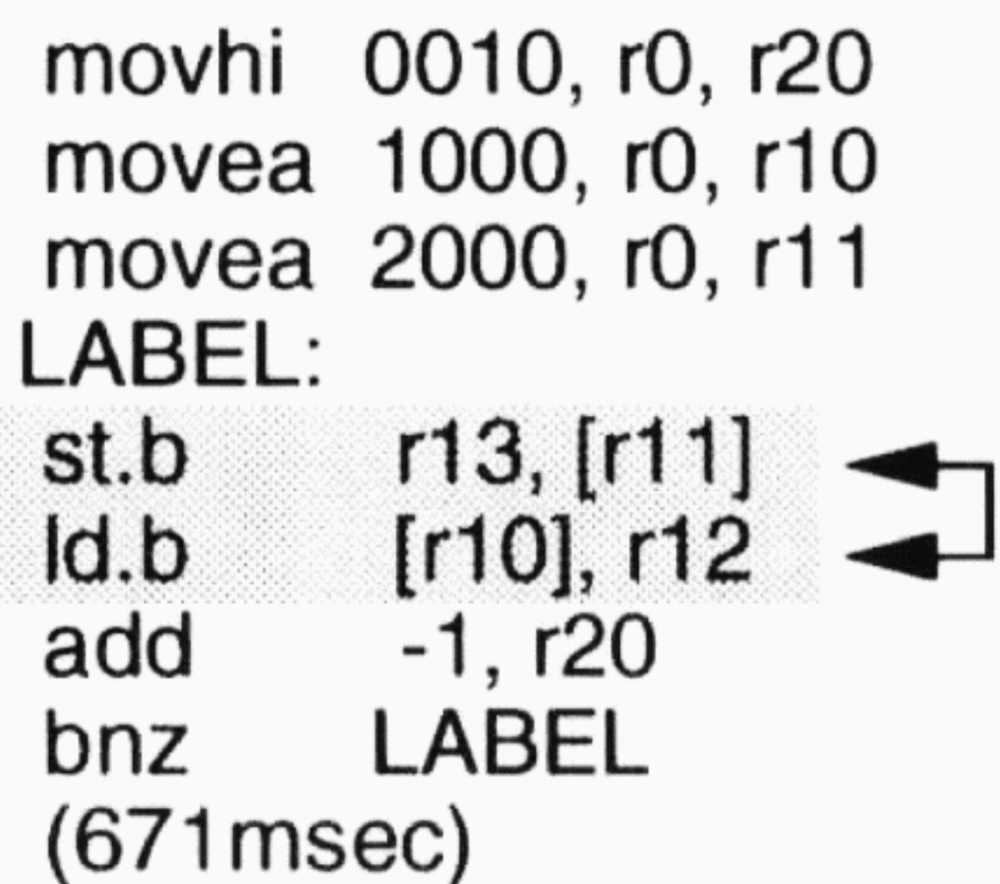
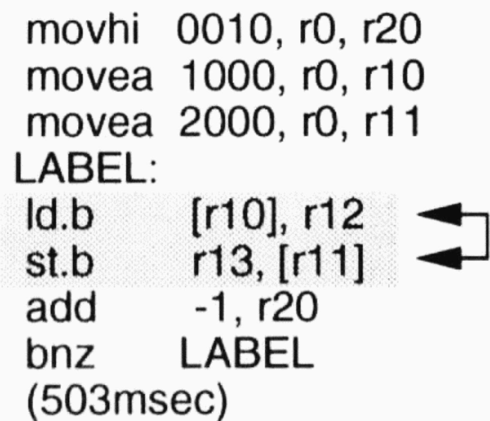
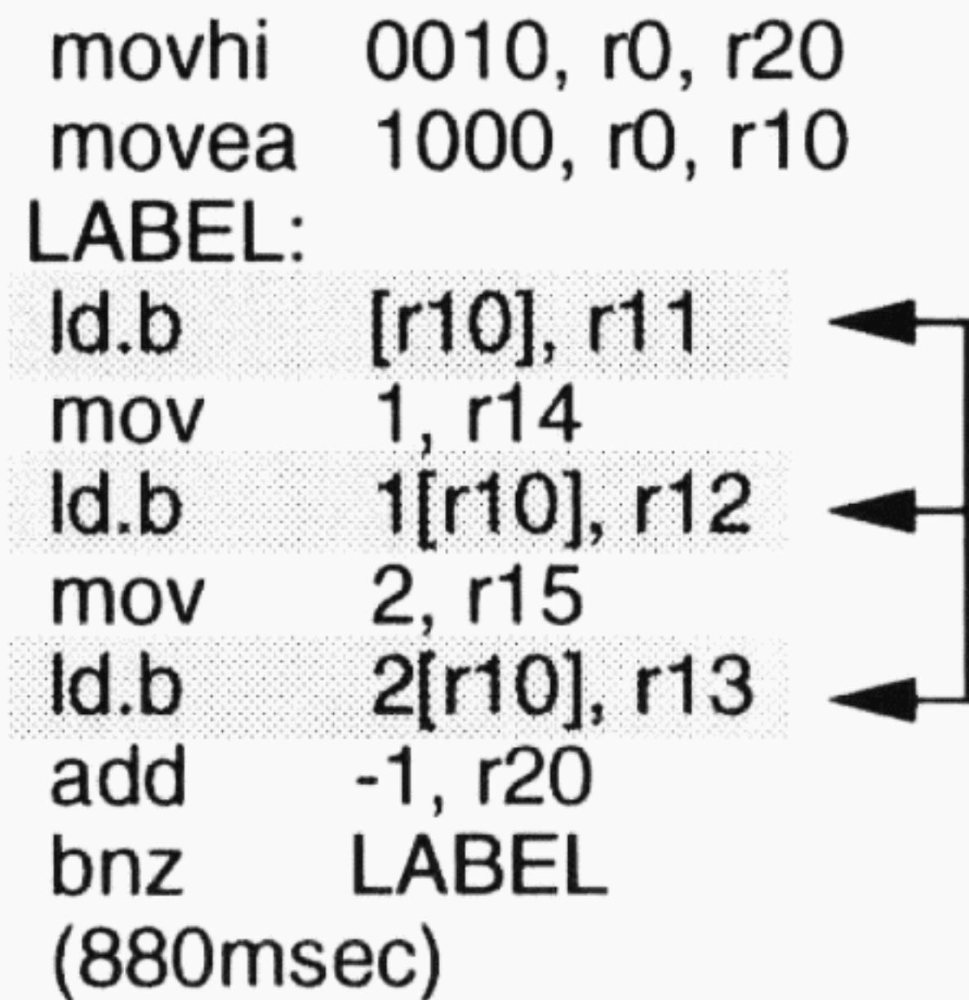
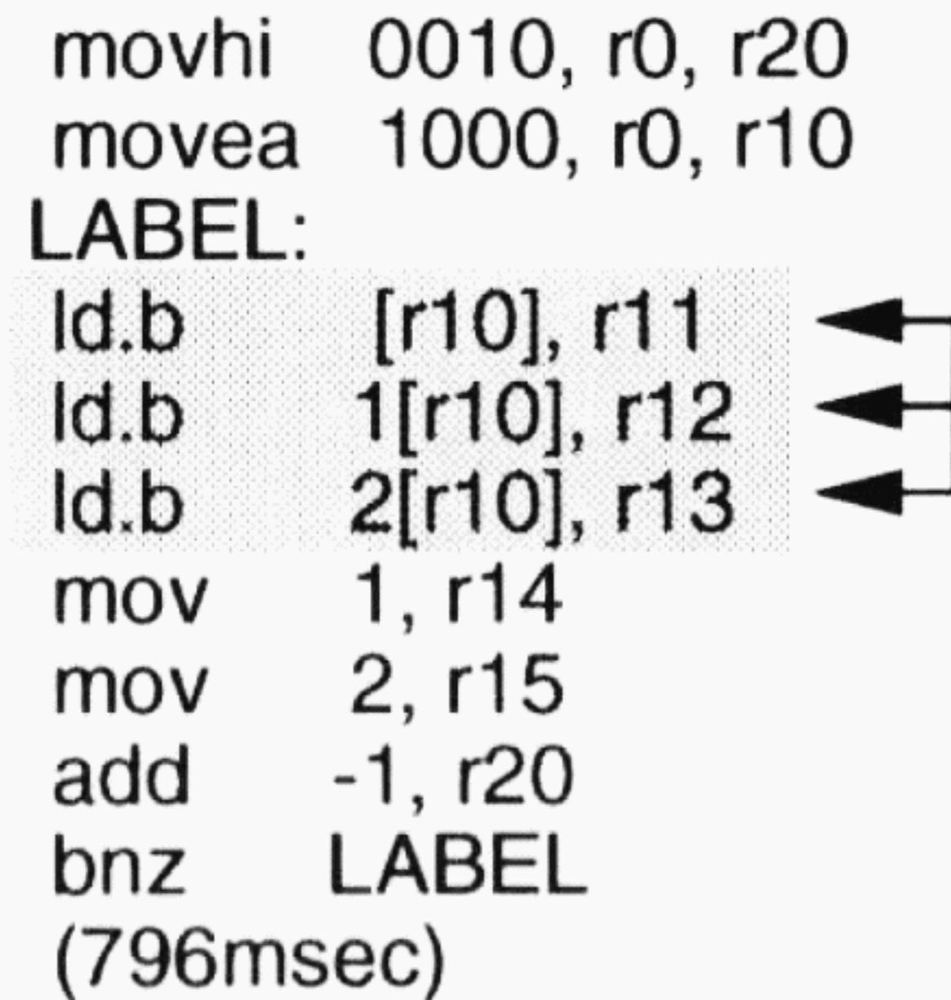
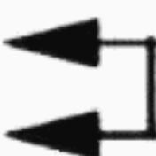
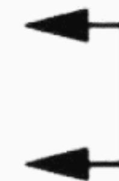
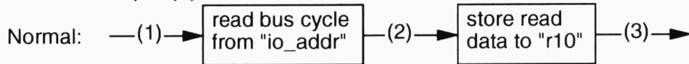
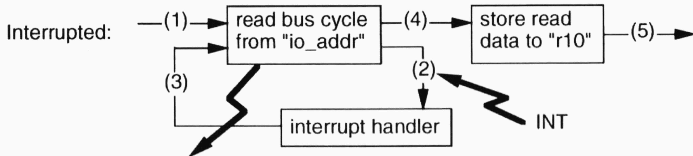

**PLANET VIRTUAL BOY**

[HTTP://WWW.VR32.DE](http://WWW.VR32.DE)

# **V810 Programming**

February 21, 1995

**NEC**

Hitoshi Yamahata  
NEC Corporation

# Assembler Programming

Register Convention

Section

# Register Convention

| r0       | Zero Register                 | — Hardware Zero.                                                             |
| -------- | ----------------------------- | ---------------------------------------------------------------------------- |
| r1       | Reserved for Assembler        |                                                                              |
| r2       | Handler Stack Pointer (hsp)   | Assembler, linker and System reserved. (depend on individual software tools) |
| r3       | Stack Pointer (sp)            |                                                                              |
| r4       | Global Pointer (gp)           |                                                                              |
| r5       | Text Pointer (tp)             |                                                                              |
| r6 ~ r25 |                               |                                                                              |
| r26      | String Destination Bit Offset |                                                                              |
| r27      | String Source Bit Offset      |                                                                              |
| r28      | String Length                 | Parameters and work registers for Bit string Instructions.                   |
| r29      | String Destination            |                                                                              |
| r30      | String Source (*)             |                                                                              |
| r31      | Link Pointer (lp)             | — "Jal" saves return address.                                                |

(\*) r30 also used by "caxi", "mul", "mulu", "div" and "divu".

# Section

0x00000000

|     | .data<br>table:<br>.byte 0x11,0x12<br>:<br>.sdata<br>.sbss<br>.bss<br>.comm buf, 1024, 4<br>.lcomm tmp, 512, 4<br>:<br>.text<br>start:<br>mov 0,r10<br>: |
| --- | -------------------------------------------------------------------------------------------------------------------------------------------------------- |
|     |                                                                                                                                                          |
|     |                                                                                                                                                          |

r4(gp) ->

r5(tp) ->

0xFFFFFFFF

**V810 Seminar**

V-1123-0295-Y04

".text" section  
Program Body

".data" section  
Data with initial value  
.byte  
.hword  
.word

".bss" section  
Data without initial value  
.lcomm  
.comm

SDA section (Small Data Area)  
.sdata/.sbss

Section convention of this example are cases of "ca732".

**NEC**

# Data access using "gp"

Assembler knows "gp" indirect mode by using "\$" instead of "#".  
"gp" indirect keeps displacement small enough to fit 16 bit length.

## Ordinal Data

```
.text  
-- direct access  
ld.w #LINE_DX, r10  
ld.w #LINE_DY, r11  
:  
-- register indirect access  
mov #LINE_DX, r20  
ld.w [r20], r10 <- (*)  
mov #LINE_DY, r20  
ld.w [r20], r11 <- (*)  
:  
.data  
.align 4  
LINE_DX: .word 120  
LINE_DY: .work 80
```

## "gp" Register Indirect

```
.text  
-- direct access  
ld.w $LINE_DX, r10  
ld.w $LINE_DY, r11  
:  
-- register indirect access  
movea $LINE_DX, gp, r20  
ld.w [r20], r10  
movea $LINE_DY, gp, r20  
ld.w [r20], r11  
:  
.sdata  
.align 4  
LINE_DX: .word 120  
LINE_DY: .work 80
```

2

# Pipelining

Load / Store instruction

Flag Hazard

Register Hazard

# Load and Store

Order of adjacent load / store.

- - Load invokes data read bus cycle before execution.
- - Store invokes data write bus cycle after execution.
- -> Order; "st -> ld" causes pipeline jam.





[Condition: V810, 25MHz, 1wait, 16-bit bus width, Cache ON.]  
 Total time of all iteration running 0x100000 loop counts.

# Back-to-back Load

Load instructions are better to be gathered.

-> Load invokes data access bus cycle at the early stage of pipeline.  
So, in pipeline, load has different pipeline sequence from typical instruction.





[Condition: V810, 25MHz, 1wait, 16-bit bus width, Cache ON.]  
Total time of all iteration running 0x100000 loop counts.

# Back-to-back Store

Pipeline flow of Store is isolated from it's data write bus cycle by two write buffer.

-> Better to insert other instructions between two Stores.  
 (Best number of inserting instruction is different in the case of system configuration; i.e., bus width, bus wait, etc.)

```
movhi 0010, r0, r20
movea 1000, r0, r10
LABEL:
st.b      r11, [r10]
st.b      r12, 1[r10]
st.b      r13, 2[r10]
mov       1, r14
mov       2, r15
add       -1, r20
bnz       LABEL
(629msec)
```

```
movhi 0010, r0, r20
movea 1000, r0, r10
LABEL:
st.b      r11, [r10]
mov       1, r14
st.b      r12, 1[r10]
mov       2, r15
st.b      r13, 2[r10]
add       -1, r20
bnz       LABEL
(545msec)
```

# Flag Hazard

Flag hazard interlocks pipeline for 2 clocks.

-> Can avoid interlock by inserting other "effective" instruction (if possible).  
(Nothing is better than inserting "nop" instructions.)

```
movhi   0010, r0, r20
movea   1000, r0, r10
LABEL:
st.b      r0, [r10]
add       1, r10
add       -1, r20
bnz       LABEL
(377msec)
```



```
movhi   0010, r0, r20
movea   1000, r0, r10
LABEL:
st.b      r0, [r10]
add       -1, r20
movea   1, r10, r10
bnz       LABEL
(335msec)
```



[Condition: V810, 25MHz, 1wait, 16-bit bus width, Cache ON.]  
Total time of all iteration running 0x100000 loop counts.

## Register Hazard

## Register hazard interlocks pipeline for 2 clocks.

-> Can avoid interlock by inserting other "effective" instruction (if possible).

(Nothing is better than inserting "nop" instructions.)

| movhi  | 0010, r0, r20 |     |
| ------ | ------------- | --- |
| LABEL: |               |     |
| movea  | 1000, r0, r10 | ↗   |
| st.b   | r0, [r10]     | ↗   |
| mov    | 1, r11        |     |
| add    | r11, r12      |     |
| add    | -1, r20       |     |
| bnz    | LABEL         |     |
|        | (545msec)     |     |

| movhi  | 0010, r0, r20 |     |
| ------ | ------------- | --- |
| LABEL: |               |     |
| movea  | 1000, r0, r10 | ←   |
| mov    | 1, r11        |     |
| add    | r11, r12      |     |
| st.b   | r0, [r10]     | ←   |
| add    | -1, r20       |     |
| bnz    | LABEL         |     |
|        | (461msec)     |     |

[Condition: V810, 25MHz, 1wait, 16-bit bus width, Cache ON.]

Total time of all iteration running 0x10000 loop counts.

## V810 Seminar

V-1123-0295-Y11

## NEC

3

# System level Issue

Interrupt

Cache

# Interrupt Enable/Disable

Interrupt Enable/Disable by PSW.bit12 (ID flag).

-- Disable Interrupt (DI)

| stsr | 5, r1          | -- get system register #5(PSW) |
| ---- | -------------- | ------------------------------ |
| ori  | 0x1000, r1, r1 | -- ID <- "1"                   |
| ldsr | r1, 5          | -- set system register #5(PSW) |

-- Enable Interrupt (EI)

| stsr | 5, r1          | -- get system register #5(PSW) |
| ---- | -------------- | ------------------------------ |
| andi | 0xEFFF, r1, r1 | -- ID <- "0"                   |
| ldsr | r1, 5          | -- set system register #5(PSW) |

# Interrupt Handler

Control is transferred to one of sixteen interrupt handlers according to INT level.

-> ( INT level "n" ; INTn -> 0xFFFFFFEn0).

| 0xFFFFFE00 | jr int_handler_0 |
| ---------- | ---------------- |
| 0xFFFFFE10 | jr int_handler_1 |
| 0xFFFFFE20 | jr int_handler_2 |
|            | :                |
|            | :                |
| 0xFFFFFEF0 | jr int_handler_f |
|            |                  |


Not a handler address here!  
Use V810 instructions.  
(example: "jr")

# Saving Register in INT Handler

Registers, used in interrupt handler, must be saved explicitly.

-- Example: r1,r6,r7 used in interrupt handler.

interrupt\_handler:

```
    add   -4*3, sp      -- expand stack area
    st.w   r1, 4*0[sp]
    st.w   r6, 4*1[sp]
    st.w   r7, 4*2[sp]
    :
    :
    ld.w   4*0[sp], r1
    ld.w   4*1[sp], r6
    ld.w   4*2[sp], r7
    add   4*3, sp      -- restore stack area
    reti                     -- return from interrupt
```

Don't forget to save "r1:assembler work" and "r30:result of mul/div".

# Interrupt Tips (1)

INT handler may destroy contents of current stack.  
 -> Keeping interrupt in mind when changing "sp".

|              | Recommended coding                                                       | Danger if interrupted during push/pop operation                             |
| ------------ | ------------------------------------------------------------------------ | --------------------------------------------------------------------------- |
| push routine | add -4*3, sp<br>st.w r1, 4*0[sp]<br>st.w r6, 4*1[sp]<br>st.w r7, 4*2[sp] | st.w r1, -4*3[sp]<br>st.w r6, -4*2[sp]<br>st.w r7, -4*1[sp]<br>add -4*3, sp |
| pop routine  | ld.w 4*0[sp], r1<br>ld.w 4*1[sp], r6<br>ld.w 4*2[sp], r7<br>add 4*3, sp  | add 4*3, sp<br>ld.w -4*3[sp], r1<br>ld.w -4*2[sp], r6<br>ld.w -4*1[sp], r7  |

# Interrupt Tips (2)

Some type of I/O device must be accessed by "in" instruction.

- -> "load" instruction causes side effect in such I/O device.
- -> keeping in mind difference(\*) between "load" and "in".

(\*): Read bus cycle of "in" starts when execution of "in" started.

Example: pipeline flow of "ld.b #io\_addr, r10".





Read I/O port twice! -> cause side effect to some type of I/O device

# Cache Enable/Disable

Cache Enable/Disable by CHCW (Cache Control Word).

Contents of cache are preserved during disabled period.

```
Enable Cache      -- CHCW.ICE <- "1"
mov            2, r1
ldsr           r1, 24      -- set system register #24(CHCW)
```

```
Disable Cache     -- CHCW.ICE <- "0"
ldsr           r0, 24      -- set system register #24(CHCW)
```

# Cache Tips

Use in loop (with enough loop count).

Control explicitly (enable/disable/clear).

Know well about cache behavior.

-> At the first execution of loop, Cache replace tends to take much more time than Cache-off mode.

-- example; zero clear BUF(100 byte)

mov 100, r10

mov #BUF, r11

mov 2, r1

ldsr r1, 24 -- Cache=ON

LABEL:

st.b r0, [r11]

add 1, r11

add -1, r10

bnz LABEL

ldsr r0, 24 -- Cache=OFF

Cache hit during loop execution

---

4

## Others

Data Alignment

Call / Return

Advanced Technique

# Data Alignment

Data must be aligned to each data size.

- - Word(32 bit) / Half word(16 bit) data -> 32 / 16 bit boundary.

```
-- [Bad] Example
mov   #not_aligned_d, r20
ld.h   [r20], r10
ld.w   [r20], r11
mov   #aligned_c, r20
add   #0x1, r20
jmp   [r20]
aligned_c:
    nop
    :
    .data
    .align 4
    .byte 0xab
not_aligned_d:
    .word 0x12345678
```

```
-- Not aligned address truncated by H/W.
<-- after "ld.h", r10=0x78ab
<-- after "ld.w", r10=0x345678ab
<-- jumped to "aligned_c"
```

# Call / Return

Call function by "jal", and Return by "jmp [lp]".

Save/Restore return address in "lp" by software explicitly.

```
x86
  :
  call PRINT
  :
  :
  PRINT:
  :
  :
  ret
```

```
V810
  :
  jal PRINT -- call function "PRINT"
  :
  :
  PRINT:
  add -4, sp --saving return address
  st.w lp, [sp]
  :
  :
  ld.w [sp], lp --restoring return address
  add 4, sp
  jmp [lp] --return to caller
```

# Pipeline Coding Tip (1)

Branch/Jump disturbs pipeline flow.

-> avoid branch/jump by optimizing code (if possible).

Example: Calculate absolute value.  $r10 = \text{abs}(r10)$ ;

```
-- Normal
cmp   r0, r10
bgt    LABEL
not    r10, r10
add    1, r10
LABEL:
(6/6 clocks)
```

```
-- Optimal
mov   r10, r1
sar    0x1f, r1
xor    r1, r10
sub   r1, r10
(4 clocks)
```

In many cases, it's hard not to use a conditional branch like the above example. Conditional branch requires 3 clocks when taken, 1 clock when not taken. So, one strategy is selecting a branch condition rarely taken.

# Pipeline Coding Tips (2)

Branch/Jump disturbs pipeline flow.

-> avoid branch/jump by optimizing code (if possible).

Example: Get sign. if (  $r10 > 0$  ) then  $r10 = 1$   
else if (  $r10 == 0$  ) then  $r10 = 0$  else  $r10 = -1$ ;

```
-- Normal
cmp   r0, r10
bz     L2
bgt    L1
mov   -1, r10
br     L2
L1:
mov   1, r10
L2:
(8/6/9 clocks)
```

```
-- Optimal
cmp   r0, r10
setfgt  r10
setflt  r1
sub    r1, r10
(4 clocks)
```

"SETFcc reg": if conditions "cc" are satisfied then  $reg = 1$  else  $reg = 0$ .


# NEC

NEC Electronics Inc.